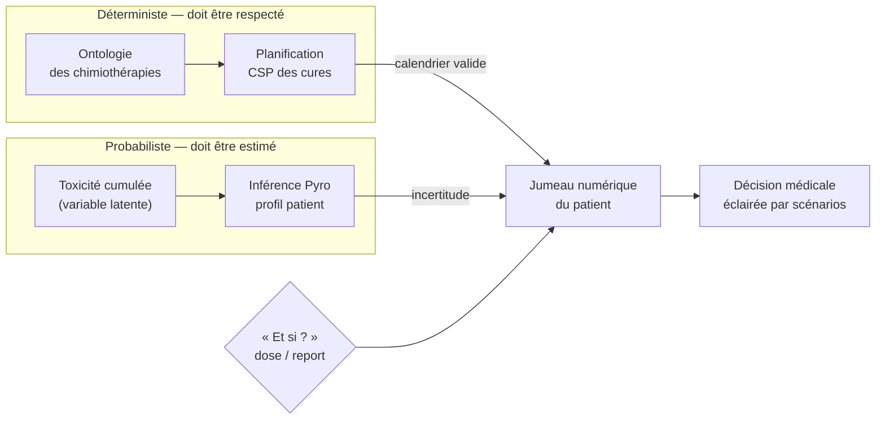

# OncoPlan - Le Protocole Oncologique Adaptatif

## Vue d'ensemble

Ce devoir de contrôle continu combine **IA symbolique** et **programmation probabiliste** à travers un cas d'usage médical : l'aide à la décision en oncologie.

Les deux familles d'IA ne s'opposent pas : elles se répartissent le long d'une **frontière** — ce qui *doit être respecté* (déterministe) et ce qui *doit être estimé* (probabiliste) — pour produire un **jumeau numérique** du patient capable de simuler des scénarios :



### Structure du dossier

```
Oncology-Planning/
├── README.md                           # Ce fichier
├── subject.md                          # Sujet complet
├── student/
│   └── Oncology-Planning.ipynb         # Notebook a completer
├── solution/
│   └── Oncology-Planning.ipynb         # Solution de reference
└── data/
    └── patients_oncology.csv           # Donnees patients
```

---

## Objectifs pédagogiques

1. **Modéliser des connaissances métier** (Ontologie des chimiothérapies)
2. **Résoudre un problème de planification sous contraintes** (Générer un calendrier de cures valide)
3. **Gérer l'incertitude** (Estimer la probabilité de devoir adapter le traitement)
4. **Intégrer ces briques** dans un système décisionnel cohérent

---

## Guide Pyro pour les étudiants

La partie probabiliste utilise **Pyro**, une bibliothèque de programmation probabiliste moderne en Python. Voici les concepts clés à maîtriser.

### Glossaire Pyro

#### A. `pyro.sample("nom", distribution)`
- **En Python classique** : `random.choice([1, 2, 3])` renvoie une valeur (ex: 2).
- **En Pyro** : Cela définit une **Variable Aléatoire**. Lors de l'exécution, cela renvoie une valeur, mais Pyro enregistre en arrière-plan que cette variable existe, s'appelle "nom", et suit telle distribution.

```python
n = pyro.sample("state", dist.Categorical(probs=[0.1, 0.9]))
```

#### B. `pyro.factor("nom", log_prob)`
C'est une instruction pour dire "Ce scénario est plus ou moins probable".
- `0` (log(1)) : "Tout va bien, probabilité normale"
- `-infini` (log(0)) : "Impossible ! Ce scénario est interdit"
- `-10` : "Très peu probable, mais pas impossible"

```python
pyro.factor("contrainte", 0. if x > 0 else -9999.)  # force x > 0
```

#### C. `obs=...` (Observation)
C'est le cœur de l'inférence bayésienne. On dit au modèle "J'ai vu ça".

```python
pyro.sample("mesure", dist.Normal(mu, sigma), obs=valeur_observee)
```

#### D. `poutine.scale(scale=alpha)`
Un amplificateur qui multiplie les log-probs par `alpha`.
- Si `alpha > 1` : les événements probables deviennent *très* probables (modèle confiant)
- Si `alpha < 1` : tout s'aplatit (modèle incertain)

### Structure recommandée du code

```python
class OncoModel:
    def __init__(self):
        # Priors
        pass

    def model(self, doses, observations=None):
        # Définition Pyro du modèle génératif
        pass

    def guide(self, doses, observations=None):
        # Guide variationnel (si SVI)
        pass

    def infer_profil(self, historique_doses, historique_prises_sang):
        # Retourne la probabilité du profil patient
        pass
```

### Indice technique important

Lors de l'inférence SVI, assurez-vous que les données d'entrée (doses) sont alignées avec les observations.

Si vous passez au modèle des doses futures pour lesquelles vous n'avez pas encore d'observation (ex: dose prévue à J21 mais observation seulement jusqu'à J8), Pyro va considérer les observations manquantes comme des variables latentes à inférer.

**Solution** : Tronquez le tenseur des doses pour ne garder que l'historique correspondant aux observations réelles lors de l'étape `svi.step`.

---

## Le modèle probabiliste en détail

### Variables du modèle

- **Variables Latentes (Cachées)** :
  - `ProfilToxicite` : Catégorielle (0: Résistant, 1: Normal, 2: Sensible)
  - `ToxiciteCumulee(t)` : Continue, augmente avec la dose, diminue avec le repos

- **Variables Observées (Mesurées)** :
  - `TauxGlobulesBlancs(t)` : Dépend de la toxicité cumulée

### Approche "Jumeau Numérique"

Le modèle permet de simuler des scénarios :
- "Et si je maintiens la dose prévue ?"
- "Et si je réduis de 25% ?"
- "Et si je reporte d'une semaine ?"

C'est la conception d'un **Jumeau Numérique** du patient, capable d'éclairer la décision médicale.

---

## Ressources de référence

### Notebooks utiles dans le cours
- `Probas/Pyro_RSA_Hyperbole.ipynb` : Exemple d'inférence sur variables latentes
- `SymbolicAI/OR-tools-Stiegler.ipynb` : Contraintes et planification avec OR-Tools

### Bibliographie
- Documentation Pyro : https://pyro.ai/
- OR-Tools : https://developers.google.com/optimization
- Concepts PK/PD (Pharmacocinétique/Pharmacodynamique) pour le contexte médical

---

## Conclusion

Ce cas d'étude réunit deux familles d'IA que l'on oppose souvent, pour montrer qu'elles sont en réalité **complémentaires** dans une chaîne décisionnelle :

- l'**IA symbolique** (ontologie des chimiothérapies, vérification de contraintes, planification CSP des cures) garantit qu'un calendrier de traitement est *valide* — conforme aux règles métier, sans violation de protocole ;
- la **programmation probabiliste** (Pyro) prend en charge ce que le symbolique ne sait pas exprimer : l'*incertitude* sur le profil de toxicité du patient et la probabilité de devoir adapter le traitement.

Leur intégration produit un **jumeau numérique** du patient, capable de simuler « et si ? » (maintenir la dose prévue, réduire de 25 %, reporter d'une semaine) et d'éclairer la décision médicale par des scénarios chiffrés plutôt que par une règle rigide.

La leçon à retenir dépasse l'oncologie : un système décisionnel mûr combine le **déterministe** (ce qui doit être respecté) et le **probabiliste** (ce qui doit être estimé). Savoir où placer cette frontière — et brancher la bonne brique de chaque côté — est au cœur de la conception des systèmes d'aide à la décision sous incertitude.

---

## Notes pour les enseignants

### Genèse du sujet
Ce sujet a été conçu pour combiner :
1. **Symbolique avancé** : Ontologies, vérification de contraintes médicales
2. **Planification** : OR-Tools/Z3 pour le calendrier des cures
3. **Probabiliste** : Pyro pour l'adaptation personnalisée

### Points d'attention
- Le squelette fournit une structure robuste pour Pyro (souvent difficile à démarrer)
- Les contraintes CSP sont pré-formalisées en langage naturel
- La partie Bonus (Smart Contract) est optionnelle

### Barème indicatif
- Ontologie & Vérification : 4 pts
- Planification CSP : 6 pts
- Modèle Pyro (Définition) : 4 pts
- Inférence & Décision : 4 pts
- Qualité du code & Bonus : 2 pts
