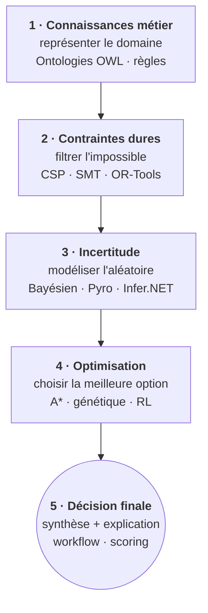

# CaseStudies - Études de cas interdisciplinaires

<!-- CATALOG-STATUS
series: CaseStudies
pedagogical_count: 6
breakdown: Diagnostic-Medical=2, Oncology-Planning=2, SmartGrid-Energy=2
maturity: PRODUCTION=4, BETA=2
-->

> **Note éditoriale (counts)** : Le marqueur `CATALOG-STATUS` ci-dessus est autoritatif pour le compte agrégé (6 notebooks canoniques). Pour la **décomposition langagière par kernel** (`metadata.kernelspec.language`), ce README reste autoritatif car la granularité kernel n'est pas dans le marqueur agrégé ; elle est documentée ici par lecture directe des kernelspecs au 10/07/2026 :
>
> **6 Python = python/python3 = 6/6 mono-kernel Python 100% ✓** (6 fichiers `*.ipynb` canoniques au total sur disque — 3 cas × {student + solution} : Diagnostic-Medical×2, Oncology-Planning×2, SmartGrid-Energy×2 — aucun `_output.ipynb` Papermill dans ce hub, exécution via MCP Jupyter `nbconvert --execute --to notebook` ou `jupyter nbconvert --execute --inplace`).
>
> CaseStudies est un cas de **mono-kernel Python 100%** : les trois projets combinent des instruments hétérogènes (Z3, A* `heapq`, génétique, OR-Tools CP-SAT, rdflib, Pyro probabiliste, scipy multi-objectif) implémentés tous en Python, soit via libraries SOTA authentiques (`z3-solver`, `ortools`, `rdflib`, `pyro-ppl`, `torch`, `numpy`, `pandas`), soit from-scratch en Python pur. C'est une **variante L392 #7 NEW** : deuxième cas de mono-kernel Python 100% après RL (#5927 c.403), tous deux owner-po-2025 strict. Contrairement à ML (#5915) qui a des jumeaux C#/Python intra-sous-série, Probas (#5916) qui a une mixité intra-série multi-paradigme (.NET C# + Python), QC (#5917) cloisonnée par sous-série, et Sudoku (#5923 c.388) qui a une mixité jumeaux dominante + 1 compagnon Lean intra-hub, CaseStudies a une uniformité mono-paradigme Python avec **6 paradigms combinatoires distincts** (symbolique CSP, A* recherche, génétique, OR-Tools CP-SAT, rdflib KG, Pyro bayésien). Registre EPIC #3801 entry #010 (#5930, stacked sur #5925, await merge).
>
> **Régénération du marqueur** : `catalog-cron.yml` (cron quotidien 03:37 UTC sur `main`, commit `[skip ci]` par `github-actions[bot]`) — le bloc ci-dessus est régénéré automatiquement, ne pas le modifier manuellement sur une branche feature (catalog-pr-hygiene R1).

[← Notebooks](../README.md) | [↑ ..](../README.md) | [→ QuantConnect](../QuantConnect/README.md)

Études de cas interdisciplinaires combinant plusieurs domaines de l'IA dans des projets appliqués.

La force des études de cas réside dans leur capacité à **fusionner les techniques apprises en silos** : un solveur SMT (Search), un algorithme génétique (Sudoku), une ontologie OWL (SemanticWeb) et un modèle bayésien (Probas) ne valent pas grand chose isolément face à une question réelle. C'est leur combinaison, orchestrée autour d'un problème métier (diagnostic médical, protocole oncologique, dispatch énergétique), qui transforme un catalogue d'outils en **système décisionnel cohérent**. Les trois projets de cette série illustrent ce passage : chacun mobilise **3 paradigmes IA** complémentaires qui se renforcent mutuellement plutôt que de se concurrencer.

## Statistiques catalogue à jour

| Sous-projet | Notebooks | Statut | Paradigmes mobilisés |
|-------------|-----------|--------|----------------------|
| [Diagnostic-Medical](Diagnostic-Medical/) | 2 (student + solution) | PRODUCTION | A* + génétique + Z3 (CSP) |
| [Oncology-Planning](Oncology-Planning/) | 2 (student + solution) | PRODUCTION | Ontologie + CSP/OR-Tools + Pyro (Pyro probabiliste) |
| [SmartGrid-Energy](SmartGrid-Energy/) | 2 (student + solution) | BETA | CP-SAT + bayésien (risque défaillance) + multi-objectif (coût/CO2) |
| **Total** | **6 notebooks** | **PRODUCTION=4, BETA=2** | 4 paradigmes : symbolique (CSP/ontologie) + statistique (probabiliste/évolutionnaire) + recherche (A*) + optimisation (CP-SAT) |

Chaque notebook solution fait l'objet d'une **validation par assertions** (cellule terminale `tests_automatises()` ou prints discriminants) dans son sous-dossier `solution/` ; le template `student/` porte les stubs conformes (règle C.1 : `pass` / `return None` / `print("Exercice à compléter")` / jamais `raise NotImplementedError`) et reste exécutable end-to-end. La cohérence est garantie par `requirements.txt` au racine (`numpy`, `pandas`, `matplotlib`, `seaborn`, `z3-solver`, `rdflib`, `pyro-ppl`, `torch`, `ortools` — 9 dépendances communes aux 3 cas).

## Écosystème MCP et parenté cross-lane

Cette série est un **point de convergence** des autres séries du dépôt : chaque étude de cas mobilise les couches atomiques du cursus. Le tableau ci-dessous fait la cartographie explicite des paradigmes atomiques combinés :

| Étude de cas | [Search](../Search/README.md) | [Sudoku](../Sudoku/README.md) | [SymbolicAI](../SymbolicAI/README.md) | [Probas](../Probas/README.md) | [ML](../ML/README.md) |
|---|---|---|---|---|---|
| Diagnostic-Medical | A* (`Part1-Foundations`) | Génétique ([`Sudoku-3-Genetic-Python`](../Sudoku/Sudoku-3-Genetic-Python.ipynb)) | — | — | — |
| Oncology-Planning | CSP / CP-SAT (`Part2-CSP`) | — | Ontologie OWL ([SemanticWeb](../SymbolicAI/SemanticWeb/README.md)) | Bayésien / Pyro | — |
| SmartGrid-Energy | CP-SAT / OR-Tools (`Part2-CSP`) | — | — | Bayésien (risque) | — |

Trois familles d'**outils d'infrastructure** MCP rendent les projets interopérables :

1. **MCP Jupyter** (`mcp__jupyter-papermill__*`) — exécution kernelisée des notebooks. Note bug #835 : ne doit **jamais** être appelé naïvement ; re-exécution = `nbconvert --execute` Bash `timeout`-wrap.
2. **MCP QC Cloud** (`mcp__qc-mcp-lite__*`) — backtest cloud pour notebooks QuantConnect. Les CaseStudies n'en dépendent pas directement, mais le pipeline QC illustre la même discipline de composition (contraintes + incertitude + optimisation) dans un autre domaine.
3. **Validation pre-commit** (`.pre-commit-config.yaml`) — gitleaks + notebook validator (règle C.2 : outputs cohérents) bloquent les PRs qui dégraderaient les contrats inter-séries.

**Parenté cross-lane** : CaseStudies ne maintient pas un dépôt isolé, mais sert de **hub d'intégration** pour ~8 séries atomiques. Toute évolution d'une série fondamentale (nouvelle méthode de recherche dans Search, nouveau solveur dans Probas, nouveau moteur dans SymbolicAI) enrichit potentiellement les projets CaseStudies — c'est l'**effet de composition** qui justifie le découpage en couches plutôt qu'en silos.

## À qui s'adresse cette série

Cette série s'adresse aux **étudiants en fin de cycle** (M1/M2 ou équivalent ingénieur) ayant déjà parcouru les séries fondamentales (Search, SymbolicAI, Probas, SemanticWeb). Elle constitue typiquement un **devoir de contrôle continu intégrateur** ou un projet de groupe couvrant plusieurs paradigmes IA dans un même livrable. La pédagogie privilégie l'**autonomie** : chaque projet propose un template étudiant minimal et une solution de référence pour autoévaluation.

Les profils types visés :

- Étudiants en informatique ou IA construisant un portefeuille de projets multi-paradigmes
- Développeurs/data scientists explorant l'intégration de techniques hétérogènes (symbolique + probabiliste)
- Enseignants cherchant des **devoirs d'intégration** mobilisant 3-4 séries du cursus

## Pourquoi des études de cas interdisciplinaires ?

L'IA réelle ne fonctionne quasi-jamais avec un seul paradigme. Un assistant diagnostic exploite à la fois des **règles symboliques** (contre-indications absolues), des **modèles probabilistes** (incertitude sur les symptômes), des **algorithmes de recherche** (exploration de l'arbre de diagnostics) et des **contraintes formelles** (validation par solveur). Réduire ce problème à une seule technique conduit à des systèmes brittle (règles only), opaques (deep learning only) ou inutilisables (probabiliste only sans contraintes dures).

### Le principe d'intégration

| Couche | Rôle | Techniques | Exemple OncoPlan |
|--------|------|-----------|------------------|
| **Connaissances métier** | Représenter le domaine | Ontologies OWL, règles | Médicaments, interactions, contre-indications |
| **Contraintes dures** | Filtrer l'impossible | CSP, SMT, OR-Tools | Doses cumulées, délais entre cures |
| **Incertitude** | Modéliser l'aléatoire | Bayésien, Pyro, Infer.NET | Réponse patient, toxicité prédite |
| **Optimisation** | Choisir la meilleure option | A*, génétique, RL | Calendrier optimal de cures |
| **Décision finale** | Synthèse et explication | Workflow, scoring | Recommandation justifiée au clinicien |

Une seule couche ne suffit pas, et l'**ordre de composition** importe : on filtre avant d'optimiser, on modélise l'incertitude avant de valider sous contraintes. Les études de cas matérialisent ces patterns d'architecture.

Le pipeline ci-dessous rend visible cet ordre : chaque couche alimente la suivante, et l'inverser produit un système soit trop rigide (contraintes avant connaissance du domaine), soit trop flou (décision avant modélisation de l'incertitude).



### Le pattern "twin numérique"

Les trois projets reposent sur un **modèle simulé** : un objet logiciel qui représente l'état d'un système — état clinique du patient ou réseau électrique — et réagit à des interventions (diagnostic proposé, traitement appliqué, dispatch injecté). Ce pattern, appelé **jumeau numérique** (digital twin), est devenu central en santé numérique, en industrie 4.0 et en simulation environnementale. L'apprendre sur 10 patients diabétiques (Diagnostic-Medical), un cas oncologique (Oncology-Planning) ou un réseau électrique sous incertitude (SmartGrid-Energy) prépare directement aux applications professionnelles.

## Structure

```text
CaseStudies/
├── Diagnostic-Medical/    # Système de diagnostic multi-contraintes (A*, génétique, Z3)
│   ├── README.md          # Fiche projet
│   ├── subject.md         # Sujet du devoir (CC1)
│   ├── student/           # Template étudiant
│   ├── solution/          # Solution de référence
│   └── data/              # Données de test (patients.csv, 10 patients diabète type 2)
├── Oncology-Planning/     # Planification oncologique (CSP, Pyro probabiliste, ontologie)
│   ├── README.md          # Fiche projet
│   ├── subject.md         # Sujet du devoir (CC2)
│   ├── student/           # Template étudiant
│   ├── solution/          # Solution de référence
│   └── data/              # Données patients oncologie (patients_oncology.csv)
├── SmartGrid-Energy/      # Dispatch énergétique sous incertitude (CP-SAT, bayésien, multi-objectif)
│   ├── README.md          # Fiche projet
│   ├── subject.md         # Sujet du devoir (CC3)
│   ├── student/           # Template étudiant
│   └── solution/          # Solution de référence (3 centrales, 6 heures, réseau jumeau)
└── requirements.txt       # Dépendances communes (9 packages)
```

## Projets

### Diagnostic Médical

Système de diagnostic médical combinant recherche informée (A*), algorithmes génétiques, et validation par contraintes (Z3). Application au diabète de type 2 avec 10 patients de test.

- **Technologies** : Python, z3-solver, heapq, pandas
- **Concepts** : Recherche A*, algorithmes génétiques, CSP, validation par contraintes

[README complet](Diagnostic-Medical/README.md) | 2 notebooks (student + solution) | ~3-4h

### Oncology Planning (OncoPlan)

Protocole oncologique adaptatif combinant IA symbolique (ontologie, CSP/OR-Tools) et programmation probabiliste (Pyro) pour l'aide à la décision en oncologie. Modèle de jumeau numérique patient.

- **Technologies** : Python, pyro-ppl, ortools, pandas
- **Concepts** : Ontologies, planification CSP, inférence bayésienne, programmation probabiliste

[README complet](Oncology-Planning/README.md) | 2 notebooks (student + solution) | ~3-4h

### SmartGrid Energy

Ordonnancement de la production électrique (unit commitment) sous incertitude renouvelable, combinant programmation par contraintes (OR-Tools CP-SAT), inférence bayésienne du risque de défaillance et optimisation multi-objectif (coût + CO2 + risque). Jumeau numérique d'un réseau à 3 centrales sur 6 heures.

- **Technologies** : Python, ortools (CP-SAT), numpy
- **Concepts** : Unit commitment NP-difficile, modèle bayésien de l'incertitude, optimisation multi-objectif, architecture en couches (filtrer > modéliser > optimiser)

[Sujet](SmartGrid-Energy/subject.md) | 2 notebooks (student + solution) | ~3-4h

## Acquis d'apprentissage

À l'issue de cette série, l'étudiant est capable de :

### Compétences techniques

- **Concevoir une architecture IA hybride** combinant raisonnement symbolique (règles, ontologies, contraintes) et apprentissage statistique (modèles probabilistes, optimisation évolutionnaire)
- **Modéliser un domaine métier** avec un vocabulaire formel (classes, propriétés, axiomes) sans confondre représentation et inférence
- **Décomposer un problème complexe** en sous-problèmes adressés par la technique la plus adaptée (filtrage par contraintes, recherche heuristique, inférence bayésienne)
- **Composer plusieurs solveurs** (Z3, OR-Tools, Pyro, A*) dans un pipeline cohérent où la sortie de l'un alimente l'autre
- **Valider un système décisionnel** sur des cas réels (patients diabétiques, protocoles oncologiques) avec métriques de qualité et explicabilité

### Compétences méthodologiques

- **Identifier les couches d'un système IA** (données -> connaissances -> contraintes -> modèles -> décision) et leur ordre de composition
- **Choisir entre approches déterministes et probabilistes** selon que les contraintes sont absolues ou négociables
- **Justifier le recours à l'IA hybride** plutôt qu'à un seul paradigme : robustesse, explicabilité, conformité réglementaire
- **Documenter un projet IA interdisciplinaire** : architecture, choix algorithmiques, limites connues, périmètre de validation

### Compétences applicatives (domaine médical)

- **Manipuler des données patient** (CSV structurées, anonymisation, intégrité des CSP)
- **Encoder un protocole thérapeutique** sous forme d'ontologie + contraintes (délais, doses, interactions)
- **Estimer une incertitude clinique** via inférence bayésienne stochastique variationnelle (`pyro.infer.SVI` + `Trace_ELBO` en Pyro)
- **Construire un jumeau numérique** simulant la réaction d'un patient à une intervention

## Concepts clés transversaux

Cette série consolide cinq concepts qui reviennent dans tous les systèmes IA appliqués modernes :

| Concept | Définition | Manifestation dans CaseStudies | Cours connexes |
|---------|------------|--------------------------------|----------------|
| **Architecture hybride** | Pipeline combinant techniques symboliques et statistiques | Diagnostic : A* + GA + Z3 / OncoPlan : Ontologie + CSP + Pyro / SmartGrid : CP-SAT + Bayésien + multi-objectif | [SymbolicAI](../SymbolicAI/README.md), [Probas](../Probas/README.md) |
| **Jumeau numérique** | Modèle logiciel d'un objet/personne/système réagissant à des interventions | Modèle patient (état, paramètres bio, réponse au traitement) / réseau électrique (charge, pannes) | [RL](../RL/README.md), [Probas](../Probas/README.md) |
| **Knowledge engineering** | Formalisation explicite des connaissances métier en classes/règles | Ontologie oncologique, règles de diagnostic | [SemanticWeb](../SymbolicAI/SemanticWeb/README.md) |
| **Inférence sous contraintes** | Résolution conjointe d'un problème avec contraintes dures et incertitudes | OncoPlan : calendrier valide ET probable | [Search](../Search/README.md), [SymbolicAI/Tweety](../SymbolicAI/Tweety/README.md) |
| **Décision sous incertitude** | Choisir entre options avec résultats probabilistes et regret asymétrique | OncoPlan : adapter ou non un protocole / SmartGrid : dispatch sous risque de panne | [Probas](../Probas/README.md), [GameTheory](../GameTheory/README.md) |

Ces concepts ne sont pas exclusifs au domaine médical : on les retrouve à l'identique en **finance algorithmique** (jumeau de marché + contraintes réglementaires + signaux probabilistes), **logistique** (jumeau de flotte + planification + prévisions) et **maintenance prédictive** (jumeau équipement + règles métier + Bayésien). Le choix du médical est pédagogique : domaine riche en contraintes formelles et en incertitude irréductible.

## Pour aller plus loin

### Articles de référence

- **Khan et al. (2021)** - *Hybrid AI for Clinical Decision Support: A Survey* — panorama des architectures hybrides en santé numérique
- **Goodall et al. (2022)** - *Digital Twins in Healthcare: Trends, Applications, and Implementation Challenges* — état de l'art jumeaux numériques patient
- **Hooker (2012)** - *Integrated Methods for Optimization* — fondements de la composition CP/SAT/MILP utilisée en OncoPlan
- **Bingham et al. (2019)** - *Pyro: Deep Universal Probabilistic Programming* — paper de référence pour la couche probabiliste

### Extensions possibles

| Extension | Description | Techniques mobilisées |
|-----------|-------------|----------------------|
| **Apprentissage par renforcement** | Formuler OncoPlan en MDP : état patient -> action protocole -> récompense survie | PPO, DQN ([RL](../RL/README.md) notebooks 5-6) |
| **LLM en boucle** | Utiliser un LLM pour générer des hypothèses diagnostiques, valider par Z3 | [Sudoku](../Sudoku/README.md) notebook 17, Semantic Kernel |
| **Multi-agent** | Plusieurs médecins virtuels délibèrent (diagnostic, prescription, monitoring) | [RL](../RL/README.md) notebook 6, [GameTheory](../GameTheory/README.md) |
| **Explicabilité** | Générer une trace narrative des décisions ontologie + contraintes + Bayésien | [SymbolicAI](../SymbolicAI/README.md), Tweety argumentation |
| **Federated learning** | Entraînement réparti entre hôpitaux sans partage des données patient | Adaptation [ML](../ML/README.md), considérations RGPD |

### Aspects éthiques et réglementaires

Les systèmes IA appliqués au domaine médical sont soumis à des contraintes légales (RGPD, AI Act européen, FDA aux US) et éthiques (explicabilité, biais, responsabilité). Les projets de cette série sont **académiques** : ils utilisent des données synthétiques ou anonymisées et ne sont pas destinés à un usage clinique. Toute transposition réelle exigerait :

- Validation clinique sur cohorte représentative et publication peer-reviewed
- Certification dispositif médical (Classes I-IV selon risque)
- Audit éthique (CER, CNIL pour les données patient en France)
- Explicabilité documentée de chaque décision automatisée

Ces dimensions sont abordées en survol dans les notebooks mais méritent un module dédié pour une formation professionnelle complète.

## Conclusion

Cette série se veut un **capstone intégré** : le moment où les techniques apprises en silo au fil du cursus — la recherche heuristique de la série Search, les contraintes formelles de SymbolicAI, l'inférence bayésienne de Probas — cessent d'être des objets d'étude isolés pour devenir les couches d'un même système décisionnel. Les trois projets l'illustrent sous trois angles complémentaires : le **Diagnostic Médical** comme problème de *classification* (recherche dans l'espace des diagnostics + validation par contraintes Z3), l'**Oncology Planning** comme problème d'*optimisation* (planification CP-SAT + modèle probabiliste de réponse patient), et le **SmartGrid Energy** comme problème de *décision multi-objectif sous incertitude* (dispatch CP-SAT + modèle bayésien du risque de panne).

### Ce que vous avez appris

L'arc pédagogique parcourt trois idées qui se renforcent :

- **L'architecture hybride est une composition ordonnée, pas une juxtaposition.** On filtre l'impossible (contraintes dures) avant d'optimiser, on modélise l'incertitude (bayésien) avant de décider. L'ordre des couches est lui-même une décision de conception — l'inverser produit un système soit trop rigide, soit trop flou.
- **Le jumeau numérique est un pattern réutilisable.** Modéliser un patient qui *réagit* à une intervention (et non un patient statique) transforme la planification en expérimentation sûre. Ce schéma, appris sur un cas oncologique, se transpose à la finance (jumeau de marché), à la logistique (jumeau de flotte), à la maintenance prédictive.
- **Le knowledge engineering fait le pont entre les paradigmes.** L'ontologie n'est pas un artéfact accessoire : c'est elle qui donne aux contraintes (Z3, OR-Tools) et au modèle probabiliste (Pyro) un vocabulaire commun. Sans représentation explicite du domaine, les solveurs ne savent pas sur quoi raisonner.

### Prochaines étapes

- **Consolider les fondations** : chaque paradigme mobilisé ici possède sa série dédiée. Si l'une des couches vous a paru opaque, c'est le signal pour la reprendre à la source — [Search](../Search/README.md) (A*, CSP, CP-SAT), [SymbolicAI](../SymbolicAI/README.md) (ontologies, Z3, Tweety), [Probas](../Probas/README.md) (Infer.NET, PyMC, Pyro). Le capstone révèle souvent les fondamentaux à approfondir.
- **Pousser vers les extensions** : la section [Pour aller plus loin](#extensions-possibles) esquisse les directions de recherche naturelles — reformuler OncoPlan en MDP ([RL](../RL/README.md)), boucler un LLM pour générer des hypothèses validées par Z3, faire délibérer plusieurs agents ([GameTheory](../GameTheory/README.md)). Chacune transforme l'une des couches en un composant appris ou distribué.
- **Transposer le pattern** : l'architecture « jumeau + contraintes + incertitude + optimisation » n'est pas propre au médical. Projeter les cinq couches sur un autre domaine (logistique, énergie, finance) est le meilleur moyen de vérifier que la compétence acquise est la *composition*, pas la recette clinique.

### Le fil rouge

Au-delà des techniques, la leçon transversale est une **discipline de l'architecture** : savoir reconnaître, face à un problème réel, quelle partie relève d'une contrainte dure (à déléguer à un solveur), quelle partie d'une incertitude irréductible (à confier à un modèle probabiliste), quelle partie d'une optimisation (à résoudre par recherche ou apprentissage) — et surtout, dans quel *ordre* les composer. Cette compétence de décomposition et de composition n'appartient à aucune série prise isolément ; c'est précisément ce qu'une étude de cas interdisciplinaire cherche à forger, et ce qui distingue un praticien capable de confronter un problème métier réel d'un spécialiste d'un seul paradigme.

## Installation

```bash
pip install -r requirements.txt
```

Dépendances principales : numpy, pandas, matplotlib, seaborn, z3-solver, pyro-ppl, ortools

## FAQ

### Faut-il avoir suivi toutes les séries avant de commencer les études de cas ?

Non, mais les prérequis varient par projet. Le **Diagnostic Médical** nécessite d'avoir vu Search Part 1 (recherche informée) et Search Part 2 (CSP/Z3). L'**Oncology Planning** nécessite Probas (inférence bayésienne) et idéalement Planners (CP-SAT). Le **SmartGrid Energy** nécessite Planners (CP-SAT / OR-Tools) et Probas (inférence bayésienne du risque de panne). Chaque projet indique les prérequis spécifiques dans sa section. Commencez par le projet dont vous maîtrisez les prérequis.

### Qu'est-ce qu'un jumeau numérique patient ?

Un **jumeau numérique** est un modèle computationnel qui simule le comportement d'un patient virtuel face à un traitement. Dans OncoPlan, le modèle probabiliste (Pyro) estime la réponse tumorale en fonction des paramètres patient (âge, stade, biomarqueurs) et du protocole proposé. Le jumeau permet de tester des scénarios de traitement sans risque pour le patient réel.

### Les données médicales sont-elles réelles ?

Les notebooks utilisent des **données synthétiques** (générées pour être pédagogiquement réalistes) ou des **données publiques anonymisées** (quand disponibles). Aucune donnée patient réelle n'est incluse. Les modèles sont simplifiés pour rester compréhensible — un modèle clinique réel aurait des dizaines de variables supplémentaires.

### Quels packages Python sont nécessaires ?

`pip install -r requirements.txt` installe tout : numpy, pandas, matplotlib, seaborn, z3-solver, pyro-ppl, ortools. Aucune dépendance externe (API, Docker, GPU) n'est requise.

### Quelle est la différence entre diagnostic médical et planification oncologique ?

Le **Diagnostic Médical** résout un problème de classification : étant donné des symptômes, identifier la maladie (recherche dans un espace d'états + contraintes Z3). L'**Oncology Planning** résout un problème d'optimisation : étant donné un diagnostic, planifier le meilleur protocole de traitement sous contraintes de toxicité et délais (CP-SAT + modèle probabiliste). Ce sont deux paradigmes distincts couverts par des séries différentes.

### Quelle est la différence entre le template étudiant et la solution ?

Le template étudiant (`student/`) contient le squelette du projet : classes avec méthodes `pass` ou `return None` (`# TODO étudiant`), structures de données pré-remplies, et tests unitaires pour valider chaque composant. La solution (`solution/`) implémente chaque méthode complètement. La pédagogie recommande un parcours en 3 phases : (1) comprendre la solution de référence, (2) implémenter le template en s'appuyant sur les tests, (3) étendre avec des variantes personnelles. Le template est exécutable end-to-end grâce aux stubs conformes (pas de `raise NotImplementedError`).

---

*Version 1.3.0 — Juillet 2026 — audit §E whole-file gate (réconciliation disque↔catalogue 6 nb + correction 5 incohérences prose : 3 paradigmes / validation par assertions / requirements.txt 9 deps / Sudoku-3 référence génétique / `SVI+Trace_ELBO` au lieu de `poutine.scale` / tree structure avec README.md+subject.md par cas). EPIC #3975 tranche casestudies.*
