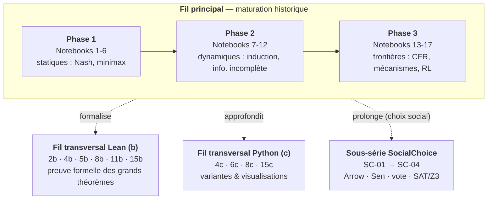
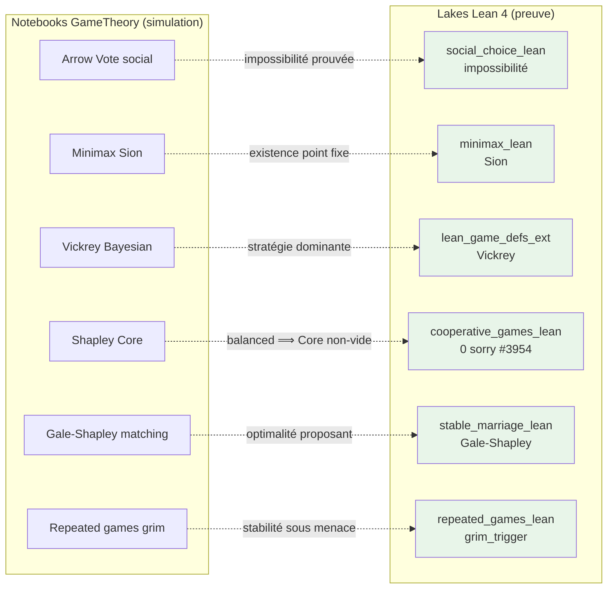

# Théorie des Jeux - Game Theory

[← Notebooks](../README.md) | [↑ ..](../README.md) | [→ RL](../RL/README.md)

<!-- CATALOG-STATUS
series: GameTheory
pedagogical_count: 28
breakdown: root=24, SocialChoice=4
maturity: PRODUCTION=25, BETA=3
-->

La théorie des jeux est le langage mathématique de la stratégie. Elle modélise les situations où des agents rationnels prennent des décisions dont le résultat dépend des choix des autres : enchères, négociations commerciales, élections, poker, guerre commerciale, allocation de ressources. Cette dualité entre coopération et compétition est omniprésente en économie, en sciences politiques et en informatique (mécanismes de vote, smart contracts, réseaux). Le prix Nobel d'économie a été décerné à des théoriciens des jeux à sept reprises entre 1994 et 2020 — c'est un domaine vivant et influent.

Cette série vous forme sur deux axes complémentaires. Le premier est **pratique** : simuler des jeux avec Nashpy et OpenSpiel, calculer des équilibres de Nash, organiser des tournois itératifs (dilemme du prisonnier, Axelrod), et explorer les algorithmes modernes (CFR, Deep CFR). Le second est **formel** : prouver des résultats en Lean 4 — existence de Nash (Brouwer/Kakutani), théorème d'Arrow, valeur de Shapley. À la fin, vous maîtriserez aussi bien la théorie des jeux coopératifs (Shapley, Core) que non-coopératifs (Nash, SPE), et vous saurez formaliser ces résultats dans un assistant de preuve.

**À qui s'adresse cette série** : étudiants en économie, informatique et mathématiques appliquées. Les notebooks Python (principaux + side tracks c) utilisent Nashpy, OpenSpiel et Z3. Les side tracks Lean (b) requièrent WSL + elan. Aucun prérequis en théorie des jeux : les concepts sont introduits progressivement depuis les matrices de gains. Une familiarité avec l'algèbre linéaire et les probabilités de base est utile.

## Pourquoi cette série

La théorie des jeux occupe une position charnière dans le curriculum d'IA. Elle est le **point de rencontre** entre l'optimisation (maximiser son gain), la logique (raisonner sur les croyances d'autrui) et l'informatique (algorithmes de résolution, formalisation en assistant de preuve). Aucune autre discipline ne combine ces trois dimensions avec autant de profondeur mathématique et d'applications concrètes.

Cette série est construite sur une **dualité délibérée simulation/preuve** :

- **Simulation (Python)** : calculer des équilibres de Nash, simuler des tournois itérés, entraîner des agents CFR. On *voit* la théorie en action — les équilibres émergent des interactions répétées, la coopération émerge de l'égoïsme même. L'expérience numérique ancre l'intuition.
- **Preuve formelle (Lean 4)** : prouver l'existence de Nash (Brouwer/Kakutani), l'impossibilité d'Arrow, les axiomes de Shapley. On *certifie* les résultats — aucun `sorry` dans les théorèmes majeurs. La machine vérifie ce que l'intuition avait suggéré.

Les deux approches se nourrissent mutuellement. Le notebook Python montre *pourquoi* l'équilibre de Nash est plausible ; le notebook Lean prouve *qu'il existe forcément*. Le notebook SocialChoice/01 montre qu'Arrow est *contre-intuitif* ; `Arrow.lean` prouve qu'il est *inévitable*.

Au-delà de la théorie classique, cette série couvre les **applications contemporaines** qui utilisent la théorie des jeux en production : enchères VCG pour la publicité en ligne (milliards de transactions/jour), systèmes de matching (Gale-Shapley pour les affectations étudiant-hôpital), IA de poker (Libratus/Pluribus), et gouvernance on-chain (DAO, vote vérifiable).

## Statistiques catalogue à jour

Le marqueur `CATALOG-STATUS` (l. 5-10) reflète l'état du dépôt au moment du commit. Les chiffres ci-dessous sont lus **byte-identique** depuis ce marqueur, conformément à la règle `catalog-pr-hygiene` (le catalogue n'est jamais régénéré sur une branche feature — c'est le cron quotidien `catalog-cron.yml` qui le maintient sur `main`).

| Sous-série | Notebooks | Statut | Paradigmes dominants |
|------------|-----------|--------|----------------------|
| Racine (fil principal + side tracks `b` Lean + `c` Python) | 27 | PRODUCTION=24, BETA=3 | Nashpy/OpenSpiel/Z3 (Python), Lean 4 (side tracks `b`) |
| Sous-série [SocialChoice/](SocialChoice/) | 4 | PRODUCTION=4, BETA=0 | Lean 4 (Arrow, Sen) + SAT/Z3 (UNSAT) + simulation Condorcet/Borda |
| **Total** | **31** | **PRODUCTION=28, BETA=3** | Python pur + Lean 4 (6 side tracks `b` 0-sorry) |

Les side tracks Lean (2b, 4b, 5b, 8b, 11b, 15b) prouvent les grands théorèmes (Nash via Brouwer/Kakutani, minimax via Sion, Vickrey, PGame/Sprague-Grundy, axiomes Shapley) avec **0 `sorry` sur les théorèmes majeurs** (cf [LEAN_INVENTORY.md](LEAN_INVENTORY.md) ; harmonisation Mathlib en cours, #4362). Les `student/` éventuels portent des stubs conformes (règle C.1 — `pass` / `return None` / `print("Exercice à compléter")` / jamais `raise NotImplementedError`) et restent exécutables end-to-end. Dépendances Python : voir `MyIA.AI.Notebooks/requirements.txt` à la racine (nashpy, networkx, numpy, matplotlib, z3-solver).

## Écosystème MCP et parenté cross-lane

Cette série mobilise plusieurs couches de l'écosystème MCP du cluster, et entretient des parentés transversales fortes avec d'autres familles du dépôt :

**Outils d'infrastructure MCP** :

1. **MCP Jupyter** (`mcp__jupyter-papermill__*`) — exécution cell-by-cell des notebooks Python (Nashpy, OpenSpiel, Z3). Note bug #835 : JAMAIS appel naïf (re-exécution = `nbconvert --execute` Bash `timeout`-wrap).
2. **WSL Lean 4 kernel** (`scripts/notebook_tools/wsl_papermill.py --kernel lean4-wsl`) — exécution INSIDE WSL pour les side tracks `b` (cf `.claude/rules/wsl-kernels.md`). Wrapper Python `~/.lean4-kernel-wrapper.py` (v5) gère la conversion Windows→WSL paths et permissions NTFS. L'ancien wrapper bash est **OBSOLÈTE**.
3. **Validation pre-commit** (`.pre-commit-config.yaml`) — gitleaks + notebook validator bloquent les PRs qui dégraderaient les contrats inter-séries (notamment les stubs C.1 et les outputs C.2).

**Parenté cross-lane** (cross-liens inter-séries actifs) :

| Cette série | Symétrie dans | Pont pédagogique |
|-------------|---------------|------------------|
| Lean 4 (Arrow, Sen, Shapley, Vickrey) | [SymbolicAI/Lean](../SymbolicAI/Lean/README.md) | Même toolchain WSL, partage de Mathlib ; notebooks `social_choice_lean` prouvent ce que `social_choice_lean_peters` référence (D. Peters, MIT) |
| Multi-Agent RL (NFSP, PSRO, AlphaZero) | [RL](../RL/README.md) | Stratégies d'équilibre *apprises* par interaction plutôt que calculées (cf notebook 17) |
| Arbres de jeu, induction arrière, MCTS | [Search](../README.md) | Minimax (notebook 5) ↔ CSP-8-Temporal (Allen), P/N positions ↔ `Search-9-SatPlan-Symbolic` |
| Mécanismes VCG, matching Gale-Shapley | [SymbolicAI/SmartContracts](../SymbolicAI/SmartContracts/README.md) | Gouvernance on-chain (DAO, vote vérifiable) ; le design de mécanismes se prolonge en smart contracts |
| Encodage SAT/Z3 d'Arrow | [SymbolicAI/SMT/Z3](../SymbolicAI/SMT/Z3/README.md) | Outil Z3 partagé ; notebook SC-04 exploite la même API que NB-06 (witness generation Automata) |

**Effet de composition** : GameTheory sert de **carrefour** entre simulation numérique (Nashpy, OpenSpiel, Z3) et formalisation (Lean 4). Toute avancée d'une série partenaire enrichit potentiellement les notebooks GameTheory — par exemple, un nouveau théorème prouvé en Lean côté SymbolicAI/Lean peut être cité depuis [LEAN_INVENTORY.md](LEAN_INVENTORY.md) ou ouvrir un nouveau side track `b`. Le pipeline complet relie les **notebooks** (qui motivent — Lemke-Howson, Axelrod, Gale-Shapley) aux **lakes** (qui prouvent — Arrow, Bondareva-Shapley, Gale-Shapley existence et optimalité côté proposant), avec 7 lakes game-théoriques phares et **0 sorry sur les théorèmes majeurs**.

## Objectifs d'apprentissage

À l'issue de cette série, vous serez capable de :

1. **Modéliser** une interaction stratégique sous forme normale ou extensive, et y lire dominance, meilleure réponse, ensembles d'information et menaces crédibles
2. **Calculer** des équilibres : Nash pur et mixte (Lemke-Howson), minimax et dualité LP, équilibre parfait en sous-jeux
3. **Simuler** des dynamiques d'apprentissage : tournois Axelrod, replicator dynamics, CFR/Deep CFR, NFSP/PSRO
4. **Analyser** la coopération : Shapley, Core, Bondareva-Shapley ; concevoir un mécanisme incitatif (révélation, VCG)
5. **Raisonner** sur l'agrégation collective : Arrow, Sen, Condorcet/Borda/Copeland, encodage SAT/Z3
6. **Formaliser** ces résultats en Lean 4 — du point fixe de Brouwer à l'axiomatique de Shapley et à la preuve d'Arrow

## Parcours d'apprentissage

### Phase 1 : Jeux statiques et équilibres (Notebooks 1-6 + side tracks b/c, ~8h30)

Le parcours commence par le setup (Nashpy, OpenSpiel) et les jeux sous forme normale (matrices de gains, dominance, meilleure réponse). Le notebook 3 (Topology2x2) classifie les jeux 2x2 selon la table périodique de Robinson-Goforth, une perspective géométrique unique. Les notebooks 4-4b-4c plongent dans l'équilibre de Nash : calcul en stratégies pures et mixtes, algorithme de Lemke-Howson, et preuve formelle d'existence via Brouwer et Kakutani en Lean 4. Le notebook 5 (ZeroSum) démontre le théorème minimax et la dualité LP. Le notebook 6 (EvolutionTrust) montre comment la coopération émerge dans les tournois itérés (Axelrod, replicator dynamics). Son companion **6c** (RepeatedGames-FolkTheorem) formalise cette intuition : horizon fini → effondrement par induction arrière, horizon infini → grim trigger, condition de crédibilité $\delta \geq (T-R)/(T-P)$, Folk Theorem (tout paiement faisable et individuellement rationnel est soutenable comme SPNE pour $\delta$ assez proche de 1). À l'issue de cette phase, vous comprenez les trois piliers : Nash, minimax, et évolution.

### Phase 2 : Jeux dynamiques et information incomplète (Notebooks 7-12 + side tracks b/c, ~7h45)

La Phase 2 enrichit le modèle avec le temps et l'incertitude. Les notebooks 7-9 couvrent les jeux extensifs (arbres de jeu, ensembles d'information), les jeux combinatoires (Nim, Sprague-Grundy, avec formalisation Lean), et l'induction arrière (mille-pattes, escalade). Les notebooks 10-12 abordent les concepts subtils : induction avant et sous-jeux parfaits, jeux bayésiens (information incomplète, types, croyances), et jeux de réputation (signaling, engagement). Cette phase présuppose la Phase 1 (Nash, matrices de gains).

### Phase 3 : Frontières — algorithmes, coopération, mécanismes (Notebooks 13-17 + sous-série SocialChoice + side tracks b/c, ~10h30)

La Phase 3 couvre les sujets avancés et les applications. Le notebook 13 (CFR) introduit Counterfactual Regret Minimization et ses variantes (MCCFR, Deep CFR), au cœur du poker AI moderne. Le notebook 14 (Differential Games) explore les jeux continus (Stackelberg, boucle ouverte/fermée). Les notebooks 15-15b-15c couvrent la théorie coopérative : valeur de Shapley (avec axiomes formels en Lean), Core, Bondareva-Shapley. Le notebook 16 et la sous-série [SocialChoice/](SocialChoice/) constituent le bloc le plus riche : design de mécanismes (révélation, VCG), choix social (Arrow, Sen en Lean), et encodage SAT/Z3 des impossibilités. Le notebook 17 (Multi-Agent RL) relie la théorie des jeux à l'apprentissage par renforcement (NFSP, PSRO, AlphaZero).

## Structure

La série s'articule autour d'un **fil principal** qui suit la maturation historique de la discipline — des jeux statiques (matrices de gains, Nash, minimax) vers les jeux dynamiques (formes extensives, induction, information incomplète) puis les frontières contemporaines (CFR pour le poker, mécanismes, choix social, RL multi-agent). Ce fil est doublé de deux fils transversaux optionnels : un **fil de formalisation Lean 4** (side tracks *b*), qui prouve mécaniquement les grands théorèmes au lieu de seulement les illustrer, et un **fil Python d'approfondissement** (side tracks *c*) pour les variantes et visualisations avancées. La sous-série **[SocialChoice/](SocialChoice/)** prolonge le bloc « agrégation des préférences » avec une étude dédiée d'Arrow, Sen et des méthodes de vote, en confrontant preuve formelle, simulation et encodage SAT/Z3.

Chaque notebook principal renvoie vers ses side tracks ; ceux-ci se lisent indépendamment et ne sont jamais des prérequis du fil principal.



### Partie 1 : Fondations et Jeux statiques (Notebooks 1-6)

| # | Notebook | Kernel | Contenu | Durée |
|---|----------|--------|---------|-------|
| 1 | [GameTheory-1-Setup](GameTheory-1-Setup.ipynb) | Python | Installation Nashpy, OpenSpiel, vérification | 20 min |
| 2 | [GameTheory-2-NormalForm](GameTheory-2-NormalForm.ipynb) | Python | Matrices de gains, dominance, best response | 45 min |
| 2b | [GameTheory-2b-Lean-Definitions](GameTheory-2b-Lean-Definitions.ipynb) | Lean 4 | Formalisation Game2x2, stratégies, Nash | 45 min |
| 3 | [GameTheory-3-Topology2x2](GameTheory-3-Topology2x2.ipynb) | Python | Classification Robinson-Goforth, table périodique | 55 min |
| 4 | [GameTheory-4-NashEquilibrium](GameTheory-4-NashEquilibrium.ipynb) | Python | Nash pur/mixte, Lemke-Howson, analyse paramétrique | 60 min |
| 4b | [GameTheory-4b-Lean-NashExistence](GameTheory-4b-Lean-NashExistence.ipynb) | Lean 4 | Brouwer, Kakutani, preuve existence Nash | 55 min |
| 4c | [GameTheory-4c-NashExistence-Python](GameTheory-4c-NashExistence-Python.ipynb) | Python | Illustrations numériques point fixe | 35 min |
| 5 | [GameTheory-5-ZeroSum-Minimax](GameTheory-5-ZeroSum-Minimax.ipynb) | Python | Théorème minimax, LP primal/dual, Von Neumann | 40 min |
| 5b | [GameTheory-5b-Lean-Minimax](GameTheory-5b-Lean-Minimax.ipynb) | Lean 4 | Companion **natif** (kernel Lean) : preuve formelle 0-sorry de von Neumann dans le lake `minimax_lean` (Sion), `#check` + `#print axioms` in-kernel — voir [#4054](https://github.com/jsboige/CoursIA/issues/4054) (création du lake) et `LEAN_INVENTORY.md` du dossier | 45 min |
| 6 | [GameTheory-6-EvolutionTrust](GameTheory-6-EvolutionTrust.ipynb) | Python | Tournoi Axelrod, tit-for-tat, replicator dynamics | 65 min |
| 6c | [GameTheory-6c-RepeatedGames-FolkTheorem](GameTheory-6c-RepeatedGames-FolkTheorem.ipynb) | Python | Compagnon **formel** de GT-6 : horizon fini (effondrement par induction arrière), horizon infini, grim trigger, condition $\delta \geq (T-R)/(T-P)$, Folk Theorem (tout paiement IR faisable est SPNE pour $\delta$ assez proche de 1) | 45 min |

### Partie 2 : Jeux dynamiques et raisonnement stratégique (Notebooks 7-12)

| # | Notebook | Kernel | Contenu | Durée |
|---|----------|--------|---------|-------|
| 7 | [GameTheory-7-ExtensiveForm](GameTheory-7-ExtensiveForm.ipynb) | Python | Arbres de jeu, infosets, stratégies | 50 min |
| 8 | [GameTheory-8-CombinatorialGames](GameTheory-8-CombinatorialGames.ipynb) | Python | Positions P/N, Nim, Grundy, Sprague-Grundy | 55 min |
| 8b | [GameTheory-8b-Lean-CombinatorialGames](GameTheory-8b-Lean-CombinatorialGames.ipynb) | Lean 4 | PGame mathlib, Nim formel | 50 min |
| 8c | [GameTheory-8c-CombinatorialGames-Python](GameTheory-8c-CombinatorialGames-Python.ipynb) | Python | Approfondissement jeux combinatoires | 40 min |
| 9 | [GameTheory-9-BackwardInduction](GameTheory-9-BackwardInduction.ipynb) | Python | Induction arrière, mille-pattes, escalade | 55 min |
| 10 | [GameTheory-10-ForwardInduction-SPE](GameTheory-10-ForwardInduction-SPE.ipynb) | Python | Induction avant, SPE, menaces crédibles | 60 min |
| 11 | [GameTheory-11-BayesianGames](GameTheory-11-BayesianGames.ipynb) | Python | Jeux bayésiens, information incomplète | 55 min |
| 11b | [GameTheory-11b-Lean-BayesianGamesExt](GameTheory-11b-Lean-BayesianGamesExt.ipynb) | Lean 4 | Companion natif : théorème de Vickrey (enchère au second prix) prouvé 0-sorry dans le lake `lean_game_defs_ext` (module Bayesian, sans Mathlib) | 50 min |
| 12 | [GameTheory-12-ReputationGames](GameTheory-12-ReputationGames.ipynb) | Python | Jeux de réputation, signaling | 50 min |

### Partie 3 : Algorithmes et applications avancées (Notebooks 13-17)

| # | Notebook | Kernel | Contenu | Durée |
|---|----------|--------|---------|-------|
| 13 | [GameTheory-13-ImperfectInfo-CFR](GameTheory-13-ImperfectInfo-CFR.ipynb) | Python | CFR vanilla, MCCFR, Deep CFR | 70 min |
| 14 | [GameTheory-14-DifferentialGames](GameTheory-14-DifferentialGames.ipynb) | Python | Boucle ouverte/fermée, Stackelberg | 60 min |
| 15 | [GameTheory-15-CooperativeGames](GameTheory-15-CooperativeGames.ipynb) | Python | Shapley, Core, Bondareva-Shapley | 65 min |
| 15b | [GameTheory-15b-Lean-CooperativeGames](GameTheory-15b-Lean-CooperativeGames.ipynb) | Lean 4 | Axiomes Shapley formels, Core | 55 min |
| 15c | [GameTheory-15c-CooperativeGames-Python](GameTheory-15c-CooperativeGames-Python.ipynb) | Python | Exemples avancés (Glove Game, politique) | 40 min |
| 16 | [GameTheory-16-MechanismDesign](GameTheory-16-MechanismDesign.ipynb) | Python | Principe de révélation, VCG, matching | 65 min |
| SC-01 | [SocialChoice/01-Arrow-Impossibility-Theorem](SocialChoice/01-Arrow-Impossibility-Theorem.ipynb) | Python | Arrow : preuve formelle vs simulation | 45 min |
| SC-02 | [SocialChoice/02-Lean-SocialChoice-Formal](SocialChoice/02-Lean-SocialChoice-Formal.ipynb) | Lean 4 + Python | Arrow, Sen, Électeur Médian, tour Peters | 70 min |
| SC-03 | [SocialChoice/03-Voting-Methods](SocialChoice/03-Voting-Methods.ipynb) | Python | Condorcet, Borda, Copeland, modèle Downs | 45 min |
| SC-04 | [SocialChoice/04-Computational-Aggregation-SAT-Z3](SocialChoice/04-Computational-Aggregation-SAT-Z3.ipynb) | Python | Arrow encodé en SAT + Z3, UNSAT, relaxation | 60 min |
| 17 | [GameTheory-17-MultiAgent-RL](GameTheory-17-MultiAgent-RL.ipynb) | Python | NFSP, PSRO, AlphaZero intro | 55 min |

**Durée totale** : ~26h45 (avec side tracks b/c et sous-série SocialChoice complète)

## Navigation et Side Tracks

Les **side tracks** approfondissent les concepts du notebook principal :

| Track | Type | Description |
|-------|------|-------------|
| **b** | Lean 4 | Formalisation mathématique, preuves formelles |
| **c** | Python | Approfondissement, exemples avancés, visualisations |
| **SC** | Mixte | Sous-série [SocialChoice/](SocialChoice/) : Arrow, Sen, SAT, Z3 (4 notebooks) |

**Organisation** :
- Chaque notebook principal inclut des liens vers ses side tracks
- Les side tracks sont optionnels et peuvent être étudiés indépendamment
- Progression recommandée : notebook principal, puis side track b (formalisation), puis c (applications)

## Acquis d'apprentissage

À l'issue de la série, vous êtes capable de :

- **Modéliser** une interaction stratégique sous forme normale ou extensive, et y lire dominance, meilleure réponse, ensembles d'information et menaces crédibles.
- **Calculer** des équilibres : Nash pur et mixte (Lemke-Howson), minimax et dualité LP en jeux à somme nulle, équilibre parfait en sous-jeux par induction arrière et avant.
- **Simuler** des dynamiques d'apprentissage et d'évolution : tournois itérés à la Axelrod, *replicator dynamics*, et apprentissage multi-agent moderne (CFR/Deep CFR, NFSP, PSRO).
- **Analyser** la coopération : valeur de Shapley, Core, et conditions de stabilité (Bondareva-Shapley) ; concevoir un mécanisme incitatif (principe de révélation, VCG).
- **Raisonner** sur l'agrégation collective : impossibilité d'Arrow, théorème de Sen, méthodes de Condorcet/Borda/Copeland, et leur encodage en problème SAT résolu par Z3.
- **Formaliser** ces résultats en Lean 4 et saisir ce que « prouver » veut dire dans un assistant de preuve — du point fixe de Brouwer/Kakutani pour Nash à l'axiomatique de Shapley et à la preuve d'Arrow.

Chaque notebook adopte la même trame pédagogique — introduction motivée, plan ancré, exemples exécutés et exercices corrigés — pensée pour un travail en autonomie. Les side tracks Lean (*b*) et la sous-série SocialChoice vont jusqu'au degré « preuve formelle vérifiée par la machine » : les résultats principaux sont prouvés sans `sorry` (l'inventaire complet des toolchains, du statut de build et des `sorry` résiduels intractables est tenu dans [LEAN_INVENTORY.md](LEAN_INVENTORY.md)).

## Statut de maturité

| # | Notebook | Cellules | Exercices | Statut |
|---|----------|----------|-----------|--------|
| 1 | Setup | ~15 | - | **COMPLET** |
| 2 | NormalForm | ~25 | 3 | **COMPLET** |
| 2b | Lean-Definitions | ~25 | 3 | **COMPLET** |
| 3 | Topology2x2 | ~30 | 3 | **COMPLET** |
| 4 | NashEquilibrium | ~35 | 3 | **COMPLET** |
| 4b | Lean-NashExistence | ~20 | 3 | **COMPLET** |
| 4c | NashExistence-Python | ~20 | 2 | **COMPLET** |
| 5 | ZeroSum-Minimax | ~25 | 3 | **COMPLET** |
| 5b | Lean-Minimax | ~20 | 3 | **COMPLET** |
| 6 | EvolutionTrust | ~40 | 3 | **COMPLET** |
| 6c | RepeatedGames-FolkTheorem | ~30 | 3 | **NOUVEAU** |
| 7 | ExtensiveForm | ~30 | 3 | **COMPLET** |
| 8 | CombinatorialGames | ~17 | 3 | **NOUVEAU** |
| 8b | Lean-CombinatorialGames | ~25 | 3 | **COMPLET** |
| 8c | CombinatorialGames-Python | ~25 | 3 | **COMPLET** |
| 9 | BackwardInduction | ~35 | 3 | **COMPLET** |
| 10 | ForwardInduction-SPE | ~35 | 3 | **COMPLET** |
| 11 | BayesianGames | ~30 | 3 | **COMPLET** |
| 11b | Lean-BayesianGamesExt | ~35 | - | **COMPLET** |
| 12 | ReputationGames | ~30 | 3 | **COMPLET** |
| 13 | ImperfectInfo-CFR | ~45 | 3 | **COMPLET** |
| 14 | DifferentialGames | ~35 | 3 | **COMPLET** |
| 15 | CooperativeGames | ~40 | 3 | **COMPLET** |
| 15b | Lean-CooperativeGames | ~30 | 3 | **COMPLET** |
| 15c | CooperativeGames-Python | ~25 | 3 | **COMPLET** |
| 16 | MechanismDesign | ~40 | 3 | **COMPLET** |
| SC-01 | Arrow-Impossibility-Theorem | ~38 | 3 | **COMPLET** |
| SC-02 | Lean-SocialChoice-Formal | ~55 | 3 | **COMPLET** |
| SC-03 | Voting-Methods | ~43 | 3 | **COMPLET** |
| SC-04 | Computational-Aggregation-SAT-Z3 | ~66 | 2 | **COMPLET** |
| 17 | MultiAgent-RL | ~35 | 3 | **COMPLET** |

Tous les notebooks incluent :
- Navigation header/footer avec liens
- Plan avec liens ancres
- Tableaux recapitulatifs
- Exercices avec solutions complètes

## Ce que chaque notebook apporte

Chaque notebook introduit un concept ou un modèle spécifique. Le tableau ci-dessous résume en une ligne l'apport pédagogique de chacun.

### Fil principal (Python)

| # | Notebook | Apport pédagogique |
|---|----------|-------------------|
| 1 | Setup | Installation Nashpy/OpenSpiel, premier dilemme du prisonnier |
| 2 | NormalForm | Matrices de gains, dominance, meilleure réponse, équilibre pur |
| 3 | Topology2x2 | Classification géométrique des 144 jeux 2x2 (Robinson-Goforth) |
| 4 | NashEquilibrium | Nash mixte, Lemke-Howson, analyse paramétrique, support enumeration |
| 5 | ZeroSum-Minimax | Théorème minimax, dualité LP, programmation linéaire pour jeux |
| 6 | EvolutionTrust | Tournoi Axelrod, tit-for-tat, replicator dynamics, émergence coopération |
| 6c | RepeatedGames-FolkTheorem | Compagnon formel de GT-6 : Folk Theorem (horizon fini vs infini), condition de crédibilité du grim trigger $\delta \geq (T-R)/(T-P)$, comparaison grim trigger vs tit-for-tat (seuil de patience), ensemble faisable et IR |
| 7 | ExtensiveForm | Arbres de jeu, ensembles d'information, stratégies comportementales |
| 8 | CombinatorialGames | Positions P/N, Nim, Grundy values, théorème Sprague-Grundy |
| 9 | BackwardInduction | Induction arrière, mille-pattes, escalade, engagement |
| 10 | ForwardInduction-SPE | Induction avant, sous-jeux parfaits, menaces crédibles |
| 11 | BayesianGames | Types, croyances, équilibre bayésien, information incomplète |
| 12 | ReputationGames | Signaling, engagement, réputation, cheap talk |
| 13 | ImperfectInfo-CFR | CFR vanilla, MCCFR, Deep CFR, poker AI |
| 14 | DifferentialGames | Jeux continus, Stackelberg, boucle ouverte/fermée |
| 15 | CooperativeGames | Valeur de Shapley, Core, Bondareva-Shapley |
| 16 | MechanismDesign | Principe de révélation, VCG, matching, enchères |
| 17 | MultiAgent-RL | NFSP, PSRO, AlphaZero intro, lien vers RL |

### Side tracks Lean 4 (formalisation)

| # | Notebook | Apport pédagogique |
|---|----------|-------------------|
| 2b | Lean-Definitions | Formalisation Game2x2, stratégies mixtes, Nash en Lean |
| 4b | Lean-NashExistence | Brouwer, Kakutani, preuve existence Nash |
| 5b | Lean-Minimax | Théorème minimax (von Neumann/Sion) prouvé 0-sorry, lake `minimax_lean` |
| 8b | Lean-CombinatorialGames | PGame Mathlib, Nim formel, Sprague-Grundy |
| 11b | Lean-BayesianGamesExt | Théorème de Vickrey (enchère au second prix) prouvé 0-sorry, lake `lean_game_defs_ext` |
| 15b | Lean-CooperativeGames | Axiomes Shapley formels, Core, Bondareva-Shapley |

### Side tracks Python (approfondissement)

| # | Notebook | Apport pédagogique |
|---|----------|-------------------|
| 4c | NashExistence-Python | Illustrations numériques point fixe, visualisation convergence |
| 6c | RepeatedGames-FolkTheorem | Compagnon formel de GT-6 : horizon fini vs infini, condition de crédibilité du grim trigger $\delta \geq (T-R)/(T-P)$, Folk Theorem |
| 8c | CombinatorialGames-Python | Variantes avancées (Wythoff, Chomp), visualisations |
| 15c | CooperativeGames-Python | Exemples avancés (Glove Game, politique française) |

### Sous-série SocialChoice (4 notebooks)

| # | Notebook | Apport pédagogique |
|---|----------|-------------------|
| SC-01 | Arrow-Impossibility | Preuve d'Arrow (Geonakoplos), simulation, interprétation |
| SC-02 | Lean-SocialChoice | Arrow + Sen + Median Voter + Peters en Lean, 0 sorry |
| SC-03 | Voting-Methods | Condorcet, Borda, Copeland, modèle Downs, paradoxe élection |
| SC-04 | Computational-Aggregation | Arrow encodé en SAT + Z3, UNSAT, relaxation partielle |

## Progression recommandée

### Découvreur (fondements statiques, ~5h)

Commencez par les notebooks 1 (Setup) et 2 (NormalForm) pour comprendre les matrices de gains et la dominance stratégique. Le notebook 4 (NashEquilibrium) introduit le concept central de la série : l'équilibre de Nash, pur et mixte. Le notebook 5 (ZeroSum-Minimax) complète avec le théorème minimax de Von Neumann et la programmation linéaire. Ces quatre notebooks suffisent pour comprendre les bases de la théorie des jeux non-coopératifs.

### Praticien (jeux dynamiques et Lean, ~10h)

Poursuivez avec les jeux dynamiques : notebook 7 (formes extensives), 9 (induction arrière), 10 (induction avant et SPE). Le notebook 6 (EvolutionTrust) offre une pause rafraîchissante avec le tournoi d'Axelrod. Les side tracks Lean (2b, 4b) vous initient à la formalisation des résultats en assistant de preuve. À ce stade, vous êtes capable de modéliser des interactions stratégiques complexes et de les vérifier formellement.

### Expert (applications avancées et choix social, ~19h)

Les notebooks 13 (CFR), 15 (jeux coopératifs, Shapley), et 16 (design de mécanismes, Arrow) ouvrent les frontières de la discipline. La sous-série [SocialChoice/](SocialChoice/) (4 notebooks) approfondit le théorème d'Arrow via Lean, SAT et Z3. Le notebook 17 (Multi-Agent RL) fait le pont avec l'apprentissage par renforcement.

### Parcours alternatifs

#### Parcours formalisation Lean uniquement (~4h)

Si vous venez de la série [SymbolicAI/Lean](../SymbolicAI/Lean/README.md) et voulez voir la théorie des jeux sous l'angle formel :

1. **2b** (Lean Definitions) : Game2x2, stratégies mixtes
2. **4b** (Nash Existence) : Brouwer, Kakutani, preuve d'existence
3. **8b** (Combinatorial Games) : PGame Mathlib, Nim, Sprague-Grundy
4. **15b** (Cooperative Games) : Axiomes Shapley, Core
5. **SC-02** (SocialChoice Formal) : Arrow, Sen, Median Voter en Lean

Ce parcours suppose une familiarité avec Lean 4 (tactiques basiques, types inductifs). Les notebooks Python correspondants (2, 4, 8, 15, SC-01) fournissent l'intuition mais ne sont pas des prérequis.

#### Parcours applications réelles (~6h)

Si vous préférez les cas d'usage aux fondements théoriques :

1. **5** (ZeroSum) : programmation linéaire, dualité, trading
2. **6** (EvolutionTrust) : émergence de la coopération, biologie
3. **13** (CFR) : poker AI, regret minimization
4. **16** (MechanismDesign) : enchères VCG, allocation de ressources
5. **SC-03** (Voting) : Condorcet, Borda, modèles électoraux

#### Parcours informatique théorique (~5h)

Si votre intérêt est l'algorithmique et la complexité :

1. **2** (NormalForm) : matrices de gains, dominance
2. **4** (NashEquilibrium) : Lemke-Howson, PPAD-complétude
3. **8** (CombinatorialGames) : Sprague-Grundy, nimbers
4. **13** (CFR) : contre-factual regret, convergence
5. **SC-04** (SAT/Z3) : encodage de théorèmes en SAT, UNSAT proofs

## Quick Start

```bash
# 1. Installer les dépendances Python (notebooks 1-12, 14-16)
pip install -r MyIA.AI.Notebooks/GameTheory/requirements.txt

# 2. Premier notebook
jupyter notebook GameTheory-1-Setup.ipynb

# 3. Puis GameTheory-2 (formes normales, matrices de gains)
```

Pour les notebooks Lean (2b, 4b, 8b, 15b) : installer le kernel `Lean 4 (WSL)` via `scripts/setup_wsl_lean4.sh`.
Pour GT-13/17 (OpenSpiel) : installer le kernel `GameTheory WSL` via `scripts/setup_wsl_openspiel.sh`.

---

## Prerequisites

- Connaissances de base en logique et mathématiques
- Familiarité avec Python (numpy, matplotlib)
- Pour notebooks Lean (b) : Installation Lean 4 + kernel WSL (voir série Lean)
- Pour notebooks 13-17 : APIs optionnelles (OpenAI pour AlphaZero)

## Installation

### Installation rapide (Python standard - notebooks 1-12, 14-16)

```bash
pip install -r MyIA.AI.Notebooks/GameTheory/requirements.txt
# Note: open_spiel échouera sur Windows (nécessite WSL) - c'est normal pour la majorité des notebooks
```

### Notebooks nécessitant WSL (Windows uniquement)

GT-13 (CFR/OpenSpiel) et GT-17 (Multi-Agent RL) nécessitent le kernel `Python (GameTheory WSL + OpenSpiel)` :

```bash
# 1. Dans WSL Ubuntu
cd /mnt/d/CoursIA/MyIA.AI.Notebooks/GameTheory/scripts
bash setup_wsl_openspiel.sh
```

```powershell
# 2. Côté Windows (PowerShell)
cd D:\CoursIA\MyIA.AI.Notebooks\GameTheory\scripts
.\setup_wsl_kernel.ps1
```

### Notebooks Lean 4 (2b, 4b, 8b, 15b)

Ces notebooks nécessitent le kernel `Lean 4 (WSL)` :

```bash
# 1. Dans WSL Ubuntu
cd /mnt/d/CoursIA/MyIA.AI.Notebooks/GameTheory/scripts
bash setup_wsl_lean4.sh    # installe elan + Lean 4 + REPL + lean4_jupyter
```

```powershell
# 2. Côté Windows (PowerShell)
cd D:\CoursIA\MyIA.AI.Notebooks\GameTheory\scripts
.\setup_lean4_kernel.ps1   # enregistre le kernel lean4-wsl
```

### Vérification

```bash
jupyter kernelspec list
# Doit montrer : python3, gametheory-wsl (optionnel), lean4-wsl (optionnel)
```

Pour les détails et le dépannage, voir [install_wsl_kernel.md](install_wsl_kernel.md).

### Configuration API (optionnel)

```bash
cp .env.example .env
# Éditer .env et ajouter les clés API si nécessaire
```

## FAQ / Troubleshooting

### J'ai un Windows, est-ce que je peux suivre toute la série ?

Oui. Les notebooks 1-12 et 14-16 tournent en Python natif sur Windows (Nashpy, numpy, matplotlib). Les notebooks 13 (CFR/OpenSpiel) et 17 (Multi-Agent RL) nécessitent WSL car OpenSpiel ne compile pas nativement sous Windows. Les side tracks Lean (2b, 4b, 8b, 15b) nécessitent aussi WSL pour le kernel `lean4-wsl`. Les scripts d'installation sont dans `scripts/` (voir section Installation).

### Quel est le pré-requis mathématique minimum ?

Algèbre linéaire de base (multiplication de matrices, vecteurs) et probabilités (espérance, loi uniforme). Les concepts de théorie des jeux (Nash, minimax, Shapley) sont introduits progressivement depuis zéro. Aucun prérequis en théorie des jeux n'est nécessaire.

### Faut-il faire les notebooks Lean (side tracks b) ?

Non. Les side tracks Lean sont optionnels et indépendants. Ils sont destinés aux étudiants qui veulent comprendre ce que signifie « prouver » un résultat mathématique dans un assistant de preuve. Le fil principal (Python) suffit pour maîtriser les concepts. Si vous n'avez jamais touché à Lean, commencez par la série [SymbolicAI/Lean](../SymbolicAI/Lean/README.md).

### Quelle est la différence entre Nash pur et Nash mixte ?

Un équilibre de Nash **pur** est un choix déterministe (chaque joueur choisit une seule stratégie). Un équilibre de Nash **mixte** autorise les probabilités (chaque joueur randomise entre plusieurs stratégies avec certaines probabilités). Le notebook 4 (NashEquilibrium) couvre les deux cas et montre que tout jeu fini a au moins un équilibre de Nash mixte (théorème de Nash, 1951).

### Je suis bloqué sur un exercice Lean, où trouver de l'aide ?

Consultez d'abord le notebook [Lean-1-Setup](../SymbolicAI/Lean/Lean-1-Setup.ipynb) pour vérifier votre environnement. La documentation Lean 4 officielle ([Theorem Proving in Lean 4](https://lean-lang.org/theorem_proving_in_lean4/)) est la référence principale. Les exercices Lean de cette série sont conçus pour être accessibles avec les tactiques introduites dans les notebooks ; il n'est pas nécessaire de connaître Mathlib en détail.

### open_spiel échoue à l'installation sur Windows

OpenSpiel ne compile pas nativement sur Windows. C'est attendu — seuls les notebooks 13 (CFR) et 17 (Multi-Agent RL) en ont besoin. Pour les notebooks 1-12 et 14-16, installez seulement `nashpy` et `z3-solver` :

```bash
pip install nashpy z3-solver matplotlib numpy
```

Pour GT-13/17 : utilisez le kernel `gametheory-wsl` (WSL Ubuntu) via `scripts/setup_wsl_openspiel.sh`.

### Le kernel lean4-wsl ne démarre pas (timeout)

Le premier démarrage du kernel Lean 4 via WSL peut prendre 30-60 secondes (cold start). Si le kernel timeout :

1. Vérifiez que WSL Ubuntu est opérationnel : `wsl -d Ubuntu -- echo OK`
2. Vérifiez le wrapper : `wsl -d Ubuntu -- test -f ~/.lean4-kernel-wrapper.py && echo OK`
3. Relancez le kernel. Si ça persiste, voir [wsl-kernels.md](../../.claude/rules/wsl-kernels.md) pour le diagnostic complet.

### Nashpy retourne plusieurs équilibres

C'est normal : un jeu peut avoir plusieurs équilibres de Nash (en stratégies pures et/ou mixtes). Nashpy les retourne tous. Le notebook 4 explique comment les interpréter et filtrer (équilibres Pareto-dominants, équilibre en stratégies pures privilégié).

### Les calculs d'équilibres sont très lents

La complexité croît exponentiellement avec le nombre de stratégies. Pour les jeux 3x3 et au-delà, Lemke-Howson peut être lent. Alternatives :

- Utilisez `nashpy` avec l'option `method="support-enumeration"` pour les petits jeux
- Pour les grands jeux, le notebook 13 (CFR) approche l'équilibre par itération
- Vérifiez que vous n'avez pas une inversion de lignes/colonnes dans la matrice de gains

### Z3/SAT retourne UNSAT trop rapidement

Si l'encodage SAT d'Arrow (SC-04) semble trivial, vérifiez que le nombre de votants et d'alternatives est suffisant dans vos paramètres. L'impossibilité d'Arrow émerge à partir de 3 alternatives et 2 votants — en dessous, le solveur peut trouver une satisfaction.

### Les projets Lake Lean ne buildent pas

Chaque sous-dossier Lean (`social_choice_lean/`, `cooperative_games_lean/`, `stable_marriage_lean/`, etc.) est un projet Lake indépendant. Pour builder :

```bash
cd MyIA.AI.Notebooks/GameTheory/social_choice_lean
lake build
```

Assurez-vous que `lean --version` correspond à la toolchain spécifiée dans `lean-toolchain` (généralement `stable`). Si les dépendances échouent, essayez `lake exe cache get` puis `lake build`.

## Ressources externes

### Références académiques

| Référence | Couverture |
|-----------|------------|
| Osborne & Rubinstein, *A Course in Game Theory* (1994) | Textbook de référence, notebooks 1-12 |
| Russell & Norvig, *AIMA* 4e ed., ch. 17-18 | Cadre général jeux et mécanismes |
| Nash, "Non-Cooperative Games" (1951) | Notebook 4, équilibre de Nash |
| Von Neumann, "Zur Theorie der Gesellschaftsspiele" (1928) | Notebook 5, minimax |
| Axelrod, "The Evolution of Cooperation" (1984) | Notebook 6, tournoi iterated PD |
| Conway, Berlekamp & Guy, *Winning Ways* (1982) | Notebooks 8, 8b, 8c |
| Geanakoplos, "Three Brief Proofs of Arrow's Impossibility Theorem" (2005) | SC-01, `Arrow.lean` |
| Sen, "Collective Choice and Social Welfare" (1970) | SC-02, `Sen.lean` |
| Shapley, "A Value for n-Person Games" (1953) | Notebook 15, Shapley.lean |
| Roth, "The Shapley Value: Essays in Honor of Lloyd S. Shapley" (1988) | Cooperative games |
| Osborne, *An Introduction to Game Theory* (2004) | Alternative textbook |

### Théorie des jeux
- [Game Theory (Stanford Encyclopedia)](https://plato.stanford.edu/entries/game-theory/)
- [Evolution of Trust - Nicky Case](https://ncase.me/trust/)
- [Robinson & Goforth - Topology of 2x2 Games](https://www.mdpi.com/2073-4336/6/4/495)

### Jeux combinatoires
- [Winning Ways for Your Mathematical Plays - Conway, Berlekamp, Guy](https://www.akpeters.com/WinningWays/)
- [Lessons in Play - Albert, Nowakowski, Wolfe](https://www.routledge.com/Lessons-in-Play/Albert-Nowakowski-Wolfe/p/book/9781568812779)
- [Sprague-Grundy Theorem (Wikipedia)](https://en.wikipedia.org/wiki/Sprague%E2%80%93Grundy_theorem)

### Bibliothèques Python
- [Nashpy Documentation](https://nashpy.readthedocs.io/)
- [OpenSpiel Documentation](https://openspiel.readthedocs.io/)
- [OpenSpiel Algorithms](https://openspiel.readthedocs.io/en/latest/algorithms.html)

### Formalisations Lean
- [math-xmum/Brouwer](https://github.com/math-xmum/Brouwer) - Nash existence
- [MixedMatched/formalizing-game-theory](https://github.com/MixedMatched/formalizing-game-theory)
- [mathlib4 PGame](https://leanprover-community.github.io/mathlib4_docs/Mathlib/SetTheory/PGame/Basic.html)
- [asouther4/lean-social-choice](https://github.com/asouther4/lean-social-choice) - Arrow (Lean 3, source originale)
- [DominikPeters/SocialChoiceLean](https://github.com/DominikPeters/SocialChoiceLean) - Gibbard-Satterthwaite, Split Cycle, 15+ règles (Lean 4, MIT)

## Structure des fichiers

```
GameTheory/
├── GameTheory-1-Setup.ipynb ... GameTheory-17-MultiAgent-RL.ipynb  # 17 principaux
├── GameTheory-2b-Lean-Definitions.ipynb                            # Side tracks b (Lean 6 : 2b, 4b, 5b, 8b, 11b, 15b)
├── GameTheory-4b-Lean-NashExistence.ipynb
├── GameTheory-5b-Lean-Minimax.ipynb
├── GameTheory-8b-Lean-CombinatorialGames.ipynb
├── GameTheory-11b-Lean-BayesianGamesExt.ipynb
├── GameTheory-15b-Lean-CooperativeGames.ipynb
├── GameTheory-4c-NashExistence-Python.ipynb                        # Side tracks c (Python 4 : 4c, 6c, 8c, 15c)
├── GameTheory-6c-RepeatedGames-FolkTheorem.ipynb
├── GameTheory-8c-CombinatorialGames-Python.ipynb
├── GameTheory-15c-CooperativeGames-Python.ipynb
├── SocialChoice/                                                   # Sous-série Choix Social
│   ├── 01-Arrow-Impossibility-Theorem.ipynb
│   ├── 02-Lean-SocialChoice-Formal.ipynb
│   ├── 03-Voting-Methods.ipynb
│   └── 04-Computational-Aggregation-SAT-Z3.ipynb
│   └── README.md
├── README.md
├── INVENTORY.md                            # Inventaire notebooks
├── LEAN_INVENTORY.md                       # Inventaire Lean (toolchains + sorry)
├── install_wsl_kernel.md                   # Install kernel WSL
├── requirements.txt                        # 14 deps Python (nashpy/scipy/z3/etc.)
├── .env.example
├── game_theory_utils.py           # Utilitaires partages
├── cooperative_games/             # Module jeux cooperatifs
│   ├── __init__.py
│   ├── shapley.py                 # Valeur de Shapley
│   ├── core.py                    # Core, Bondareva-Shapley
│   ├── voting.py                  # Jeux de vote
│   ├── assistance_games.py        # Jeux d'assistance (veto, etc.)
│   ├── coalition_games.py         # Jeux de coalition
│   └── french_politics.py         # Politique française (exemples)
├── trust_simulation/              # Module Evolution of Trust
│   ├── strategies.py              # Tit-for-tat, hawks, doves, etc.
│   ├── tournament.py              # Tournoi Axelrod
│   └── visualization.py           # Animations populations
├── cooperative_games_lean/        # Projet Lake jeux cooperatifs (Shapley + Bondareva-Shapley 0 sorry, cf #3954)
├── conway_cgt_lean/               # Projet Lake jeux combinatoires (Conway CGT, toolchain v4.31.0-rc1)
├── minimax_lean/                  # Projet Lake minimax (Sion, cf #4054)
├── repeated_games_lean/           # Projet Lake jeux répétés (grim trigger, cf #4880)
├── social_choice_lean/            # Projet Lake choix social (Arrow, Sen, Voting/Median Voter — 0 sorry)
├── social_choice_lean_peters/     # Projet Lake référence DominikPeters (0 sorry, toolchain v4.27.0-rc1)
├── stable_marriage_lean/          # Projet Lake Gale-Shapley (GS COMPLETE, 0 sorry — énoncés faux réfutés, exists_isManOptimal prouvé)
├── lean_game_defs/                # Types Lean partages (pas de Lake project)
├── lean_game_defs_ext/            # Types Lean étendus (Vickrey, Bayesian — pas de Lake project)
├── scripts/                       # Scripts d'installation (WSL Lean, OpenSpiel)
├── examples/
│   ├── prisoners_dilemma.py
│   ├── topology_2x2_periodic_table.py
│   ├── nim_game.py
│   ├── kuhn_poker_cfr.py
│   ├── vcg_auction.py
│   ├── centipede_game.py          # Centipede game
│   ├── stackelberg_leader_follower.py  # Stackelberg
│   ├── stag_hunt_forward_induction.py  # Stag hunt + SPE
│   └── arrow_simple.lean
└── tests/
    ├── test_nash_computation.py
    ├── test_strategies.py
    ├── test_combinatorial.py
    ├── test_lean_definitions.py
    ├── test_cooperative_core.py
    ├── test_extensive_form.py
    ├── test_kuhn_poker_cfr.py
    ├── test_phase3.py
    ├── test_shapley.py
    ├── test_topology_2x2.py
    ├── test_trust_simulation.py
    └── test_vcg_auction.py
```

## Tests

```bash
# Exécuter tous les tests unitaires
cd MyIA.AI.Notebooks/GameTheory
python -m pytest tests/ -v

# Exécuter les exemples Python
python examples/prisoners_dilemma.py
python examples/kuhn_poker_cfr.py
python examples/vcg_auction.py
```

## Validation

```bash
# Vérifier la structure des notebooks
python scripts/verify_notebooks.py MyIA.AI.Notebooks/GameTheory --quick

# Exécution complète (mode batch)
BATCH_MODE=true python scripts/verify_notebooks.py MyIA.AI.Notebooks/GameTheory
```

## Concepts clés

| Concept | Description |
|---------|-------------|
| **Équilibre de Nash** | Profil de stratégies où aucun joueur ne gagne à dévier unilatéralement |
| **Minimax** | Stratégie qui minimise la perte maximale (jeux à somme nulle) |
| **Positions P/N** | Positions perdantes (Previous) et gagnantes (Next) en jeux combinatoires |
| **Sprague-Grundy** | Théorème unifiant l'analyse des jeux combinatoires impartiaux |
| **CFR** | Counterfactual Regret Minimization - convergence vers Nash |
| **SPE** | Subgame Perfect Equilibrium - Nash crédible dans tout sous-jeu |
| **Valeur de Shapley** | Répartition équitable des gains en jeu coopératif |
| **Core** | Ensemble des allocations stables en jeu coopératif |
| **Théorème d'Arrow** | Impossibilité d'agrégation parfaite des préférences |

## Applications du monde réel

La théorie des jeux n'est pas qu'un objet académique : ses résultats structurent des pans entiers de l'économie numérique et des politiques publiques. Quelques exemples directement liés aux notebooks de la série :

- **Enchères et enchères de spectre** (notebooks 11 et 16) — les mécanismes VCG et leurs dérivés fondent les enchères publicitaires de Google et Meta (des milliards de transactions/jour) ainsi que les ventes de fréquences télécom orchestrées par les États, où le design du mécanisme se chiffre en milliards.
- **Marchés d'appariement** (notebooks 15 et 16) — l'algorithme de Gale-Shapley et la valeur de Shapley sont au cœur de l'affectation des étudiants aux écoles (New York, Boston), des internes aux hôpitaux (NRMP), et des dons d'organes par échanges croisés ; prix Nobel d'économie 2012 (Roth & Shapley).
- **IA de poker et bluff optimal** (notebook 13, CFR) — Counterfactual Regret Minimization a permis à Libratus et Pluribus de battre les meilleurs joueurs humains au Texas Hold'em, première résolution d'un jeu majeur à information imparfaite.
- **Systèmes de vote et gouvernance** (sous-série SocialChoice) — le théorème d'Arrow et les méthodes de Condorcet/Borda éclairent le choix d'un mode de scrutin, du vote citoyen aux DAO blockchain (cf. cross-series SmartContracts).
- **Coopération et évolution** (notebook 6) — le tournoi d'Axelrod et les dynamiques de replication modélisent l'émergence de la coopération en biologie, en relations internationales et dans les protocoles de réseaux pair-à-pair.
- **Régulation et dissuasion** (notebooks 10-12) — l'induction arrière, les jeux de réputation et le signaling formalisent la crédibilité des menaces, des banques centrales (politique monétaire) à la stratégie concurrentielle.

### Pont vers les Preuves Formelles (Lean 4) — différenciant CoursIA

GameTheory occupe une place à part dans la couche Lean : c'est la famille qui aligne le plus directement simulation numérique et preuve formelle. Le Niveau 3 promet de « prouver ce qu'on a calculé » ; cette série tient la promesse par **sept lakes game-théoriques phares** (toolchains détaillées dans [LEAN_INVENTORY.md](LEAN_INVENTORY.md) — harmonisation Mathlib en cours, cf #4362 —, branchés sur les notebooks qui les enseignent ou les utilisent). Cartographie inter-familles :

| Famille | Lake phare | Théorème | Branchement notebook |
| --- | --- | --- | --- |
| **GameTheory** (choix social) | `social_choice_lean` (cf. `arrow_lean`) | Théorème d'impossibilité d'Arrow + caractérisation Sen + valeur de Shapley (résolu 0 sorry) | Notebooks 16b (Arrow), Argument_Analysis |
| **GameTheory** (équilibres) | `minimax_lean` (Sion) | Existence d'un équilibre en stratégies mixtes via point fixe (Brouwer-Sion) | GameTheory-5b-Lean-Minimax (companion natif) |
| **GameTheory** (design) | `lean_game_defs_ext` | Vickrey (enchère au second prix = stratégie dominante), théorème de révélation | GameTheory-11b-Lean-BayesianGamesExt |
| **GameTheory** (coopératif) | `cooperative_games_lean` (Bondareva-Shapley) | Bondareva-Shapley résolu 0 sorry (#3954), Core non-vide sous balanced | Notebooks 15-15b (coopératif, valeur de Shapley) |
| **GameTheory** (matching) | `stable_marriage_lean` | Gale-Shapley : existence + optimalité côté proposant | Notebooks 16-2 (matching, Gale-Shapley) |
| **GameTheory** (jeux répétés) | `repeated_games_lean` | Stratégie grim-trigger (compagnon formel GT-6c) — *en cours* (build + sorries résiduels, cf STATUS.md) | Notebook 6c (RepeatedGames-FolkTheorem) |
| **GameTheory** (jeux combinatoires) | `conway_cgt_lean` | Visite guidée (`#check`) de la théorie des jeux combinatoires (Conway CGT) | Notebooks 8/8b (CombinatorialGames, Sprague-Grundy) |
| **Search** (cross-famille) | `astar_lean` (cf. `#4048`) | Consistance + heuristique admissible = optimalité | Search-13 (A*), branchement par preuve de correction |
| **QuantConnect** (cross-famille) | `kelly_lean` (cf. `#4052`) | Kelly `g(f) ≤ g(f*)` + unicité | QC-Py-10 Risk Management, branchement par fraction risquée |



Le pipeline complet relie les **notebooks** (qui motivent — Lemke-Howson, Axelrod, Folk Theorem, Gale-Shapley via `stable_marriage_lean`) aux **lakes** (qui prouvent — Arrow résolu 0 sorry, Bondareva-Shapley résolu 0 sorry #3954, von Neumann/Sion, Vickrey, Gale-Shapley existence et optimalité côté proposant, grim-trigger). Sans la couche Lean, ces résultats seraient des théorèmes réputés « standard » mais jamais démontrés ; avec elle, la justification est **formellement garantie** — pas seulement admise. La spécificité GameTheory : la simulation (Lemke-Howson numérique, OpenSpiel CFR, Axelrod tournois) précède la preuve, mais les deux faces du même raisonnement sont également outillées.

Pour aller plus loin : [EPIC #4038](https://github.com/jsboige/CoursIA/issues/4038) (Roadmap Lean — un théorème-phare par série), [hub QuantConnect ↔ `kelly_lean`](../QuantConnect/README.md) (PR #5047), [hub central P0 ↔ Lean inter-familles](../README.md) (PR #5049), [hub SymbolicAI Lean](../SymbolicAI/Lean/README.md).

## Conclusion / Prochaines étapes

### Ce que vous avez appris

Cette série vous a fait traverser le **langage mathématique de la stratégie** — la modélisation des situations où le résultat d'une décision dépend des choix des autres, de l'enchère à la négociation commerciale, de l'élection au poker. L'arc pédagogique :

- **Le geste fondateur** — modéliser une interaction stratégique sous forme normale (matrices de gains, dominance, meilleure réponse) ou extensive (arbres, ensembles d'information, menaces crédibles), puis y lire la *rationalité* : qu'est-ce qu'un agent peut déduire des croyances d'autrui ? Cette formalisation est le socle commun, du dilemme du prisonnier au design de mécanismes.
- **La double dualité, délibérément juxtaposée** — d'abord **simulation *vs* preuve** : le notebook Python *montre pourquoi* l'équilibre de Nash est plausible (il émerge des interactions répétées), tandis que le notebook Lean *certifie qu'il existe forcément* (Brouwer/Kakutani, Arrow, Shapley — 0 `sorry` sur les théorèmes majeurs). Ensuite **coopératif *vs* non-coopératif** : d'un côté Nash, minimax et SPE (que joue chaque agent égoïste), de l'autre Shapley, Core et Bondareva-Shapley (comment répartir équitablement la valeur collective). Les deux approches se nourrissent mutuellement.
- **L'instrument** — Nashpy et OpenSpiel pour la simulation (Lemke-Howson, CFR/Deep CFR, tournois Axelrod, *replicator dynamics*), Z3 pour encoder les impossibilités en SAT, et Lean 4 pour la preuve formelle vérifiée par la machine — du point fixe de Brouwer à l'axiomatique de Shapley et à la preuve d'Arrow.
- **La finesse** — que la théorie des jeux n'est pas qu'un objet académique mais structure l'économie numérique et les politiques publiques : les mécanismes VCG fondent les enchères publicitaires (des milliards de transactions/jour) et les ventes de spectres télécom ; Gale-Shapley est au cœur de l'affectation étudiants-hôpitaux (prix Nobel 2012) ; CFR a permis à Libratus/Pluribus de résoudre le poker ; le théorème d'Arrow éclaire le choix d'un mode de scrutin, des élections citoyennes aux DAO blockchain.

La thèse est puissante et honnêtement présentée : la théorie des jeux occupe une *position charnière* — point de rencontre entre l'optimisation (maximiser son gain), la logique (raisonner sur les croyances d'autrui) et l'informatique (algorithmes de résolution, formalisation en assistant de preuve) — et aucune autre discipline ne combine ces trois dimensions avec autant de profondeur mathématique et d'applications concrètes.

### Prochaines étapes

- **Approfondir la formalisation** : la série [SymbolicAI/Lean](../SymbolicAI/Lean/README.md) est le prolongement naturel des side tracks Lean (*b*) — elle développe les compétences de preuve (tactiques, types inductifs, Mathlib) qui sous-tendent `Arrow.lean`, `Shapley.lean` et la preuve d'existence de Nash via Brouwer/Kakutani. L'inventaire complet des toolchains, builds et `sorry` résiduels est dans [LEAN_INVENTORY.md](LEAN_INVENTORY.md).
- **Élargir à l'apprentissage et à la recherche** : [RL](../RL/README.md) (Multi-Agent RL, notebook 17 : NFSP, PSRO, AlphaZero) reprend la théorie des jeux sous l'angle de l'apprentissage — où les stratégies d'équilibre ne sont plus calculées mais *apprises* par interaction ; [Search](../README.md) (Minimax, MCTS) partage les arbres de jeu et l'induction arrière.
- **Franchir le cap applications** : la sous-série [SocialChoice/](SocialChoice/) (Arrow, Sen, voting, SAT/Z3) et le notebook 16 (MechanismDesign : VCG, matching) ouvrent sur le *design de mécanismes* — comment concevoir des règles d'interaction qui poussent les agents égoïstes vers des résultats collectivement souhaitables. Le pont vers [SmartContracts](../SymbolicAI/SmartContracts/README.md) relie ces mécanismes à la gouvernance on-chain (DAO, vote vérifiable).
- Pour la pratique : reprenez le notebook 6 (EvolutionTrust) et le tournoi d'Axelrod — comment la coopération *émerge-t-elle* de l'égoïsme même ? Puis confrontez cette intuition au notebook SC-01, où la preuve d'Arrow montre que certaines formes d'agrégation parfaite sont *mathématiquement impossibles*. C'est la tension vivante de la série : l'émergence optimiste *vs* l'impossibilité démontrée.

### Le fil rouge

La théorie des jeux propose un changement de regard sur la décision : ne plus demander « quelle est la meilleure action ? » mais **« quelle est la meilleure action sachant que les autres agents, tout aussi rationnels que moi, raisonnent de même ? »**. La série vous a donné le formalisme (formes normale et extensive, Nash/SPE/minimax/Shapley), la double validation (simulation numérique *et* preuve formelle vérifiée), et le sens des applications (enchères, matching, poker, vote) pour transformer une interaction stratégique en un équilibre analysable — en gardant à l'esprit que cette discipline, couronnée de sept prix Nobel d'économie entre 1994 et 2020, reste l'un des cadres les plus puissants pour penser la coopération, la compétition et la conception des règles du jeu.

---

## Licence

Voir la licence du repository principal.

---

*Version 1.3.0 — Juillet 2026 — audit §E whole-file gate : réconciliation disque↔catalogue 31 nb, 7 lakes, correction lake #2611→#4054. EPIC #3975 tranche gametheory.*
