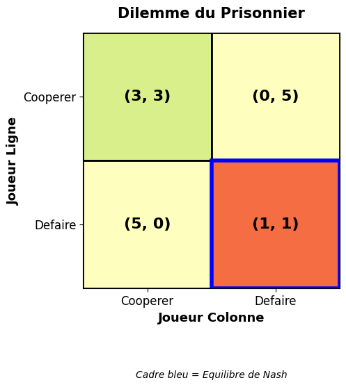
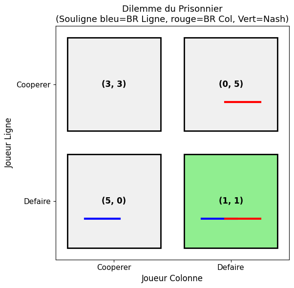
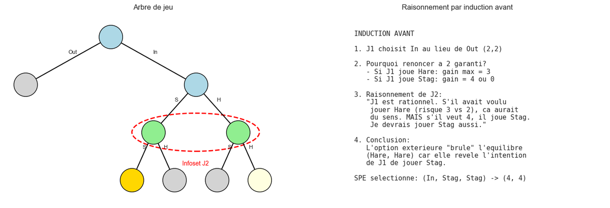
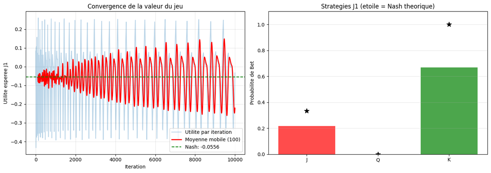
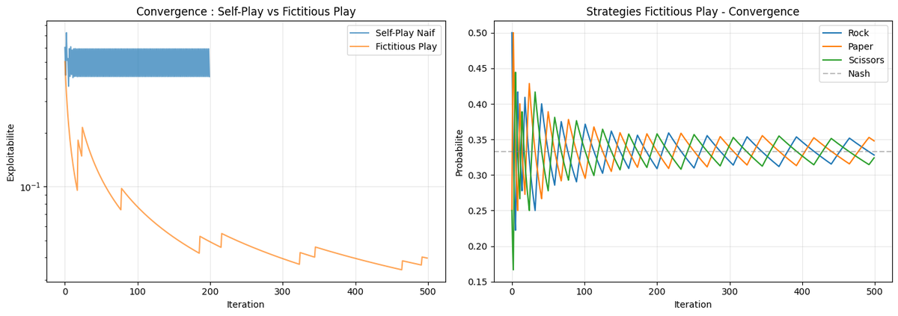
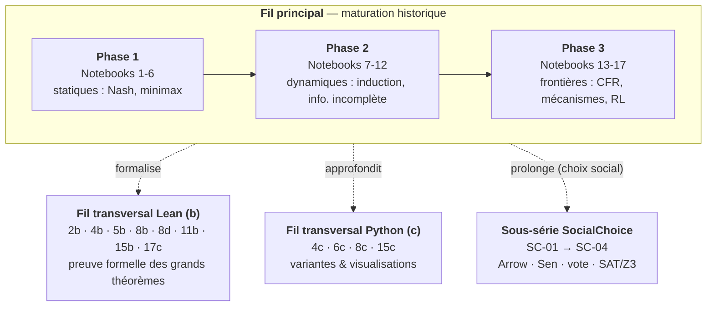
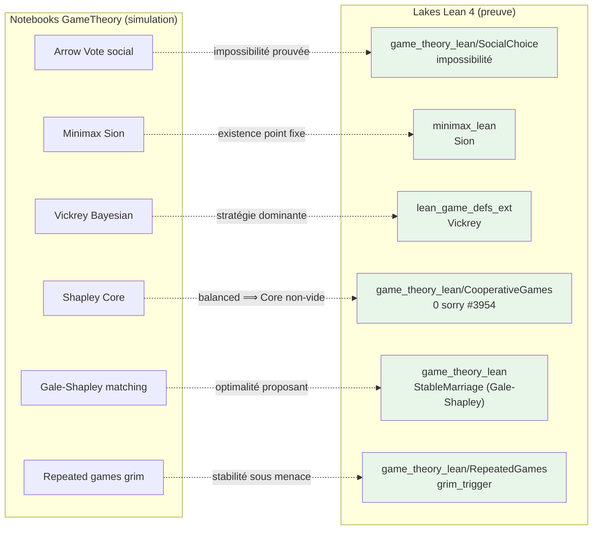

# Théorie des Jeux - Game Theory

[← Notebooks](../README.md) | [↑ ..](../README.md) | [→ RL](../RL/README.md)

<!-- CATALOG-STATUS
series: GameTheory
pedagogical_count: 89
breakdown: root=82, SocialChoice=7
maturity: BETA=84, ALPHA=3, DRAFT=2
-->

La théorie des jeux est le langage mathématique de la stratégie. Elle modélise les situations où des agents rationnels prennent des décisions dont le résultat dépend des choix des autres : enchères, négociations commerciales, élections, poker, guerre commerciale, allocation de ressources. Cette dualité entre coopération et compétition est omniprésente en économie, en sciences politiques et en informatique (mécanismes de vote, smart contracts, réseaux). Le prix Nobel d'économie a été décerné à des théoriciens des jeux à sept reprises entre 1994 et 2020 — c'est un domaine vivant et influent.

Cette série vous forme sur deux axes complémentaires. Le premier est **pratique** : simuler des jeux avec Nashpy et OpenSpiel, calculer des équilibres de Nash, organiser des tournois itératifs (dilemme du prisonnier, Axelrod), et explorer les algorithmes modernes (CFR, Deep CFR). Le second est **formel** : prouver des résultats en Lean 4 — existence de Nash (Brouwer/Kakutani), théorème d'Arrow, valeur de Shapley. À la fin, vous maîtriserez aussi bien la théorie des jeux coopératifs (Shapley, Core) que non-coopératifs (Nash, SPE), et vous saurez formaliser ces résultats dans un assistant de preuve.

**À qui s'adresse cette série** : étudiants en économie, informatique et mathématiques appliquées. Le fil Python s'exécute nativement avec Nashpy, NumPy, SciPy et Z3 ; seuls GT-13 et GT-17 demandent l'environnement WSL OpenSpiel. Les side tracks Lean (`2b`, `4b`, `5b`, `8b`, `8d`, `11b`, `15b`, `17c`) utilisent le kernel Lean 4 sous WSL ; les side tracks `c` restent des notebooks Python natifs. Aucun prérequis en théorie des jeux : les concepts sont introduits progressivement depuis les matrices de gains. Une familiarité avec l'algèbre linéaire et les probabilités de base est utile.

## Pourquoi cette série

La théorie des jeux occupe une position charnière dans le curriculum d'IA. Elle est le **point de rencontre** entre l'optimisation (maximiser son gain), la logique (raisonner sur les croyances d'autrui) et l'informatique (algorithmes de résolution, formalisation en assistant de preuve). Aucune autre discipline ne combine ces trois dimensions avec autant de profondeur mathématique et d'applications concrètes.

Cette série est construite sur une **dualité délibérée simulation/preuve** :

- **Simulation (Python)** : calculer des équilibres de Nash, simuler des tournois itérés, entraîner des agents CFR. On *voit* la théorie en action — les équilibres émergent des interactions répétées, la coopération émerge de l'égoïsme même. L'expérience numérique ancre l'intuition.
- **Preuve formelle (Lean 4)** : prouver l'existence de Nash (Brouwer/Kakutani), l'impossibilité d'Arrow, les axiomes de Shapley. On *certifie* les résultats — aucun `sorry` dans les théorèmes majeurs. La machine vérifie ce que l'intuition avait suggéré.

Les deux approches se nourrissent mutuellement. Le notebook Python montre *pourquoi* l'équilibre de Nash est plausible ; le notebook Lean prouve *qu'il existe forcément*. Le notebook SocialChoice/01 montre qu'Arrow est *contre-intuitif* ; `Arrow.lean` prouve qu'il est *inévitable*.

**Parité .NET** : la série dispose d'un ensemble substantiel de **jumeaux C# (.NET Interactive)** couvrant tout le fil principal — du calcul d'équilibres (Nash pur/mixte par élimination de Gauss en GT-4, simplexe de Dantzig en GT-5) aux jeux répétés (IPD + Folk Theorem en GT-6/6c), jeux combinatoires (Sprague-Grundy, Wythoff en GT-8/8c), information incomplète (CFR sur Kuhn Poker en GT-13), jeux coopératifs (Shapley/Banzhaf en GT-15/15c), conception de mécanismes (Vickrey/VCG/Gale-Shapley en GT-16) jusqu'au **choix social** (méthodes de vote et paradoxe de Condorcet en SC-03). Chaque jumeau implémente les algorithmes **from-scratch en C# pur** (BCL .NET 9, zéro dépendance externe, matplotlib → rendu ASCII/console), démontrant que la théorie se code sans librairie dédiée. Marathon parité .NET ⇄ Python (#4956), EPIC #3801 Prong B — voir le tableau « Ce que chaque notebook apporte » pour la liste exhaustive.

Au-delà de la théorie classique, cette série couvre les **applications contemporaines** qui utilisent la théorie des jeux en production : enchères VCG pour la publicité en ligne (milliards de transactions/jour), systèmes de matching (Gale-Shapley pour les affectations étudiant-hôpital), IA de poker (Libratus/Pluribus), et gouvernance on-chain (DAO, vote vérifiable).

## Objectifs d'apprentissage

À l'issue de cette série, vous serez capable de :

1. **Modéliser** une interaction stratégique sous forme normale ou extensive, et y lire dominance, meilleure réponse, ensembles d'information et menaces crédibles
2. **Calculer** des équilibres : Nash pur et mixte (Lemke-Howson), minimax et dualité LP, équilibre parfait en sous-jeux
3. **Simuler** des dynamiques d'apprentissage et d'évolution : tournois Axelrod, **processus de Moran (stochastic finite-population fixation)**, replicator dynamics, CFR/Deep CFR, NFSP/PSRO
4. **Analyser** la coopération : Shapley, Core, Bondareva-Shapley ; concevoir un mécanisme incitatif (révélation, VCG)
5. **Raisonner** sur l'agrégation collective : Arrow, Sen, Condorcet/Borda/Copeland, encodage SAT/Z3
6. **Formaliser** ces résultats en Lean 4 — du point fixe de Brouwer à l'axiomatique de Shapley et à la preuve d'Arrow

## Parcours d'apprentissage

Les figures qui ponctuent ce parcours sont extraites des sorties réelles des notebooks (EPIC #5654) ; chacune est réintégrée en regard du concept qu'elle illustre, et sa provenance exacte (notebook et cellule) est documentée dans `assets/readme/MANIFEST.md`.

### Phase 1 : Jeux statiques et équilibres (Notebooks 1-6 + side tracks b/c, ~9h05)

Le parcours commence par le setup (Nashpy, OpenSpiel) et les jeux sous forme normale (matrices de gains, dominance, meilleure réponse). Le notebook 3 (Topology2x2) classifie les jeux 2x2 selon la table périodique de Robinson-Goforth, une perspective géométrique unique. Les notebooks 4-4b-4c plongent dans l'équilibre de Nash : calcul en stratégies pures et mixtes, algorithme de Lemke-Howson, et preuve formelle d'existence via Brouwer et Kakutani en Lean 4. Le notebook 5 (ZeroSum) démontre le théorème minimax et la dualité LP. Le notebook 6 (EvolutionTrust) montre comment la coopération émerge dans les tournois itérés (Axelrod, replicator dynamics) **et l'exécution effective du processus de Moran stochastique** (cf. [#7594](https://github.com/jsboige/CoursIA/pull/7594) Prong-B) : la dynamique de population FINIE en Axelrod diverge souvent de l'intuition mean-field, et le drift génétique peut fixer des stratégies sous-optimales (Defector 28 % / Grudger 24 % / TitForTat 12 % sur 25 graines). Son companion **6c** (RepeatedGames-FolkTheorem) formalise cette intuition : horizon fini → effondrement par induction arrière, horizon infini → grim trigger, condition de crédibilité $\delta \geq (T-R)/(T-P)$, Folk Theorem (tout paiement faisable et individuellement rationnel est soutenable comme SPNE pour $\delta$ assez proche de 1). Son prolongement **6d** (Sympathie-vs-Engagement) construit le protocole qui identifie ce qui porte la coopération quand la menace est retirée : statique comparative sur les gains d'autrui à gains propres gelés — la pente du taux de coopération sépare sympathie (réponse aux gains d'autrui, `alpha` mesuré) et engagement (règle insensible). À l'issue de cette phase, vous comprenez les trois piliers : Nash, minimax, et évolution. Les deux figures suivantes, toutes deux bâties sur l'exemple canonique du Dilemme du Prisonnier, illustrent les deux gestes fondateurs de cette phase : **représenter** un jeu, puis le **résoudre**.



*`GameTheory-01-Setup` — représenter un jeu sous forme normale : la matrice des gains du Dilemme du Prisonnier. Chaque case porte le couple (gain Ligne, gain Colonne) ; la case (Défaire, Défaire) = (1, 1), encadrée en bleu, est l'unique équilibre de Nash — bien que (Coopérer, Coopérer) = (3, 3) soit collectivement supérieur.*



*`GameTheory-02-NormalForm` — résoudre un jeu : on souligne la meilleure réponse de chaque joueur (bleu = joueur Ligne, rouge = joueur Colonne). La seule case où les deux soulignements coïncident (en vert) est l'équilibre de Nash — la lecture graphique de la dominance vue à gauche.*

### Phase 2 : Jeux dynamiques et information incomplète (Notebooks 7-12 + side tracks b/c, ~7h45)

La Phase 2 enrichit le modèle avec le temps et l'incertitude. Les notebooks 7-9 couvrent les jeux extensifs (arbres de jeu, ensembles d'information), les jeux combinatoires (Nim, Sprague-Grundy, avec formalisation Lean), et l'induction arrière (mille-pattes, escalade) — prolongée par les approfondissements Stackelberg (**9b** l'engagement, **9c** les security games à capteur imparfait). Les notebooks 10-12 abordent les concepts subtils : induction avant et sous-jeux parfaits, jeux bayésiens (information incomplète, types, croyances), et jeux de réputation (signaling, engagement). Cette phase présuppose la Phase 1 (Nash, matrices de gains).



*`GameTheory-10-ForwardInduction-SPE` — l'induction avant sur la forme extensive. L'ensemble d'information de J2 (ellipse pointillée) l'empêche de distinguer les deux nœuds ; mais en jouant « In » plutôt que l'option extérieure « Out » (garantie de 2), J1 révèle son intention de jouer Stag. Ce raisonnement « brûle » l'équilibre (Hare, Hare) et sélectionne le sous-jeu parfait (In, Stag, Stag) de valeur (4, 4).*

### Phase 3 : Frontières — algorithmes, coopération, mécanismes (Notebooks 13-17 + sous-série SocialChoice + side tracks b/c, ~10h30)

La Phase 3 couvre les sujets avancés et les applications. Le notebook 13 (CFR) introduit Counterfactual Regret Minimization et ses variantes (MCCFR, Deep CFR), au cœur du poker AI moderne. Le notebook 14 (Differential Games) explore les jeux continus (Stackelberg, boucle ouverte/fermée). Les notebooks 15-15b-15c couvrent la théorie coopérative : valeur de Shapley (avec axiomes formels en Lean), Core, Bondareva-Shapley. Le notebook 16 et la sous-série [SocialChoice/](SocialChoice/) constituent le bloc le plus riche : design de mécanismes (révélation, VCG), choix social (Arrow, Gibbard-Satterthwaite, Sen en Lean), et encodage SAT/Z3 des impossibilités. Le notebook 17 (Multi-Agent RL) relie la théorie des jeux à l'apprentissage par renforcement (NFSP, PSRO, AlphaZero). Le companion **17b** (Asymmetric-Information, EPIC #12844) traite l'information asymétrique dans sa forme actuarielle : les quatre modèles fondateurs d'Akerlof (point fixe de participation, marché des citrons), Spence (signal coûteux), Rothschild-Stiglitz (screening assurantiel) et Wilson/Miyazaki (règle anticipative bornée). Son extension formelle **17c** (Lean-Lemons-Certificat) exécute en direct le certificat du lake `asymmetric_information_lean` : seuil de pooling exact (`poolingTenable_iff_cross`), monotonie, clôture axiomatique minimale — et rejoue la spirale de prix d'Akerlof dans le langage même du certificat. Les trois figures suivantes échantillonnent cette phase : l'apprentissage d'un équilibre en information imparfaite (CFR), la stabilité coopérative (Core et Shapley), et la convergence d'agents en auto-apprentissage.



*`GameTheory-13-ImperfectInfo-CFR` — le Counterfactual Regret Minimization sur le poker de Kuhn. À gauche, la moyenne mobile (rouge) de l'utilité de J1 converge vers la valeur de Nash du jeu (−0,0556, pointillé vert) malgré le bruit par itération. À droite, les probabilités de mise apprises pour chaque carte (J/Q/K) rejoignent les étoiles du Nash théorique — l'algorithme reconstruit le bluff optimal sans jamais connaître la stratégie adverse.*


*`GameTheory-15-CooperativeGames` — la répartition d'une valeur commune v(N) = 9 entre trois firmes A, B, C. Chaque point du triangle est un partage ; les points verts forment le **Core** (les partages qu'aucune coalition ne peut contester), et l'étoile rouge est la **valeur de Shapley** — ici confortablement à l'intérieur du Core, donc stable.*



*`GameTheory-17-MultiAgent-RL` — deux dynamiques d'apprentissage sur Pierre-Feuille-Ciseaux. À gauche (échelle log), le self-play naïf reste exploitable en oscillant, tandis que le fictitious play voit son exploitabilité décroître régulièrement. À droite, les fréquences Rock/Paper/Scissors du fictitious play convergent vers le Nash uniforme (1/3, 1/3, 1/3, pointillé) — la convergence de Robinson (1951) en action.*

### Au-delà du round-robin : processus de Moran en population FINIE (GameTheory-6)

La cellule 39 du notebook `GameTheory-06-EvolutionTrust` nomme explicitement la **dynamique de Moran** (librairie [`axelrod`](https://github.com/Axelrod-Python/Axelrod), Knight et al. *JORS* 2016) comme capacité écologique distinctive, et affirme que « *TitForTat domine surtout dans les formats Moran / écologiques* ». Avant la PR [#7594](https://github.com/jsboige/CoursIA/pull/7594) (2026-07-20, commit `95fef165e5`), cette affirmation n'avait **jamais été exécutée** sur le notebook : seule la cellule 38 (round-robin déterministe) tournait. C'est exactement le **Prong-B** identifié par EPIC [#3801](https://github.com/jsboige/CoursIA/issues/3801) — une capacité nommée sans être head-to-head validée.

**Ce que la PR #7594 a first-hand exécuté** (cellules 40-41 du notebook) :

| Stratégie | Fixations sur 25 graines (axe 2 % = barre de fréquence) |
|---|---|
| **Defector** | **7/25 (28 %)** — single-trajectory seed=42 |
| **Grudger** | 6/25 (24 %) |
| Win-Stay Lose-Shift | 4/25 (16 %) |
| Random (p=0,5) | 3/25 (12 %) |
| **Tit For Tat** | **3/25 (12 %)** — loin du « toujours domine » |
| Cooperator | 2/25 (8 %) |

**Pourquoi cette section manquait avant** : la dynamique de Moran est une dynamique **stochastique** sur une population FINIE — chaque étape copie un joueur proportionnellement à son fitness, puis élimine un joueur uniformément au hasard. L'argument du round-robin (où Grudger et TitForTat dominent) ne s'applique pas tel quel : la **dérive génétique** (genetic drift) peut fixer une stratégie sous-optimale simplement par fluctuation d'échantillonnage, indépendamment de son fitness. C'est la distinction canonique entre replicator dynamics **mean-field déterministe** (§5 du notebook) et Moran **fini stochastique** (§7bis).

**À retenir** :
1. **Population FINIE ≠ champ moyen.** Le passage à la limite $N \to \infty$ du Moran process converge vers le replicator dynamics, mais à $N$ fini (typiquement 3-100 en écologie/comportement/biological evolution), le bruit d'échantillonnage domine quand $|f_A - f_B| \lesssim 1/N$ — d'où la victoire du Defector pur (fitness intermédiaire mais gagnée par drift) sur TitForTat (fitness plus élevée, fixée moins souvent).
2. **Head-to-head obligatoire.** Nommer un mécanisme sans l'exécuter produit des assertions invérifiables (Prong-B fondateur #3801). Le notebook 6 après #7594 cite le Moran process *avec sa sortie réelle* — Defector 28 %, TitForTat 12 % — et explicite pourquoi l'intuition « moraliste » du IPD round-robin ne survit pas au passage en population FINIE.
3. **Cross-fertilisation écologique.** Le Moran process est l'outil de référence en evolutionary game theory (Nowak 2006 *Evolutionary Dynamics*) — bien plus qu'un gadget. Sans cette capacité, le notebook 6 reste aveugle à 60 % de la littérature post-Axelrod.

### Point fixe discriminant : pourquoi `regret=0` définit l'équilibre (GameTheory-4c)

La cellule `perturbed_br` du notebook `GameTheory-04c-NashExistence-Python` (side-track Python du 4b Lean) illustre numériquement le théorème du point fixe de Brouwer appliqué à Matching Pennies : si `x*` est un point fixe de `perturbed_br`, alors la **carte n'en bouge pas** — c'est-à-dire que le vecteur de **regret** y est identiquement nul. Avant la PR [#7664](https://github.com/jsboige/CoursIA/pull/7664) (2026-07-21), cette cellule ne vérifiait qu'un seul seed `(0.5, 0.5)` — qui est précisément l'équilibre de Nash de Matching Pennies. Or à l'équilibre, le regret est `0` par définition, donc la perturbation `ε` est un **no-op** et la carte renvoie l'identité : « `(0.5, 0.5)` est point fixe » était **tautologiquement vrai par construction**, sans exercer la machinerie regret/perturbation. Le pattern Prong-B fondateur ([#3801](https://github.com/jsboige/CoursIA/issues/3801)) — un solveur démontré sur un cas où sa capacité distinctive ne fait rien (cf. BFS-vs-A* `8905f8845`).

**Ce que la PR #7664 a first-hand exécuté** (cellules `70b72753` code + `134eeb5b` markdown du notebook) — un contraste à deux seeds qui rend visible *pourquoi* l'équilibre est un point fixe :

| Seed | Vecteur de regret | `perturbed_br` renvoie | Fixed point ? |
|---|---|---|---|
| `(0.8, 0.2)` (non-équilibre) | `[0.24, 0]` (non-nul) | `[0.8047, 0.1953]` ≠ entrée | **Non** — la carte déplace activement le point |
| `(0.5, 0.5)` (équilibre de Nash) | `[0, 0]` (nul) | `(0.5, 0.5)` = entrée | **Oui** — par définition, le seul point fixe |

**Pourquoi cette section manquait avant** : tester **uniquement** `(0.5, 0.5)` revient à tester `f(x*) = x*` après avoir choisi `x*` par définition. Sans seed non-équilibre, on ne distingue jamais le « point fixe » du « point arbitraire où le regret est nul par accident ». La cellule 2ab3160a du notebook — qui montre la convergence joueur par joueur depuis un départ non-équilibre — fait déjà la moitié du travail ; #7664 amène le **test single-cell** au même standard de discrimination et l'accompagne d'un markdown qui nomme explicitement l'anti-tautologie (« Tester uniquement l'équilibre serait tautologique »).

**À retenir** :
1. **`regret ≡ 0 ⟺ fixed point`** (par définition du regret-based no-regret learning, voir Hart & Mas-Colell 2000 *Simple Adaptive Strategies*). Brouwer appliqué à `perturbed_br` n'a rien de magique : c'est exactement le critère de no-regret qui définit la convergence vers Nash.
2. **Anti-tautologie systématique.** Pour tout test de point fixe / optimalité / convergence, exiger **au moins un seed non-équilibre** qui doit être déplacé. Sans cela, le test ne prouve rien qu'une lecture de la définition ne donne déjà.
3. **Lien avec le Lean 4b.** Le `Brouwer/Kakutani` prouvé formellement dans `GameTheory-04b-Lean-NashExistence` (lake `minimax_lean` côté Sion, sans `sorry`) **garantit l'existence** d'un tel point fixe ; le 4c-Python **l'illustre numériquement** par une carte `perturbed_br` concrète sur Matching Pennies — la preuve formelle et la simulation numérique se complètent sans se substituer.

## Progression recommandée

### Découvreur (fondements statiques, ~5h)

Commencez par les notebooks 1 (Setup) et 2 (NormalForm) pour comprendre les matrices de gains et la dominance stratégique. Le notebook 4 (NashEquilibrium) introduit le concept central de la série : l'équilibre de Nash, pur et mixte. Le notebook 5 (ZeroSum-Minimax) complète avec le théorème minimax de Von Neumann et la programmation linéaire. Ces quatre notebooks suffisent pour comprendre les bases de la théorie des jeux non-coopératifs.

### Praticien (jeux dynamiques et Lean, ~10h)

Poursuivez avec les jeux dynamiques : notebook 7 (formes extensives), 9 (induction arrière), 10 (induction avant et SPE). Le notebook 6 (EvolutionTrust) offre une pause rafraîchissante avec le tournoi d'Axelrod. Les side tracks Lean (2b, 4b) vous initient à la formalisation des résultats en assistant de preuve. À ce stade, vous êtes capable de modéliser des interactions stratégiques complexes et de les vérifier formellement.

### Expert (applications avancées et choix social, ~19h)

Les notebooks 13 (CFR), 15 (jeux coopératifs, Shapley), et 16 (design de mécanismes, Arrow) ouvrent les frontières de la discipline. La sous-série [SocialChoice/](SocialChoice/) (8 notebooks dont 3 twins C#) approfondit les théorèmes d'Arrow et de Gibbard-Satterthwaite via Lean, SAT et Z3. Le notebook 17 (Multi-Agent RL) fait le pont avec l'apprentissage par renforcement.

### Parcours alternatifs

#### Parcours formalisation Lean uniquement (~4h)

Si vous venez de la série [SymbolicAI/Lean](../SymbolicAI/Lean/README.md) et voulez voir la théorie des jeux sous l'angle formel :

1. **2b** (Lean Definitions) : Game2x2, stratégies mixtes
2. **4b** (Nash Existence) : Brouwer, Kakutani, preuve d'existence
3. **8b** (Combinatorial Games) : PGame Mathlib, Nim, Sprague-Grundy — et **8d** : la même théorie exécutée depuis la bibliothèque canonique post-Mathlib (`conway_cgt_lean`)
4. **15b** (Cooperative Games) : Axiomes Shapley, Core
5. **SC-02** (SocialChoice Formal) : Arrow, Sen, Median Voter en Lean

Ce parcours suppose une familiarité avec Lean 4 (tactiques basiques, types inductifs). Les notebooks Python correspondants (2, 4, 8, 15, SC-01) fournissent l'intuition mais ne sont pas des prérequis.

#### Parcours applications réelles (~6h)

Si vous préférez les cas d'usage aux fondements théoriques :

1. **5** (ZeroSum) : programmation linéaire, dualité, trading
2. **6** (EvolutionTrust) : émergence de la coopération, biologie
3. **13** (CFR) : poker AI, regret minimization
4. **16** (MechanismDesign) : enchères VCG, allocation de ressources, et le piège de la non-monotonie du revenu (Conitzer-Sandholm)
5. **SC-03** (Voting) : Condorcet, Borda, modèles électoraux

#### Parcours information asymétrique et assurance (~4h30)

Si vous venez d'un métier de l'assurance, de la banque ou de la régulation et cherchez comment la théorie des jeux modélise le fait qu'un agent en sait plus que l'autre — le client sur son risque, l'emprunteur sur sa solvabilité, le vendeur sur sa qualité :

1. **11** (BayesianGames) : types privés, croyances, équilibre bayésien — la fondation de l'information incomplète (~55 min)
2. **12** (ReputationGames) : signaling, cheap talk — le geste du signal coûteux et de l'engagement (~50 min)
3. **16** (MechanismDesign) : principe de révélation, VCG — la conception d'un contrat sous contrainte d'incitation (~65 min)
4. **17b** (Asymmetric-Information) : les quatre modèles fondateurs — **Akerlof** (contre-sélection, marché des citrons), **Spence** (signal coûteux), **Rothschild-Stiglitz** (screening assurantiel), **Wilson/Miyazaki** (règle anticipative bornée) (~1h30)
5. **17c** (Lean-Lemons-Certificat) : le certificat formel du lake `asymmetric_information_lean` exécuté en direct — falaise du seuil de pooling à π = 75 % décidée, monotonie, spirale de prix des trois régimes (~45 min)

Ce parcours se lit sans imposer les phases 1-3 complètes : le notebook 11 introduit seul la notion de type privé, et 17b s'appuie principalement sur cette intuition bayésienne. À l'issue, vous saurez reconnaître et classifier un problème de tarification en information asymétrique — et pourquoi un marché peut s'effondrer en « marché des citrons ».

#### Parcours informatique théorique (~5h)

Si votre intérêt est l'algorithmique et la complexité :

1. **2** (NormalForm) : matrices de gains, dominance
2. **4** (NashEquilibrium) : Lemke-Howson, PPAD-complétude
3. **8** (CombinatorialGames) : Sprague-Grundy, nimbers
4. **13** (CFR) : contre-factual regret, convergence
5. **SC-04** (SAT/Z3) : encodage de théorèmes en SAT, UNSAT proofs

## Structure

La série s'articule autour d'un **fil principal** qui suit la maturation historique de la discipline — des jeux statiques (matrices de gains, Nash, minimax) vers les jeux dynamiques (formes extensives, induction, information incomplète) puis les frontières contemporaines (CFR pour le poker, mécanismes, choix social, RL multi-agent). Ce fil est doublé de deux fils transversaux optionnels : un **fil de formalisation Lean 4** (side tracks *b*), qui prouve mécaniquement les grands théorèmes au lieu de seulement les illustrer, et un **fil Python d'approfondissement** (side tracks *c*) pour les variantes et visualisations avancées. Après GT-17, la **strate 7** ajoute des extensions autonomes numérotées selon leur chantier plutôt que comme une quatrième progression linéaire ; les suffixes littéraux `3a` à `3f` prolongent ainsi GT-3 autour de la géométrie ordinale des jeux. La sous-série **[SocialChoice/](SocialChoice/)** prolonge le bloc « agrégation des préférences » avec une étude dédiée d'Arrow, Sen et des méthodes de vote, en confrontant preuve formelle, simulation et encodage SAT/Z3.

Chaque notebook principal renvoie vers ses side tracks ; ceux-ci se lisent indépendamment et ne sont jamais des prérequis du fil principal.


```mermaid
flowchart TD
    subgraph FIL["<b>Fil principal</b> — maturation historique"]
        direction LR
        P1["<b>Phase 1</b><br/>Notebooks 1-6<br/>statiques : Nash, minimax"]
        P2["<b>Phase 2</b><br/>Notebooks 7-12<br/>dynamiques : induction, info. incomplète"]
        P3["<b>Phase 3</b><br/>Notebooks 13-17<br/>frontières : CFR, mécanismes, RL"]
        P1 --> P2 --> P3
    end
    LEAN["<b>Fil transversal Lean (b)</b><br/>2b · 4b · 5b · 8b · 8d · 11b · 15b · 17c<br/>preuve formelle des grands théorèmes"]
    PYC["<b>Fil transversal Python (c)</b><br/>4c · 6c · 8c · 15c<br/>variantes &amp; visualisations"]
    SC["<b>Sous-série SocialChoice</b><br/>SC-01 → SC-04<br/>Arrow · Sen · vote · SAT/Z3"]
    FIL -.->|"formalise"| LEAN
    FIL -.->|"approfondit"| PYC
    FIL -.->|"prolonge (choix social)"| SC
```

### Partie 1 : Fondations et Jeux statiques (Notebooks 1-6)

| # | Notebook | Kernel | Contenu | Durée |
|---|----------|--------|---------|-------|
| 1 | [GameTheory-01-Setup](GameTheory-01-Setup.ipynb) | Python | Installation Nashpy, OpenSpiel, vérification | 20 min |
| 2 | [GameTheory-02-NormalForm](GameTheory-02-NormalForm.ipynb) | Python | Matrices de gains, dominance, best response | 45 min |
| 2 (suite) | [GameTheory-02-NormalForm-Part2-Python](GameTheory-02-NormalForm-Part2-Python.ipynb) | Python | Support enumeration mixte N×N from-scratch et vérification Nashpy | 50 min |
| 2 (C#) | [GameTheory-02-NormalForm-Csharp](GameTheory-02-NormalForm-Csharp.ipynb) | C# (.NET) | Jumeau C# : forme normale et équilibres de Nash from-scratch | 45 min |
| 2 (C#, suite) | [GameTheory-02-NormalForm-Csharp-Part2](GameTheory-02-NormalForm-Csharp-Part2.ipynb) | C# (.NET) | Suite du jumeau C# : support enumeration et jeux N×N | 50 min |
| 2b | [GameTheory-02b-Lean-Definitions](GameTheory-02b-Lean-Definitions.ipynb) | Lean 4 | Formalisation Game2x2, stratégies, Nash | 45 min |
| 3 | [GameTheory-03-Topology2x2](GameTheory-03-Topology2x2.ipynb) | Python | Classification Robinson-Goforth, table périodique | 55 min |
| 3 (C#) | [GameTheory-03-Topology2x2-Csharp](GameTheory-03-Topology2x2-Csharp.ipynb) | C# (.NET) | **Jumeau C#** — topologie ordinale from-scratch : permutations, swaps de rangs, BFS swap-path, Nash, classification des 576 jeux (parité #4956) | 50 min |
| 3a | [GameTheory-03a-Chemins-de-Swaps](GameTheory-03a-Chemins-de-Swaps.ipynb) | Python + Lean | Plus courts chemins de swaps sur les 576 jeux : BFS générateur et certificat Lean indépendant | 45 min |
| 3b | [GameTheory-03b-Chambres-et-Murs](GameTheory-03b-Chambres-et-Murs.ipynb) | Python | Chambres et murs (Bruns-Kimmich) : les 576 jeux stricts comme chambres d'un arrangement, les égalités comme murs de codimension — 75 ordres faibles, incidence double-face mur/chambre, BFS connexe diamètre 6, swaps en longueurs de Coxeter, make_tie/break_tie duales (chantier 4 #12207, versant D2) | 45 min |
| 3c | [GameTheory-03c-Le-Joueur-LLM](GameTheory-03c-Le-Joueur-LLM.ipynb) | Python | Joueur LLM placé dans le tableau périodique et confronté à des transformations ordinales | 45 min |
| 3d | [GameTheory-03d-Plan-de-deformation](GameTheory-03d-Plan-de-deformation.ipynb) | Python | Biens publics non linéaires et plan de déformation de l'espace stratégique | 45 min |
| 3e | [GameTheory-03e-Meta-Actions-Tarifees](GameTheory-03e-Meta-Actions-Tarifees.ipynb) | Python | Méta-actions tarifées : changer les règles comme action payante — NE/BR sur les 576 jeux (72 injouables), coût en échelons de rang avec seuil de migration 56→16→8→4 %, le Dilemme exactement indifférent à c=1, méta-jeu 4x4 où l'évasion conjointe du Dilemme EST un équilibre (3,3), 4 échecs de coordination dur (chantier 4 #12207, versant D4) | 45 min |
| 3f | [GameTheory-03f-Parcours-Complet](GameTheory-03f-Parcours-Complet.ipynb) | Python | Parcours complet du jeu nommé au coût de la méta-action | 45 min |
| 3h | [GameTheory-03h-Deux-Especes-de-Fleches](GameTheory-03h-Deux-Especes-de-Fleches.ipynb) | Python | Deux espèces de flèches : le théorème fini du chemin minimal de swaps (un swap R(a,b) traverse un mur ssi colonne {a,b} ET mur habité — conjecture naïve réfutée sur 288 désaccords, condition vérifiée 3456/3456, comptage 432/576 dérivé) | 60 min |
| 4 | [GameTheory-04-NashEquilibrium](GameTheory-04-NashEquilibrium.ipynb) | Python | Nash pur/mixte, Lemke-Howson, analyse paramétrique, marchandage asymétrique §8 : faisceau de dépendance multi-composantes et point de désaccord — le principe du moindre intérêt réfuté comme loi, conservé comme effet partiel (#12682) | 60 min |
| 4 (C#) | [GameTheory-04-NashEquilibrium-Csharp](GameTheory-04-NashEquilibrium-Csharp.ipynb) | .NET (C#) | Twin C# du 4 : **NE pur (best-response mutuelle) + mixte 2x2 (indifférence) + support enumeration from-scratch (élimination de Gauss)**, Matching Pennies/BoS/Stag Hunt/PD/RPS (See #4956) | 50 min |
| 4b | [GameTheory-04b-Lean-NashExistence](GameTheory-04b-Lean-NashExistence.ipynb) | Lean 4 | Brouwer, Kakutani, preuve existence Nash | 55 min |
| 4c | [GameTheory-04c-NashExistence-Python](GameTheory-04c-NashExistence-Python.ipynb) | Python | **Point fixe Brouwer discriminant** — `perturbed_br` (regret ⇒ déplacement), double seed non-équilibre/équilibre, anti-tautologie Prong-B [#7664] | 35 min |
| 4c | [GameTheory-04c-NashExistence-Csharp](GameTheory-04c-NashExistence-Csharp.ipynb) | C# (.NET) | **Jumeau C#** — Brouwer point fixe + Matching Pennies, from-scratch, parité #4956 | 45 min |
| 5 | [GameTheory-05-ZeroSum-Minimax](GameTheory-05-ZeroSum-Minimax.ipynb) | Python | Théorème minimax, LP primal/dual, Von Neumann | 40 min |
| 5 (C#) | [GameTheory-05-ZeroSum-Minimax-Csharp](GameTheory-05-ZeroSum-Minimax-Csharp.ipynb) | .NET (C#) | Twin C# du 5 : **simplexe from-scratch** (Dantzig, règle de Bland) + dualité LP, Matching Pennies/RPS/Blotto (See #4956) | 45 min |
| 5b | [GameTheory-05b-Lean-Minimax](GameTheory-05b-Lean-Minimax.ipynb) | Lean 4 | Companion **natif** (kernel Lean) : preuve formelle 0-sorry de von Neumann dans le lake `minimax_lean` (Sion), `#check` + `#print axioms` in-kernel — voir [#4054](https://github.com/jsboige/CoursIA/issues/4054) (création du lake) et `LEAN_INVENTORY.md` du dossier | 45 min |
| 6 | [GameTheory-06-EvolutionTrust](GameTheory-06-EvolutionTrust.ipynb) | Python | Tournoi Axelrod, tit-for-tat, **processus de Moran stochastique (fixation finie, 25 graines)** [#7594], replicator dynamics | 65 min |
| 6 (C#) | [GameTheory-06-EvolutionTrust-Csharp](GameTheory-06-EvolutionTrust-Csharp.ipynb) | .NET (C#) | Twin C# du 6 : **moteur IPD + tournoi Axelrod + replicator dynamics from-scratch** (BCL .NET 9, 0 NuGet), 7 stratégies (TitForTat/Grudger/Pavlov/...), Euler ODE (See #4956) | 55 min |
| 6b | [GameTheory-06b-Lean-RepeatedGames](GameTheory-06b-Lean-RepeatedGames.ipynb) | Lean (lecture) | Compagnon **lake** du 6c : les 7 modules noirs de `game_theory_lean` dévoilés par extraction réelle — Stage (PD forcé par le type), Discounting (seuil $\delta^*$ `coop_ge_deviate_iff`), **`grim_trigger_sustains_iff` 0 sorry #4880**, Folk STRETCH (1 sorry assumé, bord réparé), ConeKernel Bondareva-Farkas, infra SocialChoice ; re-mesure visibilité noirs 7→0 (See #11703) | 35 min |
| 6c | [GameTheory-06c-RepeatedGames-FolkTheorem](GameTheory-06c-RepeatedGames-FolkTheorem.ipynb) | Python | Compagnon **formel** de GT-6 : horizon fini (effondrement par induction arrière), horizon infini, grim trigger, condition $\delta \geq (T-R)/(T-P)$, Folk Theorem (tout paiement IR faisable est SPNE pour $\delta$ assez proche de 1) | 45 min |
| 6c (C#) | [GameTheory-06c-RepeatedGames-FolkTheorem-Csharp](GameTheory-06c-RepeatedGames-FolkTheorem-Csharp.ipynb) | .NET (C#) | Twin C# du 6c : **grim trigger + tit-for-tat + Folk Theorem from-scratch** (BCL .NET 9, 0 NuGet), série géométrique $\sum \delta^t g = g/(1-\delta)$, condition de crédibilité $\delta^* = (T-R)/(T-P) = 0.5$, comparaison des seuils grim vs TFT ($2/3$), ensemble faisable & IR en ASCII — parité bit-par-bit avec le Python (See #4956) | 45 min |
| 6d | [GameTheory-06d-Sympathie-vs-Engagement](GameTheory-06d-Sympathie-vs-Engagement.ipynb) | Python | Protocole consolidé d'identification du résidu de GT-06c §7d : statique comparative sur les gains d'autrui à gains propres gelés — pente ± IC, `alpha` par MLE profilée, contrôle IRLS + bootstrap sur graines, engagement pur et bruité à 95 %, cellule discriminante, verdict « non identifié » et trois exercices avec variantes de puissance (See #13042, #13737) | 45 min |

### Partie 2 : Jeux dynamiques et raisonnement stratégique (Notebooks 7-12)

| # | Notebook | Kernel | Contenu | Durée |
|---|----------|--------|---------|-------|
| 7 | [GameTheory-07-ExtensiveForm](GameTheory-07-ExtensiveForm.ipynb) | Python | Arbres de jeu, infosets, stratégies | 50 min |
| 7 (C#) | [GameTheory-07-ExtensiveForm-Csharp](GameTheory-07-ExtensiveForm-Csharp.ipynb) | .NET (C#) | Twin C# du 7 : **arbre de jeu + infosets + noeuds de nature from-scratch** + conversion forme extensive→normale (See #4956) | 50 min |
| 8 | [GameTheory-08-CombinatorialGames](GameTheory-08-CombinatorialGames.ipynb) | Python | Positions P/N, Nim, Grundy, Sprague-Grundy | 55 min |
| 8 (C#) | [GameTheory-08-CombinatorialGames-Csharp](GameTheory-08-CombinatorialGames-Csharp.ipynb) | .NET (C#) | Twin C# du 8 : **classification P/N + nim-sum (Bouton) + mex + Grundy DP + Sprague-Grundy** from-scratch, BCL .NET 9 (See #4956) | 45 min |
| 8b | [GameTheory-08b-Lean-CombinatorialGames](GameTheory-08b-Lean-CombinatorialGames.ipynb) | Lean 4 | PGame mathlib, Nim formel | 50 min |
| 8c | [GameTheory-08c-CombinatorialGames-Python](GameTheory-08c-CombinatorialGames-Python.ipynb) | Python | Approfondissement jeux combinatoires | 40 min |
| 8c (C#) | [GameTheory-08c-CombinatorialGames-Csharp](GameTheory-08c-CombinatorialGames-Csharp.ipynb) | .NET (C#) | Twin C# du 8c : **périodicité Grundy (Guy 1996) + Wythoff (Beatty/nombre d'or) + jeux composites (Sprague-Grundy) + Chomp (Gale)** from-scratch, BCL .NET 9 (See #4956) | 40 min |
| 8d | [GameTheory-08d-Lean-CGT-Native](GameTheory-08d-Lean-CGT-Native.ipynb) | Lean 4 (WSL) | Compagnon natif du lake `conway_cgt_lean` : `IGame`/`Game`, surréels, nimbers, **Sprague-Grundy exécuté** depuis `vihdzp/combinatorial-games` (post-Mathlib #35550) | 40 min |
| 9 | [GameTheory-09-BackwardInduction](GameTheory-09-BackwardInduction.ipynb) | Python | Induction arrière, mille-pattes, escalade | 55 min |
| 9 (C#) | [GameTheory-09-BackwardInduction-Csharp](GameTheory-09-BackwardInduction-Csharp.ipynb) | .NET (C#) | Twin C# du 9 : induction arrière from-scratch, Entry/Centipede/War-of-Attrition/Chain-Store (See #4956) | 40 min |
| 9b | [GameTheory-09b-Commitment-Stackelberg](GameTheory-09b-Commitment-Stackelberg.ipynb) | Python | Stackelberg : la performativité sans mystère — l'engagement contraignant qui **transforme la meilleure réponse d'autrui** (action sous-optimale à l'équilibre simultané, delta +2 mesuré), l'annonce révocable dissoute par induction à rebours (cheap talk), et le seuil de crédibilité **s\* = écart de tentation** (caution minimale calculée) | 40 min |
| 9c | [GameTheory-09c-Stackelberg-SecurityGame](GameTheory-09c-Stackelberg-SecurityGame.ipynb) | Python | Stackelberg Security Game : patrouille à capteur imparfait et signaling — le leader défend, le follower attaque sous observation bruitée, la robustesse du patrouilleur au bruit mesurée (issue #13295) | 45 min |
| 10 | [GameTheory-10-ForwardInduction-SPE](GameTheory-10-ForwardInduction-SPE.ipynb) | Python | Induction avant, SPE, menaces crédibles | 60 min |
| 10 (C#) | [GameTheory-10-ForwardInduction-SPE-Csharp](GameTheory-10-ForwardInduction-SPE-Csharp.ipynb) | .NET (C#) | Twin C# du 10 : SPE/backward-induction from-scratch, menaces crédibles, trembling-hand (ε), forward induction (Cho-Kreps), burn money (See #4956) | 60 min |
| 11 | [GameTheory-11-BayesianGames](GameTheory-11-BayesianGames.ipynb) | Python | Jeux bayésiens, information incomplète | 55 min |
| 11 (C#) | [GameTheory-11-BayesianGames-Csharp](GameTheory-11-BayesianGames-Csharp.ipynb) | C# (.NET) | Twin .NET de 11 (marathon #4956) : jeux bayésiens from-scratch (BCL seule), Cournot résolu analytiquement (déterminant = 6, indépendant du prior) | 65 min |
| 11b | [GameTheory-11b-Lean-BayesianGamesExt](GameTheory-11b-Lean-BayesianGamesExt.ipynb) | Lean 4 | Companion natif : théorème de Vickrey (enchère au second prix) prouvé 0-sorry dans le lake `lean_game_defs_ext` (module Bayesian, sans Mathlib) | 50 min |
| 12 | [GameTheory-12-ReputationGames](GameTheory-12-ReputationGames.ipynb) | Python | Jeux de réputation, signaling | 50 min |
| 12 (C#) | [GameTheory-12-ReputationGames-Csharp](GameTheory-12-ReputationGames-Csharp.ipynb) | C# (.NET) | Twin .NET de 12 (marathon #4956) : chain-store (Selten) + Crawford-Sobel cheap talk + Kreps-Wilson réputation (Bayes) + KMRW PD répété + PBE, from-scratch (BCL seule) | 55 min |

### Partie 3 : Algorithmes et applications avancées (Notebooks 13-17)

| # | Notebook | Kernel | Contenu | Durée |
|---|----------|--------|---------|-------|
| 13 | [GameTheory-13-ImperfectInfo-CFR](GameTheory-13-ImperfectInfo-CFR.ipynb) | Python | CFR vanilla, MCCFR, Deep CFR | 70 min |
| 13 (C#) | [GameTheory-13-ImperfectInfo-CFR-Csharp](GameTheory-13-ImperfectInfo-CFR-Csharp.ipynb) | .NET (C#) | Twin C# du 13 : CFR/CFR+ regret-matching from-scratch sur Kuhn Poker (récursion contrefactuelle, reach probabilities) (See #4956) | 60 min |
| 13b | [GameTheory-13b-Safe-Subgame-Solving](GameTheory-13b-Safe-Subgame-Solving.ipynb) | Python | Safe subgame solving : le mauvais recollement produit un témoin adversarial explicite | 45 min |
| 13c | [GameTheory-13c-Safe-Subgame-Solving-Csharp](GameTheory-13c-Safe-Subgame-Solving-Csharp.ipynb) | .NET (C#) | Twin C# du 13b : reproduction, audit des poids de chemin (double comptage 'pp'/'bp'), énumération corrigée, best-response énumérée — la loi survit, les EV absolus non (See #12208) | 40 min |
| 14 | [GameTheory-14-DifferentialGames](GameTheory-14-DifferentialGames.ipynb) | Python | Boucle ouverte/fermée, Stackelberg | 60 min |
| 14 (C#) | [GameTheory-14-DifferentialGames-Csharp](GameTheory-14-DifferentialGames-Csharp.ipynb) | .NET (C#) | Twin C# du 14 : **RK4 from-scratch** (remplace scipy.solve_ivp), **Riccati couplée backward** pour LQ feedback, Cournot/Stackelberg closed-form, poursuite-evasion (Isaacs) modelisée en RK4 (See #4956) | 60 min |
| 15 | [GameTheory-15-CooperativeGames](GameTheory-15-CooperativeGames.ipynb) | Python | Shapley, Core, Bondareva-Shapley | 65 min |
| 15 (C#) | [GameTheory-15-CooperativeGames-Csharp](GameTheory-15-CooperativeGames-Csharp.ipynb) | .NET (C#) | Twin C# du 15 : Shapley (permutations), Banzhaf (swing), core, convexité, airport game from-scratch (See #4956) | 65 min |
| 15b | [GameTheory-15b-Lean-CooperativeGames](GameTheory-15b-Lean-CooperativeGames.ipynb) | Lean 4 | Axiomes Shapley formels, Core | 55 min |
| 15c | [GameTheory-15c-CooperativeGames-Python](GameTheory-15c-CooperativeGames-Python.ipynb) | Python | Exemples avancés (Glove Game, politique) | 40 min |
| 15c (C#) | [GameTheory-15c-CooperativeGames-Csharp](GameTheory-15c-CooperativeGames-Csharp.ipynb) | .NET (C#) | Twin C# du 15c : Shapley (permutations), Banzhaf (swing), Core vide (majorité 3-joueurs), Mini-ONU, convexité from-scratch (See #4956) | 40 min |
| 15d | [GameTheory-15d-Mobius-Coalitions](GameTheory-15d-Mobius-Coalitions.ipynb) | Python | Décomposition de Möbius sur le treillis des coalitions et dividendes d'interaction | 45 min |
| 16 | [GameTheory-16-MechanismDesign](GameTheory-16-MechanismDesign.ipynb) | Python | Principe de révélation, VCG (non-monotonie du revenu, Conitzer-Sandholm), matching | 65 min |
| 16 (C#) | [GameTheory-16-MechanismDesign-Csharp](GameTheory-16-MechanismDesign-Csharp.ipynb) | .NET (C#) | Twin C# du 16 : **enchères Vickrey 1er/2nd prix + VCG (règle de Clarke) + Gale-Shapley (stable matching) + double auction** from-scratch, BCL .NET 9 (See #4956) | 50 min |
| 16b | [GameTheory-16b-Automated-Mechanism-Design](GameTheory-16b-Automated-Mechanism-Design.ipynb) | Python | Automated Mechanism Design : synthèse et vérification d'un mécanisme sous contraintes | 35 min |
| 16d | [GameTheory-16d-Echange-de-Reins](GameTheory-16d-Echange-de-Reins.ipynb) | Python | L'échange de reins : de la valeur humaine à l'état institutionnel — graphe de compatibilité, cycles vs chaînes (donneurs altruistes), arbitrage cardinalité/équité dissocié par le code, pont cross-domain vers les lakes Lean | 35 min |
| SC-01 | [SocialChoice/01-Arrow-Impossibility-Theorem](SocialChoice/01-Arrow-Impossibility-Theorem.ipynb) | Python | Arrow : preuve formelle vs simulation | 45 min |
| SC-01 (C#) | [SocialChoice/01-Arrow-Impossibility-Theorem-Csharp](SocialChoice/01-Arrow-Impossibility-Theorem-Csharp.ipynb) | .NET (C#) | Twin C# du SC-01 : **théorème d'Arrow from-scratch** (BCL .NET 9, 0 NuGet), preuve déterministe par énumération des profils de préférences (See #4956) | 45 min |
| SC-02 | [SocialChoice/01b-Lean-SocialChoice-Formal](SocialChoice/01b-Lean-SocialChoice-Formal.ipynb) | Lean 4 + Python | Arrow, Sen, Électeur Médian, tour Peters | 70 min |
| SC-03 | [SocialChoice/03-Voting-Methods](SocialChoice/03-Voting-Methods.ipynb) | Python | Condorcet, Borda, Copeland, modèle Downs | 45 min |
| SC-03 (C#) | [SocialChoice/03-Voting-Methods-Csharp](SocialChoice/03-Voting-Methods-Csharp.ipynb) | .NET (C#) | Twin C# du SC-03 : **Plurality/Borda/Copeland/Condorcet/IRV from-scratch** (BCL .NET 9, 0 NuGet), paradoxe de Condorcet (cycle A>B>C), théorème d'Arrow (violation IIA démontrée déterministement), théorème de l'électeur median (See #4956) | 45 min |
| SC-04 | [SocialChoice/04-Computational-Aggregation-SAT-Z3](SocialChoice/04-Computational-Aggregation-SAT-Z3.ipynb) | Python | Arrow encodé en SAT + Z3, UNSAT, relaxation | 60 min |
| SC-05 | [SocialChoice/05-Gibbard-Satterthwaite](SocialChoice/05-Gibbard-Satterthwaite.ipynb) | Python | Gibbard-Satterthwaite : manipulation comme témoin — une règle manipulable s'il existe un profil et un électeur qui, avec un bulletin insincère, obtient un résultat strictement préféré ; le témoin d'exploitation est exhibé par le code, pas postulé | 30 min |
| SC-04 (C#) | [SocialChoice/04-Computational-Aggregation-SAT-Z3-Csharp](SocialChoice/04-Computational-Aggregation-SAT-Z3-Csharp.ipynb) | .NET (C#) | Twin C# du SC-04 : **solveur SAT DPLL from-scratch** (BCL .NET 9, 0 NuGet), Arrow encodé en CNF → preuve UNSAT (See #4956) | 60 min |
| 17 | [GameTheory-17-MultiAgent-RL](GameTheory-17-MultiAgent-RL.ipynb) | Python | NFSP, PSRO, AlphaZero intro | 55 min |
| 17 (C#) | [GameTheory-17-MultiAgent-RL-Csharp](GameTheory-17-MultiAgent-RL-Csharp.ipynb) | .NET (C#) | Twin C# du 17 : **Self-Play naif (cycle R-P-S)**, **Fictitious Play** (BR vs frequence empirique, convergence Robinson 1951), **exploitabilite**, **NFSP table-based** (Q-values + memoire, caveat convergence G.1), **PSRO** (population + meta-Nash) from-scratch, BCL .NET 9, **courbes d'exploitabilite SVG inline** (Self-Play naif oscille, FP -> 0 Robinson 1951, NFSP chute puis plafonne) via `SvgChartHelper.Overlay` zero-CDN [#6855] (See #4956) | 50 min |
| 17b | [GameTheory-17b-Asymmetric-Information](GameTheory-17b-Asymmetric-Information.ipynb) | Python | Information asymétrique : **Akerlof** (point fixe de participation à prix unique, marché des citrons), **Spence** (signal coûteux), **Rothschild-Stiglitz** (screening assurantiel), **Wilson/Miyazaki** (règle anticipative bornée) — 9 exercices, EPIC #12844 | 1h30 |
| 17c | [GameTheory-17c-Lean-Lemons-Certificat](GameTheory-17c-Lean-Lemons-Certificat.ipynb) | Lean 4 (WSL) | Companion **natif** du lake `asymmetric_information_lean` : certificat d'Akerlof exécuté en direct — `poolingTenable_iff_cross` (seuil exact par produit croisé), `poolingTenable_mono` (plancher), `#print axioms` (`[propext, Quot.sound]`), balayage du prior (falaise à π = 75 %) et spirale de prix des trois régimes (pooling / lemons-only / no-trade) — 3 exercices (#13200) | 45 min |

### Partie 4 : Strate 7 — extensions du vocabulaire stratégique (notebooks 18+)

La vague « strate 7 » étend la série au-delà du fil historique : chaque notebook y isole un geste qui **modifie l'espace des jeux** (abstraction, extension de vocabulaire) plutôt qu'une solution dans un jeu donné. Sa numérotation est volontairement non séquentielle : les numéros `18`, `19` et `24` à `28` désignent des grains autonomes livrés en parallèle, tandis que les suffixes littéraux `3a` à `3h` forment un chantier rattaché à GT-3 et à la géométrie ordinale de Robinson-Goforth. Ils ne sont donc ni des décimales ni des étapes à lire dans l'ordre de leur merge.

| # | Notebook | Kernel | Contenu | Durée |
|---|----------|--------|---------|-------|
| 18 | [GameTheory-18-Open-Games-et-Lentilles](GameTheory-18-Open-Games-et-Lentilles.ipynb) | Python | Open games et lentilles : une représentation locale qui modifie le contexte global dont elle est issue | 45 min |
| 19 | [GameTheory-19-Abstraction-a-Dette](GameTheory-19-Abstraction-a-Dette.ipynb) | Python | Abstraction à dette mesurable : quantifier ce que perd une représentation simplifiée | 35 min |
| 24 | [GameTheory-24-Chemin-Minimal-Robinson-Goforth](GameTheory-24-Chemin-Minimal-Robinson-Goforth.ipynb) | Python | Chemin minimal Robinson-Goforth : témoin construit par le générateur puis vérifié indépendamment | 45 min |
| 25 | [GameTheory-25-Loi-II-Translateur-Life](GameTheory-25-Loi-II-Translateur-Life.ipynb) | Python | Loi II : synthèse d'un translateur Life et certificat d'impossibilité lorsque la traduction échoue | 45 min |
| 26 | [GameTheory-26-Ensembles-Limites-Poincare-Bendixson](GameTheory-26-Ensembles-Limites-Poincare-Bendixson.ipynb) | Python | Ensembles limites : Poincaré-Bendixson en dimension 2 — les trois issues (point fixe, orbite périodique, cycle hétéroclinique) exécutées sur Prisonnier / Matching Pennies / RPS et classées par un détecteur mécanique (module compagnon + 16 tests), le mur $w = l$ de la famille RPS vérifié par linéarisation $(l-w)/6$ et relié aux chambres/murs du 3b, l'échec du théorème au-delà du plan comme conclusion (Czechowski-Piliouras 2021) | 45 min |
| 27 | [GameTheory-27-Munkres-Assignment](GameTheory-27-Munkres-Assignment.ipynb) | Python | Kuhn-Munkres en hommage à James Munkres († 2026) : l'affectation optimale from scratch en arithmétique entière exacte (arbre hongrois BFS, resserrement dual), confrontée à SciPy (50/50 instances identiques) et certifiée par le triple test LP (faisabilité duale, gap nul, arêtes d'égalité), le pont Shapley-Shubik (cœur = polytope dual, 254 coalitions testées, 0 violations), et le contraste Gale-Shapley (stabilité qui se paie +3 sur instance divergente seedée) | 45 min |
| 28 | [GameTheory-28-Humour-Banc](GameTheory-28-Humour-Banc.ipynb) | Python | Banc de calibration : humour, forme partagée vs stimulus — matrice de confusion du partage de forme (2 axes : rire, recadrage) | 45 min |

Les huit extensions `3a` à `3h` figurent dans la Partie 1, au voisinage du notebook GT-3 qu'elles prolongent. Elles couvrent respectivement les chemins de swaps, les chambres et murs, le joueur LLM, le plan de déformation, les méta-actions tarifées, le parcours complet, la dérivation quotient et les deux espèces de flèches.

**Durée totale des tableaux** : ~65h en parcourant chaque ligne une fois, jumeaux C# et sous-série SocialChoice compris. Un parcours Python sans jumeaux C# ni side tracks Lean est sensiblement plus court.

## Concepts clés

| Concept | Description |
|---------|-------------|
| **Équilibre de Nash** | Profil de stratégies où aucun joueur ne gagne à dévier unilatéralement |
| **Minimax** | Stratégie qui minimise la perte maximale (jeux à somme nulle) |
| **Positions P/N** | Positions perdantes (Previous) et gagnantes (Next) en jeux combinatoires |
| **Sprague-Grundy** | Théorème unifiant l'analyse des jeux combinatoires impartiaux |
| **CFR** | Counterfactual Regret Minimization - convergence vers Nash |
| **SPE** | Subgame Perfect Equilibrium - Nash crédible dans tout sous-jeu |
| **Valeur de Shapley** | Répartition équitable des gains en jeu coopératif |
| **Core** | Ensemble des allocations stables en jeu coopératif |
| **Théorème d'Arrow** | Impossibilité d'agrégation parfaite des préférences |
| **Processus de Moran** | Dynamique stochastique d'évolution en population FINIE (Axelrod) — fixation d'une stratégie par dérive génétique, distincte du replicator déterministe mean-field |
| **Stochastic finite-population fixation** | À population finie, le bruit d'échantillonnage peut fixer des stratégies sous-optimales (Defector 28 % sur 25 graines Moran, alors qu'il est dominé en round-robin) |
| **Méta-action tarifée (strate 7)** | Réécrire ses propres préférences déclarées au prix d'échelons de rang — l'action de changer les règles a un coût, un seuil de migration et ses propres équilibres (GT-3c) |
| **Information asymétrique** | Le preneur d'assurance connaît son risque mieux que l'assureur (type privé) — les 4 modèles fondateurs en GT-17b : Akerlof (contre-sélection, citrons), Spence (signal coûteux), Rothschild-Stiglitz (screening assurantiel), Wilson/Miyazaki (règle anticipative) |

## Ce que chaque notebook apporte

Chaque notebook introduit un concept ou un modèle spécifique. Le tableau ci-dessous résume en une ligne l'apport pédagogique de chacun.

### Fil principal (Python)

| # | Notebook | Apport pédagogique |
|---|----------|-------------------|
| 1 | Setup | Installation Nashpy/OpenSpiel, premier dilemme du prisonnier |
| 2 | NormalForm | Matrices de gains, dominance, meilleure réponse, équilibre pur |
| 3 | Topology2x2 | Classification géométrique des 144 jeux 2x2 (Robinson-Goforth) |
| 3a | Chemins-de-Swaps | BFS sur les 576 jeux et certificat Lean indépendant d'un plus court chemin |
| 3b | Chambres-et-Murs | Les égalités comme objets géométriques : murs de codimension, incidence double-face, BFS du graphe des chambres |
| 3c | Le-Joueur-LLM | Comportement d'un joueur LLM soumis aux transformations ordinales du tableau périodique |
| 3d | Plan-de-deformation | Biens publics non linéaires et déformation continue de l'espace stratégique |
| 3e | Meta-Actions-Tarifees | Changer les règles comme action payante : seuil de migration, méta-jeu et évasion du Dilemme par équilibre |
| 3f | Parcours-Complet | Synthèse du chantier GT-3, du jeu nommé au coût de la méta-action |
| 4 | NashEquilibrium | Nash mixte, Lemke-Howson, analyse paramétrique, support enumeration |
| 5 | ZeroSum-Minimax | Théorème minimax, dualité LP, programmation linéaire pour jeux |
| 6 | EvolutionTrust | Tournoi Axelrod, tit-for-tat, **processus de Moran (stochastic fixation finie vs replicator mean-field)** [#7594], émergence coopération |
| 6b | Lean-RepeatedGames | Compagnon lake du 6c : extraction des 7 modules noirs de `game_theory_lean` (Stage, Discounting, GrimTrigger 0-sorry #4880, Folk STRETCH, ConeKernel, SortedListCounting, _SmokeTest), pont numérique $\delta^*$ avec le 6c |
| 6c | RepeatedGames-FolkTheorem | Compagnon formel de GT-6 : Folk Theorem (horizon fini vs infini), condition de crédibilité du grim trigger $\delta \geq (T-R)/(T-P)$, comparaison grim trigger vs tit-for-tat (seuil de patience), ensemble faisable et IR |
| 7 | ExtensiveForm | Arbres de jeu, ensembles d'information, stratégies comportementales |
| 8 | CombinatorialGames | Positions P/N, Nim, Grundy values, théorème Sprague-Grundy |
| 9 | BackwardInduction | Induction arrière, mille-pattes, escalade, engagement |
| 10 | ForwardInduction-SPE | Induction avant, sous-jeux parfaits, menaces crédibles |
| 11 | BayesianGames | Types, croyances, équilibre bayésien, information incomplète |
| 12 | ReputationGames | Signaling, engagement, réputation, cheap talk |
| 13 | ImperfectInfo-CFR | CFR vanilla, MCCFR, Deep CFR, poker AI |
| 13b | Safe-Subgame-Solving | Recollement sûr d'un sous-jeu et témoin adversarial en cas de mauvaise frontière |
| 14 | DifferentialGames | Jeux continus, Stackelberg, boucle ouverte/fermée |
| 15 | CooperativeGames | Valeur de Shapley, Core, Bondareva-Shapley |
| 15d | Mobius-Coalitions | Décomposition de Möbius du jeu de coalition et dividendes d'interaction |
| 16 | MechanismDesign | Principe de révélation, VCG (incl. non-monotonie du revenu), matching, enchères |
| 16b | Automated-Mechanism-Design | Synthèse d'un mécanisme sous contraintes et vérification de ses propriétés |
| 17 | MultiAgent-RL | NFSP, PSRO, AlphaZero intro, lien vers RL |
| 17b | Asymmetric-Information | Les 4 modèles fondateurs de l'information asymétrique : Akerlof (marché des citrons), Spence (signal coûteux), Rothschild-Stiglitz (screening assurantiel), Wilson/Miyazaki (règle anticipative) |
| 17c | Lean-Lemons-Certificat | Le certificat Lean du lake `asymmetric_information_lean` exécuté : seuil de pooling exact, monotonie, spirale de prix Akerlof |
| 18 | Open-Games-et-Lentilles | Représentation locale et rétroaction sur le contexte global |
| 19 | Abstraction-a-Dette | Dette d'abstraction rendue mesurable plutôt que laissée implicite |
| 20 | Commitment-Stackelberg | La performativité sans mystère : l'engagement contraignant transforme la meilleure réponse d'autrui (seuil de crédibilité s\* mesuré) |
| 21 | Deux-Especes-de-Fleches | Théorème fini du chemin minimal de swaps : préserver le monde vs le transformer (conjecture naïve réfutée, condition exacte) |
| 22 | Manipulation-comme-Temoin | Gibbard-Satterthwaite comme témoin : la manipulabilité s'exhibe (profil + bulletin insincère + gain strict mesuré), elle ne se postule pas |
| 23 | Echange-de-Reins | L'échange rénal bout en bout : valeurs → contraintes → mécanisme ; cycles et chaînes sur le graphe de compatibilité ; cardinalité ≠ équité (dissociation mesurée) |
| 24 | Chemin-Minimal-Robinson-Goforth | Témoin de chemin minimal construit puis vérifié par un composant indépendant |
| 25 | Loi-II-Translateur-Life | Translateur Life synthétisé et impossibilité certifiée lorsque la traduction échoue |
| 26 | Ensembles-Limites-Poincare-Bendixson | Points fixes, orbites et cycles hétérocliniques classés mécaniquement en dimension 2 |
| 27 | Munkres-Assignment | Affectation Kuhn-Munkres certifiée par faisabilité duale et gap nul |
| 28 | Humour-Banc | Banc de calibration : matrice de confusion du partage de forme (rire vs stimulus) |

### Side tracks Lean 4 (formalisation)

| # | Notebook | Apport pédagogique |
|---|----------|-------------------|
| 2b | Lean-Definitions | Formalisation Game2x2, stratégies mixtes, Nash en Lean |
| 4b | Lean-NashExistence | Brouwer, Kakutani, preuve existence Nash |
| 5b | Lean-Minimax | Théorème minimax (von Neumann/Sion) prouvé 0-sorry, lake `minimax_lean` |
| 8b | Lean-CombinatorialGames | PGame Mathlib, Nim formel, Sprague-Grundy |
| 11b | Lean-BayesianGamesExt | Théorème de Vickrey (enchère au second prix) prouvé 0-sorry, lake `lean_game_defs_ext` |
| 15b | Lean-CooperativeGames | Axiomes Shapley formels, Core, Bondareva-Shapley |
| 8d | Lean-CGT-Native | CGT exécutée depuis la bibliothèque canonique post-Mathlib (`conway_cgt_lean`) |
| 17c | Lean-Lemons-Certificat | Certificat Akerlof du lake `asymmetric_information_lean` exécuté (`#check`, `decide`, `#print axioms`), seuil de pooling exact + spirale de prix |

### Side tracks Python (approfondissement)

| # | Notebook | Apport pédagogique |
|---|----------|-------------------|
| 4c | NashExistence-Python | Point fixe Brouwer **discriminant** (`regret ≡ 0 ⟺ fixed point`, double seed non-équilibre/équilibre, anti-tautologie Prong-B [#7664]) — visualisation convergence Nash via `perturbed_br` |
| 6c | RepeatedGames-FolkTheorem | Compagnon formel de GT-6 : horizon fini vs infini, condition de crédibilité du grim trigger $\delta \geq (T-R)/(T-P)$, Folk Theorem |
| 6d | Sympathie-vs-Engagement | Statique comparative sur les gains d'autrui : séparer empiriquement sympathie (pente croissante, alpha mesuré) et engagement (pente plate + marque de règle) — l'identification que le classifieur à alpha posé de 6c §7d ne peut pas faire |
| 8c | CombinatorialGames-Python | Variantes avancées (Wythoff, Chomp), visualisations |
| 15c | CooperativeGames-Python | Exemples avancés (Glove Game, politique française) |

### Sous-série SocialChoice (8 notebooks dont 3 twins C#)

| # | Notebook | Apport pédagogique |
|---|----------|-------------------|
| SC-01 | Arrow-Impossibility | Preuve d'Arrow (Geonakoplos), simulation, interprétation |
| SC-02 | Lean-SocialChoice | Arrow + Sen + Median Voter + Peters en Lean, 0 sorry |
| SC-03 | Voting-Methods | Condorcet, Borda, Copeland, modèle Downs, paradoxe élection |
| SC-04 | Computational-Aggregation | Arrow encodé en SAT + Z3, UNSAT, relaxation partielle |
| SC-05 | Gibbard-Satterthwaite | Manipulation comme témoin : la manipulabilité exhibée par le code, pas postulée (ex-GT-22) |

## Applications du monde réel

La théorie des jeux n'est pas qu'un objet académique : ses résultats structurent des pans entiers de l'économie numérique et des politiques publiques. Quelques exemples directement liés aux notebooks de la série :

- **Enchères et enchères de spectre** (notebooks 11 et 16) — les mécanismes VCG et leurs dérivés fondent les enchères publicitaires de Google et Meta (des milliards de transactions/jour) ainsi que les ventes de fréquences télécom orchestrées par les États, où le design du mécanisme se chiffre en milliards.
- **Marchés d'appariement** (notebooks 15 et 16) — l'algorithme de Gale-Shapley et la valeur de Shapley sont au cœur de l'affectation des étudiants aux écoles (New York, Boston), des internes aux hôpitaux (NRMP), et des dons d'organes par échanges croisés ; prix Nobel d'économie 2012 (Roth & Shapley).
- **IA de poker et bluff optimal** (notebook 13, CFR) — Counterfactual Regret Minimization a permis à Libratus et Pluribus de battre les meilleurs joueurs humains au Texas Hold'em, première résolution d'un jeu majeur à information imparfaite.
- **Systèmes de vote et gouvernance** (sous-série SocialChoice) — le théorème d'Arrow et les méthodes de Condorcet/Borda éclairent le choix d'un mode de scrutin, du vote citoyen aux DAO blockchain (cf. cross-series SmartContracts).
- **Coopération et évolution** (notebook 6) — le tournoi d'Axelrod, les dynamiques de replication (replicator mean-field déterministe) **et le processus de Moran stochastique (population FINIE)** modélisent l'émergence de la coopération en biologie, en relations internationales et dans les protocoles de réseaux pair-à-pair. La fixation observée dans une population Moran réelle diverge souvent de l'optimum mean-field (Defector bat TitForTat 28 % vs 12 % sur 25 graines, [#7594](https://github.com/jsboige/CoursIA/pull/7594)).
- **Régulation et dissuasion** (notebooks 10-12) — l'induction arrière, les jeux de réputation et le signaling formalisent la crédibilité des menaces, des banques centrales (politique monétaire) à la stratégie concurrentielle.
- **Assurance, banque et information asymétrique** (notebook 17b) — le screening de Rothschild-Stiglitz, le signal coûteux de Spence et le point fixe de participation d'Akerlof formalisent la tarification quand l'assuré connaît son risque mieux que l'assureur : comment fixer un contrat discriminant, pourquoi la concurrence peut détruire un équilibre séparateur, et comment un marché s'effondre en « marché des citrons » (la non-tarification à l'équilibre de Rothschild-Stiglitz).

### Pont vers les Preuves Formelles (Lean 4) — différenciant CoursIA

GameTheory occupe une place à part dans la couche Lean : c'est la famille qui aligne le plus directement simulation numérique et preuve formelle. Le Niveau 3 promet de « prouver ce qu'on a calculé » ; cette série tient la promesse par **sept lakes game-théoriques en propre** — dont les phares cartographiés ci-dessous, plus `lean_game_defs` (types partagés) — et le lake de référence externe `social_choice_lean_peters` (toolchains détaillées dans [LEAN_INVENTORY.md](LEAN_INVENTORY.md), réconcilié 2026-08-26 ; harmonisation Mathlib #4362 ; branchés sur les notebooks qui les enseignent ou les utilisent). Cartographie inter-familles :

| Famille | Lake phare | Théorème | Branchement notebook |
| --- | --- | --- | --- |
| **GameTheory** (choix social) | `game_theory_lean` (SocialChoice) | Théorème d'impossibilité d'Arrow + caractérisation Sen + valeur de Shapley (résolu 0 sorry) | Notebooks 16b (Arrow), Argument_Analysis |
| **GameTheory** (équilibres) | `minimax_lean` (Sion) | Existence d'un équilibre en stratégies mixtes via point fixe (Brouwer-Sion) | GameTheory-05b-Lean-Minimax (companion natif) |
| **GameTheory** (design) | `lean_game_defs_ext` | Vickrey (enchère au second prix = stratégie dominante), théorème de révélation | GameTheory-11b-Lean-BayesianGamesExt |
| **GameTheory** (coopératif) | `game_theory_lean` (CooperativeGames) | Bondareva-Shapley résolu 0 sorry (#3954), Core non-vide sous balanced | Notebooks 15-15b (coopératif, valeur de Shapley) |
| **GameTheory** (matching) | `game_theory_lean` (StableMarriage) | Gale-Shapley : existence + optimalité côté proposant | Notebooks 16-2 (matching, Gale-Shapley) |
| **GameTheory** (jeux répétés) | `game_theory_lean` (RepeatedGames — home canonique post-#6146, l'ancien lake `repeated_games_lean/` est coquille archive) | Stratégie grim-trigger **certifiée 0 sorry** (cf #4880) ; stretch restant : théorème Folk complet (`Folk.lean`, 1 sorry assumé) | Notebooks 6c (dérivation à la main) + 6b (compagnon lake, visibilité #11703) |
| **GameTheory** (jeux combinatoires) | `conway_cgt_lean` | Visite guidée (`#check`) de la théorie des jeux combinatoires (Conway CGT) | Notebooks 8/8b/8d (CombinatorialGames, Sprague-Grundy, compagnon natif 8d) |
| **GameTheory** (affectation) | `assignment_lean` | Dualité faible + certificat d'optimalité à gap nul de la méthode hongroise (Kuhn-Munkres, #12598) | GameTheory-27-Munkres-Assignment |
| **GameTheory** (information asymétrique) | `asymmetric_information_lean` | Akerlof (lemons : seuil de pooling exact + monotonie), Spence (signaling), Rothschild-Stiglitz (screening), Wilson-Miyazaki — 0 sorry, gates CI | GameTheory-17c (companion natif) + 17b (simulation Python) |
| **Search** (cross-famille) | `search_lean` (cf. `#4048`) | Consistance + heuristique admissible = optimalité | Search-13 (A*), branchement par preuve de correction |
| **QuantConnect** (cross-famille) | `kelly_lean` (cf. `#4052`) | Kelly `g(f) ≤ g(f*)` + unicité | QC-Py-10 Risk Management, branchement par fraction risquée |


```mermaid
flowchart LR
    subgraph SIM["Notebooks GameTheory (simulation)"]
        N1["Arrow Vote social"]
        N2["Minimax Sion"]
        N3["Vickrey Bayesian"]
        N4["Shapley Core"]
        N5["Gale-Shapley matching"]
        N6["Repeated games grim"]
    end
    subgraph LEAN["Lakes Lean 4 (preuve)"]
        L1["game_theory_lean/SocialChoice<br/>impossibilité"]
        L2["minimax_lean<br/>Sion"]
        L3["lean_game_defs_ext<br/>Vickrey"]
        L4["game_theory_lean/CooperativeGames<br/>0 sorry #3954"]
        L5["game_theory_lean<br/>StableMarriage (Gale-Shapley)"]
        L6["game_theory_lean/RepeatedGames<br/>grim_trigger"]
    end
    N1 -. "impossibilité prouvée" .-> L1
    N2 -. "existence point fixe" .-> L2
    N3 -. "stratégie dominante" .-> L3
    N4 -. "balanced ⟹ Core non-vide" .-> L4
    N5 -. "optimalité proposant" .-> L5
    N6 -. "stabilité sous menace" .-> L6
    style L1 fill:#e8f5e9
    style L2 fill:#e8f5e9
    style L3 fill:#e8f5e9
    style L4 fill:#e8f5e9
    style L5 fill:#e8f5e9
    style L6 fill:#e8f5e9
```

Le pipeline complet relie les **notebooks** (qui motivent — Lemke-Howson, Axelrod, Folk Theorem, Gale-Shapley via `game_theory_lean`) aux **lakes** (qui prouvent — Arrow résolu 0 sorry, Bondareva-Shapley résolu 0 sorry #3954, von Neumann/Sion, Vickrey, Gale-Shapley existence et optimalité côté proposant, grim-trigger). Sans la couche Lean, ces résultats seraient des théorèmes réputés « standard » mais jamais démontrés ; avec elle, la justification est **formellement garantie** — pas seulement admise. La spécificité GameTheory : la simulation (Lemke-Howson numérique, OpenSpiel CFR, Axelrod tournois) précède la preuve, mais les deux faces du même raisonnement sont également outillées.

> **Consolidation des lakes (EPIC #4365)** : les anciens lakes standalone `cooperative_games_lean/` (**Supprimé**, rm #6587 — contenu Basic/ConeKernel/Shapley préservé byte-identique sous `game_theory_lean/CooperativeGames/`), `stable_marriage_lean/` (**Supprimé**, PR #5971 — absorbé sous `game_theory_lean/StableMarriage/`), `social_choice_lean/` (absorbé #6058 — tombstone docs seulement, coquille lake **retirée**) et `repeated_games_lean/` (absorbé #6146 — coquille archive conservée, `lean_lib` neutralisée) ne sont plus des projets Lake indépendants. Les sept lakes en propre actuels : `game_theory_lean` (multi-module : CooperativeGames + StableMarriage + SocialChoice + RepeatedGames + Swaps), `lean_game_defs`, `lean_game_defs_ext`, `minimax_lean`, `assignment_lean`, `asymmetric_information_lean`, `conway_cgt_lean` — plus le lake de référence externe `social_choice_lean_peters` (DominikPeters, toolchain v4.32.1, Peters `94a4c650` / Mathlib `520045ab`). Statut détaillé par lake : cf [LEAN_INVENTORY.md](LEAN_INVENTORY.md).

Pour aller plus loin : [EPIC #4038](https://github.com/jsboige/CoursIA/issues/4038) (Roadmap Lean — un théorème-phare par série), [hub QuantConnect ↔ `kelly_lean`](../QuantConnect/README.md) (PR #5047), [hub central P0 ↔ Lean inter-familles](../README.md) (PR #5049), [hub SymbolicAI Lean](../SymbolicAI/Lean/README.md).

## Prerequisites

- Connaissances de base en logique et mathématiques
- Familiarité avec Python (numpy, matplotlib)
- Pour notebooks Lean (b) : Installation Lean 4 + kernel WSL (voir série Lean)
- Pour notebooks 13-17 : APIs optionnelles (OpenAI pour AlphaZero)

## Installation

### Installation rapide (Python natif — tous les notebooks Python hors GT-13 et GT-17)

```bash
pip install -r MyIA.AI.Notebooks/GameTheory/requirements.txt
# Note: open_spiel échouera sur Windows (nécessite WSL) - c'est normal pour la majorité des notebooks
```

### Notebooks nécessitant WSL (Windows uniquement)

GT-13 (CFR/OpenSpiel) et GT-17 (Multi-Agent RL) nécessitent le kernel `Python (GameTheory WSL + OpenSpiel)` :

```bash
# 1. Dans WSL Ubuntu
cd /mnt/d/CoursIA/MyIA.AI.Notebooks/GameTheory/scripts
bash setup_wsl_openspiel.sh
```

```powershell
# 2. Côté Windows (PowerShell)
cd D:\CoursIA\MyIA.AI.Notebooks\GameTheory\scripts
.\setup_wsl_kernel.ps1
```

### Notebooks Lean 4 (2b, 4b, 5b, 8b, 8d, 11b, 15b, 17c)

Ces notebooks nécessitent le kernel `Lean 4 (WSL)` :

```bash
# 1. Dans WSL Ubuntu
cd /mnt/d/CoursIA/MyIA.AI.Notebooks/GameTheory/scripts
bash setup_wsl_lean4.sh    # installe elan + Lean 4 + REPL + lean4_jupyter
```

```powershell
# 2. Côté Windows (PowerShell)
cd D:\CoursIA\MyIA.AI.Notebooks\GameTheory\scripts
.\setup_lean4_kernel.ps1   # enregistre le kernel lean4-wsl
```

### Vérification

```bash
jupyter kernelspec list
# Doit montrer : python3, gametheory-wsl (optionnel), lean4-wsl (optionnel)
```

Pour les détails et le dépannage, voir [install_wsl_kernel.md](install_wsl_kernel.md).

### Configuration API (optionnel)

```bash
cp .env.example .env
# Éditer .env et ajouter les clés API si nécessaire
```

## Quick Start

```bash
# 1. Installer les dépendances Python natives (tous sauf GT-13 et GT-17)
pip install -r MyIA.AI.Notebooks/GameTheory/requirements.txt

# 2. Premier notebook
jupyter notebook GameTheory-01-Setup.ipynb

# 3. Puis GameTheory-02 (formes normales, matrices de gains)
```

Pour les notebooks Lean (2b, 4b, 5b, 8b, 8d, 11b, 15b, 17c) : installer le kernel `Lean 4 (WSL)` via `scripts/setup_wsl_lean4.sh`.
Pour GT-13/17 (OpenSpiel) : installer le kernel `GameTheory WSL` via `scripts/setup_wsl_openspiel.sh`. Les autres notebooks Python, y compris les extensions 3a-3f, 13b, 15d, 16b et 18-27, utilisent l'environnement Python natif.

---

## FAQ / Troubleshooting

### J'ai un Windows, est-ce que je peux suivre toute la série ?

Oui. Tous les notebooks Python tournent nativement sur Windows (Nashpy, NumPy, SciPy, Matplotlib, Z3), à l'exception de GT-13 (CFR/OpenSpiel) et GT-17 (Multi-Agent RL), qui nécessitent WSL car OpenSpiel ne compile pas nativement sous Windows. Les side tracks Lean (2b, 4b, 5b, 8b, 8d, 11b, 15b, 17c) nécessitent aussi WSL pour le kernel `lean4-wsl`. Les side tracks `c` et les extensions 3a-3f, 13b, 15d, 16b et 18-27 restent du Python natif. Les scripts d'installation sont dans `scripts/` (voir section Installation).

### Quel est le pré-requis mathématique minimum ?

Algèbre linéaire de base (multiplication de matrices, vecteurs) et probabilités (espérance, loi uniforme). Les concepts de théorie des jeux (Nash, minimax, Shapley) sont introduits progressivement depuis zéro. Aucun prérequis en théorie des jeux n'est nécessaire.

### Faut-il faire les notebooks Lean (side tracks b) ?

Non. Les side tracks Lean sont optionnels et indépendants. Ils sont destinés aux étudiants qui veulent comprendre ce que signifie « prouver » un résultat mathématique dans un assistant de preuve. Le fil principal (Python) suffit pour maîtriser les concepts. Si vous n'avez jamais touché à Lean, commencez par la série [SymbolicAI/Lean](../SymbolicAI/Lean/README.md).

### Quelle est la différence entre Nash pur et Nash mixte ?

Un équilibre de Nash **pur** est un choix déterministe (chaque joueur choisit une seule stratégie). Un équilibre de Nash **mixte** autorise les probabilités (chaque joueur randomise entre plusieurs stratégies avec certaines probabilités). Le notebook 4 (NashEquilibrium) couvre les deux cas et montre que tout jeu fini a au moins un équilibre de Nash mixte (théorème de Nash, 1951).

### Je suis bloqué sur un exercice Lean, où trouver de l'aide ?

Consultez d'abord le notebook [Lean-1-Setup](../SymbolicAI/Lean/Lean-1-Setup.ipynb) pour vérifier votre environnement. La documentation Lean 4 officielle ([Theorem Proving in Lean 4](https://lean-lang.org/theorem_proving_in_lean4/)) est la référence principale. Les exercices Lean de cette série sont conçus pour être accessibles avec les tactiques introduites dans les notebooks ; il n'est pas nécessaire de connaître Mathlib en détail.

### open_spiel échoue à l'installation sur Windows

OpenSpiel ne compile pas nativement sur Windows. C'est attendu — seuls les notebooks 13 (CFR) et 17 (Multi-Agent RL) en ont besoin. Pour tous les autres notebooks Python, installez les dépendances natives depuis `requirements.txt` ; le sous-ensemble minimal courant est :

```bash
pip install nashpy z3-solver matplotlib numpy
```

Pour GT-13/17 : utilisez le kernel `gametheory-wsl` (WSL Ubuntu) via `scripts/setup_wsl_openspiel.sh`.

### Le kernel lean4-wsl ne démarre pas (timeout)

Le premier démarrage du kernel Lean 4 via WSL peut prendre 30-60 secondes (cold start). Si le kernel timeout :

1. Vérifiez que WSL Ubuntu est opérationnel : `wsl -d Ubuntu -- echo OK`
2. Vérifiez le wrapper : `wsl -d Ubuntu -- test -f ~/.lean4-kernel-wrapper.py && echo OK`
3. Relancez le kernel. Si ça persiste, voir [wsl-kernels.md](../../.claude/rules/wsl-kernels.md) pour le diagnostic complet.

### Nashpy retourne plusieurs équilibres

C'est normal : un jeu peut avoir plusieurs équilibres de Nash (en stratégies pures et/ou mixtes). Nashpy les retourne tous. Le notebook 4 explique comment les interpréter et filtrer (équilibres Pareto-dominants, équilibre en stratégies pures privilégié).

### Les calculs d'équilibres sont très lents

La complexité croît exponentiellement avec le nombre de stratégies. Pour les jeux 3x3 et au-delà, Lemke-Howson peut être lent. Alternatives :

- Utilisez `nashpy` avec l'option `method="support-enumeration"` pour les petits jeux
- Pour les grands jeux, le notebook 13 (CFR) approche l'équilibre par itération
- Vérifiez que vous n'avez pas une inversion de lignes/colonnes dans la matrice de gains

### Z3/SAT retourne UNSAT trop rapidement

Si l'encodage SAT d'Arrow (SC-04) semble trivial, vérifiez que le nombre de votants et d'alternatives est suffisant dans vos paramètres. L'impossibilité d'Arrow émerge à partir de 3 alternatives et 2 votants — en dessous, le solveur peut trouver une satisfaction.

### Les projets Lake Lean ne buildent pas

Chaque sous-dossier Lake (`conway_cgt_lean/`, `game_theory_lean/`, `minimax_lean/`, `repeated_games_lean/`, `social_choice_lean_peters/`, `lean_game_defs/`, `lean_game_defs_ext/`) est un projet Lake indépendant. Note : `social_choice_lean/` n'est PAS un projet Lake actif (contenu absorbé sous `game_theory_lean/SocialChoice/` post-EPIC #4365 PR #6058, `lean_lib` neutralisé). Pour builder SocialChoice :

```bash
cd MyIA.AI.Notebooks/GameTheory/game_theory_lean
lake build SocialChoice
```

Assurez-vous que `lean --version` correspond à la toolchain spécifiée dans `lean-toolchain` (généralement `stable`). Si les dépendances échouent, essayez `lake exe cache get` puis `lake build`.

## Conclusion / Prochaines étapes

### Ce que vous avez appris

Cette série vous a fait traverser le **langage mathématique de la stratégie** — la modélisation des situations où le résultat d'une décision dépend des choix des autres, de l'enchère à la négociation commerciale, de l'élection au poker. L'arc pédagogique :

- **Le geste fondateur** — modéliser une interaction stratégique sous forme normale (matrices de gains, dominance, meilleure réponse) ou extensive (arbres, ensembles d'information, menaces crédibles), puis y lire la *rationalité* : qu'est-ce qu'un agent peut déduire des croyances d'autrui ? Cette formalisation est le socle commun, du dilemme du prisonnier au design de mécanismes.
- **La double dualité, délibérément juxtaposée** — d'abord **simulation *vs* preuve** : le notebook Python *montre pourquoi* l'équilibre de Nash est plausible (il émerge des interactions répétées), tandis que le notebook Lean *certifie qu'il existe forcément* (Brouwer/Kakutani, Arrow, Shapley — 0 `sorry` sur les théorèmes majeurs). Ensuite **coopératif *vs* non-coopératif** : d'un côté Nash, minimax et SPE (que joue chaque agent égoïste), de l'autre Shapley, Core et Bondareva-Shapley (comment répartir équitablement la valeur collective). Les deux approches se nourrissent mutuellement.
- **L'instrument** — Nashpy et OpenSpiel pour la simulation (Lemke-Howson, CFR/Deep CFR, tournois Axelrod, *replicator dynamics*), Z3 pour encoder les impossibilités en SAT, et Lean 4 pour la preuve formelle vérifiée par la machine — du point fixe de Brouwer à l'axiomatique de Shapley et à la preuve d'Arrow.
- **La finesse** — que la théorie des jeux n'est pas qu'un objet académique mais structure l'économie numérique et les politiques publiques : les mécanismes VCG fondent les enchères publicitaires (des milliards de transactions/jour) et les ventes de spectres télécom ; Gale-Shapley est au cœur de l'affectation étudiants-hôpitaux (prix Nobel 2012) ; CFR a permis à Libratus/Pluribus de résoudre le poker ; le théorème d'Arrow éclaire le choix d'un mode de scrutin, des élections citoyennes aux DAO blockchain.

La thèse est puissante et honnêtement présentée : la théorie des jeux occupe une *position charnière* — point de rencontre entre l'optimisation (maximiser son gain), la logique (raisonner sur les croyances d'autrui) et l'informatique (algorithmes de résolution, formalisation en assistant de preuve) — et aucune autre discipline ne combine ces trois dimensions avec autant de profondeur mathématique et d'applications concrètes.

### Prochaines étapes

- **Approfondir la formalisation** : la série [SymbolicAI/Lean](../SymbolicAI/Lean/README.md) est le prolongement naturel des side tracks Lean (*b*) — elle développe les compétences de preuve (tactiques, types inductifs, Mathlib) qui sous-tendent `Arrow.lean`, `Shapley.lean` et la preuve d'existence de Nash via Brouwer/Kakutani. L'inventaire complet des toolchains, builds et `sorry` résiduels est dans [LEAN_INVENTORY.md](LEAN_INVENTORY.md).
- **Élargir à l'apprentissage et à la recherche** : [RL](../RL/README.md) (Multi-Agent RL, notebook 17 : NFSP, PSRO, AlphaZero) reprend la théorie des jeux sous l'angle de l'apprentissage — où les stratégies d'équilibre ne sont plus calculées mais *apprises* par interaction ; [Search](../README.md) (Minimax, MCTS) partage les arbres de jeu et l'induction arrière.
- **Franchir le cap applications** : la sous-série [SocialChoice/](SocialChoice/) (Arrow, Sen, voting, SAT/Z3) et le notebook 16 (MechanismDesign : VCG, matching) ouvrent sur le *design de mécanismes* — comment concevoir des règles d'interaction qui poussent les agents égoïstes vers des résultats collectivement souhaitables. Le pont vers [SmartContracts](../SymbolicAI/SmartContracts/README.md) relie ces mécanismes à la gouvernance on-chain (DAO, vote vérifiable).
- Pour la pratique : reprenez le notebook 6 (EvolutionTrust) et le tournoi d'Axelrod — comment la coopération *émerge-t-elle* de l'égoïsme même ? Puis confrontez cette intuition au notebook SC-01, où la preuve d'Arrow montre que certaines formes d'agrégation parfaite sont *mathématiquement impossibles*. C'est la tension vivante de la série : l'émergence optimiste *vs* l'impossibilité démontrée.

### Le fil rouge

La théorie des jeux propose un changement de regard sur la décision : ne plus demander « quelle est la meilleure action ? » mais **« quelle est la meilleure action sachant que les autres agents, tout aussi rationnels que moi, raisonnent de même ? »**. La série vous a donné le formalisme (formes normale et extensive, Nash/SPE/minimax/Shapley), la double validation (simulation numérique *et* preuve formelle vérifiée), et le sens des applications (enchères, matching, poker, vote) pour transformer une interaction stratégique en un équilibre analysable — en gardant à l'esprit que cette discipline, couronnée de sept prix Nobel d'économie entre 1994 et 2020, reste l'un des cadres les plus puissants pour penser la coopération, la compétition et la conception des règles du jeu.

---

## Navigation et Side Tracks

Les **side tracks** approfondissent les concepts du notebook principal :

| Track | Type | Description |
|-------|------|-------------|
| **b** | Lean 4 | Formalisation mathématique, preuves formelles |
| **c** | Python | Approfondissement, exemples avancés, visualisations |
| **SC** | Mixte | Sous-série [SocialChoice/](SocialChoice/) : Arrow, Sen, SAT, Z3 (**8 notebooks** : SC-01 à SC-05 + 3 jumeaux C# livrés par marathon parité #4956) |

**Organisation** :
- Chaque notebook principal inclut des liens vers ses side tracks
- Les side tracks sont optionnels et peuvent être étudiés indépendamment
- Progression recommandée : notebook principal, puis side track b (formalisation), puis c (applications)

## Acquis d'apprentissage

À l'issue de la série, vous êtes capable de :

- **Modéliser** une interaction stratégique sous forme normale ou extensive, et y lire dominance, meilleure réponse, ensembles d'information et menaces crédibles.
- **Calculer** des équilibres : Nash pur et mixte (Lemke-Howson), minimax et dualité LP en jeux à somme nulle, équilibre parfait en sous-jeux par induction arrière et avant.
- **Simuler** des dynamiques d'apprentissage et d'évolution : tournois itérés à la Axelrod, *replicator dynamics*, et apprentissage multi-agent moderne (CFR/Deep CFR, NFSP, PSRO).
- **Analyser** la coopération : valeur de Shapley, Core, et conditions de stabilité (Bondareva-Shapley) ; concevoir un mécanisme incitatif (principe de révélation, VCG).
- **Raisonner** sur l'agrégation collective : impossibilité d'Arrow, théorème de Sen, méthodes de Condorcet/Borda/Copeland, et leur encodage en problème SAT résolu par Z3.
- **Formaliser** ces résultats en Lean 4 et saisir ce que « prouver » veut dire dans un assistant de preuve — du point fixe de Brouwer/Kakutani pour Nash à l'axiomatique de Shapley et à la preuve d'Arrow.

Chaque notebook adopte la même trame pédagogique — introduction motivée, plan ancré, exemples exécutés et exercices corrigés — pensée pour un travail en autonomie. Les side tracks Lean (*b*) et la sous-série SocialChoice vont jusqu'au degré « preuve formelle vérifiée par la machine » : les résultats principaux sont prouvés sans `sorry` (l'inventaire complet des toolchains, du statut de build et des `sorry` résiduels intractables est tenu dans [LEAN_INVENTORY.md](LEAN_INVENTORY.md)).

## Statut de maturité

| # | Notebook | Cellules | Exercices | Statut |
|---|----------|----------|-----------|--------|
| 1 | Setup | ~15 | - | **COMPLET** |
| 2 | NormalForm | ~25 | 3 | **COMPLET** |
| 2b | Lean-Definitions | ~25 | 3 | **COMPLET** |
| 3 | Topology2x2 | ~30 | 3 | **COMPLET** |
| 3a | Chemins-de-Swaps | 33 | 3 | **NOUVEAU** (strate 7) |
| 3b | Chambres-et-Murs | ~38 | 3 | **NOUVEAU** (chantier 4 #12207) |
| 3c | Le-Joueur-LLM | 22 | 3 | **NOUVEAU** (strate 7) |
| 3d | Plan-de-deformation | 15 | 3 | **NOUVEAU** (strate 7) |
| 3e | Meta-Actions-Tarifees | ~30 | 3 | **NOUVEAU** (chantier 4 #12207) |
| 3f | Parcours-Complet | 29 | 3 | **NOUVEAU** (strate 7) |
| 4 | NashEquilibrium | ~35 | 3 | **COMPLET** |
| 4b | Lean-NashExistence | ~20 | 3 | **COMPLET** |
| 4c | NashExistence-Python | ~20 | 2 | **COMPLET** |
| 5 | ZeroSum-Minimax | ~25 | 3 | **COMPLET** |
| 5b | Lean-Minimax | ~20 | 3 | **COMPLET** |
| 6 | EvolutionTrust | ~40 | 3 | **COMPLET** |
| 6c | RepeatedGames-FolkTheorem | ~30 | 3 | **NOUVEAU** |
| 7 | ExtensiveForm | ~30 | 3 | **COMPLET** |
| 8 | CombinatorialGames | ~17 | 3 | **NOUVEAU** |
| 8b | Lean-CombinatorialGames | ~25 | 3 | **COMPLET** |
| 8c | CombinatorialGames-Python | ~25 | 3 | **COMPLET** |
| 9 | BackwardInduction | ~35 | 3 | **COMPLET** |
| 10 | ForwardInduction-SPE | ~35 | 3 | **COMPLET** |
| 11 | BayesianGames | ~30 | 3 | **COMPLET** |
| 11b | Lean-BayesianGamesExt | ~35 | - | **COMPLET** |
| 12 | ReputationGames | ~30 | 3 | **COMPLET** |
| 13 | ImperfectInfo-CFR | ~45 | 3 | **COMPLET** |
| 13b | Safe-Subgame-Solving | 16 | 3 | **NOUVEAU** |
| 14 | DifferentialGames | ~35 | 3 | **COMPLET** |
| 15 | CooperativeGames | ~40 | 3 | **COMPLET** |
| 15b | Lean-CooperativeGames | ~30 | 3 | **COMPLET** |
| 15c | CooperativeGames-Python | ~25 | 3 | **COMPLET** |
| 15d | Mobius-Coalitions | 26 | 4 | **NOUVEAU** |
| 16 | MechanismDesign | ~40 | 3 | **COMPLET** |
| 16b | Automated-Mechanism-Design | 9 | 3 | **NOUVEAU** |
| SC-01 | Arrow-Impossibility-Theorem | ~38 | 3 | **COMPLET** |
| SC-02 | Lean-SocialChoice-Formal | ~55 | 3 | **COMPLET** |
| SC-03 | Voting-Methods | ~43 | 3 | **COMPLET** |
| SC-04 | Computational-Aggregation-SAT-Z3 | ~66 | 2 | **COMPLET** |
| 17 | MultiAgent-RL | ~35 | 3 | **COMPLET** |
| 17b | Asymmetric-Information | 26 | 9 | **NOUVEAU** (EPIC #12844) |
| 18 | Open-Games-et-Lentilles | 16 | 3 | **NOUVEAU** (strate 7) |
| 19 | Abstraction-a-Dette | 10 | 3 | **NOUVEAU** (strate 7) |
| 20 | Commitment-Stackelberg | ~18 | 3 | **NOUVEAU** (strate 7) |
| 21 | Deux-Especes-de-Fleches | ~30 | 3 | **NOUVEAU** (strate 7) |
| 22 | Manipulation-comme-Temoin | ~30 | 3 | **NOUVEAU** (strate 7) |
| 23 | Echange-de-Reins | ~35 | 4 | **NOUVEAU** (strate 7) |
| 24 | Chemin-Minimal-Robinson-Goforth | 35 | 3 | **NOUVEAU** (strate 7) |
| 25 | Loi-II-Translateur-Life | 22 | 3 | **NOUVEAU** (strate 7) |
| 26 | Ensembles-Limites-Poincare-Bendixson | 27 | 3 | **NOUVEAU** (strate 7) |
| 27 | Munkres-Assignment | 28 | 3 | **NOUVEAU** (strate 7) |
| 28 | Humour-Banc | 18 | 0 | **NOUVEAU** (strate 7) |

**Jumeaux C#** : le tableau ci-dessus liste les notebooks Python/Lean de référence. Chaque notebook du fil principal (GT-2 à GT-17, plus 4c/6c/8c/15c et SC-01/SC-03/SC-04) dispose en outre d'un **jumeau C#** (`*-Csharp.ipynb`, 23 jumeaux distincts — 24 fichiers `.ipynb` en comptant la tranche `Part2` du GT-2) livré par le marathon parité #4956 — algorithmes from-scratch en BCL .NET 9, voir la section « Parité .NET » en tête de fichier.

Tous les notebooks incluent :
- Navigation header/footer avec liens
- Plan avec liens ancres
- Tableaux recapitulatifs
- Exercices avec solutions complètes

## Ressources externes

### Références académiques

| Référence | Couverture |
|-----------|------------|
| Osborne & Rubinstein, *A Course in Game Theory* (1994) | Textbook de référence, notebooks 1-12 |
| Russell & Norvig, *AIMA* 4e ed., ch. 17-18 | Cadre général jeux et mécanismes |
| Nash, "Non-Cooperative Games" (1951) | Notebook 4, équilibre de Nash |
| Von Neumann, "Zur Theorie der Gesellschaftsspiele" (1928) | Notebook 5, minimax |
| Axelrod, "The Evolution of Cooperation" (1984) | Notebook 6, tournoi iterated PD |
| Conway, Berlekamp & Guy, *Winning Ways* (1982) | Notebooks 8, 8b, 8c |
| Geanakoplos, "Three Brief Proofs of Arrow's Impossibility Theorem" (2005) | SC-01, `Arrow.lean` |
| Sen, "Collective Choice and Social Welfare" (1970) | SC-02, `Sen.lean` |
| Shapley, "A Value for n-Person Games" (1953) | Notebook 15, Shapley.lean |
| Roth, "The Shapley Value: Essays in Honor of Lloyd S. Shapley" (1988) | Cooperative games |
| Osborne, *An Introduction to Game Theory* (2004) | Alternative textbook |

### Théorie des jeux
- [Game Theory (Stanford Encyclopedia)](https://plato.stanford.edu/entries/game-theory/)
- [Evolution of Trust - Nicky Case](https://ncase.me/trust/)
- [Robinson & Goforth - Topology of 2x2 Games](https://www.mdpi.com/2073-4336/6/4/495)

### Jeux combinatoires
- [Winning Ways for Your Mathematical Plays - Conway, Berlekamp, Guy](https://www.akpeters.com/WinningWays/)
- [Lessons in Play - Albert, Nowakowski, Wolfe](https://www.routledge.com/Lessons-in-Play/Albert-Nowakowski-Wolfe/p/book/9781568812779)
- [Sprague-Grundy Theorem (Wikipedia)](https://en.wikipedia.org/wiki/Sprague%E2%80%93Grundy_theorem)

### Bibliothèques Python
- [Nashpy Documentation](https://nashpy.readthedocs.io/)
- [OpenSpiel Documentation](https://openspiel.readthedocs.io/)
- [OpenSpiel Algorithms](https://openspiel.readthedocs.io/en/latest/algorithms.html)

### Formalisations Lean
- [math-xmum/Brouwer](https://github.com/math-xmum/Brouwer) - Nash existence
- [MixedMatched/formalizing-game-theory](https://github.com/MixedMatched/formalizing-game-theory)
- [mathlib4 PGame](https://leanprover-community.github.io/mathlib4_docs/Mathlib/SetTheory/PGame/Basic.html)
- [asouther4/lean-social-choice](https://github.com/asouther4/lean-social-choice) - Arrow (Lean 3, source originale)
- [DominikPeters/SocialChoiceLean](https://github.com/DominikPeters/SocialChoiceLean) - Gibbard-Satterthwaite, Split Cycle, 15+ règles (Lean 4, MIT)

## Structure des fichiers

```
GameTheory/
├── GameTheory-01-Setup.ipynb                        # Fil historique Python 1→17, extensions et jumeaux ci-dessous
├── GameTheory-02-NormalForm.ipynb
├── GameTheory-02-NormalForm-Part2-Python.ipynb      #   Tranche 2 du Python NormalForm — support enumeration mixte NxN from-scratch (numpy) + vérification nashpy
├── GameTheory-02-NormalForm-Csharp.ipynb            # Jumeau C# (.NET Interactive, parité #4956) — forme normale + Nash from-scratch (Tranche 1)
├── GameTheory-02-NormalForm-Csharp-Part2.ipynb      #   Tranche 2 du jumeau C# NormalForm
├── GameTheory-03-Topology2x2.ipynb
├── GameTheory-03-Topology2x2-Csharp.ipynb           # Jumeau C# — classification ordinale 2×2 from-scratch
├── GameTheory-03a-Chemins-de-Swaps.ipynb            # Extensions littérales 3a→3f de la géométrie ordinale
├── GameTheory-03b-Chambres-et-Murs.ipynb
├── GameTheory-03c-Le-Joueur-LLM.ipynb
├── GameTheory-03d-Plan-de-deformation.ipynb
├── GameTheory-03e-Meta-Actions-Tarifees.ipynb
├── GameTheory-03f-Parcours-Complet.ipynb
├── GameTheory-04-NashEquilibrium.ipynb
├── GameTheory-04-NashEquilibrium-Csharp.ipynb       # Jumeau C# — NE pur/mixte + support enum (Gauss) from-scratch (marathon #4956)
├── GameTheory-05-ZeroSum-Minimax.ipynb
├── GameTheory-05-ZeroSum-Minimax-Csharp.ipynb       # Jumeau C# — simplexe from-scratch (marathon #4956)
├── GameTheory-06-EvolutionTrust.ipynb
├── GameTheory-06-EvolutionTrust-Csharp.ipynb        # Jumeau C# — tournoi d'Axelrod from-scratch
├── GameTheory-07-ExtensiveForm.ipynb
├── GameTheory-07-ExtensiveForm-Csharp.ipynb         # Jumeau C# — arbre de jeu + infosets from-scratch (marathon #4956)
├── GameTheory-08-CombinatorialGames.ipynb
├── GameTheory-08-CombinatorialGames-Csharp.ipynb    # Jumeau C# — P/N + nim-sum (Bouton) + mex + Grundy DP + Sprague-Grundy (marathon #4956)
├── GameTheory-09-BackwardInduction.ipynb
├── GameTheory-09-BackwardInduction-Csharp.ipynb     # Jumeau C# — induction arrière + sous-jeux
├── GameTheory-10-ForwardInduction-SPE.ipynb
├── GameTheory-10-ForwardInduction-SPE-Csharp.ipynb # Jumeau C# — SPE/backward-induction + trembling-hand + forward induction + burn money (marathon #4956)
├── GameTheory-11-BayesianGames.ipynb
├── GameTheory-11-BayesianGames-Csharp.ipynb        # Jumeau C# — jeux bayésiens & croyances (marathon #4956)
├── GameTheory-12-ReputationGames.ipynb
├── GameTheory-12-ReputationGames-Csharp.ipynb      # Jumeau C# — réputation (Kreps-Wilson + KMRW + Crawford-Sobel) from-scratch (marathon #4956)
├── GameTheory-13-ImperfectInfo-CFR.ipynb
├── GameTheory-13-ImperfectInfo-CFR-Csharp.ipynb    # Jumeau C# — CFR/CFR+ regret-matching from-scratch (marathon #4956)
├── GameTheory-13b-Safe-Subgame-Solving.ipynb       # Recollement sûr et témoin adversarial
├── GameTheory-13c-Safe-Subgame-Solving-Csharp.ipynb # Twin C# du 13b — reproduction + audit + BR énumérée (maturation #12208)
├── GameTheory-14-DifferentialGames.ipynb
├── GameTheory-14-DifferentialGames-Csharp.ipynb    # Jumeau C# — jeux différentiels : RK4 + Riccati from-scratch, pursuit-evasion (marathon #4956)
├── GameTheory-15-CooperativeGames.ipynb
├── GameTheory-15-CooperativeGames-Csharp.ipynb     # Jumeau C# — Shapley + Banzhaf + core + convexité + airport game from-scratch (marathon #4956)
├── GameTheory-16-MechanismDesign.ipynb
├── GameTheory-16-MechanismDesign-Csharp.ipynb      # Jumeau C# — Vickrey + VCG (Clarke) + Gale-Shapley + double auction (marathon #4956)
├── GameTheory-17-MultiAgent-RL.ipynb
├── GameTheory-17-MultiAgent-RL-Csharp.ipynb        # Jumeau C# — Self-Play, FP, NFSP, PSRO
├── GameTheory-02b-Lean-Definitions.ipynb            # Side tracks b — formalisation Lean 4 (8 notebooks : 2b, 4b, 5b, 8b, 8d, 11b, 15b, 17c)
├── GameTheory-04b-Lean-NashExistence.ipynb
├── GameTheory-05b-Lean-Minimax.ipynb
├── GameTheory-08b-Lean-CombinatorialGames.ipynb
├── GameTheory-11b-Lean-BayesianGamesExt.ipynb
├── GameTheory-08d-Lean-CGT-Native.ipynb
├── GameTheory-15b-Lean-CooperativeGames.ipynb
├── GameTheory-17c-Lean-Lemons-Certificat.ipynb       # Companion natif du lake asymmetric_information_lean
├── GameTheory-04c-NashExistence-Python.ipynb        # Side tracks c — approfondissement (Python 4c, 6c, 6d, 8c, 15c)
├── GameTheory-04c-NashExistence-Csharp.ipynb        #   Jumeau C# (.NET Interactive) — Brouwer point fixe + Matching Pennies (parité #4956)
├── GameTheory-06b-Lean-RepeatedGames.ipynb          # Compagnon lean (lecture) du 6c — lake game_theory_lean dévoilé, visibilité #11703
├── GameTheory-06c-RepeatedGames-FolkTheorem.ipynb
├── GameTheory-06c-RepeatedGames-FolkTheorem-Csharp.ipynb  #   Jumeau C# — grim trigger/TFT/Folk Theorem from-scratch (parité #4956)
├── GameTheory-06d-Sympathie-vs-Engagement.ipynb    #   Protocole consolidé : MLE + IRLS/bootstrap, engagement pur/bruité, exercices de puissance #13042 #13737
├── GameTheory-08c-CombinatorialGames-Python.ipynb
├── GameTheory-08c-CombinatorialGames-Csharp.ipynb   #   Jumeau C# — Wythoff/Chomp/périodicité Grundy from-scratch (parité #4956)
├── GameTheory-15c-CooperativeGames-Python.ipynb
├── GameTheory-15c-CooperativeGames-Csharp.ipynb    #   Jumeau C# — Shapley (permutations) + Banzhaf + Core vide (majorité) + Mini-ONU + convexité from-scratch (parité #4956)
├── GameTheory-15d-Mobius-Coalitions.ipynb          # Décomposition de Möbius sur le treillis des coalitions
├── GameTheory-16b-Automated-Mechanism-Design.ipynb # Synthèse automatique de mécanismes
├── GameTheory-18-Open-Games-et-Lentilles.ipynb     # Strate 7 : open games et lentilles
├── GameTheory-19-Abstraction-a-Dette.ipynb         # Strate 7 : dette d'abstraction mesurable
├── GameTheory-03h-Deux-Especes-de-Fleches.ipynb    # Chantier 2x2 : morphismes, deux espèces de flèches
├── GameTheory-09b-Commitment-Stackelberg.ipynb     # Famille GT-09 : engagement contraignant
├── GameTheory-09c-Stackelberg-SecurityGame.ipynb   # Famille GT-09 : security game à capteur imparfait
├── GameTheory-16d-Echange-de-Reins.ipynb           # Famille GT-16 : cycles et chaînes d'échange
├── GameTheory-24-Chemin-Minimal-Robinson-Goforth.ipynb
├── GameTheory-25-Loi-II-Translateur-Life.ipynb
├── GameTheory-26-Ensembles-Limites-Poincare-Bendixson.ipynb
├── GameTheory-27-Munkres-Assignment.ipynb
├── SocialChoice/                                   # Sous-série Choix Social (8 notebooks : 5 pères Python/Lean + 3 twins C#, parité #4956)
│   ├── 01-Arrow-Impossibility-Theorem.ipynb
│   ├── 01-Arrow-Impossibility-Theorem-Csharp.ipynb
│   ├── 01b-Lean-SocialChoice-Formal.ipynb
│   ├── 03-Voting-Methods.ipynb
│   ├── 03-Voting-Methods-Csharp.ipynb
│   ├── 04-Computational-Aggregation-SAT-Z3.ipynb
│   ├── 04-Computational-Aggregation-SAT-Z3-Csharp.ipynb
│   ├── 05-Gibbard-Satterthwaite.ipynb
│   └── README.md
├── README.md
├── LEAN_INVENTORY.md                       # Inventaire Lean (toolchains + sorry)
├── install_wsl_kernel.md                   # Install kernel WSL
├── requirements.txt                        # 16 deps Python (nashpy/scipy/z3/etc.)
├── .env.example
├── game_theory_utils.py           # Utilitaires partages
├── cooperative_games/             # Module jeux cooperatifs
│   ├── __init__.py
│   ├── shapley.py                 # Valeur de Shapley
│   ├── core.py                    # Core, Bondareva-Shapley
│   ├── assistance_games.py        # Jeux d'assistance (veto, etc.)
│   ├── coalition_games.py         # Jeux de coalition
│   └── french_politics.py         # Politique française (exemples)
├── trust_simulation/              # Module Evolution of Trust
│   ├── strategies.py              # Tit-for-tat, hawks, doves, etc.
│   ├── tournament.py              # Tournoi Axelrod
│   └── visualization.py           # Animations populations
├── conway_cgt_lean/               # Projet Lake jeux combinatoires — visite de vihdzp/combinatorial-games (toolchain v4.31.0-rc2)
├── minimax_lean/                  # Projet Lake minimax (Sion, cf #4054)
├── assignment_lean/               # Projet Lake affectation — dualité + optimalité Kuhn-Munkres (#12598)
├── asymmetric_information_lean/   # Projet Lake asymétrie d'information — Akerlof/Spence/RS/MWS (Epic #12844)
├── repeated_games_lean/           # Coquille archive — jeux répétés absorbés dans game_theory_lean/RepeatedGames/ (#6146)
├── social_choice_lean/            # Tombstone docs — choix social absorbé dans game_theory_lean/SocialChoice/ (#6058)
├── social_choice_lean_peters/     # Projet Lake référence DominikPeters (0 sorry, toolchain v4.32.1, Peters 94a4c650)
├── game_theory_lean/              # Projet Lake multi-module (5 modules : CooperativeGames, RepeatedGames, SocialChoice, StableMarriage, Swaps — EPIC #4365)
├── lean_game_defs/                # Projet Lake : types Lean partagés (lakefile.toml)
├── lean_game_defs_ext/            # Projet Lake : types étendus (Vickrey 0 sorry, Bayesian — lakefile.toml)
├── scripts/                       # Scripts d'installation (WSL Lean, OpenSpiel)
├── examples/
│   ├── prisoners_dilemma.py
│   ├── topology_2x2_periodic_table.py
│   ├── kuhn_poker_cfr.py
│   ├── vcg_auction.py
│   ├── centipede_game.py          # Centipede game
│   ├── stackelberg_leader_follower.py  # Stackelberg
│   ├── stag_hunt_forward_induction.py  # Stag hunt + SPE
│   └── arrow_simple.lean
└── tests/
    ├── test_nash_computation.py
    ├── test_strategies.py
    ├── test_lean_definitions.py
    ├── test_cooperative_core.py
    ├── test_extensive_form.py
    ├── test_kuhn_poker_cfr.py
    ├── test_phase3.py
    ├── test_shapley.py
    ├── test_topology_2x2.py
    ├── test_trust_simulation.py
    └── test_vcg_auction.py
```

## Tests

```bash
# Exécuter tous les tests unitaires
cd MyIA.AI.Notebooks/GameTheory
python -m pytest tests/ -v

# Exécuter les exemples Python
python examples/prisoners_dilemma.py
python examples/kuhn_poker_cfr.py
python examples/vcg_auction.py
```

## Validation

```bash
# Vérifier la structure des notebooks
python scripts/verify_notebooks.py MyIA.AI.Notebooks/GameTheory --quick

# Exécution complète (mode batch)
BATCH_MODE=true python scripts/verify_notebooks.py MyIA.AI.Notebooks/GameTheory
```

## Statistiques catalogue à jour

Le marqueur `CATALOG-STATUS` en tête de fichier **fait foi pour les comptes et la maturité** — il est régénéré quotidiennement par le cron `catalog-cron.yml` sur `main`, jamais à la main sur une branche (règle `catalog-pr-hygiene`). La composition structurelle de la série est la suivante :

| Sous-série | Composition | Paradigmes dominants |
|------------|-----------|----------------------|
| Racine | Fil principal GT-1 à GT-17 en **binômes Python ⇄ C#** (marathon #4956), side tracks `b` Lean (2b, 4b, 5b, 8b, 8d, 11b, 15b, 17c), approfondissements `c`, extensions 3a-3f et strate 7 GT-18 à GT-27 | Nashpy/OpenSpiel/Z3 (Python), BCL from-scratch (C#), Lean 4 (side tracks `b`) |
| Sous-série [SocialChoice/](SocialChoice/) | SC-01 à SC-04, dont SC-01 (Arrow) et SC-03 (Voting) en binômes Python ⇄ C# | Lean 4 (Arrow, Sen) + SAT/Z3 (UNSAT) + simulation Condorcet/Borda |

Les side tracks Lean (2b, 4b, 5b, 8b, 8d, 11b, 15b, 17c) prouvent les grands théorèmes (Nash via Brouwer/Kakutani, minimax via Sion, Vickrey, PGame/Sprague-Grundy, axiomes Shapley) avec **0 `sorry` sur les théorèmes majeurs** (cf [LEAN_INVENTORY.md](LEAN_INVENTORY.md) ; harmonisation Mathlib en cours, #4362). Les `student/` éventuels portent des stubs conformes (règle C.1 — `pass` / `return None` / `print("Exercice à compléter")` / jamais `raise NotImplementedError`) et restent exécutables end-to-end. Dépendances Python : voir `MyIA.AI.Notebooks/requirements.txt` à la racine (nashpy, networkx, numpy, matplotlib, z3-solver).

## Écosystème MCP et parenté cross-lane

Cette série mobilise plusieurs couches de l'écosystème MCP du cluster, et entretient des parentés transversales fortes avec d'autres familles du dépôt :

**Outils d'infrastructure MCP** :

1. **MCP Jupyter** (`mcp__jupyter-papermill__*`) — exécution cell-by-cell des notebooks Python (Nashpy, OpenSpiel, Z3). Note bug #835 : JAMAIS appel naïf (re-exécution = `nbconvert --execute` Bash `timeout`-wrap).
2. **WSL Lean 4 kernel** (`scripts/notebook_tools/wsl_papermill.py --kernel lean4-wsl`) — exécution INSIDE WSL pour les side tracks `b` (cf `.claude/rules/wsl-kernels.md`). Wrapper Python `~/.lean4-kernel-wrapper.py` (v5) gère la conversion Windows→WSL paths et permissions NTFS. L'ancien wrapper bash est **OBSOLÈTE**.
3. **Validation pre-commit** (`.pre-commit-config.yaml`) — gitleaks + notebook validator bloquent les PRs qui dégraderaient les contrats inter-séries (notamment les stubs C.1 et les outputs C.2).

**Parenté cross-lane** (cross-liens inter-séries actifs) :

| Cette série | Symétrie dans | Pont pédagogique |
|-------------|---------------|------------------|
| Lean 4 (Arrow, Sen, Shapley, Vickrey) | [SymbolicAI/Lean](../SymbolicAI/Lean/README.md) | Même toolchain WSL, partage de Mathlib ; notebooks `game_theory_lean/SocialChoice` prouvent ce que `social_choice_lean_peters` référence (D. Peters, MIT) |
| Multi-Agent RL (NFSP, PSRO, AlphaZero) | [RL](../RL/README.md) | Stratégies d'équilibre *apprises* par interaction plutôt que calculées (cf notebook 17) |
| Arbres de jeu, induction arrière, MCTS | [Search](../README.md) | Minimax (notebook 5) ↔ CSP-8-Temporal (Allen), P/N positions ↔ `Search-9-SatPlan-Symbolic` |
| Mécanismes VCG, matching Gale-Shapley | [SymbolicAI/SmartContracts](../SymbolicAI/SmartContracts/README.md) | Gouvernance on-chain (DAO, vote vérifiable) ; le design de mécanismes se prolonge en smart contracts |
| Encodage SAT/Z3 d'Arrow | [SymbolicAI/SMT/Z3-Linq2Z3](../SymbolicAI/SMT/Z3-Linq2Z3/README.md) | Outil Z3 partagé ; notebook SC-04 exploite la même API que NB-06 (witness generation Automata) |

**Effet de composition** : GameTheory sert de **carrefour** entre simulation numérique (Nashpy, OpenSpiel, Z3) et formalisation (Lean 4). Toute avancée d'une série partenaire enrichit potentiellement les notebooks GameTheory — par exemple, un nouveau théorème prouvé en Lean côté SymbolicAI/Lean peut être cité depuis [LEAN_INVENTORY.md](LEAN_INVENTORY.md) ou ouvrir un nouveau side track `b`. Le pipeline complet relie les **notebooks** (qui motivent — Lemke-Howson, Axelrod, Gale-Shapley) aux **lakes** (qui prouvent — Arrow, Bondareva-Shapley, Gale-Shapley existence et optimalité côté proposant), avec **7 lakes game-théoriques en propre** (plus le lake de référence externe `social_choice_lean_peters`) et **0 sorry sur les théorèmes majeurs**.

## Licence

Voir la licence du repository principal.

---

*Version 1.4.2 — Août 2026 (2026-08-26) — réconciliation inventaire Lean #13138 : toolchains effectives (peters v4.32.1 / Peters 94a4c650, conway v4.31.0-rc2), statuts tombstone `repeated_games_lean` (#6146) et `social_choice_lean` (#6058), ajout des lakes `assignment_lean` (#12598) et `asymmetric_information_lean` (Epic #12844), `game_theory_lean` passé à 5 modules (+Swaps #12222).*

*Version 1.4.1 — Juillet 2026 (2026-07-16) — reconciliation EPIC #4365 : retrait des références aux lakes supprimés `cooperative_games_lean` (rm #6587) et `stable_marriage_lean` (PR #5971), absorbés dans `game_theory_lean` ; comptes lakes mis à jour (7 en propre + peters).*

*Version 1.4.0 — Juillet 2026 (2026-07-07) — passe ascendante feuilles→hub : intégration du marathon parité C# #4956 (binômes GT-2..17 + SocialChoice), 7 lakes en propre + peters, grim-trigger certifié, comptes délégués au marqueur CATALOG-STATUS.*
