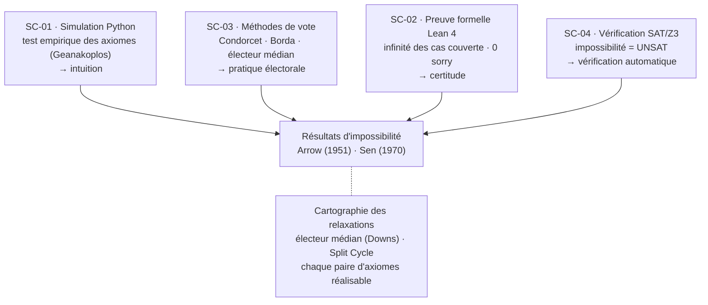
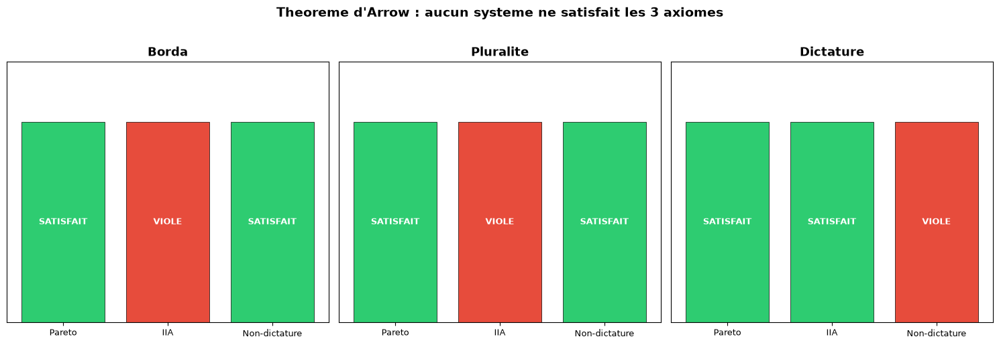
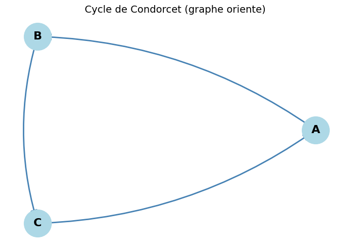
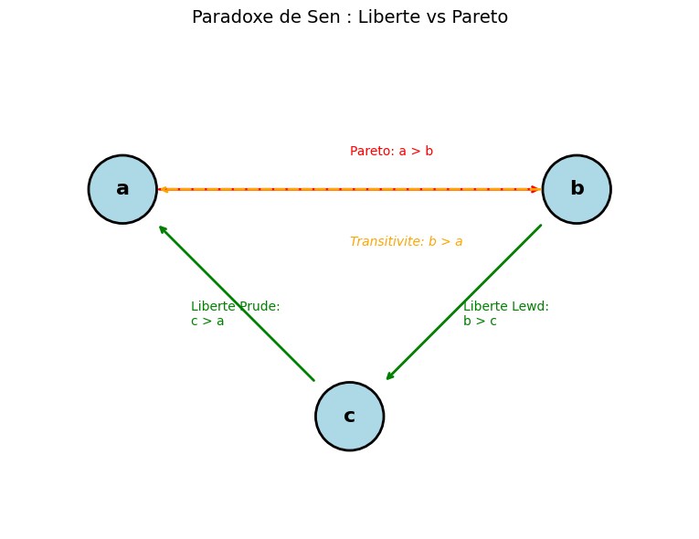
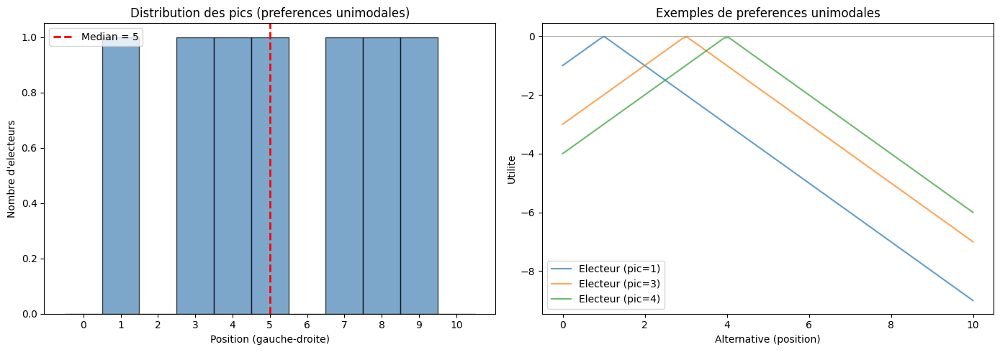
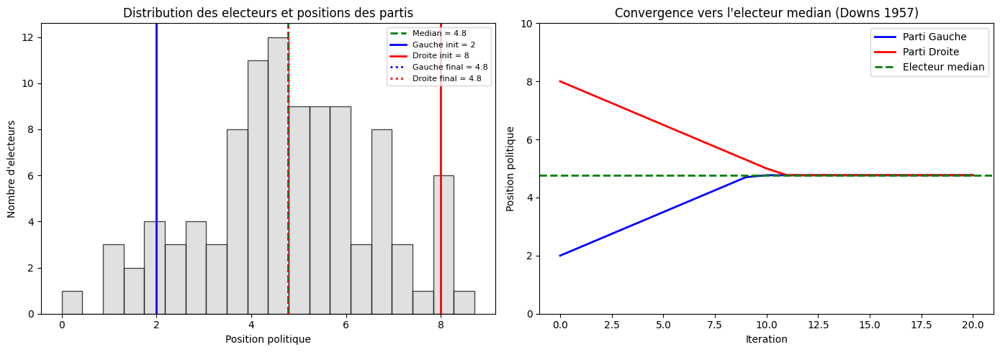
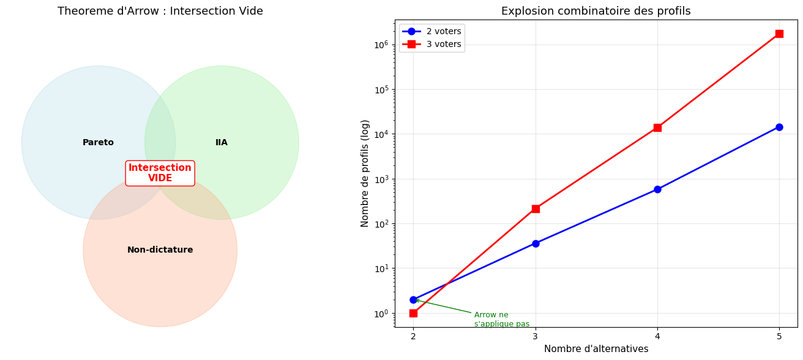

# Social Choice - Théorie du Choix Social

<!-- CATALOG-STATUS
series: GameTheory-SocialChoice
pedagogical_count: 7
breakdown: SocialChoice=7
maturity: PRODUCTION=4, BETA=2, ALPHA=1
-->

La théorie du choix social étudie comment agréger des préférences individuelles en une décision collective. Ses résultats les plus célèbres sont des **théorèmes d'impossibilité** : le théorème d'Arrow (1951) montre qu'aucune règle de vote ne peut satisfaire simultanément des axiomes "raisonnables" (Pareto, IIA, non-dictature) dès que 3 alternatives ou plus sont en jeu ; le théorème de Sen (1970) démontre un conflit fondamental entre liberté individuelle et efficacité collective.

Cette sous-série du parcours [GameTheory](../README.md) explore ces résultats sous quatre angles complémentaires : la simulation Python des axiomes, la formalisation en Lean 4 (preuve formelle), les méthodes de vote concrète, et l'encodage SAT/Z3 pour la vérification mécanique.

**À qui s'adresse cette série** : étudiants en économie, informatique, sciences politiques et mathématiques appliquées. Les notebooks 01 et 03 ne nécessitent que Python (numpy, matplotlib). Les notebooks 02 (Lean) et 04 (SAT/Z3) requièrent des installations supplémentaires décrites dans le [README parent](../README.md). Aucun prérequis en théorie du choix social : les concepts sont introduits progressivement.

## Notebooks

| # | Notebook | Titre | Durée | Status |
|---|----------|-------|-------|--------|
| SC-01 | [01-Arrow-Impossibility-Theorem](01-Arrow-Impossibility-Theorem.ipynb) | Théorème d'Arrow : Preuve Formelle et Simulation | 45 min | COMPLET |
| SC-01 (C#) | [01-Arrow-Impossibility-Theorem-Csharp](01-Arrow-Impossibility-Theorem-Csharp.ipynb) | **Jumeau C#** — parité .NET du SC-01 (théorème d'Arrow) implémenté from-scratch en C# (.NET Interactive) (See #4956) | 45 min | PARITÉ |
| SC-02 | [02-Lean-SocialChoice-Formal](02-Lean-SocialChoice-Formal.ipynb) | Choix Social Formel en Lean 4 (Arrow, Sen, Électeur Médian, Tour Peters) | 80 min | COMPLET |
| SC-03 | [03-Voting-Methods](03-Voting-Methods.ipynb) | Méthodes de Vote et Paradoxes (Condorcet, Borda, Copeland, Downs) | 35 min | COMPLET |
| SC-03 (C#) | [03-Voting-Methods-Csharp](03-Voting-Methods-Csharp.ipynb) | **Jumeau C#** — parité .NET du SC-03 (méthodes de vote) implémenté from-scratch en C# (.NET Interactive) (See #4956) | 35 min | PARITÉ |
| SC-04 | [04-Computational-Aggregation-SAT-Z3](04-Computational-Aggregation-SAT-Z3.ipynb) | Agrégation Computationnelle : SAT et Z3 | 45 min | COMPLET |
| SC-04 (C#) | [04-Computational-Aggregation-SAT-Z3-Csharp](04-Computational-Aggregation-SAT-Z3-Csharp.ipynb) | **Jumeau C#** — parité .NET du SC-04 (agrégation SAT/Z3) implémenté from-scratch en C# (.NET Interactive) (See #4956) | 45 min | PARITÉ |

**Durée totale** : ~3h25

> **Parité .NET** : les notebooks [01-Arrow-Impossibility-Theorem-Csharp.ipynb](01-Arrow-Impossibility-Theorem-Csharp.ipynb) (jumeau du SC-01), [03-Voting-Methods-Csharp.ipynb](03-Voting-Methods-Csharp.ipynb) (jumeau du SC-03) et [04-Computational-Aggregation-SAT-Z3-Csharp.ipynb](04-Computational-Aggregation-SAT-Z3-Csharp.ipynb) (jumeau du SC-04) sont les miroirs C# (.NET Interactive) des originaux Python — mêmes algorithmes implémentés from-scratch en C#. Marathon parité .NET ⇄ Python (#4956). Ces trois jumeaux C# sont comptés dans le `pedagogical_count` de la sous-série (7 notebooks au total, tous formats confondus) mais arborent le statut `PARITÉ` dans le tableau ci-dessus pour les distinguer des quatre notebooks Python d'origine dont ils sont les retranscriptions .NET.

## Parcours d'apprentissage

Les quatre notebooks attaquent les mêmes résultats d'impossibilité sous des angles complémentaires -- l'intuition par la simulation, la pratique électorale, la certitude formelle et la vérification automatique -- qui convergent vers une cartographie des relaxations possibles.



### Étape 1 : Le théorème d'Arrow par la simulation (SC-01, 45 min)

Le notebook SC-01 introduit les trois axiomes d'Arrow (Pareto faible, IIA, non-dictature) en les testant empiriquement sur des règles de vote usuelles (Borda, pluralité, dictature). Il suit la structure de la preuve de Geanakoplos (2005) -- lemme extrémal, existence du pivot, dictateur partiel -- et l'illustre pas à pas en Python. La conclusion montre pourquoi la preuve formelle couvre une infinité de cas que la simulation ne peut atteindre.

### Étape 2 : Méthodes de vote et paradoxes (SC-03, 35 min)

Le notebook SC-03 implémente les règles de vote classiques (pluralité, Borda, Copeland), illustre le paradoxe de Condorcet et l'exemple de Lady Chatterley (théorème de Sen), puis montre la convergence vers l'électeur médian dans le modèle de Downs (1957). Ce notebook est le compagnon Python du formalisme Lean du SC-02.

### Étape 3 : Preuve formelle en Lean 4 (SC-02, 80 min)

Le notebook SC-02 formalise les préférences, les axiomes d'Arrow et de Sen, et le théorème de l'électeur médian en Lean 4. Il inclut un tour de la librairie SocialChoiceLean de DominikPeters (Gibbard-Satterthwaite, Split Cycle, 12 règles de vote, théorème de Duggan-Schwartz). Les définitions sont compatibles avec le projet Lake `social_choice_lean/` (0 sorry sur Arrow, Sen et Voting).

### Étape 4 : Vérification mécanique par SAT et Z3 (SC-04, 45 min)

Le notebook SC-04 encode les théorèmes d'Arrow et de Sen comme des problèmes SAT (PySAT) et SMT (Z3). Le résultat UNSAT des solveurs constitue une preuve mécanique de l'impossibilité. Il compare les approches SAT (variables booléennes, clauses CNF) et SMT (variables entières, rangs sociaux), et analyse la relaxation des axiomes (chaque paire d'axiomes est réalisable).

## Formalisations Lean

Les notebooks SC-01 et SC-02 renvoient au projet Lake `social_choice_lean/` qui contient les preuves complètes :

| Résultat | Fichier | sorry | Statut |
|----------|---------|-------|--------|
| Théorème d'Arrow | `Arrow.lean` | 0 | Prouvé (~950 lignes) |
| Théorème de Sen | `Sen.lean` | 0 | Prouvé (~300 lignes) |
| Modèles de vote | `Voting.lean` | 0 | Banks, STV, Median Voter |

Le projet `social_choice_lean_peters/` (DominikPeters, Lean 4 + Mathlib) formalise 12 règles de vote et 4 théorèmes d'impossibilité supplémentaires (Gibbard-Satterthwaite, Condorcet Participation, Condorcet Reinforcement, Duggan-Schwartz). Inventaire détaillé : [LEAN_INVENTORY.md](../LEAN_INVENTORY.md).

## Concepts clés

| Concept | Description |
|---------|-------------|
| **Théorème d'Arrow** | Aucune SWF avec 3+ alternatives ne peut satisfaire Pareto + IIA + non-dictature |
| **Théorème de Sen** | Liberté minimale + Pareto + transitivité sont incompatibles |
| **Paradoxe de Condorcet** | Les préférences majoritaires peuvent être cycliques (A > B > C > A) |
| **Électeur médian** | Avec des préférences unimodales, le vainqueur de Condorcet existe |
| **IIA** | Le classement social entre x et y ne dépend que des préférences individuelles sur {x, y} |
| **Gibbard-Satterthwaite** | Toute règle de vote non-dictatoriale est manipulable (pour 3+ candidats) |
| **Split Cycle** | Règle de vote la plus fine satisfaisant Condorcet + acyclicité |

## Galerie

Visualisations réelles de la théorie du choix social, des axiomes d'Arrow (limite axiomatique) aux méthodes de vote (Condorcet, paradoxe de Sen, électeur médian, modèle de Downs) puis à l'agrégation computationnelle par solveur SAT/Z3.

<table>
<tr>
<td align="center" colspan="2"><br/><sub>Synthèse des axiomes d'Arrow — théorème d'impossibilité (<a href="01-Arrow-Impossibility-Theorem.ipynb">01-Arrow</a>)</sub></td>
</tr>
<tr>
<td align="center"><br/><sub>Vainqueur de Condorcet (<a href="03-Voting-Methods.ipynb">03-Voting</a>)</sub></td>
<td align="center"><br/><sub>Paradoxe de Sen — libéral parétien (<a href="03-Voting-Methods.ipynb">03-Voting</a>)</sub></td>
</tr>
<tr>
<td align="center"><br/><sub>Théorème de l'électeur médian (<a href="03-Voting-Methods.ipynb">03-Voting</a>)</sub></td>
<td align="center"><br/><sub>Modèle de Downs — convergence (<a href="03-Voting-Methods.ipynb">03-Voting</a>)</sub></td>
</tr>
<tr>
<td align="center" colspan="2"><br/><sub>Agrégation computationnelle par SAT/Z3 (<a href="04-Computational-Aggregation-SAT-Z3.ipynb">04-Z3</a>)</sub></td>
</tr>
</table>

Provenance et poids de chaque figure : [`assets/readme/MANIFEST.md`](assets/readme/MANIFEST.md).

## Navigation

- **Série parente** : [GameTheory](../README.md) (théorie des jeux, Nash, Shapley, design de mécanismes)
- **Notebook 16 (Mechanism Design)** : introduction au choix social dans le fil principal GameTheory
- **SymbolicAI/Lean** : [README Lean](../../SymbolicAI/Lean/README.md) pour les prérequis Lean 4

---

## Prerequisites

- Python 3.10+ avec numpy, matplotlib, networkx (notebooks 01, 03, 04)
- pysat et z3-solver pour le notebook 04
- Lean 4 + kernel WSL pour le notebook 02 (cf [README parent](../README.md))

## Installation

```bash
pip install -r ../requirements.txt
pip install pysat z3-solver
```

Pour le notebook 02 (Lean 4) : suivre les instructions dans [README parent](../README.md#notebooks-lean-4-2b-4b-8b-15b).

## Ressources

| Référence | Couverture |
|-----------|------------|
| Arrow, *Social Choice and Individual Values* (1951) | Théorème d'impossibilité |
| Sen, *Collective Choice and Social Welfare* (1970) | Paradoxe liberal |
| Geanakoplos, "Three Brief Proofs of Arrow's Impossibility Theorem" (2005) | Preuve utilisée dans SC-01 et SC-02 |
| Moulin, "Condorcet's Principle Implies the No Show Paradox" (1988) | Paradoxe de la non-participation |
| Holliday & Pacuit, "Split Cycle" (2023) | Règle de vote optimale |
| Peters, [SocialChoiceLean](https://github.com/DominikPeters/SocialChoiceLean) | Formalisation Lean 4 de 12 règles + 4 théorèmes |

## Conclusion / Prochaines étapes

### Ce que vous avez appris

Cette sous-série vous a fait saisir pourquoi le **choix social** est l'un des résultats intellectuels les plus troublants de la théorie de la décision : il existe des limites *mathématiquement prouvées* à ce qu'une collectivité peut décider de manière cohérente. L'arc pédagogique repose sur **quatre angles complémentaires** braqués sur les mêmes résultats d'impossibilité :

- **Le résultat fondateur** — le théorème d'Arrow (1951) : aucune règle d'agrégation ne peut, simultanément et dès que 3 alternatives sont en jeu, satisfaire Pareto, l'indépendance vis-à-vis des alternatives non pertinentes (IIA) et la non-dictature. Le théorème de Sen (1970) étend le constat : liberté minimale et efficacité parétienne sont incompatibles. Ces théorèmes ne disent pas « la démocratie est impossible » ; ils délimitent précisément *quels compromis* toute règle de vote doit accepter.
- **La quadruple convergence, délibérément juxtaposée** — un même énoncé est attaqué par quatre méthodes, chacune révélant une facette différente. La **simulation Python** (SC-01) teste les axiomes sur des règles concrètes et suit la preuve de Geanakoplos (lemme extrémal, pivot, dictateur partiel) ; la **preuve formelle Lean 4** (SC-02) couvre l'infinité des cas que la simulation ne peut qu'échantillonner, avec 0 sorry sur Arrow et Sen ; les **méthodes de vote** (SC-03) incarnent les paradoxes dans des règles réelles (Condorcet, Borda, Copeland, électeur médian de Downs) ; la **vérification mécanique SAT/Z3** (SC-04) fait émerger l'impossibilité comme un résultat UNSAT des solveurs. Comprendre les quatre, c'est comprendre qu'une *même vérité* se laisse approcher par l'expérience, la déduction formelle, la pratique électorale et la recherche combinatoire.
- **L'instrument** — les outils qui opérationnalisent chaque angle : numpy/matplotlib pour la simulation, Lean 4 + la librairie SocialChoiceLean de Peters (12 règles de vote, Gibbard-Satterthwaite, Split Cycle, Duggan-Schwartz) pour la preuve, PySAT (clauses CNF) et Z3 (rangs entiers SMT) pour la vérification mécanique. Chaque outil éclaire un aspect que les autres laissent dans l'ombre : la simulation donne l'intuition, Lean donne la certitude, SAT/Z3 donnent la vérification automatique.
- **La finesse** — qu'un théorème d'impossibilité n'est pas une impasse mais une **cartographie des relaxations possibles**. SC-04 montre que chaque *paire* d'axiomes d'Arrow est réalisable ; Split Cycle (Holliday & Pacuit) satisfait Condorcet sans tomber dans l'acyclicité totale ; le théorème de l'électeur médian (Downs) restaure l'existence d'un vainqueur sous l'hypothèse d'unimodalité. La leçon pratique : on ne contourne pas Arrow, on *choisit* quel axiome relâcher selon le contexte.

La thèse est puissante et honnêtement présentée : il n'existe pas de règle de vote idéale, mais un *paysage* de règles aux compromis clairement cartographiés — et la rigueur exige de les confronter simultanément à l'expérience, à la preuve formelle et à la vérification mécanique avant de prétendre les comprendre.

### Prochaines étapes

- **Design de mécanismes** : le notebook [GameTheory-16-MechanismDesign](../GameTheory-16-MechanismDesign.ipynb) est le prolongement naturel — il retourne la question d'Arrow (« quelle règle agréger ? ») en « comment *concevoir* les règles du jeu pour que les agents révèlent honnêtement leurs préférences ? » (enchères VCG, appariement Gale-Shapley, Myerson-Satterthwaite).
- **Jeux coopératifs et valeur de Shapley** : [GameTheory-15-CooperativeGames](../GameTheory-15-CooperativeGames.ipynb) introduit une autre forme d'agrégation — non plus des préférences mais des *contributions* — où la valeur de Shapley offre l'unique répartition équitable vérifiant des axiomes analogues à ceux d'Arrow.
- **Approfondir la formalisation Lean 4** : [SymbolicAI/Lean](../../SymbolicAI/Lean/README.md) pour les prérequis et la méthodologie des preuves formelles, et l'inventaire [LEAN_INVENTORY.md](../LEAN_INVENTORY.md) pour la cartographie complète des théorèmes de choix social prouvés dans le projet Lake `social_choice_lean/`.
- Pour la pratique : reprenez [04-Computational-Aggregation-SAT-Z3](04-Computational-Aggregation-SAT-Z3.ipynb) et relaxez un *autre* couple d'axiomes que ceux étudiés — encodez-le en SAT et observez si le solveur retourne SAT (une règle existe) ou UNSAT (nouvelle impossibilité). C'est l'exercice le plus formateur pour saisir comment la vérification mécanique transforme une conjecture en théorème.

### Le fil rouge

Le choix social propose un changement de regard sur la décision collective : ne plus demander « quelle est la meilleure règle de vote ? » mais **« quels axiomes suis-je prêt à sacrifier, et lesquels sont mutuellement incompatibles ? »**. Cette sous-série vous a donné les résultats d'impossibilité (Arrow, Sen, Gibbard-Satterthwaite), les méthodes pour les établir (simulation, preuve Lean 4, vérification SAT/Z3), et l'intuition des relaxations (électeur médian, Split Cycle) pour transformer un constat d'impossibilité apparemment stérile en une compréhension fine de l'espace des règles possibles — en gardant à l'esprit qu'aucune règle ne domine partout, et que c'est précisément cette absence de « bonne » réponse universelle qui fait du choix social un domaine vivant.

---

## Licence

Voir la licence du repository principal.
