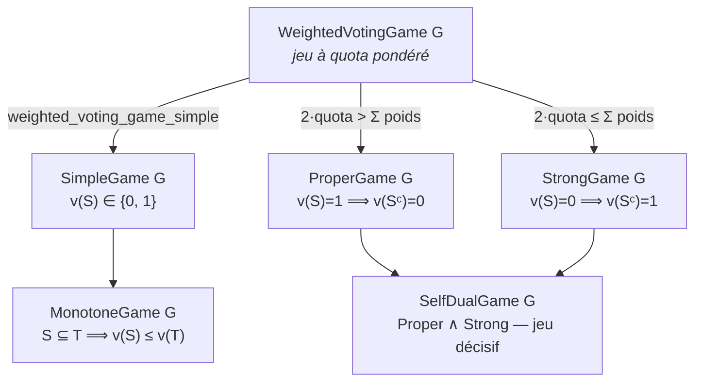
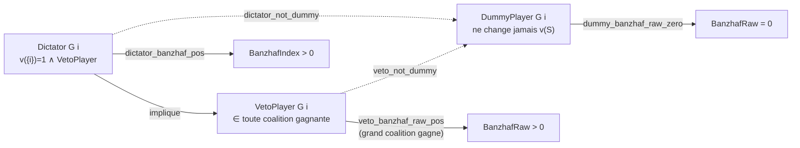

# Cooperative Games Lean

Formalisation en Lean 4 de la théorie des jeux coopératifs (valeur de Shapley, cœur).

## Statut

- **Toolchain** : v4.31.0-rc1
- **Compte de sorry** : **0** — le théorème de Bondareva-Shapley est prouvé dans les deux directions
- **Build** : `lake build CooperativeGames` — SUCCESS
- **Dépendances** : Mathlib4

## Modules

| Fichier | sorry | Description |
|---------|-------|-------------|
| `CooperativeGames/Shapley.lean` | 0 | Valeur de Shapley (définition + unicité), joueurs nul/dummy, indice de pouvoir de Banzhaf |
| `CooperativeGames/Basic.lean` | 0 | Jeu coopératif / fonction caractéristique / Cœur / théorème de Bondareva-Shapley |
| `CooperativeGames/ConeKernel.lean` | 0 | Noyau Farkas / séparation de cône (machinerie prouvant la direction backward) |

## Résultats clés

- **Unicité de la valeur de Shapley** : prouvé que la valeur de Shapley est l'unique valeur satisfaisant les axiomes d'efficacité, symétrie, joueur nul et additivité (Shapley.lean, 0 sorry)
- **Définitions du Cœur** : jeu coopératif, fonction caractéristique, ensemble des joueurs, Cœur (Basic.lean)
- **Direction `←` de Bondareva-Shapley** (balanced ⇒ Cœur non vide) : **entièrement prouvée** via la machinerie de séparation de cône du module `ConeKernel.lean` (`ProperCone.hyperplane_separation_point` de Mathlib)
- **Indice de pouvoir de Banzhaf** : cadre défini (`Critical G i S`, `BanzhafRaw G i`, `BanzhafIndex G i`) avec la consolidation complète (non-négativité `banzhaf_index_nonneg`, borne supérieure `banzhaf_index_le_two`, caractérisation par zéro `banzhaf_index_eq_zero_iff`, positivité `banzhaf_index_pos_iff`, symétrie `banzhaf_raw_symmetric`), le tout à 0 sorry (Shapley.lean, PRs #4011/#4037/#4130)
- **Théorie des jeux de vote simples** : taxonomie des joueurs (`VetoPlayer`, `Dictator`, `DummyPlayer`) et des familles de coalitions (`SimpleGame`, `MonotoneGame`, `ProperGame`, `StrongGame`, `SelfDualGame`) avec leurs théorèmes de pouvoir (voir ci-dessous), le tout à 0 sorry (Shapley.lean, depuis la fondation `SimpleGame` PR #4134)

## Théorie des jeux de vote simples

La série formalise la théorie classique des jeux de vote simples (jeux où chaque
coalition est soit gagnante `v S = 1` soit perdante `v S = 0`), au-dessus des
`WeightedVotingGame` (jeux à quota pondéré). Cette infrastructure porte les théorèmes
d'indice de pouvoir pour les types de joueurs canoniques.

### Prédicats de structure

- **`SimpleGame G`** — jeu à valeur binaire (`v S ∈ {0, 1}`), prouvé pour tout
  `WeightedVotingGame` (`weighted_voting_game_simple`). Lecteurs `eq_one_of_ne_zero` /
  `eq_zero_of_ne_one`.
- **`MonotoneGame G`** — agrandir une coalition n'en diminue pas la valeur
  (`S ⊆ T → v S ≤ v T`), lecteur `le_of_subset`. Les coalitions gagnantes forment un
  **up-set** (`winning_upward_closed`), les perdantes un **down-set**
  (`losing_downward_closed`).
- **`ProperGame G`** / **`StrongGame G`** — duaux sur le complément : un jeu *propre*
  (`v S = 1 → v Sᶜ = 0`) interdit qu'une coalition et son complément gagnent toutes deux ;
  un jeu *fort* (`v S = 0 → v Sᶜ = 1`) impose qu'au moins l'une des deux gagne.
- **`SelfDualGame G`** — pont `ProperGame G ∧ StrongGame G` (jeu décisif) ; un jeu fort
  est non-dégénéré : la grande coalition gagne (`strong_grand_wins`).
- **`MinimalWinning G S`** — coalition gagnante irréductible (`v S = 1 ∧ ∀ T ⊂ S, v T = 0`) :
  le noyau des coalitions clés dont le poids atteint juste le quota.

*Du jeu pondéré au jeu décisif — comment ces prédicats s'empilent :*

### Taxonomie des joueurs

- **`VetoPlayer G i`** — appartient à toute coalition gagnante (`∀ S, v S = 1 → i ∈ S`).
  Un veto est critique dans **chaque** coalition gagnante (`veto_critical_of_winning`) ;
  la réciproque tient (`veto_iff_critical_of_winning`), et toute coalition sans lui est
  perdante (`veto_losing_without`).
- **`Dictator G i`** — gagne seul et a le veto (`v {i} = 1 ∧ VetoPlayer G i`) ; un dictateur
  est **unique** (`dictator_unique`), a un indice de Banzhaf strictement positif
  (`dictator_banzhaf_pos`) et n'est pas un dummy (`dictator_not_dummy`).
- **`DummyPlayer G i`** — ne change jamais la valeur d'une coalition ; son indice de
  Banzhaf brut est nul (`dummy_banzhaf_raw_zero`).

*Qui implique qui, et ce que chaque type de joueur dit de son indice de Banzhaf
(flèches pleines = implication positive, pointillées = exclusion) :*

### Théorèmes d'indice de pouvoir

- Un veto a un indice de Banzhaf brut **strictement positif** lorsque la grande coalition
  gagne (`veto_banzhaf_raw_pos`, `hwin` essential sous non-dégénérescence).
- Un veto n'est pas un dummy (`veto_not_dummy`) — pendant veto de `dictator_not_dummy`.
- L'indice de Banzhaf normalisé hérite de la symétrie (`banzhaf_index_symmetric`) et de la
  nullité des dummies (`banzhaf_index_dummy_zero`).

## Indice de pouvoir de Banzhaf

La valeur de Shapley n'est pas le seul indice de pouvoir pertinent en théorie des jeux
coopératifs. L'**indice de Banzhaf** mesure le pouvoir d'un joueur comme son nombre de
*swings* (coalitions pivots) : combinaisons où son passage de hors-coalition à
dans-coalition fait basculer la valeur de la coalition. Contrairement à la valeur de
Shapley (qui pondère chaque coalition par un facteur factoriel), l'indice de Banzhaf brut
traite toutes les coalitions de manière égale.

Le module formalise ce cadre sur les jeux à valeur pondérée (`WeightedVotingGame`) :

- **Joueur critique** — `Critical G i S` est vraie lorsque `i ∈ S`, la coalition `S` gagne
  (`G.v S = 1`) mais la coalition privée de `i` perd (`G.v (S.erase i) = 0`). Un joueur est
  critique pour `S` si son retrait fait perdre une coalition gagnante.
- **Indice de Banzhaf brut** — `BanzhafRaw G i` est le nombre de coalitions pour lesquelles
  `i` est critique, i.e. `(Finset.univ.filter fun S => Critical G i S).card`.

Deux théorèmes de nullité sont prouvés (les deux à 0 `sorry`) :

- `dummy_shapley_zero` : un joueur dummy reçoit une valeur de Shapley nulle.
- `dummy_banzhaf_raw_zero` (PR #4011) : un joueur dummy a un indice de Banzhaf brut nul.

Un joueur dummy (`DummyPlayer`) ne change jamais la valeur d'une coalition, il n'est donc
jamais critique : son indice de Banzhaf brut est bien nul. C'est l'analogue, pour l'indice
de Banzhaf, du théorème de joueur nul pour la valeur de Shapley.

**Prouvé** (PR #4037, merged `ba3b169e`) : le théorème de symétrie `banzhaf_raw_symmetric`
(`Shapley.lean:1106`) — deux joueurs interchangeables (`SymmetricPlayers`) ont des indices
de Banzhaf brut égaux, l'analogue Banzhaf de `shapley_symmetric`. La preuve construit une
involution `banzhafSwap` échangeant `i` et `j` dans chaque coalition (quatre cas : contient
les deux, aucun, ou exactement un des deux), montre qu'elle préserve la valeur du jeu (par
`SymmetricPlayers`, après division en cas sur `S ∩ {i, j}`) et qu'elle transporte
bijectivement les coalitions critiques de `i` sur celles de `j` ; les deux filtres de
coalitions critiques sont donc en bijection, d'où l'égalité de leurs cardinaux — les indices
de Banzhaf bruts. Cette lignée power-index (`dummy_banzhaf_raw_zero` #4011 →
`banzhaf_raw_symmetric` #4037) parallèle la caractérisation Shapley.

## Notes

- Le théorème de Bondareva-Shapley est clos dans les deux directions (`forward` + `backward`), **0 sorry**. La direction `←` extrayait une allocation du Cœur par un argument de Farkas / séparation d'hyperplan sur un cône ; cet argument, longtemps tagué **INTRACTABLE**, est désormais construit et prouvé dans `CooperativeGames/ConeKernel.lean` (cône augmenté `augCone`, lemme dual `augCone_dual_iff`, séparateur `separatingFunctional_none_neg`, décodage du témoin `exists_preimputation_strict_core`)
- Arc de preuve : PR #3933 (noyau ConeKernel, TUGame-free) → #3941 (pont `balancedUnit`) → #3945 (cœur du décodage) → #3951 (câblage du pipeline) → #3954 (sorry 1→0). `hb_witness` est désormais un `have` certifié (`Basic.lean:348`)
- Lié à `stable_marriage_lean/` (théorie des appariements comme jeu coopératif)

## Conclusion

Ce projet formalise la théorie des jeux coopératifs en Lean 4 — la **valeur de Shapley**
(close, 0 `sorry`), le **Cœur** avec le **théorème de Bondareva-Shapley** (0 `sorry`,
prouvé dans les deux directions), et la **théorie des jeux de vote simples** avec sa
taxonomie des joueurs et les théorèmes d'indice de pouvoir associés (0 `sorry`). Il compile
avec `lake build CooperativeGames` sur Mathlib4 (toolchain `v4.31.0-rc1`).

### Ce qui est prouvé

- **Unicité de la valeur de Shapley** (`Shapley.lean`, 0 `sorry`) : la valeur de Shapley
  est l'allocation *unique* satisfaisant efficacité, symétrie, joueur nul et additivité —
  la caractérisation axiomatique de Shapley (1953).
- **Indices de pouvoir de Banzhaf** (`Shapley.lean`, 0 `sorry`) : indice brut
  `BanzhafRaw G i` (compte des coalitions critiques via `Critical G i S`) et indice normalisé
  `BanzhafIndex G i = BanzhafRaw G i / 2^(n-1)` — consolidation complète prouvée :
  non-négativité, borne supérieure `≤ 2`, caractérisation par zéro, positivité, symétrie,
  nullité des dummies (PRs #4011/#4037/#4130). Détails ci-dessus
  (section « Indice de pouvoir de Banzhaf »).
- **Théorie des jeux de vote simples** (`Shapley.lean`, 0 `sorry`) : taxonomie des joueurs
  (`VetoPlayer`, `Dictator`, `DummyPlayer`) et des familles de coalitions (`SimpleGame`,
  `MonotoneGame`, `ProperGame`, `StrongGame`, `SelfDualGame`, `MinimalWinning`) avec leurs
  théorèmes de pouvoir (dictateur unique, veto positif en Banzhaf, veto critique dans toute
  coalition gagnante, etc.). Détails ci-dessus (section « Théorie des jeux de vote simples »).
- **Cœur + théorème de Bondareva-Shapley** (`Basic.lean` + `ConeKernel.lean`) : jeu
  coopératif, fonction caractéristique, le Cœur et la condition de jeu équilibré (balanced),
  avec la direction `←` (balanced ⇒ Cœur non vide) **entièrement prouvée** par séparation de
  cône.

### Comment la direction backward a été prouvée

L'étape jadis taggée **INTRACTABLE** — extraire de la condition équilibrée une allocation
`x ∈ Core` avec `∑ xᵢ ≤ v(N)`, un argument de Farkas / séparation d'hyperplan sur un cône —
est désormais close. La machinerie vit dans `CooperativeGames/ConeKernel.lean` : le cône
augmenté `augCone` encode les violations de poids équilibrés, et
`ProperCone.hyperplane_separation_point` (Mathlib `Analysis.Convex.Cone.Dual`) fournit un
séparateur `f` ; les lemmes de dualité (`augCone_dual_iff`), de séparateur non-négatif
(`separatingFunctional_none_neg`) et de décodage du témoin (`exists_preimputation_strict_core`)
convertissent ce séparateur en une imputation du Cœur. `hb_witness` est désormais un `have`
certifié (`Basic.lean:348`). Arc : #3933 → #3941 → #3945 → #3951 → #3954 (sorry 1→0). Le
plan d'origine reste documenté dans
[`docs/BONDAREVA_FARKAS_PLAN.md`](docs/BONDAREVA_FARKAS_PLAN.md).

### Où aller ensuite

- **Théorie** : Bondareva (1963) / Shapley (1967), les caractérisations du Cœur ;
  Shapley (1953), *A Value for n-Person Games*.
- **Plan actif** : [`docs/BONDAREVA_FARKAS_PLAN.md`](docs/BONDAREVA_FARKAS_PLAN.md)
  et [`FORMAL_STATUS.md`](FORMAL_STATUS.md).
- **Lié** : [`stable_marriage_lean/`](../stable_marriage_lean/) (appariement Gale-Shapley)
  et [`social_choice_lean/`](../social_choice_lean/) (Arrow / Sen).
