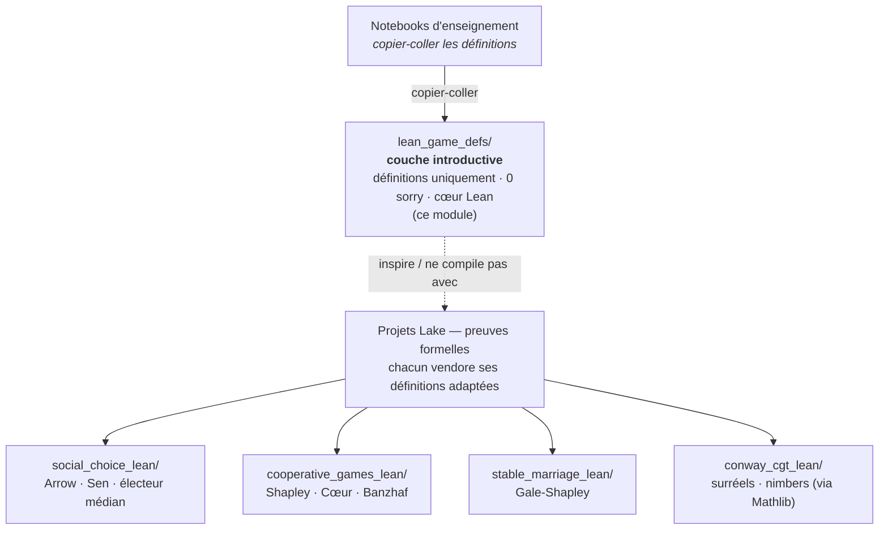
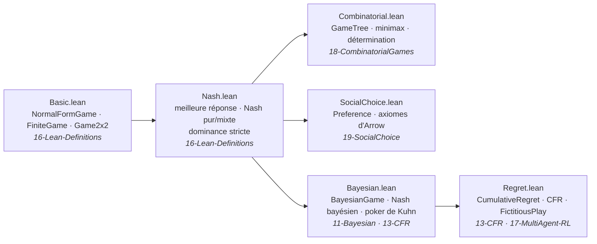

# Lean Game Definitions

Définitions de types partagées en Lean 4, utilisées par plusieurs projets Lean de GameTheory. **N'EST PAS** un projet Lake autonome — fournit des définitions de référence importées ou recopiées dans les projets Lake adjacents.

## Statut

- **Type** : Extraits de code (pas de `lakefile.lean`, pas de pin toolchain)
- **Fichiers** : 6 `.lean`
- **Compte de `sorry`** : 0 (définitions uniquement, pas de preuves)
- **Dépendance Mathlib** : aucune — tous les fichiers utilisent le cœur de Lean 4 uniquement
- **Compilable isolément** : Non — destiné à être importé par des projets Lake
- **Dernier audit sorry** : 2026-05-29
- **Dernière correction de compilation** : 2026-06-10 (See #2748)

## Fichiers

- [Basic.lean](Basic.lean) — 107 lignes. Structures `NormalFormGame`, `FiniteGame`, `Game2x2` + paiements espérés. Source : `GameTheory-16-Lean-Definitions.ipynb`.
- [Nash.lean](Nash.lean) — 139 lignes. Meilleure réponse, équilibre de Nash pur/mixte, dominance stricte. Source : `GameTheory-16-Lean-Definitions.ipynb`.
- [Combinatorial.lean](Combinatorial.lean) — 113 lignes. `GameTree`, évaluation minimax, détermination victoire/défaite. Source : `GameTheory-18-Lean-CombinatorialGames.ipynb`.
- [SocialChoice.lean](SocialChoice.lean) — 126 lignes. `Preference`, `StrictPref`, axiomes d'Arrow (énoncés). Source : `GameTheory-19-Lean-SocialChoice.ipynb`.
- [Bayesian.lean](Bayesian.lean) — Jeux bayésiens à information incomplète : `BayesianGame`, `TypeStrategy`, `BayesianNashEquilibrium`, `InformationSet`, `SignalingGame`, `FirstPriceAuction`, définitions du poker de Kuhn. Source : `GameTheory-11-BayesianGames.ipynb`, `GameTheory-13-ImperfectInfo-CFR.ipynb`.
- [Regret.lean](Regret.lean) — Minimisation du regret et CFR : `CumulativeRegret`, `regretMatchingStrategy`, `CounterfactualRegret`, `CFRState`, `FictitiousPlayState`. Source : `GameTheory-13-ImperfectInfo-CFR.ipynb`, `GameTheory-17-MultiAgent-RL.ipynb`.

## Utilisation

Ces fichiers sont des définitions de référence, pas une bibliothèque compilable. Utilisation :

1. **Copier-coller dans une cellule de notebook** (workflow pédagogique typique dans `GameTheory-2b`, `GameTheory-8b`, etc.).
2. **Importer depuis un projet Lake adjacent** en ajoutant le chemin du fichier au `lakefile.lean` du projet. Exemple depuis `social_choice_lean/` :

   ```lean
   import GameTheory.lean_game_defs.Basic
   import GameTheory.lean_game_defs.SocialChoice
   ```

3. **Exploration autonome** via le kernel Lean 4 WSL (voir [scripts/README.md](../scripts/README.md) pour la configuration du kernel).

Pour le support complet de `PGame` (théorie des jeux combinatoires dans toute sa généralité mathématique), utiliser Mathlib directement :

```lean
import Mathlib.SetTheory.PGame.Basic
import Mathlib.SetTheory.Game.Nim
```

## Relation aux autres projets Lean de GameTheory

- [stable_marriage_lean/](../stable_marriage_lean/) — Projet Lake indépendant (formalisation Gale-Shapley).
- [social_choice_lean/](../social_choice_lean/) — Projet Lake indépendant (Arrow / Sen / électeur médian, port de asouther4/lean-social-choice).
- [social_choice_lean_peters/](../social_choice_lean_peters/) — Projet Lake indépendant pinné sur le commit `d679d950` de Peters (Gibbard-Satterthwaite, Duggan-Schwartz).
- [cooperative_games_lean/](../cooperative_games_lean/) — Projet Lake indépendant (valeur de Shapley, cœur, nucléolus).

Ces projets ne dépendent **pas** de `lean_game_defs/` à la compilation — ils vendorent leurs propres définitions adaptées à leurs obligations de preuve. `lean_game_defs/` est la couche **introductive** utilisée par les notebooks d'enseignement.

*Architecture en couches — la couche de définitions introductive (ce module, sans
preuves) vs. les projets Lake qui portent les preuves formelles (chacun vendore ses
propres définitions) :*



## Voir aussi

- [GameTheory/README.md](../README.md) — Vue d'ensemble de la série (tracks OpenSpiel + Lean)
- [scripts/README.md](../scripts/README.md) — Configuration du kernel Lean 4 WSL
- [.claude/rules/wsl-kernels.md](../../../.claude/rules/wsl-kernels.md) — Règles du kernel

## Conclusion

`lean_game_defs/` est la **couche de définitions introductive** du track Lean de
GameTheory : définitions de types partagées en Lean 4 (pas de preuves, 0 `sorry`)
utilisées par les notebooks d'enseignement et importables par les projets Lake
adjacents. Ce n'est **pas** un projet Lake autonome — il n'y a pas de `lakefile.lean`,
pas de pin toolchain, et aucune dépendance Mathlib ; chaque fichier utilise le cœur de
Lean 4 uniquement.

### Ce qu'elle fournit

Six fichiers de référence couvrant le curriculum de théorie des jeux : jeux sous forme
normale / finis ([Basic.lean](Basic.lean)), équilibre de Nash et dominance
([Nash.lean](Nash.lean)), arbres de jeux combinatoires avec minimax
([Combinatorial.lean](Combinatorial.lean)), primitives de choix social et axiomes
d'Arrow ([SocialChoice.lean](SocialChoice.lean)), jeux bayésiens et signalisation
([Bayesian.lean](Bayesian.lean)), et minimisation du regret / CFR
([Regret.lean](Regret.lean)). Chaque fichier correspond à un notebook d'enseignement
spécifique et est autonome.

*La carte du curriculum — six fichiers, du jeu sous forme normale jusqu'au CFR, chacun
rattaché à son notebook pédagogique source :*



### Comment elle est utilisée

- **Copier-coller** dans une cellule de notebook (le workflow pédagogique typique) ;
- **Importer** depuis un projet Lake adjacent via `import GameTheory.lean_game_defs.*` ; ou
- **Explorer** de façon autonome via le kernel Lean 4 WSL.

Pour la théorie complète des jeux combinatoires (`PGame`, surréels, nimbers), le track
renvoie au `SetTheory.PGame` de Mathlib / à la visite [`conway_cgt_lean/`](../conway_cgt_lean/)
plutôt que de la redéfinir ici.

### Où aller ensuite

- **Projets compilables** (chacun vendore ses propres définitions adaptées aux preuves) :
  [`social_choice_lean/`](../social_choice_lean/) (Arrow / Sen / électeur médian),
  [`cooperative_games_lean/`](../cooperative_games_lean/) (valeur de Shapley, Cœur),
  [`stable_marriage_lean/`](../stable_marriage_lean/) (Gale-Shapley).
- **Visite CGT** : [`conway_cgt_lean/`](../conway_cgt_lean/) — surréels, nimbers via
  `vihdzp/combinatorial-games`.
- **Configuration du kernel** : [scripts/README.md](../scripts/README.md) et
  [.claude/rules/wsl-kernels.md](../../../.claude/rules/wsl-kernels.md).
