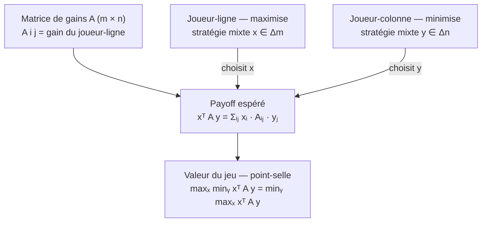
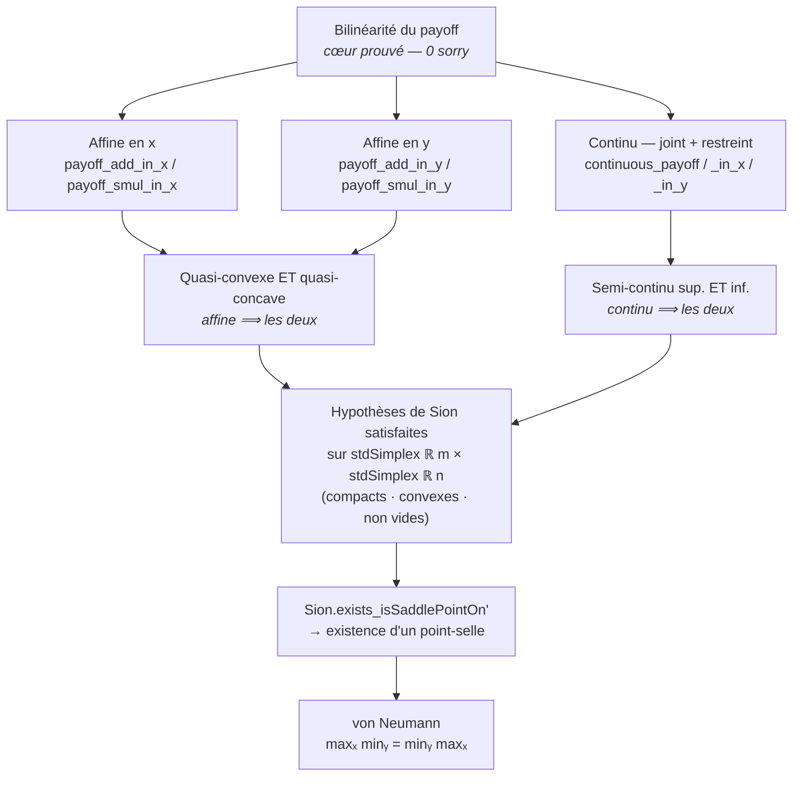

# minimax_lean — Théorème minimax de von Neumann (jeux à somme nulle), Lean 4

Lake Lean 4 (Mathlib) à la racine de la spécialisation **somme nulle** de la série
**GameTheory**, formalisant le socle analytique du **théorème minimax de von
Neumann** pour les jeux finis à deux joueurs et somme nulle : pour toute matrice de
gains `A` (m × n), les stratégies mixtes optimales existent et la valeur du jeu
vérifie

```
maxₓ minᵧ xᵀ A y = minᵧ maxₓ xᵀ A y
```

(`x` parcourt le simplexe des stratégies mixtes du joueur-ligne, `y` celui du
joueur-colonne). Le théorème complet suit du **minimax de Sion** (Mathlib
`Topology.Sion`), dont le cas bilinéaire sur des simplexes compacts convexes redonne
exactement von Neumann. Voir l'issue #4054 (roadmap Lean #4038).

*Le cadre — deux joueurs, une matrice, une espérance ; le joueur-ligne maximise,
le joueur-colonne minimise, somme nulle stricte :*



Ce premier livrable établit le **cœur formel** documenté de la preuve — la
**bilinéarité du payoff** `xᵀ A y`, qui porte les quatre hypothèses de Sion. Il est
**entièrement 0-sorry**.

## Statut

- **Toolchain** : `leanprover/lean4:v4.31.0-rc1` + Mathlib4 (`v4.31.0-rc1`)
- **Sorry** : **0** sur tout le module. L'additivité + l'homogénéité du payoff en
  chaque variable, la continuité (jointe et restreinte), la concavité/cvxicité du
  payoff sur les simplexes, les **4 hyps analytiques de Sion** (quasi-convexité,
  quasi-concavité, semi-continuité inf./sup.), et le **théorème de von Neumann
  (forme point-selle)** sont entièrement prouvés.
- **Build** : `lake build Minimax` (dépend de Mathlib4)
- **CI** : `.github/workflows/lean-minimax.yml` (`sorry-filter-mode: standalone-tactic`,
  baseline `0`)

## Stratégie de formalisation

Le **théorème de Sion** (`Sion.exists_isSaddlePointOn'`) énonce : pour `f : E → F → β`
sur des parties `X ⊆ E`, `Y ⊆ F` (espaces vectoriels topologiques sur `ℝ`), si `X` et
`Y` sont non vides, convexes et compacts, `f(·, y)` est quasi-convexe et
semi-continue inférieurement pour tout `y ∈ Y`, et `f(x, ·)` est quasi-concave et
semi-continue supérieurement pour tout `x ∈ X`, alors il existe un point-selle.

Pour `f = payoff A` sur `X = stdSimplex ℝ m`, `Y = stdSimplex ℝ n`, ces hypothèses
découlent toutes de la **bilinéarité** :
- `payoff` est **affine en chaque variable** ⟹ quasi-convexe ET quasi-concave ;
- `payoff` est **continu** (somme finie de monômes) ⟹ semi-continue sup. et inf.

*Comment la bilinéarité (le cœur prouvé) déroule les quatre hypothèses de Sion jusqu'au
point-selle de von Neumann — chaque arête est un lemme de `ZeroSum.lean` :*



## Ce qui est formalisé (`Minimax/ZeroSum.lean`, 0 sorry)

- **Matrice de gains** `PayoffMatrix m n = Matrix m n ℝ` : `A i j` = gain du
  joueur-ligne quand `i` joue la ligne `i` et `j` la colonne `j` (somme nulle : le
  joueur-colonne reçoit `-A i j`).
- **Payoff bilinéaire** `payoff A x y = Σᵢⱼ xᵢ · Aᵢⱼ · yⱼ` (somme unique sur le
  produit `m × n`), espérance du gain du joueur-ligne sous les stratégies mixtes `x`
  (lignes) et `y` (colonnes). La représentation comme somme unique sur le produit
  rend la bilinéarité immédiate.
- **Linéarité en `x`** : `payoff_add_in_x` (`payoff A (x + x') y = payoff A x y +
  payoff A x' y`, via `add_mul` + `Finset.sum_add_distrib`) et `payoff_smul_in_x`
  (`payoff A (c • x) y = c · payoff A x y`, via `Finset.mul_sum`).
- **Linéarité en `y`** : `payoff_add_in_y` (via `mul_add` + `Finset.sum_add_distrib`)
  et `payoff_smul_in_y` (via `Finset.mul_sum`).
- **Continuité** : `continuous_payoff` (continuité jointe sur `(m → ℝ) × (n → ℝ)`,
  via `continuous_finsetSum` + `fun_prop`), et les restrictions
  `continuous_payoff_in_x` / `continuous_payoff_in_y` (une variable fixée, via
  `fun_prop`).

## Ce qui est formalisé (`Minimax/Concavity.lean`, 0 sorry) — glue Sion (itérations 1 & 2)

Les **4 hyps analytiques** de `Sion.exists_isSaddlePointOn'`, dérivées de la
bilinéarité ci-dessus :

- **Concavité + cvxicité en `x`** : `payoff_concave_in_x`, `payoff_convex_in_x`
  (`ConcaveOn`/`ConvexOn ℝ (stdSimplex ℝ m)`). Une fonction linéaire est à la fois
  concave et convexe : l'inégalité de Jensen `a · f x + b · f x' ≤ f (a · x + b · x')`
  tient avec **égalité** (le payoff se développe par `payoff_add_in_x` +
  `payoff_smul_in_x`), le domaine convexe venant de `convex_stdSimplex`.
- **Concavité + cvxicité en `y`** : `payoff_concave_in_y`, `payoff_convex_in_y`
  (analogue sur `stdSimplex ℝ n`).
- **Quasi-concavité / quasi-convexité** (itération 1, **hyps exactes de Sion**) :
  `payoff_quasiconcave_in_y` (`f(x, ·)` quasi-concave, via le pont
  `ConcaveOn.quasiconcaveOn`) et `payoff_quasiconvex_in_x` (`f(·, y)` quasi-convexe,
  via `ConvexOn.quasiconvexOn`).
- **Semi-continuité** (itération 2, **2 hyps restantes de Sion**) :
  `payoff_lowerSemicontinuous_in_x` (`f(·, y)` semi-continue inférieurement, via
  `Continuous.lowerSemicontinuous.lowerSemicontinuousOn` depuis
  `continuous_payoff_in_x`) et `payoff_upperSemicontinuous_in_y` (`f(x, ·)`
  semi-continue supérieurement, via
  `Continuous.upperSemicontinuous.upperSemicontinuousOn` depuis
  `continuous_payoff_in_y`). Une fonction continue est à la fois LSC et USC.

**Les 4 hyps analytiques de `Sion.exists_isSaddlePointOn'` (quasi-convexité en `x`,
quasi-concavité en `y`, semi-continuité inf. en `x`, sup. en `y`) sont désormais
toutes prouvées 0 sorry.**

> **Note de formalisation** — `Finset.mul_sum` (factorisation à GAUCHE dans la somme)
  vs `Finset.sum_mul` (factorisation à DROITE) : l'homogénéité `c · ∑ f = ∑ c · f`
  requiert `Finset.mul_sum`, pas `sum_mul`. La distributivité de l'additivité dépend
  du côté du facteur : `(x + x')` multiplie à gauche ⟹ `add_mul` ; `(y + y')`
  multiplie à droite ⟹ `mul_add`.

## Ce qui est formalisé (`Minimax/SionApplication.lean`, 0 sorry) — itération 3 du glue Sion

Le **théorème de von Neumann (forme point-selle)** — le milestone final de #4054,
démontré en une application de `Sion.exists_isSaddlePointOn` :

- **Non-vacuité des simplexes** : `stdSimplex_nonempty_m` / `stdSimplex_nonempty_n`
  (le Dirac `Pi.single i 1` est un point du simplexe dès que le type d'index est non
  vide, via `single_mem_stdSimplex (𝕜 := ℝ)`).
- **`exists_saddle_point_payoff`** : pour toute matrice `A`, il existe `a ∈ Δₘ`, `b ∈ Δₙ`
  tels que `payoff A a y ≤ payoff A x b` pour tout `x ∈ Δₘ`, `y ∈ Δₙ`. Câble les 4 hyps
  analytiques (`Concavity.lean`) + compacité (`isCompact_stdSimplex (𝕜 := ℝ)`) +
  convexité (`convex_stdSimplex ℝ`) + non-vacuité. Les instances topologiques `Pi`-sur-`ℝ`
  se synthétisent depuis Mathlib.

## Milestone — RÉSOLU (#4054)

Le théorème minimax de **von Neumann** (forme point-selle) est désormais **prouvé
0-sorry** via `Minimax/SionApplication.lean` (`exists_saddle_point_payoff`) : pour toute
matrice de gains `A` sur des types finis non vides, il existe des stratégies mixtes
`a ∈ Δₘ`, `b ∈ Δₙ` telles que `payoff A a y ≤ payoff A x b` pour tout `x ∈ Δₘ`,
`y ∈ Δₙ` (point-selle).

**Démonstration** — une application de `Sion.exists_isSaddlePointOn` (cas réel,
`Mathlib/Topology/Sion.lean` section `Real`), réunissant :

- **compacité** `isCompact_stdSimplex (𝕜 := ℝ)` ;
- **convexité** `convex_stdSimplex ℝ` ;
- **non-vacuité** `stdSimplex_nonempty_m/n` (lemmes auxiliaires via
  `single_mem_stdSimplex (𝕜 := ℝ)` — le Dirac `Pi.single i 1` est un point du simplexe) ;
- les **4 hyps analytiques** de `Concavity.lean` (itérations 1 & 2) :
  `payoff_quasiconvex_in_x` + `payoff_quasiconcave_in_y` (quasi-) +
  `payoff_lowerSemicontinuous_in_x` + `payoff_upperSemicontinuous_in_y` (semi-continuité).

Les 5 prérequis topologiques de Sion sur `E = m → ℝ` et `F = n → ℝ`
(`TopologicalSpace`, `AddCommGroup`, `Module ℝ`, `IsTopologicalAddGroup`,
`ContinuousSMul ℝ`) se synthétisent depuis les instances `Pi` de Mathlib — l'argument
implicit `𝕜 := ℝ` est à expliciter sur `single_mem_stdSimplex` et
`isCompact_stdSimplex` (sinon reste en meta-var `𝕜✝`).

**Note** — le TODO de l'en-tête de Mathlib `Topology/Sion.lean` (« Spell out the
particular case of von Neumann theorem ») est un travail en cours **en amont dans
Mathlib lui-même** : ce lake le réalise en appliquant le cadre général de Sion déjà
prouvé, plutôt qu'en attendant une entrée dédiée dans Mathlib.

## Référence

- J. von Neumann, *Zur Theorie der Gesellschaftsspiele*, Math. Ann. **100** (1928).
- M. Sion, *On general minimax theorems*, Pacific J. Math. **8** (1958).
- Mathlib4 `Topology.Sion` (`exists_isSaddlePointOn'`) et
  `Analysis.Convex.StdSimplex`.
- Série `GameTheory` : Nash existe déjà via `lean_game_defs/Nash.lean`, dont ce lake
  est la spécialisation somme nulle.
