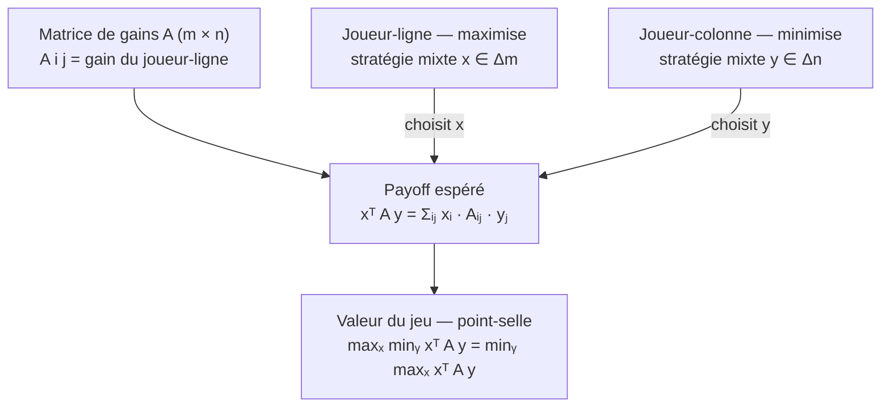
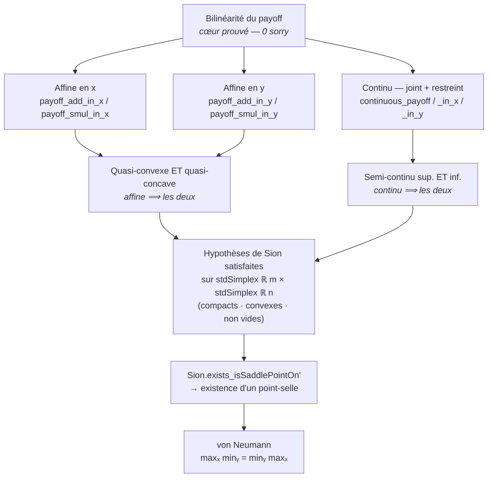

# minimax_lean — Théorème minimax de von Neumann (jeux à somme nulle), Lean 4

Lake Lean 4 (Mathlib) à la racine de la spécialisation **somme nulle** de la série
**GameTheory**, formalisant le socle analytique du **théorème minimax de von
Neumann** pour les jeux finis à deux joueurs et somme nulle : pour toute matrice de
gains `A` (m × n), les stratégies mixtes optimales existent et la valeur du jeu
vérifie

```
maxₓ minᵧ xᵀ A y = minᵧ maxₓ xᵀ A y
```

(`x` parcourt le simplexe des stratégies mixtes du joueur-ligne, `y` celui du
joueur-colonne). Le théorème complet suit du **minimax de Sion** (Mathlib
`Topology.Sion`), dont le cas bilinéaire sur des simplexes compacts convexes redonne
exactement von Neumann. Voir l'issue #4054 (roadmap Lean #4038).

*Le cadre — deux joueurs, une matrice, une espérance ; le joueur-ligne maximise,
le joueur-colonne minimise, somme nulle stricte :*



Ce premier livrable établit le **cœur formel** documenté de la preuve — la
**bilinéarité du payoff** `xᵀ A y`, qui porte les quatre hypothèses de Sion. Il est
**entièrement 0-sorry**.

## Statut

- **Toolchain** : `leanprover/lean4:v4.31.0-rc1` + Mathlib4 (`v4.31.0-rc1`)
- **Sorry** : **0** sur tout le module. L'additivité + l'homogénéité du payoff en
  chaque variable, ainsi que la continuité (jointe et restreinte), sont entièrement
  prouvées.
- **Build** : `lake build Minimax` (dépend de Mathlib4)
- **CI** : `.github/workflows/lean-minimax.yml` (`sorry-filter-mode: standalone-tactic`,
  baseline `0`)

## Stratégie de formalisation

Le **théorème de Sion** (`Sion.exists_isSaddlePointOn'`) énonce : pour `f : E → F → β`
sur des parties `X ⊆ E`, `Y ⊆ F` (espaces vectoriels topologiques sur `ℝ`), si `X` et
`Y` sont non vides, convexes et compacts, `f(·, y)` est quasi-convexe et
semi-continue inférieurement pour tout `y ∈ Y`, et `f(x, ·)` est quasi-concave et
semi-continue supérieurement pour tout `x ∈ X`, alors il existe un point-selle.

Pour `f = payoff A` sur `X = stdSimplex ℝ m`, `Y = stdSimplex ℝ n`, ces hypothèses
découlent toutes de la **bilinéarité** :
- `payoff` est **affine en chaque variable** ⟹ quasi-convexe ET quasi-concave ;
- `payoff` est **continu** (somme finie de monômes) ⟹ semi-continue sup. et inf.

*Comment la bilinéarité (le cœur prouvé) déroule les quatre hypothèses de Sion jusqu'au
point-selle de von Neumann — chaque arête est un lemme de `ZeroSum.lean` :*



## Ce qui est formalisé (`Minimax/ZeroSum.lean`, 0 sorry)

- **Matrice de gains** `PayoffMatrix m n = Matrix m n ℝ` : `A i j` = gain du
  joueur-ligne quand `i` joue la ligne `i` et `j` la colonne `j` (somme nulle : le
  joueur-colonne reçoit `-A i j`).
- **Payoff bilinéaire** `payoff A x y = Σᵢⱼ xᵢ · Aᵢⱼ · yⱼ` (somme unique sur le
  produit `m × n`), espérance du gain du joueur-ligne sous les stratégies mixtes `x`
  (lignes) et `y` (colonnes). La représentation comme somme unique sur le produit
  rend la bilinéarité immédiate.
- **Linéarité en `x`** : `payoff_add_in_x` (`payoff A (x + x') y = payoff A x y +
  payoff A x' y`, via `add_mul` + `Finset.sum_add_distrib`) et `payoff_smul_in_x`
  (`payoff A (c • x) y = c · payoff A x y`, via `Finset.mul_sum`).
- **Linéarité en `y`** : `payoff_add_in_y` (via `mul_add` + `Finset.sum_add_distrib`)
  et `payoff_smul_in_y` (via `Finset.mul_sum`).
- **Continuité** : `continuous_payoff` (continuité jointe sur `(m → ℝ) × (n → ℝ)`,
  via `continuous_finsetSum` + `fun_prop`), et les restrictions
  `continuous_payoff_in_x` / `continuous_payoff_in_y` (une variable fixée, via
  `fun_prop`).

> **Note de formalisation** — `Finset.mul_sum` (factorisation à GAUCHE dans la somme)
  vs `Finset.sum_mul` (factorisation à DROITE) : l'homogénéité `c · ∑ f = ∑ c · f`
  requiert `Finset.mul_sum`, pas `sum_mul`. La distributivité de l'additivité dépend
  du côté du facteur : `(x + x')` multiplie à gauche ⟹ `add_mul` ; `(y + y')`
  multiplie à droite ⟹ `mul_add`.

## Milestone suivant (OPEN — documenté, non sorry-stubbé)

Le câblage explicite de `Sion.exists_isSaddlePointOn'` sur
`stdSimplex ℝ m × stdSimplex ℝ n` est le **milestone ouvert** de l'issue #4054 :
compacité/convexité/non-vacuité des simplexes (`stdSimplex`), dérivation des
`QuasiconvexOn`/`QuasiconcaveOn` depuis l'affinité, et des
`LowerSemicontinuousOn`/`UpperSemicontinuousOn` depuis la continuité. Il est
**honnêtement signalé comme étape à venir** dans l'umbrella `Minimax.lean`
(`Status : Prop := True`) — jamais comblé par `sorry`.

## Référence

- J. von Neumann, *Zur Theorie der Gesellschaftsspiele*, Math. Ann. **100** (1928).
- M. Sion, *On general minimax theorems*, Pacific J. Math. **8** (1958).
- Mathlib4 `Topology.Sion` (`exists_isSaddlePointOn'`) et
  `Analysis.Convex.StdSimplex`.
- Série `GameTheory` : Nash existe déjà via `lean_game_defs/Nash.lean`, dont ce lake
  est la spécialisation somme nulle.
