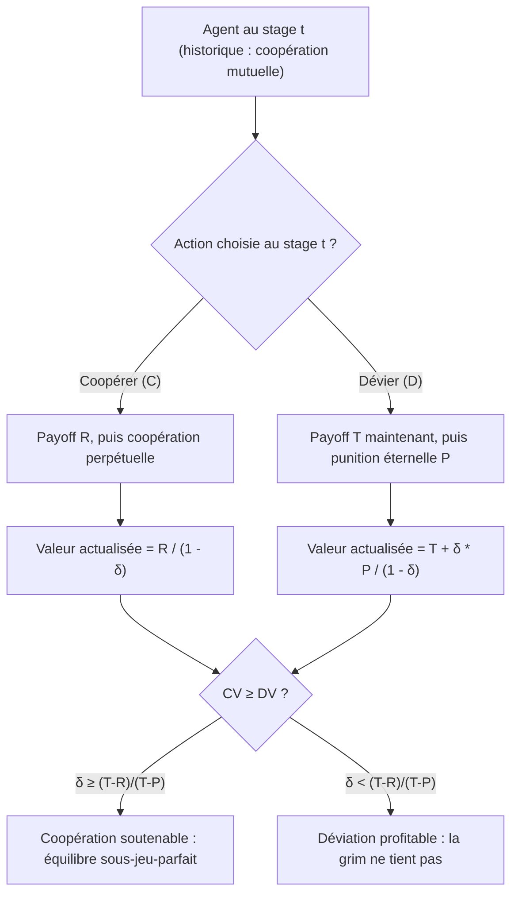

# Repeated Games — Lean (compagnon formel GT-6c)

> **Compagnon formel** du notebook pédagogique [GameTheory-6c](../GameTheory-6c.ipynb) (`Jeux répétés` — Dilemme du prisonnier itéré).
> Série GameTheory a déjà 4 lakes (`cooperative_games`, `minimax`, `social_choice`, `stable_marriage`).
> Aucun ne couvrait les jeux répétés — ce companion comble le manque avec le théorème-phare de la **stratégie grim-trigger**.

## Théorème-phare

**Grim trigger soutient la coopération ssi δ ≥ (T − R) / (T − P)** (one-shot deviation principle).

Pour un jeu répété à horizon infini, facteur d'actualisation δ ∈ [0,1), paramètres réels `T > R > P > S` avec `2R > T + S` :

- **Coopération perpétuelle** génère `R / (1 − δ)` (somme géométrique).
- **Déviation one-shot puis punition éternelle** génère `T + δ · P / (1 − δ)`.
- Seuil d'indifférence : `δ · (T − R) ≥ (T − R)` ⇔ `δ ≥ (T − R) / (T − P)`.

> Au-dessus du seuil, **aucune déviation unilatérale n'est profitable**. La grim est une stratégie d'équilibre sous-jeu-parfait (subgame-perfect Nash equilibrium).

### One-shot deviation principle — schéma de décision

Le théorème repose sur le **principe de déviation unilatérale** : sous grim-trigger, une seule déviation déclenche la punition éternelle. La coopération est soutenable ssi la valeur actualisée de coopérer perpétuellement dépasse celle de dévier une fois puis d'être puni.



## Cohorte (leçon #4362, Issue #4880)

| Paramètre | Valeur | Référence |
|-----------|--------|-----------|
| Toolchain | `leanprover/lean4:v4.31.0-rc1` | Cohorte 18 lakes mutualisés |
| Mathlib rev | `d568c8c0` | `#4363` junction shared cache |
| Total sorry (production) | Voir [FORMAL_STATUS.md](FORMAL_STATUS.md) | Théorème-phare 0 sorry requis |
| Total sorry (stretch) | Folk.lean — tolérés | `#4880` § "Critères de fermeture" §1 |

## Modules

| Module | Rôle | Statut théorique |
|--------|------|------------------|
| `RepeatedGames.Stage` | PD paramétrique, actions C/D, payoffs, défault > cooperate en stage game | FORMAL-CERTIFIED (0 sorry) |
| `RepeatedGames.Discounting` | Facteur d'actualisation, sommes géométriques, lemme de réécriture du seuil | 1 sorry (cible prover BG) |
| `RepeatedGames.GrimTrigger` | Stratégie grim, théorème-phare `grim_trigger_sustains_iff`, corollaire NE | 2 sorries (cibles primaires prover BG) |
| `RepeatedGames.Folk` (STRETCH) | Folk theorem actualisé (Fudenberg–Maskin 1986) | Sorries tolérés (stretch) |

## Pont ICT-13 (#4879)

Le seuil numérique `δ ≥ (T − R) / (T − P)` est le **gate falsifiable** d'[ICT-13](https://github.com/jsboige/CoursIA/issues/4879) — stratégies comme formes stables (Axelrod) :
- ICT-13 stratégies STABLES = celles dont le seuil grim-trigger est satisfait pour les paramètres empiriques (T-R)/(T-P) du dilemme observé.
- Voir `scripts/research/ict/ict13_threshold_compute.py` (à venir — référence croisée à ajouter dans une PR ultérieure).

## Reproving BG

Une fois la PR mergée, lancer en side-track BG (cf directive ai-01 msg-20260702T040323-3i0obi) :
```bash
cd MyIA.AI.Notebooks/SymbolicAI/Lean/agent_tests
python -u run_prover_bg.py <demo_id_grim_trigger> \
  --provider zai --director-provider openrouter \
  --max-iter 20 --workflow-timeout 2400
```
Cibles : `Discounting.discount_threshold_rewrite`, `GrimTrigger.grim_trigger_sustains_iff`, `GrimTrigger.grim_trigger_is_NE`.

## Référence externe

- Geanakoplos, J. (2005). "Three Brief Proofs of Arrow's Impossibility Theorem"
- Fudenberg, D., & Maskin, E. (1986). "The Folk Theorem in Repeated Games with Discounting"
- Mailath, G. J., & Samuelson, L. (2006). *Repeated Games and Reputations: Long-Run Relationships*. Oxford University Press.

## Voir aussi

- [Issue #4880 (création du lake)](https://github.com/jsboige/CoursIA/issues/4880)
- [Issue #4363 (junction shared Mathlib cache)](https://github.com/jsboige/CoursIA/issues/4363)
- Notebook : [`GameTheory-6c.ipynb`](../GameTheory-6c.ipynb)
- Lake jumeau `cooperative_games_lean` (sorries closed 2026-06-09, voir BONDAREVA_SHAPLEY_HARDNESS.md)
