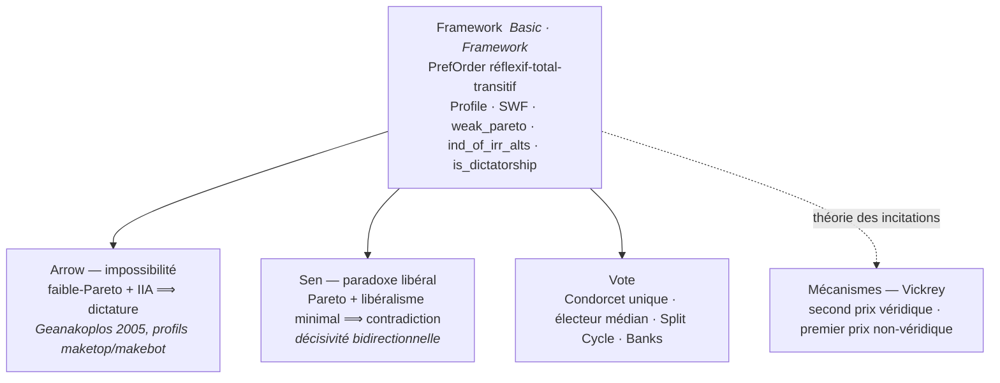
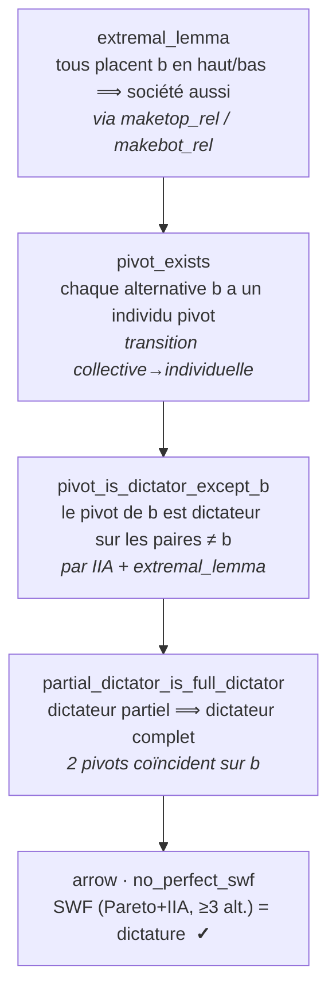

# Théorie du Choix Social — Formulations Lean 4

Ce répertoire contient les formalisations mathématiques de la théorie du choix social en Lean 4, développées dans le cadre de la série GameTheory.

## Vue d'ensemble

| Statistique | Valeur |
|-------------|--------|
| Théorèmes/Lemmas | 76 (0 sorry, 7 modules) |
| sorry restants | 0 |
| Toolchain | `leanprover/lean4:v4.31.0-rc1` |
| Dépendances | Mathlib4, Lake |

**Statut formel** : les **sept** modules (Basic, Framework, Arrow, Sen, Voting,
MechanismDesign, SortedListCounting) sont **FORMAL-CERTIFIED** (0 sorry). Voir
[`FORMAL_STATUS.md`](FORMAL_STATUS.md) pour le détail par fichier.

## Théorèmes formalisés

*Les quatre résultats fondateurs formalisés (0 sorry, 7 modules) — de l'impossibilité de
Arrow et du paradoxe de Sen jusqu'au théorème de l'électeur médian et à la véridicité de
l'enchère de Vickrey :*



### 0. DominikPeters/SocialChoiceLean (référence externe)

Un dépôt de référence majeur pour la formalisation du choix social en Lean 4 :

- **Auteur** : Dominik Peters (University of Glasgow)
- **Dépôt** : https://github.com/DominikPeters/SocialChoiceLean
- **Licence** : MIT

Résultats formalisés par Peters :
- **Gibbard-Satterthwaite** : Manipulabilité stratégique implique dictature (>= 3 candidats)
- **Duggan-Schwartz** : Extension au multi-winner avec optimist/pessimist strategyproofness
- **4 impossibilités Condorcet** : Participation, Reinforcement, Strategyproofness, Anon+Neutral+Resolute
- **15+ règles de vote** avec vérification d'axiomes : Split Cycle, Schulze, Copeland, Black, IRV, Borda, etc.

**Intégration dans notre projet** (3 phases) :
1. **Phase 1** (ce dépôt) : Citations et références croisées
2. **Phase 2** : Projet Lake séparé ([`social_choice_lean_peters/`](../social_choice_lean_peters/)) ; notebook compagnon de tour prévu (pas encore créé)
3. **Phase 3** : Portage sélectif dans notre framework `PrefOrder` (impossibilités Condorcet, règles de scoring)

**Différences de framework** :
| Aspect | Notre projet (ChaseNorman) | DominikPeters |
|--------|---------------------------|---------------|
| Type de préférence | `PrefOrder α` (réflexif, total, transitif) | `LinearOrder A` (strict, Mathlib) |
| Règle de vote | `SCC ι σ` (types fixés) | `VotingRule` (polymorphe sur V, A) |
| Toolchain | `v4.31.0-rc1` | `v4.27.0-rc1` (pin commit `d679d950`) |

### 1. Théorème d'Impossibilité d'Arrow (Arrow's Impossibility Theorem)

**Dans `SocialChoice/Arrow.lean`** :

- **Énoncé** : Toute fonction de welfare social sur au moins 3 alternatives qui satisfait :
  1. **Faible Pareto** : Si tout le monde préfère x à y, la société aussi
  2. **Indépendance des Alternatives Irrelevantes (IIA)** : Le classement social de x vs y dépend uniquement des classements individuels de x vs y

- **Conclusion** : Doit être une **dictature** (un individu détermine tous les classements sociaux)

- **Structure de la preuve** :
  1. **Lemme extrême** : Si tous placent b en haut ou en bas, la société aussi
  2. **Existence du pivot** : Chaque alternative a un individu pivot
  3. **Troisième étape** : Les pivots deviennent des dictateurs sur les paires non-b
  4. **Quatrième étape** : La dictature partielle s'étend à une dictature complète

*La preuve en quatre étapes de Geanakoplos (2005), des profils manipulés `maketop`/`makebot`
jusqu'à la dictature complète — chaque étape décharge la suivante :*



### 2. Paradoxe de la Libéralité de Sen (Sen's Liberal Paradox)

**Dans `SocialChoice/Sen.lean`** :

- **Énoncé** : Aucune procédure de décision sociale ne peut simultanément satisfaire :
  1. **Critère de Pareto faible**
  2. **Libéralisme minimal** : Certains individus sont décisifs sur certaines paires

### 3. Théorie du vote (Voting.lean)

**Dans `SocialChoice/Voting.lean`** (port de chasenorman/Formalized-Voting, 19 théorèmes,
0 sorry). Le module couvre bien au-delà du seul électeur médian :

- **Marges** (`margin_pos`, `margin_antisymm`, `margin_pos_iff_neg_rev`) : la marge
  majoritaire d'une paire encode l'écart de voix ; antisymétrie et caractérisation.
- **Gagnant/perdant de Condorcet** : `condorcet_winner_unique` (unicité du gagnant de
  Condorcet), `condorcet_winner_not_loser` (disjonction gagnant/perdant).
- **Préférences single-peaked et électeur médian** : `single_peaked_peak_unique` (pic
  unique), `single_peaked_peak_best` (le pic est le meilleur), puis
  **`median_voter_theorem`** et sa variante stricte `median_voter_theorem_strict` — pour
  des préférences single-peaked, la règle majoritaire sélectionne l'alternative préférée
  de l'électeur médian. Le noyau de comptage médian vit dans `SortedListCounting.lean`.
- **Cycles et acyclicité** : `cycle_length_pos`, `rotate_cycle`, `lt_acyclic`,
  `split_cycle_condorcet` (la règle **Split Cycle** de Holliday-Pacuit satisfait le
  critère de Condorcet).
- **Clones et tournois** : `clone_set_nonempty` (structure de clones), `banks_set_subset` /
  `banks_set_condorcet` (ensemble des gagnants de Banks).

### 4. Théorie des mécanismes — Enchère de Vickrey (MechanismDesign.lean)

**Dans `SocialChoice/MechanismDesign.lean`** (4 théorèmes, 0 sorry). Le projet s'étend
au-delà du choix social pur vers la **théorie des mécanismes** (incitations et véridicité) :

- **Véridicité de Vickrey** (`vickrey_truthful_bidder0`, `vickrey_truthful_bidder1`,
  `vickrey3_truthful_bidder0`) : dans une enchère au **second prix** (Vickrey), annoncer
  sa vraie valuation est une stratégie faiblement dominante — le mécanisme est *truthful*
  (incitation à révéler sa vraie valeur).
- **First-price non véridique** (`first_price_not_truthful`) : à l'inverse, l'enchère au
  **premier prix** n'est **pas** véridique (contre-exemple direct) — l'enchérisseur a
  intérêt à sous-évaluer sa vraie valeur.

## Structure des fichiers

```text
social_choice_lean/
├── README.md                          # Documentation générale
├── lakefile.lean                      # Configuration du projet Lake
├── lean-toolchain                     # Version de Lean (v4.31.0-rc1)
├── SocialChoice.lean                  # Fichier d'imports principaux
├── SocialChoice/                      # Module principal (7 fichiers, 0 sorry)
│   ├── Basic.lean                    # Définitions de base (P, I, PrefOrder, QuasiOrder,
│   │                                 # lemmes de transitivité, best/maximal elements)
│   ├── Framework.lean                # Cadre SWF (Profile, SWF, weak_pareto, IIA,
│   │                                 # is_dictatorship, maketop/makebot/makeabove)
│   ├── Arrow.lean                   # Théorème d'Arrow (Geanakoplos 2005, 4 étapes)
│   ├── Sen.lean                     # Paradoxe de Sen (décisivité bidirectionnelle)
│   ├── Voting.lean                  # Théorie du vote : margins, Condorcet (unique),
│   │                                 # single-peaked, théorème de l'électeur médian,
│   │                                 # Split Cycle, clones, tournois de Banks
│   ├── MechanismDesign.lean         # Théorie des mécanismes : Vickrey (véridicité),
│   │                                 # first-price non-véridique
│   └── SortedListCounting.lean      # Lemmes de comptage médian (noyau du median voter)
└── examples/
    ├── arrow_simple.lean            # Exemple simple d'Arrow
    └── sen_liberal_paradox.lean     # Exemple du paradoxe de Sen
```

Le projet `social_choice_lean_peters/` (adjacent) contient un projet Lake séparé qui importe DominikPeters/SocialChoiceLean en dépendance. Il sert de vérification de build et de référence pour le notebook [SC-02](../SocialChoice/02-Lean-SocialChoice-Formal.ipynb) (qui inclut un tour du code `social_choice_lean`).

## Choix de design

### Préférences faibles vs strictes

Notre framework utilise des **préférences faibles** (`PrefOrder α` : réflexif, total, transitif) plutôt que des ordres linéaires stricts. Ce choix suit la tradition de l'économie du bien-être (Sen 1970, Arrow 1951) où la préférence stricte `P R x y` et l'indifférence `I R x y` sont dérivées d'une relation sous-jacente `R`. L'alternative — utiliser `LinearOrder` de Mathlib directement — est adoptée par DominikPeters/SocialChoiceLean mais rend les définitions moins directement comparables aux textes classiques de choix social.

### Dictateur directionnel

La définition de `is_dictatorship` dans `Arrow.lean` utilise un **dictateur directionnel** : un individu `d` tel que pour toute paire `(x, y)`, si `d` préfère strictement `x` à `y`, la société préfère strictement `x` à `y`. C'est suffisant dans le contexte d'une SWF qui produit une préférence totale — un dictateur directionnel est automatiquement un dictateur complet. Ce formulation simplifie la preuve d'extension (étape 4 de Geanakoplos 2005) par rapport à une définition qui exigerait la coïncidence exacte entre préférences individuelles et sociales.

### Décisivité bidirectionnelle dans Sen

Le paradoxe de Sen (`Sen.lean`) utilise `is_decisive_over` comme décisivité **bidirectionnelle** : un individu est décisif sur `{a, b}` s'il détermine le classement social dans les deux sens (a > b et b > a). Certains textes formulent la décisivité de manière unidirectionnelle. La version bidirectionnelle renforce l'hypothèse de libéralisme minimal et produit un paradoxe plus fort — tout résultat prouvé avec la version bidirectionnelle s'applique aussi à la version unidirectionnelle.

### Sources académiques

| Résultat | Source | Approche de preuve |
| ---------- | ------ | ------------------ |
| Arrow | Geanakoplos (2005), "Three Brief Proofs of Arrow's Impossibility Theorem" | Preuve par profils manipulés (maketop/makebot) |
| Sen | Sen (1970), "The Impossibility of a Paretian Liberal" | Contre-exemple direct par cas |
| Median Voter | Black (1948), "On the Rationale of Group Decision-making" | Comptage majoritaire sur single-peaked |
| Split Cycle | Holliday & Pacuit (2023) | Élimination des défaites dans les cycles |

### Port depuis Lean 3

Ce projet est un port depuis [asouther4/lean-social-choice](https://github.com/asouther4/lean-social-choice) (Lean 3). Les adaptations principales :

- Remplacement des `definition` Lean 3 par `def` Lean 4
- Migration des tactiques Lean 3 vers Lean 4 (syntaxe `split_ifs`, `rcases`)
- Utilisation de `Classical.dec` pour les instances `Decidable` non-constructives
- Conservation du framework `PrefOrder` (pas de migration vers les typeclasses Mathlib)

## Dépendances

- **Lean 4** : Version stable (via `lean-toolchain`)
- **Mathlib4** : Bibliothèque standard de mathématiques formelles
- **Lake** : Gestionnaire de paquets pour Lean

## Construction et compilation

```bash
# Récupérer le cache Mathlib (première fois)
lake exe cache get

# Compiler le projet
lake build

# Exécuter les tests
lake test
```

## Concepts clés formels

| Concept | Définition Lean |
|---------|----------------|
| `P R x y` | Préférence stricte : x est strictement préféré à y |
| `I R x y` | Indifférence : x et y sont également classés |
| `PrefOrder α` | Relation de préférence complète et transitive sur α |
| `Profile n α` | Affectation de préférences à n individus sur α |
| `SWF n α` | Fonction de welfare social : profiles → préférence sociale |
| `weak_pareto` | Condition d'unanimité |
| `ind_of_irr_alts` | Indépendance des alternatives irrelevantes |
| `is_dictatorship` | Existence d'un dictateur |

## Intégration avec la série GameTheory

Ces formalisations Lean sont les bases théoriques pour les notebooks de la sous-série `SocialChoice/` :

- [`02-Lean-SocialChoice-Formal.ipynb`](../SocialChoice/02-Lean-SocialChoice-Formal.ipynb) : applications pratiques des formalisations (kernel Lean 4)
- [`03-Voting-Methods.ipynb`](../SocialChoice/03-Voting-Methods.ipynb) : simulations numériques des méthodes de vote (Python)
- Le tour des résultats de DominikPeters/SocialChoiceLean — backend [`social_choice_lean_peters/`](../social_choice_lean_peters/) (notebook compagnon prévu, pas encore créé)

## Liens utiles

- [Documentation Mathlib4](https://leanprover-community.github.io/mathlib4_docs/)
- [Référence originale Arrow/Sen](https://github.com/asouther4/lean-social-choice) (Lean 3)
- [DominikPeters/SocialChoiceLean](https://github.com/DominikPeters/SocialChoiceLean) (Lean 4, MIT)
- [Série GameTheory](../README.md)

## Licence

Voir la licence du repository principal.

## Conclusion

Ce projet formalise en Lean 4 (**0 `sorry`**, 76 théorèmes/lemmas sur 7 modules) les
résultats fondateurs de la théorie du choix social : le **théorème d'impossibilité
d'Arrow**, le **paradoxe libéral de Sen**, la **théorie du vote** (Condorcet, électeur
médian, Split Cycle) et la **véridicité de l'enchère de Vickrey** (théorie des mécanismes).
Tous les modules sont FORMAL-CERTIFIED et recompilables via `lake build` sur la toolchain
`v4.31.0-rc1`.

### Ce qui est prouvé

- **Arrow** (`Arrow.lean`) : toute fonction de welfare social (≥ 3 alternatives)
  satisfaisant faible-Pareto + IIA est une **dictature** — preuve structurée en
  quatre étapes à la Geanakoplos (2005), via profils manipulés `maketop`/`makebot`
  (`extremal_lemma` → `pivot_exists` → `pivot_is_dictator_except_b` →
  `partial_dictator_is_full_dictator` → `arrow` / `no_perfect_swf`).
- **Sen** (`Sen.lean`) : aucune procédure sociale ne réconcilie Pareto faible et
  libéralisme minimal (décisivité bidirectionnelle), par contre-exemple direct
  (`sen_impossibility`, `book_paradox_demonstrates_sen`).
- **Théorie du vote** (`Voting.lean`) : marges majoritaires, **unicité du gagnant de
  Condorcet**, préférences single-peaked, **théorème de l'électeur médian**
  (variante stricte comprise), acyclicité et règle **Split Cycle**, structure de clones
  et gagnants de Banks.
- **Théorie des mécanismes** (`MechanismDesign.lean`) : **véridicité de l'enchère de
  Vickrey** (2 et 3 enchérisseurs) et **non-véridicité de l'enchère au premier prix**.

### Pourquoi ça marche

Le framework repose sur des **préférences faibles** `PrefOrder α` (réflexif,
total, transitif), suivant la tradition d'économie du bien-être (Arrow 1951,
Sen 1970) : la préférence stricte `P` et l'indifférence `I` sont dérivées d'une
relation `R` sous-jacente, ce qui rend les définitions directement comparables
aux textes classiques. Arrow utilise un **dictateur directionnel** (suffisant
pour une SWF totale) ; Sen renforce l'hypothèse par une décisivité
**bidirectionnelle**, produisant un paradoxe plus fort (tout résultat
bidirectionnel implique l'unidirectionnel).

### Où aller ensuite

- **Sources** : Geanakoplos (2005), *Three Brief Proofs of Arrow's Impossibility
  Theorem* ; Sen (1970), *The Impossibility of a Paretian Liberal*.
- **Référence externe** : [`DominikPeters/SocialChoiceLean`](https://github.com/DominikPeters/SocialChoiceLean)
  (Gibbard-Satterthwaite, 15+ règles de vote, framework `LinearOrder` strict) —
  comparé dans la section « Différences de framework » ci-dessus.
- **Série** : notebooks [`GameTheory`](../README.md) — [SC-02](../SocialChoice/02-Lean-SocialChoice-Formal.ipynb) (preuve formelle Lean, inclut le tour de `social_choice_lean`),
  [SC-03](../SocialChoice/03-Voting-Methods.ipynb) (simulations Python).
