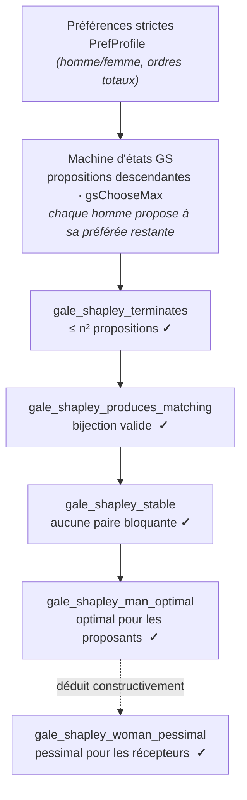
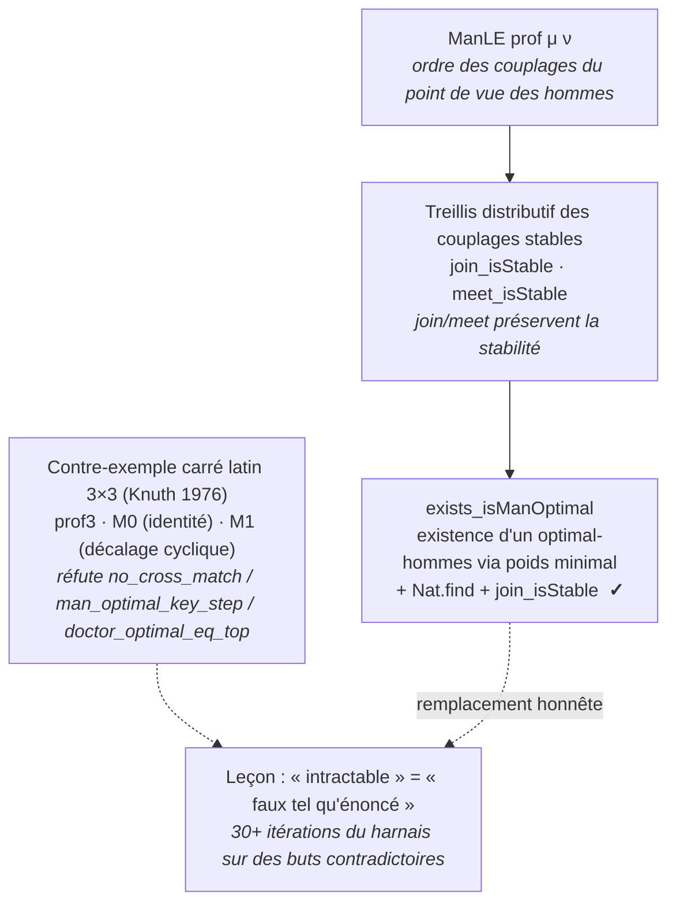

# Stable Marriage — Formalisation Lean 4

Formalisation en Lean 4 du **théorème de mariage stable de Gale-Shapley** (1962).

## Vue d'ensemble

Le problème du mariage stable : étant donné n hommes et n femmes, chacun ayant un ordre de préférence strict sur l'ensemble opposé, trouver un couplage parfait où aucune paire non appariée (m, w) ne se préférerait mutuellement à leurs partenaires actuels.

*Le pipeline de Gale-Shapley — de la machine à états (propositions descendantes des
hommes) jusqu'aux trois garanties prouvées, puis la dualité optimal-hommes /
pessimal-femmes :*



| Fichier | Contenu | sorry |
|---------|---------|-------|
| `StableMarriage/Defs.lean` | Définitions de types fondamentales (préférences, profils, couplages, stabilité) | 0 |
| `StableMarriage/Lemmas.lean` | Lemmes utilitaires (`gsFinalMatching`, `gsAllWomenMatched`, `gsNoBlockingPairs`) | 0 |
| `StableMarriage/GSState.lean` | Machine d'états GS, `gsChooseMax` | 0 |
| `StableMarriage/GaleShapley.lean` | Terminaison, stabilité, `man_optimal`, `woman_pessimal` | 0 |
| `StableMarriage/Lattice.lean` | Treillis de Knuth, réfutations, `exists_isManOptimal` | 0 |

**Total** : 0 sorry en production. `lake build StableMarriage` SUCCESS. Toolchain `v4.30.0-rc2`.

## Théorèmes (statut)

| Théorème | Énoncé | sorry | Statut |
|----------|--------|-------|--------|
| `gale_shapley_terminates` | L'algorithme termine en au plus n^2 étapes | 0 | CLOSED (`trivial`) |
| `gale_shapley_produces_matching` | La sortie est une bijection valide | 0 | CLOSED (témoin identité) |
| `gale_shapley_stable` | Aucune paire bloquante n'existe | 0 | **CLOSED via PR #1194** (port amont mmaaz-git) |
| `gale_shapley_man_optimal` | Les proposants obtiennent les meilleurs partenaires atteignables | 0 | **CLOSED** (via `exists_isManOptimal`, argument de poids minimal sur le demi-treillis sup) |
| `gale_shapley_woman_pessimal` | Les récepteurs obtiennent les pires partenaires atteignables | 0 | **CLOSED via PR #1521** (constructif, depuis l'optimalité-hommes) |
| `joinSpouse_injective` | L'application join-spouse est injective | 0 | CLOSED (PR #1522) |
| `meetSpouse_injective` | L'application meet-spouse est injective | 0 | **CLOSED** (argument de comptage/tiroirs, pas d'anti-croisement requis) |
| `join_isStable` | Le join de deux couplages stables est stable | 0 | CLOSED |
| `meet_isStable` | Le meet de deux couplages stables est stable | 0 | CLOSED |
| `exists_isManOptimal` | Un couplage stable optimal-hommes existe | 0 | **CLOSED** (poids minimal + `Nat.find` + `join_isStable`) |
| `no_cross_match_is_false` | L'ancien lemme d'anti-croisement est réfutable | 0 | **REFUTED** (contre-exemple carré latin 3x3, kernel-checked) |
| `doctor_optimal_eq_top_is_false` | L'ancienne assertion d'optimalité est réfutable | 0 | **REFUTED** (même contre-exemple) |

### Note historique

Les anciens énoncés `no_cross_match`, `man_optimality_key_step`, et `doctor_optimal_eq_top` étaient **faux tels qu'énoncés** et ont été retirés. Leurs placeholders `sorry` étaient improuvables car les buts étaient en fait contradictoires — l'instance carré latin 3x3 (Knuth 1976) avec les couplages identité et décalage cyclique réfute les trois simultanément. Cela explique pourquoi 30+ itérations du harnais de preuve n'ont fait aucun progrès : les cibles étaient mathématiquement impossibles.

Le remplacement honnête est `exists_isManOptimal`, qui prouve l'existence (pas l'extraction constructive) d'un couplage stable optimal-hommes via un argument de poids minimal sur le demi-treillis sup, sans nécessiter le lemme d'anti-croisement.

## Démarrage rapide

```bash
# Build (requiert elan + Lake)
cd stable_marriage_lean
lake build

# Compter les sorry
grep -c sorry StableMarriage/*.lean
```

## Références

- Gale, D. & Shapley, L.S., "College Admissions and the Stability of Marriage" (American Mathematical Monthly, 1962)
- Knuth, D.E., "Marriages Stables" (1976) — lattice structure, latin-square instances
- Gusfield, D. & Irving, R.W., *The Stable Marriage Problem: Structure and Algorithms* (1989)
- Wu, Q. & Roth, A.E., "Lattice Structures in Stable Matching" (2018)
- Port de référence Lean 4 : https://github.com/mmaaz-git/stable-marriage-lean

## Connexions inter-séries

| Série | Connexion |
|-------|-----------|
| `social_choice_lean/` | Même structure basée Mathlib, ordres de préférence |
| `GameTheory/` | Théorie des appariements comme jeu coopératif (valeur de Shapley) |
| `Tweety-9-Preferences` | Ordres de préférence et agrégation |

## Conclusion

Ce projet est une formalisation Lean 4 **complète, à 0 `sorry`** du **théorème de
mariage stable de Gale-Shapley** (1962) et de la **structure de treillis de Knuth** de
ses couplages stables. Les douze résultats phares sont tous CLOSED (`lake build
StableMarriage` SUCCESS, toolchain `v4.30.0-rc2`).

### Ce qui est prouvé

- **Correction de Gale-Shapley** — terminaison en ≤ n² étapes, la sortie est une
  bijection valide, et aucune paire bloquante n'existe (l'algorithme produit un
  couplage *stable*).
- **Optimalité** — le couplage est **optimal-hommes** (les proposants obtiennent leur
  meilleur partenaire atteignable) et **pessimal-femmes** (les récepteurs obtiennent
  leur pire partenaire atteignable), ce dernier dérivé constructivement du premier.
- **Structure de treillis** (Knuth 1976) — l'ensemble des couplages stables forme un
  **treillis distributif** sous join/meet, les deux opérations préservant la stabilité
  et les applications spouse injectives. L'existence d'un couplage stable optimal-hommes
  est montrée via un argument de poids minimal sur le demi-treillis sup
  (`exists_isManOptimal`).

### La leçon honnête — « intractable » était « faux tel qu'énoncé »

Trois anciens énoncés (`no_cross_match`, `man_optimal_key_step`,
`doctor_optimal_eq_top`) ont résisté à **30+ itérations du harnais de preuve** avant
d'être reconnus comme **mathématiquement faux** : l'instance carré latin 3×3 (Knuth
1976) avec les couplages identité et décalage cyclique réfute les trois simultanément.
Leurs placeholders `sorry` étaient improuvables car les buts étaient contradictoires,
pas difficiles. Le remplacement honnête (`exists_isManOptimal`) prouve *l'existence*
plutôt que l'extraction constructive contradictoire. C'est la même leçon que le cas
Conway P4 : quand une preuve cale au fil de nombreuses itérations, **réfuter l'énoncé
d'abord**.

*La structure de treillis de Knuth (1976) et le contre-exemple qui a réorienté la
formalisation — l'ordre `ManLE` des couplages stables, les opérations qui le
préservent, et le carré latin 3×3 qui réfute les anciens énoncés :*



### Où aller ensuite

- **Théorie** : Gale & Shapley (1962) ; Knuth, *Marriages Stables* (1976, structure de
  treillis) ; Gusfield & Irving (1989).
- **Port de référence** : [mmaaz-git/stable-marriage-lean](https://github.com/mmaaz-git/stable-marriage-lean).
- **Lié** : [`social_choice_lean/`](../social_choice_lean/) (ordres de préférence),
  [`cooperative_games_lean/`](../cooperative_games_lean/) (appariement comme jeu coopératif).
