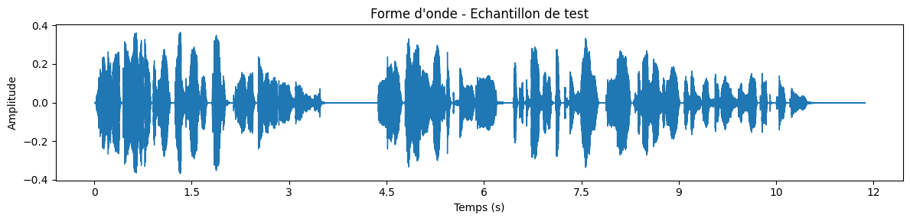
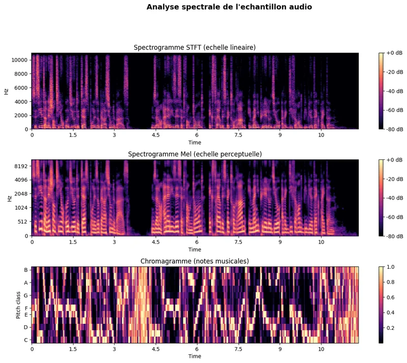
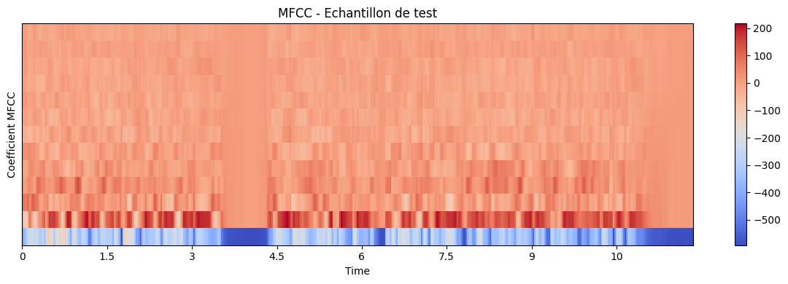
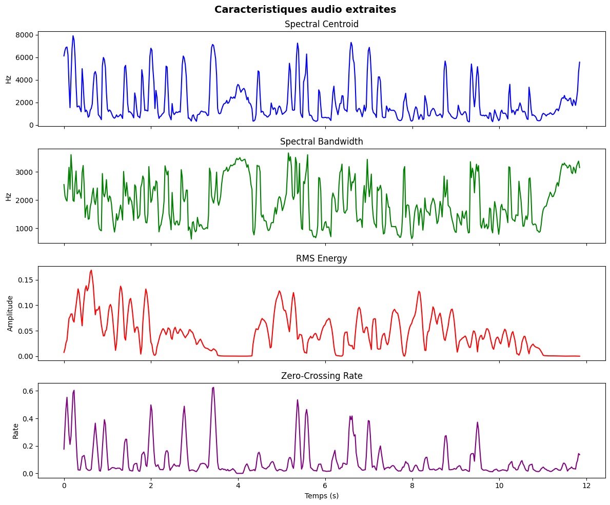

# 01-Foundation - Bases Speech & Audio

[← Documentation Audio](../README.md) | [↑ ..](../README.md) | [→ Audio Advanced](../02-Advanced/)

Ce module couvre les fondamentaux du traitement audio par IA : reconnaissance vocale (STT), synthèse vocale (TTS), et opérations audio de base.

**Dans le cadre du fil rouge podcast** : avant de produire un épisode, il faut maîtriser les deux briques essentielles -- faire parler la machine (TTS) et comprendre la parole humaine (STT). [01-1](01-1-OpenAI-TTS-Intro.ipynb) et [01-2](01-2-OpenAI-Whisper-STT.ipynb) couvrent les API cloud (rapides à mettre en oeuvre), tandis que [01-4](01-4-Whisper-Local.ipynb) et [01-5](01-5-Kokoro-TTS-Local.ipynb) passent en local GPU pour l'autonomie et le contrôle. [01-3](01-3-Basic-Audio-Operations.ipynb) donne les bases techniques (spectrogrammes, MFCC) utiles pour comprendre ce que manipulent les modèles.

## Vue d'ensemble

| Statistique | Valeur |
|-------------|--------|
| Notebooks | 5 |
| Kernel | Python 3 |
| Durée estimée | ~3-4h |
| GPU requis | 0-10GB |

## Aperçu — les bases audio en images

Ce module pose les fondamentaux du traitement audio : synthèse vocale (TTS), reconnaissance vocale (STT), et opérations de base sur le signal. Plutôt qu'une galerie séparée du propos, les sorties du **pipeline d'analyse audio** (forme d'onde → spectrogramme → MFCC → caractéristiques) extraites du notebook fondationnel [01-3](01-3-Basic-Audio-Operations.ipynb) sont présentées ci-dessous en séquence narrative — les briques techniques pour comprendre ce que manipulent les modèles TTS et STT. Provenance et poids de chaque figure : [`assets/readme/MANIFEST.md`](assets/readme/MANIFEST.md).

## Notebooks

| # | Notebook | Contenu | Service | VRAM |
|---|----------|---------|---------|------|
| 1 | [01-1-OpenAI-TTS-Intro](01-1-OpenAI-TTS-Intro.ipynb) | API TTS (6 voix, formats, vitesse) | OpenAI API | 0 |
| 2 | [01-2-OpenAI-Whisper-STT](01-2-OpenAI-Whisper-STT.ipynb) | Whisper API + GPT-4o-Transcribe | OpenAI API | 0 |
| 3 | [01-3-Basic-Audio-Operations](01-3-Basic-Audio-Operations.ipynb) | librosa, spectrogrammes, MFCC, pydub | Local | 0 |
| 4 | [01-4-Whisper-Local](01-4-Whisper-Local.ipynb) | Whisper V3 Turbo local, batch | Local GPU | ~10 GB |
| 5 | [01-5-Kokoro-TTS-Local](01-5-Kokoro-TTS-Local.ipynb) | Kokoro 82M, TTS légère | Local GPU | ~2 GB |

**[01-3](01-3-Basic-Audio-Operations.ipynb) — Le pipeline d'analyse audio.** Ce notebook est le seul du module à produire des visualisations : il déroule la chaîne de transformations qui révèle la structure d'un signal audio, du domaine temporel brut jusqu'aux caractéristiques exploitables par les modèles. Chaque étape ci-dessous correspond à une cellule du notebook.

**Étape 1 — Forme d'onde.** Le point de départ : l'amplitude du signal échantillonnée dans le temps. On y lit directement la structure alternée de silence et de parole :

<p align="center">
  <a href="01-3-Basic-Audio-Operations.ipynb"></a><br>
  <em>Sortie du notebook <a href="01-3-Basic-Audio-Operations.ipynb">01-3</a> (cellule 12) : forme d'onde — l'amplitude en fonction du temps.</em>
</p>

**Étape 2 — Spectrogramme.** Une transformée temps-fréquence (FFT) décompose ce signal en ses composantes spectrales : l'axe vertical devient la fréquence, l'intensité codant l'énergie. C'est la représentation qu'utilisent de nombreux modèles de speech :

<p align="center">
  <a href="01-3-Basic-Audio-Operations.ipynb"></a><br>
  <em>Sortie du notebook <a href="01-3-Basic-Audio-Operations.ipynb">01-3</a> (cellule 15) : spectrogramme — décomposition temps-fréquence du même signal.</em>
</p>

**Étape 3 — MFCC.** Les coefficients cepstraux dans l'échelle mel (MFCC) condensent le spectrogramme en un petit nombre de coefficients qui captent le timbre perceptuel — la représentation de référence pour STT et classification audio. Deux vues complémentaires : la courbe des coefficients et la carte de chaleur :

<p align="center">
  <a href="01-3-Basic-Audio-Operations.ipynb"></a><br>
  <em>Sortie du notebook <a href="01-3-Basic-Audio-Operations.ipynb">01-3</a> (cellule 20, sortie 1) : MFCC — coefficients cepstraux mel.</em>
</p>

<p align="center">
  <a href="01-3-Basic-Audio-Operations.ipynb"></a><br>
  <em>Sortie du notebook <a href="01-3-Basic-Audio-Operations.ipynb">01-3</a> (cellule 20, sortie 3) : MFCC en carte de chaleur — même information, vue alternative.</em>
</p>

**Étape 4 — Extraction de caractéristiques.** Aboutissement du pipeline : les descripteurs extraits (centroid spectral, RMS, ZCR…) alimentent directement les comparaisons et benchmarks des niveaux suivants :

<p align="center">
  <a href="01-3-Basic-Audio-Operations.ipynb"></a><br>
  <em>Sortie du notebook <a href="01-3-Basic-Audio-Operations.ipynb">01-3</a> (cellule 28) : extraction des caractéristiques audio — le pipeline complet résumé.</em>
</p>

## Prérequis

### API Keys
```bash
# Dans GenAI/.env
OPENAI_API_KEY=sk-...
```

### Dépendances
```bash
pip install -r requirements.txt
pip install -r requirements-audio.txt
```

## Progression recommandée

1. **01-1-OpenAI-TTS-Intro** - Introduction à la synthèse vocale avec OpenAI
2. **01-2-OpenAI-Whisper-STT** - Reconnaissance vocale avec Whisper
3. **01-3-Basic-Audio-Operations** - Manipulation audio locale
4. **01-4-Whisper-Local** - Whisper local pour traitement hors ligne
5. **01-5-Kokoro-TTS-Local** - TTS léger sur GPU

## Points clés

- **Cloud vs Local** : Les notebooks 01-1 et 01-2 utilisent l'API OpenAI, 01-3 est local CPU, 01-4 et 01-5 nécessitent un GPU
- **Formats audio** : WAV, MP3, FLAC supportés dans tous les notebooks
- **Qualité** : Whisper V3 Turbo offre meilleure précision que l'API
- **Performance** : Kokoro TTS est optimal pour les systèmes avec peu de VRAM

## Ressources

- [Documentation Audio principale](../README.md)
- [Guide d'installation des dépendances](../../00-GenAI-Environment/README.md)