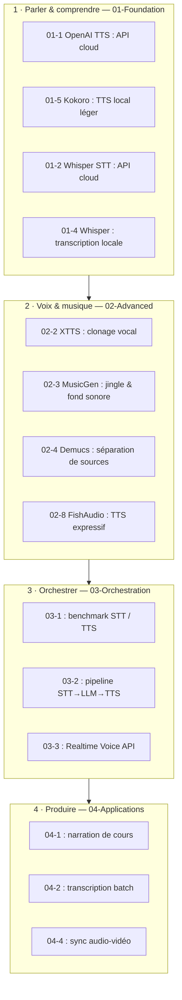

# Audio - Speech, Voix & Musique par IA

<!-- CATALOG-STATUS
series: GenAI-Audio
pedagogical_count: 30
breakdown: Audio=30
maturity: BETA=30
-->

[← Documentation GenAI](../README.md) | [↑ ..](../README.md) | [→ Video Workflows](../Video/README.md)

Le traitement audio est souvent le parent pauvre de l'IA générative, éclipsé par les images et le texte. Pourtant, la voix et la musique sont les modalités les plus naturelles de l'interaction humaine. Cette série couvre l'ensemble de la chaîne audio IA : reconnaissance vocale, synthèse, clonage, génération musicale, et orchestration de pipelines.

Les notebooks de cette série sont répartis sur 4 niveaux progressifs, des bases STT/TTS aux applications de production. Le niveau Applications abrite un pipeline audiobook complet — un orchestrateur agentique qui enchaîne analyse littéraire, casting vocal, annotation prosodique, synthèse et compilation — étendu par une variante FishAudio S2-Pro pilotable par 29 tags prosodiques officiels et évaluée par taux d'erreur (WER).

## Pourquoi cette série

Les cas d'usage qui motivent cette série sont concrets et variés : rendre un cours accessible en version audio narrée ([04-1](04-Applications/04-1-Educational-Audio-Content.ipynb)), transcrire un épisode ou un corpus entier ([04-2](04-Applications/04-2-Transcription-Pipeline.ipynb)), produire un jingle ou une bande sonore ([04-3](04-Applications/04-3-Music-Composition-Workflow.ipynb)), cloner une voix pour obtenir un narrateur cohérent, ou assembler un podcast ou un livre audio de bout en bout. Chaque niveau répond à un de ces besoins.

Spécificité technique : l'audio est un signal continu — échantillonnage, spectre, coefficients cepstraux (MFCC, voir [01-3](01-Foundation/01-3-Basic-Audio-Operations.ipynb)) — très différent du texte et de l'image discrets. La reconnaissance (STT) et la synthèse (TTS) en sont les deux faces symétriques, que les niveaux Foundation et Advanced déclinent. Le contrôle fin de l'identité (clonage vocal) et de l'émotion (prosodie) s'ajoute ensuite, puis l'orchestration assemble ces briques en pipelines, jusqu'au temps réel avec l'OpenAI Realtime API ([03-3](03-Orchestration/03-3-Realtime-Voice-API.ipynb)).

Là où les séries Texte et Image traitent des signaux discrets (tokens, pixels), l'audio impose une contrainte de flux et de temps : il faut produire des dizaines de milliers d'échantillons par seconde, synchronisables avec une piste vidéo. C'est cette contrainte temporelle qui justifie l'accent sur l'orchestration et les pipelines dans les niveaux 3 et 4, ainsi que le pont naturel avec la série Video (synchronisation audio-vidéo, [04-4](04-Applications/04-4-Audio-Video-Sync.ipynb)).

## Fil rouge : construire un podcast automatisé

L'objectif fil rouge de cette série est de construire un podcast entièrement généré par IA. Chaque niveau apporte une brique supplémentaire : TTS pour donner une voix au contenu (niveau 1), clonage vocal et musique pour l'identité sonore (niveau 2), pipelines STT vers LLM vers TTS pour l'assemblage (niveau 3), et workflows de production pour le déploiement (niveau 4).

> **Note d'audit c.529 (2026-07-16, #5780).** Les notes d'audit c.481 et c.490 (retirées ici) avaient interverti le contenu de `audio2` et `audio4` dans leur propre lecture, puis conclu à tort que 5/6 figures étaient « invérifiables / probablement externes ». Une relecture vision firsthand des 6 PNG, croisée avec l'historique git par-blob et un scan `nbformat` des notebooks sources, établit que **les 6 figures sont de vraies sorties de notebook** : l'écart de taille et de MD5 avec les cellules brutes vient de l'optimisation PIL de `extract_readme_figures.py` (downscale ≤ 1200 px + recompression, ratio 0,62–0,97), et non d'une source externe. L'attribution corrigée et le détail par-blob (cellule source, MD5, ratio) sont dans [`assets/readme/MANIFEST.md`](assets/readme/MANIFEST.md) ; les légendes inline ci-dessous sont désormais fidèles au contenu réel de chaque figure.

## Structure

```
Audio/
├── 01-Foundation/     # STT, TTS, bases audio
├── 02-Advanced/       # Voice cloning, musique, MIDI, chansons, TTS expressif
├── 03-Orchestration/  # Multi-modèles, temps réel
└── 04-Applications/   # Éducation, production, sync A/V, live coding, audiobook
```

## Progression par niveau

### 01-Foundation - Bases Speech & Audio

Avant de produire un podcast, il faut maîtriser les deux briques de base : la synthèse vocale (TTS) pour générer de la parole, et la reconnaissance vocale (STT) pour transcrire des fichiers audio existants. Ce niveau commence par les API cloud (simples et immédiates), puis passe en local GPU pour l'autonomie et le contrôle fin. À la fin de ce niveau, vous savez faire parler une machine et comprendre de la parole.

La première brique est le signal lui-même : un tableau d'amplitudes échantillonné dans le temps. Le notebook [01-3](01-Foundation/01-3-Basic-Audio-Operations.ipynb) charge un échantillon avec `librosa` et en trace la forme d'onde, révélant la structure alternée de silence et de parole :

<p align="center">
  <a href="01-Foundation/01-3-Basic-Audio-Operations.ipynb"></a><br>
  <em>Sortie du notebook <a href="01-Foundation/01-3-Basic-Audio-Operations.ipynb">01-3</a> : forme d'onde d'un échantillon de parole — l'amplitude (±0,4) fluctue entre silences et phonèmes sur ~12 s.</em>
</p>

Une fois la forme d'onde acquise, on passe à la décomposition temps-fréquence : les coefficients cepstraux Mel (MFCC) résument l'enveloppe spectrale du signal en quelques nombres par fenêtre d'analyse, base de la reconnaissance vocale. Le notebook [01-3](01-Foundation/01-3-Basic-Audio-Operations.ipynb) calcule trois variantes — MFCC bruts, deltas (dérivées premières, vitesse de variation) et delta-deltas (dérivées secondes, accélération) — qui captent la dynamique de l'enveloppe spectrale :

<p align="center">
  <a href="01-Foundation/01-3-Basic-Audio-Operations.ipynb"></a><br>
  <em>Sortie du notebook <a href="01-Foundation/01-3-Basic-Audio-Operations.ipynb">01-3</a> (provenance détaillée dans <a href="assets/readme/MANIFEST.md">MANIFEST</a>) : 3 heatmaps MFCC empilées — coefficients cepstraux Mel, deltas (dérivées premières) et delta-deltas (dérivées secondes), axe temps 0-12 s identique à la forme d'onde audio1, échelle de couleur révélant la décomposition temps-fréquence du signal pour la reconnaissance vocale.</em>
</p>

| Notebook | Contenu | Service | VRAM |
|----------|---------|---------|------|
| [01-1-OpenAI-TTS-Intro](01-Foundation/01-1-OpenAI-TTS-Intro.ipynb) | API TTS (6 voix, formats, vitesse) | OpenAI API | 0 |
| [01-2-OpenAI-Whisper-STT](01-Foundation/01-2-OpenAI-Whisper-STT.ipynb) | Whisper API + GPT-4o-Transcribe | OpenAI API | 0 |
| [01-3-Basic-Audio-Operations](01-Foundation/01-3-Basic-Audio-Operations.ipynb) | librosa, spectrogrammes, MFCC, pydub | Local | 0 |
| [01-4-Whisper-Local](01-Foundation/01-4-Whisper-Local.ipynb) | Whisper V3 Turbo local, batch | Local GPU | ~10 GB |
| [01-5-Kokoro-TTS-Local](01-Foundation/01-5-Kokoro-TTS-Local.ipynb) | Kokoro 82M, TTS légère | Local GPU | ~2 GB |

Une fois le signal compris, les deux briques opérationnelles sont la transcription (STT) et la synthèse (TTS). Le panneau ci-dessous montre le volet STT validé — Whisper `large-v3-turbo` restituant le texte en 0,47 s — mais les trois sous-figures TTS portent la mention « Pas de resultats TTS » dans l'environnement de test ayant produit l'image ; ce volet reste à re-exécuter :

<p align="center">
  <a href="01-Foundation/01-3-Basic-Audio-Operations.ipynb"></a><br>
  <em>Sortie du notebook <a href="01-Foundation/01-3-Basic-Audio-Operations.ipynb">01-3</a> (ré-audit vision c.673 2026-07-19 par <code>myia-po-2023</code> MiniMax-M3, doctrine #5780) : grille 2×2 de 4 panneaux — panneau haut-gauche « Latence STT par modèle » validé (Whisper <code>large-v3-turbo</code> à 0,47 s), panneau haut-droite « Pas de résultats TTS » vide, panneau bas-gauche « Analyse des coûts (USD/heure) » ne portant que les libellés <code>large-v3-turbo</code> et <code>Gratuit</code> sans barres, panneau bas-droite radar « Pas de résultats TTS » vide. Seuls les volets STT (haut-gauche) et coûts (bas-gauche, sans valeurs) ont produit des données ; les deux volets TTS restent à re-exécuter.</em>
</p>

Au-delà du spectrogramme et des MFCC, le notebook [01-3](01-Foundation/01-3-Basic-Audio-Operations.ipynb) extrait quatre caractéristiques audio agrégées par fenêtre — centroïde spectral (position du « centre de masse » du spectre), largeur spectrale (étalement autour de ce centre), énergie RMS (puissance du signal) et taux de passage par zéro (proxy de la brillance / du contenu haute fréquence) — qui résument le signal sur l'axe temps sans reconstruire la phase :

<p align="center">
  <a href="01-Foundation/01-3-Basic-Audio-Operations.ipynb"></a><br>
  <em>Sortie du notebook <a href="01-Foundation/01-3-Basic-Audio-Operations.ipynb">01-3</a> (provenance détaillée dans <a href="assets/readme/MANIFEST.md">MANIFEST</a>) : panneau de caractéristiques audio extraites par librosa — 4 signaux empilés (centroïde spectral, largeur spectrale, énergie RMS, taux de passage par zéro), axe temps 0–12 s identique à la forme d'onde audio1 et aux MFCC audio2, palette saturée spectral/energy révélant l'enveloppe technique du signal.</em>
</p>

> **Note d'audit — filename/content mismatch (doctrine #5780, familles C672-L1/L2 ★/★★).** Le nom de fichier `audio5-multimodel.png` et l'ancien alt-text « comparaison de modèles audio » décrivaient à tort une comparaison STT/TTS : le contenu réel est un panneau de features librosa mono-fichier (centroïde spectral, largeur spectrale, énergie RMS, taux de passage par zéro) extrait du même échantillon 01-3 que les MFCC et la forme d'onde. Slot renommé virtuellement `audio5-features-librosa.png` pour cohérence, mais le nom de fichier physique reste `audio5-multimodel.png` pour traçabilité git.

### 02-Advanced - Voix, Musique & Séparation

Un podcast de qualité demande une voix naturelle et une identité sonore distincte. Ce niveau couvre le clonage vocal (créer un narrateur unique à partir d'un échantillon), la génération musicale (jingle et fond sonore), la séparation de sources (isoler la voix d'un mix existant), et les modèles TTS expressifs (varier le ton et l'émotion). Deux parcours possibles : voix ou musique, selon l'objectif.

| Notebook | Contenu | Service | VRAM |
|----------|---------|---------|------|
| [02-1-Chatterbox-TTS](02-Advanced/02-1-Chatterbox-TTS.ipynb) | Chatterbox Turbo, émotions, prosodie | Local GPU | ~8 GB |
| [02-2-XTTS-Voice-Cloning](02-Advanced/02-2-XTTS-Voice-Cloning.ipynb) | XTTS v2, clonage vocal zero-shot | Local GPU | ~6 GB |
| [02-3-MusicGen-Generation](02-Advanced/02-3-MusicGen-Generation.ipynb) | Meta MusicGen, text-to-music | Local GPU | ~10 GB |
| [02-4-Demucs-Source-Separation](02-Advanced/02-4-Demucs-Source-Separation.ipynb) | Demucs v4, extraction stems | Local GPU | ~4 GB |
| [02-5-Multi-Model-TTS-Gateway](02-Advanced/02-5-Multi-Model-TTS-Gateway.ipynb) | Gateway multi-TTS (Kokoro, TADA, Qwen3) | tts-api.myia.io | ~12 GB |
| [02-6-MIDI-Generation](02-Advanced/02-6-MIDI-Generation.ipynb) | midi-model (SkyTNT), génération symbolique | Local GPU | ~2-4 GB |
| [02-7-Song-Generation](02-Advanced/02-7-Song-Generation.ipynb) | YuE vs SongGeneration 2, chansons complètes | Local GPU | 10-24 GB |
| [02-8-Expressive-TTS](02-Advanced/02-8-Expressive-TTS.ipynb) | Fish S2 Pro, Dia TTS, tags expressifs | Local GPU | 6-18 GB |
| [02-9-AceStep-Music-Generation](02-Advanced/02-9-AceStep-Music-Generation.ipynb) | ACE-Step v1.5, text-to-song multilingue | Local GPU | <4 GB |

La séparation de sources en est l'exemple le plus visuel : plutôt que de régénérer, Demucs ([02-4](02-Advanced/02-4-Demucs-Source-Separation.ipynb)) décompose un mix stéréo en quatre stems (batterie, basse, autre, voix) et en mesure l'énergie RMS :

<p align="center">
  <a href="02-Advanced/02-4-Demucs-Source-Separation.ipynb"></a><br>
  <em>Sortie du notebook <a href="02-Advanced/02-4-Demucs-Source-Separation.ipynb">02-4</a> : 5 panneaux — le mix original puis les stems DRUMS, BASS, OTHER et VOCALS isolés, avec le RMS mesuré pour chacun (voix ≈ 0,012, basse ≈ 0,163).</em>
</p>

### 03-Orchestration - Multi-modèles & Temps réel

Les composants existent, il faut les assembler. Ce niveau construit les pipelines qui transforment un audio en texte (STT), l'enrichissent via un LLM, puis le reconvertissent en parole (TTS). Le notebook 03-2 réalise explicitement un pipeline de podcast. L'API Realtime d'OpenAI (03-3) montre la version temps réel pour les interactions live.

| Notebook | Contenu | Service | VRAM |
|----------|---------|---------|------|
| [03-1-Multi-Model-Audio-Comparison](03-Orchestration/03-1-Multi-Model-Audio-Comparison.ipynb) | Benchmark STT et TTS | Mixed | ~12 GB |
| [03-2-Audio-Pipeline-Orchestration](03-Orchestration/03-2-Audio-Pipeline-Orchestration.ipynb) | Pipelines STT->LLM->TTS, podcast | Mixed | ~14 GB |
| [03-3-Realtime-Voice-API](03-Orchestration/03-3-Realtime-Voice-API.ipynb) | OpenAI Realtime API, WebSocket | OpenAI API | 0 |

### 04-Applications - Cas d'usage production

Application directe : les notebooks de ce niveau mettent en œuvre des workflows complets. 04-1 à 04-5 couvrent la narration de cours, la transcription batch, la composition musicale, la synchronisation audio-vidéo et le live coding. 04-6 à 04-12 forment un pipeline audiobook agentique complet : benchmark des voix, analyse littéraire, casting vocal, annotation prosodique, génération TTS et compilation finale. 04-13 étend le pipeline avec FishAudio S2-Pro et 29 tags prosodiques officiels.

| Notebook | Contenu | Service | VRAM |
|----------|---------|---------|------|
| [04-1-Educational-Audio-Content](04-Applications/04-1-Educational-Audio-Content.ipynb) | Narration automatique de cours | Mixed | ~10 GB |
| [04-2-Transcription-Pipeline](04-Applications/04-2-Transcription-Pipeline.ipynb) | Batch transcription, sous-titres SRT | Mixed | ~12 GB |
| [04-3-Music-Composition-Workflow](04-Applications/04-3-Music-Composition-Workflow.ipynb) | Création musicale multi-étapes | Local GPU | ~14 GB |
| [04-4-Audio-Video-Sync](04-Applications/04-4-Audio-Video-Sync.ipynb) | Synchronisation audio-vidéo | Mixed | ~10 GB |
| [04-5-LiveCoding-LLM-Music](04-Applications/04-5-LiveCoding-LLM-Music.ipynb) | Strudel.cc + LLM, live coding musical | OpenAI API | 0 |
| [04-6-Audiobook-Pipeline](04-Applications/04-6-Audiobook-Pipeline.ipynb) | Pipeline audiobook orchestrateur | Mixed | ~10 GB |
| [04-7-TTS-Voice-Benchmark](04-Applications/04-7-TTS-Voice-Benchmark.ipynb) | Benchmark comparatif TTS | Kokoro + OpenAI | ~2 GB |
| [04-8-Lecture-Analytique](04-Applications/04-8-Lecture-Analytique.ipynb) | Analyse littéraire, segmentation | OpenAI API | 0 |
| [04-9-Voice-Casting](04-Applications/04-9-Voice-Casting.ipynb) | Attribution voix par personnage | OpenAI API | 0 |
| [04-10-Annotation-Prosodique](04-Applications/04-10-Annotation-Prosodique.ipynb) | Tags prosodiques FishAudio S2-Pro | OpenAI API | 0 |
| [04-11-Generation-TTS](04-Applications/04-11-Generation-TTS.ipynb) | Génération TTS multi-voix Kokoro | Kokoro TTS | ~2 GB |
| [04-12-Compilation-Audio](04-Applications/04-12-Compilation-Audio.ipynb) | FFmpeg concat + normalisation | FFmpeg | 0 |
| [04-13-Audiobook-FishAudio-S2Pro](04-Applications/04-13-Audiobook-FishAudio-S2Pro.ipynb) | Pipeline v4 FishAudio S2-Pro, 29 tags prosodiques, validation WER | FishAudio + Whisper | ~2 GB |

Le notebook [03-1](03-Orchestration/03-1-Multi-Model-Audio-Comparison.ipynb) compare la latence et la taille audio des modèles kokoro vs openai/tts-1 selon le type de texte (dialogue, monologue, narration) — l'axe log-latence ms discrimine Kokoro (~3·10³ ms) d'openai/tts-1 (~3,5–4·10³ ms), tandis que l'axe taille audio KB (0–350) reste dominé par openai/tts-1 sur tous les types de texte :

<p align="center">
  <a href="03-Orchestration/03-1-Multi-Model-Audio-Comparison.ipynb"></a><br>
  <em>Sortie du notebook <a href="03-Orchestration/03-1-Multi-Model-Audio-Comparison.ipynb">03-1</a> (cellule 29 ; provenance détaillée dans <a href="assets/readme/MANIFEST.md">MANIFEST</a>) : 2 barplots Latence/Taille audio kokoro vs openai/tts-1 — discrimination nette sur latence, taille cohérente openai &gt; kokoro.</em>
</p>

## Technologies

| Technologie | Notebooks | Prérequis |
|-------------|-----------|-----------|
| **OpenAI TTS/STT** | 01-1, 01-2 | `OPENAI_API_KEY` |
| **Whisper V3 Turbo** | 01-4 | GPU ~10 GB VRAM |
| **Kokoro TTS** | 01-5, 04-11 | GPU ~2 GB VRAM |
| **Chatterbox Turbo** | 02-1 | GPU ~8 GB VRAM |
| **XTTS v2** | 02-2 | GPU ~6 GB VRAM |
| **MusicGen (Meta)** | 02-3 | GPU ~10 GB VRAM |
| **Demucs v4 (Meta)** | 02-4 | GPU ~4 GB VRAM |
| **Multi-TTS Gateway** | 02-5 | `TTS_API_URL` (tts-api.myia.io) |
| **midi-model (SkyTNT)** | 02-6 | GPU ~2 GB VRAM, FluidSynth |
| **YuE / SongGeneration 2** | 02-7 | GPU 10-24 GB VRAM |
| **Fish S2 Pro / Dia TTS** | 02-8 | GPU 6-18 GB VRAM |
| **OpenAI Realtime API** | 03-3 | `OPENAI_API_KEY` |
| **FFmpeg** | 04-12 | Installé système |

## Concepts clés

- **STT (Speech-to-Text)** — reconnaître la parole pour la transcrire en texte. Cœur des notebooks [01-2](01-Foundation/01-2-OpenAI-Whisper-STT.ipynb) (API cloud) et [01-4](01-Foundation/01-4-Whisper-Local.ipynb) (Whisper local).
- **TTS (Text-to-Speech)** — synthétiser de la parole à partir de texte. Cœur des notebooks [01-1](01-Foundation/01-1-OpenAI-TTS-Intro.ipynb) (OpenAI) et [01-5](01-Foundation/01-5-Kokoro-TTS-Local.ipynb) (Kokoro local).
- **Voice cloning** — reproduire l'identité vocale d'un locuteur à partir d'un court échantillon, pour un narrateur cohérent. Notebook [02-2](02-Advanced/02-2-XTTS-Voice-Cloning.ipynb) (XTTS v2).
- **Prosodie** — l'intonation, le rythme et l'émotion qui rendent une voix naturelle ; pilotable par tags expressifs. Notebooks [02-8](02-Advanced/02-8-Expressive-TTS.ipynb) et [04-13](04-Applications/04-13-Audiobook-FishAudio-S2Pro.ipynb) (FishAudio S2-Pro, 29 tags).
- **Source separation** — isoler les composantes d'un mix (voix, batterie, basse...). Notebook [02-4](02-Advanced/02-4-Demucs-Source-Separation.ipynb) (Demucs v4).
- **Spectrogramme / MFCC** — représentations temps-fréquence du signal audio, base de l'analyse. Notebook [01-3](01-Foundation/01-3-Basic-Audio-Operations.ipynb).

## Prérequis

### API Keys

```bash
# Dans GenAI/.env
OPENAI_API_KEY=sk-...
```

### Dépendances Python

```bash
pip install -r requirements.txt
pip install -r requirements-audio.txt
```

### GPU (pour notebooks locaux)

- Minimum : 4 GB VRAM (Demucs, Kokoro)
- Recommandé : 10+ GB VRAM (Whisper, MusicGen)
- Optimal : 24 GB VRAM (tous les notebooks)

## Parcours recommandé

```
01-Foundation (bases STT/TTS)
    |
02-Advanced (voix, musique)
    |
03-Orchestration (pipelines, temps réel)
    |
04-Applications (production)
    |
Video/ (série complémentaire)
```

| Objectif | Notebooks |
|----------|-----------|
| Découverte rapide | 01-1, 01-2, 01-3 |
| Speech complet | 01-1 à 02-2 |
| Musique | 02-3, 02-6, 02-7, 02-4, 04-3 |
| Production | Tous + 03 + 04 |

## Recette : construire un podcast automatisé

Le fil rouge de cette série est la création d'un podcast généré par IA. Voici comment les niveaux s'articulent pour y parvenir :

1. **01-Foundation** (TTS + STT) : [01-1](01-Foundation/01-1-OpenAI-TTS-Intro.ipynb) et [01-5](01-Foundation/01-5-Kokoro-TTS-Local.ipynb) vous donnent les bases de la synthèse vocale. [01-2](01-Foundation/01-2-OpenAI-Whisper-STT.ipynb) et [01-4](01-Foundation/01-4-Whisper-Local.ipynb) couvrent la reconnaissance vocale. À la fin de ce niveau, vous savez transformer du texte en audio et inversement.

2. **02-Advanced** (voix + musique) : [02-2](02-Advanced/02-2-XTTS-Voice-Cloning.ipynb) clone une voix pour créer un narrateur cohérent. [02-3](02-Advanced/02-3-MusicGen-Generation.ipynb) génère le jingle et le fond sonore. [02-4](02-Advanced/02-4-Demucs-Source-Separation.ipynb) isole les pistes si besoin, et [02-8](02-Advanced/02-8-Expressive-TTS.ipynb) ajoute de l'expressivité.

3. **03-Orchestration** (assemblage) : [03-1](03-Orchestration/03-1-Multi-Model-Audio-Comparison.ipynb) compare les modèles pour choisir le meilleur STT/TTS selon le budget. [03-2](03-Orchestration/03-2-Audio-Pipeline-Orchestration.ipynb) assemble le pipeline STT vers LLM vers TTS qui constitue le cœur du podcast automatisé.

4. **04-Applications** (production) : [04-1](04-Applications/04-1-Educational-Audio-Content.ipynb) applique le pipeline à la narration de cours. [04-2](04-Applications/04-2-Transcription-Pipeline.ipynb) gère la transcription batch pour les épisodes longs. [04-4](04-Applications/04-4-Audio-Video-Sync.ipynb) synchronise avec la piste vidéo si le podcast a une composante visuelle.

Le schéma ci-dessous résume comment les niveaux s'articulent pour construire un podcast automatisé : de la synthèse et reconnaissance vocales one-shot (niveau 1) au pipeline STT→LLM→TTS assemblé puis déployé en production (niveaux 3-4), en passant par le clonage vocal et l'identité sonore (niveau 2).



## FAQ

### GPU OOM pendant un notebook TTS/STT local

La plupart des modèles audio locaux (Whisper, MusicGen, XTTS) saturent rapidement la VRAM. Stratégies :

- **Kokoro TTS** (01-5) : seulement ~2 GB, bon fallback si GPU limité.
- **Whisper V3 Turbo** (01-4) : ~10 GB en `large-v3-turbo`, ~4 GB en `medium`. Utiliser `model="medium"` si OOM.
- **XTTS v2** (02-2) : ~6 GB. Fermer les autres notebooks GPU avant le clonage.
- **MusicGen** (02-3) : ~10 GB en `large`, ~4 GB en `small`. Réduire `duration` si OOM.
- Pattern général : `torch.cuda.empty_cache()` entre les cellules lourdes, et vérifier avec `!nvidia-smi`.

### Whisper retourne du texte vide ou hallucine

Whisper peut produire des hallucinations (répétitions, texte inventé) sur l'audio silencieux ou très bruité. Mitigation :

- Utiliser `condition_on_previous_text=False` pour les segments longs.
- Spécifier `language="fr"` pour forcer la langue et éviter les transcriptions mélangées.
- Appliquer un pré-traitement `pydub` pour normaliser le volume et couper le silence (notebook 01-3).
- Le modèle `large-v3-turbo` (notebook 01-4) est plus robuste que `medium` ou `small`.

### ComfyUI / services Docker audio injoignables

Les services audio locaux (Whisper STT port 8190, Kokoro TTS port 8191, MusicGen port 8192) tournent dans des conteneurs Docker. S'ils répondent en 401 ou 502 :

```bash
# Vérifier les conteneurs actifs
docker ps | grep -E "whisper|kokoro|musicgen"

# Redémarrer un service spécifique
cd docker-configurations && docker compose restart whisper-api kokoro-tts

# Vérifier le bearer token (drift bcrypt)
cat GenAI/.env | grep COMFYUI_BEARER_TOKEN
```

Les notebooks ont une **graceful degradation** : sans token, ils basculent vers les APIs cloud (OpenAI TTS/Whisper).

### FFmpeg non trouvé par Pydub / AudioSegment

FFmpeg est requis pour les notebooks de compilation audio (04-12, 04-13). S'il manque :

```bash
# Windows (conda)
conda install -c conda-forge ffmpeg

# Linux/Mac
sudo apt install ffmpeg   # ou brew install ffmpeg

# Vérifier
ffmpeg -version
```

Pydub utilise `AudioSegment.converter` pour trouver FFmpeg. Si installé dans un chemin non-standard :

```python
from pydub import AudioSegment
AudioSegment.converter = "/chemin/vers/ffmpeg"
```

### Différence entre les voix TTS (Kokoro, OpenAI, FishAudio, Chatterbox)

| Moteur | Qualité | VRAM | Coût | Use case |
|--------|---------|------|------|----------|
| **Kokoro** (01-5) | Bonne, rapide | ~2 GB | Gratuit (local) | Production légère, lecture voix-off |
| **OpenAI TTS** (01-1) | Excellente | 0 (API) | $0.015/1K chars | Qualité maximale, 6 voix |
| **FishAudio S2-Pro** (02-8, 04-13) | Haute + tags expressifs | ~6 GB | Gratuit (local) | Prosodie fine, émotion, narration |
| **Chatterbox Turbo** (02-1) | Bonne + émotion | ~8 GB | Gratuit (local) | Émotions extrêmes, humour |
| **XTTS v2** (02-2) | Variable (clonage) | ~6 GB | Gratuit (local) | Clonage vocal zero-shot |

Pour le pipeline audiobook, la combinaison recommandée est **FishAudio S2-Pro** pour l'expressivité (notebook 04-13).

### Le pipeline audiobook (04-6 à 04-13) — par où commencer ?

Les notebooks 04-6 à 04-13 forment un pipeline séquentiel qui transforme un texte en audiobook complet. L'ordre recommandé :

1. **04-8 Lecture Analytique** : analyse littéraire du texte (personnages, structure).
2. **04-9 Voice Casting** : attribution d'une voix par personnage.
3. **04-10 Annotation Prosodique** : génération des tags expressifs FishAudio.
4. **04-7 TTS Voice Benchmark** : comparaison des voix disponibles (optionnel mais recommandé).
5. **04-11 Génération TTS** : synthèse audio de chaque segment.
6. **04-12 Compilation Audio** : assemblage final via FFmpeg.
7. **04-13 FishAudio S2-Pro** : variante avec 29 tags prosodiques officiels (meilleure qualité).

Les notebooks 04-6 (pipeline orchestrateur) et 04-1 (narration éducative) sont des entrées plus simples pour découvrir le workflow.

## Renumérotation narrative (audit #5081 → [#7597](https://github.com/jsboige/CoursIA/issues/7597) — verdict **NO-RENUMBER**)

L'EPIC #5081 demande un *arc pédagogique cohérent, pas une numérotation d'opportunité*. L'audit phase-1 de la série GenAI/Audio (juillet 2026, par `po-2026`) conclut à l'**absence de renumérotation** : la structure actuelle est déjà canonique, et toute renumérotation casserait le récit au lieu de l'améliorer.

**Arc 4-niveaux vérifié** : `01-Foundation` (STT/TTS bases) → `02-Advanced` (voix, musique, séparation) → `03-Orchestration` (multi-modèles, temps réel) → `04-Applications` (production, audiobook, sync A/V). Ce squelette est cohérent avec les autres séries GenAI (`Image`, `Texte`, `Video`).

**Sub-arc audiobook** dans `04-Applications` : les notebooks **04-6 → 04-13** forment un pipeline orchestrateur agentique (analyse littéraire → casting vocal → annotation prosodique → TTS → compilation → variante FishAudio S2-Pro). La numérotation reflète l'ordre du pipeline ; la renommer en `04-13 → 04-21` ou en zero-paddant tous les niveaux (`01-01..04-13`) créerait une **incohérence cross-niveaux** plus perturbante que l'écart de tri lexicographique `04-10 < 04-2` (cosmétique, compensé par les liens numériques du README).

**Tri lexicographique** : seul écart visible, `04-10`..`04-13` trient avant `04-2`..`04-9` dans un listing filesystem, mais les étudiants naviguent via les **liens README** (ordre numérique correct).

**Conclusion** : la famille GenAI/Audio est désormais couverte par l'EPIC #5081 (sœur « no renumber » au même titre que Probas/Infer, PyMC, Planners, Search, Texte, Video). Aucune action de renommage.

## Licence

Voir la licence du repository principal.
