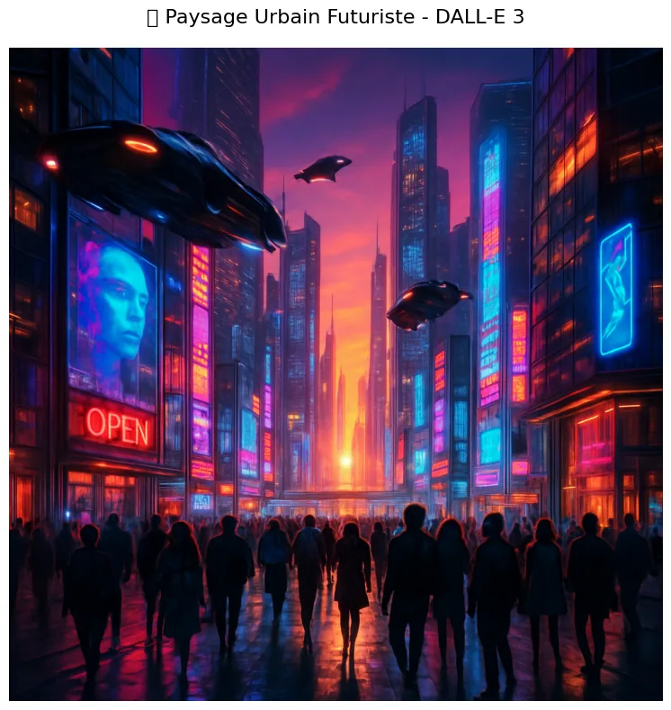
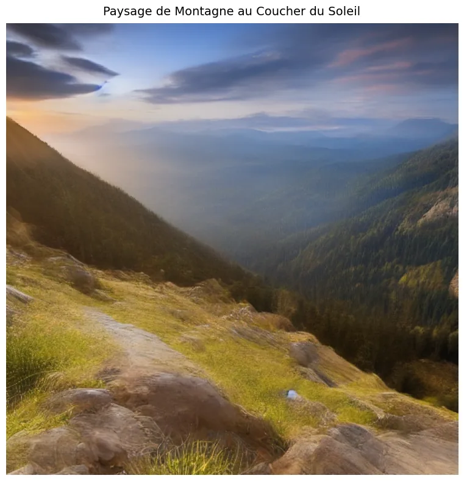
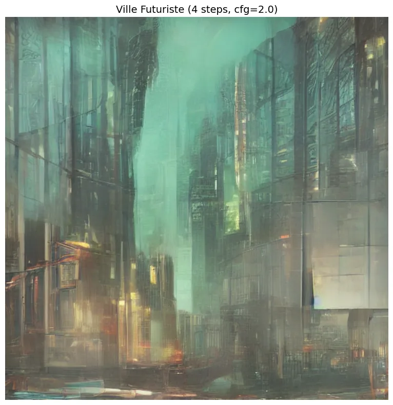
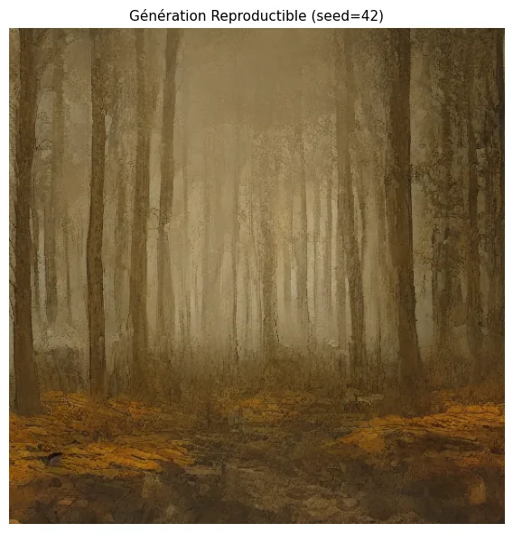
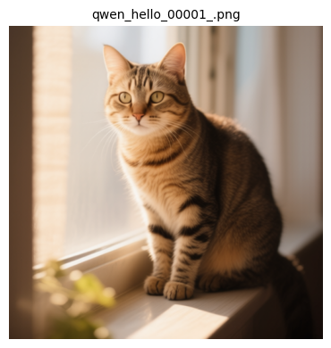
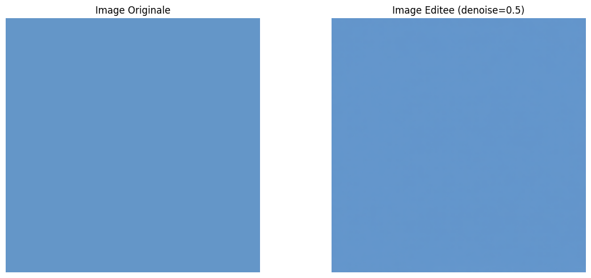

# 01-Foundation - Modèles de base

[← Documentation Image](../README.md) | [↑ ..](../README.md) | [→ Image Advanced](../02-Advanced/)

Ce module couvre les fondamentaux de la génération d'images par IA : modèles cloud, ComfyUI, et opérations de base.

**Dans le cadre du fil rouge contenu visuel éducatif** : avant de produire des visuels, il faut savoir générer une image à partir d'un texte. [01-1](01-1-OpenAI-DALL-E-3.ipynb) et [01-2](01-2-GPT-5-Image-Generation.ipynb) couvrent les API cloud (simples et immédiates). [01-4](01-4-Forge-SD-XL-Turbo.ipynb) et [01-5](01-5-Qwen-Image-Edit.ipynb) passent en local via ComfyUI pour le contrôle fin. [01-3](01-3-Basic-Image-Operations.ipynb) donne les bases de manipulation (PIL, OpenCV) utiles pour comprendre ce que font les modèles.

## Vue d'overview

| Statistique | Valeur |
|-------------|--------|
| Notebooks | 5 |
| Kernel | Python 3 |
| Durée estimée | ~3-4h |
| GPU requis | 0-29GB |

## Aperçu — les modèles de base en images

Ce module pose les fondamentaux : génération via API cloud (DALL-E 3), génération locale auto-hébergée (Stable Diffusion via Forge), et édition ciblée d'une image existante (Qwen Image Edit). La galerie ci-dessous présente des sorties réelles extraites des notebooks.

<table>
<tr>
<td align="center"><br/><sub><b>gpt-image-1 : paysage urbain futuriste</b> (<a href="01-1-OpenAI-DALL-E-3.ipynb">01-1</a>) — ville futuriste au coucher de soleil, voitures volantes, néons reflétés sur immeubles de verre, hologrammes (généré en 19s via API OpenAI, 1024×1024 requis puis redimensionné à 746×789 pour la galerie)</sub></td>
<td align="center"><br/><sub><b>SDXL Turbo : paysage de montagne au coucher de soleil</b> (<a href="01-4-Forge-SD-XL-Turbo.ipynb">01-4</a>) — « golden hour », photoréaliste (512×512 généré, redimensionné à 761×789 pour la galerie, premier exemple de génération locale via Forge)</sub></td>
</tr>
<tr>
<td align="center"><br/><sub><b>SDXL Turbo : ville cyberpunk nocturne</b> (<a href="01-4-Forge-SD-XL-Turbo.ipynb">01-4</a>) — « a futuristic city at night, neon lights, cyberpunk style », démonstration du mode 4-steps Turbo (qualité acceptable en ~18s)</sub></td>
<td align="center"><br/><sub><b>SDXL Turbo : forêt mystique (seed 42)</b> (<a href="01-4-Forge-SD-XL-Turbo.ipynb">01-4</a>) — « a mystical forest with glowing mushrooms », technique de génération reproductible (seed fixe 42 → même résultat garanti à chaque exécution)</sub></td>
</tr>
<tr>
<td align="center"><br/><sub><b>Qwen Image Edit : génération hello-world</b> (<a href="01-5-Qwen-Image-Edit.ipynb">01-5</a>) — premier workflow ComfyUI (Qwen Image Edit 2509), génération de test (~277s, ~29 GB VRAM) attestant que le service est joignable</sub></td>
<td align="center"><br/><sub><b>Qwen Image Edit : workflow image-to-image</b> (<a href="01-5-Qwen-Image-Edit.ipynb">01-5</a>) — architecture Phase 29 (VAE 16-ch + CLIP sd3 + UNET fp8 + ModelSamplingAuraFlow shift=3.0 + CFGNorm 1.0), édition img2img (~170s)</sub></td>
</tr>
</table>

Provenance et poids de chaque figure : [`assets/readme/MANIFEST.md`](assets/readme/MANIFEST.md).

## Notebooks

| # | Notebook | Contenu | Service | VRAM |
|---|----------|---------|---------|------ |
| 1 | [01-1-OpenAI-DALL-E-3](01-1-OpenAI-DALL-E-3.ipynb) | Génération avec gpt-image-1 (DALL-E 3 retiré) | OpenAI API | 0 |
| 2 | [01-2-GPT-5-Image-Generation](01-2-GPT-5-Image-Generation.ipynb) | Génération avec GPT-5 | OpenAI API | 0 |
| 3 | [01-3-Basic-Image-Operations](01-3-Basic-Image-Operations.ipynb) | Opérations de base | PIL/OpenCV | 0 |
| 4 | [01-4-Forge-SD-XL-Turbo](01-4-Forge-SD-XL-Turbo.ipynb) | Stable Diffusion XL Turbo | ComfyUI | Variable |
| 5 | [01-5-Qwen-Image-Edit](01-5-Qwen-Image-Edit.ipynb) | Introduction Qwen | ComfyUI | ~29GB |

## Prérequis

### API Keys
```bash
# Dans GenAI/.env
OPENAI_API_KEY=sk-...
COMFYUI_BEARER_TOKEN=...
```

### Docker Services (optionnel)
```bash
cd docker-configurations/services/comfyui-qwen
docker-compose up -d
```
Accès : http://localhost:8188

## Progression recommandée

1. **01-1-OpenAI-DALL-E-3** - Introduction rapide à la génération d'images
2. **01-2-GPT-5-Image-Generation** - Génération multimodale avec texte
3. **01-3-Basic-Image-Operations** - Manipulation d'images locale
4. **01-4-Forge-SD-XL-Turbo** - Modèle open source via ComfyUI
5. **01-5-Qwen-Image-Edit** - Édition d'images avancée

## Points clés

- **Cloud vs Local** : OpenAI (facile, API) vs ComfyUI (puissant, local)
- **Formats** : PNG, JPEG, WebP supportés
- **Qualité** : gpt-image-1 > GPT-5 > SD-XL Turbo
- **Flexibilité** : SD-XL Turbo plus paramétrable que les modèles cloud

## Ressources

- [Documentation Image principale](../README.md)
- [Guide ComfyUI](../../00-GenAI-Environment/README.md)