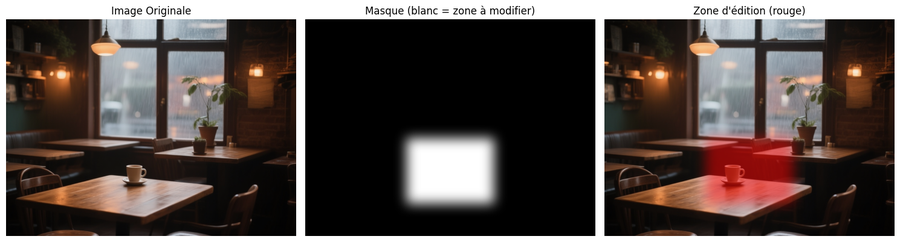
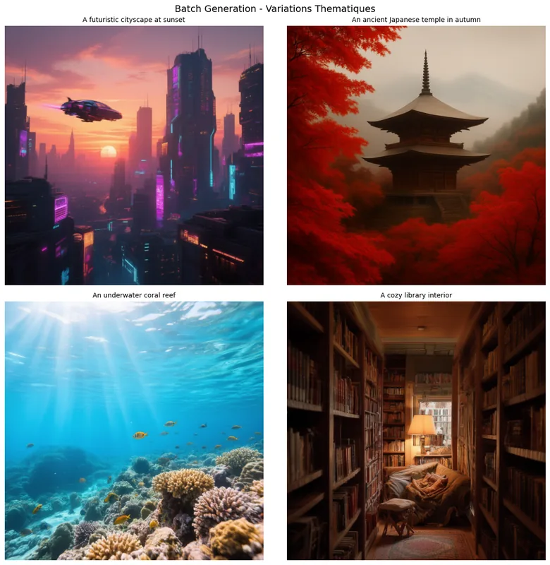
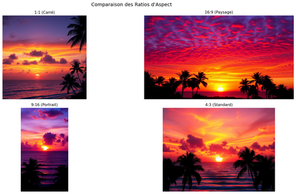
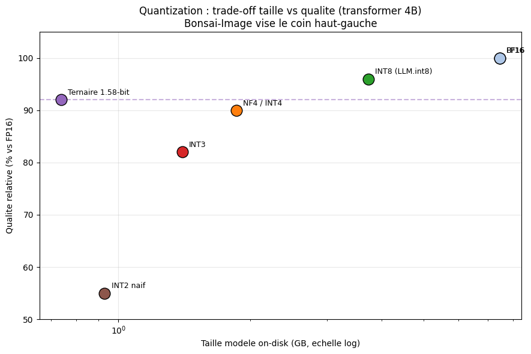

# 02-Advanced - Modèles avancés

[← Image Foundation](../01-Foundation/) | [↑ Image](../README.md) | [→ Image Orchestration](../03-Orchestration/)

Ce module explore les modèles de pointe : Qwen Image Edit avancé, FLUX, SD 3.5, Z-Image/Lumina, et la quantification extrême (Bonsai ternaire 1.58-bit).

**Dans le cadre du fil rouge contenu visuel éducatif** : un visuel de qualité demande des outils précis. [02-1](02-1-Qwen-Image-Edit-2509.ipynb) édite une image existante pour corriger ou enrichir un diagramme. [02-2](02-2-FLUX-1-Advanced-Generation.ipynb) génère des images haute qualité. [02-4](02-4-Z-Image-Lumina2.ipynb) offre une génération rapide pour le prototypage itératif. [02-5](02-5-Bonsai-Image-Ternary.ipynb) aborde la quantification ternaire 1.58-bit : un modèle 4B compressé à ~4 GB qui se génère en ~2s, parfait pour déployer la génération d'images sur du matériel modeste (formation, demos) sans sacrifier la qualité.

## Vue d'overview

| Statistique | Valeur |
|-------------|--------|
| Notebooks | 5 |
| Kernel | Python 3 |
| Durée estimée | ~5-7h |
| GPU requis | 5-29GB |

## Aperçu — les modèles avancés en images

Ce module explore quatre familles de modèles de pointe. La galerie ci-dessous présente des sorties réelles extraites des notebooks : édition ciblée (Qwen Image Edit), génération photoréaliste (FLUX-1), prototypage rapide (Z-Image/Lumina2) et quantification extrême pour matériel modeste (Bonsai ternaire 1,58-bit).

<table>
<tr>
<td align="center"><br/><sub>Qwen Image Edit (02-1)</sub></td>
<td align="center"><br/><sub>FLUX-1 génération (02-2)</sub></td>
</tr>
<tr>
<td align="center"><br/><sub>Qwen Edit variante (02-1)</sub></td>
<td align="center"><br/><sub>Z-Image/Lumina2 (02-4)</sub></td>
</tr>
<tr>
<td align="center"><br/><sub>FLUX-1 composition (02-2)</sub></td>
<td align="center"><br/><sub>Bonsai 1,58-bit (02-5)</sub></td>
</tr>
</table>

Provenance et poids de chaque figure : [`assets/readme/MANIFEST.md`](assets/readme/MANIFEST.md).

## Notebooks

| # | Notebook | Contenu | Service | VRAM |
|---|----------|---------|---------|------ |
| 1 | [02-1-Qwen-Image-Edit-2509](02-1-Qwen-Image-Edit-2509.ipynb) | Édition avancée Qwen | ComfyUI | ~29GB |
| 2 | [02-2-FLUX-1-Advanced-Generation](02-2-FLUX-1-Advanced-Generation.ipynb) | Génération FLUX | ComfyUI | Variable |
| 3 | [02-3-Stable-Diffusion-3-5](02-3-Stable-Diffusion-3-5.ipynb) | SD 3.5 | ComfyUI | Variable |
| 4 | [02-4-Z-Image-Lumina2](02-4-Z-Image-Lumina2.ipynb) | Z-Image/Lumina | ComfyUI | ~10GB |
| 5 | [02-5-Bonsai-Image-Ternary](02-5-Bonsai-Image-Ternary.ipynb) | Quantification ternaire 1.58-bit (BitNet), custom node | ComfyUI (custom node) | ~5GB |

## Prérequis

### Docker Services
```bash
cd docker-configurations/services/comfyui-qwen
docker-compose up -d
```
Accès : http://localhost:8188

### Dépendances
```bash
pip install -r requirements.txt
pip install -r requirements-comfyui.txt
```

## Progression recommandée

1. **02-1-Qwen-Image-Edit-2509** - Édition multimodale avancée
2. **02-2-FLUX-1-Advanced-Generation** - Génération de haute qualité
3. **02-3-Stable-Diffusion-3.5** - SD 3.5 pour contrôle fin
4. **02-4-Z-Image-Lumina2** - Modèle léger et rapide
5. **02-5-Bonsai-Image-Ternary** - Quantification extrême pour déploiement sobre en VRAM

## Technologies clés

### Qwen Image Edit 2509
- **Architecture** : Diffusion conditioned
- **Points forts** : Édition précise, texte dans l'image
- **VRAM** : ~29GB (VAE 16 canaux)

### FLUX 1
- **Architecture** : Transformer-based
- **Points forts** : Consistency, contrôle prompts
- **VRAM** : Variable

### Stable Diffusion 3.5
- **Architecture** : Diffusion classique
- **Points forts** : Écosystème mature, contrôle contrôles
- **VRAM** : Variable

### Z-Image/Lumina
- **Architecture** : LuminaDiffusers
- **Points forts** : Vitesse, qualité légère
- **VRAM** : ~10GB

### Bonsai-Image 4B (Ternary 1.58-bit)
- **Architecture** : Transformer 4B quantifié ternaire (BitNet b1.58), Gemlite INT2 + HQQ 4-bit text encoder
- **Points forts** : Modèle 4B compressé à ~4 GB (vs ~32 GB en FP16), génération ~2s en 4 steps, déploiable sur GPU d'entrée de gamme
- **VRAM** : ~5GB
- **Accès** : custom node ComfyUI `BonsaiTernaryNode` (modèle auto-téléchargé depuis HuggingFace au premier run)

## Comparatif

| Modèle | Spécialité | VRAM | Qualité | Vitesse |
|--------|------------|------|---------|--------|
| Qwen | Édition | ~29GB | Excellent | Lent |
| FLUX | Génération | Variable | Exceptionnel | Moyen |
| SD 3.5 | Polyvalent | Variable | Bon | Rapide |
| Z-Image | Léger | ~10GB | Bon | Très rapide |
| Bonsai | Quantifié (1.58-bit) | ~5GB | Bon | Très rapide |

## Ressources

- [Documentation Image principale](../README.md)
- [Guide ComfyUI](../../00-GenAI-Environment/README.md)
- [Architecture ComfyUI](../../../../docs/genai/genai-services.md)
