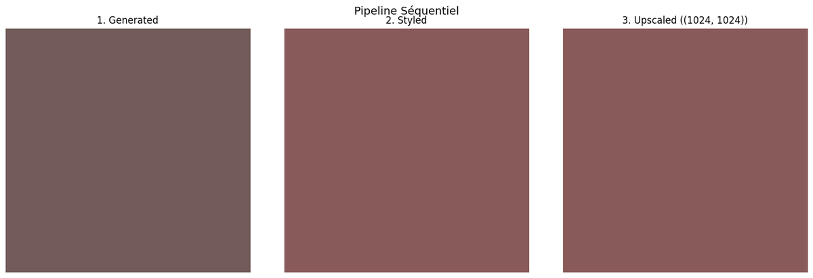
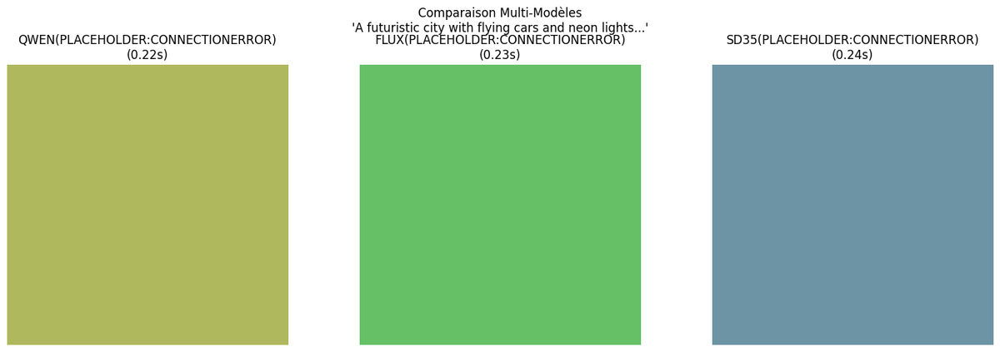
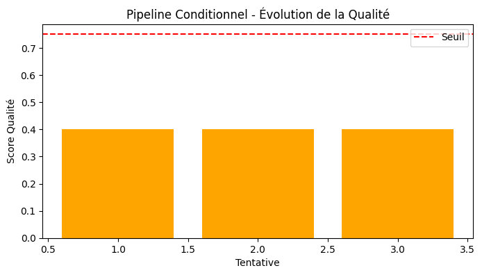
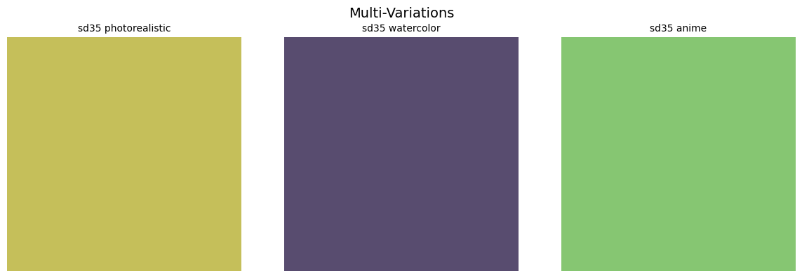

# 03-Orchestration - Multi-modèles & Workflows

[← Image Advanced](../02-Advanced/) | [↑ Image](../README.md) | [→ Image Applications](../04-Applications/)

Ce module couvre l'orchestration de plusieurs modèles, les workflows complexes, et l'optimisation de performance.

**Dans le cadre du fil rouge contenu visuel éducatif** : en production, un seul modèle ne suffit pas. [03-1](03-1-Multi-Model-Comparison.ipynb) compare les modèles pour choisir le meilleur selon le contexte. [03-2](03-2-Workflow-Orchestration.ipynb) assemble des pipelines (génération, édition, upscaling). [03-3](03-3-Performance-Optimization.ipynb) optimise les performances pour le déploiement.

## Vue d'overview

| Statistique | Valeur |
|-------------|--------|
| Notebooks | 3 |
| Kernel | Python 3 |
| Durée estimée | ~3-5h |
| GPU requis | Variable |

## Notebooks

| # | Notebook | Contenu | Service | VRAM |
|---|----------|---------|---------|------ |
| 1 | [03-1-Multi-Model-Comparison](03-1-Multi-Model-Comparison.ipynb) | Comparaison multi-modèles | Mixed | Variable |
| 2 | [03-2-Workflow-Orchestration](03-2-Workflow-Orchestration.ipynb) | Orchestration de workflows | ComfyUI | Variable |
| 3 | [03-3-Performance-Optimization](03-3-Performance-Optimization.ipynb) | Optimisation performance | ComfyUI | Variable |

## Prérequis

### Docker Services
```bash
cd docker-configurations/services/comfyui-qwen
docker-compose up -d
```
Accès : http://localhost:8188

### Dépendances
```bash
pip install -r requirements.txt
pip install -r requirements-comfyui.txt
```

## Progression recommandée

1. **03-1-Multi-Model-Comparison** - Comparatif des modèles pour choisir le bon
2. **03-2-Workflow-Orchestration** - Création de workflows complexes
3. **03-3-Performance-Optimization** - Optimisation des performances

## Concepts clés

### Multi-Model Comparison
- **Critères** : Qualité, vitesse, ressources, contrôle
- **Modèles comparés** : DALL-E 3, GPT-5, Qwen, FLUX, SD 3.5, Z-Image
- **Métriques** : PSNR, SSIM, temps de génération, coût

### Workflow Orchestration
- **Patterns** : Chaines de traitement, parallélisation, batch processing
- **Outils** : ComfyUI, Python asyncio, multiprocessing
- **Cas d'usage** : Production batch, pipelines automatisés

### Performance Optimization
- **Techniques** : Quantization, caching, hardware acceleration
- **Stratégies** : Progressive enhancement, early stopping
- **Monitoring** : Profiling, resource tracking

## Architecture

```
Input → Model Selection → Processing → Output
    ↓           ↓            ↓          ↓
  Benchmark   Router      Pipeline  Validation
```

## Galerie

Sorties réelles des notebooks : comparatif multi-modèles ([03-1](03-1-Multi-Model-Comparison.ipynb)) et étapes d'un workflow d'orchestration ([03-2](03-2-Workflow-Orchestration.ipynb)).

<table>
<tr>
<td align="center" colspan="2"><br/><sub>Comparatif multi-modèles sur un même prompt (DALL-E 3, GPT-5, Qwen, FLUX...) — <a href="03-1-Multi-Model-Comparison.ipynb">03-1</a></sub></td>
</tr>
<tr>
<td align="center"><br/><sub>Workflow d'orchestration — étape 1 (<a href="03-2-Workflow-Orchestration.ipynb">03-2</a>)</sub></td>
<td align="center"><br/><sub>Workflow d'orchestration — étape 2 (<a href="03-2-Workflow-Orchestration.ipynb">03-2</a>)</sub></td>
</tr>
<tr>
<td align="center"><br/><sub>Pipeline ComfyUI — nœuds de traitement (<a href="03-2-Workflow-Orchestration.ipynb">03-2</a>)</sub></td>
<td align="center"><br/><sub>Workflow — assemblage multi-étapes (<a href="03-2-Workflow-Orchestration.ipynb">03-2</a>)</sub></td>
</tr>
</table>

Provenance et poids de chaque figure : [`assets/readme/MANIFEST.md`](assets/readme/MANIFEST.md).

## Ressources

- [Documentation Image principale](../README.md)
- [Guide ComfyUI](../../00-GenAI-Environment/README.md)
- [Architecture ComfyUI](../../../../docs/genai/genai-services.md)
