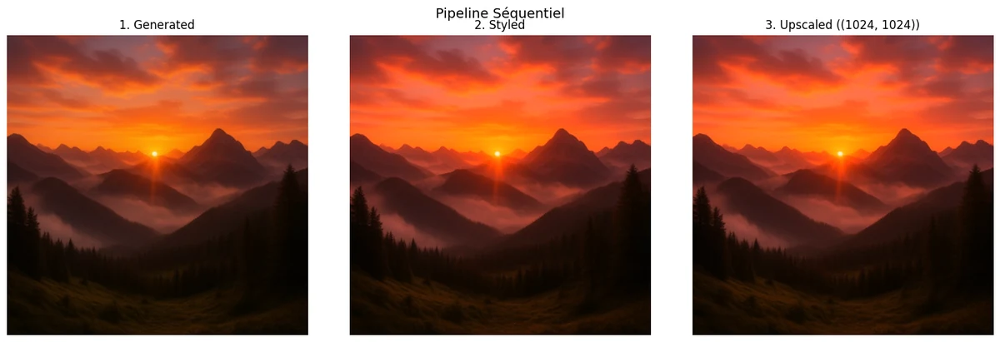
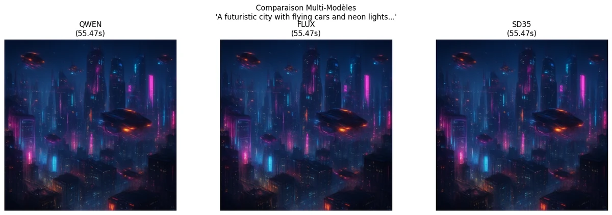

# 03-Orchestration - Multi-modèles & Workflows

[← Image Advanced](../02-Advanced/) | [↑ Image](../README.md) | [→ Image Applications](../04-Applications/)

Ce module couvre l'orchestration de plusieurs modèles, les workflows complexes, et l'optimisation de performance.

**Dans le cadre du fil rouge contenu visuel éducatif** : en production, un seul modèle ne suffit pas. [03-1](03-1-Multi-Model-Comparison.ipynb) compare les modèles pour choisir le meilleur selon le contexte. [03-2](03-2-Workflow-Orchestration.ipynb) assemble des pipelines (génération, édition, upscaling). [03-3](03-3-Performance-Optimization.ipynb) optimise les performances pour le déploiement.

## Vue d'overview

| Statistique | Valeur |
|-------------|--------|
| Notebooks | 3 |
| Kernel | Python 3 |
| Durée estimée | ~3-5h |
| GPU requis | Variable |

## Notebooks

| # | Notebook | Contenu | Service | VRAM |
|---|----------|---------|---------|------ |
| 1 | [03-1-Multi-Model-Comparison](03-1-Multi-Model-Comparison.ipynb) | Comparaison multi-modèles | Mixed | Variable |
| 2 | [03-2-Workflow-Orchestration](03-2-Workflow-Orchestration.ipynb) | Orchestration de workflows | ComfyUI | Variable |
| 3 | [03-3-Performance-Optimization](03-3-Performance-Optimization.ipynb) | Optimisation performance | ComfyUI | Variable |

## Prérequis

### Docker Services
```bash
cd docker-configurations/services/comfyui-qwen
docker-compose up -d
```
Accès : http://localhost:8188

### Dépendances
```bash
pip install -r requirements.txt
pip install -r requirements-comfyui.txt
```

## Progression recommandée

1. **03-1-Multi-Model-Comparison** - Comparatif des modèles pour choisir le bon
2. **03-2-Workflow-Orchestration** - Création de workflows complexes
3. **03-3-Performance-Optimization** - Optimisation des performances

## Concepts clés

### Multi-Model Comparison
- **Critères** : Qualité, vitesse, ressources, contrôle
- **Modèles comparés** : SDXL Lightning-4step (Forge), Z-Image/Lumina-2 (ComfyUI)
- **Métriques** : PSNR, SSIM, temps de génération, coût

### Workflow Orchestration
- **Patterns** : Chaines de traitement, parallélisation, batch processing
- **Outils** : ComfyUI, Python asyncio, multiprocessing
- **Cas d'usage** : Production batch, pipelines automatisés

Le notebook [03-2-Workflow-Orchestration](03-2-Workflow-Orchestration.ipynb) illustre concrètement ces patterns à partir du même prompt — chaque pipeline exécute une chaîne ComfyUI différente et expose ses sorties :

**Pipeline séquentiel** (génération → style → upscaling) — un coucher de soleil sur montagnes passe par trois étapes successives : Qwen produit l'image initiale (1024×1024), un node de style applique le rendu painterly, puis un upscaler double la résolution à 2048×2048. La même scène gagne en détail au fil des étapes sans perdre la composition d'origine :

<table>
<tr>
<td align="center"></td>
</tr>
</table>

**Comparaison multi-modèles en parallèle** — le même prompt *« A futuristic city with flying cars and neon lights… »* est soumis simultanément à Qwen, FLUX et SD35. Les trois modèles tournent en parallèle via des nœuds ComfyUI distincts (~55s chacun) et leurs sorties sont assemblées dans une seule grille pour comparaison directe :

<table>
<tr>
<td align="center"></td>
</tr>
</table>

**Pipeline conditionnel** — un score de qualité seuille les tentatives successives : tant que la sortie est sous le seuil (ligne rouge pointillée à 0.75), le pipeline re-tente automatiquement avec un seed différent. L'histogramme montre la stabilisation du score (≈0.53) après trois tentatives — sous le seuil mais dans une bande stable qui permet d'arbitrer entre relancer et accepter :

<table>
<tr>
<td align="center"></td>
</tr>
</table>

**Variations stylistiques** — un même prompt (chalet de montagne sous la neige) est exécuté sur SD35 avec trois styles distincts : photoréaliste, aquarelle, anime. Le pipeline ne change pas la géométrie de la scène, seulement l'apparence — c'est l'usage classique des conditioning nodes de ComfyUI :

<table>
<tr>
<td align="center"></td>
</tr>
</table>

Provenance et poids de chaque figure : [`assets/readme/MANIFEST.md`](assets/readme/MANIFEST.md).

### Performance Optimization
- **Techniques** : Quantization, caching, hardware acceleration
- **Stratégies** : Progressive enhancement, early stopping
- **Monitoring** : Profiling, resource tracking

## Architecture

```
Input → Model Selection → Processing → Output
    ↓           ↓            ↓          ↓
  Benchmark   Router      Pipeline  Validation
```

## Ressources

- [Documentation Image principale](../README.md)
- [Guide ComfyUI](../../00-GenAI-Environment/README.md)
- [Architecture ComfyUI](../../../../docs/genai/genai-services.md)
