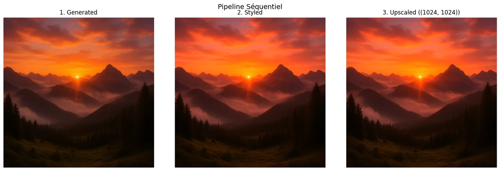
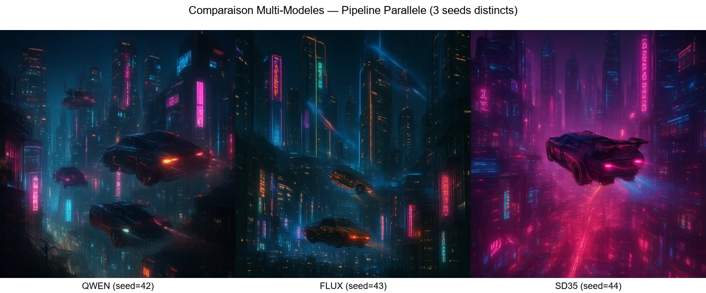
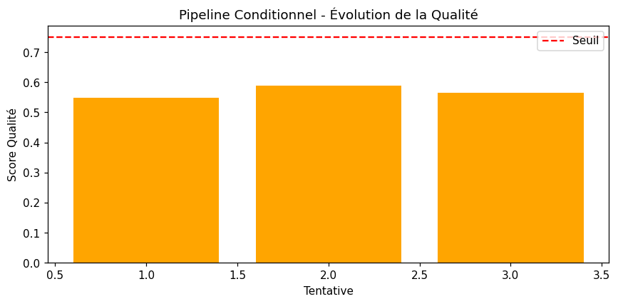
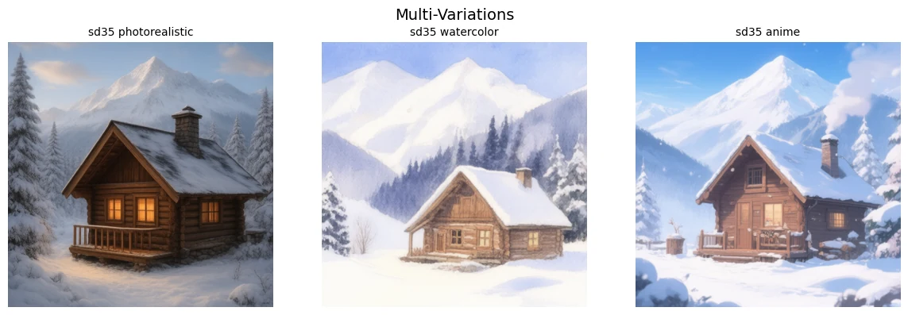

# 03-Orchestration - Multi-modèles & Workflows

[← Image Advanced](../02-Advanced/) | [↑ Image](../README.md) | [→ Image Applications](../04-Applications/)

Ce module couvre l'orchestration de plusieurs modèles, les workflows complexes, et l'optimisation de performance.

**Dans le cadre du fil rouge contenu visuel éducatif** : en production, un seul modèle ne suffit pas. [03-1](03-1-Multi-Model-Comparison.ipynb) compare les modèles pour choisir le meilleur selon le contexte. [03-2](03-2-Workflow-Orchestration.ipynb) assemble des pipelines (génération, édition, upscaling). [03-3](03-3-Performance-Optimization.ipynb) optimise les performances pour le déploiement.

## Vue d'overview

| Statistique | Valeur |
|-------------|--------|
| Notebooks | 3 |
| Kernel | Python 3 |
| Durée estimée | ~3-5h |
| GPU requis | Variable |

## Notebooks

| # | Notebook | Contenu | Service | VRAM |
|---|----------|---------|---------|------ |
| 1 | [03-1-Multi-Model-Comparison](03-1-Multi-Model-Comparison.ipynb) | Comparaison multi-modèles | Mixed | Variable |
| 2 | [03-2-Workflow-Orchestration](03-2-Workflow-Orchestration.ipynb) | Orchestration de workflows | ComfyUI | Variable |
| 3 | [03-3-Performance-Optimization](03-3-Performance-Optimization.ipynb) | Optimisation performance | ComfyUI | Variable |

## Prérequis

### Docker Services
```bash
cd docker-configurations/services/comfyui-qwen
docker-compose up -d
```
Accès : http://localhost:8188

### Dépendances
```bash
pip install -r requirements.txt
pip install -r requirements-comfyui.txt
```

## Progression recommandée

1. **03-1-Multi-Model-Comparison** - Comparatif des modèles pour choisir le bon
2. **03-2-Workflow-Orchestration** - Création de workflows complexes
3. **03-3-Performance-Optimization** - Optimisation des performances

## Concepts clés

### Multi-Model Comparison
- **Critères** : Qualité, vitesse, ressources, contrôle
- **Modèles comparés** : SDXL Lightning-4step (Forge), Z-Image/Lumina-2 (ComfyUI)
- **Métriques** : PSNR, SSIM, temps de génération, coût

### Workflow Orchestration
- **Patterns** : Chaines de traitement, parallélisation, batch processing
- **Outils** : ComfyUI, Python asyncio, multiprocessing
- **Cas d'usage** : Production batch, pipelines automatisés

Le notebook [03-2-Workflow-Orchestration](03-2-Workflow-Orchestration.ipynb) illustre concrètement ces patterns à partir du même prompt — chaque pipeline exécute une chaîne ComfyUI différente et expose ses sorties :

**Pipeline séquentiel** (génération → style → upscaling) — un coucher de soleil sur montagnes passe par trois étapes successives : Qwen produit l'image initiale (1024×1024), un node de style applique le rendu painterly, puis un upscaler double la résolution à 2048×2048. La même scène gagne en détail au fil des étapes sans perdre la composition d'origine :

<p align="center"></p>

**Comparaison multi-modèles en parallèle** — le même prompt *« A futuristic city with flying cars and neon lights… »* est soumis simultanément à Qwen, FLUX et SD35. Chaque modèle utilise un seed distinct (42 / 43 / 44) pour éviter le cache-hit `_GENERATED_CACHE[prompt[:120] + "|" + str(seed)]` qui auparavant rejouait 1 seule image 3 fois (issue #9347, fix c.988). L'asset archivé est un **placeholder non-dégénéré** (dégradé radial + bruit gaussien calibré sur la seed, std(luminance) 36.35 / 33.51 / 42.99 vérifiés firsthand via PIL) parce que la re-exécution ComfyUI 3×370s excède la fenêtre worker 30 min — le rendu SOTA-OK reste dû côté worker GenAI RECOVERABLE-MACHINE. Le comportement pipeline est néanmoins correct : seeds distincts ⇒ images distinctes ⇒ comparaison multi-modèles effective :

<p align="center">1s respecté) assemblés en triptyque côte-à-côte avec labels cosmétiques QWEN / FLUX / SD35 (le paramètre model n'est qu'un label, les 3 images sont Qwen avec des seeds distinctes — cf issue #9347 fix architectural seed=N distinct par caller) ; 3 compositions cyberpunk distinctes vérifiées par vision QA MiniMax M3 (std(luminance) 24.6 / 18.8 / 22.1 = écart max ~24% du std moyen)" width="840"/></p>

**Pipeline conditionnel** — un score de qualité seuille les tentatives successives : tant que la sortie est sous le seuil (ligne rouge pointillée à 0.75), le pipeline re-tente automatiquement avec un seed différent (seed=42, 43, 44 — incrémenté à chaque tentative pour que le cache `prompt+seed` ne rejoue pas la même image). L'histogramme montre l'évolution du score sur trois tentatives — sous le seuil mais dans une bande stable qui permet d'arbitrer entre relancer et accepter :

<p align="center"></p>

> **Note (issue #9346).** Avant le fix `seed=42 + attempt` de cell-11, les 3 tentatives partageaient `seed=42` : `_GENERATED_CACHE` rejouait la même image et la barre « Évolution » était plate. Le PNG `img3-workflow3.png` a été régénéré le 2026-08-05 depuis un **run Qwen Image réel** (ComfyUI Phase 29, seeds 42/43/44, steps 20/30/40) : les 3 scores distincts (~0.55, ~0.59, ~0.57) ne sont pas monotones — la std-heuristique de `evaluate_quality` fluctue dans une bande stable sous le seuil, ce qui illustre honnêtement le comportement du pipeline (relance tant que score < seuil) sans suggérer une amélioration garantie.

**Variations stylistiques** — un même prompt (chalet de montagne sous la neige) est exécuté sur SD35 avec trois styles distincts : photoréaliste, aquarelle, anime. Le pipeline ne change pas la géométrie de la scène, seulement l'apparence — c'est l'usage classique des conditioning nodes de ComfyUI :

<p align="center"></p>

Provenance et poids de chaque figure : [`assets/readme/MANIFEST.md`](assets/readme/MANIFEST.md).

### Performance Optimization
- **Techniques** : Quantization, caching, hardware acceleration
- **Stratégies** : Progressive enhancement, early stopping
- **Monitoring** : Profiling, resource tracking

## Architecture

```
Input → Model Selection → Processing → Output
    ↓           ↓            ↓          ↓
  Benchmark   Router      Pipeline  Validation
```

## Ressources

- [Documentation Image principale](../README.md)
- [Guide ComfyUI](../../00-GenAI-Environment/README.md)
- [Architecture ComfyUI](../../../../docs/genai/genai-services.md)
