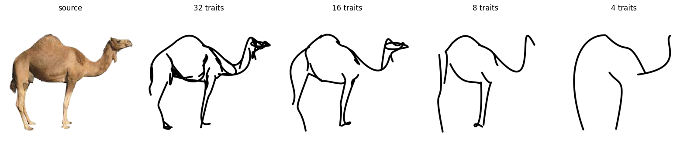
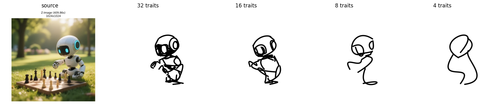
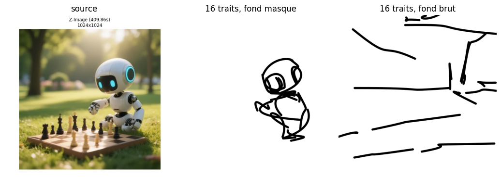
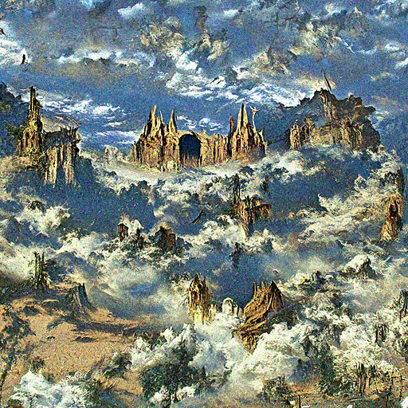
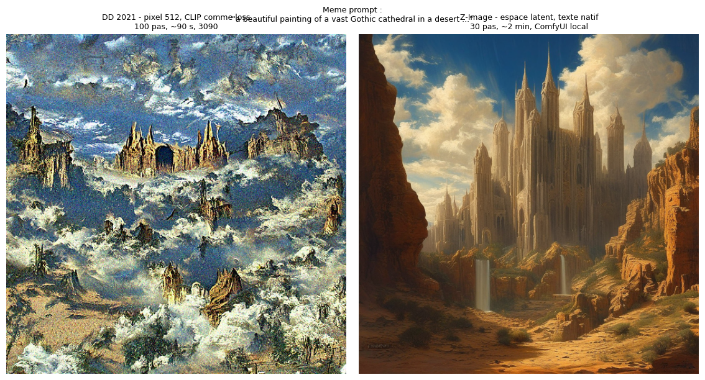

# 05-History — Racines pré-Stable-Diffusion

[← Image Applications](../04-Applications/) | [↑ Image](../README.md)

Notebooks rétrospectifs : les outils d'avant Stable Diffusion (2021-2022) qui ont établi les paradigmes encore à l'œuvre aujourd'hui — CLIP comme fonction de perte sémantique, guidance par classifieur, diffusion guidée avant l'ère des modèles ouverts massifs.

## Notebooks

| # | Notebook | Contenu | Publication |
|---|----------|---------|-------------|
| 2 | [05-2-CLIPasso-Semantic-Sketching](05-2-CLIPasso-Semantic-Sketching.ipynb) | Le sketching sémantique : abstraction contrôlée par le nombre de traits (grilles 32/16/8/4 — chameau du papier + robot masqué U²-Net), coût du fond non extrait (A/B masqué/brut), contraste sémantique vs signal (Canny) | Vinker et al., SIGGRAPH 2022 ([arXiv:2202.05822](https://arxiv.org/abs/2202.05822)) |
| 1 | [05-1-DiscoDiffusion-CLIP-Guided-Diffusion](05-1-DiscoDiffusion-CLIP-Guided-Diffusion.ipynb) | La CLIP-guided diffusion pré-Stable-Diffusion : UNet KL-openai 512 pixel-space + CLIP ViT-L/14 comme fonction de perte (cutouts, distance sphérique), conditionnement de Song et al., grille `clip_gs` × `sat_scale`, même prompt contre Z-Image (ce que l'espace latent a changé) | Crowson 2021 ; Dhariwal & Nichol 2021 ([arXiv:2105.05233](https://arxiv.org/abs/2105.05233)) ; Radford et al. 2021 ([arXiv:2103.00020](https://arxiv.org/abs/2103.00020)) |

*Grille d'abstraction du notebook 05-2 : à mesure que le budget de traits baisse, l'esquisse abandonne le signal (contours) et ne conserve que la sémantique (l'« idée » du chameau) — sortie des runs officiels CLIPasso sur GPU.*

*Même grille sur une seconde cible — le robot généré de la série, fond retiré par U²-Net avant optimisation (`mask_object=1`) : chaque trait travaille pour le sujet.*

*A/B du coût du fond : à budget égal (16 traits, mêmes graines), l'esquisse masquée gagne +0.062 de similarité CLIP (0.652 contre 0.590) — sans extraction du fond l'esquisse fonctionne, mais une fraction du budget part dans le décor.*

*Le look DD rejoué du notebook 05-1 : UNet de diffusion en espace pixel (checkpoint d'époque `diffusion.pt`, sha256 vérifié contre le manifeste DD v5.7) guidé par la distance sphérique CLIP sur cutouts — 100 pas DDIM, ~90 s sur RTX 3090, là où un rendu Colab 2021 demandait 1-3 h.*

*Même prompt, même graine : la CLIP-guided diffusion d'époque (gauche) vise la reconnaissabilité globale — compositions monumentales, textures d'estampe — quand Z-Image (droite), entraînée avec alignement texte-image natif, suit le prompt mot à mot.*

## Prérequis

- Environnement Python du cours (torch CUDA) ;
- Outils locaux hors repo (voir la cellule d'installation du notebook) : clone du [code officiel CLIPasso](https://github.com/yael-vinker/CLIPasso) (MIT) + compilation MSVC de [diffvg](https://github.com/BachiLi/diffvg) — les adaptations d'exécution sont documentées dans le notebook.
