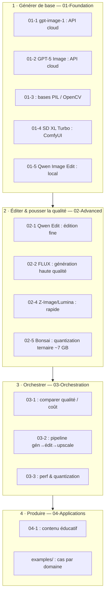

# Image - Génération d'Images par IA

[← Documentation GenAI](../README.md) | [↑ ..](../README.md) | [→ Docker Management](../00-GenAI-Environment/00-2-Docker-Services-Management.ipynb)

La génération d'images par IA est la deuxième modalité générative la plus accessible après le texte. Elle couvre un spectre large : génération from scratch (DALL-E, FLUX), édition d'images existantes (Qwen Image Edit), upscaling (Real-ESRGAN), et orchestration de workflows multi-modèles via ComfyUI. La progression va du prompt cloud one-shot au workflow ComfyUI multi-modèles orienté production.

## Fil rouge : construire un générateur de contenu visuel éducatif

L'objectif fil rouge de cette série est de construire un système capable de produire des visuels pédagogiques de qualité : diagrammes, illustrations conceptuelles, et images d'identité pour des supports de cours. Chaque niveau apporte une brique supplémentaire : génération simple via API cloud (niveau 1), modèles avancés et édition fine (niveau 2), comparaison et orchestration multi-modèles (niveau 3), workflows de production (niveau 4), et cas d'usage concrets par domaine (examples).

## Acquis d'apprentissage

À l'issue de la série, l'apprenant sait :

- **Choisir la bonne modalité** : API cloud (gpt-image-1, GPT-5 Image) vs ComfyUI auto-hébergé (SD XL, FLUX, Qwen) selon le besoin (contrôle, coût, débit, données sensibles).
- **Manipuler une image en code** : PIL/OpenCV pour redimensionnement, masques, compositing, conversion VAE latents <-> pixels.
- **Concevoir un workflow ComfyUI** : graphe de nœuds (Sampler, VAE, ConditioningCombine, ModelSampling), import/export JSON, batching et seeds reproductibles.
- **Éditer plutôt que régénérer** : Qwen Image Edit, ControlNet, inpainting (zones à régénérer dans un visuel existant) — moins coûteux et plus contrôlable que repartir de zéro.
- **Composer plusieurs modèles** : pipeline base + LoRA style + upscaler + post-processing pour atteindre une qualité "supports de cours".
- **Opérationnaliser** : gestion VRAM (quantizations Nunchaku INT4 / FP8), file d'attente ComfyUI, monitoring GPU, déploiement derrière une API.

La structure détaillée (notebooks par niveau, contenu, services utilisés) est listée plus bas. Le décompte canonique réside dans `CATALOG-STATUS.json` du dépôt.

## Structure

```
Image/
├── 01-Foundation/     # Modèles de base
├── 02-Advanced/       # Modèles avancés
├── 03-Orchestration/  # Multi-modèles
├── 04-Applications/   # Production
└── examples/          # Cas d'usage
```

## Progression par niveau

### 01-Foundation - Modèles de base

Avant de produire des visuels pédagogiques, il faut maîtriser les outils de génération. Ce niveau couvre les deux approches : API cloud (gpt-image-1, GPT-5) pour la simplicité, et modèles locaux via ComfyUI (SD XL Turbo, Qwen) pour le contrôle fin. [01-3](01-Foundation/01-3-Basic-Image-Operations.ipynb) donne les bases de manipulation d'image (PIL, OpenCV) nécessaires pour comprendre ce que font les modèles.

| Notebook | Contenu | Service |
|----------|---------|---------|
| [01-1-OpenAI-DALL-E-3](01-Foundation/01-1-OpenAI-DALL-E-3.ipynb) | Génération avec gpt-image-1 (DALL-E 3 retiré) | OpenAI API |
| [01-2-GPT-5-Image-Generation](01-Foundation/01-2-GPT-5-Image-Generation.ipynb) | Génération avec GPT-5 | OpenAI API |
| [01-3-Basic-Image-Operations](01-Foundation/01-3-Basic-Image-Operations.ipynb) | Opérations de base | PIL/OpenCV |
| [01-4-Forge-SD-XL-Turbo](01-Foundation/01-4-Forge-SD-XL-Turbo.ipynb) | Stable Diffusion XL Turbo | ComfyUI |
| [01-5-Qwen-Image-Edit](01-Foundation/01-5-Qwen-Image-Edit.ipynb) | Introduction Qwen | ComfyUI |

[README 01-Foundation](01-Foundation/README.md)

### 02-Advanced - Modèles avancés

Un visuel éducatif de qualité demande des outils plus précis : édition d'images existantes (Qwen), génération haute qualité (FLUX), ou modèles légers et rapides (Z-Image/Lumina). Ce niveau explore les modèles de pointe et leurs compromis entre qualité, vitesse et ressources GPU. Le notebook [02-5](02-Advanced/02-5-Bonsai-Image-Ternary.ipynb) pousse l'optimisation à l'extrême avec Bonsai-Image (FLUX.2 Klein 4B en quantization ternaire 1.58-bit), qui ne consomme que ~6.8 GiB de VRAM à 1024x1024.

| Notebook | Contenu | Service |
|----------|---------|---------|
| [02-1-Qwen-Image-Edit-2509](02-Advanced/02-1-Qwen-Image-Edit-2509.ipynb) | Édition avancée Qwen | ComfyUI |
| [02-2-FLUX-1-Advanced-Generation](02-Advanced/02-2-FLUX-1-Advanced-Generation.ipynb) | Génération FLUX | ComfyUI |
| [02-3-Stable-Diffusion-3-5](02-Advanced/02-3-Stable-Diffusion-3-5.ipynb) | SD 3.5 | ComfyUI |
| [02-4-Z-Image-Lumina2](02-Advanced/02-4-Z-Image-Lumina2.ipynb) | Z-Image/Lumina | ComfyUI |
| [02-5-Bonsai-Image-Ternary](02-Advanced/02-5-Bonsai-Image-Ternary.ipynb) | Bonsai-Image 4B, quantization ternaire 1.58-bit | ComfyUI |

[README 02-Advanced](02-Advanced/README.md)

### 03-Orchestration - Multi-modèles

En production, un seul modèle ne suffit pas toujours. Ce niveau compare les modèles entre eux pour choisir le bon selon le contexte, orchestre des pipelines de traitement (génération puis édition puis upscaling), et optimise les performances pour le déploiement.

| Notebook | Contenu |
|----------|---------|
| [03-1-Multi-Model-Comparison](03-Orchestration/03-1-Multi-Model-Comparison.ipynb) | Comparaison multi-modèles |
| [03-2-Workflow-Orchestration](03-Orchestration/03-2-Workflow-Orchestration.ipynb) | Orchestration de workflows |
| [03-3-Performance-Optimization](03-Orchestration/03-3-Performance-Optimization.ipynb) | Optimisation performance |

[README 03-Orchestration](03-Orchestration/README.md)

### 04-Applications - Production

Ce niveau met en œuvre les workflows complets : génération automatisée de contenu éducatif, pipelines créatifs, intégration en production, et un exemple concret de conversion d'images en patrons de point de croix.

| Notebook | Contenu |
|----------|---------|
| [04-1-Educational-Content-Generation](04-Applications/04-1-Educational-Content-Generation.ipynb) | Contenu éducatif |
| [04-2-Creative-Workflows](04-Applications/04-2-Creative-Workflows.ipynb) | Workflows créatifs |
| [04-3-Production-Integration](04-Applications/04-3-Production-Integration.ipynb) | Intégration production |
| [04-4-Cross-Stitch-Pattern-Maker-Legacy](04-Applications/04-4-Cross-Stitch-Pattern-Maker-Legacy.ipynb) | Point de croix (legacy) |

[README 04-Applications](04-Applications/README.md)

### examples/ - Cas d'usage

Applications directes par domaine : histoire-géographie (cartes, reconstitutions), littérature (illustrations de textes), et sciences (diagrammes, schémas techniques). Ces notebooks montrent comment adapter les techniques des niveaux précédents à des besoins concrets.

| Notebook | Domaine |
|----------|---------|
| [history-geography](examples/history-geography.ipynb) | Histoire-Géographie |
| [literature-visual](examples/literature-visual.ipynb) | Littérature |
| [science-diagrams](examples/science-diagrams.ipynb) | Diagrammes scientifiques |

## Technologies

| Technologie | Notebooks | Prérequis |
|-------------|-----------|-----------|
| **OpenAI gpt-image-1** | 01-1, 01-2 | `OPENAI_API_KEY` |
| **ComfyUI + Qwen** | 01-4, 01-5, 02-1 | Docker, ~29GB VRAM |
| **ComfyUI + FLUX** | 02-2 | Docker GPU |
| **ComfyUI + SD 3.5** | 02-3 | Docker GPU |
| **Z-Image/Lumina** | 02-4 | Docker, ~10GB VRAM |
| **Bonsai-Image (ternaire)** | 02-5 | ComfyUI, ~7 GB VRAM |

## Prérequis

### API Keys

```bash
# Dans GenAI/.env
OPENAI_API_KEY=sk-...
COMFYUI_BEARER_TOKEN=...
```

### Docker Services

```bash
cd docker-configurations/services/comfyui-qwen
docker-compose up -d
```

Accès : http://localhost:8188

## Parcours recommandé

```
01-Foundation (bases)
    |
02-Advanced (modèles spécifiques)
    |
03-Orchestration (comparaison, workflows)
    |
04-Applications (production)
```

| Objectif | Notebooks |
|----------|-----------|
| Découverte rapide | 01-1, 01-3 |
| Génération avancée | 01-1 à 02-5 |
| Production | Tous + 03 + 04 |

## Recette : construire un générateur de contenu visuel éducatif

Le fil rouge de cette série est la création d'un système de visuels pédagogiques. Voici comment les niveaux s'articulent :

1. **01-Foundation** (génération de base) : [01-1](01-Foundation/01-1-OpenAI-DALL-E-3.ipynb) et [01-2](01-Foundation/01-2-GPT-5-Image-Generation.ipynb) couvrent la génération via API cloud. [01-4](01-Foundation/01-4-Forge-SD-XL-Turbo.ipynb) et [01-5](01-Foundation/01-5-Qwen-Image-Edit.ipynb) introduisent les modèles locaux. À la fin, vous savez générer une image à partir d'un texte.

2. **02-Advanced** (édition et qualité) : [02-1](02-Advanced/02-1-Qwen-Image-Edit-2509.ipynb) permet d'éditer une image existante pour corriger ou enrichir un visuel. [02-4](02-Advanced/02-4-Z-Image-Lumina2.ipynb) offre une génération rapide pour le prototypage. [02-2](02-Advanced/02-2-FLUX-1-Advanced-Generation.ipynb) pousse la qualité plus loin. [02-5](02-Advanced/02-5-Bonsai-Image-Ternary.ipynb) montre la quantization extrême (ternaire 1.58-bit) pour faire tenir un modèle 4B dans ~7 GB de VRAM.

3. **03-Orchestration** (comparaison et pipelines) : [03-1](03-Orchestration/03-1-Multi-Model-Comparison.ipynb) compare les modèles pour choisir le meilleur rapport qualité/coût. [03-2](03-Orchestration/03-2-Workflow-Orchestration.ipynb) assemble un pipeline de génération complet.

4. **04-Applications** (production) : [04-1](04-Applications/04-1-Educational-Content-Generation.ipynb) applique le pipeline au contenu éducatif. Les notebooks [examples/](examples/) montrent des cas d'usage par domaine (histoire, sciences, littérature).

Le schéma ci-dessous résume comment les niveaux s'articulent pour construire un générateur de visuels pédagogiques : du prompt cloud one-shot (niveau 1) au workflow ComfyUI multi-modèles orienté production (niveau 4), en passant par l'édition fine (niveau 2) et l'orchestration (niveau 3).



## FAQ

### gpt-image-1 : qualité et suivi du prompt

gpt-image-1 (notebook [01-1](01-Foundation/01-1-OpenAI-DALL-E-3.ipynb)) offre une bonne qualité par défaut mais peut simplifier les détails complexes. Mitigation :

- Structurer le prompt : `style [photographiste/illustration/3D render], sujet [précis], contexte [arrière-plan], éclairage [type]`.
- Utiliser `size="1536x1024"` pour les compositions larges (gpt-image-1 accepte `1024x1024` / `1024x1536` / `1536x1024` / `auto`), `1024x1024` pour les portraits.
- GPT-5 Image (notebook [01-2](01-Foundation/01-2-GPT-5-Image-Generation.ipynb)) offre un meilleur suivi des instructions détaillées que gpt-image-1.
- Pour un contrôle total, passer en ComfyUI local (niveau 02+).

### ComfyUI retourne une erreur 401 ou 502

Les services ComfyUI (ports 8188, 8001, 1111, 17861) tournent dans des conteneurs Docker avec authentification bearer token. Si erreur 401 ou 502 :

```bash
# Vérifier les conteneurs actifs
docker ps | grep comfyui

# Redémarrer le service
cd docker-configurations/services/comfyui-qwen && docker-compose restart

# Vérifier le bearer token (drift bcrypt entre container et .env)
cat MyIA.AI.Notebooks/GenAI/.env | grep COMFYUI_BEARER_TOKEN
```

Les notebooks ont une graceful degradation : sans token, ils basculent vers les API cloud quand c'est possible.

### Qwen Image Edit ne modifie pas l'image correctement

Le modèle Qwen Image Edit (notebooks [01-5](01-Foundation/01-5-Qwen-Image-Edit.ipynb) et [02-1](02-Advanced/02-1-Qwen-Image-Edit-2509.ipynb)) est sensible au format du prompt d'édition. Points critiques :

- L'image source doit être en PNG ou JPEG, résolution <= 1024x1024 pour des résultats optimaux.
- Le prompt d'édition doit être spécifique : "remplacer le texte 'X' par 'Y'" plutôt que "changer le texte".
- L'architecture Qwen utilise un VAE 16 canaux (non standard SDXL), un scheduler `beta`, et CFG 1.0 — ces paramètres sont pré-configurés dans les notebooks, ne pas les modifier sans test.

### GPU Out of Memory pendant un notebook ComfyUI

Les modèles image sont gourmands en VRAM. Allocation typique :

| Modèle | VRAM requise | Notebooks |
|--------|-------------|-----------|
| Qwen Image Edit | ~29 GB | 01-5, 02-1 |
| FLUX.1 | ~24 GB | 02-2 |
| SD XL Turbo | ~10 GB | 01-4 |
| SD 3.5 | ~12 GB | 02-3 |
| Z-Image/Lumina | ~10 GB | 02-4 |

Stratégies si OOM :

- Utiliser les quantizations Nunchaku INT4 ou FP8 pour réduire la VRAM (notebook [03-3](03-Orchestration/03-3-Performance-Optimization.ipynb)).
- Fermer les autres notebooks GPU avant une génération lourde.
- Vérifier avec `nvidia-smi` et libérer avec `torch.cuda.empty_cache()`.

### Quelle différence entre gpt-image-1, GPT-5 Image et ComfyUI ?

| Critère | gpt-image-1 | GPT-5 Image | ComfyUI (SD/FLUX/Qwen) |
|---------|-------------|-------------|------------------------|
| **Coût** | Usage-based (API) | Variable (API) | Gratuit (local) |
| **Contrôle** | Prompt seul | Prompt + instructions | Nœuds, masques, seeds |
| **Édition** | Oui (native) | Oui (native) | Oui (inpainting, ControlNet) |
| **Qualité** | Excellente | Excellente | Excellente (avec réglages) |
| **VRAM** | 0 (API) | 0 (API) | 10-29 GB |

Pour du prototypage rapide, gpt-image-1 ou GPT-5 Image suffisent. Pour un contrôle fin, une production répétitive, ou des données sensibles, ComfyUI est indispensable.

### Comment créer un workflow ComfyUI reproductible ?

Un workflow ComfyUI est un graphe JSON de nœuds connectés. Pour le rendre reproductible :

1. Exporter le workflow depuis l'interface ComfyUI (bouton "Save").
2. Utiliser la même seed (`noise_seed` dans le nœud KSampler) pour reproduire exactement la même image.
3. Verrouiller les versions de modèles (checkpoint, VAE, CLIP) — un modèle mis à jour peut changer les résultats.
4. Le notebook [03-2](03-Orchestration/03-2-Workflow-Orchestration.ipynb) montre comment charger un workflow JSON et l'exécuter programmatiquement via l'API ComfyUI.

## Licence

Voir la licence du repository principal.
