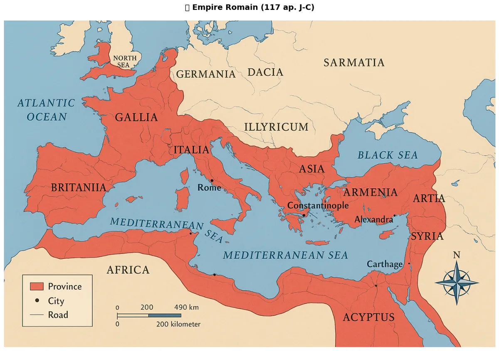
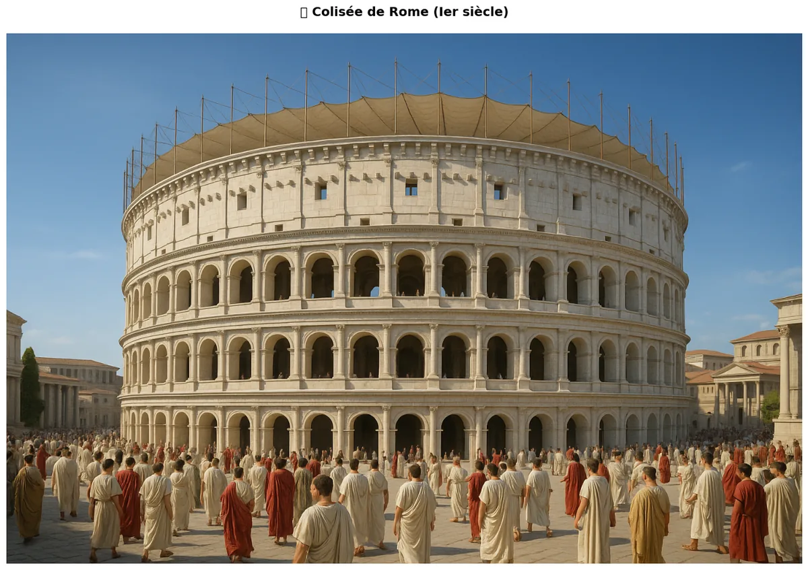
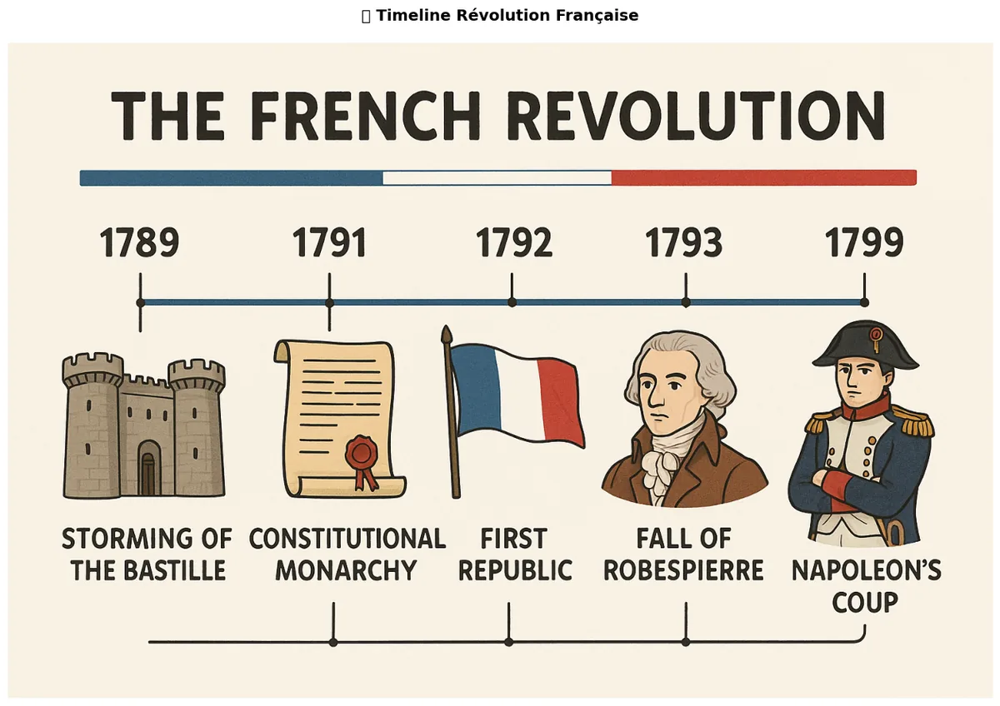
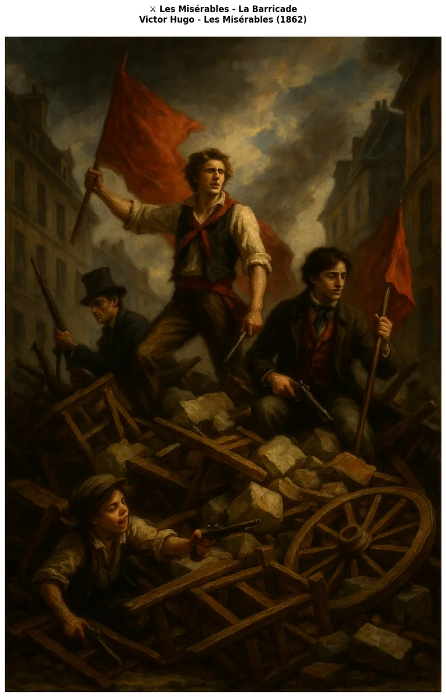
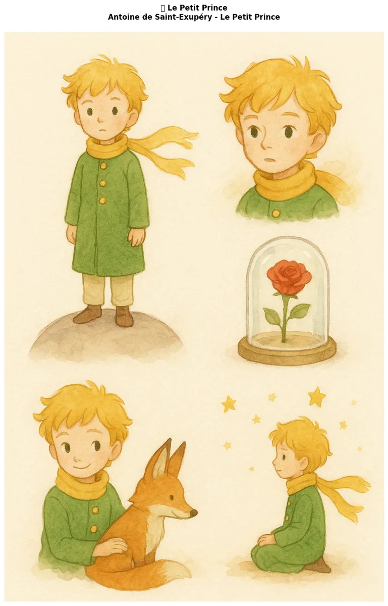
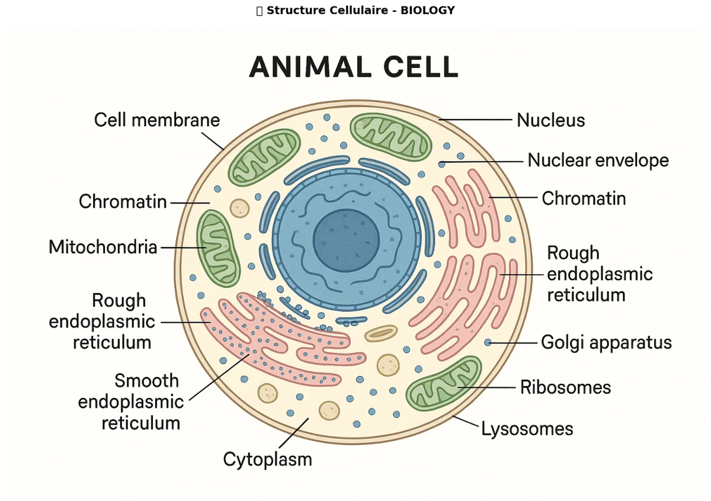

# examples - Cas d'usage spécifiques

[← Image Applications](../04-Applications/) | [↑ Image](../README.md) | [→ Audio](../../Audio/README.md)

Exemples concrets d'utilisation des notebooks GenAI Image dans différents domaines éducatifs et professionnels.

**Dans le cadre du fil rouge contenu visuel educatif** : ces notebooks montrent l'application directe des techniques des niveaux precedents. [science-diagrams](science-diagrams.ipynb) genere des diagrammes et schemas techniques pour les cours de sciences. [history-geography](history-geography.ipynb) cree des cartes et reconstitutions historiques. [literature-visual](literature-visual.ipynb) illustre des textes litteraires.

## Vue d'overview

| Statistique | Valeur |
|-------------|--------|
| Notebooks | 3 |
| Domaines | 3 |
| Durée totale | ~2-3h |
| Difficulté | Intermédiaire |

## Notebooks par domaine

| Domaine | Notebook | Description |
|---------|---------|-------------|
| **Histoire-Geographie** | [history-geography](history-geography.ipynb) | Création de cartes historiques, reconstitutions, illustrations éducatives |
| **Littérature** | [literature-visual](literature-visual.ipynb) | Illustrations de textes, couvertures de livres, visuels narratifs |
| **Science** | [science-diagrams](science-diagrams.ipynb) | Diagrammes scientifiques, schémas techniques, visualisations complexes |

## Exemples concrets

### Histoire-Geography
- **Reconstitutions historiques** : Génération d'images de scènes historiques précises
- **Cartes interactives** : Création de cartes avec annotations et légendes
- **Vestiges archéologiques** : Reconstruction de sites historiques à partir de descriptions

### Literature
- **Illustrations de romans** : Conversion de passages descriptifs en images
- **Poésie visuelle** : Création d'artistes en poésie et textes littéraires
- **Couvertures de livres** : Design de couvertures attrayantes pour différents genres

### Science
- **Diagrammes biologiques** : Représentations de cellules, organes, systèmes
- **Formules mathématiques** : Visualisation de concepts abstraits
- **Expériences scientifiques** : Illustrations de processus et phénomènes

## Workflow typique

1. **Brief** : Définir le besoin et le style visuel
2. **Sélection du modèle** : Choisir le modèle le plus adapté
3. **Génération** : Créer les images avec paramètres précis
4. **Post-processing** : Amélioration et édition si nécessaire
5. **Intégration** : Utilisation dans le support final

## Galerie

Sorties réelles des notebooks d'exemple (générées par gpt-image-1), couvrant les trois domaines éducatifs : [history-geography](history-geography.ipynb) (carte de l'Empire romain, reconstruction du Colisée, timeline de la Révolution française), [literature-visual](literature-visual.ipynb) (barricade des Misérables, character sheet de Jean Valjean) et [science-diagrams](science-diagrams.ipynb) (coupe de cellule animale).

<table>
<tr>
<td align="center"> <b>Empire romain (117 ap. J.-C.)</b> (<a href="history-geography.ipynb">history-geography</a>) — carte pédagogique de l'expansion romaine à son apogée, générée par gpt-image-1 en format paysage (usages : cours d'Histoire 6ᵉ, comparaison avec l'Europe actuelle)</td>
<td align="center"> <b>Colisée de Rome (Iᵉʳ siècle)</b> (<a href="history-geography.ipynb">history-geography</a>) — reconstruction photoréaliste de l'amphithéâtre complet (marbre/travertin d'origine, velarium, foule en toges), montrant le bâtiment dans son état d'origine</td>
</tr>
<tr>
<td align="center"> <b>Révolution française (1789-1799)</b> (<a href="history-geography.ipynb">history-geography</a>) — frise chronologique horizontale illustrée (prise de la Bastille 1789, Première République 1792, Terreur 1793, coup de Napoléon 1799), barre bleu-blanc-rouge, style poster éducatif</td>
<td align="center"> <b>Les Misérables — la barricade</b> (<a href="literature-visual.ipynb">literature-visual</a>) — illustration de la scène de barricade (XIXᵉ siècle, romantisme), format portrait (usages : cours de français 4ᵉ/3ᵉ, thématique révolution et justice sociale)</td>
</tr>
<tr>
<td align="center"> <b>Jean Valjean (Les Misérables) — character sheet</b> (<a href="literature-visual.ipynb">literature-visual</a>) — feuille de design de personnage : portrait central (homme d'une cinquantaine d'années), profil, études d'expressions et progression d'âge (jeune forçat → maire → vieillard)</td>
<td align="center"> <b>Coupe de cellule animale</b> (<a href="science-diagrams.ipynb">science-diagrams</a>) — schéma pédagogique en coupe : membrane cellulaire, noyau (enveloppe + chromatine), mitochondries, réticulum endoplasmique (usages : biologie cellulaire niveau lycée, identification des organites)</td>
</tr>
</table>

Provenance et poids de chaque figure : [`assets/readme/MANIFEST.md`](assets/readme/MANIFEST.md).

## Ressources

- [Documentation Image principale](../README.md)
- [Tous les notebooks Image](../README.md)