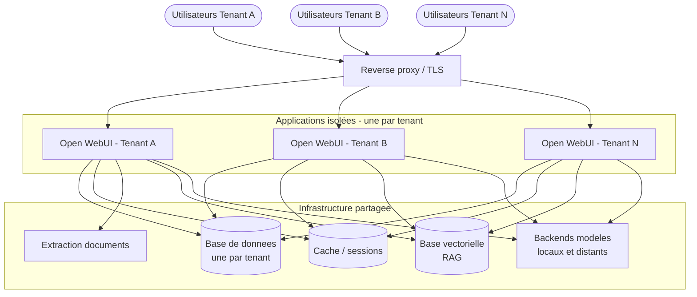
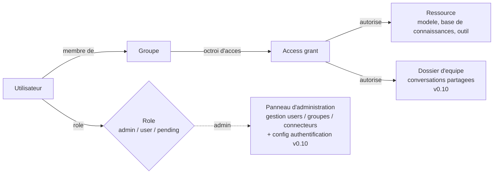
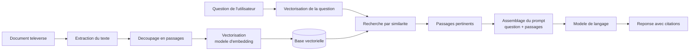
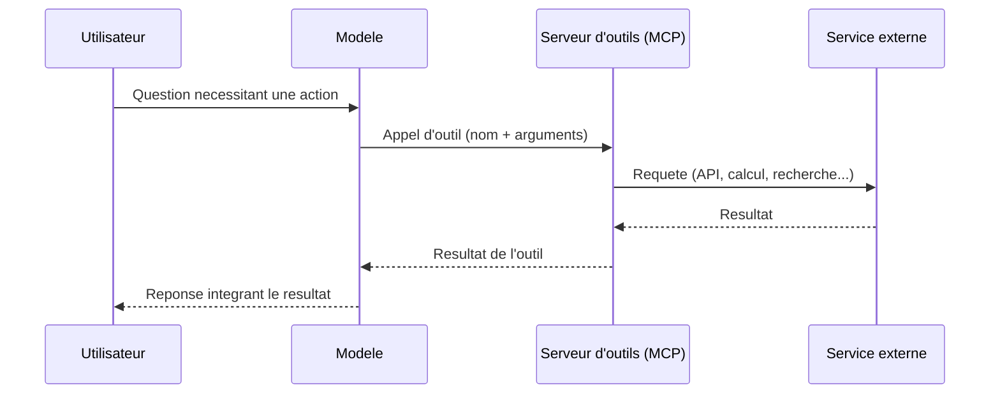

# Architecture — administration & multi-tenant (schémas)

[← Tour de la plateforme](README.md) | [↑ Open-WebUI](../README.md)

> Cette page présente la face « administration » d'Open WebUI par des
> **diagrammes** plutôt que par des captures de panneaux réels. C'est un choix
> délibéré : on explique le *fonctionnement* (isolation, droits, flux de données)
> sans rien divulguer d'une instance de production. Tous les noms (tenants,
> services) sont **génériques** ; aucune URL, IP ou identité réelle n'y figure.

---

## 1. Déploiement multi-tenant

Le multi-tenant ne signifie pas « plusieurs serveurs séparés ». C'est une
**isolation logique** : chaque établissement (« tenant ») dispose de sa propre
application et de sa propre base de données, mais plusieurs services
d'infrastructure sont **mutualisés** pour réduire les coûts et la maintenance.

**Point clé — où est l'isolation ?** Chaque application ne « voit » que **sa**
base de données. Deux tenants peuvent partager le moteur de base de données et la
base vectorielle, mais leurs données restent séparées par des bases (ou des
espaces) distincts. L'isolation est garantie au niveau applicatif **et** au
niveau du stockage — c'est exactement ce point que le module 5 de la
[série QA](../Playwright-OWUI/README.md) vérifie par des tests automatisés.

---

## 2. Contrôle d'accès (RBAC)

Les droits ne sont pas attachés individuellement à chaque utilisateur : ils
passent par des **groupes** et des **octrois d'accès** (*access grants*). C'est ce
qui rend l'administration tenable à l'échelle.

- Un **rôle** détermine ce qu'on peut faire globalement (un *admin* accède au
  panneau d'administration ; un *user* non).
- Un **groupe** rassemble des utilisateurs ; on accorde un droit **au groupe**,
  et tous ses membres en héritent.
- Un **access grant** relie un groupe (ou « tout le monde ») à une ressource
  précise. C'est le maillon qui répond à la question « qui a le droit de voir ce
  modèle / cette base de connaissances ? ».
- **Dossiers d'équipe *(nouveau — v0.10)*.** Le même mécanisme d'octroi d'accès
  s'étend aux **dossiers** : partager un dossier avec un groupe, c'est créer un
  *access grant* du groupe vers ce dossier. Les membres accèdent alors aux
  conversations qu'il contient, toujours **dans les limites de leur tenant** —
  l'isolation multi-tenant de la section 1 reste la frontière infranchissable.
- **Configuration de l'authentification *(nouveau — v0.10)*.** Les réglages
  d'identité (OAuth, LDAP, SAML, mode d'inscription) se pilotent désormais depuis
  le **panneau d'administration** et non plus uniquement par variables
  d'environnement au démarrage — d'où la branche `+ config authentification` sur
  le nœud d'administration ci-dessus.

---

## 3. Flux RAG (génération augmentée par récupération)

Quand on téléverse un document dans une base de connaissances, il suit une chaîne
de traitement avant de pouvoir être « cité » par le modèle :

La qualité d'un assistant RAG dépend de chaque maillon : extraction fidèle,
découpage pertinent, bon modèle d'embedding, et récupération qui ramène les *bons*
passages. C'est l'objet de l'[exercice 2](README.md#exercice-2--créer-un-assistant-rag)
du tour.

---

## 4. Flux outils & MCP

Un modèle « outillé » peut **agir** : au lieu de seulement répondre, il décide
d'appeler un outil (une API, un calcul, une recherche) exposé via le protocole
**MCP** (Model Context Protocol), puis intègre le résultat à sa réponse.

Du point de vue de la sécurité, les outils élargissent la surface d'action du
modèle : c'est puissant, mais cela demande de contrôler *quels* outils sont
exposés et *à qui* (via le RBAC de la section 2).

---

## Sécurité — rappel

Aucun de ces schémas ne contient d'URL réelle, d'IP, de nom de tenant de
production, d'identité ni de secret. Les noms sont des **placeholders**
pédagogiques. Les valeurs réelles (connecteurs, clés, hôtes) vivent dans des
fichiers `.env` non commités côté infrastructure — jamais dans un support de
cours. Voir la [politique du dossier ombrelle](../README.md#sécurité--pas-de-secret-dans-les-supports).

---

*Architecture — Tour de la plateforme (Epic #4433, sous #4427). FR-first.
Édition **v0.10** (dossiers d'équipe + config d'authentification ajoutés au RBAC).
Diagrammes Mermaid (rendus nativement par GitHub).*
