# Tour de la plateforme AI Engine

[← AI-Engine-WordPress](../README.md) | [← Plateformes conversationnelles](../../README.md) | [← Documentation GenAI](../../../README.md) | [Tour Open WebUI](../../Open-WebUI/00-Tour-Plateforme/README.md)

> **Parcours découverte.** Ce tour guidé présente, écran par écran, *à quoi
> ressemble AI Engine et comment on s'en sert depuis son interface
> d'administration*. Il est le pendant « interface » de la série
> **[AI Engine par son API](../README.md)**, qui pilote la même plateforme
> par requêtes REST : ici on apprend à se servir de l'outil à la souris ;
> là-bas on apprend à l'automatiser.

---

## À qui s'adresse ce tour ?

À toute personne qui découvre AI Engine : administrateur·rice d'un site
WordPress qui envisage d'y ajouter une couche GenAI, étudiant·e d'un cours
qui va travailler sur l'extension, ou curieux·se qui veut voir l'interface
avant de lire le code. Aucun prérequis technique : le tour se lit comme une
visite, captures à l'appui.

## Comment lire ce tour

Chaque section suit le même rythme :

1. **Ce que c'est** — la fonctionnalité en deux phrases.
2. **Ce qu'on y voit** — ce que montre la capture.
3. **Capture** — une image de l'interface réelle.

> **Note sur les captures.** Les 12 images de ce tour sont produites de
> façon **reproductible** par un script Playwright
> ([`capturer-le-tour.py`](capturer-le-tour.py)) exécuté contre l'
> **[instance jetable « Maison Valmont »](../instance-jetable/README.md)** :
> une installation WordPress Docker locale, 100 % synthétique (maison
> d'édition fictive), branchée sur un LLM local. Aucune donnée réelle n'y
> figure, et aucune capture ne montre de clé d'API ni de mot de passe.
> Le script rejoue le tour complet en une commande : c'est la garantie que
> les images suivent l'interface, pas l'inverse.

> **Note d'honnêteté sur la licence.** L'instance tourne en AI Engine
> **version gratuite** (téléchargée depuis wordpress.org). Le module
> *Workspace* (étape 7) est réservé à la licence Pro : pour pouvoir le
> montrer, le script active le module par l'API REST juste avant la visite,
> puis les étapes suivantes le désactivent — l'instance retrouve son état
> Free habituel. Les 11 autres captures ne montrent que la version gratuite.

---

## Sommaire

| # | Section | Ce qu'on y découvre |
|---|---------|---------------------|
| 1 | [Tableau de bord](#1--tableau-de-bord) | L'écran d'accueil du plugin, étapes de prise en main |
| 2 | [Catalogue des modules](#2--catalogue-des-modules) | Les familles de fonctionnalités, gratuites et Pro |
| 3 | [Éditeur de chatbots](#3--éditeur-de-chatbots) | Où l'on configure un chatbot : AI, apparence, contexte |
| 4 | [Aperçu live du chatbot](#4--aperçu-live-du-chatbot) | Le chatbot testé sans quitter l'éditeur |
| 5 | [Environnements par défaut](#5--environnements-par-défaut) | Les 7 usages types prêts à l'emploi (chat, images,…) |
| 6 | [Playground](#6--playground) | Le banc d'essai de prompts de l'admin |
| 7 | [Workspace *(Pro)*](#7--workspace-pro) | Le chat plein écran dans l'admin |
| 8 | [Générateur de contenu](#8--générateur-de-contenu) | Rédiger un article assisté par IA |
| 9 | [Générateur d'images](#9--générateur-dimages) | Produire des visuels depuis un prompt |
| 10 | [Accueil public](#10--accueil-public) | Ce que voit un visiteur du site |
| 11 | [Page Assistant](#11--page-assistant) | Le chatbot intégré au site par shortcode |
| 12 | [Conversation réelle](#12--conversation-réelle) | Une vraie question, une vraie réponse du modèle local |

---

## 1 — Tableau de bord

**Ce que c'est.** Le point d'entrée de l'extension dans l'admin WordPress :
onglet *AI Engine → Dashboard*. Il résume l'état du plugin et guide les
premiers réglages.

**Ce qu'on y voit.** La page de bienvenue du plugin, son menu latéral
d'onglets, et le fil des étapes de prise en main.

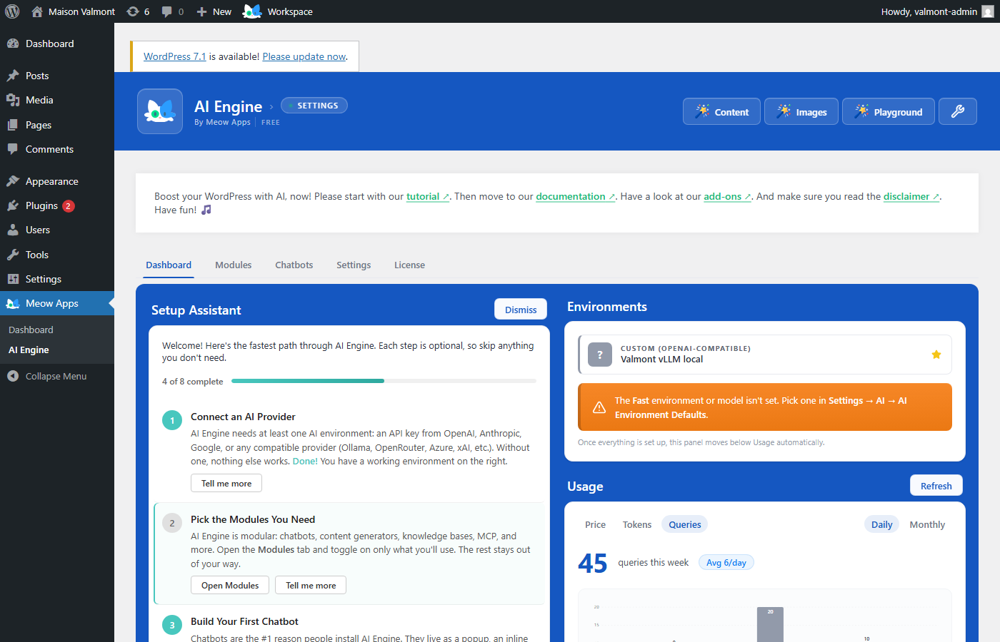

## 2 — Catalogue des modules

**Ce que c'est.** L'onglet *Modules* liste toutes les briques fonctionnelles
de l'extension, organisées par familles (chatbots, formes, statistiques,…),
chacune activable d'un clic — certaines marquées **Pro**.

**Ce qu'on y voit.** La grille des modules avec leurs interrupteurs
d'activation et leurs mentions Free / Pro.

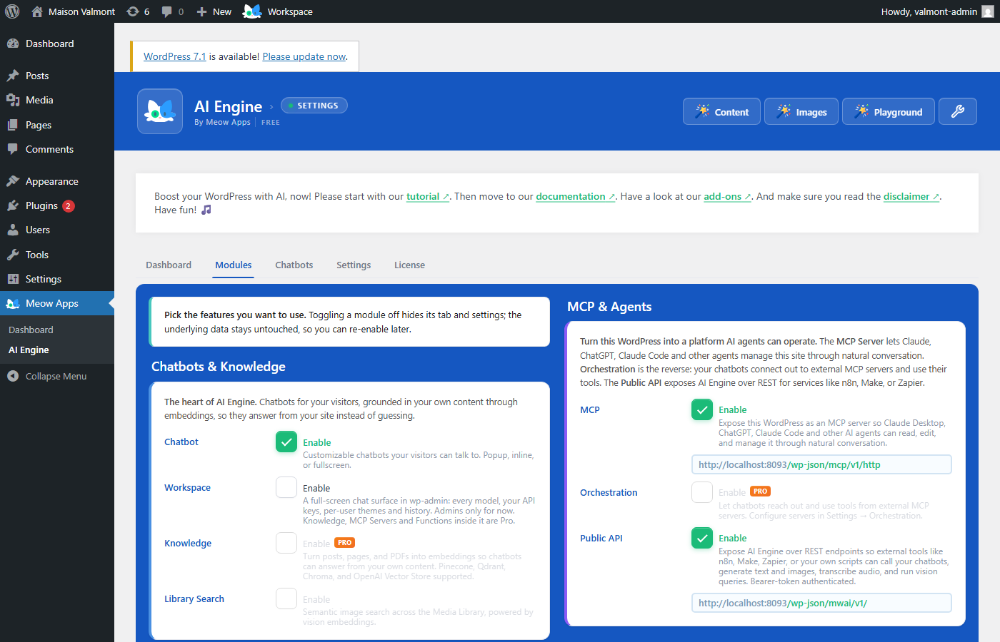

## 3 — Éditeur de chatbots

**Ce que c'est.** L'onglet *Chatbots* : c'est ici que l'on crée et configure
un assistant — nom, modèle, *system prompt*, apparence de la fenêtre de
discussion.

**Ce qu'on y voit.** La liste des chatbots de l'instance — dont « valmont »,
créé par le script de peuplement — et le panneau de réglages du chatbot
sélectionné.

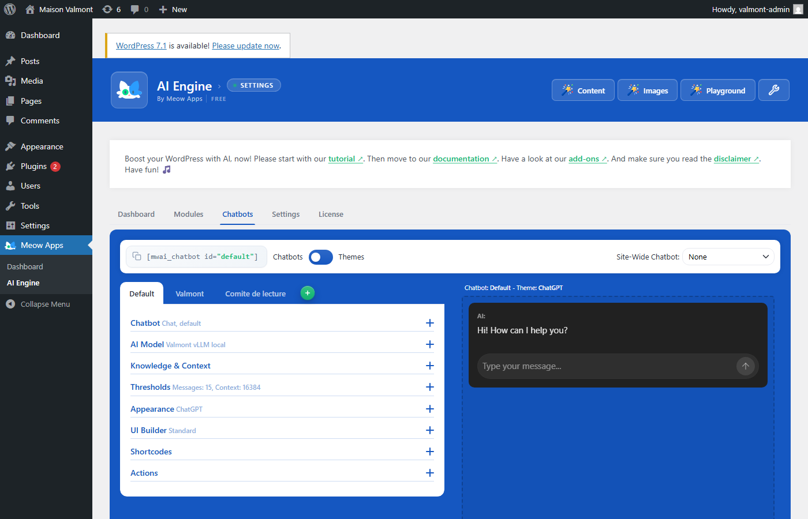

## 4 — Aperçu live du chatbot

**Ce que c'est.** L'éditeur embarque une prévisualisation du chatbot tel
qu'il apparaîtra aux visiteurs : on ajuste un réglage, on voit l'effet
immédiatement.

**Ce qu'on y voit.** La fenêtre de discussion du chatbot, rendue en bas de
l'éditeur, telle que la verra un visiteur.

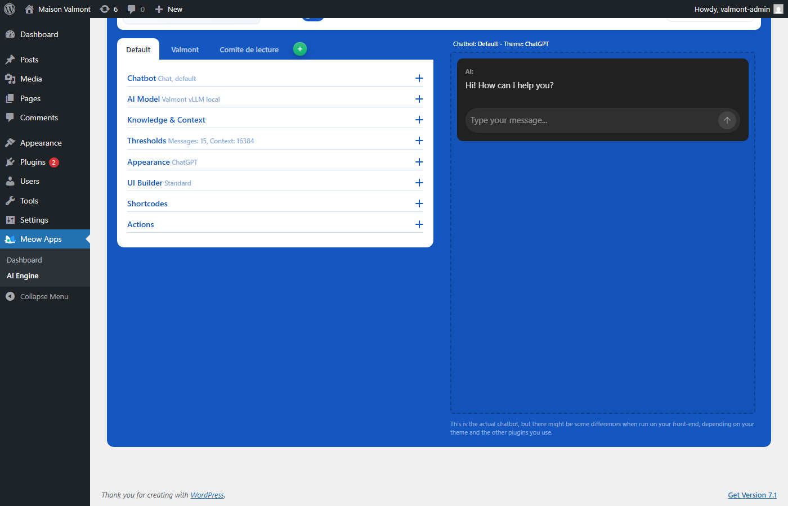

## 5 — Environnements par défaut

**Ce que c'est.** L'onglet *Settings* définit les « environnements » : un
environnement décrit un serveur de modèles (URL + clé) et à quel usage il
répond. AI Engine en préremplit sept — chat, images, transcription, etc. —
qu'il suffit de pointer vers son propre serveur.

**Ce qu'on y voit.** La section *Default Environments for AI* et sa grille
d'usages types, avec en haut du cadre la carte *Environments for AI* qui
porte les identifiants du serveur de modèles. Cette carte est visible, et ce
n'est pas un oubli : le champ **API Key** est de type mot de passe — le
navigateur l'affiche en points, il ne rend jamais sa valeur — et l'endpoint
affiché est une **adresse privée non routable** (RFC 1918), déjà présente
ailleurs dans ce dépôt public. Ce qui protège ici, c'est le rendu du champ,
pas le cadrage : le réflexe à retenir pour toute capture future est de
vérifier le **type** du champ qui porte un secret, car un cadrage ne couvre
pas un jour où la même valeur transiterait par un champ texte, un log ou un
toast.


## 6 — Playground

**Ce que c'est.** Un banc d'essai de prompts dans l'admin (*Tools → AI
Engine*): on choisit un modèle, on tape, on compare — sans écrire la
moindre ligne de code ni toucher au site public.

**Ce qu'on y voit.** L'interface du Playground : sélecteur de modèle, zone
de prompt, réponse.

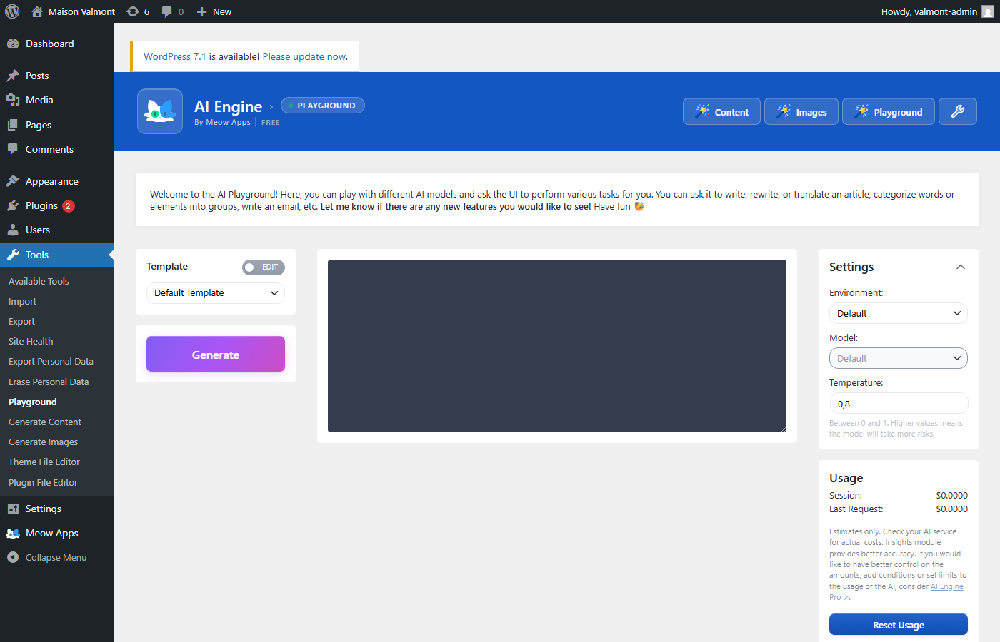

## 7 — Workspace *(Pro)*

**Ce que c'est.** Le module *Workspace* ajoute un chat plein écran dans
l'administration — de quoi discuter longuement avec un modèle sans la
fenêtre flottante des chatbots publics. C'est une fonctionnalité **Pro**,
montrée ici activée temporairement par l'API (voir la note de licence
ci-dessus).

**Ce qu'on y voit.** L'interface sombre du Workspace occupant tout
l'écran de l'admin.

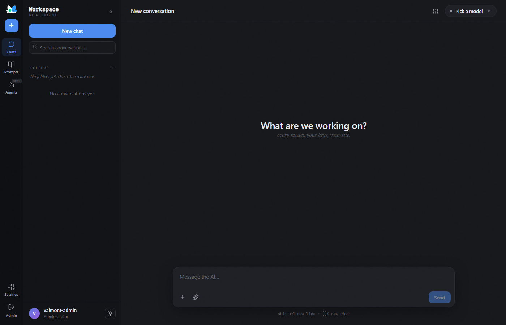

## 8 — Générateur de contenu

**Ce que c'est.** Le module *Generators* ajoute un outil de rédaction
assistée : on décrit l'article voulu, l'IA en produit un brouillon directement
dans l'éditeur WordPress.

**Ce qu'on y voit.** L'écran du générateur de contenu : formulaire de
description, options, bouton de génération.

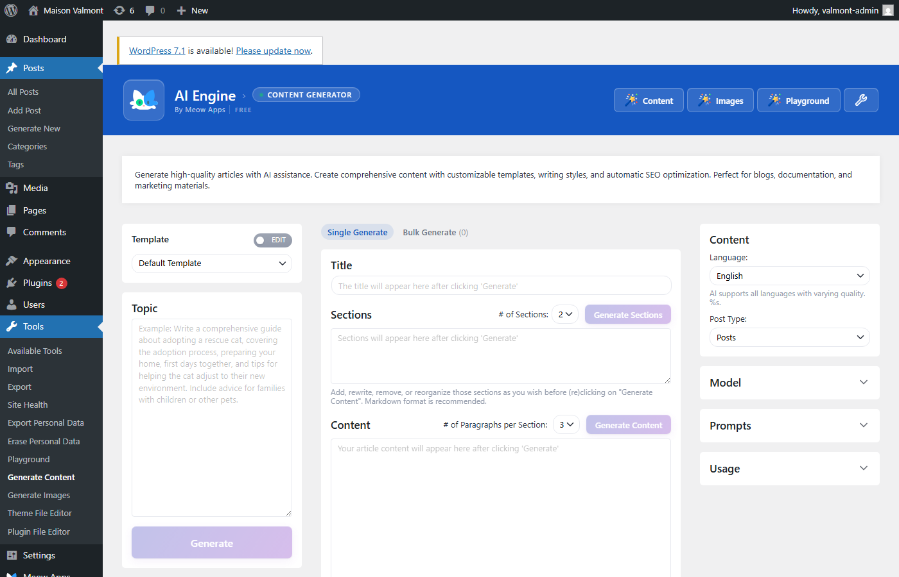

## 9 — Générateur d'images

**Ce que c'est.** La déclinaison visuelle du générateur : un prompt, une
image produite par le serveur de modèles — toujours sans quitter l'admin.

**Ce qu'on y voit.** L'écran du générateur d'images : zone de prompt et
options.

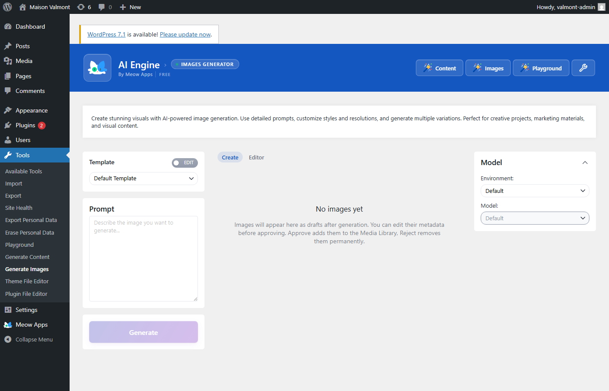

## 10 — Accueil public

**Ce que c'est.** Changement de décor : on quitte l'administration pour le
site public. C'est la première page que voit un visiteur de « Maison
Valmont », la maison d'édition fictive qui peuple l'instance.

**Ce qu'on y voit.** L'accueil du site, sans barre d'admin (la capture
vérifie qu'aucune session ne fuite), avec le thème standard de WordPress.

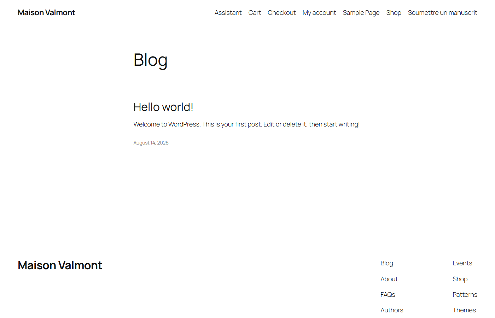

## 11 — Page Assistant

**Ce que c'est.** Le chatbot n'est pas réservé à l'admin : posé dans une page
par shortcode, il apparaît inline au visiteur. C'est la démonstration la plus
courte de « l'IA intégrée au site ».

**Ce qu'on y voit.** La page *Assistant* du site public avec la fenêtre de
discussion du chatbot « valmont » intégrée au contenu.

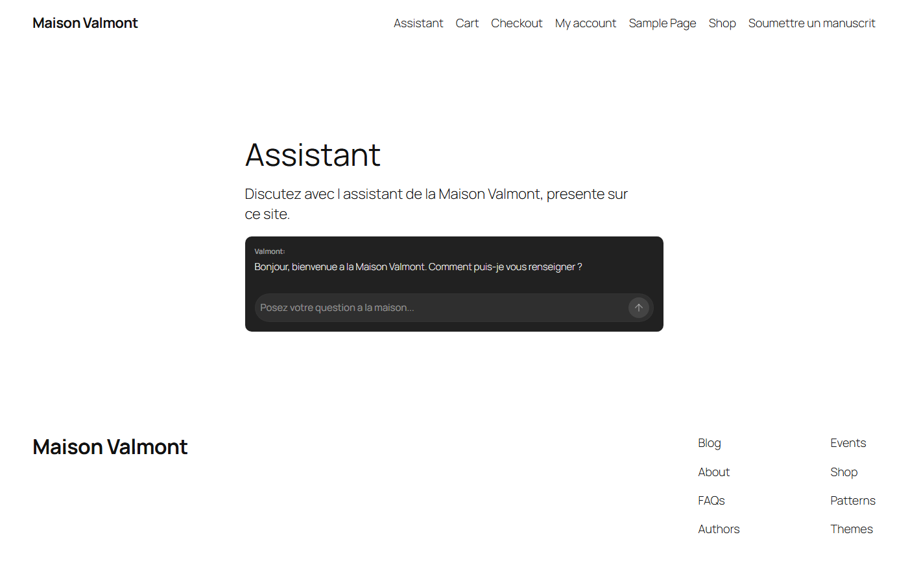

## 12 — Conversation réelle

**Ce que c'est.** La preuve que la boucle est complète : un visiteur pose
une question sur les genres publiés par la maison, le modèle local branché
sur l'instance répond — capture prise après l'affichage complet de la
réponse.

**Ce qu'on y voit.** L'échange réel dans la fenêtre de discussion : la
question du visiteur, la réponse du modèle servi localement.

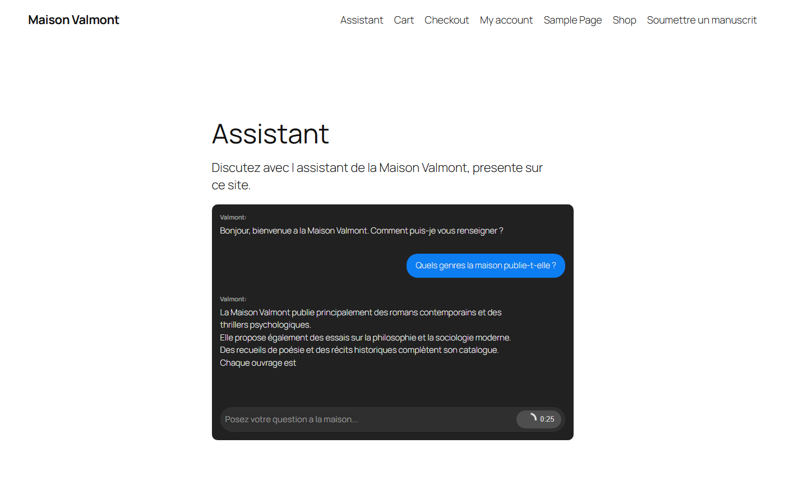

---

## Reproduire les captures

```powershell
# depuis ce dossier, instance jetable démarrée et .env renseigné
# (voir ../instance-jetable/README.md)
python capturer-le-tour.py
```

Le script ouvre une session administrateur pour les étapes 1 à 9, puis un
contexte navigateur vierge (aucune session) pour les étapes 10 à 12 — il
vérifie lui-même qu'aucune barre d'admin ne fuite sur le site public. La
capture 12 attend la réponse complète du modèle avant de déclencher.

## Sécurité — aucun secret dans ce tour

Conformément à la politique du dossier ombrelle : les captures sont
produites contre l'instance jetable « Maison Valmont », peuplée
**exclusivement** de données synthétiques — jamais contre une installation
réelle. La seule interface qui affiche une clé d'API (étape 5) la montre
**masquée par le rendu du champ** — l'input est de type mot de passe, la
valeur ne s'affiche jamais en clair ; l'endpoint visible à côté est une
adresse privée non routable, déjà présente dans ce dépôt. Les identifiants
de l'instance vivent dans un `.env` **non commité** ; seuls les
`*.env.example` documentent les variables attendues.

## Et ensuite ?

- Pour piloter la même plateforme **par l'API** plutôt qu'à la souris,
  suivre la série **AI Engine par son API**, à partir de
  [`presenter-ai-engine-par-son-api.ipynb`](../presenter-ai-engine-par-son-api.ipynb).
- Pour monter l'instance jetable chez soi et rejouer ce tour :
  [`../instance-jetable/README.md`](../instance-jetable/README.md).
- Pour la même visite côté Open WebUI, voir le
  [Tour Open WebUI](../../Open-WebUI/00-Tour-Plateforme/README.md).

---

*Tour de la plateforme AI Engine — parcours découverte (issue #12127,
tranche 1). FR-first. Captures rejouables via `capturer-le-tour.py` contre
l'instance jetable « Maison Valmont » (AI Engine 3.7.0, licence Free).*
