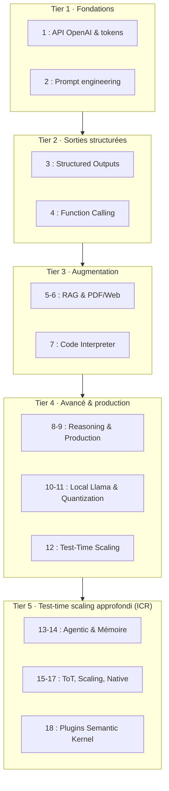

# GenAI Texte - Maîtrise des LLMs : Fondement de tout Génératif

<!-- CATALOG-STATUS
series: GenAI-Texte
pedagogical_count: 20
breakdown: Texte=20
maturity: PRODUCTION=13, BETA=7
-->

[← Documentation GenAI](../README.md) | [↑ ..](../README.md) | [→ Semantic Kernel](../SemanticKernel/README.md)

La maîtrise des LLMs constitue la pierre angulaire de toute expertise en Génératif. Chaque image générée, chaque instruction d'agent et chaque requête RAG trouve son origine dans le texte. Cette série vous guide à travers une progression pédagogique complète pour transformer votre interaction avec l'IA.

## Ce que vous apprendrez

À travers cette série pratique, vous acquerrez une expertise complète :
- **Art du prompt engineering** : du zéro-shot au chain-of-thought
- **Structuration des réponses** : JSON Schema, Pydantic, extraction de données
- **Intelligence augmentée** : function calling, RAG moderne, code interpreter
- **Raisonnement avancé** : modèles o4-mini, gpt-5-thinking
- **Production enterprise** : gestion de sessions, retry, batch processing
- **Déploiement local** : vLLM, quantification, optimisation des coûts
- **Test-time scaling (ICR)** : routeur agentique, mémoire persistante, Tree-of-Thoughts sur CSP, courbes de scaling, raisonnement natif, plugins Semantic Kernel (notebooks 13 à 18, arc approfondi au-delà de NB-12)

## Contenu détaillé

### Tier 1 : Fondations (Débutant)

| # | Notebook | Description | Durée |
|---|----------|-------------|-------|
| 1 | `1_OpenAI_Intro.ipynb` | Introduction à l'API OpenAI, tokens, Chat Completions, Responses API | 45 min |
| 2 | `2_PromptEngineering.ipynb` | Zero-shot, few-shot, Chain-of-Thought, modèles raisonnants | 50 min |

### Tier 2 : Sorties Structurées (Intermédiaire)

| # | Notebook | Description | Durée |
|---|----------|-------------|-------|
| 3 | `3_Structured_Outputs.ipynb` | JSON Schema, Pydantic, mode strict, extraction de données | 55 min |
| 4 | `4_Function_Calling.ipynb` | Tools API, appels parallèles, boucle agentique | 60 min |

### Tier 3 : Augmentation (Intermédiaire)

| # | Notebook | Description | Durée |
|---|----------|-------------|-------|
| 5 | `5_RAG_Modern.ipynb` | RAG, embeddings, chunking, Responses API multi-turn, citations | 65 min |
| 6 | `6_PDF_Web_Search.ipynb` | Support PDF (base64/file_id), web_search intégré | 50 min |
| 7 | `7_Code_Interpreter.ipynb` | Code interpreter, analyse de données, génération de graphiques | 55 min |

### Tier 4 : Fonctionnalités Avancées

| # | Notebook | Description | Durée |
|---|----------|-------------|-------|
| 8 | `8_Reasoning_Models.ipynb` | o4-mini, gpt-5-thinking, reasoning_effort, comparaisons | 60 min |
| 9 | `9_Production_Patterns.ipynb` | Conversations API, background mode, retry, batch processing | 70 min |
| 10 | `10_LocalLlama.ipynb` | vLLM, Qwen3.5-35B-A3B, ZwZ-8B, multi-endpoints, benchmarking | 60 min |
| 11 | `11_Quantization.ipynb` | AWQ, GPTQ, llmcompressor, modèles vision, déploiement vLLM | 60 min |
| 12 | `12_Test_Time_Scaling.ipynb` | Best-of-N, Tree-of-Thoughts (BFS/DFS), Reflexion, routeur adaptatif (cf ICR) | 60 min |

### Tier 5 : Test-Time Scaling approfondi (ICR)

Le notebook 12 introduit en Python pur les quatre moteurs d'inférence au moment du test (Best-of-N, Tree-of-Thoughts, Reflexion, routeur adaptatif). Les notebooks 13 à 18 approfondissent cet arc en s'inspirant du projet de référence [Iterative-Contextual-Refinements (ICR)](https://github.com/ryoiki-tokuien/Iterative-Contextual-Refinements) : on passe d'un routeur codé en dur à une orchestration agentique, on rend la mémoire persistante, on attaque des problèmes de recherche où le single-shot échoue, on quantifie les compromis de scaling, on compare au raisonnement natif, puis on expose le tout comme plugins réutilisables.

| # | Notebook | Description | Durée |
|---|----------|-------------|-------|
| 13 | `13_Agentic_Orchestration.ipynb` | Routeur agentique : function calling (pont NB-04) pour laisser un LLM choisir le moteur par sous-tâche (mode "Agentic" d'ICR) | 60 min |
| 14 | `14_Persistent_Memory.ipynb` | Mémoire vectorielle persistante (baseline BoW + cosine, pont NB-05 RAG) qui rétrocède les leçons aux runs suivants (agent "Memory" d'ICR) | 55 min |
| 15 | `15_Tree_of_Thoughts_Search.ipynb` | Tree-of-Thoughts sur cryptarithmes (SEND+MORE=MONEY) : recherche DFS colonne par colonne avec propagation de retenue (pont séries Search/Sudoku) | 60 min |
| 16 | `16_Scaling_Test_Time_Compute.ipynb` | Courbes de scaling Snell 2024 : estimateur pass@k, BoN vs Reflexion, frontière compute-optimale selon la difficulté | 65 min |
| 17 | `17_Native_Reasoning_vs_Scaling.ipynb` | Raisonnement natif (deepseek-r1, reasoning tokens) vs scaling hand-rolled (BoN), comparaison cost-normalisée en tokens | 60 min |
| 18 | `18_Semantic_Kernel_Plugins.ipynb` | Moteurs exposés en plugins Semantic Kernel (`@kernel_function`) composables via le kernel (pont série SemanticKernel) | 60 min |
| 19 | `19_OWUI_Orchestration.ipynb` | Orchestration sans code via Open WebUI v0.9.0 (Automations RRULE / Task Management / Calendar) ; trois niveaux d'abstraction (produit OWUI vs LangGraph vs CrewAI) ; migration async 0.8→0.9 ; skeleton API OpenAI-compatible avec graceful skip (`OWUI_API_KEY`) | 60 min |
| 20 | `20_OWUI_Native_API.ipynb` | Compagnon du 19 : introspection de la **vraie surface API native** OWUI v0.9.6 (routes REST auth-free : santé/version/config ; couche authentifiée Bearer) via `urllib` standard ; graceful skip honnête si `OWUI_API_KEY` absente (Stop & Repair, pas de sortie fabriquée) | 60 min |

## Prérequis

### Configuration API
1. Copier `.env.example` vers `.env`
2. Ajouter votre clé API OpenAI : `OPENAI_API_KEY=sk-...`

### Pour les notebooks locaux (10)
- Docker avec support GPU
- Ollama ou vLLM installé

## Parcours suggéré

```text
┌─────────────────────────────────────────────────────────────────┐
│                                                                 │
│  1_OpenAI_Intro ─────► 2_PromptEngineering                     │
│        │                      │                                 │
│        │                      └──────► 8_Reasoning_Models       │
│        │                                                        │
│        └──────► 3_Structured_Outputs                           │
│                       │                                         │
│                       └──────► 4_Function_Calling              │
│                                      │                          │
│                    ┌─────────────────┼─────────────────┐       │
│                    │                 │                 │       │
│                    ▼                 ▼                 ▼       │
│           5_RAG_Modern      7_Code_Interpreter  9_Production   │
│                 │                                              │
│                 └──────► 6_PDF_Web_Search                      │
│                                                                 │
│  10_LocalLlama (indépendant, prérequis: 1)                     │
│        └──────► 11_Quantization (prérequis: 10)                │
│                                                                 │
└─────────────────────────────────────────────────────────────────┘
```

## APIs couvertes

| API | Notebooks | Description |
|-----|-----------|-------------|
| **Chat Completions** | 1-4, 8 | API classique, toujours supportée |
| **Responses API** | 1, 5, 9 | Nouvelle API avec persistance |
| **Embeddings** | 5 | text-embedding-3-large |
| **Tools/Functions** | 4, 6, 7 | Function calling moderne |
| **File Upload** | 6, 7 | Support PDF et fichiers |
| **Reasoning** | 2, 8 | Modèles o4-mini, gpt-5-thinking |

## Technologies et écosystème

- **OpenAI API** : GPT-4o, GPT-4o-mini, o4-mini, gpt-5-thinking
- **Python** : openai, pydantic, tiktoken, semantic-kernel
- **Local** : vLLM, Qwen3.5-35B-A3B, ZwZ-8B, llmcompressor, AWQ/GPTQ
- **Bases vectorielles** : scikit-learn (demo), Pinecone, Qdrant, Chroma

## Mode batch

Tous les notebooks supportent un mode batch pour les tests automatisés :

```bash
# Dans .env
BATCH_MODE=true
```

Ce mode désactive les interactions utilisateur et utilise des exemples prédéfinis.

## Validation

```bash
# Valider la structure
python scripts/notebook_tools/notebook_tools.py validate GenAI/Texte --quick

# Exécuter tous les notebooks
python scripts/notebook_tools/notebook_tools.py execute GenAI/Texte --timeout 300
```

## Recette : maîtriser les LLMs pour piloter tout le génératif

Le fil rouge de cette série est la progression de l'interaction basique avec un LLM vers la maîtrise complète en production. Voici comment les tiers s'articulent :

1. **Tier 1** (fondations) : [1_OpenAI_Intro](1_OpenAI_Intro.ipynb) couvre l'API OpenAI et les tokens. [2_PromptEngineering](2_PromptEngineering.ipynb) explore les techniques de prompting (zero-shot, few-shot, chain-of-thought). À la fin, vous savez interagir efficacement avec un LLM.

2. **Tier 2** (sorties structurées) : [3_Structured_Outputs](3_Structured_Outputs.ipynb) maîtrise les formats JSON et Pydantic. [4_Function_Calling](4_Function_Calling.ipynb) connecte le LLM à des outils externes. Ces deux notebooks sont essentiels pour tout système qui pilote d'autres modèles génératifs (image, audio, video).

3. **Tier 3** (augmentation) : [5_RAG_Modern](5_RAG_Modern.ipynb) et [6_PDF_Web_Search](6_PDF_Web_Search.ipynb) enrichissent le LLM avec des sources externes. [7_Code_Interpreter](7_Code_Interpreter.ipynb) lui donne la capacité d'exécuter du code.

4. **Tier 4** (production et local) : [8_Reasoning_Models](8_Reasoning_Models.ipynb) exploite les modèles raisonnants. [9_Production_Patterns](9_Production_Patterns.ipynb) couvre les patterns enterprise. [10_LocalLlama](10_LocalLlama.ipynb) et [11_Quantization](11_Quantization.ipynb) déploient en local avec vLLM.

5. **Tier 5** (test-time scaling approfondi) : partant de [12_Test_Time_Scaling](12_Test_Time_Scaling.ipynb) (les quatre moteurs en Python pur), l'arc NB-13..18 décompose chaque facette de l'inférence au moment du test — orchestration agentique via function calling ([13](13_Agentic_Orchestration.ipynb)), mémoire persistante par similarité ([14](14_Persistent_Memory.ipynb)), Tree-of-Thoughts sur des problèmes de recherche ([15](15_Tree_of_Thoughts_Search.ipynb)), courbes de scaling de Snell ([16](16_Scaling_Test_Time_Compute.ipynb)), raisonnement natif vs scaling hand-rolled ([17](17_Native_Reasoning_vs_Scaling.ipynb)), puis intégration Semantic Kernel ([18](18_Semantic_Kernel_Plugins.ipynb)).

Le schéma ci-dessous résume comment les cinq tiers s'enchaînent pour maîtriser les LLMs : du prompt one-shot (tier 1) aux patterns de production puis à l'arc test-time scaling approfondi (tiers 4-5), en passant par les sorties structurées (tier 2) et l'augmentation RAG/code interpreter (tier 3).



## FAQ

### Chat Completions vs Responses API — laquelle utiliser ?

Les notebooks couvrent les deux APIs OpenAI :

- **Chat Completions** (notebooks 1-4, 8) : l'API classique `client.chat.completions.create()`. Toujours supportée, simple d'usage, stateless. Idéale pour les requêtes unitaires et les prototypes.
- **Responses API** (notebooks 1, 5, 9) : la nouvelle API `client.responses.create()`. Ajoute la persistance automatique des conversations, le support natif du RAG multi-turn, et les citations. Recommandée pour les workflows multi-étapes.

En pratique, commencez avec Chat Completions (notebook 1), puis migrez vers Responses API quand vous avez besoin de persistance ou de RAG (notebook 5).

### Structured Outputs échoue en mode strict

Le mode strict (`strict=True`) impose des contraintes sur les schémas JSON :

- **Tous les champs** doivent être `required` (pas de champ optionnel `Optional`).
- **Pas de types union** complexes (`str | int | None`).
- **Pas de profondeur excessive** (> 5 niveaux d'imbrication).
- Le schéma doit être **déterministe** : chaque champ a exactement un type possible.

Si le mode strict échoue, retirer `strict=True` et utiliser le mode par défaut (moins strict, mais le schéma est quand même respecté dans ~95% des cas). Le notebook [3_Structured_Outputs](3_Structured_Outputs.ipynb) montre les deux approches.

### Function calling : le modèle appelle un outil inexistant

Ce phénomène (hallucination d'outils) arrive quand :

- La description de l'outil est ambiguë ou incomplète.
- Le prompt utilisateur est vague et le modèle "invente" un outil pour répondre.
- Trop d'outils sont déclarés simultanément (> 10).

Mitigation : fournir des descriptions précises pour chaque outil, valider les arguments côté client avant exécution, et limiter le nombre d'outils actifs. Le notebook [4_Function_Calling](4_Function_Calling.ipynb) montre le pattern de validation.

### RAG : les réponses sont hors-sujet ou inventées

Les causes les plus fréquentes :

- **Chunking trop grand** : les segments dépassent 512 tokens, diluant le contenu pertinent. Utiliser des chunks de 200-400 tokens avec chevauchement de 50 tokens.
- **Embedding inadapté** : `text-embedding-3-small` est plus rapide mais moins précis que `text-embedding-3-large` pour le RAG technique.
- **Pas de citation** : sans vérification, le modèle peut halluciner des sources. La Responses API (notebook 5) génère automatiquement des citations.
- **Top-k trop élevé** : injecter trop de contexte noie le signal. Commencer avec `top_k=3` et ajuster.

### Modèles raisonnants (o4-mini, gpt-5-thinking) : tokens et coût

Les modèles raisonnants consomment des **reasoning tokens** (non visibles) en plus des tokens d'entrée/sortie. Implications :

- **Coût** : le coût réel peut être 3-10x supérieur à un modèle non-raisonnant pour le même prompt. Utiliser `reasoning_effort="low"` pour les tâches simples.
- **Latence** : les modèles raisonnants prennent plus de temps (10-60s vs 2-5s). Pas adaptés au temps réel.
- **Usage** : excellents pour les tâches de planification, l'analyse multi-étapes, et la décomposition de problèmes complexes. Inutiles pour le simple formatage ou l'extraction.

Le notebook [8_Reasoning_Models](8_Reasoning_Models.ipynb) compare les coûts et la qualité entre modèles raisonnants et classiques.

### LLM local (vLLM) : erreur CUDA ou OOM

Les notebooks 10-11 utilisent vLLM pour servir des modèles locaux. Problèmes courants :

- **VRAM insuffisante** : Qwen3.5-35B-A3B en FP16 nécessite ~70 GB. Utiliser la quantification AWQ (notebook 11) pour réduire à ~12 GB.
- **Version CUDA** : vLLM requiert CUDA 12.1+. Vérifier avec `nvidia-smi` et `nvcc --version`.
- **Port déjà occupé** : vLLM utilise le port 8000 par défaut. Utiliser `--port 8001` si besoin.
- **Timeout au premier appel** : le chargement du modèle prend 30-120s au démarrage. Les appels suivants sont instantanés.

## Ressources

- [OpenAI Documentation](https://platform.openai.com/docs)
- [Responses API](https://platform.openai.com/docs/api-reference/responses)
- [Reasoning Models](https://platform.openai.com/docs/guides/reasoning)
- [Function Calling](https://platform.openai.com/docs/guides/function-calling)
