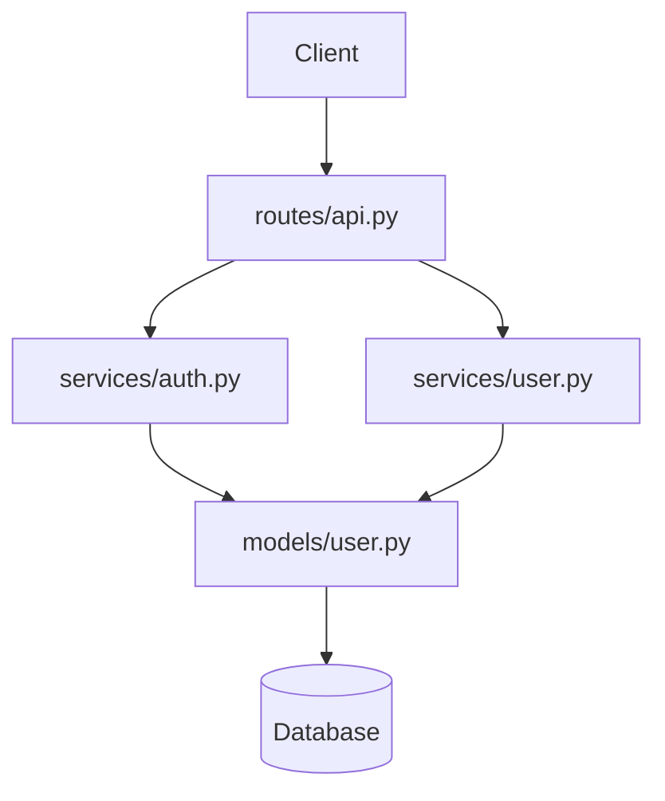

# Guide Agent - Demo 1 : Agent Explore

Ce guide est destiné aux formateurs et agents IA pour accompagner les apprenants.

## Objectifs de la démo

- Comprendre le fonctionnement de l'agent Explore
- Savoir quand l'utiliser vs recherche manuelle
- Créer de la documentation à partir d'une exploration

## Points de vigilance

### Projets trop volumineux

1. **Limites de contexte**
   - L'exploration de projets massifs peut atteindre les limites
   - Solution : cibler des sous-dossiers spécifiques

2. **Temps d'exploration**
   - Grands projets = plus de temps
   - Prévenir les apprenants que c'est normal

### Qualité de l'exploration

1. **Dépend de la question**
   - Question vague → exploration superficielle
   - Question précise → exploration ciblée

2. **Fichiers cachés**
   - `.gitignore`, fichiers de config peuvent être ignorés
   - Demander explicitement si nécessaire

## Déroulé suggéré

### Phase 1 : Contexte (5 min)

Expliquer :
- Pourquoi explorer avant de coder
- La différence entre Explore et recherche manuelle
- Les outils utilisés par Explore (Glob, Grep, Read)

### Phase 2 : Démo en direct (10 min)

Montrer une exploration sur un projet simple :

```
Explore ce projet et explique son architecture
```

Commenter le processus en temps réel :
- "Claude liste d'abord les fichiers..."
- "Il lit le README et les configs..."
- "Il identifie les points d'entrée..."

### Phase 3 : Pratique guidée (15 min)

Faire explorer un projet aux apprenants avec des questions progressives :

1. Vue d'ensemble
2. Module spécifique
3. Pattern ou flux

### Phase 4 : Exercice autonome (10 min)

Créer la documentation d'architecture.

## Réponses aux questions fréquentes

### "Explore lit-il tous les fichiers ?"

Non, Explore est intelligent :
- Lit d'abord les fichiers de configuration et README
- Utilise ces infos pour décider quoi lire ensuite
- Priorise les fichiers pertinents pour la question

### "Quelle est la différence avec @dossier/ ?"

| @dossier/ | Explore |
|-----------|---------|
| Liste la structure | Analyse le contenu |
| Instantané | Prend du temps |
| Pas d'analyse | Synthèse intelligente |
| Complément à une question | Question principale |

### "Puis-je limiter l'exploration ?"

Oui, en étant précis :
```
Explore uniquement le dossier src/api/ et explique les endpoints
```

### "Comment savoir quand Explore a fini ?"

Claude Code indique quand l'exploration est terminée et présente ses conclusions. Vous pouvez voir les fichiers consultés dans le log.

## Critères de validation

L'apprenant a réussi cette démo si :

- [ ] Comprend quand utiliser Explore
- [ ] A réalisé au moins 2 explorations différentes
- [ ] Sait poser des questions qui guident l'exploration
- [ ] A créé un fichier ARCHITECTURE.md
- [ ] Le diagramme Mermaid est valide

## Exemples de résultats attendus

### Exploration basique

```markdown
## Vue d'ensemble

Ce projet est une API REST pour la gestion d'utilisateurs, construite avec Flask.

### Structure
```
├── app/
│   ├── __init__.py    # Factory pattern Flask
│   ├── models/        # Modèles SQLAlchemy
│   ├── routes/        # Blueprints des endpoints
│   └── services/      # Logique métier
├── tests/
└── config.py          # Configuration par environnement
```

### Composants principaux
- **models/user.py** : Modèle User avec hachage de mot de passe
- **routes/api.py** : Endpoints REST (/users, /auth)
- **services/auth.py** : Logique d'authentification JWT
```

### Diagramme Mermaid



## Erreurs courantes

### Exploration qui échoue

**Cause** : Projet dans un dossier non accessible

**Solution** : Vérifier le dossier courant avec `pwd`

### Résultats trop superficiels

**Cause** : Question trop vague

**Solution** : Reformuler avec des critères précis

### Contexte dépassé

**Cause** : Projet trop volumineux

**Solution** : Explorer par sous-dossiers

## Ressources pour le formateur

- [Agent Architecture](https://code.claude.com/docs/en/agents#explore)
- [Exemples d'exploration](https://github.com/anthropics/claude-code/examples)
