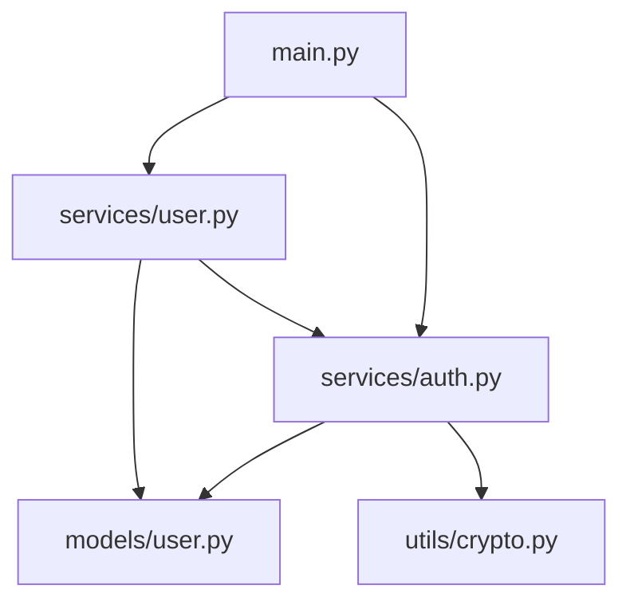

# Demo 3 - Analyse de Code

## Objectif

Apprendre à utiliser Claude Code pour évaluer la qualité du code, analyser les dépendances et identifier les axes d'amélioration.

## Durée estimée

**40 minutes**

## Concepts

### Métriques de qualité

Claude Code peut analyser :

| Métrique | Description |
|----------|-------------|
| Complexité cyclomatique | Nombre de chemins d'exécution |
| Couplage | Dépendances entre modules |
| Cohésion | Unité fonctionnelle d'un module |
| Couverture | Documentation et tests |

### Types d'analyse

- **Statique** : Analyse du code sans l'exécuter
- **Dépendances** : Relations entre modules
- **Qualité** : Code smells, anti-patterns
- **Sécurité** : Vulnérabilités potentielles

## Étapes

### Étape 1 : Analyse de complexité (10 min)

#### Demander une analyse de complexité

```
Analyse la complexité de @src/ :
- Identifie les fonctions avec une complexité cyclomatique > 10
- Liste les fichiers avec le plus de lignes de code
- Trouve les fonctions avec trop de paramètres (> 5)
```

#### Interpréter les résultats

| Complexité | Évaluation |
|------------|------------|
| 1-10 | Simple, facile à tester |
| 11-20 | Modérée, attention requise |
| 21-50 | Élevée, refactoring conseillé |
| > 50 | Très élevée, refactoring urgent |

### Étape 2 : Analyse des dépendances (10 min)

#### Cartographier les imports

```
Analyse les dépendances de @src/ et crée :
1. Un graphe des imports entre modules (format Mermaid)
2. La liste des dépendances circulaires s'il y en a
3. Les modules les plus couplés
```

#### Exemple de sortie



### Étape 3 : Détection de code smells (10 min)

#### Demander une analyse de code smells

```
Analyse @src/ et identifie les code smells :
- Fonctions trop longues (> 50 lignes)
- Classes avec trop de responsabilités
- Code dupliqué
- Dead code (code non utilisé)
- Magic numbers et strings
- Mauvais nommage
```

#### Code smells courants

| Smell | Description | Solution |
|-------|-------------|----------|
| Long Method | Fonction > 50 lignes | Extraire en sous-fonctions |
| Large Class | Classe > 500 lignes | Diviser en classes |
| Feature Envy | Méthode utilise plus une autre classe | Déplacer la méthode |
| Data Clumps | Groupes de données répétés | Créer une classe |
| Primitive Obsession | Utilisation excessive de primitifs | Value Objects |

### Étape 4 : Rapport de qualité (10 min)

#### Générer un rapport complet

```
Génère un rapport de qualité complet pour @src/ incluant :

1. Score global (A à F)
2. Métriques clés
3. Top 5 des problèmes prioritaires
4. Recommandations d'amélioration
5. Plan d'action suggéré

Format : Markdown avec tableaux et graphiques Mermaid
```

## Exercice pratique

### Mission

Réalisez un audit de qualité complet sur un projet.

### Étapes

1. **Analyse initiale**
   ```
   Donne-moi une vue d'ensemble de la qualité de ce projet.
   ```

2. **Analyse détaillée par aspect**
   ```
   Analyse détaillée de la complexité
   ```
   ```
   Analyse détaillée des dépendances
   ```
   ```
   Analyse détaillée de la sécurité
   ```

3. **Identification des priorités**
   ```
   Parmi tous les problèmes identifiés, lesquels sont prioritaires
   et pourquoi ?
   ```

4. **Plan d'action**
   ```
   Crée un plan d'action avec des sprints de 2 semaines pour
   améliorer la qualité du code.
   ```

### Livrable

Fichier `quality-report.md` avec :
- Score global
- Analyse par catégorie
- Problèmes prioritaires
- Plan d'action

## Template de rapport

```markdown
# Rapport de Qualité - [Projet]

## Score Global : [A-F]

## Résumé Exécutif
[2-3 phrases sur l'état général]

## Métriques

| Métrique | Valeur | Cible | Statut |
|----------|--------|-------|--------|
| Complexité moyenne | X | < 10 | ✅/⚠️/❌ |
| Couverture tests | X% | > 80% | ✅/⚠️/❌ |
| Documentation | X% | > 70% | ✅/⚠️/❌ |
| Dépendances circulaires | X | 0 | ✅/⚠️/❌ |

## Graphe des Dépendances

```mermaid
[Diagramme]
```

## Problèmes Identifiés

### Critiques (à traiter immédiatement)
1. [Problème] - [Fichier:ligne]

### Importants (à traiter cette semaine)
1. [Problème] - [Fichier:ligne]

### Mineurs (à planifier)
1. [Problème] - [Fichier:ligne]

## Plan d'Action

### Sprint 1 (Semaine 1-2)
- [ ] Action 1
- [ ] Action 2

### Sprint 2 (Semaine 3-4)
- [ ] Action 3
- [ ] Action 4

## Recommandations Long Terme
- [Recommandation 1]
- [Recommandation 2]
```

## Bonnes pratiques

### Fréquence d'analyse

| Type | Fréquence |
|------|-----------|
| Analyse rapide | Chaque PR |
| Analyse complète | Hebdomadaire |
| Audit approfondi | Mensuel |

### Métriques à suivre

- Évolution de la complexité
- Couverture de tests
- Nombre de code smells
- Dette technique estimée

## Points clés à retenir

1. **Analyse régulière** : Intégrez l'analyse dans votre workflow

2. **Priorisez** : Tout ne peut pas être corrigé en même temps

3. **Mesurez** : Suivez l'évolution des métriques

4. **Automatisez** : Utilisez des hooks pour les analyses automatiques

---

**Prochaine étape** : [Atelier 04 - Création de Code](../../04-creation-code/)
