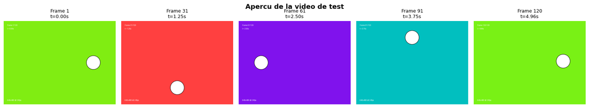
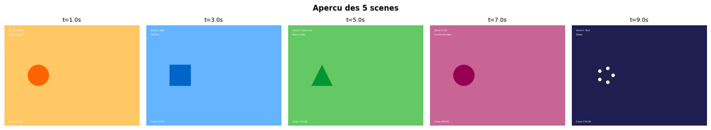
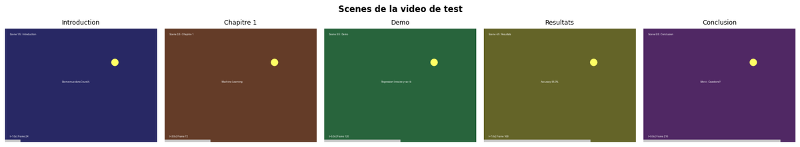
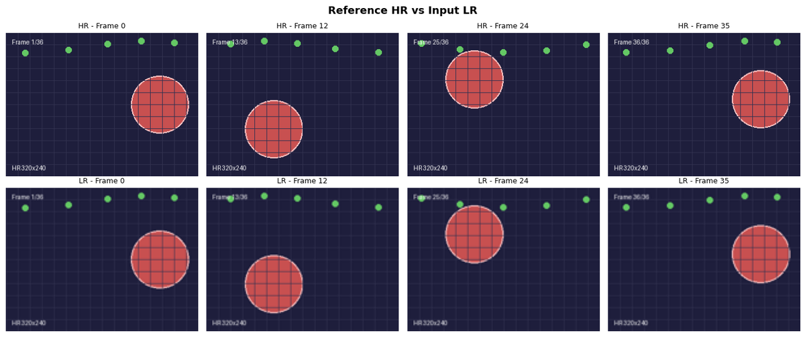
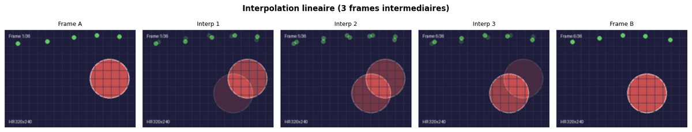
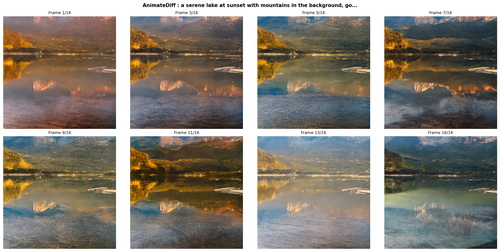

# 01-Foundation - Bases Vidéo & Compréhension

[← Documentation Video](../README.md) | [↑ ..](../README.md) | [→ Video Advanced](../02-Advanced/)

Ce module couvre les fondamentaux de la vidéo par IA : opérations vidéo, compréhension vidéo, et amélioration.

**Dans le cadre du fil rouge pipeline vidéo pédagogique** : avant de générer des vidéos, il faut savoir les analyser et les manipuler. [01-1](01-1-Video-Operations-Basics.ipynb) donne les bases techniques (ffmpeg, moviepy). [01-2](01-2-GPT-5-Video-Understanding.ipynb) et [01-3](01-3-Qwen-VL-Video-Analysis.ipynb) couvrent la compréhension vidéo (décomposition en scènes, Q&A sur le contenu). [01-4](01-4-Video-Enhancement-ESRGAN.ipynb) améliore la qualité visuelle. [01-5](01-5-AnimateDiff-Introduction.ipynb) introduit la génération de mouvement à partir de texte.

## Vue d'overview

| Statistique | Valeur |
|-------------|--------|
| Notebooks | 5 |
| Kernel | Python 3 |
| Durée estimée | ~4-6h |
| GPU requis | 0-12GB |

## Aperçu — les bases vidéo en images

Ce module pose les fondamentaux : opérations techniques (ffmpeg, moviepy), compréhension vidéo (GPT-5, Qwen-VL), amélioration de qualité (ESRGAN) et génération de mouvement (AnimateDiff). La galerie ci-dessous présente des aperçus extraits des notebooks.

<table>
<tr>
<td align="center"><br/><sub>Opérations de base (01-1)</sub></td>
<td align="center"><br/><sub>Compréhension GPT-5 (01-2)</sub></td>
</tr>
<tr>
<td align="center"><br/><sub>Analyse Qwen-VL (01-3)</sub></td>
<td align="center"><br/><sub>Enhancement ESRGAN (01-4)</sub></td>
</tr>
<tr>
<td align="center"><br/><sub>ESRGAN panorama (01-4)</sub></td>
<td align="center"><br/><sub>AnimateDiff (01-5)</sub></td>
</tr>
</table>

Provenance et poids de chaque figure : [`assets/readme/MANIFEST.md`](assets/readme/MANIFEST.md).

## Notebooks

| # | Notebook | Contenu | Service | VRAM |
|---|----------|---------|---------|------ |
| 1 | [01-1-Video-Operations-Basics](01-1-Video-Operations-Basics.ipynb) | Opérations de base (FFmpeg, moviepy) | Local | 0 |
| 2 | [01-2-GPT-5-Video-Understanding](01-2-GPT-5-Video-Understanding.ipynb) | Compréhension vidéo | OpenAI API | 0 |
| 3 | [01-3-Qwen-VL-Video-Analysis](01-3-Qwen-VL-Video-Analysis.ipynb) | Analyse vidéo multimodale | Qwen | Variable |
| 4 | [01-4-Video-Enhancement-ESRGAN](01-4-Video-Enhancement-ESRGAN.ipynb) | Amélioration qualité | Real-ESRGAN | ~4GB |
| 5 | [01-5-AnimateDiff-Introduction](01-5-AnimateDiff-Introduction.ipynb) | Introduction à l'animation | AnimateDiff | ~12GB |

## Prérequis

### API Keys
```bash
# Dans GenAI/.env
OPENAI_API_KEY=sk-...
```

### Dépendances
```bash
pip install -r requirements.txt
pip install -r requirements-video.txt
```

### Logiciels système
- FFmpeg (pour le traitement vidéo)
- FFmpeg-python (Python binding)

## Progression recommandée

1. **01-1-Video-Operations-Basics** - Bases du traitement vidéo
2. **01-2-GPT-5-Video-Understanding** - Intelligence vidéo
3. **01-3-Qwen-VL-Video-Analysis** - Analyse multimodale
4. **01-4-Video-Enhancement-ESRGAN** - Amélioration qualité
5. **01-5-AnimateDiff-Introduction** - Animation de base

## Points clés

- **Formats supportés** : MP4, AVI, MOV, MKV
- **Résolutions** : 720p à 4K
- **Qualité** : ESRGAN pour upscale, AnimateDiff pour animation
- **Performance** : Traitement local CPU ou GPU selon les modèles

## Ressources

- [Documentation Video principale](../README.md)
- [Guide FFmpeg](01-1-Video-Operations-Basics.ipynb)
- [ComfyUI pour Video](../03-Orchestration/)