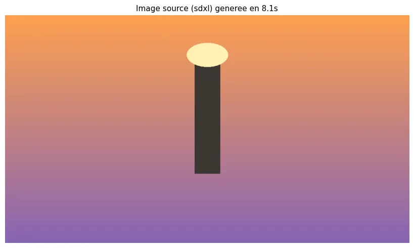
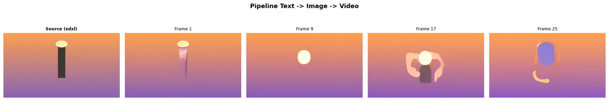
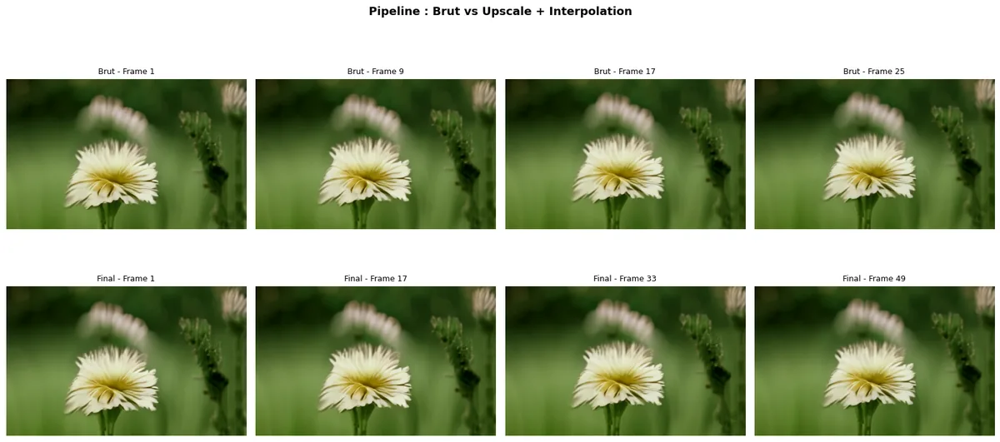
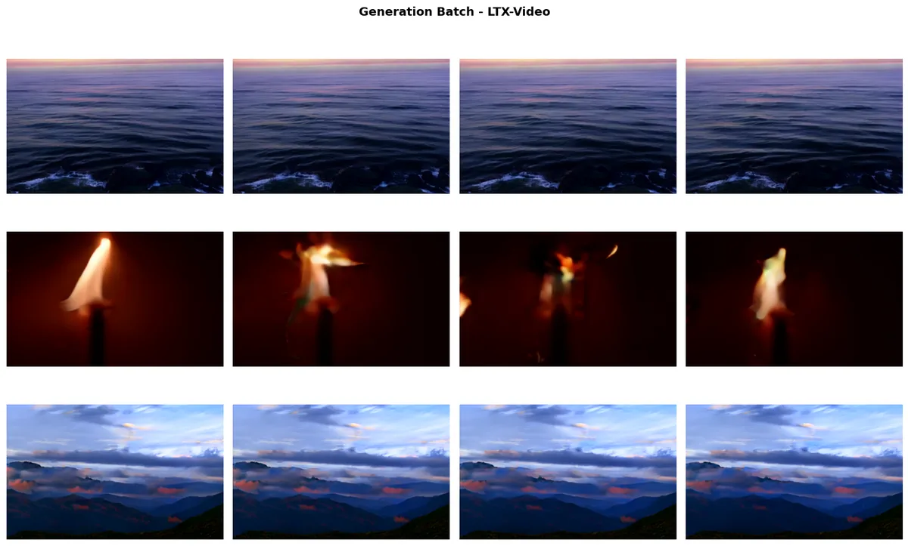
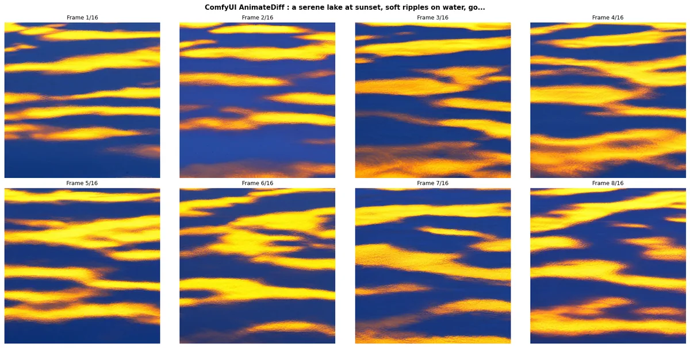

# 03-Orchestration - Multi-modèles & Workflows Vidéo

[← Video Advanced](../02-Advanced/) | [↑ Video](../README.md) | [→ Video Applications](../04-Applications/)

Ce module couvre l'orchestration de plusieurs modèles vidéo, les workflows complexes, et l'intégration ComfyUI.

**Dans le cadre du fil rouge pipeline vidéo pédagogique** : les briques existent, il faut les assembler. [03-1](03-1-Multi-Model-Video-Comparison.ipynb) compare les modèles pour choisir le meilleur selon le matériel et le contexte. [03-2](03-2-Video-Workflow-Orchestration.ipynb) construit le pipeline text-to-image-to-video qui constitue le coeur du générateur. [03-3](03-3-ComfyUI-Video-Workflows.ipynb) utilise ComfyUI pour des workflows natifs plus flexibles.

## Vue d'overview

| Statistique | Valeur |
|-------------|--------|
| Notebooks | 3 |
| Kernel | Python 3 |
| Durée estimée | ~4-6h |
| GPU requis | Variable |

## Notebooks

| # | Notebook | Contenu | Service | VRAM |
|---|----------|---------|---------|------ |
| 1 | [03-1-Multi-Model-Video-Comparison](03-1-Multi-Model-Video-Comparison.ipynb) | Comparatif modèles | Mixed | Variable |
| 2 | [03-2-Video-Workflow-Orchestration](03-2-Video-Workflow-Orchestration.ipynb) | Orchestration workflows | ComfyUI | Variable |
| 3 | [03-3-ComfyUI-Video-Workflows](03-3-ComfyUI-Video-Workflows.ipynb) | ComfyUI spécifique | ComfyUI | Variable |

## Prérequis

### Docker Services
```bash
cd docker-configurations/services/comfyui-qwen
docker-compose up -d
```
Accès : http://localhost:8188

### Dépendances
```bash
# depuis MyIA.AI.Notebooks/GenAI/
pip install -r requirements.txt
pip install -r requirements-video.txt
```

## Progression recommandée

1. **03-1-Multi-Model-Video-Comparison** - Comparatif des modèles
2. **03-2-Video-Workflow-Orchestration** - Création de workflows
3. **03-3-ComfyUI-Video-Workflows** - Intégration ComfyUI

## Concepts clés

### Multi-Model Comparison
- **Critères** : Qualité, temps, ressources, contrôle
- **Modèles** : HunyuanVideo, LTX, Wan, SVD
- **Métriques** : FPS, résolution, artefacts

### Workflow Orchestration
- **Patterns** : Pipeline video, batch processing
- **Outils** : Python asyncio, multiprocessing
- **Optimisation** : Caching, parallélisation

Le notebook [03-2](03-2-Video-Workflow-Orchestration.ipynb) exécute réellement trois workflows ; les figures ci-dessous sont ses sorties, réduites en WebP pour l'affichage (provenance et poids natifs dans [`assets/readme/MANIFEST.md`](assets/readme/MANIFEST.md)).

Le **pipeline 1 (text → image → vidéo)** découple la composition de l'animation : SDXL génère d'abord une image source fidèle au prompt, puis Stable Video Diffusion (SVD) l'anime. L'image ci-dessous est cette source, produite en 8,1 s — une silhouette stylisée coiffée d'un ovale lumineux sur un ciel en dégradé orange-violet.

<p align="center">
<br/>
<sub><b>Image source SDXL (8,1 s)</b> — le point de départ du pipeline text → image → vidéo, que SVD anime ensuite</sub>
</p>

La planche-contact suivante montre le pipeline complet : la source SDXL, puis les frames 1, 9, 17 et 25 de la vidéo générée — on y voit le sujet évoluer (et dériver) au fil de l'animation.

<p align="center">
<br/>
<sub><b>Pipeline text → image → vidéo</b> — planche-contact : source SDXL puis frames 1/9/17/25 de l'animation SVD</sub>
</p>

Le **pipeline 2 (text → vidéo → upscale → interpolation)** part de LTX-Video (rapide, basse résolution) puis post-traite : upscale (Real-ESRGAN, repli bicubique) et interpolation de frames. La grille comparative oppose quatre frames brutes (1 à 25, en haut) aux frames finales (1 à 49, en bas) sur un plan de marguerite : l'interpolation double la cadence à contenu constant.

<p align="center">
<br/>
<sub><b>Brut vs upscale + interpolation</b> — frames brutes LTX-Video (haut, 1-25) contre frames finales (bas, 1-49) : la cadence double, le contenu reste stable</sub>
</p>

Enfin, la **génération batch** charge le pipeline LTX-Video une seule fois pour produire plusieurs clips en série. Les trois prompts du batch — vagues océanes au crépuscule, flamme de torche, paysage de montagne nuageux — donnent chacun quatre frames.

<p align="center">
<br/>
<sub><b>Batch LTX-Video</b> — trois clips générés en série sur un seul chargement de pipeline : océan au crépuscule, flamme de torche, montagnes (4 frames chacun)</sub>
</p>

### ComfyUI Integration
- **Nodes** : Video-specific nodes
- **Workflow** : End-to-end video generation
- **Scaling** : Gestion de la mémoire

Le notebook [03-3](03-3-ComfyUI-Video-Workflows.ipynb) pilote ComfyUI par son API (soumission sur `/prompt`, puis polling de `/history`) pour exécuter un workflow AnimateDiff de bout en bout. Ci-dessous, les huit premières frames (sur 16) générées pour le prompt « a serene lake at sunset, soft ripples on water » : les reflets dorés du couchant ondulent sur l'eau d'une frame à l'autre.

<p align="center">
<br/>
<sub><b>ComfyUI AnimateDiff</b> — frames 1-8/16 du prompt « a serene lake at sunset, soft ripples on water » : les reflets du couchant ondulent sur le lac</sub>
</p>

## Architecture

```
Input → Model Router → Processing → Output
    ↓         ↓          ↓         ↓
  Analysis  Selection   Pipeline  Validation
```

## Ressources

- [Documentation Video principale](../README.md)
- [Guide ComfyUI](../../00-GenAI-Environment/README.md)
- [GenAI Services](../../../../docs/genai/genai-services.md)
