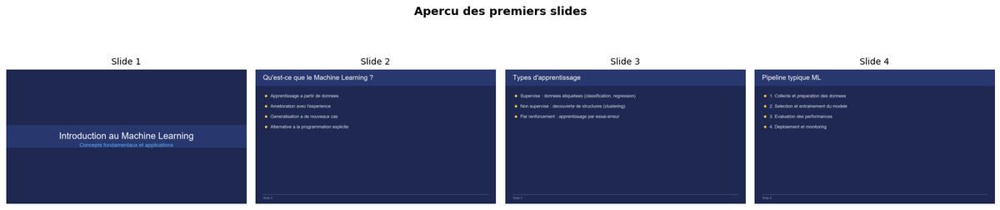
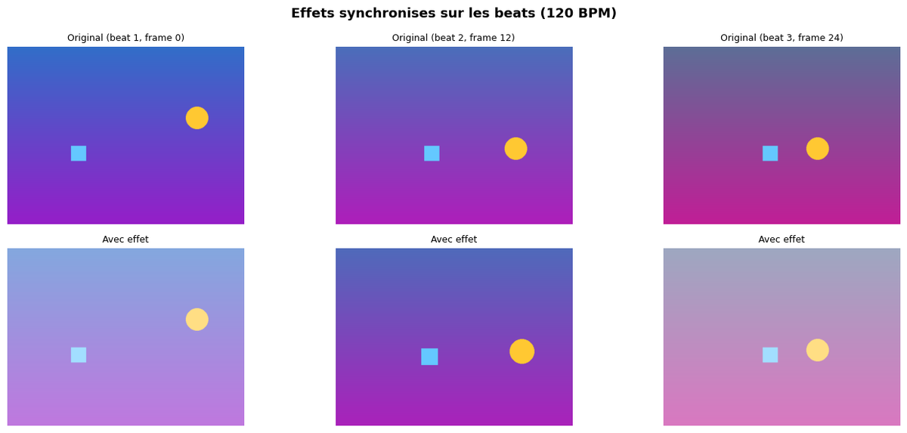
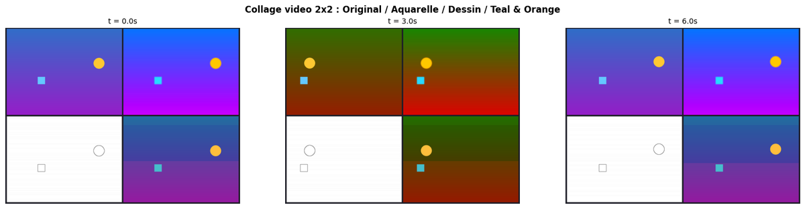
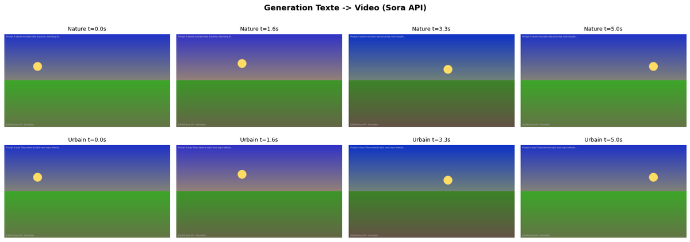
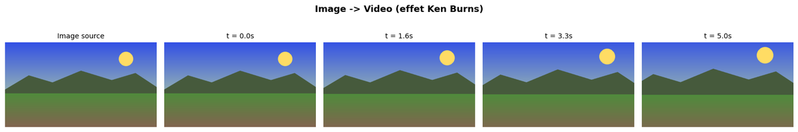
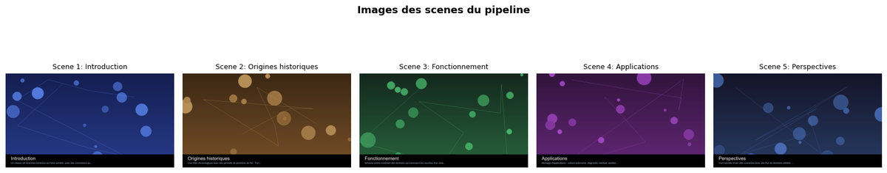

# 04-Applications - Cas d'usage production Vidéo

[← Video Orchestration](../03-Orchestration/) | [↑ Video](../README.md) | [→ Texte](../../Texte/README.md)

Ce module présente des cas d'usage concrets et des workflows de production pour la génération vidéo.

**Dans le cadre du fil rouge pipeline vidéo pédagogique** : ce niveau met en oeuvre les workflows complets. [04-1](04-1-Educational-Video-Generation.ipynb) génère automatiquement du contenu vidéo éducatif à partir d'un script. [04-3](04-3-Sora-API-Cloud-Video.ipynb) explore la génération cloud via l'API Sora. [04-4](04-4-Production-Video-Pipeline.ipynb) assemble le pipeline bout-en-bout.

## Vue d'overview

| Statistique | Valeur |
|-------------|--------|
| Notebooks | 4 |
| Kernel | Python 3 |
| Durée estimée | ~6-8h |
| GPU requis | 0-24GB |

## Aperçu — les cas d'usage production vidéo en images

Ce niveau met en oeuvre les workflows complets : génération automatique de contenu éducatif, workflows créatifs, génération cloud via l'API Sora, et pipeline de production bout-en-bout. Plutôt qu'une galerie séparée du propos, chaque sortie réelle est placée ci-dessous au plus près du notebook qui la produit. Provenance et poids de chaque figure : [`assets/readme/MANIFEST.md`](assets/readme/MANIFEST.md).

## Notebooks

| # | Notebook | Contenu | Service | VRAM |
|---|----------|---------|---------|------ |
| 1 | [04-1-Educational-Video-Generation](04-1-Educational-Video-Generation.ipynb) | Contenu éducatif | Mixed | ~12GB |
| 2 | [04-2-Creative-Video-Workflows](04-2-Creative-Video-Workflows.ipynb) | Workflows créatifs | ComfyUI | ~14GB |
| 3 | [04-3-Sora-API-Cloud-Video](04-3-Sora-API-Cloud-Video.ipynb) | Sora API cloud | OpenAI API | 0 |
| 4 | [04-4-Production-Video-Pipeline](04-4-Production-Video-Pipeline.ipynb) | Pipeline production | Mixed | ~18GB |

**[04-1](04-1-Educational-Video-Generation.ipynb) — Contenu éducatif.** Le notebook génère automatiquement une vidéo pédagogique à partir d'un script textuel : le panorama de frames ci-dessous atteste que la chaîne (script → prompts → frames → vidéo) produit un rendu visuellement cohérent :

<p align="center">
  <a href="04-1-Educational-Video-Generation.ipynb"></a><br>
  <em>Sortie du notebook <a href="04-1-Educational-Video-Generation.ipynb">04-1</a> : panorama des frames d'une vidéo éducative générée à partir d'un script.</em>
</p>

**[04-2](04-2-Creative-Video-Workflows.ipynb) — Workflows créatifs (ComfyUI).** Deux compositions illustrant la souplesse du workflow créatif : une séquence narrative complète, puis une variante explorant une composition différente à partir des mêmes briques ComfyUI :

<p align="center">
  <a href="04-2-Creative-Video-Workflows.ipynb"></a><br>
  <em>Sortie du notebook <a href="04-2-Creative-Video-Workflows.ipynb">04-2</a> (cellule 9) : séquence vidéo narrative générée via ComfyUI.</em>
</p>

<p align="center">
  <a href="04-2-Creative-Video-Workflows.ipynb"></a><br>
  <em>Sortie du notebook <a href="04-2-Creative-Video-Workflows.ipynb">04-2</a> (cellule 15) : variante de composition — même workflow, composition alternative.</em>
</p>

**[04-3](04-3-Sora-API-Cloud-Video.ipynb) — Génération cloud via l'API Sora.** Côté cloud cette fois : deux appels à l'API Sora, chacun renvoyant un panorama de frames d'une vidéo générée à partir d'un prompt. Aucun GPU local requis :

<p align="center">
  <a href="04-3-Sora-API-Cloud-Video.ipynb"></a><br>
  <em>Sortie du notebook <a href="04-3-Sora-API-Cloud-Video.ipynb">04-3</a> (cellule 9) : panorama de frames d'une génération Sora via API cloud.</em>
</p>

<p align="center">
  <a href="04-3-Sora-API-Cloud-Video.ipynb"></a><br>
  <em>Sortie du notebook <a href="04-3-Sora-API-Cloud-Video.ipynb">04-3</a> (cellule 11) : second appel Sora, aperçu alternatif.</em>
</p>

**[04-4](04-4-Production-Video-Pipeline.ipynb) — Pipeline de production.** Le notebook assemble la chaîne bout-en-bout : le panorama ci-dessous montre les frames issues du pipeline orchestré complet, aboutissement de la série :

<p align="center">
  <a href="04-4-Production-Video-Pipeline.ipynb"></a><br>
  <em>Sortie du notebook <a href="04-4-Production-Video-Pipeline.ipynb">04-4</a> : frames issues du pipeline de production orchestré bout-en-bout.</em>
</p>

## Prérequis

### API Keys
```bash
# Dans GenAI/.env
OPENAI_API_KEY=sk-...
```

### Docker Services (optionnel)
```bash
cd docker-configurations/services/comfyui-qwen
docker-compose up -d
```
Accès : http://localhost:8188

### Dépendances
```bash
pip install -r requirements.txt
pip install -r requirements-video.txt
```

## Cas d'usage

### 04-1 Educational Video Generation
- **Objectif** : Automatiser la création de contenu vidéo éducatif
- **Technologies** : GPT-5 + modèles vidéo + post-production
- **Applications** : Cours vidéo, tutoriels, formations

### 04-2 Creative Video Workflows
- **Objectif** : Workflows créatifs automatisés
- **Technologies** : ComfyUI + modèles avancés
- **Applications** : Création artistique, publicités, clips musicaux

### 04-3 Sora API Cloud Video
- **Objectif** : Utiliser Sora d'OpenAI
- **Technologies** : OpenAI API + post-processing
- **Applications** : Prototypage rapide, contenu à grande échelle

### 04-4 Production Video Pipeline
- **Objectif** : Pipeline de production vidéo complet
- **Technologies** : Batch processing + monitoring + QC
- **Applications** : Production en série, contenu marketing

## Workflows

### Éducation
```
Brief → GPT-4o (script) → Modèle vidéo → Post-production → Vidéo finale
```

### Création
```
Idée → ComfyUI (génération) → Édition → Validation → Livraison
```

### Production
```
Batch → Queue → Processing → QC → Distribution → Analytics
```

## Ressources

- [Documentation Video principale](../README.md)
- [Guide ComfyUI](../../00-GenAI-Environment/README.md)
- [GenAI Services](../../../../docs/genai/genai-services.md)
