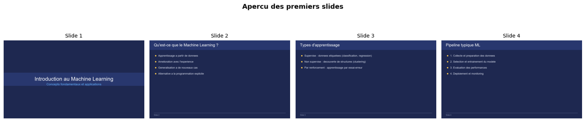
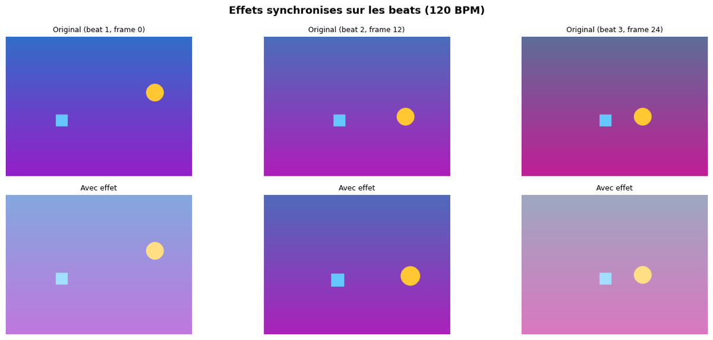
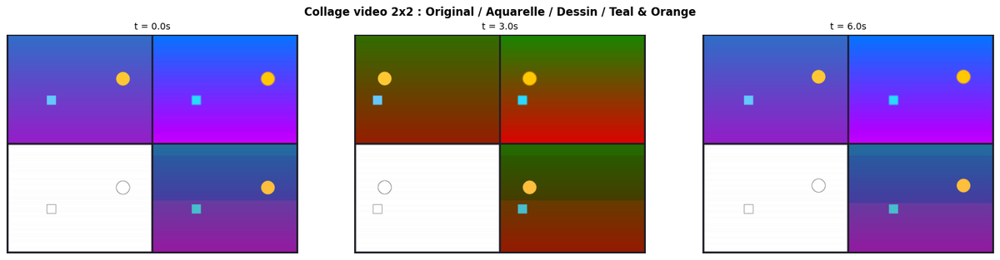
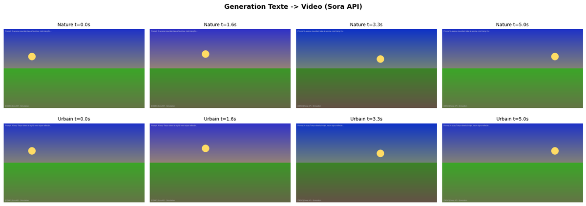
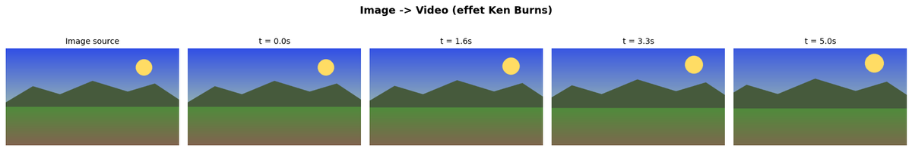
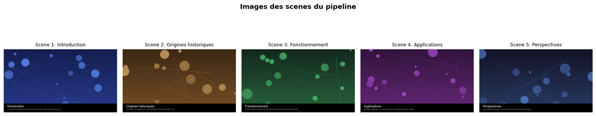

# 04-Applications - Cas d'usage production Vidéo

[← Video Orchestration](../03-Orchestration/) | [↑ Video](../README.md) | [→ Texte](../../Texte/README.md)

Ce module présente des cas d'usage concrets et des workflows de production pour la génération vidéo.

**Dans le cadre du fil rouge pipeline vidéo pédagogique** : ce niveau met en oeuvre les workflows complets. [04-1](04-1-Educational-Video-Generation.ipynb) génère automatiquement du contenu vidéo éducatif à partir d'un script. [04-3](04-3-Sora-API-Cloud-Video.ipynb) explore la génération cloud via l'API Sora. [04-4](04-4-Production-Video-Pipeline.ipynb) assemble le pipeline bout-en-bout. [04-5](04-5-MiniMax-H3-Cloud-Video.ipynb) invoque le service cloud Hailuo (MiniMax H3) pour la vidéo HD/2K avec audio natif — la voie ouverte en UE que l'auto-hébergement des poids interdit (voir la bifurcation juridique en [`02-6`](../02-Advanced/02-6-MiniMax-H3-Architecture-Licensing.ipynb)).

## Vue d'overview

| Statistique | Valeur |
|-------------|--------|
| Notebooks | 6 |
| Kernel | Python 3 |
| Durée estimée | ~6-8h |
| GPU requis | 0-24GB |

## Notebooks

| # | Notebook | Contenu | Service | VRAM |
|---|----------|---------|---------|------ |
| 1 | [04-1-Educational-Video-Generation](04-1-Educational-Video-Generation.ipynb) | Contenu éducatif | Mixed | ~12GB |
| 2 | [04-2-Creative-Video-Workflows](04-2-Creative-Video-Workflows.ipynb) | Workflows créatifs | ComfyUI | ~14GB |
| 3 | [04-3-Sora-API-Cloud-Video](04-3-Sora-API-Cloud-Video.ipynb) | Sora API cloud | OpenAI API | 0 |
| 4 | [04-4-Production-Video-Pipeline](04-4-Production-Video-Pipeline.ipynb) | Pipeline production | Mixed | ~18GB |
| 5 | [04-5-MiniMax-H3-Cloud-Video](04-5-MiniMax-H3-Cloud-Video.ipynb) | Hailuo API, HD/2K + audio natif | MiniMax API | 0 |
| 6 | [04-6-MiniMax-video-01-v1-Cloud-Video](04-6-MiniMax-video-01-v1-Cloud-Video.ipynb) | Hailuo API v1, video muette plan-couvert UE, key-gated + sonde non-brûlante | MiniMax API | 0 |

**[04-1](04-1-Educational-Video-Generation.ipynb) — Contenu éducatif.** Le notebook génère automatiquement une vidéo pédagogique à partir d'un script textuel : le panorama de frames ci-dessous atteste que la chaîne (script → prompts → frames → vidéo) produit un rendu visuellement cohérent :

<p align="center">
  <a href="04-1-Educational-Video-Generation.ipynb"></a><br>
  <em>Sortie du notebook <a href="04-1-Educational-Video-Generation.ipynb">04-1</a> : les 4 premiers slides du deck pédagogique « Introduction au Machine Learning » (titre/définition/types/pipeline) — la chaîne script → prompts → slides → vidéo a produit ce rendu visuellement cohérent à partir d'un script textuel.</em>
</p>

**[04-2](04-2-Creative-Video-Workflows.ipynb) — Workflows créatifs (ComfyUI).** Deux compositions illustrant la souplesse du workflow créatif : une séquence narrative complète, puis une variante explorant une composition différente à partir des mêmes briques ComfyUI :

<p align="center">
  <a href="04-2-Creative-Video-Workflows.ipynb"></a><br>
  <em>Sortie du notebook <a href="04-2-Creative-Video-Workflows.ipynb">04-2</a> (cellule 9) : effets audio-réactifs synchronisés sur les battements à 120 BPM — ComfyUI orchestre le déplacement des formes géométriques (carré + cercle) à chaque beat, transformant le clip original en version réactive.</em>
</p>

<p align="center">
  <a href="04-2-Creative-Video-Workflows.ipynb"></a><br>
  <em>Sortie du notebook <a href="04-2-Creative-Video-Workflows.ipynb">04-2</a> (cellule 15) : mosaïque 2×2×3 comparant 4 styles visuels (Original / Aquarelle / Dessin / Teal & Orange) appliqués au même clip à 3 timestamps — illustre la flexibilité du pipeline ComfyUI pour explorer rapidement des directions artistiques différentes sur un même contenu.</em>
</p>

**[04-3](04-3-Sora-API-Cloud-Video.ipynb) — Workflow cloud Sora (en simulation).** Côté cloud cette fois : le notebook illustre le workflow de génération vidéo via l'API Sora d'OpenAI. L'accès Sora réel étant restreint (clé et quota côté utilisateur), il en produit une **simulation disciplinée** — deux séquences de frames synthétiques, chacune auto-étiquetée « Sora API - Simulation » dans l'image, représentant le rendu attendu (déplacement d'un objet sur un décor prompt-dépendant). Aucun GPU ni accès API réel requis :

<p align="center">
  <a href="04-3-Sora-API-Cloud-Video.ipynb"></a><br>
  <em>Sortie du notebook <a href="04-3-Sora-API-Cloud-Video.ipynb">04-3</a> (cellule 9) : panorama de frames <strong>simulées</strong> illustrant le workflow Sora (API cloud) — la sortie porte le filigrane « Sora API - Simulation ».</em>
</p>

<p align="center">
  <a href="04-3-Sora-API-Cloud-Video.ipynb"></a><br>
  <em>Sortie du notebook <a href="04-3-Sora-API-Cloud-Video.ipynb">04-3</a> (cellule 11) : zoom progressif de type <strong>Ken Burns</strong> sur une image fixe (montagnes + soleil + horizon herbe) — illustre un autre mode de génération à partir d'images, complémentaire à la simulation text→vidéo illustrée par vid4-sora.png.</em>
</p>

**[04-4](04-4-Production-Video-Pipeline.ipynb) — Pipeline de production.** Le notebook assemble la chaîne bout-en-bout : le panorama ci-dessous montre les frames issues du pipeline orchestré complet, aboutissement de la série :

<p align="center">
  <a href="04-4-Production-Video-Pipeline.ipynb"></a><br>
  <em>Sortie du notebook <a href="04-4-Production-Video-Pipeline.ipynb">04-4</a> : les 5 scènes générées par le pipeline bout-en-bout — Introduction / Origines historiques / Fonctionnement / Applications / Perspectives, chacune avec fond coloré distinct + constellation filaire reliant ses bulles.</em>
</p>

**[04-5](04-5-MiniMax-H3-Cloud-Video.ipynb) — Service cloud Hailuo (MiniMax H3), key-gated.** Ce notebook invoque le service cloud Hailuo pour produire de la vidéo HD/2K avec **audio stéréo natif synchronisé** — une capacité inaccessible en auto-hébergement UE (la *Community License* des poids exclut l'UE, voir [`02-6`](../02-Advanced/02-6-MiniMax-H3-Architecture-Licensing.ipynb)). Il contraste avec [`02-2`](../02-Advanced/02-2-LTX-Video-Lightweight.ipynb) (LTX-Video, licence ouverte, local léger mais muet). Le loader est **idempotent** (`MINIMAX_SPEND_QUOTA=1` déclenche la génération, sinon l'artefact commité est chargé) pour ne jamais rebrûler le quota de 5 générations/jour. La sortie réelle est **key-gated** (`MINIMAX_GENAI_API_KEY`) : à la provision de la clé, les artefacts (keyframes + forme d'onde audio + sidecar `task_id`) sont commités comme preuve d'exécution.

## Prérequis

### API Keys
```bash
# Dans GenAI/.env
OPENAI_API_KEY=sk-...
MINIMAX_GENAI_API_KEY=...   # 04-5 (H3/v2 HD/2K + audio) et 04-6 (video-01/v1 muet) : même clé, services cloud Hailuo (5 générations HD/jour)
```

### Docker Services (optionnel)
```bash
cd docker-configurations/services/comfyui-qwen
docker-compose up -d
```
Accès : http://localhost:8188

### Dépendances
```bash
pip install -r requirements.txt
pip install -r requirements-video.txt
```

## Cas d'usage

### 04-1 Educational Video Generation
- **Objectif** : Automatiser la création de contenu vidéo éducatif
- **Technologies** : GPT-5 + modèles vidéo + post-production
- **Applications** : Cours vidéo, tutoriels, formations

### 04-2 Creative Video Workflows
- **Objectif** : Workflows créatifs automatisés
- **Technologies** : ComfyUI + modèles avancés
- **Applications** : Création artistique, publicités, clips musicaux

### 04-3 Sora API Cloud Video
- **Objectif** : Utiliser Sora d'OpenAI
- **Technologies** : OpenAI API + post-processing
- **Applications** : Prototypage rapide, contenu à grande échelle

### 04-4 Production Video Pipeline
- **Objectif** : Pipeline de production vidéo complet
- **Technologies** : Batch processing + monitoring + QC
- **Applications** : Production en série, contenu marketing

### 04-5 MiniMax H3 Cloud Video
- **Objectif** : Vidéo HD/2K + audio natif via le service cloud Hailuo
- **Technologies** : Hailuo Video API + loader idempotent + sidecar `task_id`
- **Applications** : Contenu HD audio-synchronisé inaccessible en local UE

### 04-6 MiniMax video-01 v1 Cloud Video
- **Objectif** : Vidéo muette via le service cloud Hailuo `/v1/video_generation`, plan-couvert UE
- **Technologies** : MiniMax Hailuo API v1 + `video-01` + sonde POST non-brûlante + 3 exercices (predict_verdict, daily_debit_count, build_cloud_video_comparison_table)
- **Applications** : Quand l'audio natif n'est pas requis (storyboards, prévisualisation, clips muets pédagogiques). Alternative immédiate à 04-5 quand la série H3 est bloquée 2013 TokenPlan.

## Workflows

### Éducation
```
Brief → GPT-4o (script) → Modèle vidéo → Post-production → Vidéo finale
```

### Création
```
Idée → ComfyUI (génération) → Édition → Validation → Livraison
```

### Production
```
Batch → Queue → Processing → QC → Distribution → Analytics
```

## Ressources

- [Documentation Video principale](../README.md)
- [Guide ComfyUI](../../00-GenAI-Environment/README.md)
- [GenAI Services](../../../../docs/genai/genai-services.md)
