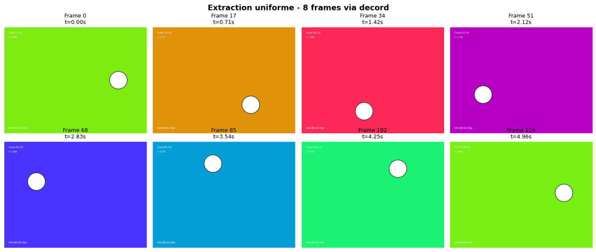
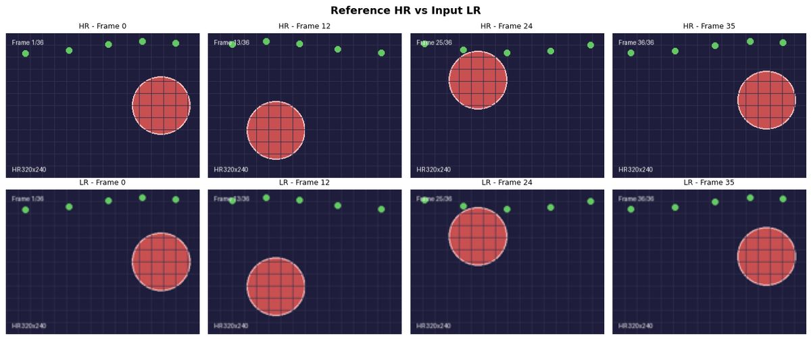
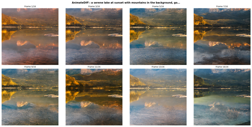
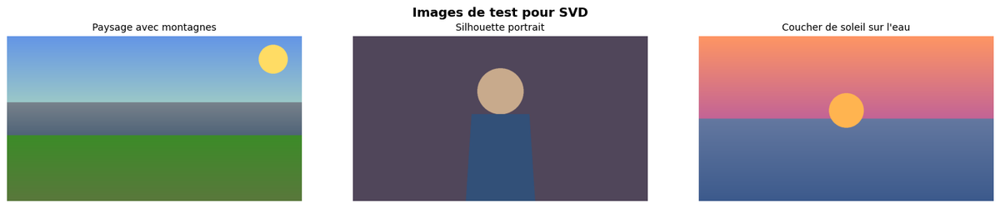
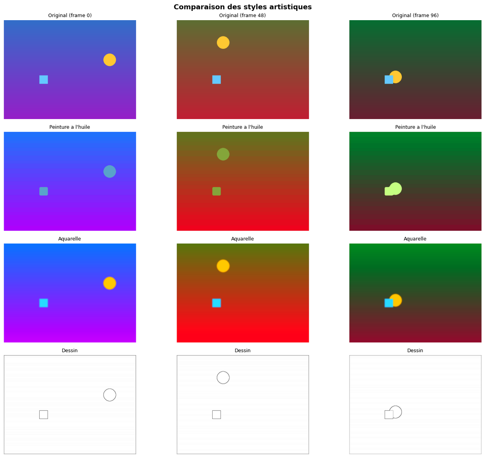
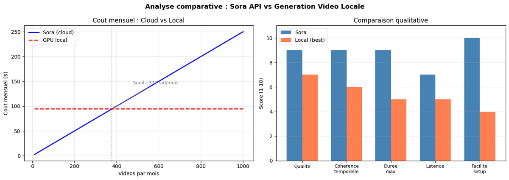
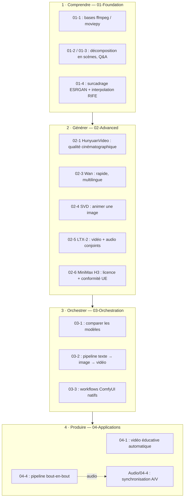

# Video - Génération et Compréhension Vidéo par IA

<!-- CATALOG-STATUS
series: GenAI-Video
pedagogical_count: 19
breakdown: Video=19
maturity: BETA=16, ALPHA=3
-->

[← Documentation GenAI](../README.md) | [↑ ..](../README.md) | [→ Audio Sync](../Audio/04-Applications/04-4-Audio-Video-Sync.ipynb)

La vidéo combine quatre difficultés simultanées que les autres modalités traitent séparément : l'analyse d'images, la compréhension du temps, la synchronisation audio, et la création de mouvement cohérent. Cette série couvre l'ensemble de la chaîne vidéo IA : compréhension de séquences existantes, génération à partir de texte ou d'images, orchestration de pipelines multi-modèles, et workflows de production. Les notebooks sont répartis sur 4 niveaux progressifs.

## Fil rouge : construire un pipeline texte vers vidéo pédagogique

L'objectif fil rouge de cette série est de construire un pipeline capable de transformer un script texte en vidéo pédagogique animée. Chaque niveau apporte une brique : compréhension vidéo pour analyser les séquences (niveau 1), modèles génératifs pour créer du mouvement (niveau 2), orchestration pour assembler le pipeline (niveau 3), et workflows de production pour le déploiement (niveau 4).

## Prérequis

### API Keys

```bash
# Dans GenAI/.env
OPENAI_API_KEY=sk-...
COMFYUI_AUTH_TOKEN=...
```

### GPU (pour notebooks locaux)

- **Minimum** : 4 GB VRAM (Real-ESRGAN, RIFE)
- **Recommandé** : 12+ GB VRAM (AnimateDiff, LTX-Video)
- **Optimal** : 24 GB VRAM (HunyuanVideo, Wan, tous les notebooks)

### FFmpeg

FFmpeg doit être installé sur le système :

```bash
# Windows (via winget)
winget install FFmpeg
```

## Progression par niveau

### 01-Foundation - Comprendre la vidéo avant de la générer

On ne peut pas créer ce qu'on ne comprend pas. Ce niveau pose les bases techniques (codecs, ffmpeg, moviepy) et introduit la compréhension vidéo par IA : décomposer une séquence en scènes, répondre à des questions sur le contenu, analyser le mouvement. Vous découvrirez aussi le surcadrage d'images (ESRGAN) et l'interpolation de frames (RIFE) pour améliorer la qualité visuelle. À la fin de ce niveau, vous savez analyser une vidéo existante et en extraire des informations structurelles.

<p align="center">
  <a href="01-Foundation/01-1-Video-Operations-Basics.ipynb"></a><br>
  <em>Sortie du notebook <a href="01-Foundation/01-1-Video-Operations-Basics.ipynb">01-1</a> : extraction uniforme de 8 frames via decord (frames 0/17/34/51/68/85/102/119 sur 4,96 s) — la bille blanche bondissante illustre la régularité de l'échantillonnage uniforme, chaque frame reposant sur un fond coloré cyclique différent pour rendre la séquence lisible visuellement.</em>
</p>

<p align="center">
  <a href="01-Foundation/01-4-Video-Enhancement-ESRGAN.ipynb"></a><br>
  <em>Sortie du notebook <a href="01-Foundation/01-4-Video-Enhancement-ESRGAN.ipynb">01-4</a> : comparaison HR vs LR à résolution identique (320×240) — la figure montre les mêmes frames dans les deux qualités, mais <strong>ne démontre pas visuellement l'upscaling</strong> ; la sortie upscalée ESRGAN est à voir dans le notebook lui-même. La figure sert ici d'<strong>input de référence</strong> pour le modèle.</em>
</p>

<p align="center">
  <a href="01-Foundation/01-5-AnimateDiff-Introduction.ipynb"></a><br>
  <em>Sortie du notebook <a href="01-Foundation/01-5-AnimateDiff-Introduction.ipynb">01-5</a> : génération AnimateDiff text-to-video (grille 2×4 frames) — paysage lacustre au coucher de soleil généré depuis le prompt « a serene lake at sunset with mountains in the background ». Le prompt est visible en haut de la figure (tronqué par la largeur d'image).</em>
</p>

| Notebook | Contenu | Service | VRAM |
|----------|---------|---------|------|
| [01-1-Video-Operations-Basics](01-Foundation/01-1-Video-Operations-Basics.ipynb) | moviepy, ffmpeg, decord, codecs | Local | 0 |
| [01-2-GPT-5-Video-Understanding](01-Foundation/01-2-GPT-5-Video-Understanding.ipynb) | GPT-5 vidéo, scènes, Q&A | OpenAI API | 0 |
| [01-3-Qwen-VL-Video-Analysis](01-Foundation/01-3-Qwen-VL-Video-Analysis.ipynb) | Qwen2.5-VL 7B local, grounding | Local GPU | ~18 GB |
| [01-4-Video-Enhancement-ESRGAN](01-Foundation/01-4-Video-Enhancement-ESRGAN.ipynb) | Real-ESRGAN, RIFE interpolation | Local GPU | ~4 GB |
| [01-5-AnimateDiff-Introduction](01-Foundation/01-5-AnimateDiff-Introduction.ipynb) | AnimateDiff, text-to-video basique | Local GPU | ~12 GB |

### 02-Advanced - Générer du mouvement à partir de texte ou d'images

Ce niveau explore les modèles génératifs vidéo : HunyuanVideo pour la qualité cinématographique (malgré ses 24 GB de VRAM), LTX-Video pour la génération rapide sur des configurations modestes, Wan pour les prompts multilingues, et Stable Video Diffusion pour animer une image existante. Chaque modèle a ses forces et ses limites — le but est de les connaître pour choisir le bon outil au bon moment. Le notebook 02-5 introduit en outre LTX-2 (Lightricks 22B), le seul modèle de la série qui génère vidéo **et audio synchronisés** en une seule passe de diffusion (quantization obligatoire : `fp8-cast` via ltx-pipelines — borderline sur 24 GB — ou GGUF Q4 via ComfyUI en production, ~14-24 GB VRAM). Le notebook 02-6 traite **MiniMax H3 (Hailuo 3.0)**, modèle omni-modal #1 au benchmark *Artificial Analysis* — mais dont la licence communautaire **exclut l'UE** (territoires exclus : UE, Royaume-Uni, Corée du Sud, États-Unis). Ce notebook sépare **deux instruments juridiques** : la licence des poids (auto-hébergement interdit en UE) et les *Terms of Service* du service cloud Hailuo (ouverts en UE). Il est donc **descriptif sur la licence** (architecture + raisonnement de conformité : vérificateur de juridiction, matrice de décision, alternatives UE) **et** pose un **loader idempotent** (Section 7) pour invoquer le service cloud — squelette sans clé, génération réelle derrière `MINIMAX_GENAI_API_KEY`. La bifurcation licence-des-poids ≠ ToS-du-service comme angle pédagogique. Le notebook 02-7 complète ce panorama avec **CogVideoX-2b** (THUDM) — modèle *text-to-video* sous **licence Apache-2.0** (vérifiée firsthand, pas de clause territoriale ni clause Outputs), qui démontre qu'on peut **réellement exécuter** un modèle vidéo open-weights propre quand la licence le permet. Le couple 02-6 (descriptif INTRINSIC, loader Section 7) + 02-7 (exécutif SOTA-OK) forme la valeur pédagogique de cette série : raisonner la conformité AVANT de coder, et basculer vers un modèle licite quand le SOTA est hors d'atteinte.

<p align="center">
  <a href="02-Advanced/02-4-SVD-Image-to-Video.ipynb"></a><br>
  <em>Le notebook <a href="02-Advanced/02-4-SVD-Image-to-Video.ipynb">02-4</a> <strong>exécute réellement</strong> Stable Video Diffusion (pipeline <code>stable-video-diffusion-img2vid-xt</code> complet, ~100 s par génération sur RTX 3090, ~10 GB VRAM) et anime ces images d'entrée. L'image ci-dessus montre les <strong>3 images sources (inputs)</strong> — paysage avec montagnes / silhouette portrait / coucher de soleil sur l'eau — ; les <strong>animations générées</strong> (contact-sheets de frames + mesure quantitative du mouvement via <code>motion_bucket_id</code>) sont visibles dans le notebook lui-même. Licence Stable Video Diffusion Community : aucune exclusion territoriale, l'utilisateur possède les outputs.</em>
</p>

| Notebook | Contenu | Service | VRAM |
|----------|---------|---------|------|
| [02-1-HunyuanVideo-Generation](02-Advanced/02-1-HunyuanVideo-Generation.ipynb) | HunyuanVideo, quantization 24GB | Local GPU | ~18 GB |
| [02-2-LTX-Video-Lightweight](02-Advanced/02-2-LTX-Video-Lightweight.ipynb) | LTX-Video, génération rapide | Local GPU | ~8 GB |
| [02-3-Wan-Video-Generation](02-Advanced/02-3-Wan-Video-Generation.ipynb) | Wan 2.1/2.2, prompts FR/EN | Local GPU | ~10 GB |
| [02-4-SVD-Image-to-Video](02-Advanced/02-4-SVD-Image-to-Video.ipynb) | Stable Video Diffusion, animation | Local GPU | ~10 GB |
| [02-5-LTX2-Audiovisual](02-Advanced/02-5-LTX2-Audiovisual.ipynb) | LTX-2 (Lightricks 22B), vidéo + audio conjoint | Local GPU | ~16-24 GB |
| [02-6-MiniMax-H3-Architecture-Licensing](02-Advanced/02-6-MiniMax-H3-Architecture-Licensing.ipynb) | MiniMax H3 : licence poids (INTRINSIC UE) + service cloud Hailuo (ouvert UE), loader idempotent | Local (analyse + squelette service key-gated) | 0 |
| [02-7-CogVideoX-Text-to-Video](02-Advanced/02-7-CogVideoX-Text-to-Video.ipynb) | CogVideoX-2b (Apache-2.0), open-weights propre, num_frames=49 natif | Local GPU | ~16 GB |

### 03-Orchestration - Combiner les modèles dans des pipelines

Un seul modèle ne suffit pas pour une production vidéo complète. Ce niveau compare les modèles entre eux, orchestre des pipelines text-to-image-to-video, et exploite ComfyUI pour des workflows natifs plus flexibles. C'est ici que le fil rouge prend forme : un script texte devient scénario, puis images, puis séquence vidéo animée.

| Notebook | Contenu | Service | VRAM |
|----------|---------|---------|------|
| [03-1-Multi-Model-Video-Comparison](03-Orchestration/03-1-Multi-Model-Video-Comparison.ipynb) | Benchmark modèles vidéo | Local GPU | ~18 GB |
| [03-2-Video-Workflow-Orchestration](03-Orchestration/03-2-Video-Workflow-Orchestration.ipynb) | Pipelines text-to-image-to-video | Mixed | ~18 GB |
| [03-3-ComfyUI-Video-Workflows](03-Orchestration/03-3-ComfyUI-Video-Workflows.ipynb) | Workflows ComfyUI natifs | ComfyUI | ~20 GB |

### 04-Applications - Du pipeline à la production

Les trois derniers notebooks et le notebook de synchronisation audio-vidéo concluent le parcours en abordant des cas d'usage réels : génération automatique de contenus éducatifs, workflows créatifs (transfert de style, clips musicaux), et l'API Sora 2 d'OpenAI pour la génération cloud. Le pipeline final intègre tout ce qui a été appris dans un système bout-en-bout.

<p align="center">
  <a href="04-Applications/04-2-Creative-Video-Workflows.ipynb"></a><br>
  <em>Sortie du notebook <a href="04-Applications/04-2-Creative-Video-Workflows.ipynb">04-2</a> : <strong>comparatif multi-styles</strong> (Original / Peinture à l'huile / Aquarelle / Dessin) sur 3 frames (t=0/48/96) — démontre la transférabilité de style sur une même scène de base (carré cyan + cercle jaune). Le style <strong>Dessin</strong> (line-art contours noirs sur blanc) offre le contraste visuel le plus tranché ; Peinture à l'huile tire vers des couleurs sourdes/vertes, Aquarelle reste proche des couleurs originales.</em>
</p>

<p align="center">
  <a href="04-Applications/04-3-Sora-API-Cloud-Video.ipynb"></a><br>
  <em>Sortie du notebook <a href="04-Applications/04-3-Sora-API-Cloud-Video.ipynb">04-3</a> : <strong>analyse comparative Sora API vs Génération Vidéo Locale (2 panneaux)</strong> — gauche : coût mensuel Cloud (Sora linéaire 0→250 $) vs Local (constant ~95 $), seuil de rentabilité à 375 vidéos/mois. Droite : comparatif qualitatif sur 5 critères (Qualité / Cohérence temporelle / Durée max / Latence / Facilité setup) où Sora gagne partout sauf « Facilité setup » (Local 4 vs Sora 10).</em>
</p>

| Notebook | Contenu | Service | VRAM |
|----------|---------|---------|------|
| [04-1-Educational-Video-Generation](04-Applications/04-1-Educational-Video-Generation.ipynb) | Vidéo éducative automatique | Mixed | ~12 GB |
| [04-2-Creative-Video-Workflows](04-Applications/04-2-Creative-Video-Workflows.ipynb) | Style transfer, music video | Mixed | ~16 GB |
| [04-3-Sora-API-Cloud-Video](04-Applications/04-3-Sora-API-Cloud-Video.ipynb) | Sora 2 API, cloud vs local | OpenAI API | 0 |
| [04-4-Production-Video-Pipeline](04-Applications/04-4-Production-Video-Pipeline.ipynb) | Pipeline complet bout-en-bout | Mixed | ~18 GB |
| [04-5-MiniMax-H3-Cloud-Video](04-Applications/04-5-MiniMax-H3-Cloud-Video.ipynb) | Hailuo API, HD/2K + audio natif, key-gated | MiniMax API | 0 |

## Recette : construire un pipeline texte vers vidéo pédagogique

Le fil rouge de cette série est la création d'un pipeline de vidéo pédagogique générée par IA. Voici comment les niveaux s'articulent :

1. **01-Foundation** (compréhension vidéo) : [01-1](01-Foundation/01-1-Video-Operations-Basics.ipynb) donne les bases techniques (ffmpeg, moviepy). [01-2](01-Foundation/01-2-GPT-5-Video-Understanding.ipynb) et [01-3](01-Foundation/01-3-Qwen-VL-Video-Analysis.ipynb) couvrent la compréhension vidéo (décomposition en scènes, Q&A). [01-4](01-Foundation/01-4-Video-Enhancement-ESRGAN.ipynb) améliore la qualité. À la fin, vous savez analyser et manipuler une vidéo existante.

2. **02-Advanced** (génération vidéo) : [02-1](02-Advanced/02-1-HunyuanVideo-Generation.ipynb) génère des vidéos haute qualité. [02-3](02-Advanced/02-3-Wan-Video-Generation.ipynb) offre une alternative rapide avec support multilingue. [02-4](02-Advanced/02-4-SVD-Image-to-Video.ipynb) anime une image existante (utile pour transformer un diagramme en animation). [02-5](02-Advanced/02-5-LTX2-Audiovisual.ipynb) est le seul à produire vidéo **et audio synchronisés** en une passe (LTX-2 22B, le plus exigeant en VRAM). [02-6](02-Advanced/02-6-MiniMax-H3-Architecture-Licensing.ipynb) étudie MiniMax H3 (modèle omni-modal #1) sous l'angle de sa **bifurcation juridique** — un cas d'école de conformité : pourquoi ce modèle ne peut pas être *auto-hébergé* en UE (licence des poids) mais reste invocable via le *service cloud* Hailuo (ToS sans exclusion UE), avec un loader idempotent Section 7 pour la génération réelle quand `MINIMAX_GENAI_API_KEY` est fournie. [02-7](02-Advanced/02-7-CogVideoX-Text-to-Video.ipynb) démontre la voie **exécutive** : CogVideoX-2b (THUDM, Apache-2.0) — modèle *text-to-video* open-weights que la famille peut effectivement faire tourner quand la licence est permissive. Le couple 02-6 + 02-7 (descriptif INTRINSIC vs exécutif SOTA-OK) illustre la méthode de raisonnement qui doit précéder tout déploiement.

3. **03-Orchestration** (assemblage) : [03-1](03-Orchestration/03-1-Multi-Model-Video-Comparison.ipynb) compare les modèles pour choisir le bon. [03-2](03-Orchestration/03-2-Video-Workflow-Orchestration.ipynb) construit le pipeline text-to-image-to-video. [03-3](03-Orchestration/03-3-ComfyUI-Video-Workflows.ipynb) utilise ComfyUI pour des workflows natifs.

4. **04-Applications** (production) : [04-1](04-Applications/04-1-Educational-Video-Generation.ipynb) applique le pipeline au contenu éducatif. [04-4](04-Applications/04-4-Production-Video-Pipeline.ipynb) assemble le système bout-en-bout. Le notebook [04-4-Audio-Video-Sync](../Audio/04-Applications/04-4-Audio-Video-Sync.ipynb) de la série Audio synchronise la vidéo avec l'audio généré.

Le schéma ci-dessous résume comment les quatre niveaux du fil rouge s'articulent : chaque niveau apporte une brique (comprendre → générer → orchestrer → produire) qui s'assemble dans le pipeline final 04-4, lui-même synchronisé à l'audio par la série Audio.



## Ce que vous saurez faire

- **Comprendre** une séquence vidéo : décomposition en scènes, Q&A sur le contenu, analyse temporelle
- **Générer** des vidéos à partir de texte ou d'images : choix du modèle adapté à votre matériel
- **Orchestrer** des pipelines multi-modèles : scénario texte vers vidéo complète
- **Produire** des contenus vidéo éducatifs ou créatifs de bout en bout
- **Comparer** les approches cloud (Sora) et locales (HunyuanVideo, Wan) en termes de qualité, coût et latence

## Technologies couvertes

| Technologie | Notebooks | Prérequis |
|-------------|-----------|-----------|
| **moviepy / FFmpeg** | 01-1 | Local |
| **OpenAI GPT-5** | 01-2 | `OPENAI_API_KEY` |
| **Qwen2.5-VL** | 01-3 | GPU ~18 GB VRAM |
| **Real-ESRGAN / RIFE** | 01-4 | GPU ~4 GB VRAM |
| **AnimateDiff** | 01-5 | GPU ~12 GB VRAM |
| **HunyuanVideo** | 02-1 | GPU ~18 GB VRAM |
| **LTX-Video** | 02-2 | GPU ~8 GB VRAM |
| **Wan 2.1/2.2** | 02-3 | GPU ~10 GB VRAM |
| **SVD** | 02-4 | GPU ~10 GB VRAM |
| **LTX-2 (Lightricks)** | 02-5 | GPU ~14-24 GB VRAM (GGUF Q4 / fp8-cast) |
| **MiniMax H3 (Hailuo 3.0)** | 02-6 | Descriptif — licence des poids exclut l'UE (bifurcation §Section 6 ; voie cloud réalisable : `04-5`) |
| **ComfyUI Video** | 03-3 | Docker, nodes vidéo |
| **OpenAI Sora 2** | 04-3 | `OPENAI_API_KEY` |
| **Hailuo Video API** | 04-5 | `MINIMAX_GENAI_API_KEY`, 5 gén/jour, HD/2K + audio stéréo natif |

## Parcours recommandé

| Objectif | Notebooks |
|----------|-----------|
| Découverte rapide | 01-1, 01-2, 01-5 |
| Génération vidéo | 01-5, 02-1 à 02-6 |
| Compréhension vidéo | 01-2, 01-3 |
| Production complète | Tous + Audio/04-4 (sync A/V) |

## FAQ

### HunyuanVideo OOM ou génération extrêmement lente

HunyuanVideo (notebook [02-1](02-Advanced/02-1-HunyuanVideo-Generation.ipynb)) est le modèle le plus gourmand de la série (~18-24 GB VRAM). Stratégies :

- Utiliser la quantization intégrée au notebook pour réduire à ~18 GB.
- Générer des clips courts (2-3 secondes) plutôt que des séquences longues.
- Si votre GPU a 12 GB ou moins, utiliser **LTX-Video** (notebook [02-2](02-Advanced/02-2-LTX-Video-Lightweight.ipynb), ~8 GB) ou **Wan** (notebook [02-3](02-Advanced/02-3-Wan-Video-Generation.ipynb), ~10 GB) comme alternatives légères.
- Fermer tous les autres processus GPU avant la génération (`nvidia-smi` pour vérifier).

### FFmpeg non trouvé ou erreurs de codec

FFmpeg est requis par moviepy (notebook [01-1](01-Foundation/01-1-Video-Operations-Basics.ipynb)) et les notebooks de production (04-4). Si erreur `FileNotFoundError: [WinError 2]` ou codec non supporté :

```bash
# Windows (via winget)
winget install FFmpeg

# Ou via conda
conda install -c conda-forge ffmpeg
```

Vérifier : `ffmpeg -version`. Si installé dans un chemin non-standard, ajouter au PATH ou configurer :

```python
import imageio_ffmpeg
ffmpeg_path = imageio_ffmpeg.get_ffmpeg_exe()
```

### Quelle différence entre Sora 2 et les modèles locaux ?

| Critère | Sora 2 (cloud) | HunyuanVideo | Wan | LTX-Video |
|---------|----------------|--------------|-----|-----------|
| **Coût** | $0.10-1.00/vidéo | Gratuit (local) | Gratuit (local) | Gratuit (local) |
| **Qualité** | Excellente | Haute | Bonne | Correcte |
| **Durée max** | 20s | 5-10s | 5-10s | 3-5s |
| **VRAM** | 0 (API) | ~18-24 GB | ~10 GB | ~8 GB |
| **Latence** | 30s-2min | 1-5min | 30s-2min | 10-30s |

Pour du prototypage ou des résultats rapides, Sora 2 (notebook [04-3](04-Applications/04-3-Sora-API-Cloud-Video.ipynb)) est idéal. Pour un contrôle fin, une production répétitive, ou des données sensibles, les modèles locaux sont indispensables.

### Pourquoi le notebook MiniMax H3 (02-6) n'auto-héberge-t-il pas le modèle ?

MiniMax H3 (Hailuo 3.0) est techniquement excellent (#1 video editing au benchmark *Artificial Analysis*, omni-modal, audio natif), mais **deux instruments juridiques distincts** gouvernent son usage, et le notebook les sépare honnêtement :

- **La *MiniMax H3 Community License*** (les **poids** téléchargeables) exclut l'UE, le Royaume-Uni, la Corée du Sud et les États-Unis des territoires autorisés. Cette restriction couvre les poids **et les Outputs** générés par *votre propre exécution* des poids — y compris via un *Hosted Service* que **vous** exploiteriez. Aucune exception éducation/recherche n'est prévue. → **Auto-hébergement en UE = INTERDIT** (verdict INTRINSIC, définitif sans licence commerciale).
- **Les *Terms of Service* de la plateforme Hailuo** (le **service cloud** hébergé par MiniMax, souscrit et facturé) sont un **second instrument** : un consommateur qui ne télécharge jamais les poids n'accepte pas la Community License. Lus *firsthand*, ces ToS ne contiennent **aucune exclusion UE** et ne restreignent pas territorialement l'affichage des Outputs. → **Service cloud souscrit depuis la France = ouvert**.

Le notebook [02-6](02-Advanced/02-6-MiniMax-H3-Architecture-Licensing.ipynb) livre donc **deux voies** : (1) une **étude descriptive** de l'architecture + raisonnement de conformité (vérificateur de juridiction, matrice de décision, alternatives UE) pour la licence des poids, et (2) un **loader idempotent** (Section 7) pour invoquer le service cloud Hailuo — squelette exécutable sans clé, génération réelle activée par `MINIMAX_GENAI_API_KEY` derrière un flag (idempotence obligatoire : 5 générations/jour, la ré-exécution ne rebrûle jamais le quota). L'alternative UE **auto-hébergeable** pédagogiquement équivalente pour « vidéo + audio natif » reste **LTX-2** (notebook [02-5](02-Advanced/02-5-LTX2-Audiovisual.ipynb), licence permissive, exécutable).

### Les vidéos générées manquent de cohérence temporelle

La cohérence entre les frames est le défi principal de la génération vidéo. Le flickering, les objets qui apparaissent/disparaissent, ou les mouvements irréalistes sont fréquents, surtout avec les modèles les plus légers. Mitigation :

- Limiter la durée à 3-5 secondes pour les modèles légers (LTX, AnimateDiff).
- Utiliser des prompts simples et descriptifs plutôt que narratifs.
- HunyuanVideo et Wan offrent une meilleure cohérence temporelle que LTX-Video.
- Le pipeline ComfyUI (notebook [03-3](03-Orchestration/03-3-ComfyUI-Video-Workflows.ipynb)) permet de contrôler finement les paramètres de génération (CFG, steps, seed).
- L'upscaling ESRGAN + interpolation RIFE (notebook [01-4](01-Foundation/01-4-Video-Enhancement-ESRGAN.ipynb)) améliore la qualité visuelle a posteriori.

### ComfyUI Video retourne des erreurs de nœuds manquants

Les workflows vidéo ComfyUI (notebook [03-3](03-Orchestration/03-3-ComfyUI-Video-Workflows.ipynb)) nécessitent des nœuds spécifiques (AnimateDiff, SVD, HunyuanVideo) qui ne sont pas dans l'installation de base de ComfyUI. Si erreur `Node not found` :

```bash
# Vérifier les nœuds installés
ls ComfyUI/custom_nodes/

# Installer les nœuds vidéo manquants
cd ComfyUI/custom_nodes/ && git clone <node-repo-url>
```

Les conteneurs Docker CoursIA incluent déjà les nœuds nécessaires. Si vous utilisez une installation ComfyUI propre, vérifier que les custom nodes vidéo sont installés.

### GPT-5 Video Understanding échoue sur les vidéos longues

L'API GPT-5 vidéo (notebook [01-2](01-Foundation/01-2-GPT-5-Video-Understanding.ipynb)) a des limites sur la durée et la taille des fichiers envoyés. Si erreur 413 ou timeout :

- Découper la vidéo en segments de 30-60 secondes avec moviepy (notebook [01-1](01-Foundation/01-1-Video-Operations-Basics.ipynb)).
- Compresser avant envoi : résolution 720p, bitrate réduit.
- Utiliser le modèle local Qwen2.5-VL (notebook [01-3](01-Foundation/01-3-Qwen-VL-Video-Analysis.ipynb)) pour les vidéos longues ou sensibles, sans limite de taille.

## Licence

Voir la licence du repository principal.
