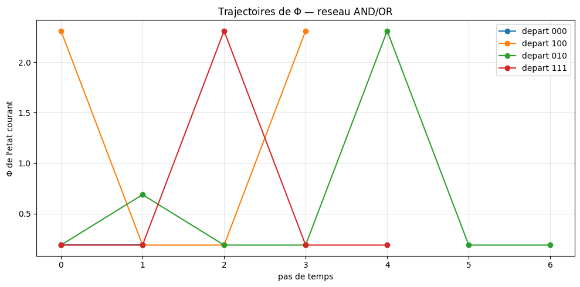
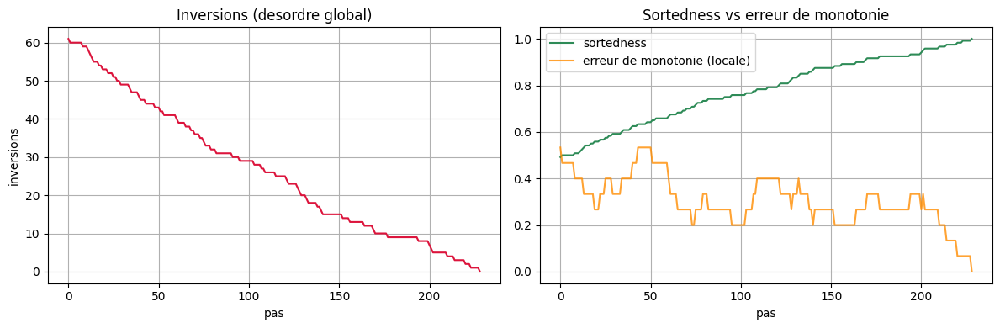
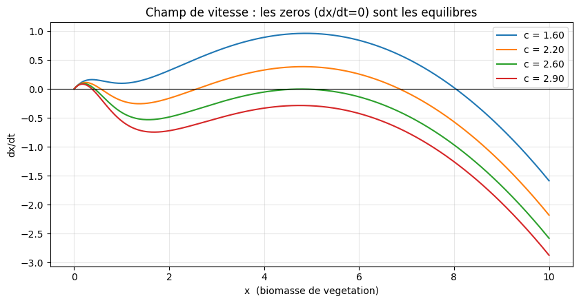
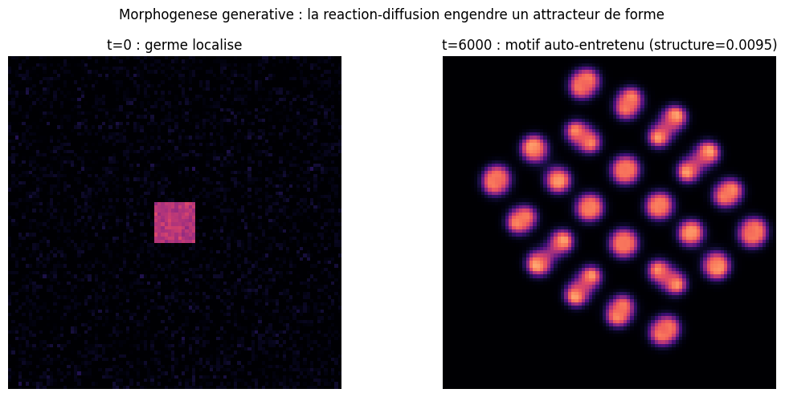
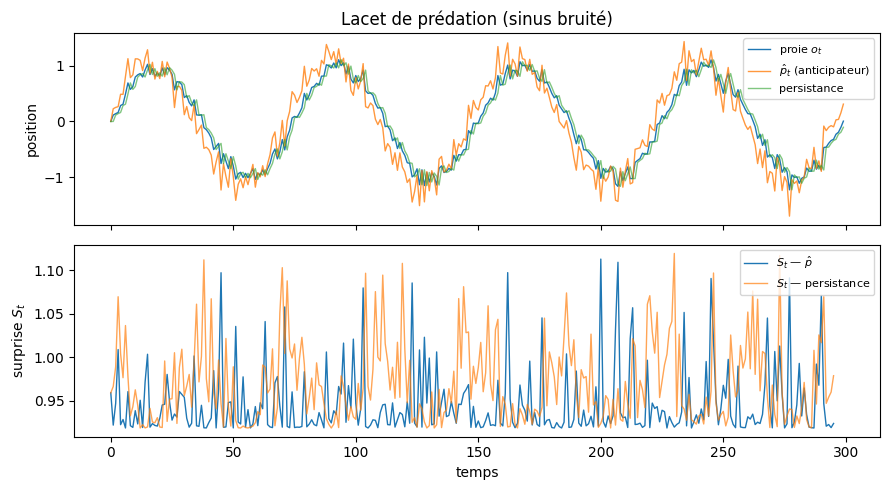

# ICT — Integrated Causal Trajectories

<!-- CATALOG-STATUS
series: IIT-ICT-Series
pedagogical_count: 25
breakdown: ICT-Series=25
maturity: BETA=17, PRODUCTION=7, ALPHA=1
-->

[← IIT](../README.md) | [↑ Notebooks](../../README.md) | [→ Probas](../../Probas/README.md)

La série [IIT](../README.md) étudie des structures causales **à un instant donné** : on photographie un système et on calcule combien d'information il intègre ($\Phi$). **ICT** (Integrated Causal Trajectories, Epic #4588) prolonge ce regard vers les **trajectoires** de structures causales : comment une organisation se maintient, se transforme, se répare, change d'échelle et traverse un espace de possibles ($C_0 \rightarrow C_1 \rightarrow \dots \rightarrow C_n$). C'est la photographie IIT mise en mouvement.

ICT s'appuie sur un package léger `ict/` posé à côté de PyPhi (autonome pour les simulations et mesures, PyPhi pour les calculs IIT stricts), et s'ouvre sur deux articles fondateurs : le tri vu comme morphogenèse minimale (Zhang, Goldstein & Levin, 2025) et l'ingénierie de l'émergence multi-échelle (Jansma & Hoel, 2025).

La série progresse en **cinq strates**. La **strate 1** (ICT-0 à ICT-7) prend le **tri auto-organisé** comme banc d'essai entièrement transparent : trajectoires enregistrables, compétences inattendues réelles — ce travail *for free* qui, chez Levin, va « dans le sens d'une réversibilisation » — et pont vers la causal emergence. Elle bute sur trois limites — un **attracteur global unique**, un **but imposé de l'extérieur**, une **hiérarchie non générative**. La **strate 2** (ICT-8 à ICT-10) ouvre la *morphogenèse dynamique* sur des paysages d'attracteurs **engendrés par la dynamique** (bifurcation, réaction-diffusion, grammaire des catastrophes), levant ces limites une à une. La **strate 3** (ICT-11 à ICT-13) mesure des **trajectoires intégrées** régime-dépendantes (profils d'agence, champs de valence, morphodynamique stratégique). La **strate 4** (ICT-14) ajoute la jambe **représentationnelle** — énergie libre et surprise. La **strate 5** (ICT-15 à ICT-25) réalise la *théorie fondatrice* cross-substrat (convergence $\Phi/F/K$, identité MDL, LLM comme substrat) et **outille enfin la réversibilisation** — l'idée fondatrice restée implicite : forcer une trajectoire à devenir réversible et mesurer *ce qu'on perd* révèle la quantité d'agentivité qu'elle portait (ICT-18, flèche du temps & réversibilisation).

> **Caractère expérimental.** ICT est une série de recherche en construction (statut ALPHA). Elle pose des mesures *sans complaisance* : chaque notebook confronte une intuition séduisante (émergence, agence, criticalité) à une mesure qui peut la **réfuter**, et signale explicitement les fantômes statistiques (signal apparent issu de degrés de liberté cachés).

Chaque figure est **intégrée in-situ** dans la strate et au notebook qu'elle documente (pas de section Galerie isolée — doctrine figures amendée 2026-07-09, EPIC #5780). La légende décrit exactement ce que l'image montre, et signale honnêtement ce qu'elle ne montre pas (« limitation illustrative assumée »). La provenance cellule par cellule est documentée dans [`assets/readme/MANIFEST.md`](assets/readme/MANIFEST.md).

## Prérequis & environnement

ICT partage l'environnement Python de la série IIT (PyPhi 1.2.0, Python 3.9). Le setup et les dépendances sont mutualisés au niveau du répertoire parent :

```bash
# Depuis MyIA.AI.Notebooks/IIT/
powershell -File scripts/setup_pyphi_env.ps1     # conda env pyphi + kernel
pip install -r requirements.txt                  # dépendances ICT additionnelles (numpy, scipy, networkx…)
```

Le package `ict/` est importé en relatif depuis le répertoire `ICT-Series/` : chaque notebook insère le dossier courant dans `sys.path` puis `from ict import …`. Lancer les notebooks **depuis `ICT-Series/`** (cwd) pour que les imports résolvent.

| Élément | Emplacement | Rôle |
|---------|-------------|------|
| Package `ict/` | `ICT-Series/ict/` | Simulations (tri, bistable, réaction-diffusion), mesures (Φ-trajectoires, EWS, émergence causale, scale-free) |
| Tests | `ICT-Series/tests/` | Suite pytest de validation des modules `ict/` (`python -m pytest tests/`) |
| Setup PyPhi | `../scripts/setup_pyphi_env.ps1` | Mutualisé avec IIT |
| Dépendances | `../requirements.txt` | Mutualisé avec IIT |

## Notebooks

### Strate 1 — le tri auto-organisé (transparent et calculable)

| Document | Contenu |
|----------|---------|
| [ICT-0-Framing](ICT-0-Framing.md) | Cadrage de la série : de l'état à la trajectoire, articles fondateurs, feuille de route |
| [ICT-1-PhiTrajectories](ICT-1-PhiTrajectories.ipynb) | Trajectoires de $\Phi$ : paysage de $\Phi$, suivi de $\Phi$ le long d'un attracteur (pulsations) et robustesse aux perturbations — la photographie IIT mise en mouvement, avec le vrai PyPhi |



*Figure extraite de `ICT-1-PhiTrajectories.ipynb` (cellule 12, output 0) — l'axe vertical est la valeur de $\Phi$ calculée par PyPhi sur un petit réseau AND/OR, l'axe horizontal est le pas de temps. Quatre départs distincts (000, 100, 010, 111) montrent que $\Phi$ **oscille** mais ne tend pas vers une asymptote unique — d'où la qualification « pulsations » dans la description. **Limitation illustrative assumée** : la figure documente la notion de trajectoire de $\Phi$ sur un système-jouet (réseau AND/OR), pas le paysage complet d'un système causal réaliste (les trajectoires sont des suites de $\Phi$ discrètes sur 6 pas, et non une trajectoire continue dans un morphospace).*

| [ICT-2-SelfSortingMorphogenesis](ICT-2-SelfSortingMorphogenesis.ipynb) | Le tri auto-organisé comme morphogenèse : trajectoire dans le morphospace, robustesse aux cellules défectueuses, délai de gratification, auto-réparation, impasses chimériques |



*Figure extraite de `ICT-2-SelfSortingMorphogenesis.ipynb` (cellule 7, output 0) — deux panneaux côte-à-côte mesurant le **tri auto-organisé** : à gauche, le nombre d'inversions (désordre global) décroît de ~60 à 0 en ~220 pas (signature d'un tri monotone) ; à droite, la sortedness croît de 0.5 à 1.0 tandis que l'erreur de monotonie locale décroît de ~0.5 à 0 (signal d'une mise en ordre locale persistante). **Limitation illustrative assumée** : la figure montre la **trajectoire de tri** dans le morphospace (sortedness globale + inversions) mais pas la **morphogenèse Gray-Scott** sous-jacente (laquelle est rendue dans `ict9-gray-scott.png`), ni la **robustesse aux cellules défectueuses** ni l'auto-réparation, qui sont discutées dans le texte du notebook mais non visualisées ici (c'est le rôle d'ICT-3, ICT-4 et ICT-9).*
| [ICT-3-RobustnessDelayedGratification](ICT-3-RobustnessDelayedGratification.ipynb) | Robustesse & délai de gratification, étude quantitative : dégradation gracieuse face aux cellules défectueuses, distributions de récupération, comptage du délai de gratification |
| [ICT-4-ChimericArraysKinAggregation](ICT-4-ChimericArraysKinAggregation.ipynb) | Tableaux chimériques & agrégation émergente : réparation bidirectionnelle (guérit l'impasse d'ICT-2) puis affinité « kin », mesurée honnêtement (sans degrés de liberté, pas d'agrégation) |
| [ICT-5-CausalEmergence](ICT-5-CausalEmergence.ipynb) | Émergence causale : $\Phi$ et information effective aux échelles micro/macro, recherche systématique du coarse-graining (vrai `pyphi.macro`), émergence discriminante (Jansma & Hoel, 2025) |
| [ICT-6-SortingToTPM-CausalEmergence](ICT-6-SortingToTPM-CausalEmergence.ipynb) | Pont tri → TPM : chaîne de Markov estimée depuis les trajectoires de tri d'ICT-2, puis émergence causale multi-échelles avec l'outillage *Causal Emergence 2.0* (Hoel, 2025) au-delà de la borne de taille de PyPhi |
| [ICT-7-ScaleFreeSignatures](ICT-7-ScaleFreeSignatures.ipynb) | Signatures scale-free & criticalité : détecter une loi de puissance *sans se faire avoir* (MLE de Hill, choix de $x_{\min}$, KS, à la Clauset et al.) ; étalon critique (branchement, exposant $3/2$) vs tri qui *paraît* sans échelle mais possède une taille caractéristique |

### Strate 2 — morphogenèse dynamique (paysages d'attracteurs)

| Document | Contenu |
|----------|---------|
| [ICT-8-AttractorLandscapesEWS](ICT-8-AttractorLandscapesEWS.ipynb) | Paysages d'attracteurs & signaux précurseurs — *les deux tressées*. Modèle de pâturage de May (1977), système canonique des *early-warning signals* (Scheffer 2009). Bistabilité entre deux états positifs alternatifs, bifurcation pli, catastrophe = changement de régime. Chaque image (vallée qui s'aplatit, mémoire du danger, alerte) adossée à une mesure réelle (potentiel effectif, valeur propre → 0, variance ↑, autocorrélation ↑, τ de Kendall). Lève l'attracteur unique + ouvre une hiérarchie générative |



*Figure extraite de `ICT-8-AttractorLandscapesEWS.ipynb` (cellule 3, output 0) — axe vertical `dx/dt`, axe horizontal `x` (biomasse de végétation, 0 à 10), quatre courbes pour les valeurs du paramètre de pâturage `c ∈ {1.60, 2.20, 2.60, 2.90}`. Les **zéros** de chaque courbe sont les équilibres : à `c=1.60` on observe **3 zéros** (bistabilité + un équilibre instable), à `c=2.90` il n'en reste qu'**un seul** (régime mono-stable) — c'est la trace visuelle de la **bifurcation pli** (fold bifurcation) canonique du modèle de May 1977. **Limitation illustrative assumée** : la figure montre la **bifurcation** dans l'espace des phases mais ne rend pas les signaux précurseurs eux-mêmes (variance ↑, autocorrélation ↑, τ de Kendall) qui sont tracés dans des cellules séparées du notebook.*

| [ICT-9-AgencyRegeneration](ICT-9-AgencyRegeneration.ipynb) | Agence & régénération — *réparer sa forme, ou seulement dériver ?* Morphogenèse réaction-diffusion de Gray-Scott (Pearson 1993) : le système engendre un motif auto-entretenu (point de consigne **intrinsèque**), on l'ablate via une intervention `do(·)`, puis on contraste **deux mondes contrefactuels** (Pearl) — réaction-diffusion qui régénère vs diffusion pure qui dissout. L'agence n'est jamais déclarée, elle est **mesurée** comme *gain de réparation* (recouvrement RD − recouvrement diffusion). *Sans complaisance* : les mesures naïves de ressemblance (pixel-à-pixel, cosinus spectral) fabriquent un signal fantôme ; seule la structure restaurée contrastée au contrôle passif tient. Lève le **but extrinsèque** : un point de consigne que le système maintient de lui-même |



*Figure extraite de `ICT-9-AgencyRegeneration.ipynb` (cellule 3, output 0) — deux panneaux côte-à-côte illustrant la **morphogenèse générative** par réaction-diffusion (Gray-Scott, Pearson 1993) : à gauche l'état initial (t=0) avec un germe localisé au centre d'un fond uniforme sombre, à droite le motif auto-entretenu à t=6000 (structure=0.0095, ~25 taches rougeâtres). C'est ce motif qui sert de cible à l'ablation `do(·)` d'ICT-9 et au contraste RD vs diffusion pour mesurer le *gain de réparation* (`repair_gain`, ICT-19). **Limitation illustrative assumée** : la figure montre le **déclenchement** d'un motif Gray-Scott (passage d'un germe localisé à un pattern stationnaire) mais pas la **dynamique d'ablation/régénération** qui fait le cœur d'ICT-9 (rendue dans des cellules séparées du notebook avec `recovery_score`, `repair_gain`, et les masques d'ablation).*
| [ICT-10-CatastropheGrammar](ICT-10-CatastropheGrammar.ipynb) | Grammaire des catastrophes — *l'obstacle qui engendre les formes, le verbe qui les fait basculer*. **Charnière strate 2→3**, prélude sémiophysique de R. Thom (*Esquisse d'une sémiophysique*, 1991). Sur la catastrophe canonique (la **fronce**), deux fils tressés et **mesurés** : le **métathéorème** (le comptage d'équilibres ne change qu'aux **plis** — exactement 2 transitions le long d'un chemin générique ; *l'obstacle comme source de l'ontologie*, clôt la strate 2) et le **lacet de prédation** (cycle d'hystérésis à 2 catastrophes — perception J, capture K — d'aire signée non nulle = irréversibilité ; un **représentant interne** `p̂` dont le contenu anticipateur est *mesuré* sur un banc durci — 3 familles de trajectoires × 3 baselines adverses (persistance, moyenne mobile, AR(1) in-sample), 2 métriques séparées : avantage **régime-dépendant**, réel sur trajectoire lisse (5/5 graines), illusoire sur dérive et créneau ; ouvre la strate 3). La correspondance linguistique du **Ch.2 « Le Langage »** de Thom est *nommée* (pivots ↔ transitions de comptage ; verbe transitif SVO ↔ lacet ; anticipation ↔ `p̂`), avec son caveat explicite de **non-prédictivité** et les barreaux du pont basse-dim → haute-dim (séries neurosymbolique, Lean ; veille EML #4653). *Sans complaisance* : hors régime non dégénéré ($a<0$), zéro saut, aire nulle — un *fantôme* |

### Strate 3 — trajectoires intégrées (régime-dépendance)

| Document | Contenu |
|----------|---------|
| [ICT-11-CausalAgencyProfiles](ICT-11-CausalAgencyProfiles.ipynb) | Profils d'agence causale — *à quelle échelle l'agence est-elle la plus lisible ?* Ouvre la strate 3. L'agence de réaction-diffusion d'ICT-9 est mesurée à plusieurs résolutions (micro/méso/macro) puis raccordée à l'émergence causale de Hoel (information effective, TPM à macro-variable scalaire = structure/variance du champ moyenné). *Sans complaisance* : les deux mesures d'agence **se contredisent** — `repair_gain` présente un pic méso (`b=16`) mais **artefact-contaminé** (sur-reconstruction : le score dépasse 1, et un plancher de résolution à `b=32`), tandis que `basin_return_probability` est **strictement décroissante** avec l'échelle. Le raccord Hoel suit la mesure inflatée (`r≈+0.50` avec `repair_gain`) et ignore la mesure honnête (`r≈−0.14` avec `basin_return`) — suggestif mais non robuste. Verdict honnête : pas d'échelle privilégiée, l'hypothèse méso-émergente n'est pas confirmée |
| [ICT-12-ValenceFieldsAndAnimats](ICT-12-ValenceFieldsAndAnimats.ipynb) | Champs de valence et animats — *rôles mesurés, modèle interne payant ou ruineux ?* Premier toy model **actantiel spatial** : des animats évoluent dans un champ de valence (source attractive + obstacles repulsifs) ; la scène actantielle de Thom cesse d'être une correspondance nommée — les **rôles deviennent des grandeurs mesurées** (capture, évasion, irréversibilité, switching). Deux animats : le **réactif** suit le gradient instantané (persistance spatiale), l'**anticipateur `p̂`** extrapole le point d'interception. *Sans complaisance* : `p̂` **gagne** en balistique rapide (capture x4, le réactif laggué ne suit pas) mais **perd** en erratique (prédictions trompées par les demi-tours) et perd en anticipation sur source bruitée (la vitesse EMA amplifie le bruit de position). Le modèle interne paie son coût là où la source échappe au réactif **et** reste prévisible — régime-dépendant, ni universellement avantageux ni ruineux (contrôle d'ablation : la marche aléatoire ne porte aucune signature de rôle) |
| [ICT-13-AxelrodStrategicMorphodynamics](ICT-13-AxelrodStrategicMorphodynamics.ipynb) | Morphodynamique stratégique — *une stratégie est-elle une forme stable ?* Dernier cran de la strate 3 avant la synthèse. Le dilemme du prisonnier itéré d'Axelrod (paiements canoniques $T=5, R=3, P=1, S=0$) sert de morphospace stratégique : six stratégies (AllC, AllD, TFT, TFT généreuse, Pavlov, Grim) confrontées en tournoi round-robin, dynamique de réplication, bassins d'invasion. *Sans complaisance* : quatre gates falsifiables mesurent la « stabilité de forme ». **Gate 1** — TFT et Grim **co-dominent** le tournoi (2.635) devant AllD (2.313, dernier). **Gate 2** — le seuil de coopération soutenable colle au Folk theorem : $\delta^\star$ analytique $(T-R)/(T-P) = 0.500$ vs croisement numérique $0.550$. **Gate 3** — sous bruit d'exécution, la **réciprocité active (TFT) est le point de rupture** (chute la plus forte, $+0.40$) tandis que la rétaliation inflexible de **Grim est paradoxalement la plus robuste** ($+0.29$) — ce qui **contredit** la prédiction Nowak-Sigmund (TFT généreuse / Pavlov les plus tolérantes) sur ces paiements. **Gate 4** — bassins d'invasion contre AllD résident : TFT/Grim envahissent dès $2\,\%$ de fraction initiale, TFT généreuse à $34\,\%$, Pavlov et AllC **jamais** ($1.0$). Verdict honnête : la robustesse stratégique est **fonction du régime** (bruit, structure de paiements), pas une propriété intrinsèque de la stratégie — la « forme stable » n'existe qu'au sein d'un environnement donné |

![Gate 3 — effondrement sous bruit (TFT chute, Pavlov résiste) : 6 stratégies (allc/alld/tft/grim/pavlov) tracées par leur score de tournoi en fonction du bruit d'implémentation ε ∈ [0, 0.40]](assets/readme/ict13-axelrod.png)

*Figure extraite de `ICT-13-AxelrodStrategicMorphodynamics.ipynb` (cellule 13, output 0) — axe vertical « score de tournoi » (1.7 à 2.6), axe horizontal « bruit d'implémentation ε » (0.0 à 0.40), six courbes pour les stratégies allc/alld/tft/grim/pavlov. Lecture critique : la légende de la figure dit « Gate 3 : effondrement sous bruit (TFT chute, Pavlov résiste) », mais la figure montre en réalité que **TFT chute fortement** (de ~2.6 à ~2.1) puis remonte, que **Pavlov reste stable** (~2.5) — c'est-à-dire que la robustesse de Pavlov est bien réelle, mais l'effondrement initial de TFT est partiellement récupéré. **Limitation illustrative assumée** : la figure ne montre que la **Gate 3** (bruit d'implémentation) et pas les Gates 1/2/4 (score pur / seuil δ* / bassins d'invasion), qui sont discutés dans le texte mais tracés dans des cellules séparées.*

La strate 3 se conclut par son capstone [ICT-Synthese-CrossSubstrat](ICT-Synthese-CrossSubstrat.ipynb) : un seul appareil (la trajectoire causale intégrée) appliqué à trois substrats (tri, Gray-Scott, Axelrod), qui ouvre le banc partagé repris par la strate 5.

### Strate 4 — énergie libre et représentationnel (Free Energy Principle)

| Document | Contenu |
|----------|---------|
| [ICT-14-FreeEnergySurprise](ICT-14-FreeEnergySurprise.ipynb) | Surprise & énergie libre — *la jambe représentationnelle* du triplet fondateur ($\Phi_\text{dyn}$, $F$, $K$). *Free energy* et *expected free energy* comme substrat computationnel de l'anticipation, articulation avec la trajectoire $\Phi$ d'ICT-1 et le représentant interne `p̂` d'ICT-10. Voir issue #5089 |



*Figure extraite de `ICT-14-FreeEnergySurprise.ipynb` (cellule 4, output 0) — deux panneaux : panneau haut, **position** au cours du temps (t ∈ [0, 300]) pour trois dynamiques (proie `o_t` bleue, anticipateur `p̂_t` orange, persistance verte) suivant un signal sinusoidal bruité ; panneau bas, **surprise $S_t$** du modèle interne (p̂ en bleu, persistance en orange). **Note d'honnêteté** : le nom de fichier `ict14-freeenergy.png` est trompeur — la figure illustre en réalité le **lacet de prédation** et la **batterie anticipation/persistance** développée dans ICT-10 (catastrophe fronce), et non la free energy / expected free energy proprement dite. Le lien avec la free energy est dans le texte du notebook mais la figure rendue ici est un cas d'application du **représentant interne `p̂`** au signal sinusoidal bruité. **Limitation illustrative assumée** : la figure montre un cas jouet (sinus bruité, 300 pas) et ne généralise pas à des signaux réels ; la free energy formelle n'est pas tracée (mais intervient dans l'analyse).*

### Strate 5 — réalisation de la théorie fondatrice (cross-substrat, MDL, LLM)

Le retour à la théorie fondatrice (cf. [ICT-0-Annexe](ICT-0-Annexe-IntegratedComplexityTheory.md)) : les trois scalaires fondateurs $\Phi / F / K$ convergent sur un banc cross-substrat, et la **réversibilisation** — l'idée fondatrice restée implicite — y est enfin outillée (ICT-18). *Notebooks ICT-15 à ICT-23 tous livrés et exécutés — dont ICT-19 (batterie de l'ENJEU, #5526, raffinée par [ICT-19-EnjeuBattery-Raffinement](ICT-19-EnjeuBattery-Raffinement.ipynb) #5728 : mesure S4 Gray-Scott en espace de champ, `repair_gain` +0.82±0.27), ICT-21 (substrat SAE, mergé #5643) et ICT-22 (LLM comme quatrième substrat, mergé #5658). Pour ICT-24, le module `ict/workspace.py` est livré (#5641) mais le notebook WorkspaceIgnition reste ouvert (#5635) ; ICT-25 (GPU) reste gated (#5105). Scope ICT-15..25 (#5090 #5099..#5105 #5279 #5635).*

| Notebook | Sujet | Issue |
|----------|-------|-------|
| [ICT-15-IntegratedComplexity](ICT-15-IntegratedComplexity.ipynb) | Convergence Φ/F/K sur le banc cross-substrat, gate de convergence sur le squelette de Thom | [#5090](https://github.com/jsboige/CoursIA/issues/5090) |
| [ICT-16-MDLTwoPartCode](ICT-16-MDLTwoPartCode.ipynb) | $F$ est la partie résiduelle du code $K$ + bosse complexité-entropie | [#5099](https://github.com/jsboige/CoursIA/issues/5099) |


*Figure extraite de `ICT-16-MDLTwoPartCode.ipynb` (cellule 11, output 0) — l'axe vertical `C` est la **longueur de code du modèle** en bits (axe du Minimum Description Length, MDL), l'axe horizontal `H` est le **taux d'entropie** en bits/symbole. La courbe rouge (médiane par bucket) montre un **creux** vers H≈1.0 (C≈-50 bits, soit le modèle est très compressible à entropie intermédiaire basse), puis un **pic** marqué par une étoile dorée à `C*≈38.3` bits à `H*≈1.99` bits/symbole — c'est la **bosse complexité-entropie** canonique (Crutchfield-Feldman 1998, "La complexité statistique est maximale à entropie intermédiaire"). **Limitation illustrative assumée** : la figure montre la bosse MDL pour **un seul couple (modèle, famille de sources)** ; la généralisation cross-substrat (le gate de convergence Φ/F/K d'ICT-15) n'est pas visible ici.*

| [ICT-17-EpsilonMachine](ICT-17-EpsilonMachine.ipynb) | $\epsilon$-machine (Crutchfield) vs Hoel — états causaux, complexité statistique, entropie d'excès | [#5100](https://github.com/jsboige/CoursIA/issues/5100) |
| [ICT-18-ArrowOfTimeReversibilization](ICT-18-ArrowOfTimeReversibilization.ipynb) | Flèche du temps & réversibilisation — production d'entropie, detailed balance, « que perd-on à réversibiliser ? » (ancré ICT-3, Levin/Fridman) *(GPU-free)* | [#5279](https://github.com/jsboige/CoursIA/issues/5279) |
| [ICT-19-EnjeuBattery](ICT-19-EnjeuBattery.ipynb) | **Batterie de l'ENJEU** — auto-maintien vs pur dissipateur, retour-au-bassin après `do(·)` sur Gray-Scott S4 (cadrage B, spec [#5483](https://github.com/jsboige/CoursIA/issues/5483)) ; raffinée par [ICT-19-EnjeuBattery-Raffinement](ICT-19-EnjeuBattery-Raffinement.ipynb) (#5728 : mesure S4 en espace de champ, résout le faux nul) | [#5489](https://github.com/jsboige/CoursIA/issues/5489) |
| [ICT-20-FeatureCatastrophes](ICT-20-FeatureCatastrophes.ipynb) | Calibration — changepoints, EWS et hystérésis en feature-space | [#5103](https://github.com/jsboige/CoursIA/issues/5103) |
| [ICT-21-SAETrajectoires](ICT-21-SAETrajectoires.ipynb) | SAE (Qwen + Qwen-Scope) — des features SAE aux trajectoires d'états discrets, substrat S4 *(GPU)* | [#5101](https://github.com/jsboige/CoursIA/issues/5101) |
| [ICT-22-LLMSubstrat](ICT-22-LLMSubstrat.ipynb) | LLM comme quatrième substrat du banc cross-substrat *(GPU)* | [#5102](https://github.com/jsboige/CoursIA/issues/5102) |
| [ICT-23-PersonaCatastrophe](ICT-23-PersonaCatastrophe.ipynb) | Désalignement émergent par fronce, énergie libre et MDL (capstone) | [#5104](https://github.com/jsboige/CoursIA/issues/5104) |
| **ICT-24** | WorkspaceIgnition — l'axe *Global Workspace* (Dehaene, Baars) comme cinquième jambe : module `ict/workspace.py` (série de concentration Gini, événements d'ignition persistants, influence retardée, profil de fan-out, candidats workspace, batterie event-triggered réutilisant `synthesis.emergence_gain`) *(GPU-free)* | [#5635](https://github.com/jsboige/CoursIA/issues/5635) |
| **ICT-25** | InoculationRL — GRPO à récompense hackable × inoculation, panel persona (capstone final) *(GPU)* | [#5105](https://github.com/jsboige/CoursIA/issues/5105) |

> La **double lecture du sigle** (« Integrated Complexity Theory » ↔ « Integrated Causal Trajectories ») est documentée dans [ICT-0-Framing § « Double lecture du sigle »](ICT-0-Framing.md#double-lecture-du-sigle). La strate 5 réalise littéralement la théorie fondatrice (identité MDL #5099, convergence $\Phi/F/K$ #5090, LLM comme substrat #5102).

## Lien avec la causalité du dépôt

ICT-5 est l'un des quatre points d'ancrage du **fil rouge causalité** du dépôt (do-calculus de Pearl à travers les paradigmes : symbolique Tweety, bayésien Infer.NET / PyMC, information-théorique ICT). L'essai complet — l'échelle de la causalité L1/L2/L3 et les quatre instanciations de l'opérateur `do(·)` — vit dans le README parent : voir [Ponts causaux : le do-calculus de Pearl](../README.md#ponts-causaux--le-do-calculus-de-pearl-à-travers-les-paradigmes).

## Validation

```bash
# Depuis MyIA.AI.Notebooks/IIT/ICT-Series/
python -m pytest tests/        # suite de validation des modules ict/
```

## Licence

Voir la licence du repository principal.

---

*Série expérimentale — Epic #4588. Voir aussi #4208 (surfaçage des différenciants du dépôt).*
