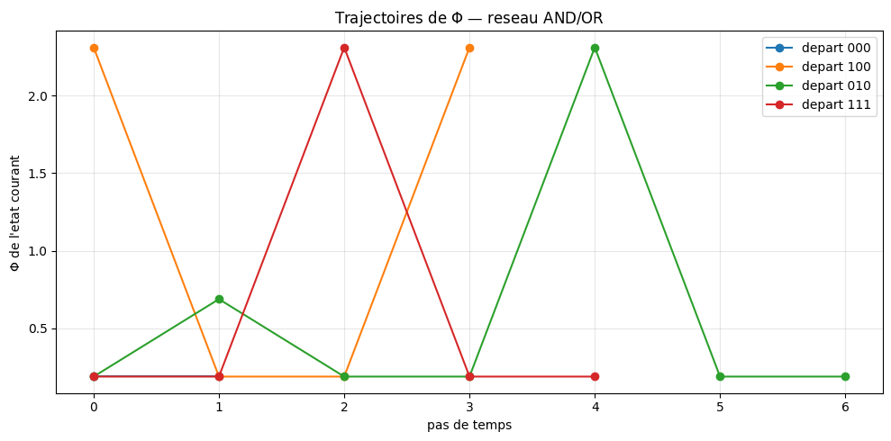
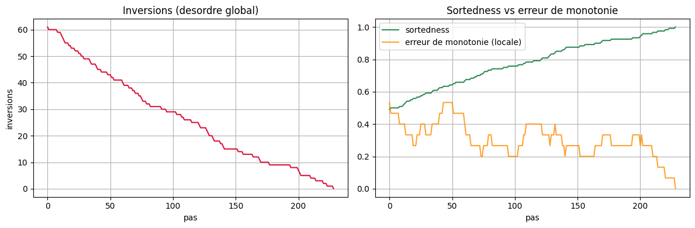
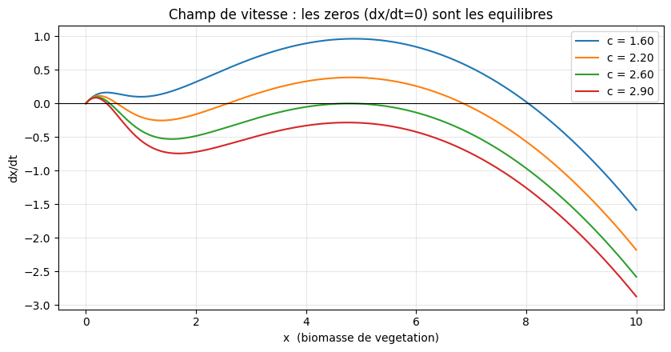
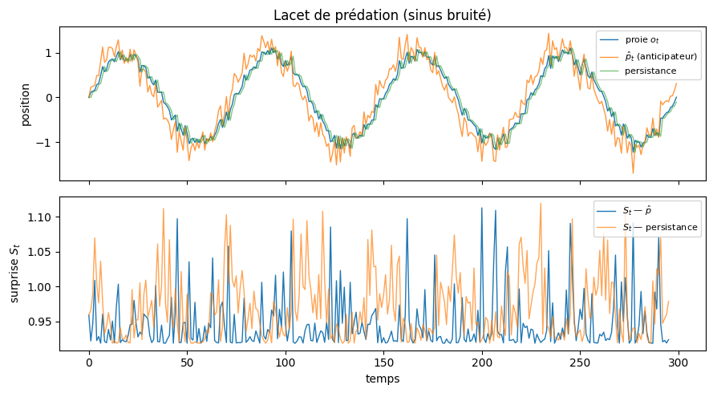

# ICT — Integrated Causal Trajectories

<!-- CATALOG-STATUS
series: IIT-ICT-Series
pedagogical_count: 67
breakdown: ICT-Series=67
maturity: BETA=58, DRAFT=8, ALPHA=1
-->

[← IIT](../README.md) | [↑ Notebooks](../../README.md) | [→ Probas](../../Probas/README.md)

La série [IIT](../README.md) étudie des structures causales **à un instant donné** : on photographie un système et on calcule combien d'information il intègre ($\Phi$). **ICT** (Integrated Causal Trajectories, Epic #4588) prolonge ce regard vers les **trajectoires** de structures causales : comment une organisation se maintient, se transforme, se répare, change d'échelle et traverse un espace de possibles ($C_0 \rightarrow C_1 \rightarrow \dots \rightarrow C_n$). C'est la photographie IIT mise en mouvement.

ICT s'appuie sur un package léger `ict/` posé à côté de PyPhi (autonome pour les simulations et mesures, PyPhi pour les calculs IIT stricts), et s'ouvre sur deux articles fondateurs : le tri vu comme morphogenèse minimale (Zhang, Goldstein & Levin, 2025) et l'ingénierie de l'émergence multi-échelle (Jansma & Hoel, 2025).

La série progresse en **sept strates**, dont la carte de référence unique est celle du **[cadrage ICT-0](ICT-0-Framing.md#deux-axes-de-lecture--strates-verticales--tresse-transverse)** (arbitrage [#13908](https://github.com/jsboige/CoursIA/issues/13908)) : ce qui suit s'y aligne. La **strate 1** (ICT-1 à ICT-7) prend le **tri auto-organisé** comme banc d'essai entièrement transparent : trajectoires enregistrables, compétences inattendues réelles — ce travail *for free* qui, chez Levin, va « dans le sens d'une réversibilisation » — et pont vers la causal emergence. Elle bute sur trois limites — un **attracteur global unique**, un **but imposé de l'extérieur**, une **hiérarchie non générative**. La **strate 2** (ICT-8 à ICT-10) ouvre la *morphogenèse dynamique* sur des paysages d'attracteurs **engendrés par la dynamique** (bifurcation, réaction-diffusion, grammaire des catastrophes), levant ces limites une à une. La **strate 3** (ICT-11 à ICT-13) mesure des **trajectoires intégrées** régime-dépendantes (profils d'agence, champs de valence, morphodynamique stratégique). La **strate 4** (ICT-14 à ICT-20) ajoute la jambe **représentationnelle** — énergie libre, surprise et inférence active — puis fait converger les trois scalaires fondateurs sur des substrats **non-LLM** (identité MDL, $\epsilon$-machine, budget, enjeu) et **outille la réversibilisation** — l'idée fondatrice restée implicite : forcer une trajectoire à devenir réversible et mesurer *ce qu'on perd* révèle la quantité d'agentivité qu'elle portait (ICT-18, flèche du temps & réversibilisation). **ICT-17b (grokking) est la charnière S4 → S5**, pas une strate pleine ([#7735](https://github.com/jsboige/CoursIA/issues/7735)). La **strate 5** (ICT-21 à ICT-25) prend le **LLM comme substrat** : SAE, persona, workspace, inoculation RL. Les [**strates 6** (argumentation) et **7** (freebits d'ordre 2, réversibilité agentique)](#strates-6-et-7--cadrées-non-encore-livrées) sont **cadrées et non encore livrées** : le socle sémiophysique de Thom et les cinq expériences ICT-26 → ICT-30 relèvent de l'**axe transverse** (socle théorique, dimension D2) et non de ces strates.

> **Carte des strates** (par où commencer) : un lecteur qui découvre la série ira de **strate 1** (ICT-1 → ICT-7, le tri auto-organisé, banc transparent entièrement exécutable sans GPU) vers la **strate 5** (ICT-21 → ICT-25, le LLM comme substrat). Les strates **2-4** montent progressivement en abstraction (paysages dynamiques → trajectoires intégrées → free energy, puis les scalaires fondateurs hors LLM jusqu'à la charnière **ICT-17b**). Le **socle Thom** et les **cinq expériences A→E** (ICT-26 → ICT-30) se lisent sur l'**axe transverse** : ce ne sont pas [les strates 6-7](#strates-6-et-7--cadrées-non-encore-livrées), qui restent cadrées et non livrées ([#13908](https://github.com/jsboige/CoursIA/issues/13908)). L'état scientifique de chaque claim est lisible d'un coup d'œil dans la [matrice des dissociations](../../../docs/ict/dissociations-matrix.md) (#7734).

> **Caractère expérimental.** ICT est une série de recherche en construction (statut ALPHA). Elle pose des mesures *sans complaisance* : chaque notebook confronte une intuition séduisante (émergence, agence, criticalité) à une mesure qui peut la **réfuter**, et signale explicitement les fantômes statistiques (signal apparent issu de degrés de liberté cachés).

Chaque figure est **intégrée in-situ** dans la strate et au notebook qu'elle documente (pas de section Galerie isolée — doctrine figures amendée 2026-07-09, EPIC #5780). La légende décrit exactement ce que l'image montre, et signale honnêtement ce qu'elle ne montre pas (« limitation illustrative assumée »). La provenance cellule par cellule est documentée dans [`assets/readme/MANIFEST.md`](assets/readme/MANIFEST.md).

## Prérequis & environnement

ICT partage l'environnement Python de la série IIT (PyPhi 1.2.0, Python 3.9). Le setup et les dépendances sont mutualisés au niveau du répertoire parent :

```bash
# Depuis MyIA.AI.Notebooks/IIT/
powershell -File scripts/setup_pyphi_env.ps1     # conda env pyphi + kernel
pip install -r requirements.txt                  # dépendances ICT (pyphi, numpy, scipy, matplotlib…)

# Recommandé : installer le package `ict/` en mode editable (issue #8076).
# Rend `from ict import …` résolvable depuis n'importe quel cwd, sans dépendre
# du répertoire ICT-Series/. Extras : [llm] (torch/transformers, GPU),
# [extras] (pandas, sympy), [dev] (pytest).
# Depuis MyIA.AI.Notebooks/IIT/ICT-Series/  (dans l'env pyphi activé) :
pip install -e .                                 # cœur ; ou pip install -e .[dev,llm]
```

Le package `ict/` est installable (`pip install -e .` depuis `ICT-Series/`, cf. `pyproject.toml`) : une fois installé, `from ict import …` résout depuis n'importe quel `cwd`. En l'absence d'install editable, l'ancien contrat reste valable : chaque notebook insère le dossier courant dans `sys.path`, il faut alors lancer les notebooks **depuis `ICT-Series/`** (cwd) pour que les imports résolvent.

### Le package `ict/` — modules et tests

Le package `ict/` (installable en mode editable, issue [#8076](https://github.com/jsboige/CoursIA/issues/8076)) porte les simulations et mesures de la série : chaque notebook importe ses calculs depuis un module dédié plutôt que de les redéfinir en ligne. Le package se découpe par famille d'instrument :

| Famille | Modules | Strate |
|---------|---------|--------|
| Tri & morphogenèse | `self_sorting`, `sorting_metrics`, `kin_sorting`, `reaction_diffusion`, `bistable`, `life` | 1-2 |
| Paysages & précursors | `early_warning`, `spectral`, `scale_free` | 2 |
| Agentivité & causalité | `agency`, `causal_emergence`, `causal_attribution`, `tpm_estimation`, `multiscale_agency`, `trajectories`, `bridges` (Quasi-Experimental / PyMC-05, ICT-Greffe5-AttributionCausale) | 1-3 |
| Valence & prégnance | `valence`, `learned_valence`, `pregnance_animat`, `inhibited_action`, `stake` | 3 |
| Catastrophes & topologie | `catastrophe`, `cech_obstruction`, `feature_dynamics`, `meta_proxy`, `sensitivity`, `proxy_contextuality` | 2-5 |
| Énergie libre & information | `free_energy`, `active_inference`, `mdl`, `compression`, `epsilon_machine` | 4-5 |
| Réversibilité & flèche du temps | `time_arrow`, `reversibility_budget` | 5 |
| Ponts & bassins (#9531) | `bridge_testing`, `basin_family`, `basin_geometry`, `basin_asym`, `basin_landscape2d` | 5 |
| Coopération & symboles (dimension D2) | `signaling_convention`, `symbol_invention`, `collective_adoption`, `concept_inoculation`, `inhibited_invention` | D2 |
| Workspace & SAE/J-Lens | `workspace`, `sae_traces`, `jlens_traces`, `jlens_trackP_traces`, `lens_agreement`, `persona_cusp` | 5-6 |
| Synthèse & triade | `synthesis`, `triade`, `beauty`, `argumentation`, `strategic_morphodynamics` | 3-5 |
| Dissociations (matrice #7734) | `salience_valence_dissociation`, `phat_self_reference` | 5 |

**Deux suites de tests CI** valident le package (couverture ≈ un test par module) :

- **`tests/`** — suite principale (pytest), un fichier `test_<module>.py` par module `ict/` (54 fichiers, 1019 tests collectés). Validation des calculs et des gates falsifiables de chaque strate.
- **`ict/tests/`** — suite interne au package (pytest, `conftest.py` + `pytest.ini`), tests de cohérence transversaux (`test_argumentation`, `test_lens_agreement`, `test_reversibility_budget`, `test_time_arrow`).

```bash
# Depuis MyIA.AI.Notebooks/IIT/ICT-Series/
python -m pytest tests/                 # suite principale (un test par module ict/)
python -m pytest ict/tests/             # suite interne transversale du package
python -m pytest                        # les deux (découverte récursive pytest)
```

Les **traces pré-extraites** (fixtures `.npz` dans `traces/`) supportent les notebooks GPU-free de la strate 5 (SAE/J-Lens couche 16, contrôle vs entraîné) : ils lisent ces fixtures plutôt que d'invoquer un LLM à l'exécution.

## Notebooks

### Strate 1 — le tri auto-organisé (transparent et calculable)

| Document | Contenu |
|----------|---------|
| [ICT-0-Framing](ICT-0-Framing.md) | Cadrage de la série : de l'état à la trajectoire, articles fondateurs, feuille de route |
| [ICT-1-PhiTrajectories](ICT-1-PhiTrajectories.ipynb) | Trajectoires de $\Phi$ : paysage de $\Phi$, suivi de $\Phi$ le long d'un attracteur (pulsations) et robustesse aux perturbations — la photographie IIT mise en mouvement, avec le vrai PyPhi |



*Figure extraite de `ICT-1-PhiTrajectories.ipynb` (cellule 12, output 0) — l'axe vertical est la valeur de $\Phi$ calculée par PyPhi sur un petit réseau AND/OR, l'axe horizontal est le pas de temps. Quatre départs distincts (000, 100, 010, 111) montrent que $\Phi$ **oscille** mais ne tend pas vers une asymptote unique — d'où la qualification « pulsations » dans la description. **Limitation illustrative assumée** : la figure documente la notion de trajectoire de $\Phi$ sur un système-jouet (réseau AND/OR), pas le paysage complet d'un système causal réaliste (les trajectoires sont des suites de $\Phi$ discrètes sur 6 pas, et non une trajectoire continue dans un morphospace).*

| Document | Contenu |
|----------|---------|
| [ICT-2-SelfSortingMorphogenesis](ICT-2-SelfSortingMorphogenesis.ipynb) | Le tri auto-organisé comme morphogenèse : trajectoire dans le morphospace, robustesse aux cellules défectueuses, délai de gratification, auto-réparation, impasses chimériques |



*Figure extraite de `ICT-2-SelfSortingMorphogenesis.ipynb` (cellule 7, output 0) — deux panneaux côte-à-côte mesurant le **tri auto-organisé** : à gauche, le nombre d'inversions (désordre global) décroît de ~60 à 0 en ~220 pas (signature d'un tri monotone) ; à droite, la sortedness croît de 0.5 à 1.0 tandis que l'erreur de monotonie locale décroît de ~0.5 à 0 (signal d'une mise en ordre locale persistante). **Limitation illustrative assumée** : la figure montre la **trajectoire de tri** dans le morphospace (sortedness globale + inversions) mais pas la **morphogenèse Gray-Scott** sous-jacente (laquelle est rendue dans `ict9-gray-scott.png`), ni la **robustesse aux cellules défectueuses** ni l'auto-réparation, qui sont discutées dans le texte du notebook mais non visualisées ici (c'est le rôle d'ICT-3, ICT-4 et ICT-9).*

| Document | Contenu |
|----------|---------|
| [ICT-3-RobustnessDelayedGratification](ICT-3-RobustnessDelayedGratification.ipynb) | Robustesse & délai de gratification, étude quantitative : dégradation gracieuse face aux cellules défectueuses, distributions de récupération, comptage du délai de gratification |
| [ICT-4-ChimericArraysKinAggregation](ICT-4-ChimericArraysKinAggregation.ipynb) | Tableaux chimériques & agrégation émergente : réparation bidirectionnelle (guérit l'impasse d'ICT-2) puis affinité « kin », mesurée honnêtement (sans degrés de liberté, pas d'agrégation) |
| [ICT-5-CausalEmergence](ICT-5-CausalEmergence.ipynb) | Émergence causale : $\Phi$ et information effective aux échelles micro/macro, recherche systématique du coarse-graining (vrai `pyphi.macro`), émergence discriminante (Jansma & Hoel, 2025) |
| [ICT-6-SortingToTPM-CausalEmergence](ICT-6-SortingToTPM-CausalEmergence.ipynb) | Pont tri → TPM : chaîne de Markov estimée depuis les trajectoires de tri d'ICT-2, puis émergence causale multi-échelles avec l'outillage *Causal Emergence 2.0* (Hoel, 2025) au-delà de la borne de taille de PyPhi |
| [ICT-7-ScaleFreeSignatures](ICT-7-ScaleFreeSignatures.ipynb) | Signatures scale-free & criticalité : détecter une loi de puissance *sans se faire avoir* (MLE de Hill, choix de $x_{\min}$, KS, à la Clauset et al.) ; étalon critique (branchement, exposant $3/2$) vs tri qui *paraît* sans échelle mais possède une taille caractéristique |

### Strate 2 — morphogenèse dynamique (paysages d'attracteurs)

| Document | Contenu |
|----------|---------|
| [ICT-8-AttractorLandscapesEWS](ICT-8-AttractorLandscapesEWS.ipynb) | Paysages d'attracteurs & signaux précurseurs — *les deux tressées*. Modèle de pâturage de May (1977), système canonique des *early-warning signals* (Scheffer 2009). Bistabilité entre deux états positifs alternatifs, bifurcation pli, catastrophe = changement de régime. Chaque image (vallée qui s'aplatit, mémoire du danger, alerte) adossée à une mesure réelle (potentiel effectif, valeur propre → 0, variance ↑, autocorrélation ↑, τ de Kendall). Lève l'attracteur unique + ouvre une hiérarchie générative |



*Figure extraite de `ICT-8-AttractorLandscapesEWS.ipynb` (cellule 3, output 0) — axe vertical `dx/dt`, axe horizontal `x` (biomasse de végétation, 0 à 10), quatre courbes pour les valeurs du paramètre de pâturage `c ∈ {1.60, 2.20, 2.60, 2.90}`. Les **zéros** de chaque courbe sont les équilibres : à `c=1.60` on observe **3 zéros** (bistabilité + un équilibre instable), à `c=2.90` il n'en reste qu'**un seul** (régime mono-stable) — c'est la trace visuelle de la **bifurcation pli** (fold bifurcation) canonique du modèle de May 1977. **Limitation illustrative assumée** : la figure montre la **bifurcation** dans l'espace des phases mais ne rend pas les signaux précurseurs eux-mêmes (variance ↑, autocorrélation ↑, τ de Kendall) qui sont tracés dans des cellules séparées du notebook.*

| Document | Contenu |
|----------|---------|
| [ICT-9-AgencyRegeneration](ICT-9-AgencyRegeneration.ipynb) | Agence & régénération — *réparer sa forme, ou seulement dériver ?* Morphogenèse réaction-diffusion de Gray-Scott (Pearson 1993) : le système engendre un motif auto-entretenu (point de consigne **intrinsèque**), on l'ablate via une intervention `do(·)`, puis on contraste **deux mondes contrefactuels** (Pearl) — réaction-diffusion qui régénère vs diffusion pure qui dissout. L'agence n'est jamais déclarée, elle est **mesurée** comme *gain de réparation* (recouvrement RD − recouvrement diffusion). *Sans complaisance* : les mesures naïves de ressemblance (pixel-à-pixel, cosinus spectral) fabriquent un signal fantôme ; seule la structure restaurée contrastée au contrôle passif tient. Lève le **but extrinsèque** : un point de consigne que le système maintient de lui-même |


*Figure extraite de `ICT-9-AgencyRegeneration.ipynb` (cellule 3, output 0) — deux panneaux côte-à-côte illustrant la **morphogenèse générative** par réaction-diffusion (Gray-Scott, Pearson 1993) : à gauche l'état initial (t=0) avec un germe localisé au centre d'un fond uniforme sombre, à droite le motif auto-entretenu à t=6000 (structure=0.0095, ~25 taches rougeâtres). C'est ce motif qui sert de cible à l'ablation `do(·)` d'ICT-9 et au contraste RD vs diffusion pour mesurer le *gain de réparation* (`repair_gain`, ICT-19). **Limitation illustrative assumée** : la figure montre le **déclenchement** d'un motif Gray-Scott (passage d'un germe localisé à un pattern stationnaire) mais pas la **dynamique d'ablation/régénération** qui fait le cœur d'ICT-9 (rendue dans des cellules séparées du notebook avec `recovery_score`, `repair_gain`, et les masques d'ablation).*

| Document | Contenu |
|----------|---------|
| [ICT-10-CatastropheGrammar](ICT-10-CatastropheGrammar.ipynb) | Grammaire des catastrophes — *l'obstacle qui engendre les formes, le verbe qui les fait basculer*. **Charnière strate 2→3**, prélude sémiophysique de R. Thom (*Esquisse d'une sémiophysique*, 1991). Sur la catastrophe canonique (la **fronce**), deux fils tressés et **mesurés** : le **métathéorème** (le comptage d'équilibres ne change qu'aux **plis** — exactement 2 transitions le long d'un chemin générique ; *l'obstacle comme source de l'ontologie*, clôt la strate 2) et le **lacet de prédation** (cycle d'hystérésis à 2 catastrophes — perception J, capture K — d'aire signée non nulle = irréversibilité ; un **représentant interne** `p̂` — anticipateur **représentationnel**, à ne pas confondre avec la *prégnance* thomienne (cf. [note de rigueur audit #4](ICT-0-Framing.md#note-de-rigueur--prégnance-thomienne-vs-représentant-interne-p-audit-4-7733)) — dont le contenu anticipateur est *mesuré* sur un banc durci — 3 familles de trajectoires × 3 baselines adverses (persistance, moyenne mobile, AR(1) in-sample), 2 métriques séparées : avantage **régime-dépendant**, réel sur trajectoire lisse (5/5 graines), illusoire sur dérive et créneau ; ouvre la strate 3). La correspondance linguistique du **Ch.2 « Le Langage »** de Thom est *nommée* (pivots ↔ transitions de comptage ; verbe transitif SVO ↔ lacet ; anticipation ↔ `p̂`), avec son caveat explicite de **non-prédictivité** et les barreaux du pont basse-dim → haute-dim (séries neurosymbolique, Lean ; veille EML #4653). *Sans complaisance* : hors régime non dégénéré ($a<0$), zéro saut, aire nulle — un *fantôme* |
| [ICT-Life-SubstratCertifie](ICT-Life-SubstratCertifie.ipynb) | **Substrat GOL certifié — calibration** *(hors séquence numérotée, phase-zero [#5726](https://github.com/jsboige/CoursIA/issues/5726))* : le Jeu de la Vie (B3/S23, tore) entre comme substrat 2-D **discret** à information localisée transportée (glider $c/4$, LWSS $c/2$) — ce que ni le bistable (ICT-8, 0-D) ni Gray-Scott (ICT-9, continu sans particule stable) ne fournissent. Calibration canonique 5/5 du module `ict/life.py` (glider/blinker/pulsar/LWSS/block — périodes et déplacements vérifiés contre les constantes documentées), signatures de population, et **pont Lean** : `hashlife_correct` (track `conway_lean`, tracker [#6724](https://github.com/jsboige/CoursIA/issues/6724), 0 sorry) cité comme garantie que l'évaluation Hashlife calcule la même chose que la simulation naïve — le seul substrat de la série au moteur de calcul **prouvé**. Branchement batterie (`ict.agency`, `ict.stake`) : livré — contraste ICT-31, stratification ICT-32, ensembles ouverts ICT-33 |
| [ICT-31-ContrasteTroisSubstrats](ICT-31-ContrasteTroisSubstrats.ipynb) | **Contraste mesuré à trois substrats** *(hors séquence numérotée, phase narrative [#5726](https://github.com/jsboige/CoursIA/issues/5726))* : S2 bistable (ICT-8), S5 Gray-Scott (ICT-9) et GOL certifié (ICT-Life) passés sous le **même protocole** — le cœur du livrable #5726, car un notebook mono-substrat ne peut pas établir que GOL se distingue. Trois axes : **T** transport d'information localisée, **R** réparation après `do(ablation)` (Pearl), **S** retour de bassin après kick (`I_stake`). Verdicts mesurés : GOL est le **seul transporteur** (population constante, COM à $c/4$, forme intacte) ; GOL est le **seul non-réparateur** — une cellule retirée détruit le glider sans régénération, quand S5 recolle partiellement et S2 relaxe ; et `I_stake` **voit S2 et S5, pas GOL** (l'invariant du glider est translationnel — l'aveugle de l'instrument est déclaré comme tel, pas masqué). Le socle des trois régimes que [ICT-32](ICT-32-StratificationCausaleLife.ipynb) creuse en stratification causale |
| [ICT-32-StratificationCausaleLife](ICT-32-StratificationCausaleLife.ipynb) | **Substrat GOL — stratification causale** *(hors séquence numérotée, phase narrative [#5726](https://github.com/jsboige/CoursIA/issues/5726))* : l'apportionment de *Causal Emergence 2.0* (Hoel, 2025) appliqué au substrat certifié de la phase-zero — le livrable que le titre de l'issue annonce. Deux régimes **mesurés** : *par la trajectoire, le substrat est saturé* — le cycle du glider (64 états sur tore 16×16) porte det 1.000 / deg 0.000 / EI = log2(64), le glouton rend EC = 0 en une passe (aucune macro ne bat le micro), et le quotient par translation (4 phases) est **causalement étanche** (eff 1.000 conservée, EI amputé d'exactement log2(16) = l'information de position) ; *par l'ensemble des graines, la règle jette l'information* — sur le tore 2×2, 12 des 16 graines mènent à la grille vide (deg 0.672, eff 0.328), la **partition par destin** (fibres du successeur, évaluée par le nouveau `partition_profile`) restaure eff à 1.000 (EI 1.31 → 2.32 bits) quand le témoin négatif **population** s'effondre (0.165) — une observable macro n'est pas une macro causale — et le glouton **redécouvre seul** la partition destin (chemin monotone 16 → 5, EC 6.70). La structure tient à l'échelle 3×3 (384/512 collisions, destin eff 0.998). Nouveaux instruments : `torus_ensemble_tpm`, `fate_strata`, `live_count_strata`, `partition_profile` |
| [ICT-33-SoupCollisions](ICT-33-SoupCollisions.ipynb) | **Substrat GOL — ensembles ouverts** *(hors séquence numérotée, phase narrative [#5726](https://github.com/jsboige/CoursIA/issues/5726))* : la triade des ensembles se complète avec le régime **ouvert-conditionné** — les *random soups* Bernoulli i.i.d. de densité donnée, celui de toutes les expériences Life de la littérature. La TPM empirique de l'observable **population** (graine 5726, 4000 soupes 8×8, densité 0.30) est massivement stochastique — 23 strates sources sur 27, la strate médiane compte 25 destins — et le déterminisme mesuré tombe à **0.334** contre 1.000 du tore exhaustif d'ICT-32, pendant que la dégénérescence s'effondre (0.044) : le témoin négatif « population » y devient grandeur mesurée. La mise au carré de la TPM (états communs cause∩effet, lignes fuyantes retirées jusqu'à stabilité) écarte **14.9 %** de la masse — déclarée et interprétée (queue basse de t+1 sous le support de t=0), pas tue. Le **banc discriminant** des collisions head-on (4 phases × 12 offsets = 48 collisions de même masse, 10 cellules) : 21 annihilations / 7 un-gliders survivants / 20 débris, jamais de collision ratée — le destin bascule au décalage d'une colonne, exactement l'information que la projection jette. Le moteur reste déterministe et **prouvé** (`hashlife_correct`, `conway_lean`, 0 sorry) : le bruit mesuré n'est pas dans le moteur, il est dans la projection. Nouveaux instruments : `random_soup`, `empirical_tpm_live_count`, `glider_collision`, `collision_outcome` |

### Strate 3 — trajectoires intégrées (régime-dépendance)

| Document | Contenu |
|----------|---------|
| [ICT-11-CausalAgencyProfiles](ICT-11-CausalAgencyProfiles.ipynb) | Profils d'agence causale — *à quelle échelle l'agence est-elle la plus lisible ?* Ouvre la strate 3. L'agence de réaction-diffusion d'ICT-9 est mesurée à plusieurs résolutions (micro/méso/macro) puis raccordée à l'émergence causale de Hoel (information effective, TPM à macro-variable scalaire = structure/variance du champ moyenné). *Sans complaisance* : les deux mesures d'agence **se contredisent** — `repair_gain` présente un pic méso (`b=16`) mais **artefact-contaminé** (sur-reconstruction : le score dépasse 1, et un plancher de résolution à `b=32`), tandis que `basin_return_probability` est **strictement décroissante** avec l'échelle. Le raccord Hoel suit la mesure inflatée (`r≈+0.50` avec `repair_gain`) et ignore la mesure honnête (`r≈−0.14` avec `basin_return`) — suggestif mais non robuste. Verdict honnête : pas d'échelle privilégiée, l'hypothèse méso-émergente n'est pas confirmée |
| [ICT-12-ValenceFieldsAndAnimats](ICT-12-ValenceFieldsAndAnimats.ipynb) | Champs de valence et animats — *rôles mesurés, modèle interne payant ou ruineux ?* Premier toy model **actantiel spatial** : des animats évoluent dans un champ de valence (source attractive + obstacles repulsifs) ; la scène actantielle de Thom cesse d'être une correspondance nommée — les **rôles deviennent des grandeurs mesurées** (capture, évasion, irréversibilité, switching). Deux animats : le **réactif** suit le gradient instantané (persistance spatiale), l'**anticipateur `p̂`** extrapole le point d'interception. *Sans complaisance* : `p̂` **gagne** en balistique rapide (capture x4, le réactif laggué ne suit pas) mais **perd** en erratique (prédictions trompées par les demi-tours) et perd en anticipation sur source bruitée (la vitesse EMA amplifie le bruit de position). Le modèle interne paie son coût là où la source échappe au réactif **et** reste prévisible — régime-dépendant, ni universellement avantageux ni ruineux (contrôle d'ablation : la marche aléatoire ne porte aucune signature de rôle) |
| [ICT-12b-LearnedValence](ICT-12b-LearnedValence.ipynb) | Valence **apprise**, transférable, réversible — *l'expérience manquante* (#7740, banc désincarné). L'envers exact de ICT-12 : la valence n'est plus un champ gaussien *programmé*, elle est **acquise** par conditionnement Pavlovien (règle de Rescorla-Wagner : $\\Delta\\pi = \\text{lr}(v_\\text{source} - \\pi)$, neutre à l'init). Trois verdicts falsifiables sur banc désincarné (un signal = un index, sans corps) : **transfert** (un neutre co-occurrençant une source devient attractif *par lui-même*, un contrôle non-conditionné reste neutre — pas de fuite de l'inné vers tout), **distinctness vs prédiction** ($\\pi$ monte alors que l'erreur $\\hat p$ est invariante — le banc passe le vecteur $\\pi$ au prédicteur pour qu'un re-vêtement `p̂ = 1 - π` soit *réfutable*, contrôle négatif inclus), **réversibilité** (acquisition et extinction partagent la même règle → $\\pi$ acquise puis éteinte). Banc algorithmique additif (`LearnedValence`) que ICT-12c incarne ensuite |
| [ICT-12c-PregnanceAnimat](ICT-12c-PregnanceAnimat.ipynb) | Animat **prégnance/valence incarné** — *la dissociation $\\hat p$ / $\\pi$* (#7740, jambe C1). Pousse ICT-12b hors de son banc désincarné : un animat qui se déplace, a un état interne (la faim), et choisit ses actions. `PregnanceAnimat` couple un modèle prédictif $\\hat p$ (réutilise `predict_source` + baselines adverses), une valence apprise $\\pi$ (réutilise `LearnedValence`) et un drive `hunger`, via une politique $a_t = f(\\pi + \\text{intrinsic}, \\text{hunger})$ ; le conditionnement est Pavlovien incarné (neutre *tethered* à la source → co-occurrence). **La porte scientifique est une matrice de dissociation**, pas un printout par mesure : le régime **erratique** détruit $\\hat p$ (l'EMA-vitesse sur-réagit aux demi-tours ; ratio erreur $\\hat p$/persistance 0.68–0.95 vs 0.14–0.23 en balistique, robuste 8/8 seeds) **MAIS** laisse intact le conditionnement Rescorla-Wagner (qui ne dépend que de la co-occurrence, pas de la prévisibilité) → transfert + engagement d'action + réversibilité **tiennent**. Verdict : prégnance et représentation sont **deux grandeurs dissociables**, même incarnées. *Portée honnête* : les **six mesures** 1/2/3/4/5/6 + dissociation. Les mesures 4 (FE adaptive) et 5 (information prédictive), différées en PR-A, sont désormais **livrées** (§7) : `free_energy` mode `fixed` = habillage du MSE (gate 1), précision *adaptive* amortit l'explosion erratique (gate 2), et $I(\\hat q;o)$ y est *anti-corrélée* au MSE (plafond épistémique) — **trois lecteurs orthogonaux** de $\\hat q$ |
| [ICT-12d-InhibitedActionAnimat](ICT-12d-InhibitedActionAnimat.ipynb) | Animat **inhibé (Laborit)** — *contrôlabilité, rigidification, dette d'irréversibilité* (#7741, jambe C2). Parallèle à C1 (ICT-12c) : non plus séparer deux grandeurs qui *tiennent*, mais montrer une grandeur — l'opérateur de workspace $W$ — qui *s'effondre*. Substrat = anneau d'états (1-torus) avec contrôlabilité $\\alpha \\in [0,1]$ : avec proba $\\alpha$ l'action s'applique, sinon l'état dérive (action ignorée = inhibition). $\\alpha=0$ = inhibition totale (Laborit). Quatre verdicts falsifiables (`ict.inhibited_action`, PR #8825) : **détection** (l'animat estime $\\hat\\alpha$ depuis les transitions, corrigé de la ligne de chance, $\\vert\\hat\\alpha-\\alpha\\vert<0.1$ sur 3 régimes), **rigidification** (sous $\\alpha=0$ l'animat se replie sur le no-op, entropie d'action $\\ln 3 \\to \\approx 0$, chute $>0.3$ nat), **perte d'efficacité** (fraction-cible $\\alpha{=}1 > \\alpha{=}0$), **pont $I(R)$** (sous inhibition, changer d'action ne change plus la dette d'irréversibilité subie — $\\vert\\Delta\\vert<10^{-9}$ — alors qu'à contrôle partiel l'action la modulait encore). *Portée honnête* : substrat 1-torus minimal, niveau animat individuel (strate 3/5) ; la rencontre avec l'inhibition de l'**innovation** collective (ICT-30, #7746) est une issue ultérieure |
| [ICT-12e-Value-of-Information-Animat](ICT-12e-Value-of-Information-Animat.ipynb) | Valeur de l'information pour l'animat — *combien vaut l'observation, et vaut-elle son prix ?* (#13569, greffe 3). ICT **pose** le problème de l'animat décisionnel (forage, prior 0.3/0.7, actions forer/vendre) et **laisse les organes natifs du dépôt calculer** : `ict.voi` (interface canonique EVPI/EVSI close-form, tranche 1/3) et le comparateur cross-engine `voi/` (tranche 3/3) qui fait tourner **Infer.NET × PyMC** sur le même contrat JSON. Chiffres : EVPI 390000, EVSI 253000, EVSI_net (coût 60000) 193000 — l'animat **observe**. Trois contrôles bornent la lecture (SOTA Prong B, problème non-trivial) : **non-informatif** → EVSI = 0 (ne pas observer), **coût break-even** → l'EVSI net change de signe au franchissement $c^*$ (coût explicite non nul), **parapluie canonique** → EVPI = 3.5 (référence `ict/tests/test_voi.py`), l'animat *sensoriel* proprioceptif 85/75 vivant à 10.7 % de l'information parfaite — distinct du bruit (0 %) comme de l'oracle (100 %). **Contrôle croisé** : Infer.NET et PyMC s'accordent sur `voi/comparison.json` (EVSI 253000 vs 252796 à tolérance, décisions identiques) — l'écart éventuel serait rapporté, jamais lissé. Aucune ré-implémentation de Bayes ni de Howard : le problème est posé, les organes calculent |
| [ICT-13-AxelrodStrategicMorphodynamics](ICT-13-AxelrodStrategicMorphodynamics.ipynb) | Morphodynamique stratégique — *une stratégie est-elle une forme stable ?* Dernier cran de la strate 3 avant la synthèse. Le dilemme du prisonnier itéré d'Axelrod (paiements canoniques $T=5, R=3, P=1, S=0$) sert de morphospace stratégique : six stratégies (AllC, AllD, TFT, TFT généreuse, Pavlov, Grim) confrontées en tournoi round-robin, dynamique de réplication, bassins d'invasion. *Sans complaisance* : quatre gates falsifiables mesurent la « stabilité de forme ». **Gate 1** — TFT et Grim **co-dominent** le tournoi (2.635) devant AllD (2.313, dernier). **Gate 2** — le seuil de coopération soutenable colle au Folk theorem : $\delta^\star$ analytique $(T-R)/(T-P) = 0.500$ vs croisement numérique $0.550$. **Gate 3** — sous bruit d'exécution, la **réciprocité active (TFT) est le point de rupture** (chute la plus forte, $+0.40$) tandis que la rétaliation inflexible de **Grim est paradoxalement la plus robuste** ($+0.29$) — ce qui **contredit** la prédiction Nowak-Sigmund (TFT généreuse / Pavlov les plus tolérantes) sur ces paiements. **Gate 4** — bassins d'invasion contre AllD résident : TFT/Grim envahissent dès $2\,\%$ de fraction initiale, TFT généreuse à $34\,\%$, Pavlov et AllC **jamais** ($1.0$). Verdict honnête : la robustesse stratégique est **fonction du régime** (bruit, structure de paiements), pas une propriété intrinsèque de la stratégie — la « forme stable » n'existe qu'au sein d'un environnement donné. **Évolution (§6, #12673)** : en dynamique sélection-mutation (Wright-Fisher, 60 agents, mutation 5 %), la population ne fixe pas — équilibre polymorphe grim/AllC/GTFT (TFT éliminée), coopération oscillante 0.26–0.94 sur 400 générations ; module `ict.strategic_morphodynamics.evolve_population`, substrat consommé par ICT-15d |

![Gate 3 — effondrement sous bruit (TFT chute, Pavlov résiste) : 6 stratégies (allc/alld/tft/gtft/pavlov/grim) tracées par leur score de tournoi en fonction du bruit d'implémentation ε ∈ [0, 0.40]](assets/readme/ict13-axelrod.png)

*Figure extraite de `ICT-13-AxelrodStrategicMorphodynamics.ipynb` (cellule 13, output 0) — axe vertical « score de tournoi » (1.7 à 2.6), axe horizontal « bruit d'implémentation ε » (0.0 à 0.40), six courbes pour les stratégies allc/alld/tft/gtft/pavlov/grim. Lecture critique : la légende de la figure dit « Gate 3 : effondrement sous bruit (TFT chute, Pavlov résiste) », mais la figure montre en réalité que **TFT chute fortement** (de ~2.6 à ~2.1) puis remonte, que **Pavlov reste stable** (~2.5) — c'est-à-dire que la robustesse de Pavlov est bien réelle, mais l'effondrement initial de TFT est partiellement récupéré. **Limitation illustrative assumée** : la figure ne montre que la **Gate 3** (bruit d'implémentation) et pas les Gates 1/2/4 (score pur / seuil δ* / bassins d'invasion), qui sont discutés dans le texte mais tracés dans des cellules séparées.*

La strate 3 se conclut par son capstone [ICT-Synthese-CrossSubstrat](ICT-Synthese-CrossSubstrat.ipynb) : un seul appareil (la trajectoire causale intégrée) appliqué à cinq substrats — tri auto-organisé, bistable, Axelrod, activations SAE d'un LLM (strate 5), et le champ Gray-Scott — pour tester si un invariant numérique transfère. Verdict : non (Φ et F covarient, K et l'irréversibilité divergent orthogonalement) ; ce qui transfère, c'est la *méthode* (ne créditer que ce qui bat son contrôle dégénéré), pas le nombre.


*Figure extraite de `ICT-Synthese-CrossSubstrat.ipynb` (cellule 23, output 5) — **jambe statique** du capstone : la convergence (ou non) des trois scalaires fondateurs $\Phi / F / K$ sur le banc cross-substrat. **Limitation illustrative assumée** : la figure rend 4 substrats visibles (tri, bistable, réplicateur, LLM) sur les 5 testés par le notebook ; la jambe temporelle (réversibilisation) est tracée séparément ci-dessous.*


*Figure extraite de `ICT-Synthese-CrossSubstrat.ipynb` (cellule 26, output 2) — **jambe temporelle** du capstone : l'irréversibilité (ICT-18) appliquée au même banc. Le banc partagé est ici repris et outillé par la strate 5.*

### Strate 4 — énergie libre et représentationnel (Free Energy Principle)

| Document | Contenu |
|----------|---------|
| [ICT-13b-DecroisementDynamiqueObservable](ICT-13b-DecroisementDynamiqueObservable.ipynb) | Annexe scientifique d'ICT-13 — *d'où vient le relief $b_1$ du substrat Axelrod ?* Décroise le plan factoriel laissé ouvert par les quatre PRs de l'EPIC substrat (#13039, #12673) : **dynamique** (réplicateur déterministe vs population finie agent-based 60 agents, bruit 2 %) × **observable** (`argmax` vs `digitize(coop, 8)`), même graine, même matrice de gains, même $\mu=0.05$, pipeline $b_1$ unique. **La cellule jamais mesurée — réplicateur × quantifié — rend `0.0000` à toutes les résolutions (2/4/8/16)** : le relief publié (`0.3989`, reproduit **exactement** au pipeline ICT-15j près ; `0.5036` au pipeline unifié) vient de la **dérive d'échantillonnage à population finie dans un vocabulaire fixe**, pas de la résolution de l'observable (amplificateur ~7,5x : `0.047` vers `0.354` multi-seed 5 graines, jamais sous `0.25`) ni de la nouveauté stratégique (réfute la généralisation « bruit différent de nouveauté » : le vocabulaire est fixe et le relief existe). Prescriptif pour l'arbitrage : un $b_1 = 0$ sur l'`argmax` d'un champ moyen est une propriété de l'instrument, pas du système |
| [ICT-14-FreeEnergySurprise](ICT-14-FreeEnergySurprise.ipynb) | Surprise & énergie libre — *la jambe représentationnelle* du triplet fondateur ($\Phi_\text{dyn}$, $F$, $K$). *Free energy* et *expected free energy* comme substrat computationnel de l'anticipation, articulation avec la trajectoire $\Phi$ d'ICT-1 et le représentant interne `p̂` d'ICT-10. Voir issue #5089 |



*Figure extraite de `ICT-14-FreeEnergySurprise.ipynb` (cellule 4, output 0) — deux panneaux : panneau haut, **position** au cours du temps (t ∈ [0, 300]) pour trois dynamiques (proie `o_t` bleue, anticipateur `p̂_t` orange, persistance verte) suivant un signal sinusoidal bruité ; panneau bas, **surprise $S_t$** du modèle interne (p̂ en bleu, persistance en orange). **Note d'honnêteté** : le nom de fichier `ict14-freeenergy.png` est trompeur — la figure illustre en réalité le **lacet de prédation** et la **batterie anticipation/persistance** développée dans ICT-10 (catastrophe fronce), et non la free energy / expected free energy proprement dite. Le lien avec la free energy est dans le texte du notebook mais la figure rendue ici est un cas d'application du **représentant interne `p̂`** au signal sinusoidal bruité. **Limitation illustrative assumée** : la figure montre un cas jouet (sinus bruité, 300 pas) et ne généralise pas à des signaux réels ; la free energy formelle n'est pas tracée (mais intervient dans l'analyse).*

| Document | Contenu | Issue |
|----------|---------|-------|
| [ICT-14b-ActiveInferenceEFE](ICT-14b-ActiveInferenceEFE.ipynb) | **Inférence active — l'expected free energy pilote l'action** — banc d'inférence active (FEP épaisse) : l'EFE devient opérateur d'action, l'agent sélectionne les observations futures qui minimisent la surprise attendue. Prolonge ICT-14 (surprise passive → contrôle actif) | [#9532](https://github.com/jsboige/CoursIA/issues/9532) |

### Strate 4 (suite) — la théorie fondatrice hors LLM (cross-substrat, MDL, $\epsilon$-machine)

> **Frontière S4/S5** — ces notebooks mesurent les scalaires fondateurs sur des substrats **non-LLM** : ils relèvent de la strate 4, dont ils forment la seconde moitié. La strate 5 commence à ICT-21, là où le substrat *est* un transformer entraîné ([#13908](https://github.com/jsboige/CoursIA/issues/13908)).

Le retour à la théorie fondatrice (cf. [ICT-0-Annexe](ICT-0-Annexe-IntegratedComplexityTheory.md)) : les trois scalaires fondateurs $\Phi / F / K$ convergent sur un banc cross-substrat, et la **réversibilisation** — l'idée fondatrice restée implicite — y est enfin outillée (ICT-18). *Notebooks ICT-15 à ICT-23 tous livrés et exécutés — dont ICT-19 (batterie de l'ENJEU, #5526, raffinée par [ICT-19b-EnjeuBattery-Raffinement](ICT-19b-EnjeuBattery-Raffinement.ipynb) #5728 : mesure S4 Gray-Scott en espace de champ, `repair_gain` +0.82±0.27), ICT-21 (substrat SAE, mergé #5643) et ICT-22 (LLM comme quatrième substrat, mergé #5658). ICT-24 (WorkspaceIgnition) est livré (#5875) : les Gates 22-23 GPU-free concluent à une **dissociation** — les pics d'emergence_gain créditée ne co-localisent pas avec les événements d'ignition workspace (les deux lectures IIT↔GWT capturent des choses différentes sur S4) ; le Gate 24 (clamp sélectif) reste en phase 2 GPU (coordonnateur GPU2). Le [tête-à-tête SAE↔J-space](ICT-SAE-JLens-TeteATete.ipynb) couche 16 (#5959) confronte les deux lentilles (SAE Qwen-Scope vs jacobien J-Lens) sur le même modèle 9B-Base, GPU-free. ICT-25 (GPU) reste gated (#5105). Scope ICT-15..25 (#5090 #5099..#5105 #5279 #5635 #5681).*

| Notebook | Sujet | Issue |
|----------|-------|-------|
| [ICT-15-IntegratedComplexity](ICT-15-IntegratedComplexity.ipynb) | Convergence Φ/F/K sur le banc cross-substrat, gate de convergence sur le squelette de Thom | [#5090](https://github.com/jsboige/CoursIA/issues/5090) |
| [ICT-15b-SensitivityCanonicity](ICT-15b-SensitivityCanonicity.ipynb) | **Sensibilité — canonicité du banc Φ/F/K** — raffinement d'ICT-15 sur la stabilité du verdict de convergence aux perturbations contrôlées du substrat (bruit d'implémentation, recalibrage des coarse-grainings), protocole de re-mesure multi-graines sur le banc cross-substrat | [#7288](https://github.com/jsboige/CoursIA/issues/7288) |
| [ICT-15c-MetaProxyObstruction](ICT-15c-MetaProxyObstruction.ipynb) | **Méta-proxy obstruction** — exploration des obstructions possibles au verdict d'ICT-15 : quand un proxy Φ/F/K cache une divergence de régime (faux-positif de convergence) ; banc adversarial sur substrats où le triplet co-varie par construction | [#7395](https://github.com/jsboige/CoursIA/issues/7395) |
| [ICT-15d-CechObstruction](ICT-15d-CechObstruction.ipynb) | **Cochaîne de Čech pondérée — obstruction intra-substrat** — troisième lecteur d'obstruction (après 15b raffinement et 15c méta-proxy) : une obstruction cohomologique qui ne se réduit ni à un proxy Φ/F/K ni à la sensibilité de Huang ; module `ict.cech_obstruction` | [#7744](https://github.com/jsboige/CoursIA/issues/7744) |
| [ICT-15e-Bridge2-RecoverabilityAgency](ICT-15e-Bridge2-RecoverabilityAgency.ipynb) | **Pont #2 — la recouvrabilité *est* l'agentivité** — cinq bridges falsifiables : la récupération d'un état après `do(·)` n'est pas un simple gain de réparation, elle discrimine l'agentivité (un dissipateur pur ne recouvre pas). Raccorde la strate 5 au critère agentivité d'ICT-9/19 | [#8077](https://github.com/jsboige/CoursIA/issues/8077) |
| [ICT-15f-Bridge1bis-DecoupledFamily](ICT-15f-Bridge1bis-DecoupledFamily.ipynb) | **Pont #1-bis — la famille découplée tranche le négatif de σ** — construction d'une famille de substrats à découplage construit (σ ⟂ largeur de bassin) : la largeur de bassin, et non σ seul, porte le signe négatif qui falsifiait ICT-15e. Profil géométrique `ict/basin_geometry.py` | [#9531](https://github.com/jsboige/CoursIA/issues/9531), [#8077](https://github.com/jsboige/CoursIA/issues/8077) |
| [ICT-15g-EmpiricalHuangExploitation](ICT-15g-EmpiricalHuangExploitation.ipynb) | **Exploitation empirique de la sensibilité (Huang 2019)** — prolongement d'ICT-15b : applique le théorème de sensibilité de Huang sur des substrats réels de la série (tri, Gray-Scott, Axelrod) : la dépendance multilinéaire du degré révélée comme lecteur orthogonal du banc Φ/F/K | [#7288](https://github.com/jsboige/CoursIA/issues/7288) |
| [ICT-15h-Bridge1bis-AsymmetricFamily](ICT-15h-Bridge1bis-AsymmetricFamily.ipynb) | **Pont #1-bis — régime asymétrique** (chantier 2/3) : la famille de double-puits asymétriques $V = ax^4 - bx^2 + cx^3$ (bassins non interchangeables : profondeurs, courbures, largeurs, barrières distinctes) **généralise** le verdict CONFIRMED-NEGATIVE du chantier 1/3 — la courbure locale $\sigma$ n'a aucun pouvoir prédictif propre pour la récupérabilité une fois la largeur ET la barrière contrôlées ; module `ict/basin_asym.py` | [#9531](https://github.com/jsboige/CoursIA/issues/9531) |
| [ICT-15i-Bridge1bis-2DLandscape](ICT-15i-Bridge1bis-2DLandscape.ipynb) | **Pont #1-bis — paysage 2D anisotrope** (chantier 3/3, clôt #9531) : en 2D le Hessien au minimum offre une courbure par direction propre — mais aucun résumé scalaire de $\sigma$ ($\sigma_{\min}$ ou $\sigma_{\text{mean}}$) ne prédit la récupérabilité après contrôle de la largeur, de la barrière **et** de l'anisotropie. Les trois régimes (symétrique 1D, asymétrique 1D, anisotrope 2D) convergent : c'est la géométrie du bassin qui gouverne ; module `ict/basin_landscape2d.py` | [#9531](https://github.com/jsboige/CoursIA/issues/9531) |
| [ICT-15k-RecollementMacroCells](ICT-15k-RecollementMacroCells.ipynb) | **Recollement des macrocells — le quadtree de Hashlife comme espace étalé** (chantier 3 grain 1, reprend là où 15d avait rendu son verdict TRIVIAL) : le recouvrement est **imposé par le substrat** (macrocells alignées `2^k`, les bords définis avant les sections — la dette §2 de #12206 rendue observable), fibres et transports **réels** via mémoïsation, compatibilité vérifiée empiriquement (marge 1 : zéro divergence, tous les transports exacts, contre vérité terrain du moteur certifié ICT-Life), recollement cassé (clé d'intérieur seul) converti en **témoin qui paie** — Dutch book sur la population annoncée, profit strict dès l'étape 1 (Loi I répondue dans les deux sens), et sensibilité au choix du recouvrement (marge 0/1/2 : la marche d'escalier est au rayon du voisinage) | [#12206](https://github.com/jsboige/CoursIA/issues/12206), [#7744](https://github.com/jsboige/CoursIA/issues/7744) |
| [ICT-15l-IndependanceGenerateur](ICT-15l-IndependanceGenerateur.ipynb) | **Indépendance au générateur de nouveauté — le relief b1 passe le contrôle de dimension ?** (audit du discriminant nerf d'ICT-15j) : deux générateurs structurellement distincts (resemencement uniforme sur catalogue fermé vs dérive génomique 5 bits à vocabulaire ouvert, 26-27 comportements nouveaux par trajectoire) + un **contrôle négatif** (simplexe doublé d'étiquettes : dimension 12, zéro nouveauté), graines et paramètres appariés, verdict **pré-enregistré et calculé programmatiquement** : `CONFONDU_AVEC_LA_DIMENSION` — le contrôle produit le même relief que les générateurs (R3 ≈ R1 ≈ 0,35 > τ = 0,05) : le relief accompagne le turnover stochastique de population finie, pas la nouveauté stratégique ; en prime, la duplication interleaved est révélée **no-op bit-exact** (`integers(0,12)//2 == integers(0,6)`), preuve de grossièreté du discriminant | [#13308](https://github.com/jsboige/CoursIA/issues/13308), [#13303](https://github.com/jsboige/CoursIA/issues/13303), [#12673](https://github.com/jsboige/CoursIA/issues/12673) |
| [ICT-16-MDLTwoPartCode](ICT-16-MDLTwoPartCode.ipynb) | $F$ est la partie résiduelle du code $K$ + bosse complexité-entropie | [#5099](https://github.com/jsboige/CoursIA/issues/5099) |


*Figure extraite de `ICT-16-MDLTwoPartCode.ipynb` (cellule 11, output 0) — l'axe vertical `C` est la **longueur de code du modèle** en bits (axe du Minimum Description Length, MDL), l'axe horizontal `H` est le **taux d'entropie** en bits/symbole. La courbe rouge (médiane par bucket) montre un **creux** vers H≈1.0 (C≈-50 bits, soit le modèle est très compressible à entropie intermédiaire basse), puis un **pic** marqué par une étoile dorée à `C*≈38.3` bits à `H*≈1.99` bits/symbole — c'est la **bosse complexité-entropie** canonique (Crutchfield-Feldman 1998, "La complexité statistique est maximale à entropie intermédiaire"). **Limitation illustrative assumée** : la figure montre la bosse MDL pour **un seul couple (modèle, famille de sources)** ; la généralisation cross-substrat (le gate de convergence Φ/F/K d'ICT-15) n'est pas visible ici.*

| Document | Contenu | Issue |
|----------|---------|-------|
| [ICT-17-EpsilonMachine](ICT-17-EpsilonMachine.ipynb) | $\epsilon$-machine (Crutchfield) vs Hoel — états causaux, complexité statistique, entropie d'excès | [#5100](https://github.com/jsboige/CoursIA/issues/5100) |
| [ICT-17b-Grokking-CompressionProgress](ICT-17b-Grokking-CompressionProgress.ipynb) | **Grokking — compression & progrès** — applique l'instrumentation $\epsilon$-machine d'ICT-17 à la phase de **grokking** (compression post-généralisation tardive, Power et al. 2022) sur un réseau-jouet : mesure de la chute de complexité statistique au moment où la généralisation apparaît, contraste avec la persistance $\Phi$ du substrat | [#5100](https://github.com/jsboige/CoursIA/issues/5100) (sub-issue grokking) |
| [ICT-18-ArrowOfTimeReversibilization](ICT-18-ArrowOfTimeReversibilization.ipynb) | Flèche du temps & réversibilisation — production d'entropie, detailed balance, « que perd-on à réversibiliser ? » (ancré ICT-3, Levin/Fridman) *(GPU-free)* | [#5279](https://github.com/jsboige/CoursIA/issues/5279) |
| [ICT-18b-ReversibilityBudget](ICT-18b-ReversibilityBudget.ipynb) | **Budget de réversibilité — la jambe « fin »** — la triade moyen / fin / enjeu enfin mesurée : $B_\text{state}$ (Monte-Carlo, primaire) + $B_\text{work}$ (distance à $P_\text{rev}$, témoin) ; 3 prédictions pré-enregistrées sur S2/S4/S3 (P1 PASS, P2 DISSOCIATION honnête, P3 PASS) *(GPU-free)* | [#7287](https://github.com/jsboige/CoursIA/issues/7287) |
| [ICT-19-EnjeuBattery](ICT-19-EnjeuBattery.ipynb) | **Batterie de l'ENJEU** — auto-maintien vs pur dissipateur, retour-au-bassin après `do(·)` sur Gray-Scott S4 (cadrage B, spec [#5483](https://github.com/jsboige/CoursIA/issues/5483)) ; raffinée par [ICT-19b-EnjeuBattery-Raffinement](ICT-19b-EnjeuBattery-Raffinement.ipynb) (#5728 : mesure S4 en espace de champ, résout le faux nul) | [#5489](https://github.com/jsboige/CoursIA/issues/5489) |
| [ICT-20-FeatureCatastrophes](ICT-20-FeatureCatastrophes.ipynb) | Calibration — changepoints, EWS et hystérésis en feature-space | [#5103](https://github.com/jsboige/CoursIA/issues/5103) |

### Strate 5 — le LLM comme substrat (SAE, persona, workspace, inoculation RL)

La **strate 5 commence ici** : le substrat mesuré n'est plus un système dynamique ni un automate, mais un **transformer entraîné**. La charnière est **ICT-17b (grokking)** — l'instant où un représentant interne cesse d'anticiper un comportement pour devenir un état de représentation apprise ([#7735](https://github.com/jsboige/CoursIA/issues/7735)). Frontière arbitrée en [#13908](https://github.com/jsboige/CoursIA/issues/13908).

| Document | Contenu | Issue |
|----------|-------|-------|
| [ICT-21-SAETrajectoires](ICT-21-SAETrajectoires.ipynb) | SAE (Qwen + Qwen-Scope — **gamme Qwen3/Qwen3.5, 700M → 120B** ; **jalon 9B ici**, réplication cross-échelle dans #5105 / #7396 ; verdict GÉNÉRATION décroisé de la fidélité de l'instrument dans #13040 : les quatre FVU mesurées au décodage officiel, le meilleur SAE dégradé au-delà du pire sans que le recouvrement ne suive) — des features SAE aux trajectoires d'états discrets, substrat S4 *(GPU)* | [#5101](https://github.com/jsboige/CoursIA/issues/5101) |
| [ICT-22-LLMSubstrat](ICT-22-LLMSubstrat.ipynb) | LLM comme quatrième substrat du banc cross-substrat — on passe des **stratégies** d'Axelrod (ICT-13) aux **représentations internes** (features SAE d'ICT-21) qui les motivent, puis à la jambe argumentation (#7289) qui les met en confrontation explicite. *(GPU)* | [#5102](https://github.com/jsboige/CoursIA/issues/5102) |
| [ICT-23-PersonaCatastrophe](ICT-23-PersonaCatastrophe.ipynb) | Désalignement émergent par fronce, énergie libre et MDL (capstone) | [#5104](https://github.com/jsboige/CoursIA/issues/5104) |
| [ICT-24-WorkspaceIgnition](ICT-24-WorkspaceIgnition.ipynb) | WorkspaceIgnition — l'axe *Global Workspace* (Dehaene, Baars) comme cinquième jambe : module `ict/workspace.py` (série de concentration Gini, événements d'ignition persistants, influence retardée, profil de fan-out, candidats workspace, batterie event-triggered réutilisant `synthesis.emergence_gain`). **Gates 22-23 GPU-free livrés (#5875)** : verdict dissociation (contraste synthétique +0.44, pics emergence_gain et ignitions workspace ne co-localisent pas sur S4) ; Gate 24 (clamp sélectif) en phase 2 GPU *(GPU-free)* | [#5635](https://github.com/jsboige/CoursIA/issues/5635) |
| [ICT-SAE-JLens-TeteATete](ICT-SAE-JLens-TeteATete.ipynb) | **Tête-à-tête SAE↔J-space** (couche 16, 9B-Base) — confronte les deux lentilles du workspace global (SAE Qwen-Scope W64K-L0_50 vs jacobien J-Lens neuronpedia) sur le même modèle et les mêmes prompts, banc numpy-only lisant les 4 fixtures pré-extraites : features différentielles (K_DIFF=64), séries de concentration, matrices de séparation inter-jeux, dégradation top-k *(GPU-free, #5681 Track S)* | [#5681](https://github.com/jsboige/CoursIA/issues/5681) |
| [ICT-21b-SAECalibration](ICT-21b-SAECalibration.ipynb) | **Calibration des SAE par echelle** — verite-terrain de reconstruction (FVU corpus, L0 mesure, features mortes) des SAE officiels Qwen-Scope W32K-L0_50 a profondeur appairee (frac 0.5) sur la batterie d'ICT-21 : 31,4 % (1.7B) vs 71,5 % (2B) de variance expliquee (couverture inversee selon l'echelle), L0 = 50.0 exact (garde release passee), largeur effective ~3 % — prealable Phase 0 a toute comparaison cross-echelle de forme *(GPU-free, traces commitees)* | [#8236](https://github.com/jsboige/CoursIA/issues/8236) |
| [ICT-21c-SAECatastrophes](ICT-21c-SAECatastrophes.ipynb) | **Catastrophes du dictionnaire SAE — forme & dynamique** (livrable 2 de #8236) — perturbations appariées à trois échelles (1.7B/2B/9B) × deux régimes (trained/control), banc numpy-only sur les traces ICT-21 : forme (Gini, enrichissement top-500 par registre — le trained recrute 2-3× plus de features et les spécialise), dynamique (ablation vives/mortes/aléatoire : f50_vives 0.004→0.07 selon l'échelle trained, path-divergence 0.53-0.82), inoculation **absente** au banc figé (négatif propre), confrontation au FVU réel GPU (L0 constant, fidélité effondrée) *(GPU-free, traces committées)* | [#8236](https://github.com/jsboige/CoursIA/issues/8236) |
| [ICT-25-InoculationRL](ICT-25-InoculationRL.ipynb) | **InoculationRL — GRPO à récompense hackable × inoculation** *(GPU)*. Capstone final de la strate 5 et **pont ICT↔PostTraining** : reproduit, dans les poids à échelle jouet, le phénomène de dérive de persona sous récompense hackable (arXiv 2511.18397). Deux bras d'entraînement GRPO identiques sauf le system prompt (N non inoculé / I inoculé), certifié `rewardspy` (le hack est appris dans les deux), panel persona + éval comportementale hors-domaine. Gates 20-21 falsifiables ; résultat négatif honnête possible (« non reproduit à cette échelle ») | [#5105](https://github.com/jsboige/CoursIA/issues/5105) |

### Strates 6 et 7 — cadrées, non encore livrées

Les deux derniers barreaux de l'axe vertical **ne sont pas livrés**. Ils figurent ici pour que la progression en **sept strates** annoncée en tête se lise jusqu'au bout, et pour tenir la distinction que le [cadrage ICT-0](ICT-0-Framing.md#deux-axes-de-lecture--strates-verticales--tresse-transverse) a établie ([#13908](https://github.com/jsboige/CoursIA/issues/13908)) : **ni** le socle Thom **ni** les cinq expériences ICT-26 → ICT-30 ne sont ces strates — ce sont des objets de l'**axe transverse**. Les deux cartes du dépôt avaient divergé en projetant ces objets transverses sur l'échelle verticale ; c'est cette projection, et non les strates elles-mêmes, qui a été retirée.

| Strate | Substrat | État | Pattes de la tresse | Epic |
|--------|----------|------|---------------------|------|
| **6** | l'**argumentation** comme substrat (+ jambe explicabilité LLM) | graine exécutée, strate non livrée | C3 morphogenèse rhétorique ([#7742](https://github.com/jsboige/CoursIA/issues/7742)) · C4 grammaire de propagation ([#7743](https://github.com/jsboige/CoursIA/issues/7743)) | [#7289](https://github.com/jsboige/CoursIA/issues/7289) · horizon altérité [#7291](https://github.com/jsboige/CoursIA/issues/7291) (GATED) |
| **7** | **freebits d'ordre 2** & réversibilité agentique | cadrée par la dimension D1, non livrée | — (D2 l'**alimente** sans l'occuper) | [#7745](https://github.com/jsboige/CoursIA/issues/7745) |

**Strate 6 — sa graine, elle, est exécutée.** Le substrat est le **discours** : des trajectoires de croyance sur graphes d'arguments, où la question est de savoir si une structure causale se maintient quand ce qui circule n'est plus de la matière ni des poids, mais des raisons. Un seul notebook y est livré, et il porte déjà sa mesure :

| Document | Contenu | Issue |
|----------|---------|-------|
| [ICT-Argumentation-BeliefTrajectories](ICT-Argumentation-BeliefTrajectories.ipynb) | **Trajectoires de croyances — Phase B (zoo ICT)** — applique l'instrumentation $\Phi$-trajectoires d'ICT-1 à des **trajectoires argumentatives** (5 classes de drift Argumentum : IN_SYNC, SRC_DRIFT, TRAD_DRIFT, MISSING_LANG, ORPHAN_ROW) : mesure de la **dissociation** entre croyances explicites (claim/dialogue) et structure causale sous-jacente du corpus, banc T2 multilingue | Phase B (cf. [#4588](https://github.com/jsboige/CoursIA/issues/4588) — sub-issue argumentation) |

Restent non livrés : les deux jambes C3/C4 (morphogenèse rhétorique, grammaire de propagation), l'annexe Kochen-Specker ([#7290](https://github.com/jsboige/CoursIA/issues/7290)) et l'horizon altérité ([#7291](https://github.com/jsboige/CoursIA/issues/7291), GATED). La prédiction pré-enregistrée qui donnera à cette strate son gate falsifiable — une **dette d'irréversibilité du discours**, soit la dissociation $\sigma$ élevé / $K$ faible des régimes rhétoriques manipulatoires — est posée dans [ICT-0](https://github.com/jsboige/CoursIA/issues/7289) et **pas encore mesurée**.

**Strate 7 — rien n'y est livré, et D2 n'en tient pas lieu.** Le substrat visé est celui des *free coordinates* / **freebits de second ordre** : les degrés de liberté qu'un système garde réellement ouverts, et ce qu'il en coûte de rendre sa trajectoire réversible. La dimension **D1** ([#7745](https://github.com/jsboige/CoursIA/issues/7745)) en pose le cadre — jeu évolutif $G_t$ + mécanisme $M$, six proxys — et la dimension **D2** ci-dessous l'alimente en résultats. Mais une dimension est une **patte, pas un barreau** : les cinq expériences ICT-26 → ICT-30 sont livrées **sans** que la strate 7 le soit. C'est la divergence exacte que [#13908](https://github.com/jsboige/CoursIA/issues/13908) a tranchée.

### Dimension D2 — coopération, signalisation et invention de symboles (cinq expériences A→E)

> **Axe transverse, pas strate 7** — ces cinq expériences réalisent la **dimension D2** du cadrage ([#7746](https://github.com/jsboige/CoursIA/issues/7746), l'Epic déjà cité ci-dessous), et non la strate 7, qui reste celle des **freebits d'ordre 2** ([#7745](https://github.com/jsboige/CoursIA/issues/7745)) et n'est pas livrée. Une dimension est une **patte, pas un barreau** : elle éclaire les strates hautes sans occuper de rang sur l'échelle des substrats ([#13908](https://github.com/jsboige/CoursIA/issues/13908)).

Ces cinq expériences font de la **coopération un opérateur** plutôt qu'un épiphénomène : élargir l'espace des trajectoires récupérables d'un système en lui ajoutant des partenaires, des conventions partagées et des symboles inventés. Cinq expériences A→E (Epic [#7746](https://github.com/jsboige/CoursIA/issues/7746)), chacune adossée à un module `ict/` dédié, mesurent les seuils et les dérives de cet opérateur. L'invention d'un symbole, son adoption collective et son inoculation sont traitées comme des **événements falsifiables** (un seuil de performativité, un gain mesuré), pas comme des correspondances nommées.

| Notebook | Expérience | Contenu | Issue |
|----------|-----------|---------|-------|
| [ICT-26-SignalingConvention](ICT-26-SignalingConvention.ipynb) | A — convention | Convention de signalisation : comment un canal arbitraire devient une convention stable (compagnon de `ict.signaling_convention`) | [#7746](https://github.com/jsboige/CoursIA/issues/7746) |
| [ICT-27-SymbolInvention](ICT-27-SymbolInvention.ipynb) | B — invention | Invention de symboles : le passage d'une convention *donnée* (A) à un symbole *inventé* hors du répertoire initial (compagnon de `ict.symbol_invention`) | [#7746](https://github.com/jsboige/CoursIA/issues/7746) |
| [ICT-28-CollectiveAdoption](ICT-28-CollectiveAdoption.ipynb) | C — adoption | Adoption collective et seuil de performativité : à partir de quelle fraction une innovation devient-elle norme auto-entretenue (compagnon de `ict.collective_adoption`) | [#7743](https://github.com/jsboige/CoursIA/issues/7743), [#7746](https://github.com/jsboige/CoursIA/issues/7746) |
| [ICT-29-ConceptInoculation](ICT-29-ConceptInoculation.ipynb) | D — inoculation | Inoculation d'un concept : après A (la convention existe), un concept peut-il être *introduit* puis propagé dans le collectif comme un vaccin cognitif (compagnon de `ict.concept_inoculation`) | [#7746](https://github.com/jsboige/CoursIA/issues/7746) |
| [ICT-30-InhibitedInvention](ICT-30-InhibitedInvention.ipynb) | E — inhibition | Invention inhibée : la rencontre avec l'inhibition de Laborit (cf. ICT-12d) au niveau collectif — quand l'opérateur de workspace $W$ s'effondre, l'invention collective cesse (compagnon de `ict.inhibited_invention`) | [#7741](https://github.com/jsboige/CoursIA/issues/7741), [#7746](https://github.com/jsboige/CoursIA/issues/7746) |
| [ICT-Greffe2-EspaceAtteignable](ICT-Greffe2-EspaceAtteignable.ipynb) | Greffe 2 — quadruplet | **Le quadruplet $(A, F, r, \pi)$ : « élargir son espace » rendu testable** *(greffe 2, consomme Planners-5c/14)* — le socle STRIPS du différentiel d'atteignabilité, augmenté du **contrôle négatif exécuté** (+50 % d'états, 0 but nouveau : la croissance d'espace n'est pas le progrès), du **noyau mesuré à deux niveaux** (vide au système par monotonie STRIPS, non vide au solveur à budget fixe — $g_1$ sort de $F$ à $B{=}30$), de la **liberté résiduelle $r$** (94 %→54 % : l'élargissement non contrôlé dilue l'explorable) et du **cas navigation** (seul $\pi$ bouge, $h^*$ stable) — trois signatures distinctes sur le même banc, garanties lake `planning_lean` citées non re-dérivées | [#13568](https://github.com/jsboige/CoursIA/issues/13568) |
| [ICT-Greffe4-VoteOnChain](ICT-Greffe4-VoteOnChain.ipynb) | Greffe 4 — boucle fermée | **Le vote argumenté sur chaîne : Argumentation → Choix social → SmartContracts branchés** *(greffe 4, consomme `ict/argumentation.py` + foundry SC-12/13)* — les positions **dérivées du graphe** (4 lectures du même AF de Dung → 4 bulletins sincères via `grounded_labeling` sur sous-graphes induits, zéro saisie manuelle), la règle **nommée et justifiée** (Borda 3-2-1 : O(L) on-chain, gagnant toujours garanti vs cycles Condorcet, manipulabilité canonique assumée), la **manipulation exhibée** (vote-balle de V3 : 9-8-7 sincère → 8-7-6, bascule stricte par omission de la moitié de sa position argumentative ; l'enterrage ne force qu'une égalité 8-8-8 — lemme m=3), et l'**audit falsifié** (invariants I1/I2 fuzzés verts sur 1536 bulletins adverses sur `BordaVote`, **cassés par le fuzzer** (`5 > 3`, contre-exemple rétréci à 1 appel) sur `BordaVoteBroken`) | [#13570](https://github.com/jsboige/CoursIA/issues/13570) |

> La **double lecture du sigle** (« Integrated Complexity Theory » ↔ « Integrated Causal Trajectories ») est documentée dans [ICT-0-Framing § « Double lecture du sigle »](ICT-0-Framing.md#double-lecture-du-sigle). La strate 5 réalise littéralement la théorie fondatrice (identité MDL #5099, convergence $\Phi/F/K$ #5090, LLM comme substrat #5102).

## Socle théorique transverse — distillation Thom 1991

Les **strates hautes** — strate 6 (argumentation) et strate 7 (freebits d'ordre 2), toutes deux cadrées et non encore livrées — ainsi que la **dimension D2** (langage / circulation de prégnances, genres comme espaces de possibles extensibles) s'appuient sur une **distillation consolidée** de René Thom, *Esquisse d'une sémiophysique* (1991) — universelle linguistique (Nom/Verbe, valence Tesnière), genres / hypergenres (prototype moineau, opérations catastrophistes : factitif, aspect, lavage, conflit de prégnances), préprogrammes morphogènes (Ch.3 §B), instrument (Ch.3 §K, chimpanzé + banane inaccessible = plication affective de la forme), blastula BP (Ch.4), PGO (Ch.5), axiomatique aristotélicienne (Ch.6), ABP/FBM et privation = métastabilité (Ch.7), opérations catégorielles (Ch.8). Grade C-documentaire ; lecture ICT candidate, **pas** démonstration. Distinguo explicite avec la [matrice des dissociations ossaturée 4-objets](../../../docs/ict/dissociations-matrix.md) (c.728y+34, [#7734](https://github.com/jsboige/CoursIA/issues/7734), opérationnelle per-claim) : la distillation est **socle théorique transverse** ; la matrice est **registre par-claim**. Voir [thom-synthese-distillation.md](thom-synthese-distillation.md), issue-source [#7739](https://github.com/jsboige/CoursIA/issues/7739), Epic umbrella [#4588](https://github.com/jsboige/CoursIA/issues/4588).

## Lien avec la causalité du dépôt

ICT-5 est l'un des quatre points d'ancrage du **fil rouge causalité** du dépôt (do-calculus de Pearl à travers les paradigmes : symbolique Tweety, bayésien Infer.NET / PyMC, information-théorique ICT). L'essai complet — l'échelle de la causalité L1/L2/L3 et les quatre instanciations de l'opérateur `do(·)` — vit dans le README parent : voir [Ponts causaux : le do-calculus de Pearl](../README.md#ponts-causaux--le-do-calculus-de-pearl-à-travers-les-paradigmes).

## Matrice de dissociations (ossature 4-objets)

Chaque claim de la série est situé dans l'espace `s_t` (saillance) / `q_t(z)` (représentation prédictive) / `π_t(z)` (prégnance-valence) / `W_t` (workspace), avec proxy, contrôle, seeds, **verdict** sobre (`Établi` / `Fortement soutenu` / `Spéculatif`) et **portée** explicite (régime de validité). La matrice complète — [`docs/ict/dissociations-matrix.md`](../../../docs/ict/dissociations-matrix.md) ([#7734](https://github.com/jsboige/CoursIA/issues/7734)) — rend l'état scientifique de la série lisible d'un coup d'œil et discipline la montée en généralité. Elle complète la **grille 3-régimes** (invariants / dissociations / obstructions, [`docs/ict/synthese-invariants-dissociations-obstructions.md`](../../../docs/ict/synthese-invariants-dissociations-obstructions.md), #7399) qui est, elle, transversale et conceptuelle.

Deux notebooks **hors séquence numérotée** instruisent directement des cas de cette matrice — ils ne prolongent aucun `ICT-N` et ne se lisent pas dans l'ordre pédagogique, mais depuis la case qu'ils occupent :

| Notebook | Case instruite | Issue |
|----------|----------------|-------|
| [ICT-Dissociation-SaillancePregnance](ICT-Dissociation-SaillancePregnance.ipynb) | **$s \perp \pi$** — saillance et prégnance-valence peuvent diverger : ce qui attire l'attention n'est pas ce qui porte la valeur. Cf. [`docs/ict/jambe-c4-propagation.md`](../../../docs/ict/jambe-c4-propagation.md) | [#9533](https://github.com/jsboige/CoursIA/issues/9533) |
| [ICT-Dissociation-PhatSelfReference](ICT-Dissociation-PhatSelfReference.ipynb) | **`p̂` auto-référentiel** — le représentant interne pris comme son propre objet : second cas produit par le générateur de dissociations | [#9533](https://github.com/jsboige/CoursIA/issues/9533) |

## Quatrième fil de lecture — généalogie de la représentation interne

[`docs/ict/genealogy-representation-interne.md`](../../../docs/ict/genealogy-representation-interne.md) ([#7735](https://github.com/jsboige/CoursIA/issues/7735)) complète la grille 3-régimes par un axe **diachronique** : la généalogie successive de `p̂` à travers les notebooks ICT-10 → ICT-17 (six maillons : `p̂` scalaire → `p̂` action → *free energy* → surprise transitionnelle → MDL ↔ K → ε-machine Crutchfield). Le **descendant formel le plus naturel de `p̂` n'est ni le SAE (ICT-21), ni la J-lens (ICT-SAE-JLens-TeteATete), c'est l'état causal prédictif** (ICT-17). **Distinct** de la prégnance thomienne (rectification A1, [#7733](https://github.com/jsboige/CoursIA/issues/7733), PR #7889) et du global workspace ICT-24 (`W_t` ≠ `p̂` structuré, garde-fou 2). **Raccroche** le parapluie [#7396](https://github.com/jsboige/CoursIA/issues/7396) (pivot états → représentations).

## Validation

```bash
# Depuis MyIA.AI.Notebooks/IIT/ICT-Series/
python -m pytest tests/        # suite de validation des modules ict/
```

## Licence

Voir la licence du repository principal.

---

*Série expérimentale — Epic #4588. Voir aussi #4208 (surfaçage des différenciants du dépôt).*
