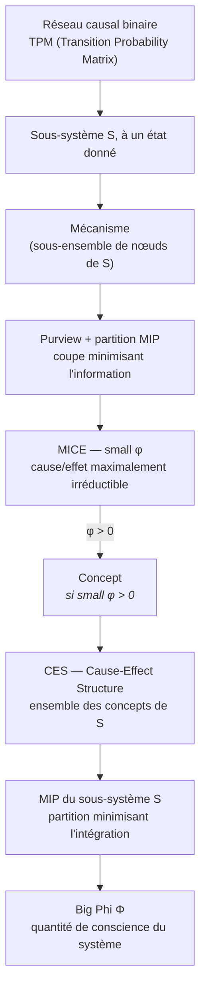
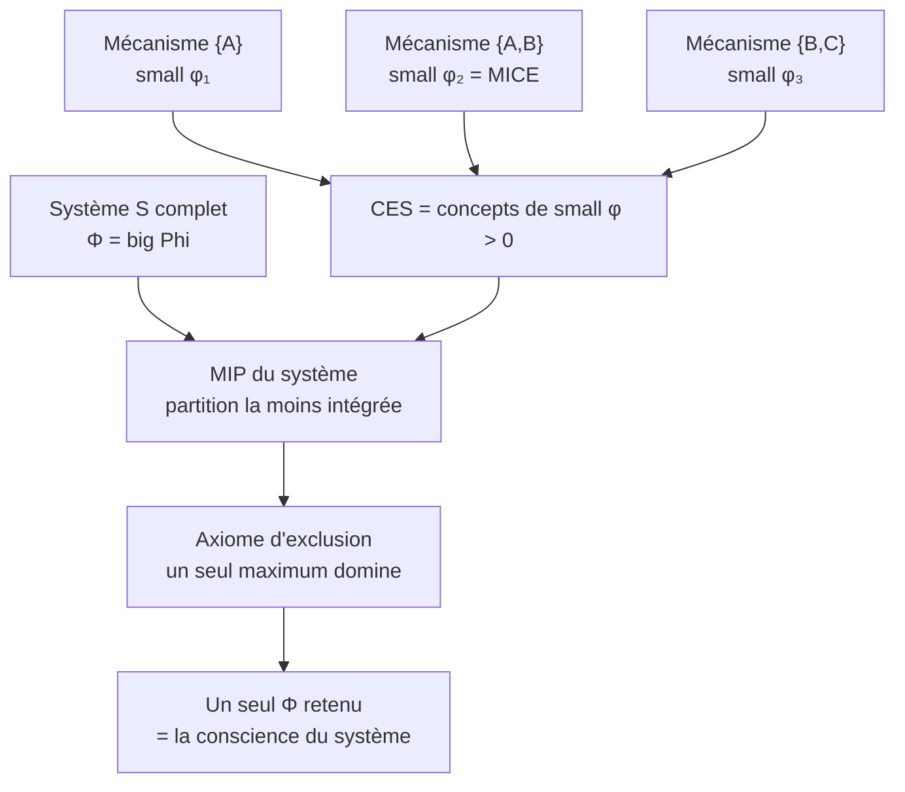

# IIT - Integrated Information Theory

<!-- CATALOG-STATUS
series: IIT
pedagogical_count: 3
breakdown: root=3
maturity: PRODUCTION=2, BETA=1
-->

[← Notebooks](../README.md) | [↑ ..](../README.md) | [→ Probas](../Probas/README.md)

La conscience est-elle mesurable ? La Théorie de l'Information Intégrée (IIT), proposée par Giulio Tononi, répond oui : un système est conscient dans la mesure où il intègre de l'information de manière non réductible. Plus formellement, la quantité de conscience d'un système correspond à la valeur **Phi** (big Phi), qui mesure le degré d'intégration causale irréductible. Cette série vous apprend à calculer cette mesure avec **PyPhi**, la bibliothèque de référence du laboratoire Tononi, et à explorer la géométrie informationnelle des systèmes complexes.

Le premier notebook couvre le spectre fondamental : construction de graphes causaux binaires, calcul des Transition Probability Matrices (TPM), définition des sous-systèmes, extraction des Cause-Effect Structures (CES), et exploration des macro-sous-systèmes. Le second approfondit les aspects avancés : partitionnement MIP, répertoires cause-effet, MICE, comparaison big Phi vs small phi, réseaux élargis à 4+ nœuds, coarse-graining et aperçu IIT 4.0. Le troisième est consacré au **coarse-graining et à la question de l'échelle du $\Phi$** : il opérationnalise le module `pyphi.macro` (information efficace de Hoel, énumération des regroupements, comparaison micro/macro) et examine honnêtement la prédiction de *causal emergence*.

**À qui s'adresse cette série** : étudiants en sciences cognitives, neuroscience computationnelle, et philosophie de l'esprit. Les notebooks (~60-90 min chacun) nécessitent Python 3.9 avec `pyphi` (installé via conda env dédié). Une familiarité avec les graphes et la logique booléenne suffit. Il constitue un complément théorique aux séries [Probas](../Probas/README.md) (modèles probabilistes) et [GameTheory](../GameTheory/README.md) (systèmes multi-agents), avec lesquelles il partage les concepts de causalité et d'interaction.

## Objectifs d'apprentissage

À l'issue de cette série, vous serez capable de :

1. **Construire et manipuler des réseaux causaux** binaires avec PyPhi (TPM, nœuds, connexions)
2. **Calculer Phi** pour un sous-système et interpréter sa valeur (intégration vs séparabilité)
3. **Analyser une Cause-Effect Structure (CES)** : identifier les concepts, mécanismes et purviews
4. **Appliquer le partitionnement MIP** pour localiser le "maillon faible" d'un système
5. **Différencier big Phi et small phi** et comprendre leur rôles respectifs dans la théorie
6. **Évaluer les limites computationnelles** de l'IIT et les stratégies de coarse-graining
7. **Discuter les implications philosophiques** de l'IIT pour la conscience artificielle

## Notebooks

| # | Notebook | Contenu | Durée |
|---|----------|---------|-------|
| 1 | [IIT-1-IntroToPyPhi](IIT-1-IntroToPyPhi.ipynb) | Réseau XOR 3-nœuds : TPM, calcul de Φ, CES, états inaccessibles, causation | 60-90 min |
| 2 | [IIT-2-AdvancedTopics](IIT-2-AdvancedTopics.ipynb) | MIP et bipartitions, répertoires cause-effet, MICE, big Φ sur réseau 4-nœuds, coarse-graining | 60-90 min |
| 3 | [IIT-3-CoarseGrainingMacroPhi](IIT-3-CoarseGrainingMacroPhi.ipynb) | Module `pyphi.macro` : information efficace (Hoel), énumération des regroupements, comparaison Φ micro/macro, causal emergence | 45-60 min |

## Parcours recommandés

```
Notebook 1 (Fondements)
    |
    v
Notebook 2 (Sujets avancés)
    |
    v
Notebook 3 (Coarse-graining & échelle du Φ)
```

| Objectif | Parcours |
|----------|----------|
| Découverte rapide | Notebook 1 seul |
| Maîtrise complète | Notebook 1 puis 2, puis 3 |
| Focus philosophie | Notebook 1 (sections CES + débats) + Notebook 2 (section IIT 4.0) |
| Focus emergence & échelle | Notebook 1 + Notebook 3 (causal emergence de Hoel) |

### Parcours d'apprentissage

**Phase 1 : Fondements (~90 min, notebook 1)**

Vous installez PyPhi dans un environnement conda dédié (Python 3.9 obligatoire), puis construisez votre premier réseau causal binaire. Le calcul de Phi sur un réseau XOR à 3 nœuds illustre concrètement la notion d'intégration irréductible. L'exploration de la CES révèle comment un système "spécifie" sa propre géométrie informationnelle. Les 3 exercices vous font varier les sous-systèmes (partiel, porte AND) et explorer les concepts de la CES pour développer une intuition sur ce qui fait monter ou baisser Phi.

**Phase 2 : Approfondissement (~90 min, notebook 2)**

Le deuxième notebook déconstruit le calcul de Phi : vous manipulez les bipartitions (MIP), les répertoires cause-effet, et les MICE (Maximally Irreducible Cause or Effect). La comparaison big Phi vs small phi clarifie les deux niveaux d'analyse. L'extension à des réseaux à 4+ nœuds montre l'explosion combinatoire et justifie le coarse-graining. L'aperçu IIT 4.0 ouvre sur les évolutions récentes de la théorie. Les 3 exercices testent votre compréhension des répertoires, du Phi multi-états et des réseaux feed-forward (Phi = 0 attendu).

**Phase 3 : Échelle et emergence (~60 min, notebook 3)**

Le troisième notebook opérationnalise le module `pyphi.macro` resté conceptuel jusque-là : vous mesurez l'**information efficace** (EI) de Hoel, énumérez les regroupements (coarse-grain) possibles d'un réseau, et comparez $\Phi$ à l'échelle micro et macro sur l'exemple canonique de pyphi. Surtout, il examine **honnêtement** la prédiction contre-intuitive de *causal emergence* (Hoel 2013) : pourquoi le $\Phi$ macro ne dépasse le $\Phi$ micro que sur des réseaux probabilistes où le coarse-grain filtre du bruit, et pas sur des toys déterministes. Les 3 exercices portent sur la dégénérescence (réseau AND), l'énumération des regroupements et le test d'une hypothèse d'emergence.

## Contenu détaillé

### IIT-1-IntroToPyPhi.ipynb

| Section | Contenu |
|---------|---------|
| Installation | `pip install pyphi`, vérification de la version de la bibliothèque |
| Réseaux | Réseau XOR 3-nœuds de référence, inspection des `node_labels` |
| TPM | Conversion *state-by-node*, dimensions de la matrice de transition |
| Sous-systèmes & Φ | Calcul de Φ d'un sous-système à un état donné, boucle sur plusieurs états |
| États inaccessibles | Validation via `StateUnreachableError`, option `VALIDATE_SUBSYSTEM_STATES` |
| CES | `pyphi.compute.ces`, décompte des concepts d'un sous-système |
| Causation actuelle | Liens causaux d'une transition (`account`), mécanisme d'un concept |
| Macro-sous-systèmes | Coarse-graining, blackboxing (section conceptuelle) |

### IIT-2-AdvancedTopics.ipynb

| Section | Contenu |
|---------|---------|
| Rappels | Réseau XOR 3-nœuds, reprise des concepts du notebook 1 |
| Partitionnement MIP | `bipartition`, décompte des partitions, interprétation de la coupe minimale |
| Répertoires cause-effet | Répertoires cause, effet et non-perturbé d'un mécanisme donné |
| MICE et concepts | MICE du mécanisme {A,B}, décompte des concepts de la CES |
| Big Phi vs Small Phi | Big Phi au niveau système (SIA) face au small phi d'un mécanisme (MICE) |
| Réseaux élargis | Réseau 4-nœuds en anneau (XOR cyclique), Φ sur système élargi |
| Performance | Timing du calcul de CES, module `pyphi.macro` |
| IIT 4.0 | Concept-Style SIA, limites computationnelles, débats |

### IIT-3-CoarseGrainingMacroPhi.ipynb

| Section | Contenu |
|---------|---------|
| Setup | Configuration mono-cœur déterministe de `pyphi.macro` |
| Échelle micro | Réseau copy 3-nœuds, information efficace (EI) et $\Phi$ de référence |
| Méthode coarse-grain | `all_partitions` : énumération des regroupements possibles |
| Échelle macro | Exemple canonique `macro_network`, $\Phi$ coarse-grained |
| Comparaison micro/macro | $\Phi$ macro vs $\Phi$ micro, interprétation honnête de l'emergence |
| Causal emergence | Hoel 2013 : pourquoi l'emergence positive n'est ni automatique ni garantie |

## Concepts clés

| Concept | Explication | Analogie |
|---------|-------------|----------|
| **TPM** | Règles d'évolution du système | Lois de la physique |
| **État** | Configuration binaire des nœuds (0 ou 1) | Instantané cérébral |
| **Phi (Big Phi)** | Niveau d'intégration du système | Force d'un nœud de corde |
| **Small phi** | Intégration d'un mécanisme individuel | Tension d'un fil du nœud |
| **MIP** | Point faible du système (Minimum Information Partition) | Maillon le plus faible |
| **CES** | Géométrie informationnelle (Cause-Effect Structure) | Forme d'une pensée |
| **MICE** | Mécanisme maximalement irréductible | Brique élémentaire de conscience |
| **Purview** | Ensemble de nœuds sur lesquels un mécanisme spécifie de l'information | Champ d'influence |

*Comment ces concepts s'enchaînent pour produire Φ — la chaîne de calcul de l'IIT 3.0
(réalisé par PyPhi) :*



## Prérequis

### Connaissances requises

- Python de base (imports, fonctions, tableaux)
- Logique booléenne (états binaires 0, 1)
- Notions de théorie des graphes (nœuds, connexions)

### Environnement Python

```bash
# Automated setup (creates conda env + registers kernel)
powershell -File scripts/setup_pyphi_env.ps1

# Manual setup (Python 3.9 required for PyPhi 1.2.0)
conda create --name pyphi python=3.9 -y
conda activate pyphi
pip install pyphi==1.2.0 numpy scipy ipykernel
python -m ipykernel install --user --name pyphi --display-name "Python 3 (PyPhi/IIT)"
```

### Dépendances

| Package | Version | Utilisation |
|---------|---------|-------------|
| pyphi | 1.2.0+ | Calculs IIT |
| numpy | 1.21.6+ | Calcul numérique |
| scipy | 0.13.3+ | Fonctions scientifiques |

## Limitations connues

| Problème | Cause | Solution |
|----------|-------|----------|
| `ImportError: cannot import name 'Iterable'` | PyPhi 1.2.0 utilise `collections.Iterable` (supprimé Python 3.10+) | Utiliser Python 3.9 (`conda create -n pyphi python=3.9`) |
| StateUnreachableError | États inaccessibles | Configuration `VALIDATE_SUBSYSTEM_STATES` |
| Performance | Phi calcul intensif pour grands réseaux | Limiter taille des réseaux |

## Théorie IIT

La Théorie de l'Information Intégrée (IIT) propose une approche mathématique de la conscience :

1. **Information** : Un système conscient doit spécifier un grand nombre d'états possibles
2. **Intégration** : L'information doit être intégrée (non décomposable)
3. **Exclusion** : Un seul niveau de Phi domine à tout moment

**Phi** mesure le degré d'intégration informationnelle d'un système. Un Phi > 0 indique une intégration irréductible, suggérant une forme de conscience.

*Les deux niveaux d'analyse de l'IIT — small phi (un mécanisme) remonte vers big Phi
(le système), et l'axiome d'exclusion ne retient qu'un seul maximum à la fois :*



## Portée scientifique et débats

L'IIT n'est pas qu'une spéculation philosophique : elle a engendré des outils utilisés en clinique et alimente l'un des débats les plus vifs des neurosciences.

- **Mesure clinique de la conscience.** Le *Perturbational Complexity Index* (PCI), inspiré des principes de l'IIT, est utilisé pour évaluer la conscience chez des patients non communicants (coma, état végétatif, anesthésie). Le protocole "zap-and-zip" (stimulation TMS + EEG, compression de la réponse) distingue empiriquement les états conscients des états inconscients — une retombée concrète et reproductible d'une théorie de la conscience.
- **Une théorie concurrente.** L'IIT s'oppose frontalement aux théories de type *Global Workspace* (Dehaene, Baars), qui font de la conscience une diffusion globale de l'information plutôt qu'une intégration causale locale. Des programmes de tests adversariaux (collaboration Templeton) confrontent leurs prédictions sur des données réelles.
- **Enjeu pour l'IA.** L'IIT prédit qu'un réseau purement *feed-forward* (comme l'inférence d'un LLM classique) a un Phi nul : il calcule sans "être" conscient, faute de boucles causales intégrées. Cette thèse est centrale dans les discussions sur la conscience artificielle.
- **Controverse.** Le calcul exact de Phi est computationnellement intractable au-delà de petits réseaux (d'où le coarse-graining du notebook), et la théorie a fait l'objet d'une critique publique retentissante (lettre ouverte de 2023 la qualifiant de "pseudoscience") — un cas d'école pour discuter des critères de scientificité d'une théorie de l'esprit.

Ces tensions font de l'IIT un excellent terrain pour exercer l'esprit critique : on y manipule un formalisme précis (calculable avec PyPhi) tout en gardant à l'esprit les limites de son interprétation.

## FAQ

### Pourquoi Python 3.9 est-il obligatoire ?

PyPhi 1.2.0 utilise `collections.Iterable`, qui a été supprimé dans Python 3.10 (PEP 585). Tenter d'installer PyPhi sur Python 3.10+ provoque une `ImportError` dès le `import pyphi`. L'environnement conda dédié isole cette contrainte sans affecter vos autres projets.

### L'IIT est-elle acceptée par la communauté scientifique ?

L'IIT est une théorie **controversée**. Elle a des retombées cliniques réelles (PCI pour mesurer la conscience chez les patients comateux) mais reste débattue : certains chercheurs la considèrent comme le meilleur cadre théorique existant, d'autres la critiquent comme pseudoscience. Les notebooks présentent le formalisme et ses outils sans prendre position — c'est un excellent terrain pour exercer l'esprit critique.

### Quelle est la différence entre big Phi et small phi ?

**Big Phi** ($\Phi$) mesure l'intégration au niveau du système complet : il quantifie à quel point le système est "plus que la somme de ses parties". **Small phi** ($\varphi$) mesure l'intégration d'un mécanisme individuel (un sous-ensemble de nœuds) : chaque concept dans la CES a son propre small phi. La CES est l'ensemble des concepts dont le small phi > 0, et le big Phi agrège ces contributions.

### Un réseau feed-forward peut-il être conscient selon l'IIT ?

Non. L'IIT prédit qu'un réseau purement feed-forward (A -> B -> C, sans boucle de rétroaction) a un Phi de zéro. L'information transite mais n'est pas "intégrée" — il n'y a pas de causalité bidirectionnelle. C'est un résultat fondamental pour le débat sur la conscience des LLMs, dont l'inférence est essentiellement feed-forward.

### Le calcul de Phi est-il tractable en pratique ?

Pas au-delà de ~5-7 nœuds en pratique. Le nombre de bipartitions à évaluer croît super-exponentiellement avec la taille du système. Le notebook 2 (section 7) démontre cette explosion et introduit le coarse-graining comme stratégie d'approximation. Pour les systèmes réels (cerveau humain : ~86 milliards de neurones), seul le PCI (mesure clinique indirecte) est applicable.

### Peut-on utiliser PyPhi pour un projet de recherche ?

Oui, mais avec caveats. PyPhi est la référence pour IIT 3.0, mais IIT 4.0 (2024+) introduit des changements fondamentaux dans le calcul de Phi. Pour un projet de recherche, vérifier la version de la théorie que vous suivez et consulter la [documentation PyPhi](https://pyphi.readthedocs.io/en/stable/) pour les limitations actuelles.

## Ressources

### Documentation PyPhi

- [PyPhi Documentation officielle](https://pyphi.readthedocs.io/en/stable/)
- [PyPhi GitHub](https://github.com/wmayner/pyphi)
- [Exemples PyPhi](https://github.com/wmayner/pyphi/tree/master/examples)

### Fondements théoriques

- Tononi, G. (2008) - *Consciousness as Integrated Information*
- Oizumi, M., Albantakis, L., Tononi, G. (2014) - *From the Phenomenology to the Mechanisms of Consciousness*

## Structure des fichiers

```
IIT/
├── IIT-1-IntroToPyPhi.ipynb           # Notebook 1 : introduction
├── IIT-2-AdvancedTopics.ipynb         # Notebook 2 : sujets avances
├── IIT-3-CoarseGrainingMacroPhi.ipynb # Notebook 3 : coarse-graining & échelle du Φ
├── scripts/
│   ├── setup_pyphi_env.ps1     # Setup conda env + kernel
│   └── build_notebook.py       # Script de construction notebook 2
└── README.md                   # Cette documentation
```

## Conclusion / Prochaines étapes

### Ce que vous avez appris

Cette série vous a fait traverser la proposition la plus quantitative de la neuroscience théorique contemporaine : **traiter la conscience comme une propriété mesurable** d'un système, plutôt que comme un épiphénomène mystérieux. L'arc pédagogique :

- **Le geste fondateur** — poser qu'un système est conscient dans la mesure exacte où il intègre de l'information de manière **irréductible** : ni plus ni moins que ce que ses parties prises isolément ne peuvent expliquer. Cette irréductibilité, c'est **Phi**.
- **L'instrument** — PyPhi, la bibliothèque de référence du laboratoire Tononi, qui opérationnalise la théorie : graphes causaux binaires, Transition Probability Matrices, sous-systèmes, extraction des Cause-Effect Structures, et tout le calcul combinatoire que l'intégration exige.
- **La finesse** — distinguer **big Phi** (la conscience du système entier) et **small phi** (l'irréductibilité d'un concept local), comprendre le partitionnement MIP qui localise le « maillon faible » d'un système, et saisir pourquoi le coarse-graining devient indispensable dès que le réseau grandit.

La thèse est vertigineuse et honnêtement présentée : si IIT a raison, la conscience n'est pas un mystère à élucider mais une **quantité à calculer** — et un système artificiel suffisamment intégré pourrait, en principe, l'incarber.

### Prochaines étapes

- **Approfondir les fondements probabilistes** : [Probas](../Probas/README.md) (Infer.NET, programmation probabiliste) fournit les outils de modélisation causale et d'inférence bayésienne qui sous-tendent le calcul des TPM.
- **Élargir aux systèmes multi-agents** : [GameTheory](../GameTheory/README.md) (théorie des jeux, choix social) partage avec IIT la question centrale — comment l'interaction entre composants produit-elle des propriétés émergentes que les composants seuls ne possèdent pas ?
- **Questionner la portée** : relisez la section « Portée scientifique et débats » — IIT est une théorie vivante et contestée, pas un consensus. Les critiques empiriques (absence de tests décisifs) et théoriques (mesure de la conscience chez les systèmes simples) restent ouvertes, et c'est sain pour un champ scientifique.
- Pour la pratique : reprenez le notebook d'Advanced Topics et expérimentez la limite computationnelle — à partir de combien de nœuds le calcul de Phi devient-il prohibitif, et que révèle le coarse-graining sur les macro-systèmes ?

### Le fil rouge

IIT propose un changement de regard radical : ne plus demander « qu'est-ce que la conscience ? » mais **« combien de conscience ce système intègre-t-il ? »**. La série vous a donné l'outil (PyPhi) et le formalisme (Phi, CES, MIP) pour transformer une question philosophique en un calcul — en gardant à l'esprit qu'aucune mesure, aussi élégante soit-elle, ne clôt à elle seule le débat sur ce que c'est que d'être un système qui ressent quelque chose.

## Extension : la série ICT (Integrated Causal Trajectories)

La série IIT étudie des structures causales **à un instant donné**. Une extension expérimentale,
**ICT** (Integrated Causal Trajectories, Epic #4588), prolonge ce regard vers les **trajectoires**
de structures causales : comment une organisation se maintient, se transforme, se répare, change
d'échelle et traverse un espace de possibles ($C_0 \rightarrow C_1 \rightarrow \dots \rightarrow C_n$).

ICT s'appuie sur un package léger `ict/` posé à côté de PyPhi (autonome pour les simulations et
mesures, PyPhi pour les calculs IIT stricts), et s'ouvre sur deux articles fondateurs : le tri vu
comme morphogenèse minimale (Zhang, Goldstein & Levin, 2025) et l'ingénierie de l'émergence
multi-échelle (Jansma & Hoel, 2025).

La série progresse en **deux strates**. La **strate 1** (ICT-0 à ICT-7) prend le **tri
auto-organisé** comme banc d'essai entièrement transparent : trajectoires enregistrables,
compétences inattendues réelles, pont vers la causal emergence. Elle bute toutefois sur trois
limites — un **attracteur global unique**, un **but imposé de l'extérieur**, une **hiérarchie non
générative**. La **strate 2** (ICT-8+) ouvre la *morphogenèse dynamique* sur des systèmes dont le
paysage d'attracteurs est **engendré par la dynamique** (bifurcation, réaction-diffusion), levant
ces limites une à une.

### Strate 1 — le tri auto-organisé (transparent et calculable)

| Document | Contenu |
|----------|---------|
| [ICT-0-Framing](ICT-0-Framing.md) | Cadrage de la série : de l'état à la trajectoire, articles fondateurs, feuille de route |
| [ICT-1-PhiTrajectories](ICT-1-PhiTrajectories.ipynb) | Trajectoires de $\Phi$ : paysage de $\Phi$, suivi de $\Phi$ le long d'un attracteur (pulsations) et robustesse aux perturbations — la photographie IIT mise en mouvement, avec le vrai PyPhi |
| [ICT-2-SelfSortingMorphogenesis](ICT-2-SelfSortingMorphogenesis.ipynb) | Le tri auto-organisé comme morphogenèse : trajectoire dans le morphospace, robustesse aux cellules défectueuses, délai de gratification, auto-réparation, impasses chimériques |
| [ICT-3-RobustnessDelayedGratification](ICT-3-RobustnessDelayedGratification.ipynb) | Robustesse & délai de gratification, étude quantitative : dégradation gracieuse face aux cellules défectueuses, distributions de récupération, comptage du délai de gratification |
| [ICT-4-ChimericArraysKinAggregation](ICT-4-ChimericArraysKinAggregation.ipynb) | Tableaux chimériques & agrégation émergente : réparation bidirectionnelle (guérit l'impasse d'ICT-2) puis affinité « kin », mesurée honnêtement (sans degrés de liberté, pas d'agrégation) |
| [ICT-5-CausalEmergence](ICT-5-CausalEmergence.ipynb) | Émergence causale : $\Phi$ et information effective aux échelles micro/macro, recherche systématique du coarse-graining (vrai `pyphi.macro`), émergence discriminante (Jansma & Hoel, 2025) |
| [ICT-6-SortingToTPM-CausalEmergence](ICT-6-SortingToTPM-CausalEmergence.ipynb) | Pont tri → TPM : chaîne de Markov estimée depuis les trajectoires de tri d'ICT-2, puis émergence causale multi-échelles avec l'outillage *Causal Emergence 2.0* (Hoel, 2025) au-delà de la borne de taille de PyPhi |
| [ICT-7-ScaleFreeSignatures](ICT-7-ScaleFreeSignatures.ipynb) | Signatures scale-free & criticalité : détecter une loi de puissance *sans se faire avoir* (MLE de Hill, choix de $x_{\min}$, KS, à la Clauset et al.) ; étalon critique (branchement, exposant $3/2$) vs tri qui *paraît* sans échelle mais possède une taille caractéristique |

### Strate 2 — morphogenèse dynamique (paysages d'attracteurs)

| Document | Contenu |
|----------|---------|
| [ICT-8-AttractorLandscapesEWS](ICT-8-AttractorLandscapesEWS.ipynb) | Paysages d'attracteurs & signaux précurseurs — *les deux tressées*. Modèle de pâturage de May (1977), système canonique des *early-warning signals* (Scheffer 2009). Bistabilité entre deux états positifs alternatifs, bifurcation pli, catastrophe = changement de régime. Chaque image (vallée qui s'aplatit, mémoire du danger, alerte) adossée à une mesure réelle (potentiel effectif, valeur propre → 0, variance ↑, autocorrélation ↑, τ de Kendall). Lève l'attracteur unique + ouvre une hiérarchie générative |
| [ICT-9-AgencyRegeneration](ICT-9-AgencyRegeneration.ipynb) | Agence & régénération — *réparer sa forme, ou seulement dériver ?* Morphogenèse réaction-diffusion de Gray-Scott (Pearson 1993) : le système engendre un motif auto-entretenu (point de consigne **intrinsèque**), on l'ablate via une intervention `do(·)`, puis on contraste **deux mondes contrefactuels** (Pearl) — réaction-diffusion qui régénère vs diffusion pure qui dissout. L'agence n'est jamais déclarée, elle est **mesurée** comme *gain de réparation* (recouvrement RD − recouvrement diffusion). *Sans complaisance* : les mesures naïves de ressemblance (pixel-à-pixel, cosinus spectral) fabriquent un signal fantôme ; seule la structure restaurée contrastée au contrôle passif tient. Lève le **but extrinsèque** : un point de consigne que le système maintient de lui-même |
| [ICT-10-CatastropheGrammar](ICT-10-CatastropheGrammar.ipynb) | Grammaire des catastrophes — *l'obstacle qui engendre les formes, le verbe qui les fait basculer*. **Charnière strate 2→3**, prélude sémiophysique de R. Thom (*Esquisse d'une sémiophysique*, 1991). Sur la catastrophe canonique (la **fronce**), deux fils tressés et **mesurés** : le **métathéorème** (le comptage d'équilibres ne change qu'aux **plis** — exactement 2 transitions le long d'un chemin générique ; *l'obstacle comme source de l'ontologie*, clôt la strate 2) et le **lacet de prédation** (cycle d'hystérésis à 2 catastrophes — perception J, capture K — d'aire signée non nulle = irréversibilité ; un **représentant interne** `p̂` dont le contenu anticipateur est *mesuré* : pic de corrélation au futur, battant la persistance ; ouvre la strate 3). La correspondance linguistique du **Ch.2 « Le Langage »** de Thom est *nommée* (pivots ↔ transitions de comptage ; verbe transitif SVO ↔ lacet ; anticipation ↔ `p̂`), avec son caveat explicite de **non-prédictivité** et les barreaux du pont basse-dim → haute-dim (séries neurosymbolique, Lean ; veille EML #4653). *Sans complaisance* : hors régime non dégénéré ($a<0$), zéro saut, aire nulle — un *fantôme* |

Reste sur la feuille de route de [ICT-0-Framing](ICT-0-Framing.md) : **ICT-11/12** (profils d'agence
causale micro/méso/macro ; renormalisation causale & invariance multi-échelle) et **ICT-Synthèse**.

## Ponts causaux : le do-calculus de Pearl à travers les paradigmes

Quatre séries du dépôt abordent la **causalité** — non pas la corrélation, mais la question
« que se passe-t-il si j'**interviens** ? ». Elles le font dans des paradigmes radicalement
différents (logique symbolique, inférence bayésienne par message passing, MCMC, théorie de l'information),
et pourtant elles partagent **le même noyau** : l'opérateur `do(·)` de Judea Pearl et son
**échelle de la causalité** à trois barreaux.

**L'échelle de la causalité (ladder of causation)** :

| Barreau | Question | Formalisme | Exemple canonique |
|---------|----------|------------|-------------------|
| **L1 — Association** | « Que voit-on ? » | `P(Y \| X)` | observer le baromètre baisser prédit la pluie |
| **L2 — Intervention** | « Que se passe-t-il si on agit ? » | `P(Y \| do(X))` | *forcer* le baromètre à baisser ne fait **pas** pleuvoir |
| **L3 — Contrefactuel** | « Qu'aurait-il fallu ? » | `P(Y_x \| X', Y')` | « l'herbe aurait-elle été mouillée si on avait coupé l'arrosage ? » |

Le saut **L1 → L2** est le cœur du do-calculus : `do(X=x)` **mutile** le graphe causal — il coupe
les arcs entrants de `X`, brisant les chemins de confusion — de sorte que
`P(Y|do(X)) ≠ P(Y|X)` dès qu'un confondeur existe.

**Le même opérateur, quatre instanciations** :

| Paradigme | Notebook | Instanciation de `do(·)` | Résultat-signature |
|-----------|----------|---------------------------|--------------------|
| **Symbolique** (logique propositionnelle, Java/Tweety) | [Tweety-11-Causal](../SymbolicAI/Tweety/Tweety-11-Causal.ipynb) | `scm.intervene(p, b)` → nouveau SCM dont l'équation de `p` devient une constante | `P(rain\|drops)=True ≠ P(rain\|do(drops))=False` (baromètre) |
| **Bayésien par message passing** (Infer.NET, EP/VMP — Gibbs disponible) | [Infer-22](../Probas/Infer/Infer-22-Causal-Inference.ipynb) | mutilation de graphe `Variable.Bernoulli(1.0)` ; backdoor / front-door | paradoxe de Simpson résolu, identifiabilité par ajustement |
| **Bayésien MCMC** (PyMC) | [PyMC-22](../Probas/PyMC/PyMC-22-Causal-Inference.ipynb) | opérateur natif `pm.do(model, {X:x})` ; backdoor / front-door | contrefactuel par abduction (postérieur sur les exogènes) |
| **Théorie de l'information / émergence** (ICT) | [ICT-5-CausalEmergence](ICT-5-CausalEmergence.ipynb) | distribution d'intervention `p(C)` **uniforme** sur les états = `do(X_t = x)` appliqué à tout le micro-état | quelle **échelle** « fait » le plus de travail causal (EI / CP) |

**Le pont le plus profond — ICT-5 lève le do-calculus au niveau des échelles.** Dans la théorie
de l'émergence causale (Hoel, *Causal Emergence 2.0* ; Jansma & Hoel, *Engineering Emergence*,
2025), l'**information effective** (EI) et la *causal primitive* (`CP = déterminisme −
dégénérescence`, équivalente à l'`effectiveness`) se calculent en plaçant le système sous une
**distribution d'intervention** `p(C)` — par défaut **uniforme sur les états**. C'est exactement
`do(X_t = x)` de Pearl, appliqué uniformément : on ne *regarde* pas la dynamique, on la *sonde*
en forçant chaque état d'entrée. Mesurer « combien de travail causal fait un mécanisme »
**exige** donc l'opérateur `do`, tout comme définir un effet causal l'exige chez Pearl.
L'**émergence** apparaît quand une description **macro** (gros-grain) réalise *plus* de travail
causal que le micro — l'`effectiveness` monte sous coarse-graining.

**Parcours de lecture conseillé** : commencer par le **symbolique qualitatif**
([Tweety-11](../SymbolicAI/Tweety/Tweety-11-Causal.ipynb)) pour *voir* `observe` vs `do` sans
nombres ; passer au **quantitatif distributionnel** ([Infer-22](../Probas/Infer/Infer-22-Causal-Inference.ipynb)
message passing, [PyMC-22](../Probas/PyMC/PyMC-22-Causal-Inference.ipynb) MCMC) pour *calculer* les effets
et lever le paradoxe de Simpson ; finir par l'**information-théorique**
([ICT-5](ICT-5-CausalEmergence.ipynb)) où le même `do` mesure le travail causal **à travers les
échelles**.

**Articles d'ancrage** : Pearl, *Causality* (2009) ; Hoel, *Causal Emergence 2.0*
(arXiv:2503.13395) ; Jansma & Hoel, *Engineering Emergence* (arXiv:2510.02649).

*Voir #4208 (surfaçage des différenciants du dépôt) et l'Epic ICT #4588.*

## Licence

Voir la licence du repository principal.

---

*Version 1.2.0 — Juin 2026*
