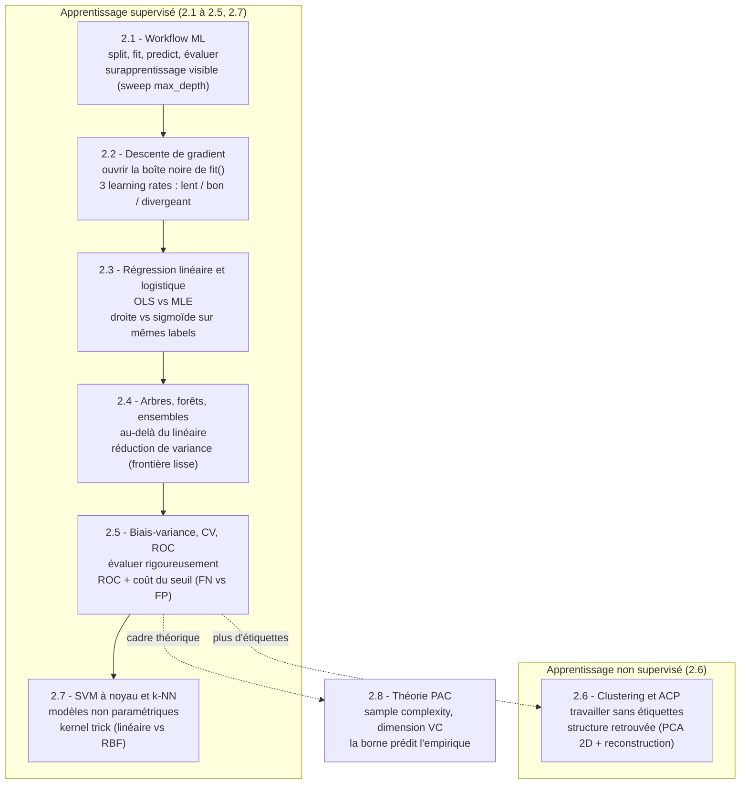

# 02-ML-Cours — Le socle Machine Learning canonique avec scikit-learn

[← DataScienceWithAgents (série parente)](../README.md) | [01-PythonForDataScience (prérequis) →](../01-PythonForDataScience/README.md)

**Kernel** : Python 3 · **Bibliothèque** : scikit-learn · **Niveau** : intermédiaire (post NumPy/Pandas)

## Pourquoi cette série

La formation `DataScienceWithAgents` saute aujourd'hui un maillon. Après les fondations NumPy/Pandas ([`01-PythonForDataScience`](../01-PythonForDataScience/)), les *labs agentic* (LangChain, Google ADK) demandent à des agents LLM de produire et d'exécuter du code de data science — y compris du machine learning. Mais entre les deux, **aucun notebook n'enseigne le workflow ML, un modèle ou une métrique comme un sujet en soi** : scikit-learn n'apparaît que comme une séquence magique non expliquée (un `fit()` isolé dans un lab de visualisation, ou cité en litteral dans une chaîne LLM).

Cette série comble ce socle manquant. Elle pose, **à la main et de façon canonique**, les huit chapitres fondamentaux du machine learning supervisé et non supervisé — le référent qui rend *jugeable* ce qu'un agent produira ensuite. L'arc pédagogique suit la progression classique : le **workflow** d'ensemble, puis on ouvre les boîtes noires (**descente de gradient**, **fonction de lien**), on élargit la famille de modèles (**régression linéaire/logistique**, **arbres et ensembles**, **SVM à noyau et k plus proches voisins**), on formalise l'évaluation (**biais-variance, validation croisée, ROC**), puis l'on bascule en **non supervisé** (**clustering, ACP**), avant de clore par le **cadre théorique** (**théorie PAC, dimension VC**). Chaque notebook rend visible un concept-phare — le surapprentissage, la divergence d'un learning rate, la frontière de décision, la réduction de variance, le coût d'un seuil, le kernel trick, la structure retrouvée sans étiquettes, et le nombre d'exemples suffisant pour généraliser.

La thèse est volontairement classique : on ne peut évaluer ce qu'un agent génère comme pipeline scikit-learn que si l'on sait soi-même ce que `fit()` minimise, pourquoi un arbre surapprend, et ce que mesure une AUC. Cette série fournit ce référent, en gardant les outils à leur juste place (vraies API scikit-learn, exécutées, sorties réelles committées).

## Vue d'ensemble

| Notebook | Sujet | Concept-phare | Dataset |
|----------|-------|---------------|---------|
| [2.1-Workflow-ML](2.1-Workflow-ML.ipynb) | Le workflow ML (split → fit → predict → évaluer) | Surapprentissage rendu **visible** (sweep `max_depth` 1→25) | synthétique `make_*` |
| [2.2-Descente-de-gradient](2.2-Descente-de-gradient.ipynb) | Ouvrir la boîte noire de `fit()` | 3 learning rates (lent / bon / **divergeant**) | synthétique `make_regression` |
| [2.3-Regression-lineaire-logistique](2.3-Regression-lineaire-logistique.ipynb) | Régression linéaire (OLS) vs logistique (MLE) | **OLS vs MLE** : droite vs sigmoïde sur mêmes labels binaires | synthétique `make_*` |
| [2.4-Arbres-Forets-Ensembles](2.4-Arbres-Forets-Ensembles.ipynb) | Arbres, forêt aléatoire, gradient boosting | **Réduction de variance** : frontière en escalier vs lisse | réel `load_breast_cancer` |
| [2.5-Biais-Variance-CV-ROC](2.5-Biais-Variance-CV-ROC.ipynb) | Compromis biais-variance, validation croisée, ROC/AUC | **ROC + coût du seuil** : faux négatifs vs faux positifs | réel `load_breast_cancer` |
| [2.6-Clustering-KMeans-PCA](2.6-Clustering-KMeans-PCA.ipynb) | Apprentissage non supervisé : KMeans + ACP | **Structure retrouvée sans étiquettes** (PCA 2D + reconstruction) | réel `load_digits` |
| [2.7-Modeles-Non-Parametriques](2.7-Modeles-Non-Parametriques.ipynb) | SVM à noyau et k plus proches voisins | **Le kernel trick rendu visible** (linéaire vs RBF sur demi-lunes) | synthétique `make_moons` + réel `load_breast_cancer` |
| [2.8-Theorie-PAC](2.8-Theorie-PAC.ipynb) | Théorie PAC : sample complexity et dimension VC | **La borne PAC prédit l'empirique** (m_min théorique vs courbe d'erreur) | synthétique `make_*` |

## L'arc pédagogique

Le fil rouge de la série : on pose le **workflow**, on ouvre les **boîtes noires** (descente de gradient, fonction de lien), on élargit la **famille de modèles** (linéaire/logistique, arbres, ensembles, SVM à noyau et k-NN), on formalise l'**évaluation** (biais-variance, validation croisée, ROC), puis l'on bascule en **non supervisé** (clustering, ACP), avant de clore par le **cadre théorique** (théorie PAC, dimension VC). Chaque notebook rend visible un concept-phare distinct.

## Pédagogie

Chaque notebook suit les mêmes conventions :

- **Concept-phare rendu visible.** Plutôt qu'un seul ajustement dégénéré, chaque notebook pose une démonstration non-triviale qui **exerce la capacité distinctive** de la technique (le compromis biais-variance, le choix du learning rate, l'effet du seuil de décision) et la rend lisible dans une figure réelle.
- **Exemples résolus et exercices cohabitent.** Les cellules d'exemple (solutions complètes) ne sont jamais stubbées ; les cellules d'exercice sont laissées à compléter (`# TODO etudiant`), avec indices et `# Etape N`. Le notebook s'exécute de bout en bout même exercices non complétés (jamais d'erreur volontaire).
- **≥ 3 exercices par notebook**, répartis dans le flux, chacun précédé d'un énoncé avec objectif et indices.
- **Citations ancrées.** Chaque concept fondateur renvoie à son article canonique (blocknote inline `> **Référence.**` + cellule `## References` finale avec glose en français).
- **Sorties réelles committées.** Les notebooks sont exécutés via papermill (kernel `python3`, environnement `coursia-ml-training`), outputs et `execution_count` inclus — la preuve d'exécution fait partie du livrable.

## Objectifs d'apprentissage (série)

À l'issue de la série, l'étudiant sait :

1. **Mettre en place un workflow ML** complet (séparation train/test, ajustement, prédiction, métrique) et **diagnostiquer le surapprentissage**.
2. **Ouvrir la boîte noire** de l'optimisation : ce que minimise la descente de gradient, et pourquoi le learning rate contrôle la convergence.
3. **Choisir un modèle** linéaire ou logistique selon la nature de la cible (continue vs binaire), et **interpréter les coefficients** (OLS, MLE, odds ratios).
4. **Aller au-delà du linéaire** avec les arbres et les ensembles, et **comprendre la réduction de variance** qu'apportent les forêts.
5. **Évaluer rigoureusement** : compromis biais-variance, validation croisée k-fold, courbe ROC / AUC, choix de seuil selon le coût des erreurs.
6. **Travailler sans étiquettes** : regrouper (KMeans, méthode du coude) et réduire la dimension (ACP, variance expliquée).
7. **Aller au-delà des modèles paramétriques** : SVM (maximisation de la marge, kernel trick, vecteurs supports) et k plus proches voisins, et comprendre pourquoi la standardisation devient indispensable.
8. **Formaliser le cadre théorique** : théorie PAC (Valiant 1984), complexité d'échantillon `m ≥ (1/ε)(ln|H| + ln(1/δ))`, dimension VC (Vapnik-Chervonenkis 1971) — combien d'exemples suffisent pour généraliser, et le pont entre borne théorique et erreur empirique.

## Prérequis

- **NumPy et Pandas** : manipulation de tableaux et DataFrames ([`01-PythonForDataScience`](../01-PythonForDataScience/README.md)).
- Notions de base : fonction, dérivée, variance, probabilité.

## Suite logique

Cette série est le **référent manuel** des labs agentic qui suivent. Une fois le socle ML posé, le track [PythonAgentsForDataScience](../PythonAgentsForDataScience/README.md) (LangChain) et [AgenticDataScience](../AgenticDataScience/README.md) (Google ADK) demandent à des agents LLM de produire ce même type de pipeline — la valeur de ce qu'ils génèrent ne se juge qu'au regard de ce socle.

## Références transverses

Les citations canoniques ancrées dans la série (cellule `## References` de chaque notebook) incluent : Mitchell 1997 (généralisation), Cauchy 1847 (descente de gradient), Nelder & Wedderburn 1972 (modèles linéaires généralisés), Cox 1958 (régression logistique), Breiman et al. 1984 (CART), Breiman 2001 (forêts aléatoires), Friedman 2001 (gradient boosting), Stone 1974 (validation croisée), Bradley 1997 (AUC), MacQueen 1967 (k-means), Pearson 1901 (ACP), Cortes & Vapnik 1995 (réseaux de vecteurs supports), Cover & Hart 1967 (k plus proches voisins), Valiant 1984 (théorie PAC), Vapnik & Chervonenkis 1971 (dimension VC), Hastie/Tibshirani/Friedman 2009 (*The Elements of Statistical Learning*) et Pedregosa et al. 2011 (scikit-learn).

## Conclusion — ce que vous emportez

Au terme des huit chapitres, le machine learning supervisé et non supervisé n'est plus une suite d'appels `fit()` opaques mais un **paysage cartographié**. Vous savez désormais *ce que* minimise un modèle (moindres carrés ou vraisemblance), *comment* il le minimise (la descente de gradient et la sensibilité au learning rate), *pourquoi* il sur- ou sous-apprend (le compromis biais-variance), et *combien* d'exemples il faut pour généraliser (la borne PAC, la dimension VC). Vous savez aussi élargir la famille au-delà du linéaire (arbres, ensembles, SVM à noyau, k plus proches voisins), travailler sans étiquettes (clustering, ACP), et juger une décision au regard du **coût réel de ses erreurs** (courbe ROC, choix de seuil).

### Le fil rouge

La série s'ouvrait sur une thèse : *on ne peut juger ce qu'un agent LLM produit comme pipeline scikit-learn que si l'on sait soi-même ce que ce pipeline fait*. Ce socle vient de fournir ce référent. Là où un lab agentic vous montrera un agent appeler `RandomForestClassifier().fit(X, y)` puis afficher une AUC flatteuse, vous lisez désormais cet enchaînement d'un œil critique : la séparation train/test est-elle honnête (pas de fuite de données) ? La métrique est-elle adaptée au déséquilibre des classes ? Le seuil de décision correspond-il au coût métier des faux négatifs ? L'évaluation repose-t-elle sur une validation croisée ou sur un seul découpage chanceux ? Le socle rend l'agent **jugeable** — et c'est exactement la compétence que les tracks agentic suivants présupposent acquise.

### Pour prolonger

- **Approfondir la théorie** : Hastie, Tibshirani & Friedman, *The Elements of Statistical Learning* (2009) reprend et formalise l'ensemble de ces chapitres ; le [guide utilisateur scikit-learn](https://scikit-learn.org/stable/user_guide.html) (Pedregosa et al. 2011) en est le prolongement pratique direct.
- **Exercer le jugement** : reprenez un notebook des tracks [PythonAgentsForDataScience](../PythonAgentsForDataScience/README.md) ou [AgenticDataScience](../AgenticDataScience/README.md) et confrontez le pipeline produit par l'agent aux quatre questions ci-dessus — c'est le meilleur exercice de consolidation, car il met le socle au travail.
- **Vers le deep learning et le RL** : la descente de gradient (2.2) et la notion de capacité d'un modèle (2.8) sont les deux fondations directement réinvesties par les réseaux de neurones ; la série [RL](../../../RL/README.md) montre cette même descente de gradient à l'œuvre dans l'apprentissage par renforcement profond (DQN, PPO).

---

## Licence

Voir la licence du repository principal.
