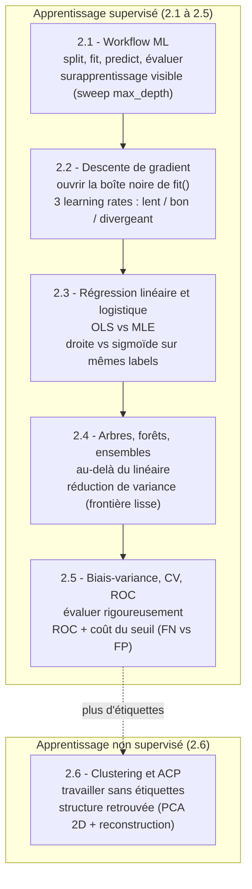

# 02-ML-Cours — Le socle Machine Learning canonique avec scikit-learn

[← DataScienceWithAgents (série parente)](../README.md) | [01-PythonForDataScience (prérequis) →](../01-PythonForDataScience/README.md)

**Kernel** : Python 3 · **Bibliothèque** : scikit-learn · **Niveau** : intermédiaire (post NumPy/Pandas)

## Pourquoi cette série

La formation `DataScienceWithAgents` saute aujourd'hui un maillon. Après les fondations NumPy/Pandas ([`01-PythonForDataScience`](../01-PythonForDataScience/)), les *labs agentic* (LangChain, Google ADK) demandent à des agents LLM de produire et d'exécuter du code de data science — y compris du machine learning. Mais entre les deux, **aucun notebook n'enseigne le workflow ML, un modèle ou une métrique comme un sujet en soi** : scikit-learn n'apparaît que comme une séquence magique non expliquée (un `fit()` isolé dans un lab de visualisation, ou cité en litteral dans une chaîne LLM).

Cette série comble ce socle manquant. Elle pose, **à la main et de façon canonique**, les six chapitres fondammentaux du machine learning supervisé et non supervisé — le référent qui rend *jugeable* ce qu'un agent produira ensuite. L'arc pédagogique suit la progression classique : le **workflow** d'ensemble, puis on ouvre les boîtes noires (**descente de gradient**, **fonction de lien**), on élargit la famille de modèles (**régression linéaire/logistique**, **arbres et ensembles**), on formalise l'évaluation (**biais-variance, validation croisée, ROC**), et l'on termine par le **non supervisé** (**clustering, ACP**). Chaque notebook rend visible un concept-phare — le surapprentissage, la divergence d'un learning rate, la frontière de décision, la réduction de variance, le coût d'un seuil, la structure retrouvée sans étiquettes.

La thèse est volontairement classique : on ne peut évaluer ce qu'un agent génère comme pipeline scikit-learn que si l'on sait soi-même ce que `fit()` minimise, pourquoi un arbre surapprend, et ce que mesure une AUC. Cette série fournit ce référent, en gardant les outils à leur juste place (vraies API scikit-learn, exécutées, sorties réelles committées).

## Vue d'ensemble

| Notebook | Sujet | Concept-phare | Dataset |
|----------|-------|---------------|---------|
| [2.1-Workflow-ML](2.1-Workflow-ML.ipynb) | Le workflow ML (split → fit → predict → évaluer) | Surapprentissage rendu **visible** (sweep `max_depth` 1→25) | synthétique `make_*` |
| [2.2-Descente-de-gradient](2.2-Descente-de-gradient.ipynb) | Ouvrir la boîte noire de `fit()` | 3 learning rates (lent / bon / **divergeant**) | synthétique `make_regression` |
| [2.3-Regression-lineaire-logistique](2.3-Regression-lineaire-logistique.ipynb) | Régression linéaire (OLS) vs logistique (MLE) | **OLS vs MLE** : droite vs sigmoïde sur mêmes labels binaires | synthétique `make_*` |
| [2.4-Arbres-Forets-Ensembles](2.4-Arbres-Forets-Ensembles.ipynb) | Arbres, forêt aléatoire, gradient boosting | **Réduction de variance** : frontière en escalier vs lisse | réel `load_breast_cancer` |
| [2.5-Biais-Variance-CV-ROC](2.5-Biais-Variance-CV-ROC.ipynb) | Compromis biais-variance, validation croisée, ROC/AUC | **ROC + coût du seuil** : faux négatifs vs faux positifs | réel `load_breast_cancer` |
| [2.6-Clustering-KMeans-PCA](2.6-Clustering-KMeans-PCA.ipynb) | Apprentissage non supervisé : KMeans + ACP | **Structure retrouvée sans étiquettes** (PCA 2D + reconstruction) | réel `load_digits` |

## L'arc pédagogique

Le fil rouge de la série : on pose le **workflow**, on ouvre les **boîtes noires** (descente de gradient, fonction de lien), on élargit la **famille de modèles** (linéaire/logistique, arbres, ensembles), on formalise l'**évaluation** (biais-variance, validation croisée, ROC), puis on bascule en **non supervisé** (clustering, ACP). Chaque notebook rend visible un concept-phare distinct.

## Pédagogie

Chaque notebook suit les mêmes conventions :

- **Concept-phare rendu visible.** Plutôt qu'un seul ajustement dégénéré, chaque notebook pose une démonstration non-triviale qui **exerce la capacité distinctive** de la technique (le compromis biais-variance, le choix du learning rate, l'effet du seuil de décision) et la rend lisible dans une figure réelle.
- **Exemples résolus et exercices cohabitent.** Les cellules d'exemple (solutions complètes) ne sont jamais stubbées ; les cellules d'exercice sont laissées à compléter (`# TODO etudiant`), avec indices et `# Etape N`. Le notebook s'exécute de bout en bout même exercices non complétés (jamais d'erreur volontaire).
- **≥ 3 exercices par notebook**, répartis dans le flux, chacun précédé d'un énoncé avec objectif et indices.
- **Citations ancrées.** Chaque concept fondateur renvoie à son article canonique (blocknote inline `> **Référence.**` + cellule `## References` finale avec glose en français).
- **Sorties réelles committées.** Les notebooks sont exécutés via papermill (kernel `python3`, environnement `coursia-ml-training`), outputs et `execution_count` inclus — la preuve d'exécution fait partie du livrable.

## Objectifs d'apprentissage (série)

À l'issue de la série, l'étudiant sait :

1. **Mettre en place un workflow ML** complet (séparation train/test, ajustement, prédiction, métrique) et **diagnostiquer le surapprentissage**.
2. **Ouvrir la boîte noire** de l'optimisation : ce que minimise la descente de gradient, et pourquoi le learning rate contrôle la convergence.
3. **Choisir un modèle** linéaire ou logistique selon la nature de la cible (continue vs binaire), et **interpréter les coefficients** (OLS, MLE, odds ratios).
4. **Aller au-delà du linéaire** avec les arbres et les ensembles, et **comprendre la réduction de variance** qu'apportent les forêts.
5. **Évaluer rigoureusement** : compromis biais-variance, validation croisée k-fold, courbe ROC / AUC, choix de seuil selon le coût des erreurs.
6. **Travailler sans étiquettes** : regrouper (KMeans, méthode du coude) et réduire la dimension (ACP, variance expliquée).

## Prérequis

- **NumPy et Pandas** : manipulation de tableaux et DataFrames ([`01-PythonForDataScience`](../01-PythonForDataScience/README.md)).
- Notions de base : fonction, dérivée, variance, probabilité.

## Suite logique

Cette série est le **référent manuel** des labs agentic qui suivent. Une fois le socle ML posé, le track [PythonAgentsForDataScience](../PythonAgentsForDataScience/README.md) (LangChain) et [AgenticDataScience](../AgenticDataScience/README.md) (Google ADK) demandent à des agents LLM de produire ce même type de pipeline — la valeur de ce qu'ils génèrent ne se juge qu'au regard de ce socle.

## Références transverses

Les citations canoniques ancrées dans la série (cellule `## References` de chaque notebook) incluent : Mitchell 1997 (généralisation), Cauchy 1847 (descente de gradient), Nelder & Wedderburn 1972 (modèles linéaires généralisés), Cox 1958 (régression logistique), Breiman et al. 1984 (CART), Breiman 2001 (forêts aléatoires), Friedman 2001 (gradient boosting), Stone 1974 (validation croisée), Bradley 1997 (AUC), MacQueen 1967 (k-means), Pearson 1901 (ACP), Hastie/Tibshirani/Friedman 2009 (*The Elements of Statistical Learning*) et Pedregosa et al. 2011 (scikit-learn).

---

## Licence

Voir la licence du repository principal.
