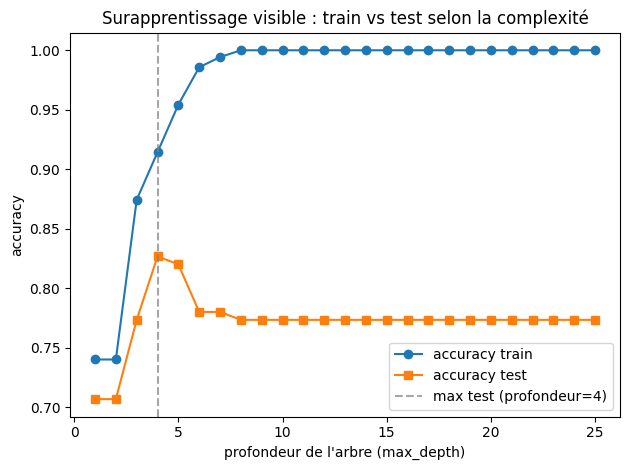
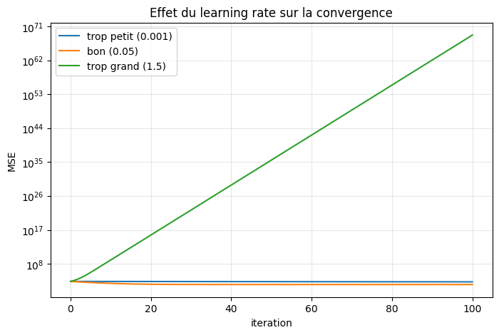
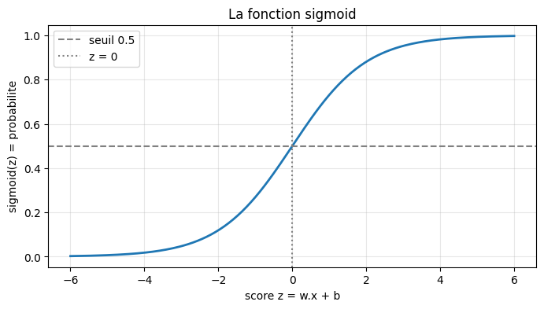
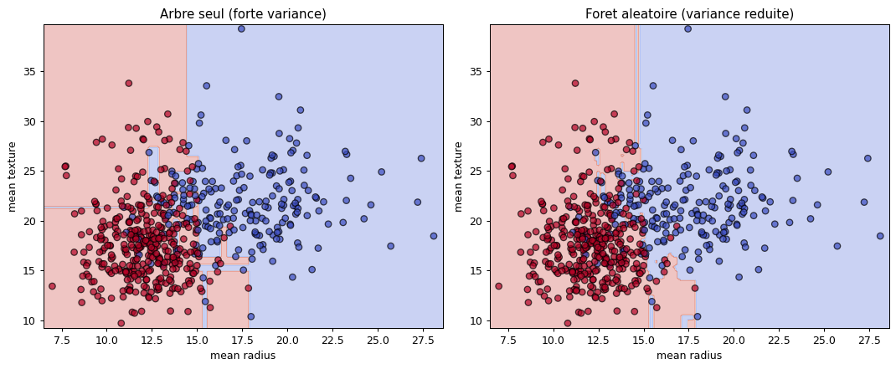
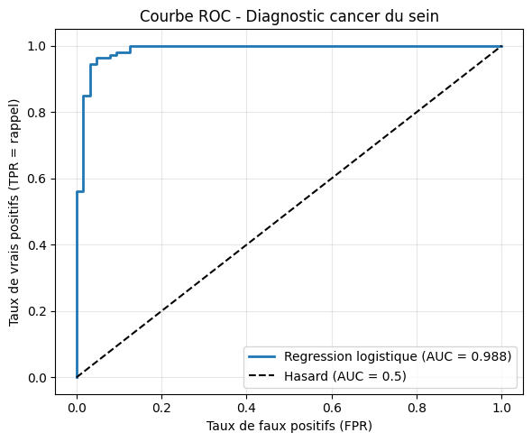
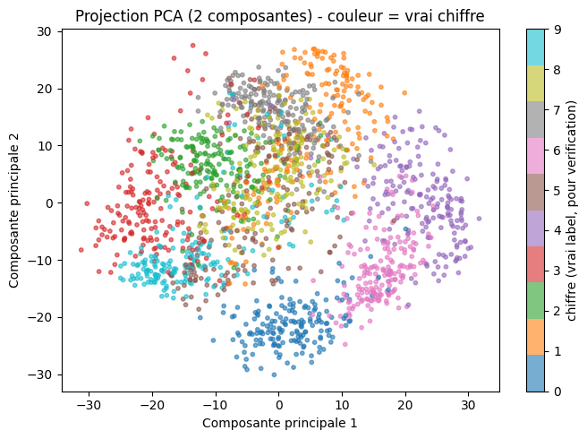
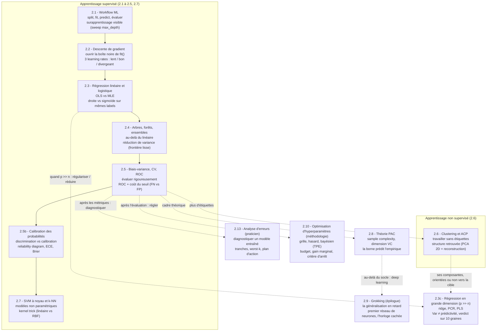

# 02-ML-Cours — Le socle Machine Learning canonique avec scikit-learn

[← DataScienceWithAgents (série parente)](../README.md) | [01-PythonForDataScience (prérequis) →](../01-PythonForDataScience/README.md)

**Kernel** : Python 3 · **Bibliothèque** : scikit-learn · **Niveau** : intermédiaire (post NumPy/Pandas)

## Pourquoi cette série

La formation `DataScienceWithAgents` saute aujourd'hui un maillon. Après les fondations NumPy/Pandas ([`01-PythonForDataScience`](../01-PythonForDataScience/)), les *labs agentic* (LangChain, Google ADK) demandent à des agents LLM de produire et d'exécuter du code de data science — y compris du machine learning. Mais entre les deux, **aucun notebook n'enseigne le workflow ML, un modèle ou une métrique comme un sujet en soi** : scikit-learn n'apparaît que comme une séquence magique non expliquée (un `fit()` isolé dans un lab de visualisation, ou cité en litteral dans une chaîne LLM).

Cette série comble ce socle manquant. Elle pose, **à la main et de façon canonique**, les huit chapitres fondamentaux du machine learning supervisé et non supervisé — le référent qui rend *jugeable* ce qu'un agent produira ensuite. L'arc pédagogique suit la progression classique : le **workflow** d'ensemble, puis on ouvre les boîtes noires (**descente de gradient**, **fonction de lien**), on élargit la famille de modèles (**régression linéaire/logistique**, **arbres et ensembles**, **SVM à noyau et k plus proches voisins**), on formalise l'évaluation (**biais-variance, validation croisée, ROC, calibration des probabilités**), puis l'on bascule en **non supervisé** (**clustering, ACP**), avant de clore par le **cadre théorique** (**théorie PAC, dimension VC**). Chaque notebook rend visible un concept-phare — le surapprentissage, la divergence d'un learning rate, la frontière de décision, la réduction de variance, le coût d'un seuil, le kernel trick, la structure retrouvée sans étiquettes, et le nombre d'exemples suffisant pour généraliser.

La thèse est volontairement classique : on ne peut évaluer ce qu'un agent génère comme pipeline scikit-learn que si l'on sait soi-même ce que `fit()` minimise, pourquoi un arbre surapprend, et ce que mesure une AUC. Cette série fournit ce référent, en gardant les outils à leur juste place (vraies API scikit-learn, exécutées, sorties réelles committées).

## Vue d'ensemble

| Notebook | Sujet | Concept-phare | Dataset |
|----------|-------|---------------|---------|
| [2.1-Workflow-ML](2.1-Workflow-ML.ipynb) | Le workflow ML (split → fit → predict → évaluer) | Surapprentissage rendu **visible** (sweep `max_depth` 1→25) | synthétique `make_*` |
| [2.2-Descente-de-gradient](2.2-Descente-de-gradient.ipynb) | Ouvrir la boîte noire de `fit()` | 3 learning rates (lent / bon / **divergeant**) | synthétique `make_regression` |
| [2.3-Regression-lineaire-logistique](2.3-Regression-lineaire-logistique.ipynb) | Régression linéaire (OLS) vs logistique (MLE) | **OLS vs MLE** : droite vs sigmoïde sur mêmes labels binaires | synthétique `make_*` |
| [2.3b-Naive-Bayes-Generatif](2.3b-Naive-Bayes-Generatif.ipynb) | Bayésien naïf génératif vs régression logistique discriminative | **Génératif vs discriminatif** : modéliser P(x\|y) puis Bayes, ou P(y\|x) directement — l'hypothèse d'indépendance coûte du biais | synthétique (corrélations homogènes et en bloc) |
| [2.3c-Regression-Grande-Dimension](2.3c-Regression-Grande-Dimension.ipynb) | p >> n : ridge, PCR (composantes principales), PLS (composantes supervisées) | **Var ≠ valeur prédictive** : la PLS trouve en 5 composantes ce que la PCR paie à 44 | synthétique (blocs corrélés, SEED=42) |
| [2.3d-Modele-Gaussien-LDA-QDA](2.3d-Modele-Gaussien-LDA-QDA.ipynb) | Modèle gaussien : analyse discriminante linéaire (LDA) vs quadratique (QDA) | **L'hypothèse de covariance décide la frontière** : partagée → droite (LDA), propre → conique (QDA) | synthétique `make_*` (régimes contrôlés) |
| [2.4-Arbres-Forets-Ensembles](2.4-Arbres-Forets-Ensembles.ipynb) | Arbres, forêt aléatoire, gradient boosting | **Réduction de variance** : frontière en escalier vs lisse | réel `load_breast_cancer` |
| [2.5-Biais-Variance-CV-ROC](2.5-Biais-Variance-CV-ROC.ipynb) | Compromis biais-variance, validation croisée, ROC/AUC | **ROC + coût du seuil** : faux négatifs vs faux positifs | réel `load_breast_cancer` |
| [2.5b-Calibration-Probabilites](2.5b-Calibration-Probabilites.ipynb) | Calibration des probabilités : reliability diagrams, ECE, Brier | **Pourquoi 0.87 n'est pas 87 % de chances** : discrimination vs calibration, la diagonale du reliability diagram | réel `load_breast_cancer` |
| [2.5c-Equite-Sous-Groupes](2.5c-Equite-Sous-Groupes.ipynb) | Équité par sous-groupe : parité démographique, equalized odds, l'incompatibilité des trois métriques sous prévalences différentes (Chouldechova) et le post-traitement par seuils par groupe (Hardt) | **L'accuracy globale ne suffit pas** : 96,4 % global coexiste avec deux groupes à [0,977–0,995] et [0,922–0,957] | synthétique contrôlé (2 groupes, prévalences réglables) |
| [2.6-Clustering-KMeans-PCA](2.6-Clustering-KMeans-PCA.ipynb) | Apprentissage non supervisé : KMeans + ACP | **Structure retrouvée sans étiquettes** (PCA 2D + reconstruction) | réel `load_digits` |
| [2.7-Modeles-Non-Parametriques](2.7-Modeles-Non-Parametriques.ipynb) | SVM à noyau et k plus proches voisins | **Le kernel trick rendu visible** (linéaire vs RBF sur demi-lunes) | synthétique `make_moons` + réel `load_breast_cancer` |
| [2.8-Theorie-PAC](2.8-Theorie-PAC.ipynb) | Théorie PAC : sample complexity et dimension VC | **La borne PAC prédit l'empirique** (m_min théorique vs courbe d'erreur) | synthétique `make_*` |
| [2.8b-Theorie-PAC-Lean](2.8b-Theorie-PAC-Lean.ipynb) | *Compagnon Lean* (kernel `lean4-wsl`) — la même borne, **démontrée** plutôt que mesurée | **Ce que 2.8 constate, le lake le prouve** : Hoeffding, borne de l'union, ERM, complexité d'échantillon | aucun (arithmétique exacte) |
| [2.8c-Borne-Temoin-Concentration](2.8c-Borne-Temoin-Concentration.ipynb) | *Carte transversale + compagnon numérique Python* — Novikoff, témoin extrémal et Hoeffding bilatérale sur des instances seedées | **Mesurer avant de certifier** : 2.8c rejoue les trois phénomènes en NumPy ; 2.8b et 2.8d portent les preuves Lean | synthétique seedé |
| [2.8d-Lean-Novikoff-Convergence](2.8d-Lean-Novikoff-Convergence.ipynb) | *Compagnon Lean* (kernel `lean4-wsl`) — la moitié Perceptron du lake, **exécutée** : Novikoff `n·γ² ≤ R²`, ses deux lemmes, son témoin de saturation | **Le théorème interrogé en direct** : `#check` + `#print axioms` depuis le lake, dynamique rejouée sur entiers, balayage de marge | aucun (arithmétique exacte) |
| [2.9-Grokking-Generalisation](2.9-Grokking-Generalisation.ipynb) | *Épilogue, amorce du [3.5](../03-DeepLearning/3.5-Phenomenes-de-Generalisation.ipynb)* — grokking : la généralisation qui arrive en retard (premier réseau de neurones, PyTorch boîte noire) | **L'horloge cachée** : embeddings rangés en cercle après le grok (ACP + Fourier) | synthétique `(a+b) mod 97` |
| [2.10-Optimisation-Hyperparametres](2.10-Optimisation-Hyperparametres.ipynb) | La méthodologie du réglage : grille, hasard, bayésien (TPE) — et quand s'arrêter | **Le budget qui s'aplatit** : le bayésien s'installe dès le premier tiers du budget ; le critère d'arrêt économise la moitié des essais | synthétique `make_classification` (MLP) |
| [2.11-Regularisation-Sparse-LASSO](2.11-Regularisation-Sparse-LASSO.ipynb) | *Régularisation sparse* — LASSO (L1, polyèdre) vs Ridge (L2, boule), coord descent, sélection de λ, cas pathologique colinéarité (ElasticNet) | **La géométrie décide** : polyèdre L1 → sparsity (sélection de variables), boule L2 → shrink continu ; sur features corrélées, LASSO est arbitraire et ElasticNet stabilise | synthétique `design_sparse(n, p, k, snr)` |
| [2.12-Donnees-Desequilibrees](2.12-Donnees-Desequilibrees.ipynb) | *Classes déséquilibrées* — la métrique qui ment (accuracy vs PR), stratégies de rééchantillonnage, seuillage par coût | **La courbe PR dit la vérité** : sur une classe à ~3 %, la ROC flatte, seule l'average precision rend l'arbitrage visible | synthétique `make_classification` (~3 % positifs) |
| [2.13-Analyse-Erreurs](2.13-Analyse-Erreurs.ipynb) | Le geste du praticien : diagnostiquer un modèle entraîné (tranches, worst-k, plan d'action) | **La poche invisible** : 67.6% d'erreur sur ~5% de la population, cachée dans un score global correct (82.2%) | synthétique télécom (churn, incident d'étiquetage) |

> **Épilogue — au-delà du socle scikit-learn.** Les huit chapitres ci-dessus posent le socle canonique. Le notebook [2.9](2.9-Grokking-Generalisation.ipynb) fait un pas de côté vers le **deep learning** : il entraîne le premier réseau de neurones de la série (PyTorch, quelques minutes sur CPU) pour montrer le **grokking** — la généralisation qui surgit longtemps *après* la mémorisation parfaite, un phénomène que la borne PAC (2.8) ne laissait pas prévoir — et réutilise l'ACP du 2.6 pour révéler la structure apprise. Il joue le rôle d'**amorce** : le traitement canonique — montage réécrit en NumPy pur (gradient à la main), contre-témoin isolant le weight-decay, double descente — est le [3.5 — Phénomènes de généralisation](../03-DeepLearning/3.5-Phenomenes-de-Generalisation.ipynb) de la série Deep Learning, dont les exercices portent les leviers classiques (weight-decay, seuil de données) ; ceux du 2.9 lui sont propres (horloge, modulus, dimension d'embedding).

> **Les compagnons formels et numériques.** Le notebook [2.8b](2.8b-Theorie-PAC-Lean.ipynb) tourne sous kernel **Lean 4** (`lean4-wsl`) et suit module par module la moitié statistique du lake [`learning_theory_lean/`](../../learning_theory_lean/README.md). Là où 2.8 *observe* que la borne PAC prédit la courbe d'erreur empirique, 2.8b en rend les étapes exécutables — `expect`/Markov, MGF de Bernoulli, Hoeffding, borne de l'union, ERM, complexité d'échantillon — avec les **noms de déclarations du lake**. Le compagnon [2.8d](2.8d-Lean-Novikoff-Convergence.ipynb) fait de même pour la **moitié Perceptron** : borne de Novikoff `n·γ² ≤ R²`, lemmes de croissance et témoin de saturation, interrogés en direct sous `lean4-wsl`, avec une dynamique rejouée sur entiers. Entre eux, [2.8c](2.8c-Borne-Temoin-Concentration.ipynb) reste la **carte transversale et le compagnon numérique Python** : il rejoue en NumPy la borne, le témoin et Hoeffding sous kernel `coursia-ml-training`. Ainsi, 2.8c mesure sur des instances explicites tandis que 2.8b et 2.8d certifient les énoncés généraux. C'est la même paire empirique/formel que la série ML annonce dans sa section [Théorie formelle (Lean)](../../README.md#théorie-formelle-lean) (EPIC #11703).

> **Au-delà du socle — classes déséquilibrées.** Le notebook [2.12](2.12-Donnees-Desequilibrees.ipynb) sort du cadre des huit chapitres pour traiter le cas où la classe d'intérêt est rare (fraude, défaut, anomalie, régime de marché). La ROC y apparaît comme une métrique qui **ment** — sur une classe à ~3 %, le taux de faux positifs reste bas *par construction* — et la **courbe Precision-Recall** comme la métrique honnête. Cinq stratégies y sont comparées sur le même protocole multi-seed (`class_weight`, sous-échantillonnage, sur-échantillonnage naïf, SMOTE, et « ne rien faire »), avec la matrice de confusion et la courbe PR pour chacune ; le tableau final montre qu'**aucune stratégie ne domine partout** — le choix dépend du coût d'un faux négatif face à un faux positif. Le seuil optimal n'y est pas `0.5` mais celui qui minimise le **coût attendu** (pont vers la théorie de la décision), et le piège de la **fuite SMOTE-avant-split** y est démontré puis corrigé.
> **Le geste du praticien.** Le notebook [2.13](2.13-Analyse-Erreurs.ipynb) ferme la boucle : mesurer (2.4, 2.5) ne suffit pas, il faut **diagnostiquer**. Sur un modèle au score global correct (accuracy 82.2%, aucune alerte), l'analyse par tranches révèle une **poche** à 67.6% d'erreur — 115 étiquettes d'entraînement corrompues par un incident d'intégration, invisibles de toute métrique globale. Le workflow : tranches → worst-k (les deux côtés de la matrice) → confiance → cause → correction **mesurée** (−42.3 points sur la poche) — ce qui distingue un praticien d'un tourneur d'hyperparamètres (le tuning, lui, ne répare rien : 67.6% → 67.6%).

> **La méthodologie du réglage.** Le notebook [2.10](2.10-Optimisation-Hyperparametres.ipynb) assume le rôle que le 2.13 laisse en creux — celui du « tourneur d'hyperparamètres » — et le fait **honnêtement** : un espace de recherche mixte (continu, discret, conditionnel) sur un MLP, un budget commun de 45 essais, et les trois stratégies superposées sur la courbe *meilleur score vs nombre d'essais* (médiane sur 3 graines, bande min–max). La grille exhaustive y explose en dimension (6300 configurations, 0.7 % couvertes), le hasard tient l'argument de couverture de Bergstra & Bengio, et le search bayésien (TPE/Optuna, **consommé**, pas réécrit) s'installe dès le premier tiers du budget. Le vrai concept-phare est le **critère d'arrêt** : un gain marginal explicite (arrêter si le meilleur n'a pas gagné δ sur les K derniers essais) qui économise 21 à 31 essais sur 45 pour un coût de 2 à 8 millièmes d'AUC. C'est la méthodologie transverse que réutilisent les sweeps du ML-Training-Pipeline et l'ablation du Lab14.

> **La régularisation sparse.** Le notebook [2.11](2.11-Regularisation-Sparse-LASSO.ipynb) comble le trou que la série laissait en suspens entre [2.3c](2.3c-Regression-Grande-Dimension.ipynb) (Ridge L2 en grande dimension) et [2.10](2.10-Optimisation-Hyperparametres.ipynb) (méthodologie du réglage, où LassoCV apparaissait en passant) : la **géométrie** de la contrainte — boule L2 pour Ridge (shrink continu) vs polyèdre L1 pour LASSO (sparsity, sélection de variables). Sur 50 features dont 5 vraiment actives (SNR ≈ 4), LASSO retrouve ~80-100 % du support actif en 5-7 coefficients non-nuls, Ridge distribue les poids sur les 50. La **coord descent** from-scratch (10-50 itérations, soft-thresholding `S(z,λ) = sign(z)·max(|z|-λ, 0)`) est validée à 1e-3 près contre `sklearn.linear_model.Lasso`. **LassoCV** sélectionne λ automatiquement (grille logspace + CV 5 folds, sub-seconde). Le **cas pathologique** : sur 3 paires de features corrélées à ρ = 0.7, LASSO devient **arbitraire** (alterne `b₀ = 0` ou `b₁ = 0` selon le tirage) ; **ElasticNet** (`l1_ratio = 0.7`) distribue le poids sur les deux features de chaque paire — la **règle pratique** : ElasticNet dès que des features corrélées sont attendues. Le **chemin de régularisation** `β(λ)` trace l'arrivée progressive des features : λ grand → 0 non-nuls, λ intermédiaire → les 5 vraies features, λ petit → bruit. Le tout avec 3 exercices (C.1 stubs) sur le λ qui tue la sélection, le SNR faible où Ridge bat LASSO en MSE, et la stabilité d'ElasticNet sur paires corrélées.

> **La grande dimension.** Le notebook [2.3c](2.3c-Regression-Grande-Dimension.ipynb) ouvre le régime que le 2.3 ne faisait qu’annoncer (VIF 52) : p = 205 variables pour n = 120 observations. Une direction de X ne vaut pour la prédiction que par Cov(Y, Xu) — pas par Var(Xu) : l’ACP (donc la PCR) trie par Var et paie 38 composantes de leurre avant d’atteindre le signal ; la PLS trie par Cov et le capture en 5 composantes (RMSE test 0.244 contre 0.942 à budget égal), loadings à l’appui. Ridge (λ par CV) rend le problème déterminé et referme la promesse du 2.3. Le verdict est vérifié sur dix graines (section 9bis, hyperparamètres re-choisis à chaque tirage) : PLS et PCR devant quand le signal vit hors des grandes variances, ridge devant dans le régime aligné, OLS min-norme dépassée 8 fois sur 10 puis 6 fois sur 10.

> **La frontière, signature de l'hypothèse.** Le notebook [2.3d](2.3d-Modele-Gaussien-LDA-QDA.ipynb) tisse le pont génératif que la série laissait en creux entre [2.3](2.3-Regression-lineaire-logistique.ipynb) (OLS vs logistique) et [2.3b](2.3b-Naive-Bayes-Generatif.ipynb) (hypothèse d'indépendance) : il dérive la frontière depuis la log-densité gaussienne et montre que c'est **l'hypothèse de covariance** — partagée vs propre — qui décide linéaire ou quadratique. Mesure phare : sur des régimes contrôlés, QDA devance LDA de **+5.7 pts** dès que les covariances diffèrent ; en grande dimension, QDA s'effondre (`nan`) dès que `d` rivalise avec `n_c` (2 classes, `n_c=30` : `nan` à `d=30`), là où LDA 0.975 et Naive Bayes 0.994 survivent. Le concept-phare n'est pas une course d'accuracy mais la **signature d'une hypothèse** — et le prix de la flexibilité (`O(d²)` pour QDA) devient une singularité. Cross-référé à [2.3b](2.3b-Naive-Bayes-Generatif.ipynb) et [2.6](2.6-Clustering-KMeans-PCA.ipynb).

## Aperçu — les concepts-phare en images

La série ne se contente pas d'ajuster des modèles : chaque chapitre **rend visible** un concept distinct, dans une figure extraite des sorties réelles des notebooks. Les voici replacées dans leur progression pédagogique — chacune illustre la capacité distinctive d'une technique et l'exerce sur un cas non trivial.

**[2.1 — Le surapprentissage, rendu observable.](2.1-Workflow-ML.ipynb)** On balaie la profondeur d'un arbre de décision de 1 à 25 et l'on trace, côte à côte, le score d'entraînement et le score de test. Tant que la profondeur reste modeste, les deux courbes suivent la même trajectoire ; passé un seuil, elles se séparent, et l'écart ne cesse de grandir à mesure que le modèle mémorise le bruit de l'entraînement. Ce geste diagnostique — voir le surapprentissage plutôt que le subir — est le fil rouge du workflow ML.

**[2.2 — Trois régimes de learning rate.](2.2-Descente-de-gradient.ipynb)** On ouvre la boîte noire de `fit()` en lançant la descente de gradient sur la même fonction de coût avec trois pas d'apprentissage. L'un converge trop lentement, le second trouve le minimum sans errer, le troisième oscille puis s'envole : la frontière entre une bonne convergence et la divergence tient à un seul scalaire, le *learning rate*.

**[2.3 — Une sigmoïde plutôt qu'une droite.](2.3-Regression-lineaire-logistique.ipynb)** À partir des mêmes étiquettes binaires, on ajuste d'abord une droite (moindres carrés, OLS), puis une sigmoïde (maximum de vraisemblance, MLE). La droite sort du cadre dès qu'elle doit prédire une probabilité ; la sigmoïde écrase le score linéaire dans [0, 1] et donne à chaque point sa probabilité d'appartenir à la classe — c'est tout l'écart entre régression linéaire et logistique.

**[2.4 — La frontière, de l'escalier au lissage.](2.4-Arbres-Forets-Ensembles.ipynb)** Sur le jeu de cancer du sein, on trace la frontière de décision d'un arbre unique, puis celle d'une forêt aléatoire. L'arbre seul découpe l'espace en escaliers rigides, sensible au bruit ; l'ensemble moyenne ces coupes et lisse la frontière. C'est la réduction de variance rendue géométrique — la raison pour laquelle les forêts battent l'arbre isolé.

**[2.5 — Le coût d'un seuil.](2.5-Biais-Variance-CV-ROC.ipynb)** La courbe ROC balaye tous les seuils de décision possibles et échange les faux positifs contre les faux négatifs ; l'aire sous la courbe (AUC) résume ce compromis en un nombre. Mais le bon seuil n'est pas celui qui maximise l'AUC : il dépend du coût métier d'un faux négatif (rater un cancer) face à un faux positif. La figure impose cette lecture économique de la décision.

**[2.6 — La structure retrouvée sans étiquettes.](2.6-Clustering-KMeans-PCA.ipynb)** Sur les chiffres manuscrits, sans jamais fournir les étiquettes, l'analyse en composantes principales projette les images en deux dimensions — et les amas qui émergent suivent déjà les classes de chiffres. C'est la promesse de l'apprentissage non supervisé : retrouver la structure latente que les étiquettes confirmeraient a posteriori.

Chaque figure renvoie au notebook dont elle est extraite ; la provenance détaillée (cellule, output, poids, alt-text) figure dans [`assets/readme/MANIFEST.md`](assets/readme/MANIFEST.md).

## L'arc pédagogique

Le fil rouge de la série : on pose le **workflow**, on ouvre les **boîtes noires** (descente de gradient, fonction de lien), on élargit la **famille de modèles** (linéaire/logistique, arbres, ensembles, SVM à noyau et k-NN), on formalise l'**évaluation** (biais-variance, validation croisée, ROC, calibration des probabilités), puis l'on bascule en **non supervisé** (clustering, ACP), avant de clore par le **cadre théorique** (théorie PAC, dimension VC). Chaque notebook rend visible un concept-phare distinct.

```mermaid
flowchart TD
    subgraph SUP["Apprentissage supervisé (2.1 à 2.5, 2.7)"]
      direction TB
      A["2.1 - Workflow ML<br/>split, fit, predict, évaluer<br/>surapprentissage visible (sweep max_depth)"]
      B["2.2 - Descente de gradient<br/>ouvrir la boîte noire de fit()<br/>3 learning rates : lent / bon / divergeant"]
      C["2.3 - Régression linéaire et logistique<br/>OLS vs MLE<br/>droite vs sigmoïde sur mêmes labels"]
      D["2.4 - Arbres, forêts, ensembles<br/>au-delà du linéaire<br/>réduction de variance (frontière lisse)"]
      E["2.5 - Biais-variance, CV, ROC<br/>évaluer rigoureusement<br/>ROC + coût du seuil (FN vs FP)"]
      E2["2.5b - Calibration des probabilités<br/>discrimination vs calibration<br/>reliability diagram, ECE, Brier"]
      G["2.7 - SVM à noyau et k-NN<br/>modèles non paramétriques<br/>kernel trick (linéaire vs RBF)"]
      A --> B --> C --> D --> E --> E2 --> G
    end
    subgraph UNSUP["Apprentissage non supervisé (2.6)"]
      F["2.6 - Clustering et ACP<br/>travailler sans étiquettes<br/>structure retrouvée (PCA 2D + reconstruction)"]
    end
    H["2.8 - Théorie PAC<br/>sample complexity, dimension VC<br/>la borne prédit l'empirique"]
    I["2.9 - Grokking (épilogue)<br/>la généralisation en retard<br/>premier réseau de neurones, l'horloge cachée"]
    E -. "plus d'étiquettes" .-> F
    E -. "cadre théorique" .-> H
    H -. "au-delà du socle : deep learning" .-> I
    J["2.13 - Analyse d'erreurs (praticien)<br/>diagnostiquer un modèle entraîné<br/>tranches, worst-k, plan d'action"]
    E -. "après les métriques : diagnostiquer" .-> J
    K["2.10 - Optimisation d'hyperparamètres (méthodologie)<br/>grille, hasard, bayésien (TPE)<br/>budget, gain marginal, critère d'arrêt"]
    E -. "après l'évaluation : régler" .-> K
    L["2.3c - Régression en grande dimension (p >> n)<br/>ridge, PCR, PLS<br/>Var ≠ prédictivité, verdict sur 10 graines"]
    C -. "quand p >> n : régulariser / réduire" .-> L
    F -. "ses composantes, orientées ou non vers la cible" .-> L
```

## Pédagogie

Chaque notebook suit les mêmes conventions :

- **Concept-phare rendu visible.** Plutôt qu'un seul ajustement dégénéré, chaque notebook pose une démonstration non-triviale qui **exerce la capacité distinctive** de la technique (le compromis biais-variance, le choix du learning rate, l'effet du seuil de décision) et la rend lisible dans une figure réelle.
- **Exemples résolus et exercices cohabitent.** Les cellules d'exemple (solutions complètes) ne sont jamais stubbées ; les cellules d'exercice sont laissées à compléter (`# TODO etudiant`), avec indices et `# Etape N`. Le notebook s'exécute de bout en bout même exercices non complétés (jamais d'erreur volontaire).
- **≥ 3 exercices par notebook**, répartis dans le flux, chacun précédé d'un énoncé avec objectif et indices.
- **Citations ancrées.** Chaque concept fondateur renvoie à son article canonique (blocknote inline `> **Référence.**` + cellule `## References` finale avec glose en français).
- **Sorties réelles committées.** Les notebooks sont exécutés via papermill (kernel `python3`, environnement `coursia-ml-training`), outputs et `execution_count` inclus — la preuve d'exécution fait partie du livrable.

## Objectifs d'apprentissage (série)

À l'issue de la série, l'étudiant sait :

1. **Mettre en place un workflow ML** complet (séparation train/test, ajustement, prédiction, métrique) et **diagnostiquer le surapprentissage**.
2. **Ouvrir la boîte noire** de l'optimisation : ce que minimise la descente de gradient, et pourquoi le learning rate contrôle la convergence.
3. **Choisir un modèle** linéaire ou logistique selon la nature de la cible (continue vs binaire), et **interpréter les coefficients** (OLS, MLE, odds ratios).
4. **Aller au-delà du linéaire** avec les arbres et les ensembles, et **comprendre la réduction de variance** qu'apportent les forêts.
5. **Évaluer rigoureusement** : compromis biais-variance, validation croisée k-fold, courbe ROC / AUC, choix de seuil selon le coût des erreurs, et **calibrer les probabilités** (reliability diagram, ECE, Brier — pourquoi 0.87 n'est pas 87 % de chances, 2.5b).
6. **Travailler sans étiquettes** : regrouper (KMeans, méthode du coude) et réduire la dimension (ACP, variance expliquée).
7. **Aller au-delà des modèles paramétriques** : SVM (maximisation de la marge, kernel trick, vecteurs supports) et k plus proches voisins, et comprendre pourquoi la standardisation devient indispensable.
8. **Formaliser le cadre théorique** : théorie PAC (Valiant 1984), complexité d'échantillon `m ≥ (1/ε)(ln|H| + ln(1/δ))`, dimension VC (Vapnik-Chervonenkis 1971), borne de Novikoff `n ≤ (R/γ)²` sur le perceptron (2.8d) — combien d'exemples suffisent pour généraliser et combien d'erreurs coûte l'apprentissage, et le pont entre borne théorique et erreur empirique.
9. **Diagnostiquer un modèle entraîné** : analyse par tranches (heatmap tranches × métrique, effectifs lus), inspection worst-k des deux côtés de la matrice, erreurs affirmées vs hésitantes (pont vers la calibration, 2.5b), et plan d'action cause → remède dont le gain est **mesuré par tranche** (2.13).
10. **Régler les hyperparamètres honnêtement** : poser un espace de recherche mixte (continu, discret, conditionnel), mesurer pourquoi la grille exhaustive explose en dimension, lire l'argument de couverture du hasard, consommer un search bayésien (TPE/Optuna), et s'arrêter sur un critère de gain marginal explicite — budget, multi-seed, médiane (2.10).
11. **Régulariser et réduire en grande dimension** : comprendre pourquoi OLS devient indéterminée quand $p \gg n$ (rang $< p$, deux solutions exactes), ce que la pénalité ridge ($\lambda$ par CV) change, la différence entre composantes **ignorantes de la cible** (PCR) et **supervisées** (PLS), et re-vérifier tout verdict sur plusieurs graines — la min-norme perd 8/10 et 6/10 selon le régime (2.3c).

## Prérequis

- **NumPy et Pandas** : manipulation de tableaux et DataFrames ([`01-PythonForDataScience`](../01-PythonForDataScience/README.md)).
- Notions de base : fonction, dérivée, variance, probabilité.

## Suite logique

Cette série est le **référent manuel** des labs agentic qui suivent. Une fois le socle ML posé, le track [Track1-LangChain](../Track1-LangChain/README.md) (LangChain) et [Track2-GoogleADK](../Track2-GoogleADK/README.md) (Google ADK) demandent à des agents LLM de produire ce même type de pipeline — la valeur de ce qu'ils génèrent ne se juge qu'au regard de ce socle.

## Références transverses

Les citations canoniques ancrées dans la série (cellule `## References` de chaque notebook) incluent : Mitchell 1997 (généralisation), Cauchy 1847 (descente de gradient), Nelder & Wedderburn 1972 (modèles linéaires généralisés), Cox 1958 (régression logistique), Breiman et al. 1984 (CART), Breiman 2001 (forêts aléatoires), Friedman 2001 (gradient boosting), Stone 1974 (validation croisée), Bradley 1997 (AUC), Brier 1950 (score de Brier), Niculescu-Mizil & Caruana 2005 (calibration par famille de modèles), Platt 1999 (Platt scaling), Zadrozny & Elkan 2002 (régression isotonique), Guo et al. 2017 (ECE, temperature scaling), MacQueen 1967 (k-means), Pearson 1901 (ACP), Cortes & Vapnik 1995 (réseaux de vecteurs supports), Cover & Hart 1967 (k plus proches voisins), Valiant 1984 (théorie PAC), Vapnik & Chervonenkis 1971 (dimension VC), Novikoff 1962 (convergence du perceptron), Bergstra et al. 2011 (TPE), Bergstra & Bengio 2012 (random search), Akiba et al. 2019 (Optuna), Hoerl & Kennard 1970 (ridge), Wold 1975 (NIPALS/PLS), de Jong 1993 (SIMPLS), Frank & Friedman 1993 (continuum ridge/PCR/PLS), Jolliffe 2002 (ACP), Hastie/Tibshirani/Friedman 2009 (*The Elements of Statistical Learning*) et Pedregosa et al. 2011 (scikit-learn).

## Conclusion — ce que vous emportez

Au terme des huit chapitres, le machine learning supervisé et non supervisé n'est plus une suite d'appels `fit()` opaques mais un **paysage cartographié**. Vous savez désormais *ce que* minimise un modèle (moindres carrés ou vraisemblance), *comment* il le minimise (la descente de gradient et la sensibilité au learning rate), *pourquoi* il sur- ou sous-apprend (le compromis biais-variance), et *combien* d'exemples il faut pour généraliser (la borne PAC, la dimension VC) et *combien d'erreurs* peut coûter l'apprentissage (la borne de Novikoff, prouvée et saturée en 2.8d). Vous savez aussi élargir la famille au-delà du linéaire (arbres, ensembles, SVM à noyau, k plus proches voisins), travailler sans étiquettes (clustering, ACP), et juger une décision au regard du **coût réel de ses erreurs** (courbe ROC, choix de seuil) et de la **fiabilité de ses probabilités** (calibration, ECE).

### Le fil rouge

La série s'ouvrait sur une thèse : *on ne peut juger ce qu'un agent LLM produit comme pipeline scikit-learn que si l'on sait soi-même ce que ce pipeline fait*. Ce socle vient de fournir ce référent. Là où un lab agentic vous montrera un agent appeler `RandomForestClassifier().fit(X, y)` puis afficher une AUC flatteuse, vous lisez désormais cet enchaînement d'un œil critique : la séparation train/test est-elle honnête (pas de fuite de données) ? La métrique est-elle adaptée au déséquilibre des classes ? Le seuil de décision correspond-il au coût métier des faux négatifs ? L'évaluation repose-t-elle sur une validation croisée ou sur un seul découpage chanceux ? Le socle rend l'agent **jugeable** — et c'est exactement la compétence que les tracks agentic suivants présupposent acquise.

### Pour prolonger

- **Approfondir la théorie** : Hastie, Tibshirani & Friedman, *The Elements of Statistical Learning* (2009) reprend et formalise l'ensemble de ces chapitres ; le [guide utilisateur scikit-learn](https://scikit-learn.org/stable/user_guide.html) (Pedregosa et al. 2011) en est le prolongement pratique direct.
- **Exercer le jugement** : reprenez un notebook des tracks [Track1-LangChain](../Track1-LangChain/README.md) ou [Track2-GoogleADK](../Track2-GoogleADK/README.md) et confrontez le pipeline produit par l'agent aux quatre questions ci-dessus — c'est le meilleur exercice de consolidation, car il met le socle au travail.
- **Vers le deep learning et le RL** : la descente de gradient (2.2) et la notion de capacité d'un modèle (2.8) sont les deux fondations directement réinvesties par les réseaux de neurones ; l'épilogue [2.9](2.9-Grokking-Generalisation.ipynb) fait ce premier pas (un réseau de neurones qui *grokke*, entraîné en quelques minutes sur CPU), et la série [RL](../../../RL/README.md) montre cette même descente de gradient à l'œuvre dans l'apprentissage par renforcement profond (DQN, PPO).

---

## Licence

Voir la licence du repository principal.