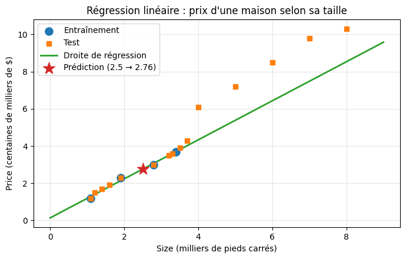
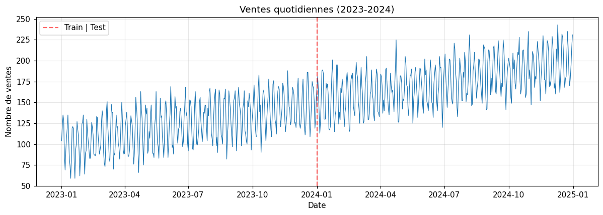
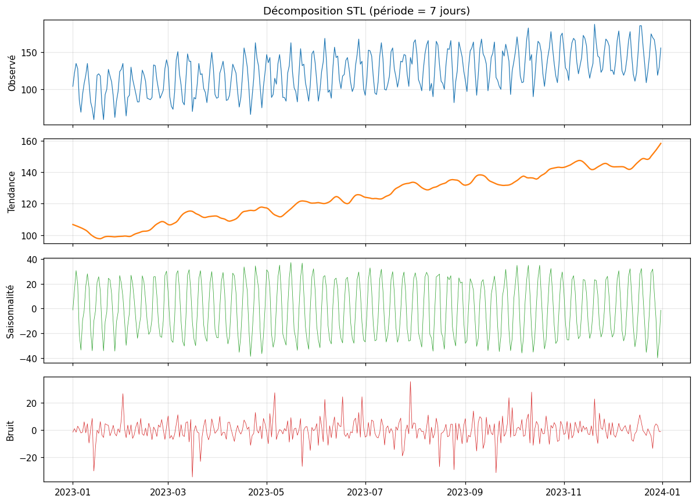
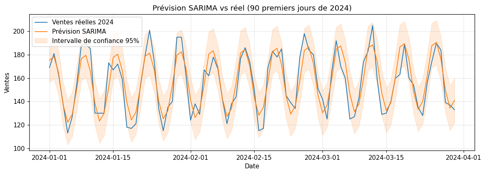
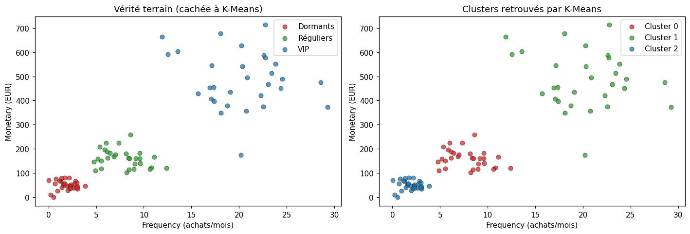
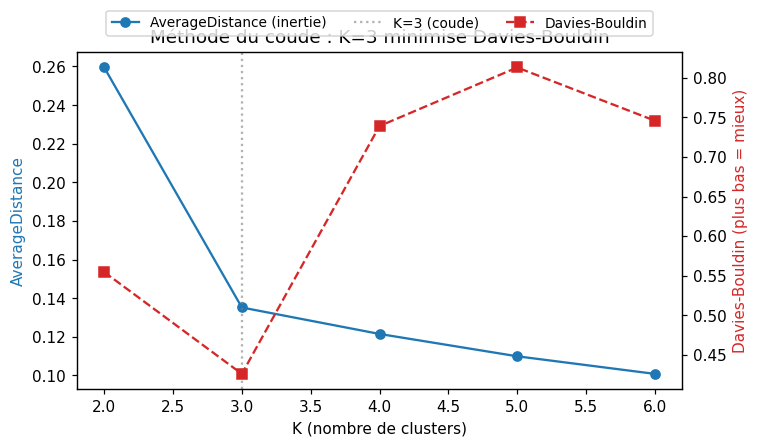

# ML.NET - Machine Learning pour .NET

<!-- CATALOG-STATUS
series: ML-ML.Net
pedagogical_count: 19
breakdown: ML.Net=19
maturity: PRODUCTION=18, ALPHA=1
-->

[← ML (série parente)](../README.md) | [DataScienceWithAgents (Python) →](../DataScienceWithAgents/README.md) | [Probas/Infer.NET →](../../Probas/Infer/README.md)

ML.NET — la bibliothèque open-source de Microsoft — apporte le machine learning **nativement dans l'écosystème .NET** : on entraîne et on consomme des modèles directement en C#, sans quitter sa stack applicative ni dépendre d'un runtime Python. C'est un choix pensé pour les développeurs autant que pour les data scientists — l'AutoML abaisse la barrière d'entrée, et les modèles s'exécutent *in-process* dans des applications existantes (API web, services, desktop). L'interopérabilité **ONNX** permet d'importer des modèles entraînés ailleurs (scikit-learn, PyTorch, Hugging Face) et de les servir côté .NET : ML.NET devient ainsi un pont concret entre la recherche en Python et la production en entreprise.

> **Jumeaux de parité (C# ⇄ Python/scikit-learn).** Plusieurs notebooks de cette série disposent d'un **jumeau Python** co-localisé (`*-Python.ipynb`) qui couvre le **même concept pédagogique** avec les outils canoniques de l'écosystème Python (scikit-learn, statsmodels) — un contrepoint direct au pipeline ML.NET. Dès l'introduction ([ML-1-Python](ML-1-Introduction-Python.ipynb)), le même workflow (régression, classification) se code en quelques lignes de scikit-learn. Là où ML.NET `RandomizedPca` détecte les anomalies, le jumeau utilise `sklearn.PCA` + erreur de reconstruction ; là où `ForecastBySsa` prévoit les séries temporelles, le jumeau emploie `statsmodels` STL + SARIMA ; là où `MatrixFactorization` recommande, le jumeau applique `NMF`. Cette parité permet de voir qu'un **même problème** se modélise idiomatiquement dans deux écosystèmes, et que les concepts (résidu de reconstruction, facteurs latents, décomposition tendance/saisonnalité) sont universels — seuls les outils diffèrent. Les jumeaux sont signalés dans les tables des notebooks ci-dessous.

Le parcours va du premier pipeline (ML-1) jusqu'à une application complète : préparation des données et feature engineering (ML-2), entraînement et AutoML (ML-3), évaluation rigoureuse par cross-validation et importance des variables (ML-4), puis les fonctionnalités avancées — prévision de séries temporelles par SSA (ML-5), interopérabilité ONNX (ML-6), systèmes de recommandation (ML-7), clustering non-supervisé par K-Means (ML-8) et détection d'anomalies par Randomized PCA (ML-9) — avant un TP capstone qui marie ML.NET et la régression bayésienne d'Infer.NET.

> **À qui s'adresse cette série** : développeurs C#/.NET découvrant le Machine Learning, équipes enterprise souhaitant intégrer du ML sans sortir de leur stack .NET, ou data scientists souhaitant servir des modèles en production dans des applications C#. Aucun prérequis en statistiques avancées — les concepts sont introduits progressivement dans chaque notebook.

## Objectifs d'apprentissage

À l'issue de cette série, vous serez capable de :

1. **Construire** un pipeline ML complet en C# (chargement, features, entraînement, prédiction)
2. **Évaluer** rigoureusement un modèle (cross-validation, métriques, Permutation Feature Importance)
3. **Appliquer** le feature engineering adapté au problème (encodage, normalisation, sélection)
4. **Déployer** un modèle en production via ONNX (import/export, interop Python/.NET)
5. **Intégrer** ML.NET avec Infer.NET pour la régression bayésienne

## Notebooks

### Fondamentaux (ML-1 à ML-4)

| # | Notebook | Contenu | Durée |
|---|----------|---------|-------|
| 1 | [ML-1-Introduction](ML-1-Introduction.ipynb) | Hello ML.NET World, pipeline de base · *jumeau [Python](ML-1-Introduction-Python.ipynb)* | 30-40 min |
| 2 | [ML-2-Data&Features](ML-2-Data&Features.ipynb) | IDataView, TextLoader, encodage · *jumeau [Python](ML-2-Data&Features-Python.ipynb)* | 40-50 min |
| 3 | [ML-3-Entrainement&AutoML](ML-3-Entrainement&AutoML.ipynb) | SDCA, LightGBM, AutoML · *jumeau [Python](ML-3-Entrainement-Python.ipynb)* | 45-60 min |
| 4 | [ML-4-Evaluation](ML-4-Evaluation.ipynb) | Cross-validation, métriques, PFI · *jumeau [Python](ML-4-Evaluation-Python.ipynb)* | 40-50 min |

### Fonctionnalités avancées (ML-5 à ML-9)

| # | Notebook | Contenu | Jumeau Python (scikit-learn / statsmodels) | Durée |
|---|----------|---------|------------------------------------------|-------|
| 5 | [ML-5-TimeSeries](ML-5-TimeSeries.ipynb) | **Time Series Forecasting** avec ForecastBySsa (SSA) | [ML-5-Python](ML-5-TimeSeries-Python.ipynb) — STL + SARIMA | 45-60 min |
| 6 | [ML-6-ONNX](ML-6-ONNX.ipynb) | **ONNX Integration** : modèles Python/PyTorch dans .NET | [ML-6-Python](ML-6-ONNX-Python.ipynb) — skl2onnx + onnxruntime (export côté Python du pont inter-langage) | 45-60 min |
| 7 | [ML-7-Recommendation](ML-7-Recommendation.ipynb) | **Recommandation** : Matrix Factorization, collaborative filtering | [ML-7-Python](ML-7-Recommendation-Python.ipynb) — NMF | 45-60 min |
| 8 | [ML-8-Clustering](ML-8-Clustering.ipynb) | **Clustering non-supervisé** : K-Means, segmentation RFM, méthode du coude | [ML-8-Python](ML-8-Clustering-Python.ipynb) — KMeans scikit-learn + méthode du coude | 45-60 min |
| 9 | [ML-9-Anomaly-Detection](ML-9-Anomaly-Detection.ipynb) | **Détection d'anomalies** : Randomized PCA, AUC, seuil de décision | [ML-9-Python](ML-9-Anomaly-Detection-Python.ipynb) — PCA + erreur de reconstruction | 45-60 min |

### TP Pratique

| # | Notebook | Contenu | Durée |
|---|----------|---------|-------|
| TP | [TP-prevision-ventes](TP-prevision-ventes.ipynb) | Régression avec ML.NET + Infer.NET bayésien | 45-60 min |

## Parcours d'apprentissage

### Phase 1 : Fondamentaux (ML-1 à ML-4, ~2h30)

Le parcours débute par le notebook 1 qui présente l'écosystème ML.NET et construit votre premier pipeline en C# — un modèle de régression pour prédire le temps de trajet de taxis, suivi d'un classificateur pour détecter des transactions suspectes. Vous comprenez ainsi la structure de base : `MLContext` comme point d'entrée, le chargement de données, la définition du pipeline, et la prédiction.

Le notebook 2 plonge dans la préparation des données — l'étape la plus chronophage en pratique. Vous apprendrez à manipuler `IDataView`, la structure colonnaire performante de ML.NET, à charger des fichiers CSV, à encoder des variables catégorielles, à gérer les valeurs manquantes, et à concaténer des features. Ce notebook utilise le dataset taxi-fare pour un exercice concret de prédiction de prix immobiliers.


*Figure extraite du jumeau Python ML-1-Introduction-Python (cellule 17, output 0). La relation linéaire entre la taille (en milliers de pieds carrés) et le prix (en centaines de milliers de dollars) est apprise sur un split entraînement/test explicite ; l'étoile rouge matérialise une prédiction ponctuelle (2.5 kpi → 2.76). Le pipeline ML.NET `IDataView` → `EstimatorChain` produit la même droite côté C# — limitation illustrative assumée : la figure documente le concept de régression linéaire et la mécanique split/prédiction, pas le code ML.NET lui-même (voir cellules 9-22 de `ML-1-Introduction.ipynb`).*

Le notebook 3 introduit l'entraînement proprement dit. Vous découvrirez SDCA (Stochastic Dual Coordinate Ascent) pour la régression linéaire, LightGBM pour les problèmes non linéaires, et surtout l'AutoML de ML.NET qui automatise la recherche d'hyperparamètres et la sélection d'algorithme. Vous verrez aussi les dangers du surapprentissage et comment l'arrêter précocement.

Le notebook 4 est le plus dense (82 cellules) et le plus crucial : évaluation rigoureuse. Vous apprendrez à mesurer un modèle avec R², MAE, RMSE, à utiliser la validation croisée pour estimer la généralisation, et à expliquer les prédictions avec la Permutation Feature Importance (PFI) et le Feature Contribution Calculation (FCC). Ce notebook transforme un "modèle qui marche" en un modèle que vous comprenez et pouvez justifier.

### Phase 2 : Fonctionnalités avancées (ML-5 à ML-9, ~2h30)

Le notebook 5 aborde les séries temporelles avec `ForecastBySsa` (Singular Spectrum Analysis), un algorithme qui détecte automatiquement les tendances et saisonnalités. Vous travaillerez sur un dataset de ventes quotidiennes, apprendrez à détecter des anomalies par écart à la moyenne mobile, à quantifier l'incertitude via les intervalles de confiance, et à comparer plusieurs configurations de prévision. Ce notebook est directement applicable à la prévision de ventes, de charge serveur, ou de demande produit.


*Figure extraite du jumeau Python ML-5-TimeSeries-Python (cellule 7, output 0). La série journalière court sur 2023-01 → 2025-01 (deux ans), valeurs de 50 à 250 ventes/jour, avec un split explicite Train|Test au 2024-01-01 (matérialisé en rouge pointillé). On y lit la tendance haussière de fond et la saisonnalité hebdomadaire superposée — les deux ingredients que `ForecastBySsa` et la décomposition STL cherchent à séparer.*


*Figure extraite du jumeau Python ML-5-TimeSeries-Python (cellule 11, output 0). La décomposition STL sépare la série Observée en trois composantes additives : Tendance (croissance lente 105 → 155 sur 2023), Saisonnalité (cycle hebdomadaire d'amplitude ±35), Bruit/Résidu (écart ±20, stationnaire). La période 7 jours est explicite dans le titre de la figure. La décomposition permet d'attaquer le forecast composante par composante plutôt que sur le signal brut — limitation illustrative assumée : la figure montre la décomposition Python (statsmodels), pas la sortie `ForecastBySsa` côté ML.NET (le résultat conceptuel est équivalent mais l'API diffère ; voir cellules 9-18 de `ML-5-TimeSeries.ipynb`).*


*Figure extraite du jumeau Python ML-5-TimeSeries-Python (cellule 20, output 0). Sur la fenêtre de test (2024-01-01 → 2024-04-01, soit 90 jours), la prévision SARIMA (orange) suit la réalité (bleu) avec un intervalle de confiance 95% (zone orange pâle) qui capture l'essentiel de la variabilité — l'écart-type grandit aux extrema, signature d'un modèle qui reconnaît l'incertitude. La figure compare explicitement `statsmodels SARIMA` côté Python, pas `ForecastBySsa` côté ML.NET ; les deux approches traitent la saisonnalité 7 jours mais la décomposition du signal diffère. Limitation illustrative assumée : un forecast réussi sur 90 jours n'est pas un forecast réussi sur 90 jours avec un seul hyperparamètre — la robustesse multi-seed + walk-forward est traitée dans les cellules 22-28 du notebook ML-5-TimeSeries-Python.*

Le notebook 6 présente l'interopérabilité ONNX — le pont entre l'écosystème Python et .NET. Vous apprendrez à charger des modèles exportés depuis scikit-learn ou PyTorch, à exporter un modèle ML.NET vers ONNX, et même à utiliser des modèles Hugging Face (BERT, Whisper) via ONNX Runtime. Le notebook montre un workflow complet : R&D en Python, export ONNX, déploiement en production dans une application .NET. C'est le chapitre "déploiement en entreprise" du parcours.

Le notebook 7 explore les systèmes de recommandation — un domaine où ML.NET brille vraiment en production. Vous implémenterez la factorisation matricielle (collaborative filtering), apprendrez à générer des recommendations Top-N, à mesurer la qualité avec Precision@K et NDCG, et à gérer le "cold start problem" (nouveaux utilisateurs ou items sans historique). Deux exemples concrets : recommandation de films et recommandation e-commerce.

Les notebooks 8 et 9 couvrent l'apprentissage **non-supervisé**. Le notebook 8 (K-Means) partitionne les clients en segments naturels sans étiquettes, via la distance euclidienne — il illustre pourquoi la normalisation y est indispensable. Le notebook 9 (Randomized PCA) répond à une question différente : étant donné un régime de fonctionnement normal, quels points s'en écartent assez pour être des anomalies ? Le cas d'usage est la **maintenance prédictive** (capteurs industriels), et l'accent est mis sur le choix du **seuil de décision** (compromis détection / fausse alarme) — une problématique opérationnelle qui n'apparaît ni en classification (ML-3) ni en clustering (ML-8).


*Figure extraite du jumeau Python ML-8-Clustering-Python (cellule 12, output 0). Deux panneaux côte-à-côte : à gauche la vérité terrain (générée par mixture gaussienne puis cachée à l'algorithme), à droite les clusters retrouvés par K-Means (K=3). Les axes sont Frequency (achats/mois, 0-30) × Monetary (EUR, 0-700). Les trois segments Dormants (rouge, <5 achats/mois, <100 EUR), Réguliers (vert, 5-15 achats, 100-300 EUR), VIP (bleu, 15+ achats, 300+ EUR) sont correctement identifiés — limitation illustrative assumée : la figure documente la capacité distinctive de K-Means à retrouver une partition linéairement séparable dans l'espace RFM normalisé, pas les cas réels où les segments se chevauchent ou ne sont pas gaussiens (voir cellules 13-18 du notebook pour les limites et les métriques Davies-Bouldin / silhouette).*


*Figure extraite du jumeau Python ML-8-Clustering-Python (cellule 16, output 1). La méthode du coude trace l'inertie intra-cluster (AverageDistance, axe Y gauche, 0.10-0.26) en fonction du nombre K de clusters (X, 2 à 6) — la cassure nette à K=3 correspond au « coude ». Le second axe Y (Davies-Bouldin, 0.45-0.80, rouge pointillé) trace simultanément l'indice de séparation des clusters ; son minimum à K=3 corrobore le choix du coude. La ligne pointillée verticale marque le K optimal. Limitation illustrative assumée : le coude est net ici parce que les données sont des mixtures gaussiennes bien séparées ; sur données réelles bruitées, le coude peut être diffus et le Davies-Bouldin diverger du coude visuel — voir cellules 14-16 du notebook pour la décision finale.*

### Phase 3 : TP Capstone (~1h)

Le TP final combine tout ce qui a été appris. Il commence par une régression simple avec ML.NET pour prédire des ventes d'assurance, puis introduit la régression bayésienne via Infer.NET pour quantifier l'incertitude des prédictions. Ce notebook est le seul de la série à utiliser Infer.NET (Microsoft's probabilistic programming language pour .NET) et fait le lien avec la série [Probas/Infer](../../Probas/Infer/README.md).

## Exemples concrets

Derrière chaque concept de cette série se cache une application réelle :

- **Prédiction de prix de taxi** (ML-1) : le dataset NYC taxi-fare est un benchmark classique pour la régression en production. Les mêmes techniques servent à estimer le prix d'un VLF, d'un cours de bourse, ou d'une commande de livraison.
- **Feature engineering de textes** (ML-2) : les transformations d'encodage de texte vues dans ce notebook sont les mêmes qu'utilisent les moteurs de recherche pour transformer du texte brut en features numériques.
- **Prévision de ventes quotidiennes** (ML-5) : l'algorithme SSA détecte les cycles et saisonnalités dans les données de vente — applicable à la gestion de stock, la prévision de charge pour le cloud, ou l'anticipation de la demande produit.
- **Export ONNX de modèles Hugging Face** (ML-6) : servir un modèle BERT d'analyse de sentiments ou un Whisper de transcription dans une application .NET d'entreprise, sans dépendance Python. C'est exactement le scénario que rencontrent les équipes qui adoptent le ML sans migrer leur stack.
- **Recommandation de films** (ML-7) : la factorisation matricielle est le même principe que celui derrière les recommendations Netflix, Amazon, ou Spotify — uniquement ici, tout tourne dans un process .NET.
- **Régression bayésienne pour les ventes** (TP) : combiner régression classique et inférence bayésienne pour prédire non seulement un chiffre, mais aussi la plage de confiance. Essentiel pour les décisions financières ou logistiques où l'incertitude a un coût réel.

## Prérequis détaillés

### Pour suivre cette série

| Niveau | Connaissance | Pourquoi |
|--------|-------------|----------|
| **C# intermédiaire** | Classes, génériques, LINQ, async/await | Les notebooks utilisent ces concepts pour construire les pipelines et définir les classes de données |
| **.NET SDK 9.0+** | dotnet CLI | Prérequis pour .NET Interactive (kernel Jupyter) |
| **Jupyter** | Navigation basique dans un notebook | Les notebooks sont exécutés dans Jupyter / VS Code avec l'extension Polyglot Notebooks |

### Concepts ML utiles (non obligatoires)

Avoir une intuition de ces concepts aidera, mais ils sont **expliqués dans les notebooks** :

- **Régression vs classification** : prédire un nombre (prix) vs prédire une catégorie (spam/non-spam). Expliqué dans ML-1.
- **Overfitting** : un modèle qui mémorise les données d'entraînement mais échoue sur de nouvelles données. Abordé dans ML-3.
- **Cross-validation** : méthodologie pour estimer la performance d'un modèle sur des données non vues. Expliquée dans ML-4.
- **Features catégorielles** : variables non-numériques (couleur, pays, ville) qui doivent être codées numériquement. Vue dans ML-2.

### Parcours conseillés selon votre profil

| Profil | Parcours | Durée |
|--------|----------|-------|
| **Développeur C# débutant en ML** | ML-1 → ML-2 → ML-3 → ML-4 → TP | ~2h30 |
| **Développeur C# expérimenté** | ML-1 → ML-4 → ML-5 → ML-6 → ML-7 | ~2h |
| **Data scientist .NET entreprise** | ML-3 → ML-4 → ML-6 → ML-7 | ~2h |

## Contenu détaillé

### ML-1-Introduction

| Section | Contenu |
|---------|---------|
| MLContext | Création et configuration |
| Pipeline | Chargement, transformation, entraînement |
| Prediction | Modèle et prédiction simple |

### ML-2-Data&Features

| Section | Contenu |
|---------|---------|
| IDataView | Structure de données ML.NET |
| TextLoader | Chargement fichiers CSV |
| Transformations | One-hot encoding, normalisation |
| Concatenation | Combinaison de features |

### ML-3-Entrainement&AutoML

| Section | Contenu |
|---------|---------|
| SDCA | Stochastic Dual Coordinate Ascent |
| LightGBM | Gradient Boosting |
| AutoML | Recherche automatique d'hyperparamètres |
| Comparaison | Benchmarking des algorithmes |

### ML-4-Evaluation

| Section | Contenu |
|---------|---------|
| Métriques | R², MAE, RMSE, accuracy |
| Cross-validation | K-fold validation |
| PFI | Permutation Feature Importance |
| Confusion Matrix | Évaluation classification |

### TP-prevision-ventes

| Section | Contenu |
|---------|---------|
| Infer.NET | Intégration probabiliste |
| Régression bayésienne | Prévision avec incertitude |
| Application | Cas d'usage ventes |

### ML-5-TimeSeries

| Section | Contenu |
|---------|---------|
| ForecastBySsa | Singular Spectrum Analysis |
| Saisonnalité | Détection de patterns périodiques |
| AutoML | Optimisation d'hyperparamètres |
| Intervalles de confiance | Quantification de l'incertitude |

### ML-6-ONNX

| Section | Contenu |
|---------|---------|
| ONNX | Format ouvert pour modèles ML |
| Import Python | Charger modèles Scikit-learn/PyTorch |
| Export ML.NET | Sauvegarder en ONNX |
| Hugging Face | Intégration BERT, Whisper |

### ML-7-Recommendation

| Section | Contenu |
|---------|---------|
| Matrix Factorization | Factorisation de matrice utilisateur-item |
| Collaborative Filtering | Recommandations basées sur les préférences |
| Cold Start | Gérer nouveaux utilisateurs/items |
| Métriques | Precision@K, Recall@K, NDCG |

### ML-8-Clustering

| Section | Contenu |
|---------|---------|
| K-Means | Clustering non-supervisé via `ClusteringCatalog` |
| Normalisation | `NormalizeMinMax` indispensable pour la distance euclidienne |
| Évaluation | AverageDistance (inertie), DaviesBouldinIndex (séparation) |
| Choix de K | Méthode du coude (elbow method), Thorndike 1953 |

### ML-9-Anomaly-Detection

| Section | Contenu |
|---------|---------|
| Randomized PCA | Détection d'anomalies via `AnomalyDetectionCatalog` (résidu de reconstruction) |
| Score d'anomalie | Résidu hors du sous-espace PCA (plus élevé = plus anomalous) |
| Évaluation | `AreaUnderRocCurve` (AUC), `DetectionRateAtFalsePositiveCount` |
| Seuil de décision | Trade-off TPR (détection) vs FPR (fausse alarme) |

## Dataset

| Fichier          | Description                                                  |
|------------------|--------------------------------------------------------------|
| `taxi-fare.csv`  | Données courses taxi NYC (fourni localement, exclu du dépôt) |

## Installation

```bash
# 1. Installer .NET SDK 9.0+
#    https://dotnet.microsoft.com/download
dotnet --version  # doit afficher 9.x.x

# 2. Installer .NET Interactive
dotnet tool install -g Microsoft.dotnet-interactive
dotnet interactive jupyter install

# 3. Vérification
jupyter kernelspec list  # doit montrer .net-csharp
```

## Dépendances (packages NuGet)

```bash
# Packages (installés via #r dans notebooks, pas de pip)
# Fondamentaux:
# - Microsoft.ML
# - Microsoft.ML.AutoML
# - Microsoft.ML.LightGbm
# - Microsoft.Data.Analysis

# Avancés (ML-5 à ML-7):
# - Microsoft.ML.TimeSeries
# - Microsoft.ML.OnnxTransformer
# - Microsoft.ML.OnnxRuntime
# - Microsoft.ML.Recommender

# TP:
# - Microsoft.ML.Probabilistic
# - Microsoft.ML.Probabilistic.Compiler
```

## Concepts clés

| Concept | Description |
|---------|-------------|
| **MLContext** | Point d'entrée principal ML.NET |
| **IDataView** | Structure de données colonnaire |
| **Pipeline** | Enchaînement de transformations |
| **Trainer** | Algorithme d'apprentissage |
| **Transformer** | Transformation de données |

## Parcours recommandé

### Parcours fondamental (débutant)

```text
ML-1-Introduction (bases)
    |
ML-2-Data&Features (données)
    |
ML-3-Entrainement&AutoML (modèles)
    |
ML-4-Evaluation (validation)
    |
TP-prevision-ventes (application)
```

### Parcours avancé (ML.NET moderne)

```text
ML-5-TimeSeries (forecasting)
    |
ML-6-ONNX (interopérabilité)
    |
ML-7-Recommendation (systèmes de recommandation)
    |
ML-8-Clustering (clustering non-supervisé)
    |
ML-9-Anomaly-Detection (détection d'anomalies)
```

**Note** : Les notebooks ML-5, ML-6, ML-7 présentent les fonctionnalités récentes de ML.NET (2024-2025) et sont conçus comme références pédagogiques. Certains exemples nécessitent des modèles ou services externes pour une exécution complète.

## FAQ / Troubleshooting

| Problème | Solution |
|----------|----------|
| `The type 'MLContext' could not be found` | Vérifier que ML.NET est installé via `#r "nuget: Microsoft.ML"` dans le notebook. Le notebook 1 (Introduction) couvre la configuration |
| `.NET kernel non disponible` | Installer .NET Interactive : `dotnet tool install --global Microsoft.dotnet-interactive` |
| `IDataView` performance sur grands datasets | Utiliser `TextLoader` avec le schéma explicite plutôt que le chargement dynamique. ML.NET est optimisé pour les charges batch |
| ONNX export échoue | Tous les trainers ML.NET ne supportent pas l'export ONNX. Vérifier la compatibilité dans le notebook 6 (ONNX) |
| Modèle ML.NET en dehors de Jupyter | Utiliser `mlContext.Model.Save()` pour sérialiser le modèle .zip, puis le charger dans une application console ou web |

### .NET Interactive ne s'installe pas ou le kernel n'apparaît pas

```bash
# Vérifier que .NET SDK 9.0+ est installé
dotnet --version  # doit afficher 9.x.x

# Installer .NET Interactive globalement
dotnet tool install --global Microsoft.dotnet-interactive
dotnet interactive jupyter install

# Si déjà installé mais kernel absent, mettre à jour
dotnet tool update --global Microsoft.dotnet-interactive
dotnet interactive jupyter install

# Vérifier
jupyter kernelspec list  # doit montrer .net-csharp
```

Si `jupyter kernelspec list` ne montre pas `.net-csharp` après installation, vérifier que `dotnet` est dans le PATH et relancer le terminal.

### Erreur "No handler for trainer" dans ML-3

Certains trainers (LightGBM, SymSGD) nécessitent des packages NuGet supplémentaires. Dans le notebook :

```csharp
#r "nuget: Microsoft.ML.LightGbm"
```

Vérifier dans ML-3 que tous les packages `#r "nuget:..."` du début du notebook sont bien exécutés avant d'appeler le trainer.

### Le dataset taxi-fare.csv est introuvable

Le dataset doit se trouver dans le même répertoire que le notebook. Vérifier :

```csharp
// En début de notebook, vérifier le chemin
if (!File.Exists("taxi-fare.csv"))
    Console.WriteLine("taxi-fare.csv non trouvé. Placer le fichier à côté du notebook.");
```

Le fichier `taxi-fare.csv` est fourni localement (exclu du dépôt via `.gitignore`). Placer le fichier dans le même répertoire que les notebooks.

### Les métriques de ML-4 semblent aberrantes (R² négatif, MAE très élevé)

Un R² négatif signifie que le modèle prédit **moins bien** que la moyenne constante. Causes courantes :

1. **Données non mélangées** : `mlContext.Data.ShuffleRows()` avant le split
2. **Features non normalisées** : ajouter `NormalizeMinMax` ou `MeanVariance` au pipeline
3. **Split temporel** pour des données ordonnées : utiliser un split chronologique plutôt qu'aléatoire

### ONNX export échoue avec "NotSupportedException" (ML-6)

Tous les trainers ML.NET ne supportent pas l'export ONNX. Les trainers compatibles incluent : FastTree, LightGBM, SDCA, Lbfgs. Les trainers **non compatibles** : les trainers de recommandation (MatrixFactorization) et certains trainers de séries temporelles.

### Comment passer de scikit-learn à ML.NET ?

Les concepts se correspondent directement :

| Concept scikit-learn | Équivalent ML.NET |
| ---------------------- | ------------------- |
| `fit()` | `Fit()` sur le pipeline |
| `predict()` | `CreatePredictionEngine().Predict()` |
| `train_test_split()` | `mlContext.Data.TrainTestSplit()` |
| `cross_val_score()` | `mlContext.Regression.CrossValidate()` |
| Pipeline sklearn | `EstimatorChain` ML.NET |
| `OneHotEncoder` | `OneHotEncodingEstimator` |
| `StandardScaler` | `NormalizeMinMax` / `MeanVariance` |

## Ressources

- [Documentation ML.NET](https://docs.microsoft.com/en-us/dotnet/machine-learning/)
- [ML.NET Samples](https://github.com/dotnet/machinelearning-samples)
- [ML.NET API Reference](https://docs.microsoft.com/en-us/dotnet/api/microsoft.ml)
- [Hands-On AI Trading](https://www.hands-on-ai-trading.com/) — chapitres ML.NET et pipeline de trading

## Licence

Voir la licence du repository principal.

## Cross-series Bridges

| Série | Lien | Connexion |
|-------|------|------------|
| [Probas/Infer](../../Probas/Infer/README.md) | Régression bayésienne | Le TP capstone utilise Infer.NET, le même moteur probabiliste de la série Probas |
| [GenAI](../../GenAI/README.md) | IA générative | Les modèles ONNX (ML-6) servent à déployer des LLMs et modèles NLP (BERT, Whisper) via ONNX Runtime dans .NET |

## Conclusion / Prochaines étapes

### Ce que vous avez appris

Cette série vous a fait passer du **premier pipeline ML en C#** ([ML-1](ML-1-Introduction.ipynb)) à une **application complète de bout en bout**, en consolidant trois acquis cibles pour un praticien .NET :

- **Construire et justifier un pipeline ML.NET complet** — de `MLContext` au `PredictionEngine`, vous savez enchaîner chargement ([ML-2](ML-2-Data&Features.ipynb)), entraînement ([ML-3](ML-3-Entrainement&AutoML.ipynb)) et prédiction, en laissant l'AutoML explorer l'espace des algorithmes (SDCA, LightGBM) plutôt que de choisir à l'aveugle.
- **Évaluer rigoureusement et expliquer** — [ML-4](ML-4-Evaluation.ipynb) (le notebook le plus dense) vous a armé pour ne plus vous contenter d'un « ça marche » : cross-validation K-fold, R²/MAE/RMSE, Permutation Feature Importance. Un modèle que vous comprenez et pouvez défendre devant un stakeholder, pas seulement un score.
- **Servir en production sans quitter .NET** — les notebooks avancés couvrent les cas où ML.NET excelle en entreprise : prévision par [SSA](ML-5-TimeSeries.ipynb), [interop ONNX](ML-6-ONNX.ipynb) (modèles scikit-learn/PyTorch/Hugging Face consommés en C#), [recommandation](ML-7-Recommendation.ipynb) par factorisation matricielle. Le R&D reste en Python, la production tourne en .NET.

### Prochaines étapes

- **Approfondir l'incertitude** — le [TP capstone](TP-prevision-ventes.ipynb) introduit la régression bayésienne via Infer.NET ; la série [Probas/Infer](../../Probas/Infer/README.md) en est le prolongement natural (même moteur probabiliste, même stack .NET).
- **Aller plus loin en ML appliqué** — *Hands-On AI Trading* (cité en Ressources) montre ML.NET en production sur un pipeline de trading réel ; les notebooks [DataScienceWithAgents](../DataScienceWithAgents/README.md) (Python) donnent le contrepoint agentique du même métier.
- **Déployer des LLM/NLP** — [ML-6 ONNX](ML-6-ONNX.ipynb) ouvre la voie : servir BERT, Whisper ou d'autres modèles Hugging Face dans une appli .NET via ONNX Runtime, sans dépendance Python.

### Le fil rouge

Le fil rouge de cette série est le **paradoxe résolu** du ML en .NET : faire du machine learning sérieux **sans quitter sa stack applicative**. La où l'orthodoxie voudrait qu'on prototypé en Python puis réécrive en C# pour produire, ML.NET + ONNX court-circuite ce détour — l'entraînement, l'évaluation et le déploiement coexistent dans le même runtime, et les modèles Python viennent à .NET plutôt que l'inverse. Maitriser cette série, c'est savoir choisir le **bon niveau de la stack** (ML.NET natif pour les workflows .NET, ONNX pour l'import de modèles exotiques, Infer.NET pour l'incertitude) plutôt que de plaquer un seul outil sur tous les problèmes.
