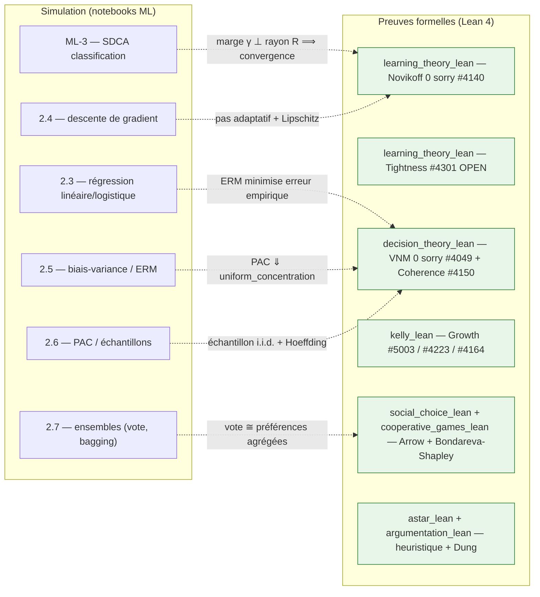

# ML - Machine Learning

<!-- CATALOG-STATUS
series: ML
pedagogical_count: 46
breakdown: DataScienceWithAgents=27, ML.Net=19
maturity: PRODUCTION=40, BETA=5, ALPHA=1
-->

[← Notebooks](../README.md) | [ML.NET (C#) →](ML.Net/README.md) | [Data Science with Agents (Python) →](DataScienceWithAgents/README.md) | [RL →](../RL/)

Le monde regorge de données, mais les transformer en décisions éclairées demande plus qu'un tableur. Le Machine Learning offre un cadre systématique pour construire des modèles prédictifs à partir de données, en allant de la régression linéaire aux réseaux de neurones en passant par les systèmes de recommandation. Cette série vous forme au ML pratique avec trois fils complémentaires : **ML.NET** pour l'écosystème .NET/C#, **Python Data Science with Agents** pour les pipelines modernes enrichis de LLMs, et les **jumeaux de parité** qui confrontent un même concept aux deux écosystèmes.

## Pourquoi cette série

Le Machine Learning est partout : recommandations Netflix, détection de spam, prévisions de vente, diagnostic médical. Mais passer de la théorie à la pratique reste un saut difficile. Cette série comble ce gap en proposant **trois angles d'attaque** :

- **ML.NET (C#/.NET)** : Pour les développeurs déjà familiers avec l'écosystème .NET, ML.NET offre un pipeline ML natif en C#. Pas besoin d'apprendre Python pour faire du ML en entreprise. Les notebooks couvrent le pipeline complet, de `IDataView` au déploiement ONNX, avec une évaluation rigoureuse par cross-validation.
- **Python + AI Agents** : Pour les data scientists et praticiens IA, le track Python combine les fondamentaux (NumPy, Pandas, scikit-learn) avec les agents LLM (LangChain, Google ADK). C'est le futur du data science workflow : l'automatisation par des agents capables de nettoyer, analyser et modéliser des données.
- **Jumeaux de parité (C# ⇄ Python/scikit-learn)** : Pour saisir que les concepts ML sont universels, plusieurs notebooks avancés de la série ML.NET disposent d'un **jumeau Python** co-localisé (`*-Python.ipynb`) qui traite le **même problème** avec les outils canoniques Python (détection d'anomalies `RandomizedPca`↔`PCA`+résidu, recommandation `MatrixFactorization`↔`NMF`, séries temporelles `ForecastBySsa`↔`STL`+`SARIMA`). Voir la [feuille ML.NET](ML.Net/README.md).

Avoir ces trois angles permet de comprendre que le ML n'est pas lié à un langage : les concepts (features, entraînement, évaluation, généralisation) sont universels, seuls les outils diffèrent.

**Applications réelles couvertes** : prévisions de ventes (régression bayésienne), systèmes de recommandation (collaborative filtering), séries temporelles (forecasting), analyse de CV (NLP + agents), compétitions Kaggle (MLE-STAR pipeline).

## Objectifs d'apprentissage

À l'issue de cette série, vous serez capable de :

1. **Construire** un pipeline ML complet (chargement, features, entraînement, évaluation) en C# ou Python
2. **Évaluer** rigoureusement un modèle (cross-validation, métriques, Permutation Feature Importance, surapprentissage)
3. **Appliquer** le feature engineering adapté au problème (encodage, normalisation, sélection de variables)
4. **Intégrer** des agents LLM dans un workflow data science (analyse automatisée, parsing, recommandation)
5. **Déployer** un modèle en production (export ONNX, interop Python/.NET, BigQuery ML)

## Parcours d'apprentissage

### Track A : ML.NET (.NET/C#, 9 notebooks C# ML-1 à ML-9 et leurs 9 jumeaux Python + 1 TP capstone, ~7h)

Le parcours ML.NET couvre le pipeline complet en C# : les notebooks 1-2 introduisent ML.NET et la préparation de données (IDataView, encodage). Le notebook 3 couvre l'entraînement (SDCA, LightGBM, AutoML). Le notebook 4 est crucial : évaluation rigoureuse par cross-validation et Permutation Feature Importance. Les notebooks 5-7 abordent les séries temporelles, l'export ONNX pour la production, et les systèmes de recommandation. Les notebooks 8-9 ouvrent sur l'apprentissage non-supervisé : clustering K-Means (segmentation RFM, méthode du coude) puis détection d'anomalies par Randomized PCA (maintenance prédictive, choix du seuil de décision). Le TP final (prévision de ventes) combine ML.NET et Infer.NET pour une régression bayésienne. Ce track présuppose .NET 9.0 + dotnet-interactive.

### Track B : Data Science with Agents (Python, 27 notebooks, ~21h)

Le parcours Python s'articule en trois temps. Les **fondations** (NumPy/Pandas) installent la manipulation de données. Le **socle ML canonique** ([02-ML-Cours](DataScienceWithAgents/02-ML-Cours/), 8 notebooks scikit-learn) pose ensuite les concepts fondamentaux — workflow et surapprentissage, descente de gradient, régressions, ensembles, biais-variance, non supervisé, théorie PAC — chacun rendant *visible* un concept-phare et ancrant un article fondateur. Viennent enfin les **labs agentic**, en deux sous-tracks : le sous-track **LangChain** (Labs 1-7) couvre le data wrangling, la visualisation, le ML classique et le NLP de base ; le sous-track **Google ADK** (Labs 8-17) monte en complexité avec le deep learning (PyTorch), le dashboarding et les pipelines multi-agents (agents LLM pour automatiser le workflow data science). Ce track présuppose Python 3.10+ avec PyTorch, scikit-learn et pandas.

## Positionnement pédagogique

Cette série sert les cours d'introduction au Machine Learning appliqué. Elle se situe après les fondamentaux de programmation (Python ou C#) et avant les séries spécialisées ([QuantConnect](../QuantConnect/) pour le trading, [RL](../RL/) pour l'apprentissage par renforcement). Aucun prérequis en statistiques avancées : les concepts sont introduits au fil des notebooks.

**Slides de cours associés** : [06-apprentissage/](../../slides/06-apprentissage/) | **Livre de référence** : [Hands-On AI Trading](https://www.hands-on-ai-trading.com/) (chapitres ML)

## Structure

```
ML/
├── ML.Net/                           # Tutoriels ML.NET (C#)
│   ├── ML-1-Introduction.ipynb
│   ├── ML-1-Introduction-Python.ipynb   # jumeau scikit-learn (regression/logistique) ⇄ ML.NET pipeline
│   ├── ML-2-Data&Features.ipynb
│   ├── ML-2-Data&Features-Python.ipynb   # jumeau scikit-learn (ColumnTransformer) ⇄ IDataView/Transforms
│   ├── ML-3-Entrainement&AutoML.ipynb
│   ├── ML-3-Entrainement-Python.ipynb   # jumeau scikit-learn (SDCA/LightGBM ⇄ Linear/GradientBoosting)
│   ├── ML-4-Evaluation.ipynb
│   ├── ML-4-Evaluation-Python.ipynb   # jumeau scikit-learn (cross_val_score + permutation_importance) ⇄ cross-validation/PFI
│   ├── ML-5-TimeSeries.ipynb
│   ├── ML-5-TimeSeries-Python.ipynb   # jumeau scikit-learn (STL+SARIMA) ⇄ ForecastBySsa
│   ├── ML-6-ONNX.ipynb
│   ├── ML-7-Recommendation.ipynb
│   ├── ML-7-Recommendation-Python.ipynb   # jumeau scikit-learn (NMF) ⇄ MatrixFactorization
│   ├── ML-8-Clustering.ipynb
│   ├── ML-8-Clustering-Python.ipynb   # jumeau scikit-learn (KMeans) ⇄ K-Means ML.NET
│   ├── ML-9-Anomaly-Detection.ipynb
│   ├── ML-9-Anomaly-Detection-Python.ipynb   # jumeau scikit-learn (PCA+résidu) ⇄ RandomizedPca
│   ├── TP-prevision-ventes.ipynb
│   └── taxi-fare.csv
│
├── DataScienceWithAgents/            # Data Science Python + AI Agents
│   ├── 01-PythonForDataScience/      # Fondations NumPy/Pandas
│   ├── 02-ML-Cours/                  # Socle ML canonique (scikit-learn)
│   ├── PythonAgentsForDataScience/   # Track LangChain (Labs 1-7)
│   └── AgenticDataScience/           # Track Google ADK (Labs 8-17)
│
└── learning_theory_lean/                  # Lake Lean 4 — convergence du perceptron (Novikoff)
```

## ML.NET (C# / .NET Interactive)

Pipeline ML.NET complet en C#, de l'introduction à l'évaluation avancée : du chargement de données au déploiement ONNX, en passant par l'entraînement, l'AutoML et l'évaluation rigoureuse.

| # | Notebook | Contenu | Focus |
|---|----------|---------|-------|
| 1 | [ML-1-Introduction](ML.Net/ML-1-Introduction.ipynb) | Hello ML.NET World, pipeline de base | Fondamentaux |
| 1-Py | [ML-1-Introduction-Python](ML.Net/ML-1-Introduction-Python.ipynb) | **Jumeau Python** : pipeline ML.NET ⇄ scikit-learn (régression + classification) | Parité .NET⇄Python |
| 2 | [ML-2-Data&Features](ML.Net/ML-2-Data&Features.ipynb) | IDataView, TextLoader, encodage | Préparation données |
| 2-Py | [ML-2-Data&Features-Python](ML.Net/ML-2-Data&Features-Python.ipynb) | **Jumeau Python** : `IDataView`/Transforms ⇄ `ColumnTransformer`+`Pipeline` (scikit-learn) | Parité .NET⇄Python |
| 3 | [ML-3-Entrainement&AutoML](ML.Net/ML-3-Entrainement&AutoML.ipynb) | SDCA, LightGBM, AutoML | Entraînement |
| 3-Py | [ML-3-Entrainement-Python](ML.Net/ML-3-Entrainement-Python.ipynb) | **Jumeau Python** : SDCA/LightGBM/AutoML ⇄ `LinearRegression`/`GradientBoosting`/`GridSearchCV` | Parité .NET⇄Python |
| 4 | [ML-4-Evaluation](ML.Net/ML-4-Evaluation.ipynb) | Cross-validation, métriques, PFI | Évaluation |
| 4-Py | [ML-4-Evaluation-Python](ML.Net/ML-4-Evaluation-Python.ipynb) | **Jumeau Python** : cross-validation + métriques + PFI ⇄ `cross_val_score` + `permutation_importance` (scikit-learn) | Parité .NET⇄Python |
| 5 | [ML-5-TimeSeries](ML.Net/ML-5-TimeSeries.ipynb) | Forecasts temporelles, windowing | Séries temporelles |
| 5-Py | [ML-5-TimeSeries-Python](ML.Net/ML-5-TimeSeries-Python.ipynb) | **Jumeau Python** : `ForecastBySsa` ⇄ `STL`+`SARIMA` (statsmodels) | Parité .NET⇄Python |
| 6 | [ML-6-ONNX](ML.Net/ML-6-ONNX.ipynb) | Export ONNX, inférence en production | Déploiement |
| 7 | [ML-7-Recommendation](ML.Net/ML-7-Recommendation.ipynb) | Système de recommandation | Recommandations |
| 7-Py | [ML-7-Recommendation-Python](ML.Net/ML-7-Recommendation-Python.ipynb) | **Jumeau Python** : `MatrixFactorization` ⇄ `NMF` (scikit-learn) | Parité .NET⇄Python |
| 8 | [ML-8-Clustering](ML.Net/ML-8-Clustering.ipynb) | K-Means, segmentation RFM, méthode du coude | Non-supervisé |
| 8-Py | [ML-8-Clustering-Python](ML.Net/ML-8-Clustering-Python.ipynb) | **Jumeau Python** : `ClusteringCatalog` ⇄ `KMeans` scikit-learn + méthode du coude | Parité .NET⇄Python |
| 9 | [ML-9-Anomaly-Detection](ML.Net/ML-9-Anomaly-Detection.ipynb) | Randomized PCA, AUC, seuil de décision | Détection d'anomalies |
| 9-Py | [ML-9-Anomaly-Detection-Python](ML.Net/ML-9-Anomaly-Detection-Python.ipynb) | **Jumeau Python** : `RandomizedPca` ⇄ `PCA`+résidu (scikit-learn) | Parité .NET⇄Python |
| TP | [TP-prevision-ventes](ML.Net/TP-prevision-ventes.ipynb) | Régression bayésienne (Infer.NET) | Application pratique |

### Installation ML.NET

```bash
# 1. Installer .NET SDK 9.0+ depuis https://dotnet.microsoft.com/download
dotnet tool install -g Microsoft.dotnet-interactive
dotnet interactive jupyter install

# Vérification
jupyter kernelspec list  # doit montrer .net-csharp
```

Documentation complète : [ML.Net/README.md](ML.Net/README.md)

## Python Data Science with Agents

Formation complète en Data Science Python enrichie d'agents IA. Vous commencerez par les fondamentaux (NumPy, Pandas), puis construirez des agents LLM capables d'analyser des données, de nettoyer des datasets, et de participer à des compétitions Kaggle. La seconde moitié plonge dans les frameworks Google ADK pour construire des systèmes multi-agents avancés.

### Fondations (01-PythonForDataScience)

| Notebook | Contenu |
|----------|---------|
| [1.2-NumPy](DataScienceWithAgents/01-PythonForDataScience/notebooks/1.2-Manipulation_de_Donnees_avec_NumPy.ipynb) | Arrays, vectorisation, opérations |
| [1.3-Pandas](DataScienceWithAgents/01-PythonForDataScience/notebooks/1.3-Analyse_de_Donnees_avec_Pandas.ipynb) | DataFrames, filtrage, manipulation |

### Socle ML canonique (02-ML-Cours)

Entre les fondations NumPy/Pandas et les labs agentic, le socle machine learning **canonique avec scikit-learn** : le workflow (train/test split, surapprentissage rendu visible), la descente de gradient (ouvrir la boîte noire de `fit()`), les régressions linéaire et logistique (OLS vs MLE), les arbres et ensembles (réduction de variance), l'évaluation rigoureuse (biais-variance, validation croisée, courbe ROC/AUC), et le non supervisé (KMeans, ACP). Chaque notebook rend visible un concept-phare et ancre les articles fondateurs — le référent manuel qui rend *jugeable* ce qu'un agent produira ensuite.

| # | Notebook | Concept rendu visible | Focus |
|---|----------|----------------------|-------|
| 2.1 | [Workflow ML](DataScienceWithAgents/02-ML-Cours/2.1-Workflow-ML.ipynb) | Train/test split, surapprentissage rendu visible | Méthodologie |
| 2.2 | [Descente de gradient](DataScienceWithAgents/02-ML-Cours/2.2-Descente-de-gradient.ipynb) | Ouvrir la boîte noire de `fit()` | Optimisation |
| 2.3 | [Régression linéaire & logistique](DataScienceWithAgents/02-ML-Cours/2.3-Regression-lineaire-logistique.ipynb) | OLS vs maximum de vraisemblance | Modèles linéaires |
| 2.4 | [Arbres, forêts & ensembles](DataScienceWithAgents/02-ML-Cours/2.4-Arbres-Forets-Ensembles.ipynb) | Réduction de variance (bagging, boosting) | Ensembles |
| 2.5 | [Biais, variance, CV & ROC](DataScienceWithAgents/02-ML-Cours/2.5-Biais-Variance-CV-ROC.ipynb) | Compromis biais-variance, validation croisée, ROC/AUC | Évaluation |
| 2.6 | [Clustering & PCA](DataScienceWithAgents/02-ML-Cours/2.6-Clustering-KMeans-PCA.ipynb) | KMeans, réduction de dimension | Non supervisé |
| 2.7 | [Modèles non paramétriques](DataScienceWithAgents/02-ML-Cours/2.7-Modeles-Non-Parametriques.ipynb) | SVM, k plus proches voisins | Non paramétrique |
| 2.8 | [Théorie PAC & VC](DataScienceWithAgents/02-ML-Cours/2.8-Theorie-PAC.ipynb) | Cadre PAC, dimension de Vapnik-Chervonenkis | Théorie de l'apprentissage |

Dossier : [`02-ML-Cours/`](DataScienceWithAgents/02-ML-Cours/). Le notebook 2.8 (borne PAC/VC) est le **pendant empirique** du lake [`learning_theory_lean/`](learning_theory_lean/) qui *prouve* la convergence du perceptron — voir la section [Théorie formelle (Lean)](#théorie-formelle-lean) ci-dessous.

### Workshop 3 Jours (PythonAgentsForDataScience)

| Jour | Lab | Nom | Objectif |
|------|-----|-----|----------|
| **Day 1** | 1 | Python for Data Science | Révision Pandas, Matplotlib, Scikit-Learn |
| **Day 2** | 2 | RFP Analysis | Parser des appels d'offres avec agents LLM |
| **Day 2** | 3 | CV Screening | Scoring CV avec agents IA |
| **Day 3** | 4 | Data Wrangling | Nettoyage et transformation de données |
| **Day 3** | 5 | Viz & ML | Visualisation et intro Scikit-Learn |
| **Day 3** | 6 | First Agent | Construire un agent simple (LLM + Tools) |
| **Day 3** | 7 | Data Analysis Agent | Agent pour interroger des DataFrames |

### Track AgenticDataScience (Days 4-7)

Track avancé intégrant les frameworks Google ADK (DS-STAR, MLE-STAR) avec support multi-provider (Gemini 3.1, vLLM, OpenAI).

| Jour | Lab | Nom | Objectif |
|------|-----|-----|----------|
| **Day 4** | 8 | ADK Introduction | Architecture ADK, configuration providers |
| **Day 4** | 9 | First ADK Agent | Premier agent pour Data Science |
| **Day 5** | 10 | File Analyzer | Analyse de fichiers hétérogènes |
| **Day 5** | 11 | Planner-Coder Loop | Boucle itérative multi-agents |
| **Day 5** | 12 | DS-Star Workshop | Application complète DS-STAR |
| **Day 6** | 13 | Web Search SOTA | Recherche de modèles SOTA |
| **Day 6** | 14 | Ablation Refinement | Optimisation ciblée par ablation |
| **Day 6** | 15 | Kaggle Challenge | Compétition Kaggle avec MLE-STAR |
| **Day 7** | 16 | Data Science Agent | Agent BigQuery/BQML |
| **Day 7** | 17 | Final Project | Projet intégré |

Documentation complète : [DataScienceWithAgents/AgenticDataScience/README.md](DataScienceWithAgents/AgenticDataScience/README.md)

### Installation Python DataScience Labs (Days 1-3)

```bash
pip install pandas numpy matplotlib seaborn scikit-learn ipywidgets
# Labs 2-3 et 6-7 nécessitent aussi :
pip install langchain langchain-openai langchain-experimental
# + variable d'environnement OPENAI_API_KEY dans un fichier .env
```

### Installation AgenticDataScience Labs (Days 4-7)

```bash
pip install -r MyIA.AI.Notebooks/ML/DataScienceWithAgents/AgenticDataScience/requirements.txt
cp .env.example .env  # puis configurer les clés API
```

Providers LLM supportés (Labs 8+) : Google Gemini (recommandé), OpenAI, OpenRouter, vLLM local, LM Studio.

Documentation complète : [DataScienceWithAgents/README.md](DataScienceWithAgents/README.md)

## Théorie formelle (Lean)

Au-delà des notebooks empiriques (ML.NET, Python), la série ML accueille un **lake Lean 4** qui formalise un résultat théorique canonique de l'apprentissage : [`learning_theory_lean/`](learning_theory_lean/). Convention des **lakes frères** — le lake est le livrable formel, `lake build` SUCCESS en est la preuve d'exécution, et le notebook pédagogique vient en pendant.

- **[`learning_theory_lean/`](learning_theory_lean/)** — **théorème de convergence du perceptron** (Novikoff, 1962) : pour des données linéairement séparables de marge γ et de rayon R, l'algorithme du perceptron effectue au plus `(R/γ)²` mises à jour avant de trouver un classifieur correct. Preuve **géométrique élémentaire et entièrement 0-sorry** (croissance de l'alignement `⟨wₖ,u⟩ ≥ kγ` + croissance de la norme `‖wₖ‖² ≤ kR²` + Cauchy–Schwarz), sur un espace préhilbertien réel abstrait via Mathlib.

C'est le **pendant prouvé** des notebooks de classification linéaire (`ML.Net/ML-3` entraîne des classifieurs, `02-ML-Cours/2.3` pose régression linéaire/logistique) : là où les notebooks *montrent* que le perceptron converge en pratique, le lake *prouve* la borne. Voir le [README du lake](learning_theory_lean/README.md) pour les modules et le détail de la preuve.

### Pont vers les Preuves Formelles (Lean 4) — différenciant CoursIA

La section ci-dessus focusse sur le **lake phare** `learning_theory_lean` (Novikoff perceptron). Le différenciant CoursIA tient à la **cartographie inter-familles** : chaque notebook ML (simulation/expérimentation) peut être doublé par un *lake* (preuve formelle) chez au moins une autre famille — décision, choix social,分配 équitable, recherche de chemin. Cette double culture (empirique ML.NET / scikit-learn ↔ formelle Lean 4 / Mathlib) ancre mathématiquement les notebooks qui *montrent* par les résultats des *preuves* qu'ils invoquent.

| Famille | Lake phare | Théorème | Branchement notebook ML |
| --- | --- | --- | --- |
| ML | `learning_theory_lean` | Convergence perceptron Novikoff 0 sorry #4140 | Ce hub (Novikoff marge γ rayon R) |
| ML | `learning_theory_lean` | Tightness (borne optimale) #4301 OPEN | Ce hub (à prouver serré) |
| ML | `learning_theory_lean` | i18n-B tranche 5 (FR `.lean` + companion `.en.md`) MERGED #5009 | Convention i18n à étendre aux autres lakes |
| Probas | `decision_theory_lean` | VNM résolu 0 sorry #4049, Coherence MERGED #4150, Peters Gittins ref v4.27.0-rc1, PAC iter-2 chaîne 0-sorry bout-en-bout | Notebooks PAC (02-ML-Cours 2.5 biais-variance / ERM sous incertitude) |
| QuantConnect | `kelly_lean` | Kelly criterion Growth MERGED #5003, Calmar/IR/MDD #4223 / #4164 | `02-ML-Cours` lien finance/ML : allocation optimale sous i.i.d. |
| GameTheory | `social_choice_lean` | Arrow impossibilité, Sen, Voting | `02-ML-Cours` 2.7 ensembles (vote d'ensemble ≅ agrégation préférences) |
| GameTheory | `cooperative_games_lean` | Bondareva-Shapley 0 sorry #3954 (noyau, attributions) | `02-ML-Cours` Shapley values (feature importance ≅ valeur de Shapley) |
| Search | `astar_lean` | Phase 1-3 SHIPPED #4090 / #4142 OPEN / #4144 OPEN | `02-ML-Cours` 2.4 descente de gradient / arêtes de coût ≅ heuristique admissible |
| SymbolicAI | `argumentation_lean` | Extension Dung (complète, préférée, stable, fondée) | `02-ML-Cours` 2.5 / 02-ML-Cours 2.7 débat ≅ framework d'argumentation |



Lecture : chaque nœud **SIM** représente un notebook ML dont le résultat empirique (marge, ERM, ensemble, PAC) est *prouvé* par au moins un nœud **LEAN** via une flèche pointillée. Le **vert pâle** sur les nœuds Lean rappelle que la *preuve* est l'engagement de véracité du notebook — pas une décoration. Voir l'EPIC [#4038](https://github.com/jsboige/CoursIA/issues/4038) (Roadmap Lean) et le hub central [P0](../README.md#lean) pour la cartographie complète (PR #5049). Cross-réf hubs voisins déjà livrés : [QuantConnect (PR #5047)](../QuantConnect/README.md), [GameTheory (PR #5050)](../GameTheory/README.md), [Probas (PR #5053)](../Probas/README.md), [SymbolicAI Lean (#5043 MERGED)](../SymbolicAI/Lean/README.md).

## Public cible

| Section | Audience | Prérequis |
|---------|----------|-----------|
| **ML.NET** | Développeurs C#/.NET, environnements enterprise | C# base, .NET SDK 9.0+ |
| **Python Data Science (Days 1-3)** | Analystes, data scientists, débutants-intermédiaires | Python base, Jupyter |
| **AI Agents (Days 4-7)** | Praticiens IA souhaitant intégrer LLMs | Days 1-3 ou expérience équivalente |

## Progression recommandée

### Parcours Data Scientist classique (~12h)

1. [ML-1](ML.Net/ML-1-Introduction.ipynb) → comprendre le pipeline ML
1. [NumPy](DataScienceWithAgents/01-PythonForDataScience/notebooks/1.2-Manipulation_de_Donnees_avec_NumPy.ipynb) + [Pandas](DataScienceWithAgents/01-PythonForDataScience/notebooks/1.3-Analyse_de_Donnees_avec_Pandas.ipynb) → maîtriser les données
1. [Socle ML canonique 2.1 → 2.8](DataScienceWithAgents/02-ML-Cours/) → les fondamentaux scikit-learn (gradient, régressions, ensembles, biais-variance, non supervisé, PAC)
1. [ML-2](ML.Net/ML-2-Data&Features.ipynb) + [ML-3](ML.Net/ML-3-Entrainement&AutoML.ipynb) → entraîner des modèles
1. [ML-4](ML.Net/ML-4-Evaluation.ipynb) → évaluer rigoureusement

### Parcours AI Agent Builder (~15h)

1. Days 1-3 (Labs 1-7) : Data Science + LangChain
1. Days 4-7 (Labs 8-17) : Google ADK + multi-agents
1. Projets finaux : Kaggle + BigQuery

### Parcours Enterprise .NET (~6h)

1. [ML-1](ML.Net/ML-1-Introduction.ipynb) à [ML-4](ML.Net/ML-4-Evaluation.ipynb) : fondamentaux ML.NET
1. [ML-5](ML.Net/ML-5-TimeSeries.ipynb) : séries temporelles
1. [ML-6](ML.Net/ML-6-ONNX.ipynb) : interop Python → .NET
1. [TP-prevision-ventes](ML.Net/TP-prevision-ventes.ipynb) : projet intégré

## Quel parcours choisir

| Profil | Parcours recommandé | Durée |
| ------ | ------------------- | ----- |
| Développeur C#/.NET en entreprise | Track A : ML.NET (ML-1 à ML-4 + TP) | ~6h |
| Data scientist débutant | Track B (Days 1-3) : Python + scikit-learn | ~8h |
| Praticien IA souhaitant automatiser | Track B complet : Python + Agents (Days 1-7) | ~17h |
| Curieux voulant comparer les approches | ML.NET (ML-1 à ML-4) + Python (Labs 1-5) | ~10h |

## FAQ / Troubleshooting

### Quelle est la différence entre ML.NET et les notebooks Python ?

**ML.NET** (C#/.NET 9.0) couvre le machine learning classique (classification, régression, clustering, anomaly detection) via le framework Microsoft.ML. Les notebooks Python couvrent les agents IA (LangChain, Google ADK, data wrangling avec Pandas). Les deux sous-séries sont indépendantes. ML.NET est pertinent si vous travaillez dans l'écosystème .NET ; les notebooks Python sont plus généraux.

### Faut-il connaître le C# pour les notebooks ML.NET ?

Oui, les notebooks ML.NET utilisent .NET Interactive (C#). Les concepts ML sont introduits depuis zéro, mais la syntaxe C# de base (variables, LINQ, classes) est supposée. Si vous ne connaissez pas C#, les notebooks Python (DataScienceWithAgents) couvrent des concepts similaires sans prérequis C#.

### Quelle est la progression recommandée ?

1. **ML.NET** (notebooks 1-5) : comprendre les bases du ML supervisé/non supervisé
2. **DataScienceWithAgents** (Day 1-7) : découvrir les agents IA et le RAG
3. **AgenticDataScience** (Day 4-7) : agents avancés avec Google ADK

Les deux sous-séries sont indépendantes et peuvent être suivies dans n'importe quel ordre.

| Problème | Solution |
| -------- | -------- |
| `dotnet-interactive` non trouvé | `dotnet tool install -g Microsoft.dotnet-interactive` puis `dotnet interactive jupyter install` |
| Kernel `.net-csharp` absent | Vérifier avec `jupyter kernelspec list`. Réinstaller si nécessaire (cf. [docs/reference/kernels-runtime.md](../../docs/reference/kernels-runtime.md)) |
| ML.NET : erreur `IDataView` au chargement | Vérifier le chemin du CSV (utilisez `Path.Combine` plutôt qu'un chemin absolu) |
| `OPENAI_API_KEY` manquant (Labs 2-3) | Créer un fichier `.env` à la racine avec `OPENAI_API_KEY=sk-...` |
| PyTorch lent sur CPU | Normal pour les Labs 8+. Le GPU est recommandé mais pas obligatoire |
| `langchain` import error | `pip install langchain langchain-openai langchain-experimental` (versions compatibles) |
| erreur `No module named 'google.adk'` | Installer le track AgenticDataScience : `pip install -r requirements.txt` dans le bon répertoire |
| Plots ne s'affichent pas | Vérifier `ipywidgets` installé + extension Jupyter activée |

## Concepts clés

| Concept | Description |
|---------|-------------|
| **Pipeline ML** | Enchaînement data loading → features → training → évaluation |
| **Feature Engineering** | One-hot encoding, normalisation, concatenation |
| **AutoML** | Recherche automatique d'hyperparamètres |
| **Evaluation** | R², MAE, RMSE, cross-validation |
| **Agents IA** | LLM + Tools + Prompt + Executor |

## Ressources

### ML.NET

- [Documentation ML.NET](https://docs.microsoft.com/en-us/dotnet/machine-learning/)
- [ML.NET Samples](https://github.com/dotnet/machinelearning-samples)
- [Hands-On AI Trading](https://www.hands-on-ai-trading.com/) — chapitres ML.NET et pipeline de trading

### Python Data Science

- [Pandas Documentation](https://pandas.pydata.org/docs/)
- [Scikit-Learn User Guide](https://scikit-learn.org/stable/user_guide.html)
- [LangChain Documentation](https://python.langchain.com/)
- [Google ADK Documentation](https://google.github.io/adk-docs/)

## Conclusion / Prochaines étapes

### Ce que vous avez appris

Cette série vous a fait parcourir le **pipeline complet du Machine Learning appliqué**, en gardant toujours les deux pieds dans le code — depuis le chargement d'un `IDataView` ou d'un DataFrame jusqu'au déploiement et à l'automatisation par agents. L'arc pédagogique se déploie sur deux registres complémentaires :

- **Le geste fondamental** — construire un modèle, ce n'est pas invoquer une boîte noire, c'est enchaîner des étapes explicites : préparer les données (encodage, normalisation), choisir un algorithme adapté au problème, entraîner, puis **évaluer rigoureusement** par cross-validation et Permutation Feature Importance plutôt que sur une seule exécution.
- **La double stack** — ML.NET (C#/.NET) et Python (scikit-learn, PyTorch) résolvent les mêmes problèmes avec des outils différents. Les concepts — features, surapprentissage, généralisation, compromis biais/variance — sont universels ; traverser les deux écosystèmes ancre cette universalité mieux qu'un seul le pourrait.
- **Le passage à l'agent** — la seconde moitié franchit un seuil : l'agent LLM devient un collaborateur du workflow data science, capable d'interroger un DataFrame, de parser des fichiers hétérogènes, d'orchestrer une boucle planner-coder ou de se confronter à une compétition Kaggle. Le data scientist ne fait plus seulement du modèle, il **construit des systèmes** qui font du modèle.

La thèse pratique est honnête : un bon modèle vit ou meurt par la qualité de son évaluation et de ses features, et l'automatisation par agents ne dispense ni de l'un ni de l'autre — elle les rend reproductibles à l'échelle.

### Prochaines étapes

- **Approfondir le calcul bayésien** : le [TP prévision de ventes](ML.Net/TP-prevision-ventes.ipynb) dresse un pont vers [Probas](../Probas/README.md) (Infer.NET, PyMC), où la régression bayésienne traitée ici comme cas d'application devient un langage à part entière — distributions, inférence, incertitude quantifiée.
- **Passer à l'apprentissage par renforcement** : [RL](../RL/README.md) prend le relais quand l'apprentissage ne se fait plus sur des données statiques mais par **interaction** avec un environnement — le cadre naturel pour le trading ([QuantConnect](../QuantConnect/README.md)) et les systèmes décisionnels séquentiels.
- **Mesurer l'incertitude, pas seulement la prédiction** : les notebooks d'évaluation (ML-4) introduisent métriques et PFI ; la série [Probas](../Probas/README.md) pousse plus loin en quantifiant l'incertitude d'une prédiction plutôt que son seul point estimé.
- Pour la pratique : reprenez le TP prévision de ventes en remplaçant la régression ML.NET par une Infer.NET, puis comparez les intervalles de confiance — c'est le passage le plus formateur entre ML classique et modélisation probabiliste.

### Le fil rouge

Le Machine Learning appliqué, c'est l'art de transformer des données en **décisions reproductibles** — et cette série insiste sur le « reproductibles » : cross-validation, PFI, pipelines explicités plutôt que notebooks jetables. Que vous soyez développeur .NET en entreprise ou data scientist Python branchant ses premiers agents, le fil conducteur reste le même : un modèle qu'on ne sait pas évaluer honnêtement ne sert à rien, et un workflow qu'on ne sait pas automatiser ne passe pas à l'échelle.

## Licence

Voir la licence du repository principal.
