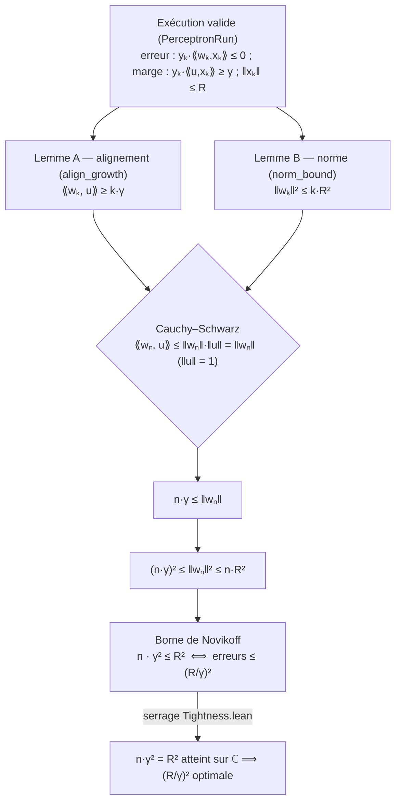

# learning_theory_lean — Learning theory (Perceptron / Novikoff + PAC / Valiant), Lean 4

Lake Lean 4 (Mathlib) à la racine de la série **ML**, mutualisant deux résultats
fondamentaux de **théorie de l'apprentissage** sous un même umbrella généraliste
(cf `decision_theory_lean` qui co-localise Gittins + Utility + Coherence) :

1. **Module `Perceptron`** — convergence du Perceptron (théorème de Novikoff,
   1962) : pour des données linéairement séparables de marge `γ > 0` et de rayon
   `R`, l'algorithme effectue au plus `(R/γ)²` mises à jour avant de trouver un
   classifieur correct. Le sous-module `Tightness` montre en outre que cette borne
   est **serrée** (atteinte avec égalité par un témoin concret sur `ℂ`).
2. **Module `PacLearning`** — théorie PAC (Valiant, 1984) : cadre de la
   **généralisation** — *quand* une hypothèse bien classée sur l'échantillon
   généralise-t-elle, et avec *combien d'exemples* ? Le module pose le modèle
   (distribution, erreur vraie `trueError`, erreur empirique `empError`) et livre
   la chaîne complète de la **borne de complexité d'échantillon** classe finie
   `m ≥ (1/ε)(ln|H| + ln(1/δ))` (concentration de Hoeffding pour Bernoulli + union
   bound, `PacFiniteBound.lean`) ainsi que la **borne de généralisation
   agnostic** (`Agnostic.lean`, itération 2) — toutes deux **0-sorry**.

C'est le **premier lake Lean de la série ML** (aucun lake Lean en ML auparavant,
roadmap #4038 Tier 2). La preuve de Novikoff est **géométrique élémentaire** :
deux inégalités de croissance du vecteur de poids `wₖ`, combinées par
Cauchy–Schwarz, donnent la borne. Les deux modules sont **entièrement 0-sorry**
sur leur périmètre prouvé : le module `Perceptron` est complet (Novikoff +
serrage `Tightness`) ; le module `PacLearning` livre la chaîne complète —
modèle (`Data`), échantillonnage (`Sample`/`SampleExpect`), concentration
(`Concentration` Markov + `MGF`/`BernoulliMGF`/`Hoeffding`), union bound
(`UnionBound`), concentration uniforme (`UniformConcentration`), puis les deux
bornes phares **0-sorry** : `PacFiniteBound` (Valiant classe finie,
`m ≥ (1/ε)(ln|H| + ln(1/δ))`) et `Agnostic` (généralisation agnostic itération 2,
argument ERM dans `ERM`).

## Statut

- **Toolchain** : `leanprover/lean4:v4.31.0-rc1` + Mathlib4 (`v4.31.0-rc1`)
- **Sorry** : **0** sur tout le module (comptage code-only, voir § Modules).
  Côté Perceptron, la borne `novikoff_mistake_bound` (`n · γ² ≤ R²`), le Lemme A
  d'alignement (`⟪wₖ, u⟫ ≥ kγ`) et le Lemme B de norme (`‖wₖ‖² ≤ kR²`) sont
  entièrement prouvés, ainsi que le **serrage** `novikoff_bound_is_sharp` (témoin
  sur `ℂ` atteignant l'égalité `n·γ² = R²`). Côté PacLearning, les deux bornes
  phares `PacFiniteBound` (Valiant) et `Agnostic` sont 0-sorry.
- **Build** : `lake build Perceptron` / `lake build PacLearning` (dépend de Mathlib4)

## Ce qui est formalisé

Sur un **espace préhilbertien réel abstrait** `V` (la borne est indépendante de la
dimension), la règle de mise à jour du perceptron est :

```
w_{k+1} = wₖ + yₖ · xₖ        (w₀ = 0)
```

lancée sur chaque erreur de classification `(xₖ, yₖ)` (étiquettes `yₖ ∈ {±1}`). Une
**exécution valide** (`PerceptronRun`) enregistre qu'on se place sur `n` mises à
jour consécutives, chacune étant une **erreur** (`yₖ · ⟨wₖ, xₖ⟩ ≤ 0`), sur des points
de norme `≤ R` séparés par un vecteur unitaire `u` avec marge `γ`.

Ces deux invariants (erreur + marge) sont exactement ce qui fait fonctionner la
preuve de Novikoff : l'erreur plafonne la croissance de `‖w‖`, la marge garantit
celle de `⟨w, u⟩`.

### Prouvé (0 sorry)

- **Lemme A — alignement** (`align_growth`) : `⟪wₖ, u⟫_ℝ ≥ k · γ`. Chaque erreur
  ajoute `yₖ · xₖ` à `w`, et l'hypothèse de marge garantit
  `yₖ · ⟪u, xₖ⟫_ℝ ≥ γ`, donc l'alignement sur le séparateur croît d'au moins `γ`.
- **Lemme B — norme** (`norm_bound`) : `‖wₖ‖² ≤ k · R²`. Chaque erreur ajoute au
  plus `R²` à `‖w‖²` (via le développement `‖a + b‖² = ‖a‖² + 2⟪a, b⟫ + ‖b‖²`), le
  terme croisé étant `≤ 0` car la mise à jour est une erreur.
- **Théorème de convergence** (`novikoff_mistake_bound`) : Cauchy–Schwarz
  `⟪wₙ, u⟫ ≤ ‖wₙ‖ · ‖u‖ = ‖wₙ‖` (avec `‖u‖ = 1`) donne `n · γ ≤ ‖wₙ‖`, donc
  `(n · γ)² ≤ ‖wₙ‖² ≤ n · R²`, i.e. **`n · γ² ≤ R²`**.

#### Structure de la preuve de Novikoff

Les deux invariants d'une exécution valide (erreur + marge) nourrissent deux
lemmes de croissance aux directions opposées, que Cauchy–Schwarz combine en la
borne de convergence :



### Serrage de la borne (sharpness)

- **`novikoff_bound_is_sharp`** (`Tightness.lean`) : la borne `(R/γ)²` est
  **optimale** — on exhibe une exécution valide sur `ℂ` (espace préhilbertien réel
  de dimension 2) qui l'**atteint avec égalité** `n · γ² = R²`. Deux points
  `x₀ = 1 + I`, `x₁ = 1 − I` (demi-droites orthogonales), tous deux d'étiquette
  `+1`, séparés par `u = 1` avec marge `γ = 1`, de norme `‖xₖ‖ = √2` (donc
  `R = √2`), et `n = 2` : on a `n · γ² = 2 = (√2)² = R²`. Puisque l'inégalité
  universelle `≤ R²` et l'égalité du témoin coexistent, aucune borne de la forme
  `n · γ² ≤ c · R²` avec `c < 1` n'est valable sur toutes les exécutions : la
  constante `1` devant `(R/γ)²` est la meilleure possible.

La preuve ne dépend d'aucune hypothèse de dimension : tout vient de la structure
d'espace préhilbertien réel (`InnerProductSpace ℝ V`), de la commutativité du
produit scalaire réel, de Cauchy–Schwarz (`real_inner_le_norm`) et du développement
du carré de la norme d'une somme (`real_inner_add_add_self`), tous fournis par
Mathlib.

## Modules

Tous les fichiers listés ci-dessous sont **0-sorry** (comptage code-only, après
suppression des commentaires/docstrings — le grep brut sur-compte via la prose
des docstrings « 0-sorry »). Chaque fichier FR possède un **sibling anglais**
`Foo_en.lean` (voir § i18n FR/EN plus bas).

### Module `Perceptron` (théorème de Novikoff)

| Fichier | sorry | Contenu |
|---------|-------|---------|
| `Perceptron/Data.lean` | 0 | Espace préhilbertien réel, `norm_sq_eq_inner_self`, développement `norm_add_sq_eq` (`‖a+b‖² = ‖a‖² + 2⟪a,b⟫ + ‖b‖²`), étiquettes `±1` (`IsLabel`, `LabeledPoint`). |
| `Perceptron/Perceptron.lean` | 0 | Suite des poids `perceptronWeights` (`w₀ = 0`, `w_{k+1} = wₖ + yₖ · xₖ`), structure `PerceptronRun` (données séparables + trace d'erreurs + invariants de marge/rayon). |
| `Perceptron/Convergence.lean` | 0 | Lemme A `align_growth` (`⟪wₖ,u⟫ ≥ kγ`), Lemme B `norm_bound` (`‖wₖ‖² ≤ kR²`), Cauchy–Schwarz ⟹ **`novikoff_mistake_bound`** (`n · γ² ≤ R²`). |
| `Perceptron/Tightness.lean` | 0 | **Saturation de la borne** : témoin concret sur `ℂ` (`x₀ = 1+I`, `x₁ = 1−I`, séparés par `u = 1`, `n = 2`, `γ = 1`, `R = √2`) atteignant l'égalité `n·γ² = R²` ⟹ **`novikoff_bound_is_sharp`** (la borne `(R/γ)²` est optimale — aucune constante `< 1` ne l'améliore). Utilitaire `complex_inner_re` (produit scalaire réel de `ℂ` en coordonnées). |
| `Perceptron.lean` | 0 | Imports parapluie + doc de statut. |

### Module `PacLearning` (théorie PAC, chaîne complète)

| Fichier | sorry | Contenu |
|---------|-------|---------|
| `PacLearning/Data.lean` | 0 | Cadre PAC (Valiant 1984) : `Distribution` (poids normalisé `X → ℝ`), erreur vraie `trueError`, erreur empirique `empError`. Propriétés symétriques (`nonneg`, `le_one`, `self`, `comm`). |
| `PacLearning/Sample.lean` | 0 | Distribution produit sur l'espace des échantillons (tirage iid). |
| `PacLearning/SampleExpect.lean` | 0 | Espérance empirique sur l'espace des échantillons. |
| `PacLearning/Concentration.lean` | 0 | Espérance et inégalité de Markov (poids ℝ). |
| `PacLearning/MGF.lean` | 0 | Fonction génératrice de moments de l'indicateur (brique Hoeffding 2a). |
| `PacLearning/BernoulliMGF.lean` | 0 | Borne analytique de la MGF de Bernoulli (brique Hoeffding 2c/3). |
| `PacLearning/Hoeffding.lean` | 0 | Concentration de Hoeffding-for-Bernoulli (brique 2c/3). |
| `PacLearning/UnionBound.lean` | 0 | Probabilité d'échantillon + union bound (inégalités de Boole). |
| `PacLearning/UniformConcentration.lean` | 0 | Concentration uniforme sur une classe finie. |
| `PacLearning/PacFiniteBound.lean` | 0 | **Borne de complexité d'échantillon** (flagship PAC) : `m ≥ (1/ε)(ln|H| + ln(1/δ))`. |
| `PacLearning/Agnostic.lean` | 0 | **Borne de généralisation PAC agnostic** (flagship itération 2). |
| `PacLearning/ERM.lean` | 0 | Argument ERM (Empirical Risk Minimization) — brique agnostic 6/6. |
| `PacLearning.lean` | 0 | Imports parapluie + doc de statut. |

### i18n FR/EN

Chaque module est doublé d'un **sibling anglais** `Foo_en.lean` (namespace
`PacLearning` ↔ `PacLearning_en`, `Perceptron` ↔ `Perceptron_en`, imports
`_en`-suffixés, **byte-identical hors docstrings/commentaires**) — livré sous
l'Epic **#4980** (Option A, pattern sibling-pair ratifié 2026-07-04). Les 18
fichiers `_en` couvrent l'intégralité des 18 modules feuilles + agrégateurs :

`PacLearning_en.lean`, `PacLearning/{Agnostic,BernoulliMGF,Concentration,Data,
ERM,Hoeffding,MGF,PacFiniteBound,Sample,SampleExpect,UniformConcentration,
UnionBound}_en.lean`, `Perceptron_en.lean`,
`Perceptron/{Convergence,Data,Perceptron,Tightness}_en.lean`.

**Conséquence** : les futurs raffinements doivent conserver la symétrie FR/EN
(les deux fichiers évoluent ensemble ou pas du tout). La CI `check_i18n_siblings`
vérifie l'absence de drift (164/166 byte-identical, 0 orphan cluster-wide au
2026-07-17).

## Build

```bash
# Depuis ce répertoire (WSL recommandé)
lake build Perceptron    # théorème de Novikoff
lake build PacLearning   # cadre PAC (modèle + propriétés élémentaires)
# Dépend de Mathlib4 — le premier build est lourd, les builds suivants utilisent le cache
```

## Notebook compagnon

Le lake est le **livrable formel** (convention des lakes frères : `lake build`
SUCCESS = preuve d'exécution). Il vient en pendant prouvé des notebooks de la
série **ML** : [`ML.Net/`](../ML.Net/) (classification linéaire, entraînement et
évaluation de classifieurs en C#/.NET), dont le perceptron est l'ancêtre
historique de la classification linéaire. La formalisation Lean démontre *pourquoi*
le perceptron converge — la garantie algorithmique que la pratique ML.NET met en
œuvre. Le module `PacLearning` a son pendant empirique dans le notebook companion
`02-ML-Cours/2.8-Theorie-PAC` (issue #4294).

## Référence

- A. B. J. Novikoff, *On convergence proofs for perceptrons*, Symposium on the
  Mathematical Theory of Automata, Polytechnic Institute of Brooklyn (1962).
- L. G. Valiant, *A theory of the learnable*, Communications of the ACM **27**
  (1984).
- S. Shalev-Shwartz & S. Ben-David, *Understanding Machine Learning*, Cambridge
  University Press (2014), §2 (classes finies) et §6 (VC dimension).

## Voir aussi

- **Issue #4051** — création du lake + module Perceptron (roadmap Lean #4038, Tier 2 « first ML theorem »)
- **Issue #4293** — renommage `perceptron_lean → learning_theory_lean` + module PacLearning (mutualisation, cf `decision_theory_lean`)
- **`ML/`** — série Machine Learning (ML.NET C#, Data Science with Agents Python)
- **Epic #2651** — prose pédagogique README
