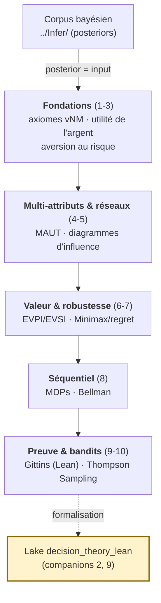

# Théorie de la Décision Bayésienne (Infer.NET)

[← Série Probas](../../README.md) | [↑ Arc Théorie de la Décision](../README.md) | [Corpus bayésien Infer (C#) →](../../Infer/README.md) | [Lake Lean `decision_theory_lean` →](../../decision_theory_lean/)

Arc autonome de **théorie de la décision bayésienne** en Infer.NET : 10 notebooks qui prolongent la modélisation probabiliste (le corpus bayésien [`../../Infer/`](../../Infer/README.md)) jusqu'au **choix d'action sous incertitude**. Un posterior n'est pas une fin — c'est l'**input** d'une politique optimale. Cette série formalise ce passage, de l'utilité espérée aux processus markoviens, jusqu'à la **preuve formelle Lean 4** de l'indice de Gittins.

**Prérequis** : le corpus bayésien [`../../Infer/`](../../Infer/README.md) (notamment [Infer-4-Bayesian-Networks](../../Infer/Infer-4-Bayesian-Networks.ipynb), [Infer-7-Skills-IRT](../../Infer/Infer-7-Skills-IRT.ipynb) pour les posteriors Beta). Aucun prérequis en théorie de la décision : les axiomes de Von Neumann-Morgenstern sont introduits ex nihilo.

**Stack** : Infer.NET (.NET 9.0 + dotnet-interactive), EP/VMP par défaut. Deux notebooks companions (2, 9) utilisent le **kernel Lean 4** (WSL) et le lake [`decision_theory_lean`](../../decision_theory_lean/).

## Pourquoi un arc autonome

Jusqu'à la restructuration de la série, la théorie de la décision était imbriquée dans le corpus bayésien Infer (notebooks 14-21), ce qui masquait la **dualité des deux fils** : *modéliser l'incertitude* (inférence bayésienne) vs *décider face à l'incertitude* (théorie de la décision). L'extraction dans [`DecisionTheory/Infer/`](./) rend ces deux arcs **physiquement indépendants** tout en préservant le continuum pédagogique (le fil décision s'appuie sur les posteriors du corpus bayésien). Le lake [`decision_theory_lean`](../../decision_theory_lean/), à la **racine de la série Probas**, reste visible des deux pistes (Infer.NET et PyMC).

## Vue d'ensemble

| # | Notebook | Durée | Concepts |
|---|----------|-------|----------|
| 1 | [DecInfer-1-Utility-Foundations](DecInfer-1-Utility-Foundations.ipynb) | 50 min | Loteries, axiomes VNM, utilité espérée |
| 2 | [DecInfer-2-Lean-ExpectedUtility](DecInfer-2-Lean-ExpectedUtility.ipynb) | 45 min | **Companion natif** (kernel Lean) : preuve formelle 0-sorry de la direction sound du théorème vNM dans le lake `decision_theory_lean` |
| 3 | [DecInfer-3-Utility-Money](DecInfer-3-Utility-Money.ipynb) | 45 min | Paradoxe St-Petersbourg, CARA, CRRA |
| 4 | [DecInfer-4-Multi-Attribute](DecInfer-4-Multi-Attribute.ipynb) | 50 min | MAUT, SMART, swing weights |
| 5 | [DecInfer-5-Decision-Networks](DecInfer-5-Decision-Networks.ipynb) | 55 min | Diagrammes d'influence, politique optimale |
| 6 | [DecInfer-6-Value-Information](DecInfer-6-Value-Information.ipynb) | 45 min | EVPI, EVSI, valeur de l'information |
| 7 | [DecInfer-7-Expert-Systems](DecInfer-7-Expert-Systems.ipynb) | 50 min | Systèmes experts, Minimax, regret |
| 8 | [DecInfer-8-Sequential](DecInfer-8-Sequential.ipynb) | 60 min | MDPs, itération valeur/politique |
| 9 | [DecInfer-9-Lean-Gittins](DecInfer-9-Lean-Gittins.ipynb) | 45 min | Preuves formelles Lean 4, indice de Gittins, SFABP |
| 10 | [DecInfer-10-Thompson-Sampling](DecInfer-10-Thompson-Sampling.ipynb) | 60 min | Thompson Sampling bayésien, posterior Beta-Bernoulli par le moteur, regret vs ε-greedy/UCB1 |

**Durée totale** : ~8h

## Progression Pédagogique

Le socle des **fondations** (1-3) pose les axiomes de rationalité et la notion d'aversion au risque ; les notebooks 4-5 étendent aux décisions multi-critères et aux réseaux de décision (nœuds de chance/décision/utilité) ; 6-7 mesurent la valeur de l'information et la robustesse sous incertitude sévère ; 8 introduit le séquentiel (MDPs, équation de Bellman) ; 9-10 clôturent par les **bandits bayésiens** (Thompson Sampling calculé par le moteur Infer.NET) et la **preuve formelle Lean 4** de l'indice de Gittins.

## Détail des notebooks

### DecInfer-1 : Fondements de l'utilité (axiomes VNM)

**Durée** : 50 min | **Prérequis** : corpus bayésien [Infer-4](../../Infer/Infer-4-Bayesian-Networks.ipynb)

Les loteries comme représentation des choix stochastiques ; les **axiomes de Von Neumann-Morgenstern** (complétude, transitivité, continuité, indépendance) ; dérivation de la fonction d'utilité par calibration ; l'agent rationnel maximise E[U]. Applications : décision médicale, assurance, investissement.

### DecInfer-2 : Companion Lean — théorème vNM (sound)

**Durée** : 45 min | **Kernel** : Lean 4 (WSL) | **Prérequis** : DecInfer-1, bases Lean 4

**Companion natif** de [DecInfer-1](DecInfer-1-Utility-Foundations.ipynb) : preuve formelle **0-sorry** de la direction *sound* du théorème de représentation vNM (représentation ⟹ rationalité) dans le lake [`decision_theory_lean`](../../decision_theory_lean/) (lib `Utility`). Vérification in-kernel via `#check` + `#print axioms`.

### DecInfer-3 : Utilité de l'argent et aversion au risque

**Durée** : 45 min | **Prérequis** : DecInfer-1

Paradoxe de Saint-Petersbourg (valeur espérée infinie), fonctions **CARA** et **CRRA**, coefficients Arrow-Pratt (aversion absolue/relative), dominance stochastique (1er et 2nd ordre), équivalent certain et prime de risque. Application : sélection de portefeuille (Livret A vs Fonds vs Actions).

### DecInfer-4 : Utilité multi-attributs

**Durée** : 50 min | **Prérequis** : DecInfer-1, DecInfer-3

Décisions multi-critères, fonctions de valeur vs utilité, indépendance préférentielle, théorèmes d'additivité (Debreu-Gorman) et multiplicativité, méthode **SMART** (swing weights). Applications : achat automobile (prix, sécurité, conso, confort), choix de carrière.

### DecInfer-5 : Réseaux de décision

**Durée** : 55 min | **Prérequis** : [Infer-4 bayésien](../../Infer/Infer-4-Bayesian-Networks.ipynb), Infer-1, Infer-4

Extension des réseaux bayésiens par les nœuds de **décision** (rectangle) et d'**utilité** (losange) ; arcs informationnels ; calcul de la politique optimale par backward induction ; décisions séquentielles. Applications : diagnostic médical avec décision de traitement, investissement avec étude de marché.

### DecInfer-6 : Valeur de l'information

**Durée** : 45 min | **Prérequis** : DecInfer-1 à DecInfer-5

**EVPI** (valeur de l'information parfaite) et **EVSI** (valeur de l'information d'échantillon) ; quand l'information a-t-elle de la valeur ; efficacité relative d'un test (EVSI/EVPI). Applications : droits pétroliers (test sismique), diagnostic médical itératif.

### DecInfer-7 : Systèmes experts et robustesse

**Durée** : 50 min | **Prérequis** : DecInfer-1 à DecInfer-6

Systèmes experts (architecture, historique) ; décision sous **incertitude sévère** (knightienne) ; critères **Minimax**, **Minimax Regret**, Maximax, Hurwicz ; robustesse aux erreurs de modélisation. Applications : diagnostic informatique, décisions financières robustes.

### DecInfer-8 : Décisions séquentielles (MDPs)

**Durée** : 60 min | **Prérequis** : DecInfer-1 à DecInfer-7

**Processus de Décision Markoviens** (MDPs) ; équation de Bellman `V(s) = max_a [R(s,a) + γ·Σ P(s'|s,a)·V(s')]` ; **itération de valeur** et **itération de politique** ; alternatives (LP, Expectimax, RTDP) ; reward shaping ; POMDPs. Pont vers la série [RL](../../../RL/README.md).

### DecInfer-9 : Companion Lean — indice de Gittins

**Durée** : 45 min | **Kernel** : Lean 4 (WSL) | **Prérequis** : DecInfer-8, bases Lean 4

**Companion natif** de [DecInfer-8](DecInfer-8-Sequential.ipynb) : preuves formelles en Lean 4. Formalisation du cadre **SFABP** (Simple Family of Alternative Bandit Processes), optimalité de l'indice de Gittins via l'argument des prevailing charges, limitations (geometric discount, NP-difficulté du calcul exact). Le théorème d'optimalité est énoncé dans le lake [`decision_theory_lean`](../../decision_theory_lean/) ; sa preuve complète exige une formalisation des MDP qui manque encore à Mathlib.

### DecInfer-10 : Thompson Sampling bayésien

**Durée** : 60 min | **Prérequis** : [Infer-7 bayésien](../../Infer/Infer-7-Skills-IRT.ipynb) (posterior Beta), Infer-8 (bandits, ε-greedy, UCB1)

Le **bandit multi-bras** vu comme un programme probabiliste Infer.NET : le moteur d'inférence (EP/VMP) calcule le posterior Beta-Bernoulli de chaque bras plutôt que d'appliquer la formule conjuguée à la main. **Thompson Sampling** : jouer le bras dont l'échantillon posterior est le plus élevé. Mesure du **regret cumulé** face à ε-greedy et UCB1 (Thompson exploite l'incertitude posterior). Extension au **best-arm identification**. La généralisation à des modèles non conjugués (où seule l'inférence approchée sait calculer le posterior) justifie l'usage du moteur.

Applications : A/B testing adaptatif, recommandation en ligne, essais cliniques séquentiels.

## Ponts inter-series

| Série | Lien | Relation |
| --- | --- | --- |
| [Corpus bayésien Infer](../../Infer/README.md) | Posteriors (Beta, gaussianes) | Le posterior est l'input de la politique de décision |
| [PyMC](../PyMC/README.md) | DecPyMC-1 à DecPyMC-7 | Même arc décision en Python/NUTS (Thompson MCMC, diagnostics ArviZ) |
| [Lake `decision_theory_lean`](../../decision_theory_lean/) | Companions 2, 9 | Preuves formelles Lean 4 (vNM, Gittins) |
| [GameTheory](../../../GameTheory/README.md) | Décision sous incertitude | Miroir : adversaire rationnel vs processus stochastique |
| [RL](../../../RL/README.md) | MDPs (DecInfer-8) | L'agent apprend la politique par interaction |

## Conclusion

La théorie de la décision bayésienne ferme la boucle ouverte par le corpus bayésien : un posterior n'est utile que s'il informe une **action**. De l'**utilité espérée** (DecInfer-1) aux **MDPs** (DecInfer-8), cet arc montre que décider sous incertitude est un calcul rigoureux — et les companions Lean 4 (DecInfer-2, DecInfer-9) ancrent ce calcul dans la **preuve formelle** : l'indice de Gittins n'est pas une heuristique, c'est un théorème.

Bonne exploration de la théorie de la décision bayésienne !
