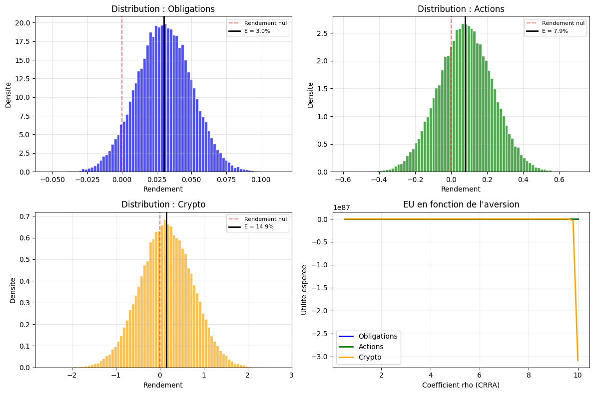
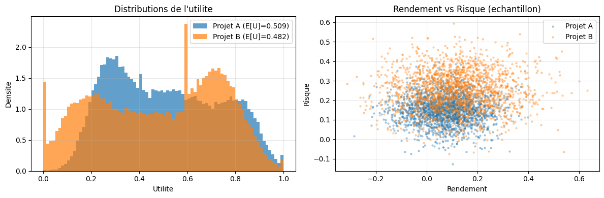
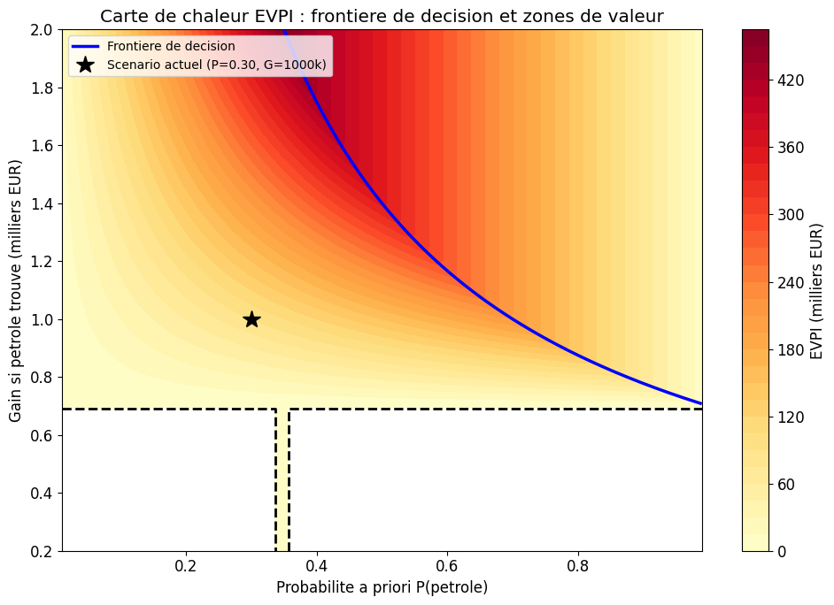
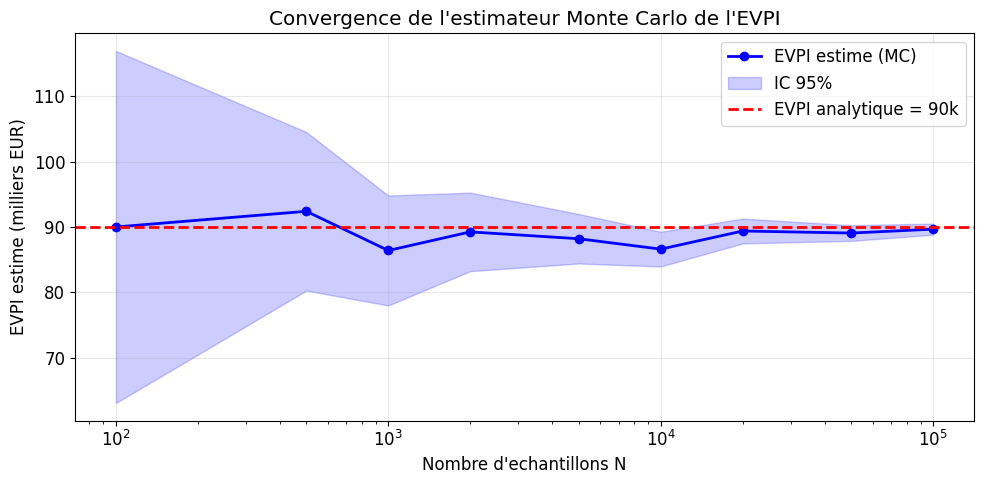
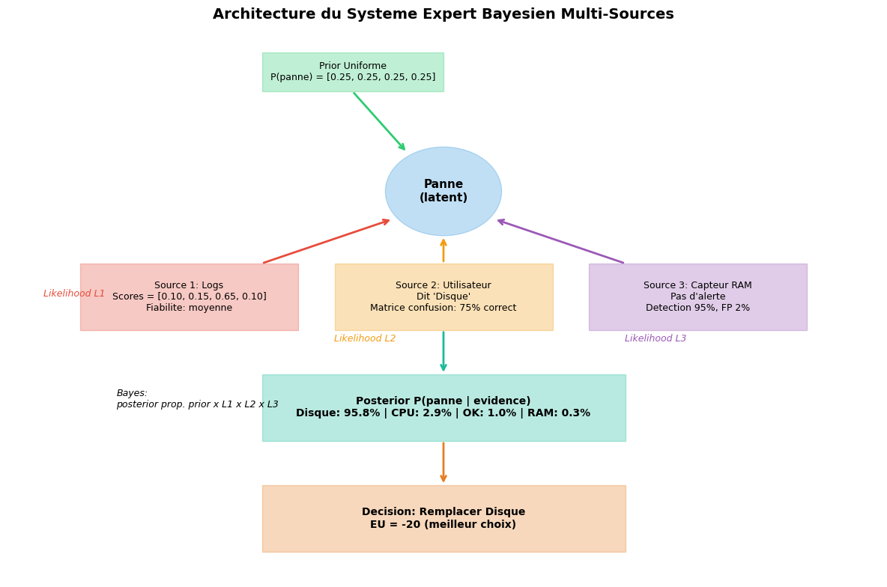
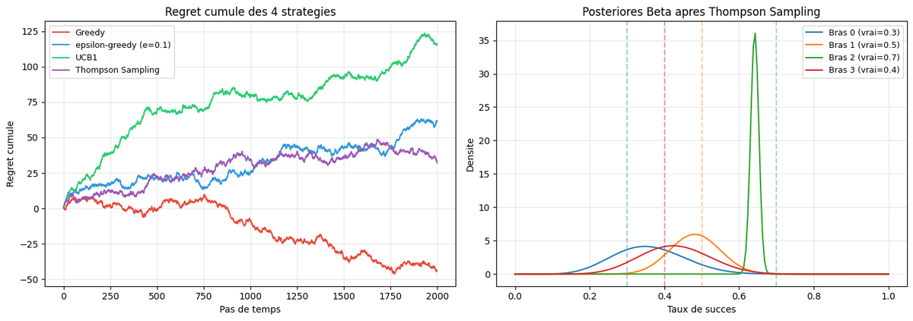
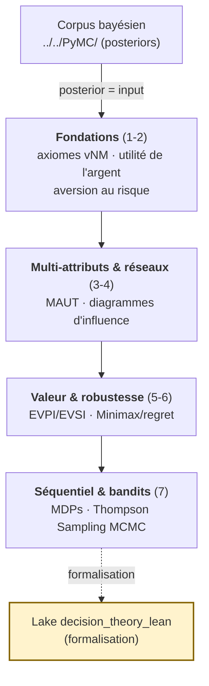

# Théorie de la Décision Bayésienne (PyMC)

[← Série Probas](../../README.md) | [↑ Arc Théorie de la Décision](../README.md) | [Corpus bayésien PyMC (Python) →](../../PyMC/README.md) | [Arc décision Infer.NET (C#) →](../DecInfer/README.md) | [Lake Lean `decision_theory_lean` →](../../decision_theory_lean/)

Arc autonome de **théorie de la décision bayésienne** en PyMC : 7 notebooks qui prolongent la modélisation probabiliste (le corpus bayésien [`../../PyMC/`](../../PyMC/README.md)) jusqu'au **choix d'action sous incertitude**. Un posterior n'est pas une fin — c'est l'**input** d'une politique optimale. Cette série formalise ce passage, de l'utilité espérée aux processus markoviens et aux bandits bayésiens MCMC.

**Prérequis** : le corpus bayésien [`../../PyMC/`](../../PyMC/README.md) (notamment [PyMC-4-Bayesian-Networks](../../PyMC/PyMC-4-Bayesian-Networks.ipynb)). Aucun prérequis en théorie de la décision : les axiomes de Von Neumann-Morgenstern sont introduits ex nihilo.

**Stack** : PyMC (Python 3, NUTS/ADVI), échantillonnage MCMC par défaut, diagnostics ArviZ. Miroir Python de l'arc [DecisionTheory/DecInfer/](../DecInfer/README.md) (Infer.NET, message passing).

## Pourquoi un arc autonome

Jusqu'à la restructuration de la série, la théorie de la décision était imbriquée dans le corpus bayésien PyMC (notebooks 14-20), ce qui masquait la **dualité des deux fils** : *modéliser l'incertitude* (inférence bayésienne) vs *décider face à l'incertitude* (théorie de la décision). L'extraction dans [`DecisionTheory/PyMC/`](./) rend ces deux arcs **physiquement indépendants** tout en préservant le continuum pédagogique (le fil décision s'appuie sur les posteriors du corpus bayésien). Le lake [`decision_theory_lean`](../../decision_theory_lean/), à la **racine de la série Probas**, reste visible des deux pistes (PyMC et Infer.NET).

## Vue d'ensemble

| # | Notebook | Durée | Concepts |
|---|----------|-------|----------|
| 1 | [DecPyMC-1-Utility-Foundations](DecPyMC-1-Utility-Foundations.ipynb) | 50 min | Loteries, axiomes VNM, utilité espérée, diagnostic hiérarchique multi-sites |
| 2 | [DecPyMC-2-Utility-Money](DecPyMC-2-Utility-Money.ipynb) | 60 min | Paradoxe St-Petersbourg, CARA, CRRA, profil de risque par inference bayésienne |
| 3 | [DecPyMC-3-Multi-Attribute](DecPyMC-3-Multi-Attribute.ipynb) | 50 min | MAUT, SMART, swing weights |
| 4 | [DecPyMC-4-Decision-Networks](DecPyMC-4-Decision-Networks.ipynb) | 55 min | Diagrammes d'influence, prévalence à test imparfait (état latent) |
| 5 | [DecPyMC-5-Value-Information](DecPyMC-5-Value-Information.ipynb) | 45 min | EVPI, EVSI, valeur de l'information |
| 6 | [DecPyMC-6-Expert-Systems](DecPyMC-6-Expert-Systems.ipynb) | 50 min | Systèmes experts, Minimax, regret |
| 7 | [DecPyMC-7-Sequential](DecPyMC-7-Sequential.ipynb) | 60 min | MDPs, itération valeur/politique, bandits, Thompson Sampling MCMC, POMDPs |

**Durée totale** : ~6h

## Aperçu — la décision sous incertitude en images

Chaque notebook de l'arc rend visible un geste décisionnel distinct, dans une figure extraite des sorties réelles des notebooks. Plutôt qu'une galerie séparée du propos, ces figures sont replacées ci-dessous dans leur progression pédagogique — du posterior d'utilité aux bandits bayésiens MCMC — au plus près du concept qu'elles illustrent. La provenance détaillée (cellule, output, poids, alt-text) est documentée dans [`assets/readme/MANIFEST.md`](assets/readme/MANIFEST.md).

**[2 — Décider, ce n'est pas maximiser l'espérance.](DecPyMC-2-Utility-Money.ipynb)** Devant trois actifs aux rendements incertains, l'espérance seule ne tranche pas : c'est toute la *distribution* postérieure des rendements qui décide. Un agent aversif au risque replie son choix sur la queue gauche ; un agent neutre regarde la moyenne. Les distributions superposées rendent visible pourquoi deux décideurs rationnels peuvent choisir différemment.

**[3 — Le compromis multi-attributs sous incertitude.](DecPyMC-3-Multi-Attribute.ipynb)** Aucun critère unique ne résume une décision réelle : coût, qualité, délai, risque sont en compétition. Une simulation de Monte Carlo sur chaque critère, pondérée par des *swing weights*, expose les trade-offs et la zone de non-dominance — là où aucune option ne bat toutes les autres sur tous les axes.

**[5 — Combien vaut l'information parfaite ?](DecPyMC-5-Value-Information.ipynb)** L'EVPI (Expected Value of Perfect Information) mesure le gain espéré si l'on levait toute l'incertitude avant de décider. La carte de chaleur, selon la probabilité d'un gisement et le gain associé, révèle les régions où acheter l'information paie et celles où elle est sans valeur — le pont entre incertitude et valeur monétaire.

**[5 — La convergence de l'estimateur Monte Carlo.](DecPyMC-5-Value-Information.ipynb)** L'EVPI n'a pas toujours de forme analytique fermée : on l'approche par Monte Carlo. La courbe de convergence montre l'estimateur se stabiliser vers la valeur analytique à mesure que croît le nombre d'échantillons — la preuve empirique que la simulation rejoint la théorie, et la quantité d'échantillons nécessaire pour s'y fier.

**[6 — Composer avis experts et règles en un graphe de décision.](DecPyMC-6-Expert-Systems.ipynb)** Quand plusieurs sources d'avis (capteurs, experts, règles) doivent converger vers une action, le graphe de décision formalise leur combinaison. Chaque nœud pondère une incertitude ou une préférence ; l'arc de décision agrège le tout sous un critère (Minimax, regret) — rendre lisible un processus qui, sans formalisation, resterait opaque.

**[7 — Thompson Sampling : le bandit qui apprend.](DecPyMC-7-Sequential.ipynb)** Face à des bras aux récompenses inconnues, Thompson Sampling échantillonne une action selon la probabilité qu'elle soit optimale, puis met à jour son posterior après chaque essai. La courbe de regret, qui croît puis s'aplatit, est la signature d'un apprentissage bayésien réussi : on exploite de plus en plus les meilleurs bras tout en continuant d'explorer.

## Progression Pédagogique

Le socle des **fondations** (1-3) pose les axiomes de rationalité et la notion d'aversion au risque ; les notebooks 3-4 étendent aux décisions multi-critères et aux réseaux de décision (nœuds de chance/décision/utilité) ; 5-6 mesurent la valeur de l'information et la robustesse sous incertitude sévère ; 7 clôture par le **séquentiel** (MDPs, équation de Bellman) et les **bandits bayésiens** où Thompson Sampling est calculé par échantillonnage MCMC plutôt que par la formule conjuguée.

## Spécificité PyMC : Thompson Sampling par MCMC

Là où l'arc [Infer.NET](../DecInfer/README.md) calcule les posteriors de bandits par message passing (EP/VMP, analytique), cet arc PyMC les obtient par **échantillonnage NUTS**. La valeur distinctive apparaît sur des modèles de bandits **non conjugués** (priors Beta-Bernoulli conjugués mis à part) : seul l'échantillonnage MCMC sait alors explorer le posterior, et Thompson Sampling se nourrit directement des échantillons. Le sujet de [DecInfer-10-Thompson-Sampling](../DecInfer/DecInfer-10-Thompson-Sampling.ipynb) est, côté Python, **intégré dans** [DecPyMC-7-Sequential](DecPyMC-7-Sequential.ipynb) (section bandits bayésiens MCMC).

## Ponts inter-series

| Série | Lien | Relation |
| --- | --- | --- |
| [Corpus bayésien PyMC](../../PyMC/README.md) | Posteriors (Beta, gaussiennes) | Le posterior est l'input de la politique de décision |
| [Arc décision Infer.NET](../DecInfer/README.md) | DecInfer-1 à DecInfer-10 | Même arc décision en C# (message passing EP/VMP), avec companions Lean 4 (vNM, Gittins) |
| [Inférence causale PyMC-14](../../PyMC/PyMC-5-Causal-Inference.ipynb) | `do(·)` de Pearl | L'intervention comme transformation de modèle avant la décision |
| [Lake `decision_theory_lean`](../../decision_theory_lean/) | Formalisation | Preuves formelles Lean 4 (vNM sound, Gittins) — companions côté Infer.NET |
| [GameTheory](../../../GameTheory/README.md) | Décision sous incertitude | Miroir : adversaire rationnel vs processus stochastique |
| [RL](../../../RL/README.md) | MDPs (DecPyMC-7) | L'agent apprend la politique par interaction |

## Conclusion

La théorie de la décision bayésienne ferme la boucle ouverte par le corpus bayésien : un posterior n'est utile que s'il informe une **action**. De l'**utilité espérée** (DecPyMC-1) aux **MDPs** et **bandits MCMC** (DecPyMC-7), cet arc montre que décider sous incertitude est un calcul rigoureux — et l'arc miroir [Infer.NET](../DecInfer/README.md) l'ancre en plus dans la **preuve formelle** Lean 4 (indice de Gittins, théorème vNM).

Bonne exploration de la théorie de la décision bayésienne en PyMC !
