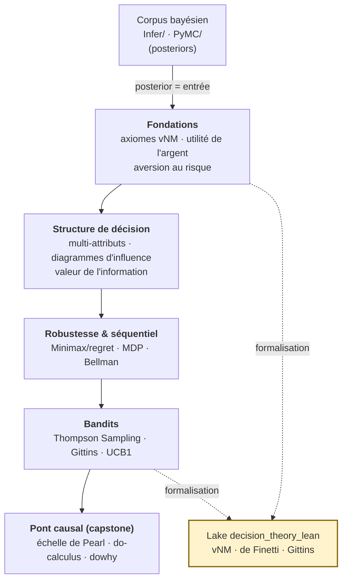

# Théorie de la Décision — arc bayésien, formel et causal

[← Série Probas](../README.md) · [Corpus bayésien Infer.NET](../Infer/README.md) · [Corpus bayésien PyMC](../PyMC/README.md) · [Lake Lean `decision_theory_lean`](../decision_theory_lean/)

Un posterior n'est pas une fin en soi : c'est l'**entrée** d'une décision. Savoir que la tumeur est maligne avec 70 % de probabilité ne dit pas s'il faut opérer ; connaître la distribution de rendement d'un actif ne dit pas combien y investir. Cet arc prolonge la modélisation probabiliste de la série [Probas](../README.md) jusqu'au **choix d'action sous incertitude** : comment transformer une croyance quantifiée en la meilleure décision possible, et comment **prouver** que cette décision est optimale.

L'arc rassemble **18 notebooks** répartis en trois traitements complémentaires du même socle théorique, plus un lake Lean 4 qui en certifie les théorèmes phares :

| Composant | Notebooks | Stack | Ce qu'il apporte |
|-----------|-----------|-------|------------------|
| [`DecInfer/`](DecInfer/README.md) | 10 (8 C# + **2 Lean 4**) | Infer.NET (.NET 9) + kernel Lean | L'arc de référence : des axiomes vNM aux MDP et bandits, avec deux notebooks à **preuve formelle native** |
| [`PyMC/`](PyMC/README.md) | 7 (Python) | PyMC (NUTS/MCMC) | Le miroir Python : mêmes concepts, échantillonnage stochastique, diagnostics ArviZ |
| [`Causal-Bridges/`](Causal-Bridges/Do-Calculus-Bridge.ipynb) | 1 (Python) | `dowhy` (PyWhy) | Le **capstone causal** : l'échelle de Pearl et le do-calculus qui fédèrent les quatre traitements de la causalité du dépôt |
| [`decision_theory_lean`](../decision_theory_lean/) | *(lake, hors compte)* | Lean 4 + Mathlib | La **couche de certification** : utilité espérée vNM, cohérence de de Finetti, escompte de Gittins, démontrés `0 sorry` |

## Pourquoi cet arc — la double question de la rationalité

La programmation probabiliste répond à une première question : *comment modéliser l'incertitude ?* La théorie de la décision en pose une seconde, distincte : *comment agir face à cette incertitude ?* Jusqu'à la restructuration de la série, ces deux fils étaient imbriqués dans le corpus bayésien, ce qui masquait leur dualité. Les extraire dans un arc autonome rend le passage **visible** : le fil « décision » consomme les posteriors du fil « inférence » comme entrée, mais raisonne avec ses propres outils — fonctions d'utilité, diagrammes d'influence, équation de Bellman.

L'arc double délibérément chaque concept sur **deux moteurs d'inférence** — Infer.NET (message passing déterministe) et PyMC (échantillonnage MCMC) — non pas pour opposer « exact » et « approché » (les deux stacks recouvrent des méthodes approchées), mais pour montrer que la **théorie de la décision est indépendante du moteur** : l'utilité espérée se calcule aussi bien par propagation de messages que par échantillonnage. Le lecteur y gagne une compréhension des compromis pratiques sans confondre la méthode numérique et le principe décisionnel.

**À qui s'adresse cet arc** : quiconque a suivi le corpus bayésien ([`Infer/`](../Infer/README.md) ou [`PyMC/`](../PyMC/README.md)) et veut passer de la *croyance* à l'*action*. Aucun prérequis en théorie de la décision — les axiomes de von Neumann–Morgenstern sont introduits *ex nihilo*. Les deux notebooks à kernel Lean 4 demandent des bases en preuve formelle, mais leurs résultats sont lisibles sans elles.

## Objectifs pédagogiques

À l'issue de cet arc, on sait :

- **Fonder** une décision rationnelle sur les axiomes de von Neumann–Morgenstern et maximiser l'utilité espérée plutôt que la valeur monétaire ;
- **Modéliser** l'aversion au risque (CARA, CRRA, Arrow–Pratt) et les décisions multi-critères (MAUT, swing weights) ;
- **Structurer** une décision par un diagramme d'influence et en extraire la politique optimale ;
- **Chiffrer** la valeur d'une information avant de l'acquérir (EVPI, EVSI) et raisonner sous incertitude sévère (Minimax, regret) ;
- **Résoudre** le séquentiel par programmation dynamique (MDP, équation de Bellman) et arbitrer exploration/exploitation (Thompson Sampling, indice de Gittins, UCB1) ;
- **Distinguer** corrélation et causalité par le do-calculus de Pearl, et exécuter une estimation d'effet causal avec l'outil de référence `dowhy` ;
- **Certifier** formellement les théorèmes de représentation (vNM), de cohérence (de Finetti) et d'escompte (Gittins) dans un assistant de preuve.

## Parcours — l'histoire de la décision, des fondations au pont causal

Le parcours suit une progression unique, portée en parallèle par les deux moteurs (Infer.NET et PyMC) :

1. **Fondations** — On pose les axiomes de rationalité (von Neumann–Morgenstern), on dérive la fonction d'utilité, on modélise l'aversion au risque (paradoxe de Saint-Pétersbourg, CARA/CRRA). C'est ici qu'intervient le **premier notebook Lean** ([DecInfer-2](DecInfer/DecInfer-2-Lean-ExpectedUtility.ipynb)) : la direction saine du théorème de représentation vNM, prouvée `0 sorry`.
2. **Structure de décision** — On passe des choix isolés aux décisions structurées : critères multiples (MAUT), diagrammes d'influence (nœuds de chance / décision / utilité), et surtout la **valeur de l'information** (EVPI, EVSI) — combien vaut un test avant de l'acheter.
3. **Robustesse & séquentiel** — Décision sous incertitude sévère (Minimax, regret) puis passage au temps : processus de décision markoviens (MDP), équation de Bellman, itération valeur/politique.
4. **Bandits** — L'arbitrage exploration/exploitation : Thompson Sampling (posterior Beta-Bernoulli calculé par le moteur), comparé à ε-greedy et UCB1. C'est ici qu'intervient le **second notebook Lean** ([DecInfer-9](DecInfer/DecInfer-9-Lean-Gittins.ipynb)) : l'indice de Gittins et les identités d'escompte géométrique.
5. **Pont causal (capstone)** — [Do-Calculus-Bridge](Causal-Bridges/Do-Calculus-Bridge.ipynb) fédère les quatre traitements de la causalité disséminés dans le dépôt (Tweety logique, Infer.NET, PyMC, émergence causale PyPhi) autour de l'**échelle de Pearl** (association → intervention → contrefactuel) et du **do-calculus**, exécutés sur l'outil de référence [`dowhy`](https://www.pywhy.org/dowhy/). Une décision optimale suppose de savoir ce que l'on *cause*, pas seulement ce que l'on *observe*.

## Structure et contenu

### `DecInfer/` — l'arc de référence (Infer.NET + Lean 4)

Dix notebooks, dont **huit en C#/.NET Interactive** (message passing EP/VMP) et **deux à kernel Lean 4** (companions natifs de preuve formelle). C'est l'arc canonique, le plus complet ; il va des axiomes vNM (notebook 1) jusqu'au Thompson Sampling (notebook 10), avec les preuves Lean de vNM (notebook 2) et de Gittins (notebook 9) intercalées à leur place pédagogique. **Détail notebook par notebook** : [`DecInfer/README.md`](DecInfer/README.md).

### `PyMC/` — le miroir Python (MCMC)

Sept notebooks Python (`DecPyMC-1..7`) qui rejouent les mêmes concepts par échantillonnage NUTS et diagnostics ArviZ. Le miroir n'est pas une simple traduction : il expose des variantes propres au paradigme stochastique (diagnostic hiérarchique multi-sites, profils de risque par inférence, état latent à test imparfait). **Détail** : [`PyMC/README.md`](PyMC/README.md).

### `Causal-Bridges/` — le capstone causal (dowhy)

Un notebook-pont unique, [Do-Calculus-Bridge](Causal-Bridges/Do-Calculus-Bridge.ipynb), qui relie l'arc décision au reste du dépôt par la question causale. Exécuté sur `dowhy` (kernel `coursia-ml-training`).

### `decision_theory_lean` — la couche de certification (hors compte notebooks)

Le lake Lean 4 [`decision_theory_lean`](../decision_theory_lean/), à la racine de la série Probas (visible des deux pistes), formalise trois résultats canoniques :

- **Utility** — la représentation d'utilité espérée de von Neumann–Morgenstern : les quatre axiomes (complétude, transitivité, indépendance, continuité/Archimède), la **direction saine** du théorème (représentation ⟹ rationalité) et la stabilité affine, démontrées **sans aucun `sorry`**. La direction d'existence (Herstein–Milnor 1953) est documentée comme jalon ouvert.
- **Coherence** — la cohérence de de Finetti / Dutch Book : la direction constructive (cas fini) et le cas mono-ticket sont **clos sans `sorry`** ; des prix de pari incohérents exposent l'agent à un livret de paris à perte sûre, via l'identité d'inclusion–exclusion.
- **Gittins** — le bandit actualisé à horizon infini : les **briques de l'escompte géométrique sont entièrement prouvées** ; le théorème phare d'optimalité de l'indice reste **énoncé mais intraitable** dans le Mathlib actuel (pas de formalisation MDP/Bellman), maintenu en `sorry` documenté — un jalon honnête, non un trou masqué.

Le lake suit la convention i18n FR/EN de la série (fichiers `*_en.lean` miroirs). **Détail** : [`decision_theory_lean/README.md`](../decision_theory_lean/README.md).

## Prérequis et démarrage

**Prérequis pédagogique** : le corpus bayésien correspondant — [`Infer/`](../Infer/README.md) pour la piste C#, [`PyMC/`](../PyMC/README.md) pour la piste Python (notamment les réseaux bayésiens et les posteriors Beta). Aucune connaissance préalable en théorie de la décision.

**Environnements** :

- **Piste Infer.NET (`DecInfer/`)** : .NET 9.0 + `dotnet-interactive`. Voir [`../README.md`](../README.md#installation) pour l'installation du kernel.
- **Piste PyMC (`PyMC/`) et pont causal (`Causal-Bridges/`)** : Python 3.10+, kernel `coursia-ml-training` (`pymc`, `arviz`, `dowhy`).
- **Companions Lean (`DecInfer-2`, `DecInfer-9`)** : kernel Lean 4 (WSL) + lake [`decision_theory_lean`](../decision_theory_lean/). Compilation : `lake -R build` dans le dossier du lake.

Chaque sous-série démarre par ses fondations (`DecInfer-1` / `DecPyMC-1`) et se lit dans l'ordre numérique — la progression est cumulative.

## Références

- Von Neumann, J. & Morgenstern, O. (1944). *Theory of Games and Economic Behavior*.
- Howard, R. A. & Matheson, J. E. (1984). *Influence Diagrams*.
- Gittins, J. C. (1979). *Bandit Processes and Dynamic Allocation Indices*. Weber, R. (1992), preuve simplifiée.
- Pearl, J. (2009). *Causality: Models, Reasoning, and Inference* (2ᵉ éd.).
- de Finetti, B. (1937). *La prévision : ses lois logiques, ses sources subjectives*.

---

*Cet arc fait partie de la série [Probas](../README.md) du dépôt [CoursIA](https://github.com/jsboige/CoursIA). Documentation détaillée de chaque notebook dans les README des sous-séries.*
