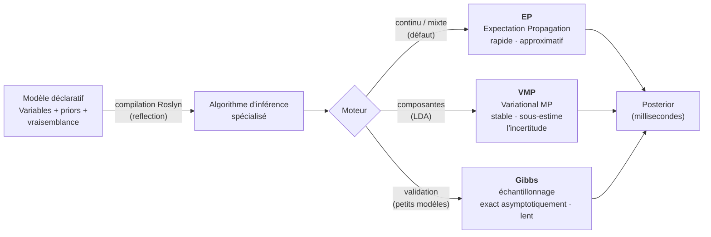
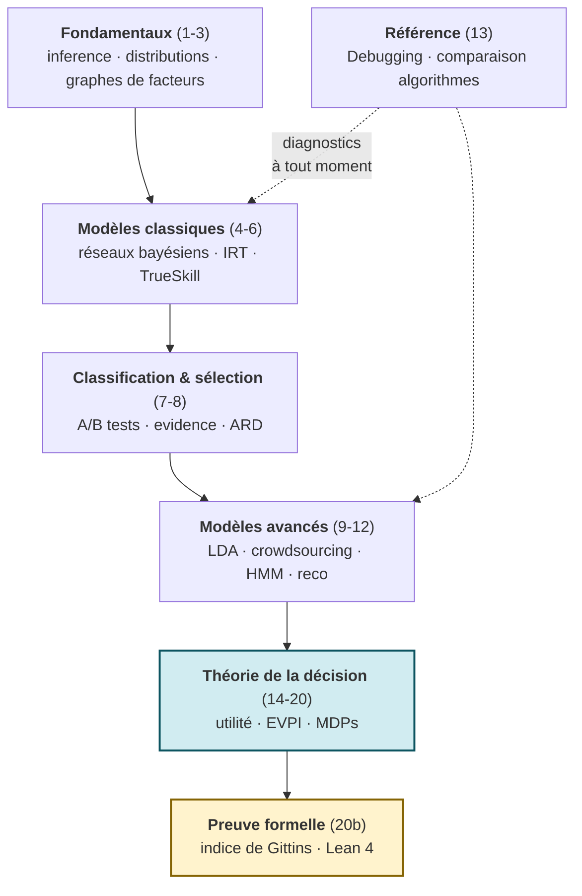

# Programmation Probabiliste avec Infer.NET

[← Série Probas](../README.md) | [Série PyMC (Python) →](../PyMC/README.md) | [ML.NET (C#) →](../../ML/ML.Net/README.md)

Programmation probabiliste avec Microsoft Infer.NET : une série de 24 notebooks allant des fondamentaux aux modèles relationnels avancés, incluant une section complète sur la théorie de la décision (MDPs, indice de Gittins, puis les **bandits bayésiens** via Thompson Sampling), l'**inférence causale** (do-calculus de Pearl) en clôture, et des preuves formelles Lean 4.

**À qui s'adresse cette série** : étudiants en IA, développeurs .NET souhaitant maîtriser l'inférence probabiliste exacte, et data scientists intéressés par les graphes de facteurs. Les notebooks C# requièrent .NET 9.0 + dotnet-interactive. Aucun prérequis en probabilités avancées : les concepts sont introduits progressivement.

## Pourquoi cette sous-série

Infer.NET est le seul framework d'inférence probabiliste natif dans l'écosystème .NET. Il compile un modèle probabiliste déclaratif en un **algorithme d'inférence spécialisé** via reflection et compilation Roslyn, offrant trois moteurs complémentaires : **Expectation Propagation (EP)** pour les modèles continus et mixtes (défaut, rapide mais approximatif), **Variational Message Passing (VMP)** pour les modèles à composantes comme LDA (stable, sous-estime l'incertitude), et **Gibbs Sampling** pour la validation sur petits modèles (exact asymptotiquement, lent). Cette approche compilée contraste avec l'échantillonnage MCMC générique de PyMC et permet des inférences en millisecondes plutôt qu'en minutes. Cette série couvre les 20 modèles classiques de la programmation probabiliste (réseaux bayésiens, TrueSkill, LDA, HMM) plus la théorie de la décision bayésienne complète (utilité espérée, diagrammes d'influence, EVPI, MDPs) et une preuve formelle Lean 4 de l'indice de Gittins.

| Algorithme | Force | Limite | Cas d'usage |
| ---------- | ----- | ------ | ---------- |
| **EP** | Rapide, bon pour gaussiennes | Approximatif, peut diverger | Modèles continus, facteurs mixtes |
| **VMP** | Stable, bon pour discret | Sous-estime l'incertitude | LDA, modèles à composantes |
| **Gibbs** | Exact asymptotiquement | Lent, convergence difficile | Validation, petits modèles |



Le trait distinctif d'Infer.NET : le modèle déclaratif est **compilé** (via Roslyn/reflection) en un algorithme d'inférence **spécialisé**, et l'on choisit l'un des trois moteurs selon la structure du modèle. C'est l'inverse d'un échantillonneur MCMC générique (PyMC) qui traite tout modèle pareil — d'où des inférences en millisecondes plutôt qu'en minutes, au prix de l'approximation (EP) ou d'une incertitude sous-estimée (VMP).

**Double approche** : Cette série est le versant C#/.NET de la programmation probabiliste. Le versant Python (PyMC) couvre les mêmes modèles avec un moteur d'inférence différent. Voir [PyMC/](../PyMC/) pour la comparaison.

**Applications réelles couvertes** : TrueSkill (Xbox Live, 100M+ joueurs), Item Response Theory (GMAT/GRE), LDA (Google News), systèmes de recommandation, diagnostic médical.

## Objectifs d'apprentissage

À l'issue de cette série, vous serez capable de :

1. **Construire** un modèle probabiliste en Infer.NET (définition, inférence, validation)
2. **Interpréter** les distributions postérieures (moyenne, variance, intervalles de crédibilité)
3. **Lire** un graphe de facteurs et comprendre le flux de messages
4. **Appliquer** la théorie de la décision bayésienne (utilité espérée, EVPI, MDPs)
5. **Comparer** l'inférence par message passing déterministe (Infer.NET) et l'échantillonnage MCMC stochastique (PyMC) sur les mêmes modèles

## Vue d'ensemble

| # | Notebook | Durée | Concepts |
|---|----------|-------|----------|
| 1 | [Infer-1-Setup](Infer-1-Setup.ipynb) | 15 min | Installation, premier modèle |
| 2 | [Infer-2-Gaussian-Mixtures](Infer-2-Gaussian-Mixtures.ipynb) | 50 min | Postérieurs, mélanges, Dirichlet |
| 3 | [Infer-3-Factor-Graphs](Infer-3-Factor-Graphs.ipynb) | 45 min | Inférence discrète, Monty Hall |
| 4 | [Infer-4-Bayesian-Networks](Infer-4-Bayesian-Networks.ipynb) | 55 min | CPT, D-séparation, causalité |
| 5 | [Infer-5-Skills-IRT](Infer-5-Skills-IRT.ipynb) | 60 min | IRT, DINA, many-to-many |
| 6 | [Infer-6-TrueSkill](Infer-6-TrueSkill.ipynb) | 55 min | Ranking, online learning, équipes |
| 7 | [Infer-7-Classification](Infer-7-Classification.ipynb) | 50 min | BPM, régression logistique, A/B |
| 8 | [Infer-8-Model-Selection](Infer-8-Model-Selection.ipynb) | 45 min | Evidence, Bayes factors, ARD |
| 9 | [Infer-9-Topic-Models](Infer-9-Topic-Models.ipynb) | 60 min | LDA, documents-topics-mots |
| 10 | [Infer-10-Crowdsourcing](Infer-10-Crowdsourcing.ipynb) | 55 min | Workers, communautés, agrégation |
| 11 | [Infer-11-Sequences](Infer-11-Sequences.ipynb) | 65 min | HMM, séries temporelles, motifs |
| 12 | [Infer-12-Recommenders](Infer-12-Recommenders.ipynb) | 60 min | Factorisation, Click Model |
| 13 | [Infer-13-Debugging](Infer-13-Debugging.ipynb) | 45 min | Troubleshooting, diagnostics, algorithmes |
| 14 | [Infer-14-Decision-Utility-Foundations](Infer-14-Decision-Utility-Foundations.ipynb) | 50 min | Loteries, axiomes VNM, utilité espérée |
| 14b | [Infer-14b-Lean-ExpectedUtility](Infer-14b-Lean-ExpectedUtility.ipynb) | 45 min | **Companion natif** (kernel Lean) : preuve formelle 0-sorry de la direction sound du théorème vNM (représentation ⟹ rationalité) dans le lake `decision_theory_lean` (lib `Utility`), `#check` + `#print axioms` in-kernel (UNLOCK c.127, jonction Mathlib #2611) |
| 15 | [Infer-15-Decision-Utility-Money](Infer-15-Decision-Utility-Money.ipynb) | 45 min | Paradoxe St-Petersbourg, CARA, CRRA |
| 16 | [Infer-16-Decision-Multi-Attribute](Infer-16-Decision-Multi-Attribute.ipynb) | 50 min | MAUT, SMART, swing weights |
| 17 | [Infer-17-Decision-Networks](Infer-17-Decision-Networks.ipynb) | 55 min | Diagrammes d'influence, politique optimale |
| 18 | [Infer-18-Decision-Value-Information](Infer-18-Decision-Value-Information.ipynb) | 45 min | EVPI, EVSI, valeur de l'information |
| 19 | [Infer-19-Decision-Expert-Systems](Infer-19-Decision-Expert-Systems.ipynb) | 50 min | Systèmes experts, Minimax, regret |
| 20 | [Infer-20-Decision-Sequential](Infer-20-Decision-Sequential.ipynb) | 60 min | MDPs, itération valeur/politique |
| 20b | [Infer-20b-Lean-Gittins](Infer-20b-Lean-Gittins.ipynb) | 45 min | Preuves formelles Lean 4, indice de Gittins, SFABP |
| 21 | [Infer-21-Thompson-Sampling](Infer-21-Thompson-Sampling.ipynb) | 60 min | Thompson Sampling bayésien, posterior Beta-Bernoulli par le moteur, regret vs ε-greedy/UCB1 |
| 22 | [Infer-22-Causal-Inference](Infer-22-Causal-Inference.ipynb) | 65 min | do-calculus, backdoor/front-door, paradoxe de Simpson |

**Durée totale** : ~21h

**Ressource complémentaire** : [Glossaire](Infer-Glossary.md) - Définitions des termes techniques

## Progression Pédagogique



Le socle d'inference (1-12) se suit en séquence ; le notebook **13 (Debugging)** est transversal — il compare aussi les trois algorithmes (EP/VMP/Gibbs) et sert de référence dès qu'une inférence dysfonctionne. La **théorie de la décision** (14-20, surlignée bleu) forme un fil rouge autonome, et le notebook **20b (Gittins, surligné jaune)** apporte la **preuve formelle Lean 4** qui ancre le tout dans le curriculum cross-série de démonstrations. Le détail notebook-par-notebook figure dans les sections détaillées ci-dessous.

---

## Fondamentaux (Notebooks 1-3)

Les notebooks 1-3 introduisent les concepts fondamentaux de la programmation probabiliste avec Infer.NET.

### Infer-1 : Configuration et Premier Modèle

**Durée** : 45 min | **Prérequis** : Notions de probabilités

**Objectifs** :

- Installer et configurer Infer.NET dans .NET Interactive
- Comprendre le workflow en 3 étapes : Modèle → Moteur → Inférence
- Implémenter un premier modèle bayésien (Two Coins)
- Maîtriser les priors conjugués Beta-Bernoulli

**Sections** :

1. Configuration de l'environnement (.NET Interactive, CompilerChoice.Roslyn)
2. Introduction à la programmation probabiliste
3. Exemple : Problème des deux pièces (Two Coins)
4. Exemple avancé : Estimation de pièce biaisée avec prior Beta
5. Apprentissage en ligne : mise à jour séquentielle

**Concepts clés** :

| Concept | Description |
|---------|-------------|
| Variable\<T\> | Représentation des quantités incertaines |
| Prior conjugué | Beta-Bernoulli pour inférence analytique |
| ExpectationPropagation | Algorithme d'inférence par défaut |

**Applications** : Estimation de pièce biaisée, apprentissage en ligne

---

### Infer-2 : Distributions Continues et Mélanges

**Durée** : 50 min | **Prérequis** : Notebook 1

**Objectifs** :

- Modéliser des données continues avec distributions gaussiennes
- Maîtriser les priors conjugués Gaussian-Gaussian et Gamma-Gamma
- Implémenter l'apprentissage en ligne
- Découvrir les modèles de mélange avec `Variable.Switch`

**Sections** :

1. Modélisation de temps de trajet de cycliste
2. Priors conjugués et apprentissage en ligne
3. Mélanges gaussiens pour données multimodales
4. Visualisation des factor graphs

**Concepts clés** :

| Distribution | Usage | Paramètres |
|--------------|-------|------------|
| Gaussian | Quantités continues | mean, precision |
| Gamma | Prior sur precision | shape, scale |
| Variable.Switch | Sélection de composante | index, values |

**Applications** : Temps de trajet cycliste, détection de modes multiples, clustering

---

### Infer-3 : Graphes de Facteurs et Inférence Discrète

**Durée** : 55 min | **Prérequis** : Notebooks 1-2

**Objectifs** :

- Comprendre la représentation en graphes de facteurs
- Maîtriser `Variable.If/IfNot` et `Variable.Case` pour branchements
- Observer le phénomène d'explaining away
- Implémenter le paradoxe de Monty Hall

**Sections** :

1. Introduction aux graphes de facteurs
2. Exemple Murder Mystery (MBML Ch.1)
3. Paradoxe de Monty Hall avec `Variable.Case`
4. Phénomène Explaining Away
5. Visualisation Graphviz

**Concepts clés** :

| Structure | Usage | Exemple |
|-----------|-------|---------|
| Variable.If | Conditionnement binaire | P(Y\|X=true) |
| Variable.Case | Conditionnement multi-value | Switch sur enum |
| Explaining away | Causes alternatives | P(A\|B,C) < P(A\|C) |

**Applications** : Murder Mystery, Monty Hall (2/3 vs 1/3), systèmes experts

---

## Modèles Classiques (Notebooks 4-6)

Les notebooks 4-6 couvrent les modèles bayésiens classiques : réseaux, compétences et classement.

### Infer-4 : Réseaux Bayésiens

**Durée** : 60 min | **Prérequis** : Notebook 3

**Objectifs** :

- Construire des réseaux bayésiens avec tables de probabilité conditionnelle (CPT)
- Comprendre D-séparation et indépendance conditionnelle
- Distinguer inférence causale (do) vs observationnelle
- Implémenter des modèles hiérarchiques

**Sections** :

1. Réseau Wet Grass/Sprinkler/Rain
2. Construction de CPTs avec `Variable.Case`
3. D-séparation et indépendance
4. Inférence causale vs observationnelle
5. Modèle hiérarchique Rats (BUGS)

**Concepts clés** :

| Concept | Formule | Description |
|---------|---------|-------------|
| CPT | P(X \| Parents(X)) | Table de probabilité conditionnelle |
| D-séparation | - | Critère graphique d'indépendance |
| do-calculus | P(Y \| do(X)) ≠ P(Y \| X) | Intervention vs observation |
| Hiérarchique | θᵢ ~ F(λ) | Pooling partiel entre groupes |

**Applications** : Wet Grass, diagnostic médical, modèle Rats (8 laboratoires)

---

### Infer-5 : Théorie de la Réponse à l'Item (IRT)

**Durée** : 65 min | **Prérequis** : Notebook 4

**Objectifs** :

- Implémenter IRT (Item Response Theory) Difficulty-Ability
- Découvrir DINA pour compétences discrètes
- Modéliser les paramètres slip et guess
- Gérer les relations many-to-many avec Q-matrix
- Évaluer avec courbes ROC

**Sections** :

1. Modèle IRT Difficulty-Ability (continu)
2. Modèle DINA avec compétences binaires
3. Paramètres slip et guess
4. Q-matrix pour compétences multiples
5. Évaluation ROC

**Concepts clés** :

| Modèle | Formule | Usage |
|--------|---------|-------|
| IRT | P(correct) = σ(ability - difficulty) | Compétence continue |
| DINA | ηᵢⱼ = Πₖ αⱼₖ^qᵢₖ | Compétences binaires |
| Slip | P(erreur \| maîtrise) | Erreur d'inattention |
| Guess | P(succès \| non-maîtrise) | Réponse au hasard |

**Applications** : Tests éducatifs, diagnostic de compétences, adaptive testing

---

### Infer-6 : TrueSkill

**Durée** : 50 min | **Prérequis** : Notebook 2

**Objectifs** :

- Comprendre le système TrueSkill (Xbox Live)
- Modéliser le skill comme Gaussian(μ, σ²)
- Gérer les matchs avec `ConstrainBetween`
- Implémenter l'apprentissage en ligne
- Étendre au 2v2 et free-for-all

**Sections** :

1. Modèle TrueSkill de base (1v1)
2. Représentation du skill : N(μ, σ²)
3. Modeling matches avec performance = skill + bruit
4. Gestion des ex-aequo
5. Extensions : Teams (2v2), Multi-player

**Concepts clés** :

| Composant | Formule | Description |
|-----------|---------|-------------|
| Skill | N(μ, σ²) | Niveau + incertitude |
| Performance | pᵢ = skillᵢ + N(0, β²) | Skill + bruit de match |
| Team skill | Σ skills individuels | Somme des membres |
| Update | μ_new ∝ surprise | Plus grande si upset |

**Applications** : Classement Xbox Live, tournois esports, matchmaking équilibré

---

## Classification et Sélection (Notebooks 7-8)

Les notebooks 7-8 couvrent la classification bayésienne et la sélection de modèles.

### Infer-7 : Classification Bayésienne

**Durée** : 55 min | **Prérequis** : Notebook 4

**Objectifs** :

- Implémenter la régression logistique bayésienne (probit model)
- Découvrir le Bayes Point Machine (BPM)
- Modéliser les tests A/B cliniques avec Beta-Binomial
- Propager l'incertitude dans les prédictions

**Sections** :

1. Régression logistique bayésienne (probit)
2. Bayes Point Machine (BPM) multi-features
3. Test A/B clinique avec Beta-Binomial
4. Propagation d'incertitude
5. Exercice : Classification de spam

**Concepts clés** :

| Modèle | Formule | Description |
|--------|---------|-------------|
| Probit | P(y=1\|x) = Φ(w·x) | CDF gaussienne |
| BPM | Moyenne du posterior sur w | Classification robuste |
| Beta-Binomial | Hiérarchique pour proportions | Test A/B |

**Applications** : Classification spam/ham, test A/B clinique, détection d'anomalies

---

### Infer-8 : Sélection de Modèles

**Durée** : 50 min | **Prérequis** : Notebook 7

**Objectifs** :

- Calculer l'evidence (marginal likelihood)
- Comparer modèles avec Bayes Factor
- Comprendre Occam's Razor automatique
- Implémenter ARD (Automatic Relevance Determination)

**Sections** :

1. Evidence et marginal likelihood
2. Bayes Factor pour comparaison de modèles
3. Occam's Razor : pénalisation automatique
4. ARD pour sélection de features
5. LOO-CV bayésien vs fréquentiste

**Concepts clés** :

| Concept | Formule | Interprétation |
|---------|---------|----------------|
| Evidence | P(D\|M) = ∫ P(D\|θ)P(θ\|M)dθ | Vraisemblance marginale |
| Bayes Factor | BF₁₂ = P(D\|M₁) / P(D\|M₂) | >10 = forte evidence |
| ARD | wᵢ ~ N(0, λᵢ⁻¹) | λᵢ → ∞ si non pertinent |

**Applications** : Comparaison polynômes, feature selection, model averaging

---

## Modèles Avancés (Notebooks 9-12)

Les notebooks 9-12 couvrent les modèles avancés : topics, crowdsourcing, séquences et recommandation.

### Infer-9 : Topic Models (LDA)

**Durée** : 60 min | **Prérequis** : Notebook 4

**Objectifs** :

- Implémenter LDA (Latent Dirichlet Allocation)
- Maîtriser les priors Dirichlet
- Résoudre la convergence VMP vers solutions dégénérées
- Utiliser des priors asymétriques

**Sections** :

1. Introduction à LDA et bag-of-words
2. Priors Dirichlet conjugués
3. Problème : VMP + priors symétriques → modes dégénérés
4. Solution : Priors asymétriques
5. Prédiction sur nouveaux documents

**Concepts clés** :

| Composant | Distribution | Rôle |
|-----------|--------------|------|
| θ_d | Dirichlet(α) | Proportions topics/document |
| z_dn | Categorical(θ_d) | Topic du mot n |
| φ_k | Dirichlet(β) | Distribution mots/topic |

**Note** : Utilise VMP au lieu d'EP pour les modèles LDA.

**Applications** : Analyse de corpus, détection de thèmes, recommandation de contenu

---

### Infer-10 : Crowdsourcing

**Durée** : 55 min | **Prérequis** : Notebook 4

**Objectifs** :

- Agréger des annotations de multiples annotateurs
- Modéliser Honest Worker (capacité unique)
- Implémenter Biased Worker (matrice de confusion)
- Découvrir le modèle Community
- Appliquer l'apprentissage actif

**Sections** :

1. Modèle Honest Worker
2. Modèle Biased Worker (matrice de confusion)
3. Modèle Community (groupes hiérarchiques)
4. Active learning : sélection d'items
5. Gold standard pour calibration

**Concepts clés** :

| Modèle | Formule | Description |
|--------|---------|-------------|
| Honest | P(label\|true, worker) = α_worker | Capacité unique |
| Biased | C_worker[true, observed] | Matrice de confusion |
| Uncertainty | H(c \| y₁:ₙ) | Entropie pour active learning |

**Applications** : Amazon Mechanical Turk, contrôle qualité, optimisation budget annotation

---

### Infer-11 : Séquences (HMM)

**Durée** : 65 min | **Prérequis** : Notebook 10

**Objectifs** :

- Comprendre les Hidden Markov Models (HMM)
- Implémenter les émissions gaussiennes
- Décoder les séquences d'états cachés
- Appliquer au motif finding (bioinformatique)

**Sections** :

1. Introduction aux HMM
2. HMM avec émissions gaussiennes
3. Approche simplifiée : classification indépendante
4. HMM complet avec Forward-Backward
5. Détection de régimes météo
6. Motif finding ADN
7. Exercice : Détection de promotions

**Concepts clés** :

| Algorithme | Formule | Usage |
|------------|---------|-------|
| Forward | αₜ(k) = P(x₁:ₜ, zₜ=k) | Probabilité jointe |
| Backward | βₜ(k) = P(xₜ₊₁:T \| zₜ=k) | Complément |
| Posterior | γₜ(k) ∝ αₜ(k)·βₜ(k) | État à chaque t |

**Note** : Infer.NET ne supporte pas nativement les HMM complets. Implémentation manuelle Forward-Backward recommandée.

**Applications** : Détection d'anomalies capteur, prévision météo, motif finding ADN

---

### Infer-12 : Systèmes de Recommandation

**Durée** : 70 min | **Prérequis** : Notebook 7

**Objectifs** :

- Implémenter la factorisation matricielle probabiliste
- Gérer le cold-start avec features
- Découvrir le Click Model pour sources multiples
- Classer des documents par pertinence

**Sections** :

1. Introduction aux systèmes de recommandation
2. Factorisation matricielle (User × Item traits)
3. Problème de sous-détermination avec peu de données
4. Cold-start : régression avec features
5. Click Model : agrégation de sources
6. Classement de documents
7. Exercice : Recommandation de films

**Concepts clés** :

| Modèle | Formule | Description |
|--------|---------|-------------|
| Factorisation | R_ui ≈ U_u · I_i | Traits latents |
| Cold-start | R ~ w·features | Features utilisateur/item |
| Click Model | P(click) = P(examine) × P(relevant) | Sources multiples |

**Applications** : Netflix/Amazon, moteurs de recherche, e-commerce

---

## Référence (Notebook 13)

### Infer-13 : Debugging et Bonnes Pratiques

**Durée** : 60 min | **Prérequis** : Tous les notebooks précédents

**Objectifs** :

- Diagnostiquer les erreurs courantes
- Comparer EP vs VMP
- Maîtriser les outils de debug Infer.NET
- Appliquer les bonnes pratiques

**Sections** :

1. Erreurs courantes et solutions
2. Comparaison EP vs VMP
3. Outils de debug (ShowFactorGraph, BrowserMode)
4. Bonnes pratiques de modélisation
5. Checklist de debugging
6. Fonctions de diagnostic
7. Exercice : Debugger un modèle bugué

**Problèmes courants** :

| Problème | Symptôme | Solution |
|----------|----------|----------|
| Observed + Inferred | PointMass | Ne pas ObservedValue sur variable inférée |
| Label switching | Modes symétriques | Priors asymétriques |
| Variance nulle | IsPointMass = true | Vérifier prior, observations |
| Convergence lente | Iterations > 50 | Vérifier graphe, utiliser VMP |

**Comparaison EP vs VMP** :

| Critère | EP | VMP |
|---------|-----|-----|
| Exactitude | Exact (gaussiennes) | Approximation |
| Vitesse | Plus lent | Rapide |
| Convergence | Garantie | Peut diverger |

**Bonnes pratiques** :

1. Nommer toutes les variables : `.Named("theta")`
2. Vérifier le factor graph systématiquement
3. Tester avec données simulées
4. Choisir priors informatifs (Beta(2,2) > Beta(1,1))
5. Valider posteriors (variance > 0, IsProper = true)

---

## Théorie de la Décision (Notebooks 14-20)

Les notebooks 14-20 forment une série complète sur la théorie de la décision bayésienne.

### Infer-14 : Axiomes et Fondements

**Durée** : 50 min | **Prérequis** : Notebooks 1-8

**Objectifs** :

- Comprendre les **loteries** comme représentation des choix stochastiques
- Maîtriser les **axiomes de Von Neumann-Morgenstern** (Complétude, Transitivité, Continuité, Indépendance)
- Dériver la **fonction d'utilité** par calibration
- Comprendre l'**agent rationnel** (maximise E[U])

**Sections** :

1. Pourquoi l'Utilité ?
2. Loteries : Représentation Formelle
3. Axiomes de Preferences Rationnelles
4. Théorème de Représentation
5. Calibration par Mise à l'Indifférence
6. Modélisation avec Infer.NET
7. Exercice : Calibrer Votre Fonction d'Utilité

**Applications** : Décision médicale, assurance automobile, investissement

---

### Infer-15 : Utilité de l'Argent et Aversion au Risque

**Durée** : 45 min | **Prérequis** : Notebook 14

**Objectifs** :

- Comprendre le **Paradoxe de Saint-Petersbourg** (valeur espérée infinie)
- Maîtriser les fonctions **CARA** et **CRRA**
- Calculer les **coefficients Arrow-Pratt** (aversion absolue/relative)
- Appliquer la **dominance stochastique** (1er et 2nd ordre)

**Concepts clés** :

| Fonction | Formule | Propriété |
|----------|---------|-----------|
| CARA | U(x) = -e^(-ax) | Aversion absolue constante |
| CRRA | U(x) = x^(1-rho)/(1-rho) | Aversion relative constante |
| Logarithmique | U(x) = ln(x) | Cas spécial CRRA (rho=1) |

**Sections** :

1. Paradoxe de Saint-Petersbourg (Bernoulli 1713)
2. Utilité Marginale Décroissante
3. Fonctions d'Utilité Classiques
4. Coefficients Arrow-Pratt
5. Équivalent Certain et Prime de Risque
6. Dominance Stochastique
7. Application : Choix d'Investissement
8. Exercice : Votre Profil de Risque
9. Inférence Bayésienne de l'Aversion avec Infer.NET

**Applications** : Simulation Monte Carlo, sélection de portefeuille (Livret A vs Fonds vs Actions)

---

### Infer-16 : Utilité Multi-Attributs

**Durée** : 50 min | **Prérequis** : Notebooks 14-15

**Objectifs** :

- Modéliser des décisions avec **plusieurs critères**
- Comprendre l'**indépendance préférentielle**
- Appliquer les **théorèmes d'additivité et multiplicativité**
- Utiliser la méthode **SMART**

**Concepts clés** :

| Forme | Formule | Condition |
|-------|---------|-----------|
| Additive | V(x) = Sum wi x vi(xi) | Indépendance mutuelle |
| Multiplicative | 1+kU = Prod(1+kki.Ui) | Interactions entre attributs |

**Sections** :

1. Décisions Multi-Critères
2. Fonctions de Valeur vs Utilité
3. Indépendance Préférentielle
4. Théorème d'Additivité (Debreu-Gorman)
5. Détermination des Poids (Swing Weights)
6. Utilité Multiplicative
7. Méthode SMART
8. Analyse de Sensibilité
9. Intégration avec Infer.NET
10. Exercice : Votre Décision Multi-Attributs
11. Apprentissage Bayésien des Poids

**Applications** : Achat automobile (prix, sécurité, conso, confort), choix de carrière, sélection de site

---

### Infer-17 : Réseaux de Décision

**Durée** : 55 min | **Prérequis** : Notebooks 3, 14-16

**Objectifs** :

- Étendre les réseaux bayésiens avec **nœuds de décision et d'utilité**
- Calculer la **politique optimale** (backward induction)
- Comprendre les **arcs informationnels**
- Modéliser des **décisions séquentielles**

**Types de nœuds** :

| Nœud | Forme | Rôle |
|-------|-------|------|
| Chance | Ovale | Variable aléatoire |
| Décision | Rectangle | Choix de l'agent |
| Utilité | Losange | Fonction de récompense |

**Sections** :

1. Des Réseaux Bayésiens aux Réseaux de Décision
2. Types de Nœuds
3. Arcs Informationnels
4. Calcul de la Politique Optimale
5. Exemple : Investissement avec Test de Marché
6. Décisions Séquentielles
7. Implémentation avec Infer.NET
8. Visualisation du Factor Graph
9. Exercice : Réseau de Décision Personnalisé
10. Application MAUT : Choix de Site d'Aéroport

**Applications** : Diagnostic médical avec décision de traitement, investissement avec étude de marché

---

### Infer-18 : Valeur de l'Information

**Durée** : 45 min | **Prérequis** : Notebooks 14-17

**Objectifs** :

- Calculer la **valeur de l'information parfaite** (EVPI)
- Calculer la **valeur de l'information d'échantillon** (EVSI)
- Comprendre **quand l'information a de la valeur**

**Formules clés** :

| Mesure | Formule | Interprétation |
|--------|---------|----------------|
| EVPI | E[max U given omega] - max E[U] | Gain si on connaît l'état du monde |
| EVSI | E[max U given signal] - max E[U] | Gain avec test imparfait |
| Efficacité | EVSI / EVPI | Qualité relative du test |

**Sections** :

1. Information et Réduction d'Incertitude
2. Valeur de l'Information Parfaite (EVPI)
3. Exemple : Droits de Forage Pétrolier
4. Exemple : Chasse au Trésor
5. Quand l'Information a-t-elle de la Valeur ?
6. Implémentation avec Infer.NET
7. Exercice : Faut-il Faire un Test Médical ?
8. Diagnostic Médical avec Tests Successifs

**Applications** : Droits pétroliers (test sismique), diagnostic médical (sensibilité 95%, spécificité 90%)

---

### Infer-19 : Systèmes Experts et Robustesse

**Durée** : 50 min | **Prérequis** : Notebooks 14-18

**Objectifs** :

- Comprendre les **systèmes experts** et leur architecture
- Appliquer le critère **Minimax** (décisions robustes)
- Implémenter le critère **Minimax Regret**
- Gérer l'**incertitude sur les probabilités** (Knightienne)

**Critères de décision** :

| Critère | Formule | Attitude |
|---------|---------|----------|
| Maximax | max_a max_omega U(a,omega) | Optimiste |
| Minimax | max_a min_omega U(a,omega) | Pessimiste |
| Minimax Regret | min_a max_omega [U*(omega) - U(a,omega)] | Minimise le pire regret |
| Hurwicz | alpha x max + (1-alpha) x min | Compromis |

**Sections** :

1. Systèmes Experts : Architecture et Historique
2. Décision sous Incertitude Sévère
3. Critère Minimax
4. Critère Minimax Regret
5. Comparaison Complète des Critères
6. Critère Hurwicz
7. Robustesse aux Erreurs de Modélisation
8. Système Expert Bayésien Multi-Sources avec Infer.NET
9. Exercice : Système Expert de Diagnostic

**Applications** : Diagnostic informatique, diagnostic médical multi-sources, décisions financières robustes

---

### Infer-20 : Décisions Séquentielles (MDPs)

**Durée** : 60 min | **Prérequis** : Notebooks 14-19

**Objectifs** :

- Comprendre les **Processus de Décision Markoviens** (MDPs)
- Maîtriser l'**itération de valeur** et l'**itération de politique**
- Découvrir les alternatives : **LP, Expectimax, RTDP**
- Appliquer le **reward shaping** avec préservation de politique

**Composants d'un MDP** :

| Composant | Notation | Description |
|-----------|----------|-------------|
| États | S | Ensemble des situations possibles |
| Actions | A | Choix disponibles |
| Transition | P(s' given s,a) | Probabilité de changement d'état |
| Récompense | R(s,a) | Gain immédiat |
| Discount | gamma in [0,1] | Facteur d'actualisation |

**Équation de Bellman** :

```
V(s) = max_a [R(s,a) + gamma x Sum P(s'|s,a) x V(s')]
```

**Sections** :

1. Décisions Séquentielles vs One-Shot
2. Processus de Décision Markoviens
3. Équation de Bellman
4. Itération de Valeur
5. Itération de Politique
6. Alternatives : LP, Expectimax, RTDP
7. Reward Shaping
8. Bandits Multi-Bras
9. Indice de Gittins
10. POMDPs : MDPs Partiellement Observables

**Applications** : Navigation robotique, allocation de ressources, jeux de stratégie

### Infer-20b : Preuves formelles - Indice de Gittins (Lean 4)

**Durée** : 45 min | **Prérequis** : Notebook 20, bases Lean 4
**Kernel** : Lean 4 (WSL)

**Companion notebook** de [Infer-20](Infer-20-Decision-Sequential.ipynb) avec preuves formelles en Lean 4.

**Objectifs** :

- Formaliser le cadre **SFABP** (Simple Family of Alternative Bandit Processes)
- Prouver l'**optimalité de l'indice de Gittins** via l'argument des prevailing charges
- Explorer les **limitations** (geometric discount, NP-difficulté du calcul exact)

**Lien avec PyMC** : Le notebook compagnon [PyMC-20](../PyMC/PyMC-20-Decision-Sequential.ipynb) couvre les mêmes concepts en Python avec Thompson Sampling MCMC et diagnostics ArviZ.

---

## Bandits Bayésiens (Notebook 21)

### Infer-21 : Thompson Sampling bayésien

Prolongement naturel de la théorie de la décision séquentielle : après les MDPs ([Infer-20](Infer-20-Decision-Sequential.ipynb)) et l'indice de Gittins ([Infer-20b](Infer-20b-Lean-Gittins.ipynb)), le **bandit multi-bras** vu comme un programme probabiliste Infer.NET.

**Durée** : 60 min | **Prérequis** : [Notebook 5](Infer-5-Skills-IRT.ipynb) (posterior Beta), [Notebook 20](Infer-20-Decision-Sequential.ipynb) (bandits, ε-greedy, UCB1)

**Objectifs** :

- Modéliser un **bandit multi-bras** comme un programme probabiliste Infer.NET
- Faire calculer au **moteur d'inférence** le posterior Beta-Bernoulli de chaque bras (EP/VMP), plutôt que d'appliquer la formule conjuguée à la main
- Implémenter le **Thompson Sampling** : jouer le bras dont l'échantillon posterior est le plus élevé
- Mesurer le **regret cumulé** face à ε-greedy et UCB1 (Thompson exploite l'incertitude posterior)
- Étendre au **best-arm identification** : estimer P(bras i est le meilleur) par échantillonnage posterior

**Concepts clés** :

| Concept | Formule | Description |
|---------|---------|-------------|
| Posterior Beta | `Beta(1+s, 1+f)` | Calculé par Infer.NET (EP/VMP), pas à la main |
| Thompson | `a = argmax_k θ̃_k`, `θ̃_k ~ posterior_k` | Jouer selon P(bras k est le meilleur) |
| Regret | `Σ_t (θ*_max − θ*(a_t))` | Perte cumulée vs bras optimal |
| Best-arm id | `P(bras i = argmax θ) ≈ freq(i gagne)` | Identification probabiliste du meilleur bras |

**Positionnement** : [Infer-20](Infer-20-Decision-Sequential.ipynb) section 8 implémente ε-greedy, UCB1 et un exercice de Thompson **manuel** (comptage des succès/échecs, formule conjuguée codée à la main). Infer-21 en est le versant **moteur** : Infer.NET calcule le posterior Beta de chaque bras par inférence variationnelle, et Thompson échantillonne depuis ce posterior. Le regret cumulé mesuré (Thompson ≪ ε-greedy) prouve que l'exploration bayésienne ciblée exploite l'incertitude là où l'information manque — la généralisation à des modèles non conjugués (où seule l'inférence approchée sait calculer le posterior) justifie l'usage du moteur.

**Applications** : A/B testing adaptatif, recommandation en ligne, essais cliniques séquentiels, publicité programmatique.

---

## Inférence Causale (Notebook 22)

### Infer-22 : Inférence Causale et do-calculus

**Durée** : 65 min | **Prérequis** : Notebook 4 (réseaux bayésiens, CPT, D-séparation)

**Objectifs** :

- Distinguer **observation** `P(Y|X)` et **intervention** `P(Y|do(X))` (Pearl, 2000)
- Implémenter le **do-opérateur** par **mutilation de graphe** (`Variable.Bernoulli(1.0)` coupe l'arc parent)
- Calculer l'effet causal via **backdoor** et **front-door adjustment**
- Reconnaître et **résoudre causalement** le **paradoxe de Simpson**
- Aborder le **contrefactuel** (Niveau 3 de l'échelle de Pearl)

**Concepts clés** :

| Concept | Formule | Description |
|---------|---------|-------------|
| do-opérateur | `P(Y\|do(X))` | Intervention : coupe les arcs entrants de X |
| Backdoor | `Σ_u P(Y\|X,u)P(u)` | Ajustement quand le confondeur U est observé |
| Front-door | `Σ_m P(M\|X)Σ_{x'} P(Y\|M,x')P(x')` | Ajustement par médiateur quand U est inobservable |
| Simpson | agrégé ≠ conditionnel | Renversement : la conclusion s'inverse |

**Positionnement** : le notebook [Infer-4](Infer-4-Bayesian-Networks.ipynb) n'abordait la causalité qu'en deux cellules isolées. Infer-22 en fait un traitement dédié et **distributionnel** : les effets causaux sont **calculés** par le moteur d'inférence Infer.NET via mutilation de graphe, là où le jumeau symbolique [Tweety-11-Causal](../../SymbolicAI/Tweety/Tweety-11-Causal.ipynb) raisonne en Java propositionnel, et où [PyMC-4](../PyMC/PyMC-4-Bayesian-Networks.ipynb) démontre `P(Cloudy|do(Rain))` en MCMC.

**Ponts causaux** : Infer-22 est le maillon **distributionnel par message passing** (Infer.NET, EP/VMP) d'un pont à quatre paradigmes autour du `do(·)` de Pearl — le jumeau symbolique [Tweety-11-Causal](../../SymbolicAI/Tweety/Tweety-11-Causal.ipynb) (Java propositionnel), le jumeau MCMC [PyMC-22](../PyMC/PyMC-22-Causal-Inference.ipynb), et la lecture par l'émergence causale [ICT-5](../../IIT/ICT-5-CausalEmergence.ipynb), où la distribution d'intervention `p(C)` uniforme **est** `do(X_t = x)`. Vue d'ensemble : le [README IIT](../../IIT/README.md), section « Ponts causaux : le do-calculus de Pearl à travers les paradigmes ».

**Applications** : baromètre (confondeur), diagnostic médical (paradoxe de Simpson), tabac-cancer (front-door), requêtes contrefactuelles.

---

## Prérequis

- .NET 9.0 ou supérieur
- .NET Interactive / Polyglot Notebooks
- VS Code avec extension Polyglot Notebooks (recommandé)
- Graphviz (optionnel, pour visualisation des factor graphs)

## Installation

### 1. .NET SDK 9.0+

```bash
# Installer depuis https://dotnet.microsoft.com/download
# Vérifier l'installation
dotnet --version
```

### 2. Kernel dotnet-interactive

```bash
dotnet tool install -g Microsoft.dotnet-interactive
dotnet interactive jupyter install
```

### 3. Ou utiliser le script PowerShell (recommandé)

```bash
# Installe dotnet-interactive, papermill et enregistre les kernels :
cd MyIA.AI.Notebooks/Probas/Infer/scripts
.\setup_environment.ps1
```

### 4. Extension VS Code

Installer l'extension "Polyglot Notebooks" depuis le marketplace VS Code.

### 5. Packages NuGet (automatique)

Chaque notebook inclut les références nécessaires :

```csharp
#r "nuget: Microsoft.ML.Probabilistic"
#r "nuget: Microsoft.ML.Probabilistic.Compiler"
```

### 6. Graphviz (optionnel)

Pour les visualisations de factor graphs dans les notebooks 11, 14-20 :

```bash
# Windows (chocolatey)
choco install graphviz

# Ou téléchargement direct depuis https://graphviz.org/download/
```

### Vérification

```bash
jupyter kernelspec list  # doit afficher .net-csharp et python3
```

### Tester tous les notebooks

```bash
python MyIA.AI.Notebooks/Probas/Infer/scripts/test_notebooks.py --validate-only
```

## Concepts Clés Infer.NET

### Types de Variables

| Type | Description | Exemple |
|------|-------------|---------|
| `Variable<bool>` | Variable booléenne | `Variable.Bernoulli(0.5)` |
| `Variable<double>` | Variable continue | `Variable.GaussianFromMeanAndVariance(0, 1)` |
| `Variable<int>` | Variable discrète | `Variable.DiscreteUniform(5)` |
| `VariableArray<T>` | Tableau 1D | `Variable.Array<double>(range)` |
| `VariableArray2D<T>` | Tableau 2D | `Variable.Array<double>(range1, range2)` |

### Distributions

| Distribution | Usage | Paramètres |
|--------------|-------|------------|
| Bernoulli | Bool | prob |
| Gaussian | Continue | mean, variance/precision |
| Gamma | Precision | shape, scale |
| Beta | Probabilité | alpha, beta |
| Dirichlet | Proportions | concentrations |
| Discrete | Catégorique | probs |

### Structures de Contrôle

```csharp
// Conditionnement
using (Variable.If(condition)) { ... }
using (Variable.IfNot(condition)) { ... }

// Sélection (switch)
using (Variable.Switch(variable)) { ... }
using (Variable.Case(variable, value)) { ... }

// Boucles
using (Variable.ForEach(range)) { ... }
```

### Inférence

```csharp
InferenceEngine moteur = new InferenceEngine();
moteur.Compiler.CompilerChoice = CompilerChoice.Roslyn;  // Important pour notebooks
moteur.Algorithm = new ExpectationPropagation();         // ou VariationalMessagePassing

var posterior = moteur.Infer<DistributionType>(variable);
```

## Structure des Fichiers

```
Infer/
+-- Infer-1-Setup.ipynb ... Infer-22-Causal-Inference.ipynb
+-- Infer-20b-Lean-Gittins.ipynb    # Companion Lean 4 (preuves formelles Gittins)
+-- Infer-Glossary.md
+-- FactorGraphHelper.cs          # Helper pour visualisation Graphviz
+-- README.md
+-- scripts/                      # Scripts de maintenance
```

## Domaines d'Application

| Domaine | Modèles | Notebooks |
|---------|---------|-----------|
| Jeux vidéo | TrueSkill, ranking | 6 |
| Éducation | IRT, DINA, compétences | 5 |
| NLP | LDA, topics | 9 |
| Médecine | A/B testing, diagnostic, systèmes experts | 4, 7, 17, 18, 19 |
| Crowdsourcing | Agrégation labels | 10 |
| Finance | Détection régimes, aversion risque, MDPs | 11, 15, 20 |
| E-commerce | Recommandation | 12 |
| Bioinformatique | Motif finding | 11 |
| Planification | Diagrammes d'influence, MDPs | 17, 20 |
| Contrôle qualité | Valeur de l'information | 18 |

## Sources et Références

### Documentation Officielle

- [Infer.NET Documentation](https://dotnet.github.io/infer/)
- [Infer.NET GitHub](https://github.com/dotnet/infer)

### Livre de Référence

- [Model-Based Machine Learning (MBML)](https://mbmlbook.com/) - Bishop et al.

### Références Théorie de la Décision

- von Neumann & Morgenstern (1944) : Theory of Games and Economic Behavior
- Arrow (1965) : Aspects of the Theory of Risk Bearing
- Keeney & Raiffa (1976) : Decisions with Multiple Objectives
- Howard (1966) : Information Value Theory
- Bellman (1957) : Dynamic Programming

### Exemples Utilisés

- WetGrassSprinklerRain (Bayesian Networks)
- Murder Mystery (Factor Graphs, MBML Ch1)
- TrueSkill (Ranking, MBML Ch3)
- StudentSkills (IRT/DINA, MBML Ch2)
- ClinicalTrial (A/B Testing)
- LDA (Topic Models)
- Crowdsourcing (MBML Ch7)
- RecommenderSystem (Factorisation)
- ClickModel (Multi-vues)
- St-Petersburg Paradox (Decision Theory)
- Investment Portfolio (Decision Networks)
- Medical Diagnosis (Expert Systems)
- Inventory Management (MDPs)

## Algorithmes d'Inférence

| Algorithme | Avantage | Utilisation |
|------------|----------|-------------|
| EP (Expectation Propagation) | Rapide, approximatif | Par défaut |
| VMP (Variational Message Passing) | Converge toujours | Modèles complexes |
| Gibbs Sampling | Exact (asymptotique) | Petits modèles |

## FAQ / Troubleshooting

Pour un guide complet, voir [Infer-13-Debugging](Infer-13-Debugging.ipynb).

| Problème | Solution |
| --- | --- |
| `The type 'Variable' does not contain a definition for...` | Vérifier que le namespace `MicrosoftResearch.Infer` est importé. Le notebook 1 (Setup) couvre la configuration |
| `Inference exception: Improper distribution` | Le modèle contient une boucle causale ou une observation contradictoire. Le notebook 13 (Debugging) détaille les stratégies de diagnostic |
| `Algorithm compilation failed` | Infer.NET compile un algorithme d'inférence par reflection. Vérifier que le modèle est dans une famille supportée (conjugué). Modèles non-conjugués nécessitent EP ou VMP |
| Performance lente sur les grands modèles | Utiliser `InferenceEngine.Compiler.ShowGeneratedSource = true` pour inspecter le code généré. Le notebook 13 compare les algorithmes EP/VMP/Gibbs |
| `.NET kernel non disponible` | Installer .NET Interactive : `dotnet tool install --global Microsoft.dotnet-interactive` |

### Erreur de compilation

```csharp
moteur.Compiler.CompilerChoice = CompilerChoice.Roslyn;
```

Cette ligne est **obligatoire** pour les notebooks .NET Interactive.

### Convergence lente

- Réduire le nombre d'itérations : `moteur.NumberOfIterations = 50`
- Simplifier le modèle
- Utiliser VMP au lieu d'EP

### Mémoire insuffisante

- Réduire la taille des tableaux
- Utiliser des boucles `ForEach` au lieu de développements explicites

### Factor Graph non affiché

- Vérifier que Graphviz est installé et dans le PATH
- Vérifier que `FactorGraphHelper.cs` est présent dans le répertoire
- Essayer `engine.ShowFactorGraph = true` avant l'inférence

### Erreurs connues dans les notebooks de décision

- `Beta.GetQuantile` n'existe pas : utiliser l'approximation normale pour les intervalles de crédibilité
- `ShowFactorGraph` peut causer un crash du kernel : utiliser avec précaution

### Glossaire

Consultez le [Glossaire](Infer-Glossary.md) pour les définitions des termes techniques (EP, VMP, Factor Graph, EVPI, MDP, etc.)

## Ponts inter-series

| Série | Lien | Relation |
| --- | --- | --- |
| [PyMC](../PyMC/) | Même 20 modèles en Python/NUTS | Comparaison message passing déterministe vs MCMC |
| [Probas (parent)](../README.md) | Vue d'ensemble Probas | Contexte et parcours |
| [ML.NET](../../ML/ML.Net/) | TP prévision de ventes | Combine ML.NET + Infer.NET |
| [Search/CSP](../../Search/Part2-CSP/) | CSP-5 (Optimization) | Programmation par contraintes et probabilités |
| [SymbolicAI/Lean](../../SymbolicAI/Lean/) | Infer-20b (Gittins) | Preuves formelles Lean 4 |

## Conclusion / Prochaines étapes

### Ce que vous avez appris

Cette série vous a fait parcourir l'arc complet de la programmation probabiliste en .NET : des **fondamentaux** (variables `Variable<T>`, `InferenceEngine`, compilation Roslyn — [Infer-1-Setup](Infer-1-Setup.ipynb) à [Infer-3-Factor-Graphs](Infer-3-Factor-Graphs.ipynb)) aux **modèles relationnels avancés** (réseaux bayésiens, IRT, TrueSkill, LDA, HMM, recommandation — notebooks 4 à 12), jusqu'à la **théorie de la décision** (utilité espérée, EVPI/EVSI, MDPs, bandits — notebooks 14 à 20) et son **capstone formel** en Lean 4 ([Infer-20b-Lean-Gittins](Infer-20b-Lean-Gittins.ipynb)). Trois acquis clés :

- **Penser en factor graphs et message passing** — l'inférence Infer.NET est **déterministe** : EP (rapide, par défaut), VMP (converge sur les modèles complexes), Gibbs (exact asymptotiquement). Les factor graphs (rendus via `FactorGraphHelper` et Graphviz) exposent la *structure* du modèle, pas seulement ses posteriors.
- **Lire et choisir son algorithme d'inférence** — contrairement à un échantillonneur générique, Infer.NET **compile un algorithme dédié par modèle** (reflection + Roslyn). Vous savez désormais quand ce déterminisme analytique (modèles conjugués) est avantageux, et quand il faut céder la place à MCMC.
- **Relier inference et décision, jusqu'à la preuve** — les notebooks 14 à 20 ferment la boucle (un posterior est l'**input** d'une politique optimale sous incertitude), et Infer-20b pousse la rigueur jusqu'à la **preuve formelle Lean 4** de l'indice de Gittins.

### Prochaines étapes

- **Le double regard MCMC** — le port [PyMC](../PyMC/) reprend les **20 mêmes modèles** en NUTS : alterner chaque jumeau pour comparer message passing (déterministe) et échantillonnage MCMC (stochastique) sur des modèles identiques.
- **Le capstone ML.NET** — [ML.NET](../../ML/ML.Net/) combine ML.NET et Infer.NET (TP de prévision de ventes) : une mise en pratique où l'incertitude bayésienne complète une pipeline ML classique.
- **Les ponts latéraux** — [Search/Part2-CSP](../../Search/Part2-CSP/) (CSP-5, optimisation sous contraintes) et le [glossaire](Infer-Glossary.md) prolongent la modélisation déclarative.

### Le fil rouge

Le fil rouge de cette série est le **déterminisme analytique** : là où MCMC (PyMC) échantillonne, Infer.NET **propage les messages** sur le factor graph et compile un solveur dédié. Ce déterminisme a un prix — la **conjugaison** des distributions — qui achète la rapidité, la forme analytique close des mises à jour et la lisibilité structurelle. Le capstone Lean 4 (Infer-20b) élève ce fil rouge jusqu'à la **preuve formelle** : l'indice de Gittins n'est plus seulement calculé, il est *démontré*. Maîtriser Infer.NET, c'est savoir quand la structure d'un modèle mérite un raisonnement déterministe par message passing plutôt qu'une exploration stochastique.

Bonne exploration de la programmation probabiliste et de la théorie de la décision !
