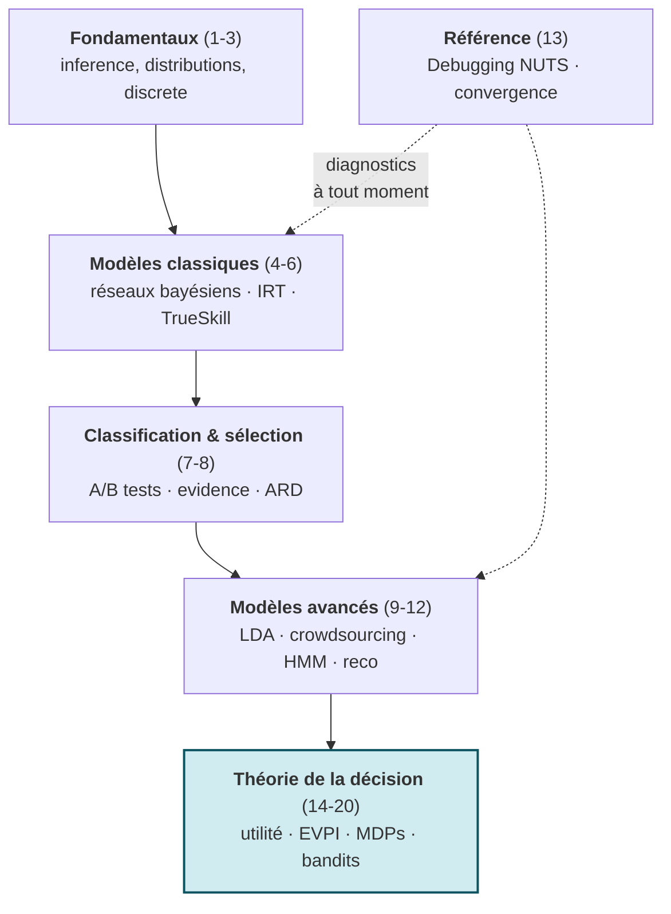

# Programmation Probabiliste avec PyMC

[← Série Probas](../README.md) | [Infer.NET (C#) →](../Infer/README.md)

Port Python de la série Infer.NET couvrant l'inference bayesienne avec PyMC (NUTS, echantillonnage MCMC), des fondamentaux aux modèles relationnels avances, incluant une section complète sur la théorie de la décision.

**A qui s'adresse cette série** : praticiens Python, data scientists et étudiants souhaitant maitriser l'inference bayesienne moderne avec l'ecosysteme PyMC/ArviZ. Aucun prérequis en C# ou Infer.NET : chaque notebook est autonome.

## Pourquoi cette série

PyMC est le framework d'inference bayesienne le plus utilise en Python pour la modelisation probabiliste appliquee. La ou scikit-learn fournit des predictions ponctuelles, PyMC produit des **distributions posterieures complètes** qui quantifient l'incertitude de chaque paramètre.

Cette série couvre les **même 20 modèles** que la série [Infer.NET](../Infer/) mais avec un moteur d'inference radicalement différent :

| Aspect | Infer.NET (C#) | PyMC (Python) |
|--------|----------------|---------------|
| **Moteur** | Message passing (EP/VMP) | Echantillonnage MCMC (NUTS) |
| **Résultats** | Deterministes, analytiques | Stochastiques, convergents |
| **Flexibilite** | Modèles conjugues | Presque tout modèle |
| **Diagnostics** | Factor graphs | ArviZ (trace, ESS, R-hat) |
| **Ecosysteme** | .NET | NumPy/Pandas/Matplotlib |

Avoir les deux approches sur les mêmes modèles permet de comprendre les **compromis** entre inference exacte et approchee, une compétence clé pour tout praticien.


Le **même** modèle probabiliste (à gauche) se résout par deux moteurs radicalement différents : l'échantillonnage MCMC de PyMC (stochastique, convergent, flexible) ou le message passing d'Infer.NET (déterministe, analytique, restreint aux conjugués). La série parcourt les 20 mêmes modèles des deux côtés pour rendre ce compromis **visible**.

## Objectifs d'apprentissage

A l'issue de cette série, vous serez capable de :

1. **Construire** un modèle probabiliste avec PyMC (definition du prior, vraisemblance, echantillonnage)
2. **Diagnostiquer** la convergence MCMC avec ArviZ (R-hat, ESS, trace plots, divergences)
3. **Comparer** message passing (Infer.NET) vs MCMC (PyMC) sur le même modèle
4. **Appliquer** l'inference bayesienne a des problèmes concrets (ranking, classification, recommandation)
5. **Integrer** inference probabiliste et théorie de la décision (EVPI, MDPs, bandits)

## Vue d'ensemble

| # | Notebook | Duree | Concepts |
|---|----------|-------|----------|
| 1 | [PyMC-1-Setup](PyMC-1-Setup.ipynb) | 15 min | Installation, premier modèle Beta-Bernoulli |
| 2 | [PyMC-2-Gaussian-Mixtures](PyMC-2-Gaussian-Mixtures.ipynb) | 50 min | Posterieurs, melanges, Dirichlet |
| 3 | [PyMC-3-Factor-Graphs](PyMC-3-Factor-Graphs.ipynb) | 45 min | Inference discrete, Monty Hall |
| 4 | [PyMC-4-Bayesian-Networks](PyMC-4-Bayesian-Networks.ipynb) | 55 min | CPT, D-separation, causalite |
| 5 | [PyMC-5-Skills-IRT](PyMC-5-Skills-IRT.ipynb) | 60 min | IRT, DINA, many-to-many |
| 6 | [PyMC-6-TrueSkill](PyMC-6-TrueSkill.ipynb) | 55 min | Ranking, online learning, equipes |
| 7 | [PyMC-7-Classification](PyMC-7-Classification.ipynb) | 50 min | Classification bayesienne, tests A/B |
| 8 | [PyMC-8-Model-Selection](PyMC-8-Model-Selection.ipynb) | 45 min | Evidence, Bayes factors, ARD |
| 9 | [PyMC-9-Topic-Models](PyMC-9-Topic-Models.ipynb) | 60 min | LDA, Dirichlet, documents-topics-mots |
| 10 | [PyMC-10-Crowdsourcing](PyMC-10-Crowdsourcing.ipynb) | 55 min | Workers, communautes, agregation de labels |
| 11 | [PyMC-11-Sequences](PyMC-11-Sequences.ipynb) | 65 min | HMM, séries temporelles, motifs |
| 12 | [PyMC-12-Recommenders](PyMC-12-Recommenders.ipynb) | 60 min | Factorisation de matrices, recommandation |
| 13 | [PyMC-13-Debugging](PyMC-13-Debugging.ipynb) | 45 min | Troubleshooting, diagnostics NUTS, convergence |
| 14 | [PyMC-14-Decision-Utility-Foundations](PyMC-14-Decision-Utility-Foundations.ipynb) | 50 min | Loteries, axiomes VNM, utilité esperee |
| 15 | [PyMC-15-Decision-Utility-Money](PyMC-15-Decision-Utility-Money.ipynb) | 45 min | Paradoxe St-Petersbourg, CARA, CRRA |
| 16 | [PyMC-16-Decision-Multi-Attribute](PyMC-16-Decision-Multi-Attribute.ipynb) | 50 min | MAUT, SMART, swing weights |
| 17 | [PyMC-17-Decision-Networks](PyMC-17-Decision-Networks.ipynb) | 55 min | Diagrammes d'influence, politique optimale |
| 18 | [PyMC-18-Decision-Value-Information](PyMC-18-Decision-Value-Information.ipynb) | 45 min | EVPI, EVSI, valeur de l'information |
| 19 | [PyMC-19-Decision-Expert-Systems](PyMC-19-Decision-Expert-Systems.ipynb) | 50 min | Systèmes experts, Minimax, regret |
| 20 | [PyMC-20-Decision-Sequential](PyMC-20-Decision-Sequential.ipynb) | 60 min | MDPs, bandits, POMDPs |

## Progression Pédagogique



Le socle d'inference (1-12) se suit en sequence ; le notebook **13 (Debugging)** est transversal — à consulter dès qu'une chaîne MCMC dysfonctionne, à n'importe quelle étape. La **théorie de la décision** (14-20, surlignée) forme un fil rouge autonome : elle peut se suivre seule si l'inference bayésienne est déjà acquise. Le détail notebook-par-notebook figure dans la [Vue d'ensemble](#vue-densemble) ci-dessus.

## Installation

```bash
# Environnement dedie (recommande)
conda create -n pymc-env python=3.12
conda activate pymc-env

# Dependances principales
pip install pymc arviz pandas numpy scipy matplotlib

# Verification
python -c "import pymc; print(f'PyMC {pymc.__version__}')"
```

### kernels Jupyter

```bash
python -m ipykernel install --user --name pymc-env --display-name "Python 3 (PyMC)"
jupyter kernelspec list  # doit afficher pymc-env
```

## Prérequis

- Python 3.10+ (3.12 recommande)
- Connaissance de base en probabilites et statistiques
- Familiarite avec Python et Jupyter notebooks
- Optionnel : avoir suivi la série [Infer.NET](../Infer/) pour la comparaison message passing vs MCMC

## Quel parcours choisir

### Parcours data scientist Python (~10h)

Notebooks 1-3 (fondations) puis 7-8 (classification/selection) puis 9-12 (modèles avances). Ce parcours couvre les modèles les plus utiles en pratique sans passer par la théorie de la décision.

1. [PyMC-1-Setup](PyMC-1-Setup.ipynb) -> premier modèle
2. [PyMC-2](PyMC-2-Gaussian-Mixtures.ipynb) + [PyMC-3](PyMC-3-Factor-Graphs.ipynb) -> distributions et inference
3. [PyMC-7](PyMC-7-Classification.ipynb) + [PyMC-8](PyMC-8-Model-Selection.ipynb) -> classification bayesienne
4. [PyMC-9](PyMC-9-Topic-Models.ipynb) -> [PyMC-12](PyMC-12-Recommenders.ipynb) -> modèles avances

### Parcours théorie de la décision (~7h)

Notebooks 14-20 en sequence. Ce parcours couvre l'utilité esperee, la valeur de l'information et les MDPs avec un moteur MCMC.

1. [PyMC-14](PyMC-14-Decision-Utility-Foundations.ipynb) -> axiomes VNM
2. [PyMC-15](PyMC-15-Decision-Utility-Money.ipynb) -> aversion au risque
3. [PyMC-17](PyMC-17-Decision-Networks.ipynb) -> réseaux de décision
4. [PyMC-18](PyMC-18-Decision-Value-Information.ipynb) -> [PyMC-20](PyMC-20-Decision-Sequential.ipynb) -> EVPI, MDPs

### Parcours comparatif Infer.NET vs PyMC (~15h)

Alterner chaque notebook PyMC avec son équivalent [Infer.NET](../Infer/).Comparer les implementations (message passing vs MCMC) sur les mêmes modèles pour comprendre les compromis.

### Parcours rapide (~2h)

[PyMC-1-Setup](PyMC-1-Setup.ipynb) + [PyMC-4-Bayesian-Networks](PyMC-4-Bayesian-Networks.ipynb) + [PyMC-7-Classification](PyMC-7-Classification.ipynb). Les trois notebooks les plus representatifs pour une première prise en main.

## FAQ / Troubleshooting

### `ModuleNotFoundError: pymc`

PyMC n'est pas present dans le kernel Jupyter actif. Installer les dependances puis verifier le kernel :

```bash
pip install pymc arviz
jupyter kernelspec list  # doit afficher pymc-env
```

### PyMC ne s'installe pas sur Windows (compilateur C manquant)

PyMC 5.x requiert un compilateur C pour les extensions natives. Solution :

```bash
# Option 1 : installer via conda (inclut le compilateur)
conda install -c conda-forge pymc

# Option 2 : installer les build tools Visual Studio
# Telecharger depuis https://visualstudio.microsoft.com/visual-cpp-build-tools/
# Cocher "Desktop development with C++"
```

### L'echantillonnage NUTS est très lent ou ne converge pas

- Verifier les priors : des priors trop larges causent des explorations inutiles
- Augmenter `target_accept` : `pm.sample(target_accept=0.95)` (defaut 0.8)
- Utiliser `init="advi"` pour une initialisation plus robuste
- Reduire `draws` et `tune` (ex. 500/500 au lieu de 1000/1000) si la compilation C (PyTensor) est disponible mais le temps de calcul reste prohibitif
- Consulter [PyMC-13-Debugging](PyMC-13-Debugging.ipynb) pour les diagnostics complets

### ArviZ affiche des divergences

Les divergences indiquent que l'echantillonneur n'a pas explore correctement certaines regions de l'espace posterieur. Actions :

1. `az.plot_trace(trace)` -> verifier le melange des chaînes
2. `az.summary(trace)` -> verifier que `r_hat < 1.05` et `ess_bulk > 400`
3. Reparametriser le modèle (centrage, log-transform ; parametrisation centered vs non-centered — voir [PyMC-2-Gaussian-Mixtures](PyMC-2-Gaussian-Mixtures.ipynb) et [PyMC-13-Debugging](PyMC-13-Debugging.ipynb))
4. Augmenter le nombre de tirages : `pm.sample(draws=4000, tune=2000)`

### Erreur "SamplingError: Initial evaluation of model failed"

Le prior et la vraisemblance sont incompatibles avec les données observes. Verifier :

- Les valeurs observes sont dans le support du prior (pas de valeurs negatives pour une distribution Gamma)
- Les dimensions correspondent (pas de shape mismatch)
- Les priors ne sont pas trop restrictifs

### Comment passer de Infer.NET a PyMC ?

La série suit le même ordre que [Infer.NET](../Infer/). Les concepts se correspondent :

| Concept Infer.NET | Équivalent PyMC |
|-------------------|-----------------|
| `Variable.Bernoulli(p)` | `pm.Bernoulli('x', p=p)` |
| `InferenceEngine` | `pm.sample()` |
| `Infer<DistributionType>` | `trace['x']` |
| `ShowFactorGraph` | `pm.model_to_graphviz()` |

## Concepts clés

- **Inference bayesienne** : Posterieurs, priors conjugues, MCMC
- **PyMC** : Modèles probabilistes, echantillonneur NUTS, ArviZ
- **Modèles graphiques** : Réseaux bayesiens, graphes de facteurs
- **Théorie de la décision** : Utilité esperee, valeur de l'information, MDPs

## Série complementaire

Ce port Python est le pendant de la série [Infer.NET](../Infer/) (C# / .NET Interactive) couvrant les mêmes sujets avec un moteur d'inference différent (message passing vs MCMC).

## Ressources

- [PyMC Documentation](https://www.pymc.io/projects/docs/en/stable/)
- [ArviZ Documentation](https://python.arviz.org/)
- [Bayesian Methods for Hackers](https://github.com/CamDavidsonPilon/Probabilistic-Programming-and-Bayesian-Methods-for-Hackers)
- [Statistical Rethinking (McElreath)](https://xcelab.net/rm/statistical-rethinking/) — livre de référence pour l'inference bayesienne appliquee

## Ponts inter-séries

| Série | Lien | Relation |
|-------|------|----------|
| [Infer.NET](../Infer/) | Même 20 modèles en C# / message passing | Comparaison MCMC vs inference exacte |
| [Probas (parent)](../README.md) | Vue d'ensemble Probas | Contexte et parcours |
| [ML](../../ML/) | Pipeline ML classique | PyMC comme alternative bayesienne |
| [QuantConnect](../../QuantConnect/) | Strategies de trading | Modèles bayesiens appliques au trading |

## Conclusion / Prochaines étapes

### Ce que vous avez appris

Cette série vous a fait passer des **fondamentaux de l'inference bayesienne** (priors, posterieurs, echantillonnage NUTS avec [PyMC-1-Setup](PyMC-1-Setup.ipynb) à [PyMC-3-Factor-Graphs](PyMC-3-Factor-Graphs.ipynb)) à des **modèles relationnels avances** (reseaux bayesiens, IRT, TrueSkill, LDA, HMM, recommandation — notebooks 4 à 12), en suivant le même chemin que la série [Infer.NET](../Infer/) mais avec un **moteur d'inference radicalement différent**. Trois acquis cles :

- **Lire et diagnostiquer une chaine MCMC** — `pm.sample()` ne suffit pas ; ArviZ (`r_hat < 1.05`, `ess_bulk > 400`, trace plots, divergences) est devenu votre reflexe systematique, et [PyMC-13-Debugging](PyMC-13-Debugging.ipynb) votre reference pour les pannes de convergence.
- **Choisir le bon moteur selon le modèle** — vous savez desormais **quand** MCMC (PyMC, presque tout modèle, stochastique) est preferable au **message passing** (Infer.NET, conjugue, deterministe), et inversement. Ce compromis exact/approche est une competence de praticien.
- **Relier inference et décision** — les notebooks 14 à 20 (utilité esperee, EVPI/EVSI, MDPs, bandits) ferment la boucle : un posterior n'est pas une fin, c'est l'**input** d'une politique de décision optimale sous incertitude.

### Prochaines étapes

- **Approfondir la théorie de la décision** — [Infer-16-Decision-Multi-Attribute](../Infer/Infer-16-Decision-Multi-Attribute.ipynb) et [Infer-20-Decision-Sequential](../Infer/Infer-20-Decision-Sequential.ipynb) reprennent ces modèles en message passing pour comparer les deux moteurs sur les mêmes problèmes.
- **Aller plus loin en inference bayesienne** — *Statistical Rethinking* (McElreath, cite en Ressources) est le prolongement natural de cette série pour les modèles hiérarchiques et la reflexion epistemologique sur les priors.
- **Appliquer au trading et au ML** — les ponts vers [QuantConnect](../../QuantConnect/) et [ML](../../ML/) ouvrent la mise en production : modèles bayesiens de stratégie, regression logistique bayesienne, incertitude calibrée en prediction.

### Le fil rouge

Le fil rouge de cette série est le **double regard** sur les 20 mêmes modèles : PyMC (MCMC, Python) vs Infer.NET (message passing, C#). Chaque notebook jumeau vous donne non pas une implementation de plus, mais la **comparaison directe** des deux paradigmes d'inference — le determinisme analytique d'un côté, la flexibilite stochastique de l'autre. Maitriser ce compromis, c'est savoir choisir l'outil qui correspond à la structure du modèle et au besoin en incertitude, plutot que d'appliquer un moteur par defaut.
