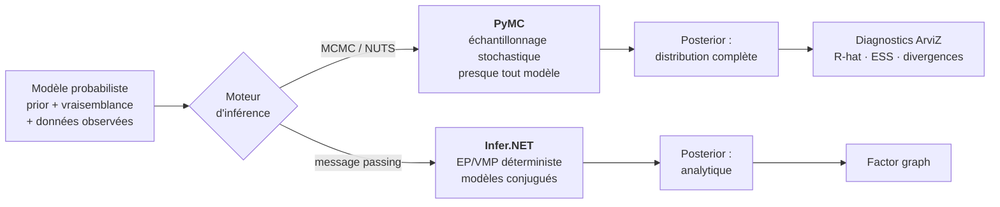
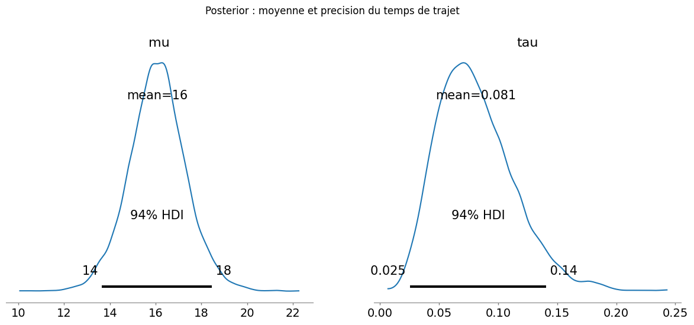
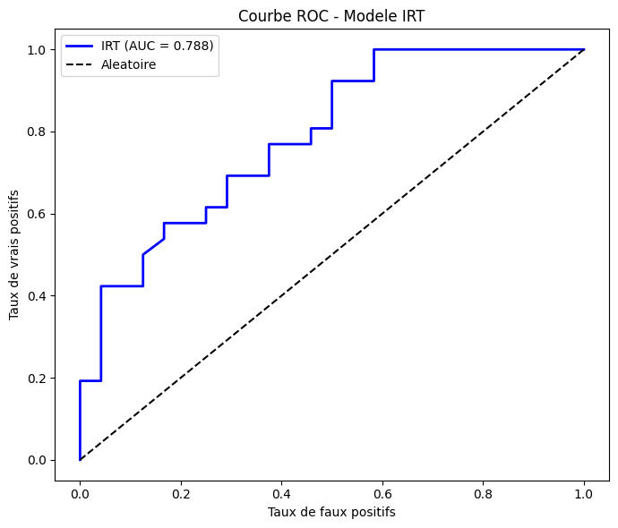
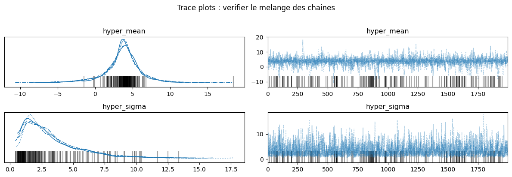
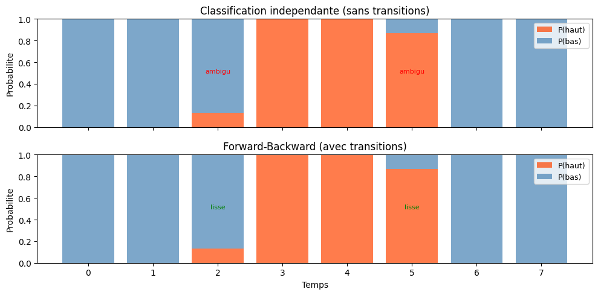
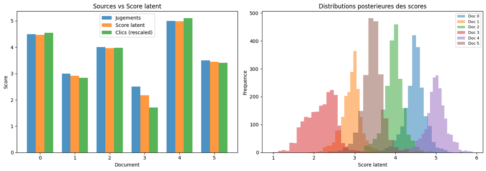
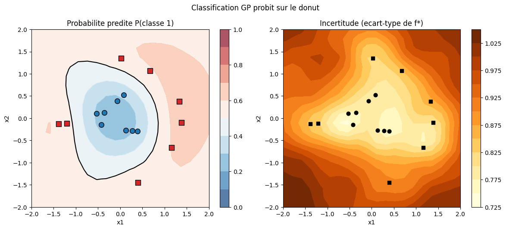

# Programmation Probabiliste avec PyMC

[← Série Probas](../README.md) | [Infer.NET (C#) →](../Infer/README.md)

Série parallèle à la piste Infer.NET (C#/.NET), couvrant les **mêmes modèles bayésiens** avec un moteur différent : **PyMC** (échantillonnage MCMC NUTS) au lieu du message passing compilé Infer.NET. Le corpus va des fondamentaux aux modèles relationnels avancés, en clôture sur l'**inférence causale** (do-calculus de Pearl, opérateur `pm.do`). La **théorie de la décision** (utilité espérée, EVPI, MDPs, bandits) forme une sous-série autonome dans [DecisionTheory/PyMC/](../DecisionTheory/PyMC/README.md), miroir Python de [DecisionTheory/DecInfer/](../DecisionTheory/DecInfer/README.md).

**À qui s'adresse cette série** : praticiens Python, data scientists et étudiants souhaitant maîtriser l'inférence bayésienne moderne avec l'écosystème PyMC/ArviZ. Aucun prérequis en C# ou Infer.NET : chaque notebook est autonome.

## Pourquoi cette série

PyMC est le framework d'inférence bayésienne le plus utilisé en Python pour la modélisation probabiliste appliquée. Là où scikit-learn fournit des prédictions ponctuelles, PyMC produit des **distributions postérieures complètes** qui quantifient l'incertitude de chaque paramètre.

Cette série couvre les **mêmes modèles** que la série [Infer.NET](../Infer/) (des fondamentaux à l'inférence causale) mais avec un moteur d'inférence radicalement différent :

| Aspect | Infer.NET (C#) | PyMC (Python) |
|--------|----------------|---------------|
| **Moteur** | Message passing : EP (défaut), VMP, Gibbs | Échantillonnage : NUTS (défaut), ADVI |
| **Posterior (défaut)** | Analytique, déterministe (EP/VMP) | Échantillons MCMC, convergents (NUTS) |
| **Point fort** | Modèles conjugués et structurés | Presque tout modèle continu |
| **Diagnostics** | Factor graphs | ArviZ (trace, ESS, R-hat) |
| **Écosystème** | .NET | NumPy/Pandas/Matplotlib |

Aucune des deux librairies n'est purement déterministe ou purement stochastique — Infer.NET propose aussi un échantillonneur de **Gibbs**, PyMC une inférence variationnelle (**ADVI**) — mais leur moteur *par défaut* incarne deux familles d'algorithmes : le message passing sur graphe de facteurs (Infer.NET/EP) et l'échantillonnage MCMC (PyMC/NUTS). Avoir les deux sur les mêmes modèles permet de comprendre ce **compromis**, une compétence clé pour tout praticien.



Le **même** modèle probabiliste (à gauche) se résout par deux moteurs *par défaut* radicalement différents : l'échantillonnage MCMC de PyMC (NUTS, piloté par gradient, flexible sur les modèles continus) ou le message passing d'Infer.NET (EP, rapide sur les modèles conjugués et structurés ; VMP et Gibbs prennent le relais au-delà). La série parcourt les mêmes modèles d'inférence bayésienne et causale des deux côtés pour rendre ce compromis **visible**.

## Quand le MCMC devient nécessaire : modèles hiérarchiques et partial pooling

Un modèle conjugué simple (Beta-Bernoulli, Normal-Normal) admet une **postérieure analytique** : le MCMC est alors redondant — un `numpy.random` bien placé reproduit la même distribution, et des diagnostics parfaits (R-hat ≈ 1.000, ESS ≈ 8000) ne prouvent rien d'autre que la facilité du problème. La valeur distinctive de PyMC n'apparaît que sur des modèles **sans solution analytique**, là où le couple (prior, vraisemblance observée) définit une postérieure jointe que seul l'échantillonnage peut explorer.

Le cas paradigmatique est le **modèle hiérarchique à effets aléatoires** : plusieurs groupes (sites, pièces, patients, workers) partagent une moyenne de population et une dispersion, et chaque groupe « emprunte » de l'information aux autres. C'est le **partial pooling**. Sa signature visible est le **shrinkage** — les groupes sous-échantillonnés sont tirés vers la moyenne de population plutôt qu'estimés isolément à zéro, un comportement qu'aucune mise à jour conjuguée indépendante ne reproduit.

La série illustre ce fil rouge sur plusieurs notebooks, chacun sur un cas non-conjugué distinct :

- [PyMC-1-Setup](PyMC-1-Setup.ipynb) — introduction : du Beta-Bernoulli conjugué (où MCMC = prior) à un modèle hiérarchique non-centré sur plusieurs pièces, où le shrinkage devient visible.
- [PyMC-14-Sequences](PyMC-14-Sequences.ipynb) — HMM à états cachés : la vraisemblance de mélange (`NormalMixture`) marginalise l'assignation discrète pour garder un NUTS pur sur les paramètres continus.
- [PyMC-1-Utility-Foundations](../DecisionTheory/PyMC/DecPyMC-1-Utility-Foundations.ipynb) — diagnostic multi-sites : un portefeuille de groupes hétérogènes où le partial pooling régularise les estimations à faible effectif.
- [PyMC-4-Decision-Networks](../DecisionTheory/PyMC/DecPyMC-4-Decision-Networks.ipynb) — états latents : prévalence réelle d'un phénomène observé via un test imparfait (inversion d'état caché, non-conjuguée).
- [PyMC-6-Expert-Systems](../DecisionTheory/PyMC/DecPyMC-6-Expert-Systems.ipynb) — recette de référence : paramétrisation **non-centrée** (offsets de Neal) qui évite le funnel et stabilise la convergence.
- [PyMC-12-Modeles-Hierarchiques](PyMC-12-Modeles-Hierarchiques.ipynb) — traitement dédié : partial pooling bayésien sur 8 classes, shrinkage visible (les classes clairsemées se rétractent vers `mu`), comparaison centered vs non-centered et divergence NUTS comme diagnostic géométrique du funnel.

> **Leçon technique récurrente** : sur ces modèles, la **paramétrisation non-centrée** `θ = μ + σ · z` (avec `z ~ Normal(0,1)`) est souvent indispensable. Elle découple l'estimation de la moyenne de celle de la dispersion et évite le *funnel de Neal* — une pathologie géométrique qui piège l'échantillonneur quand la dispersion inter-groupes est faible. Le réflexe naïf « augmenter `target_accept` » **aggrave** alors les divergences ; c'est la reparamétrisation, pas la tolérance, qui débloque la convergence. Voir [PyMC-6-Debugging](PyMC-6-Debugging.ipynb) pour les diagnostics associés.

## Objectifs d'apprentissage

À l'issue de cette série, vous serez capable de :

1. **Construire** un modèle probabiliste avec PyMC (définition du prior, vraisemblance, échantillonnage)
2. **Diagnostiquer** la convergence MCMC avec ArviZ (R-hat, ESS, trace plots, divergences)
3. **Comparer** message passing (Infer.NET) vs MCMC (PyMC) sur le même modèle
4. **Appliquer** l'inférence bayésienne à des problèmes concrets (ranking, classification, recommandation)
5. **Intégrer** inférence probabiliste et théorie de la décision (EVPI, MDPs, bandits)

## Aperçu — l'inférence bayésienne en images

PyMC ne produit pas une prédiction ponctuelle mais une **distribution postérieure complète**. Les six visualisations ci-dessous, extraites des notebooks de la série, illustrent cette différence : chaque estimateur vient avec son incertitude quantifiée. Sorties d'exécution **réelles** (non régénérées pour l'illustration, règle C.3), downscalées à ≤1200 px et ≤200 ko (politique EPIC #5654). Provenance exacte dans [`assets/readme/MANIFEST.md`](assets/readme/MANIFEST.md).

### Postérieurs d'un modèle Normal simple sur les temps de trajet

Le notebook [PyMC-2 — Gaussian Mixtures](PyMC-2-Gaussian-Mixtures.ipynb) introduit l'inférence bayésienne sur un modèle Normal simple. Deux postérieures ArviZ (densité KDE + barre HDI à 94 %) pour les paramètres μ (moyenne) et τ (précision) du modèle : μ ≈ 16 avec HDI [14, 18], τ ≈ 0.081 avec HDI [0.025, 0.14]. La cellule précise (cell[4] output 6) montre ce que le MCMC produit sur un problème jouet de temps de trajet — le vrai mélange de gaussiennes vit dans une cellule ultérieure du même notebook (cell[16] `sigma_components`), ce qui justifie la migration de ce modèle vers un notebook ultérieur de la série.



### Évaluation d'un modèle IRT par courbe ROC

Le notebook [PyMC-7 — IRT](PyMC-7-Skills-IRT.ipynb) construit un modèle de réponse aux items (compétence latente, difficulté, discrimination). L'évaluation binaire « item réussi / échoué » sur l'ensemble de test se visualise par une **courbe ROC** (Receiver Operating Characteristic) : l'AUC (aire sous la courbe) vaut 0.788, soit une discrimination modérée au-dessus du hasard (diagonale pointillée). Cette figure illustre la distinction entre l'objet IRT canonique (courbes ICC, probabilité de bonne réponse vs compétence) et son **évaluation** supervisée (classification binaire des items).



### Diagnostic du mélange des chaînes MCMC

Le notebook [PyMC-6 — Debugging](PyMC-6-Debugging.ipynb) traite les pannes de convergence. Sur un modèle hiérarchique 8-pièces (paramétrisation non-centrée), les trace plots des hyperparamètres `hyper_mean` et `hyper_sigma` montrent que les 4 chaînes MCMC se mélangent correctement : la densité postérieure (KDE à gauche) est unimodale et régulière, la trace (à droite) oscille sans drift visible. Ce diagnostic **purement visuel** (KDE + trace) est le premier réflexe avant d'inspecter R-hat et ESS — il détecte en un coup d'œil les chaînes figées ou les divergences.



### HMM Forward-Backward vs classification i.i.d.

Le notebook [PyMC-14 — Séquences](PyMC-14-Sequences.ipynb) introduit les modèles de Markov cachés sur des séquences temporelles. La vraisemblance de mélange (`NormalMixture` à deux états) marginalise l'assignation discrète pour conserver un NUTS pur sur les paramètres continus. Le comparatif visualise les probabilités postérieures d'état haut/bas sur 8 pas de temps : sans transitions (classification i.i.d.), les états ambigus (temps 2 et 5) sont tranchés à 50/50 de façon abrupte ; avec transitions (Forward-Backward), les mêmes instants sont **lissés** par la matrice de transition — l'incertitude est propagée d'un pas à l'autre, signature visible du bénéfice du HMM.



### Facteurs latents bayésiens en recommandation

Le notebook [PyMC-15 — Recommenders](PyMC-15-Recommenders.ipynb) aborde la recommandation par factorisation de matrices en formulation bayésienne : pour chaque document (0 à 5), un score latent est inféré à partir de trois sources observées (jugements explicites, score latent estimé, clics remis à l'échelle). Le panneau de gauche compare ces trois sources par document ; celui de droite montre les **distributions postérieures** des scores latents par document (6 histogrammes ArviZ distincts), illustrant l'incertitude différentielle : un document peu observé (Doc 3) a une postérieure plus large qu'un document bien noté (Doc 4).



### Classification par Processus Gaussien (illustration dense jouet)

Le notebook [PyMC-16 — Sparse Gaussian Process](PyMC-16-Sparse-Gaussian-Process.ipynb) introduit les Processus Gaussiens (prior sur fonctions, noyau RBF, classification probit). La cellule précise illustrée ici est un **pré-requis** : un GP classification 2D dense classique sur un problème jouet en « donut » (classe 0 au centre, classe 1 en couronne). Le panneau de gauche montre la probabilité prédite de la classe 1 (colormap bleu→rouge, frontière de décision en noir) ; celui de droite visualise l'incertitude (écart-type de f*, colormap jaune→orange, valeurs 0.725 à 1.025). Les inducing points du sparse GP proprement dit sont introduits dans les cellules ultérieures du notebook — cette cellule est l'illustration dense servant de référence comparative.



### Note d'audit (c.483 + c.532)

**Audit vision G.1 firsthand** des 6 PNG (lecture directe via `Read` tool, doctrine #5780 amendée 2026-07-09) : **3 figures ACCURATE sans correction** (pymc11, pymc12, pymc13) et **3 corrections réelles** (pymc2, pymc5, pymc15) déjà appliquées dans les alt-text ci-dessus. Détail dans [`MANIFEST.md`](assets/readme/MANIFEST.md).

- `pymc2-gaussian-mixtures.png` — l'alt-text v1 parlait de « mélange de gaussiennes » mais la cellule précise illustre le modèle Normal simple sur les temps de trajet (postérieures μ et τ) ; le vrai mélange de gaussiennes vit dans une cellule ultérieure du notebook (cell[16] `sigma_components`). Alt-text corrigé pour décrire le contenu réel de la cellule.
- `pymc5-irt-curves.png` — l'alt-text v1 parlait de « courbes de réponse aux items » mais la figure montre une **courbe ROC** d'évaluation IRT (AUC=0.788), pas les courbes ICC du modèle. Alt-text corrigé.
- `pymc15-sparse-gp.png` — l'alt-text v1 mentionnait « inducteurs réduisant le coût » mais la cellule précise illustre un **GP classification 2D dense classique** sur un problème jouet en donut, sans inducing points. Alt-text corrigé.

**Migration c.532 (doctrine #5780 amendée 2026-07-09)** : les 6 figures passent du bloc-mosaïque `<table>` 2×3 en tête (galerie d'images sans prose pédagogique) à une **intégration narrative** : une figure par sous-section, chacune placée dans le contexte de son notebook source et accompagnée d'une prose qui explique ce que la figure MONTRE et ce qu'elle n'illustre PAS. Le format mosaïque est abandonné au profit d'une lecture linéaire en six actes qui suit la progression pédagogique de la série (modèles simples → évaluation → diagnostic → séquences → recommandation → GP).

Ces corrections sont **éditoriales** (prose, pas de modification des figures sur disque — règle assets du projet : pas de DROP ni régénération). `MANIFEST.md` reste au format standard (sections *Contenu réel vérifié* + *Ce qui n'est PAS dans la figure*).

## Vue d'ensemble

| # | Notebook | Durée | Concepts |
|---|----------|-------|----------|
| 1 | [PyMC-1-Setup](PyMC-1-Setup.ipynb) | 15 min | Installation, Beta-Bernoulli, modèle hiérarchique non-centré |
| 2 | [PyMC-2-Gaussian-Mixtures](PyMC-2-Gaussian-Mixtures.ipynb) | 50 min | Postérieurs, mélanges, Dirichlet |
| 3 | [PyMC-3-Factor-Graphs](PyMC-3-Factor-Graphs.ipynb) | 45 min | Inférence discrète, Monty Hall |
| 4 | [PyMC-4-Bayesian-Networks](PyMC-4-Bayesian-Networks.ipynb) | 55 min | CPT, D-separation, causalité |
| 5 | [PyMC-7-Skills-IRT](PyMC-7-Skills-IRT.ipynb) | 60 min | IRT, DINA, many-to-many |
| 6 | [PyMC-8-TrueSkill](PyMC-8-TrueSkill.ipynb) | 55 min | Ranking, online learning, équipes |
| 7 | [PyMC-9-Classification](PyMC-9-Classification.ipynb) | 50 min | Classification bayésienne, tests A/B |
| 8 | [PyMC-10-Model-Selection](PyMC-10-Model-Selection.ipynb) | 45 min | Evidence, Bayes factors, ARD |
| 9 | [PyMC-11-Topic-Models](PyMC-11-Topic-Models.ipynb) | 60 min | LDA, Dirichlet, documents-topics-mots |
| 10 | [PyMC-13-Crowdsourcing](PyMC-13-Crowdsourcing.ipynb) | 55 min | Workers, communautés, agrégation de labels |
| 11 | [PyMC-14-Sequences](PyMC-14-Sequences.ipynb) | 65 min | HMM, mélange `NormalMixture`, séries temporelles |
| 12 | [PyMC-15-Recommenders](PyMC-15-Recommenders.ipynb) | 60 min | Factorisation de matrices, recommandation |
| 13 | [PyMC-6-Debugging](PyMC-6-Debugging.ipynb) | 45 min | Troubleshooting, diagnostics NUTS, convergence |
| 14 | [PyMC-5-Causal-Inference](PyMC-5-Causal-Inference.ipynb) | 65 min | do-calculus de Pearl, `pm.do`, backdoor/front-door, paradoxe de Simpson, contrefactuel |
| 15 | [PyMC-16-Sparse-Gaussian-Process](PyMC-16-Sparse-Gaussian-Process.ipynb) | 55 min | Processus gaussiens (prior sur fonctions), noyau RBF, classification GP probit, frontière non linéaire, length-scale apprise |
| 16 | [PyMC-12-Modeles-Hierarchiques](PyMC-12-Modeles-Hierarchiques.ipynb) | 50 min | Partial pooling, shrinkage, paramétrisation non-centrée, divergences/funnel |
| 17 | [PyMC-17-Kalman-Filter](PyMC-17-Kalman-Filter.ipynb) | 55 min | Système dynamique linéaire gaussien, récursion de filtrage fermée, value-add MCMC (estimation Q/R/drift) |
| 18 | [PyMC-18-Change-Point](PyMC-18-Change-Point.ipynb) | 50 min | Change-point bayésien, `DiscreteUniform` + `switch`, catastrophes minières (Poisson), entropie |
| 19 | [PyMC-19-Survival-Analysis](PyMC-19-Survival-Analysis.ipynb) | 50 min | Analyse de survie, exponentiel conjugué (Gamma), Weibull `k` inféré directement (NUTS), sélection LOO (arviZ) |

> **Théorie de la décision** : les notebooks décisionnels (utilité espérée, EVPI, MDPs, bandits) forment désormais une sous-série autonome dans [DecisionTheory/PyMC/](../DecisionTheory/PyMC/README.md) (1 à 7), miroir Python de [DecisionTheory/Infer/](../DecisionTheory/DecInfer/README.md).

> **Numérotation** : la série PyMC est **numérotée 1:1** avec son jumeau C# Infer (PyMC-5 ↔ Infer-5 = inférence causale, PyMC-14 ↔ Infer-14 = séquences, etc.) pour faciliter la comparaison des deux moteurs sur les mêmes modèles. Le sujet de [Infer-10-Thompson-Sampling](../DecisionTheory/DecInfer/DecInfer-10-Thompson-Sampling.ipynb) est, côté Python, **intégré dans** [PyMC-7-Sequential](../DecisionTheory/PyMC/DecPyMC-7-Sequential.ipynb) (section bandits bayésiens MCMC) — d'où l'absence d'un PyMC-21 distinct.

> **Ponts causaux** : [PyMC-5](PyMC-5-Causal-Inference.ipynb) est le maillon **MCMC** d'un pont à quatre paradigmes autour du `do(·)` de Pearl — le jumeau **message passing** en C# [Infer-5](../Infer/Infer-5-Causal-Inference.ipynb) (Infer.NET, EP/VMP), le jumeau symbolique [Tweety-11-Causal](../../SymbolicAI/Tweety/Tweety-11-Causal.ipynb), et la lecture par l'émergence causale [ICT-5](../../IIT/ICT-Series/ICT-5-CausalEmergence.ipynb). Vue d'ensemble : le [README IIT](../../IIT/README.md), section « Ponts causaux : le do-calculus de Pearl à travers les paradigmes ».

## Progression Pédagogique


Le socle d'inférence (1-12) se suit en séquence ; le notebook **13 (Debugging)** est transversal — à consulter dès qu'une chaîne MCMC dysfonctionne, à n'importe quelle étape. La **théorie de la décision** (utilité espérée, EVPI, MDPs, bandits) forme désormais un fil rouge autonome dans la sous-série [DecisionTheory/PyMC/](../DecisionTheory/PyMC/README.md) (1 à 7) : elle peut se suivre seule si l'inférence bayésienne est déjà acquise. Le détail notebook-par-notebook figure dans la [Vue d'ensemble](#vue-densemble) ci-dessus.

## Installation

```bash
# Environnement dédié (recommandé)
conda create -n pymc-env python=3.12
conda activate pymc-env

# Dépendances principales
pip install pymc arviz pandas numpy scipy matplotlib

# Vérification
python -c "import pymc; print(f'PyMC {pymc.__version__}')"
```

### kernels Jupyter

```bash
python -m ipykernel install --user --name pymc-env --display-name "Python 3 (PyMC)"
jupyter kernelspec list  # doit afficher pymc-env
```

## Prérequis

- Python 3.10+ (3.12 recommandé)
- Connaissance de base en probabilités et statistiques
- Familiarité avec Python et Jupyter notebooks
- Optionnel : avoir suivi la série [Infer.NET](../Infer/) pour la comparaison message passing vs MCMC

## Quel parcours choisir

### Parcours data scientist Python (~10h)

Notebooks 1-3 (fondations) puis 7-8 (classification/sélection) puis 9-12 (modèles avancés). Ce parcours couvre les modèles les plus utiles en pratique sans passer par la théorie de la décision.

1. [PyMC-1-Setup](PyMC-1-Setup.ipynb) -> premier modèle
2. [PyMC-2](PyMC-2-Gaussian-Mixtures.ipynb) + [PyMC-3](PyMC-3-Factor-Graphs.ipynb) -> distributions et inférence
3. [PyMC-9](PyMC-9-Classification.ipynb) + [PyMC-10](PyMC-10-Model-Selection.ipynb) -> classification bayésienne
4. [PyMC-11](PyMC-11-Topic-Models.ipynb) -> [PyMC-15](PyMC-15-Recommenders.ipynb) -> modèles avancés

### Parcours théorie de la décision (~7h)

Ce parcours couvre l'utilité espérée, la valeur de l'information et les MDPs avec un moteur MCMC. Il se suit dans la sous-série [DecisionTheory/PyMC/](../DecisionTheory/PyMC/README.md) (notebooks 1 à 7).

1. [PyMC-1](../DecisionTheory/PyMC/DecPyMC-1-Utility-Foundations.ipynb) -> axiomes VNM
2. [PyMC-2](../DecisionTheory/PyMC/DecPyMC-2-Utility-Money.ipynb) -> aversion au risque
3. [PyMC-4](../DecisionTheory/PyMC/DecPyMC-4-Decision-Networks.ipynb) -> réseaux de décision
4. [PyMC-5](../DecisionTheory/PyMC/DecPyMC-5-Value-Information.ipynb) -> [PyMC-7](../DecisionTheory/PyMC/DecPyMC-7-Sequential.ipynb) -> EVPI, MDPs

### Parcours comparatif Infer.NET vs PyMC (~15h)

Alterner chaque notebook PyMC avec son équivalent [Infer.NET](../Infer/). Comparer les implémentations (message passing vs MCMC) sur les mêmes modèles pour comprendre les compromis.

### Parcours rapide (~2h)

[PyMC-1-Setup](PyMC-1-Setup.ipynb) + [PyMC-4-Bayesian-Networks](PyMC-4-Bayesian-Networks.ipynb) + [PyMC-9-Classification](PyMC-9-Classification.ipynb). Les trois notebooks les plus représentatifs pour une première prise en main.

## FAQ / Troubleshooting

### `ModuleNotFoundError: pymc`

PyMC n'est pas présent dans le kernel Jupyter actif. Installer les dépendances puis vérifier le kernel :

```bash
pip install pymc arviz
jupyter kernelspec list  # doit afficher pymc-env
```

### PyMC ne s'installe pas sur Windows (compilateur C manquant)

PyMC 5.x requiert un compilateur C pour les extensions natives. Solution :

```bash
# Option 1 : installer via conda (inclut le compilateur)
conda install -c conda-forge pymc

# Option 2 : installer les build tools Visual Studio
# Télécharger depuis https://visualstudio.microsoft.com/visual-cpp-build-tools/
# Cocher "Desktop development with C++"
```

### L'échantillonnage NUTS est très lent ou ne converge pas

- Vérifier les priors : des priors trop larges causent des explorations inutiles
- Augmenter `target_accept` : `pm.sample(target_accept=0.95)` (défaut 0.8)
- Utiliser `init="advi"` pour une initialisation plus robuste
- Réduire `draws` et `tune` (ex. 500/500 au lieu de 1000/1000) si la compilation C (PyTensor) est disponible mais le temps de calcul reste prohibitif
- Consulter [PyMC-6-Debugging](PyMC-6-Debugging.ipynb) pour les diagnostics complets

### ArviZ affiche des divergences

Les divergences indiquent que l'échantillonneur n'a pas exploré correctement certaines régions de l'espace postérieur. Actions :

1. `az.plot_trace(trace)` -> vérifier le mélange des chaînes
2. `az.summary(trace)` -> vérifier que `r_hat < 1.05` et `ess_bulk > 400`
3. Reparamétriser le modèle (centrage, log-transform ; paramétrisation centered vs non-centered — voir [PyMC-2-Gaussian-Mixtures](PyMC-2-Gaussian-Mixtures.ipynb) et [PyMC-6-Debugging](PyMC-6-Debugging.ipynb))
4. Augmenter le nombre de tirages : `pm.sample(draws=4000, tune=2000)`

### Erreur "SamplingError: Initial evaluation of model failed"

Le prior et la vraisemblance sont incompatibles avec les données observées. Vérifier :

- Les valeurs observées sont dans le support du prior (pas de valeurs négatives pour une distribution Gamma)
- Les dimensions correspondent (pas de shape mismatch)
- Les priors ne sont pas trop restrictifs

### Comment passer de Infer.NET à PyMC ?

La série suit le même ordre que [Infer.NET](../Infer/). Les concepts se correspondent :

| Concept Infer.NET | Équivalent PyMC |
|-------------------|-----------------|
| `Variable.Bernoulli(p)` | `pm.Bernoulli('x', p=p)` |
| `InferenceEngine` | `pm.sample()` |
| `Infer<DistributionType>` | `trace['x']` |
| `ShowFactorGraph` | `pm.model_to_graphviz()` |

## Concepts clés

- **Inférence bayésienne** : Postérieurs, priors conjugués, MCMC
- **PyMC** : Modèles probabilistes, échantillonneur NUTS, ArviZ
- **Modèles graphiques** : Réseaux bayésiens, graphes de facteurs
- **Théorie de la décision** : Utilité espérée, valeur de l'information, MDPs

## Série complémentaire

Ce port Python est le pendant de la série [Infer.NET](../Infer/) (C# / .NET Interactive) couvrant les mêmes sujets avec un moteur d'inférence différent (message passing vs MCMC).

## Ressources

- [PyMC Documentation](https://www.pymc.io/projects/docs/en/stable/)
- [ArviZ Documentation](https://python.arviz.org/)
- [Bayesian Methods for Hackers](https://github.com/CamDavidsonPilon/Probabilistic-Programming-and-Bayesian-Methods-for-Hackers)
- [Statistical Rethinking (McElreath)](https://xcelab.net/rm/statistical-rethinking/) — livre de référence pour l'inférence bayésienne appliquée

## Ponts inter-séries

| Série | Lien | Relation |
|-------|------|----------|
| [Infer.NET](../Infer/) | Mêmes modèles en C# / message passing | MCMC (NUTS) vs message passing (EP) |
| [Probas (parent)](../README.md) | Vue d'ensemble Probas | Contexte et parcours |
| [ML](../../ML/) | Pipeline ML classique | PyMC comme alternative bayésienne |
| [QuantConnect](../../QuantConnect/) | Stratégies de trading | Modèles bayésiens appliqués au trading |

## Conclusion / Prochaines étapes

### Ce que vous avez appris

Cette série vous a fait passer des **fondamentaux de l'inférence bayésienne** (priors, postérieurs, échantillonnage NUTS avec [PyMC-1-Setup](PyMC-1-Setup.ipynb) à [PyMC-3-Factor-Graphs](PyMC-3-Factor-Graphs.ipynb)) à des **modèles relationnels avancés** (réseaux bayésiens, IRT, TrueSkill, LDA, HMM, recommandation — notebooks 4 à 12), en suivant le même chemin que la série [Infer.NET](../Infer/) mais avec un **moteur d'inférence radicalement différent**. Trois acquis clés :

- **Lire et diagnostiquer une chaîne MCMC** — `pm.sample()` ne suffit pas ; ArviZ (`r_hat < 1.05`, `ess_bulk > 400`, trace plots, divergences) est devenu votre réflexe systématique, et [PyMC-6-Debugging](PyMC-6-Debugging.ipynb) votre référence pour les pannes de convergence.
- **Choisir le bon moteur selon le modèle** — vous savez désormais **quand** l'échantillonnage MCMC (PyMC/NUTS, piloté par gradient, flexible sur presque tout modèle continu) est préférable au **message passing** sur graphe de facteurs (Infer.NET/EP, rapide sur les modèles conjugués et structurés), et inversement. Arbitrer entre ces deux familles d'algorithmes est une compétence de praticien.
- **Relier inférence et décision** — la sous-série [DecisionTheory/PyMC/](../DecisionTheory/PyMC/README.md) (notebooks 1 à 7 : utilité espérée, EVPI/EVSI, MDPs, bandits) ferme la boucle : un posterior n'est pas une fin, c'est l'**input** d'une politique de décision optimale sous incertitude.

### Prochaines étapes

- **Approfondir la théorie de la décision** — [Infer-4-Multi-Attribute](../DecisionTheory/DecInfer/DecInfer-4-Multi-Attribute.ipynb) et [Infer-8-Sequential](../DecisionTheory/DecInfer/DecInfer-8-Sequential.ipynb) reprennent ces modèles en message passing pour comparer les deux moteurs sur les mêmes problèmes.
- **Aller plus loin en inférence bayésienne** — *Statistical Rethinking* (McElreath, cité en Ressources) est le prolongement naturel de cette série pour les modèles hiérarchiques et la réflexion épistémologique sur les priors.
- **Appliquer au trading et au ML** — les ponts vers [QuantConnect](../../QuantConnect/) et [ML](../../ML/) ouvrent la mise en production : modèles bayésiens de stratégie, régression logistique bayésienne, incertitude calibrée en prédiction.

### Le fil rouge

Le fil rouge de cette série est le **double regard** sur les mêmes modèles d'inférence bayésienne et causale : PyMC (MCMC/NUTS, Python) vs Infer.NET (message passing, C#). Chaque notebook jumeau vous donne non pas une implémentation de plus, mais la **comparaison directe** des deux paradigmes d'inférence — le message passing compilé sur graphe de facteurs d'un côté, l'échantillonnage MCMC piloté par gradient de l'autre. Maîtriser ce compromis, c'est savoir choisir l'outil qui correspond à la structure du modèle et au besoin en incertitude, plutôt que d'appliquer un moteur par défaut.
