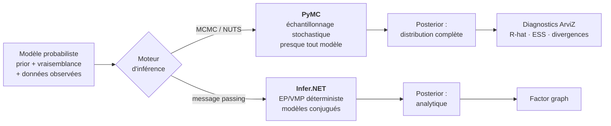
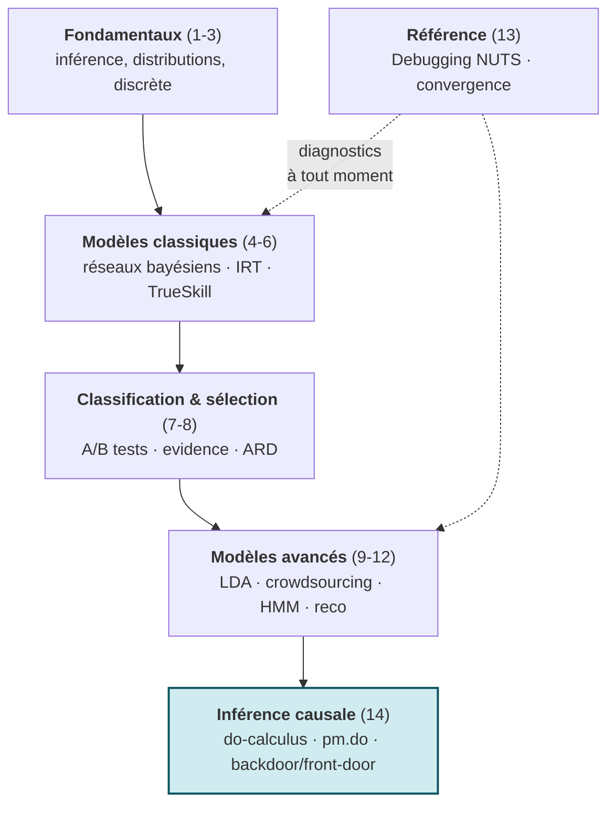

# Programmation Probabiliste avec PyMC

[← Série Probas](../README.md) | [Infer.NET (C#) →](../Infer/README.md)

Port Python de la série Infer.NET couvrant l'inférence bayésienne avec PyMC (NUTS, échantillonnage MCMC), des fondamentaux aux modèles relationnels avancés, en clôture sur l'**inférence causale** (do-calculus de Pearl, opérateur `pm.do`). La **théorie de la décision** (utilité espérée, EVPI, MDPs, bandits) forme une sous-série autonome dans [DecisionTheory/PyMC/](../DecisionTheory/PyMC/README.md), miroir Python de [DecisionTheory/Infer/](../DecisionTheory/DecInfer/README.md).

**À qui s'adresse cette série** : praticiens Python, data scientists et étudiants souhaitant maîtriser l'inférence bayésienne moderne avec l'écosystème PyMC/ArviZ. Aucun prérequis en C# ou Infer.NET : chaque notebook est autonome.

## Pourquoi cette série

PyMC est le framework d'inférence bayésienne le plus utilisé en Python pour la modélisation probabiliste appliquée. Là où scikit-learn fournit des prédictions ponctuelles, PyMC produit des **distributions postérieures complètes** qui quantifient l'incertitude de chaque paramètre.

Cette série couvre les **mêmes modèles** que la série [Infer.NET](../Infer/) (des fondamentaux à l'inférence causale) mais avec un moteur d'inférence radicalement différent :

| Aspect | Infer.NET (C#) | PyMC (Python) |
|--------|----------------|---------------|
| **Moteur** | Message passing : EP (défaut), VMP, Gibbs | Échantillonnage : NUTS (défaut), ADVI |
| **Posterior (défaut)** | Analytique, déterministe (EP/VMP) | Échantillons MCMC, convergents (NUTS) |
| **Point fort** | Modèles conjugués et structurés | Presque tout modèle continu |
| **Diagnostics** | Factor graphs | ArviZ (trace, ESS, R-hat) |
| **Écosystème** | .NET | NumPy/Pandas/Matplotlib |

Aucune des deux librairies n'est purement déterministe ou purement stochastique — Infer.NET propose aussi un échantillonneur de **Gibbs**, PyMC une inférence variationnelle (**ADVI**) — mais leur moteur *par défaut* incarne deux familles d'algorithmes : le message passing sur graphe de facteurs (Infer.NET/EP) et l'échantillonnage MCMC (PyMC/NUTS). Avoir les deux sur les mêmes modèles permet de comprendre ce **compromis**, une compétence clé pour tout praticien.



Le **même** modèle probabiliste (à gauche) se résout par deux moteurs *par défaut* radicalement différents : l'échantillonnage MCMC de PyMC (NUTS, piloté par gradient, flexible sur les modèles continus) ou le message passing d'Infer.NET (EP, rapide sur les modèles conjugués et structurés ; VMP et Gibbs prennent le relais au-delà). La série parcourt les mêmes modèles d'inférence bayésienne et causale des deux côtés pour rendre ce compromis **visible**.

## Quand le MCMC devient nécessaire : modèles hiérarchiques et partial pooling

Un modèle conjugué simple (Beta-Bernoulli, Normal-Normal) admet une **postérieure analytique** : le MCMC est alors redondant — un `numpy.random` bien placé reproduit la même distribution, et des diagnostics parfaits (R-hat ≈ 1.000, ESS ≈ 8000) ne prouvent rien d'autre que la facilité du problème. La valeur distinctive de PyMC n'apparaît que sur des modèles **sans solution analytique**, là où le couple (prior, vraisemblance observée) définit une postérieure jointe que seul l'échantillonnage peut explorer.

Le cas paradigmatique est le **modèle hiérarchique à effets aléatoires** : plusieurs groupes (sites, pièces, patients, workers) partagent une moyenne de population et une dispersion, et chaque groupe « emprunte » de l'information aux autres. C'est le **partial pooling**. Sa signature visible est le **shrinkage** — les groupes sous-échantillonnés sont tirés vers la moyenne de population plutôt qu'estimés isolément à zéro, un comportement qu'aucune mise à jour conjuguée indépendante ne reproduit.

La série illustre ce fil rouge sur plusieurs notebooks, chacun sur un cas non-conjugué distinct :

- [PyMC-1-Setup](PyMC-1-Setup.ipynb) — introduction : du Beta-Bernoulli conjugué (où MCMC = prior) à un modèle hiérarchique non-centré sur plusieurs pièces, où le shrinkage devient visible.
- [PyMC-11-Sequences](PyMC-11-Sequences.ipynb) — HMM à états cachés : la vraisemblance de mélange (`NormalMixture`) marginalise l'assignation discrète pour garder un NUTS pur sur les paramètres continus.
- [PyMC-1-Utility-Foundations](../DecisionTheory/PyMC/DecPyMC-1-Utility-Foundations.ipynb) — diagnostic multi-sites : un portefeuille de groupes hétérogènes où le partial pooling régularise les estimations à faible effectif.
- [PyMC-4-Decision-Networks](../DecisionTheory/PyMC/DecPyMC-4-Decision-Networks.ipynb) — états latents : prévalence réelle d'un phénomène observé via un test imparfait (inversion d'état caché, non-conjuguée).
- [PyMC-6-Expert-Systems](../DecisionTheory/PyMC/DecPyMC-6-Expert-Systems.ipynb) — recette de référence : paramétrisation **non-centrée** (offsets de Neal) qui évite le funnel et stabilise la convergence.
- [PyMC-16-Modeles-Hierarchiques](PyMC-16-Modeles-Hierarchiques.ipynb) — traitement dédié : partial pooling bayésien sur 8 classes, shrinkage visible (les classes clairsemées se rétractent vers `mu`), comparaison centered vs non-centered et divergence NUTS comme diagnostic géométrique du funnel.

> **Leçon technique récurrente** : sur ces modèles, la **paramétrisation non-centrée** `θ = μ + σ · z` (avec `z ~ Normal(0,1)`) est souvent indispensable. Elle découple l'estimation de la moyenne de celle de la dispersion et évite le *funnel de Neal* — une pathologie géométrique qui piège l'échantillonneur quand la dispersion inter-groupes est faible. Le réflexe naïf « augmenter `target_accept` » **aggrave** alors les divergences ; c'est la reparamétrisation, pas la tolérance, qui débloque la convergence. Voir [PyMC-13-Debugging](PyMC-13-Debugging.ipynb) pour les diagnostics associés.

## Objectifs d'apprentissage

À l'issue de cette série, vous serez capable de :

1. **Construire** un modèle probabiliste avec PyMC (définition du prior, vraisemblance, échantillonnage)
2. **Diagnostiquer** la convergence MCMC avec ArviZ (R-hat, ESS, trace plots, divergences)
3. **Comparer** message passing (Infer.NET) vs MCMC (PyMC) sur le même modèle
4. **Appliquer** l'inférence bayésienne à des problèmes concrets (ranking, classification, recommandation)
5. **Intégrer** inférence probabiliste et théorie de la décision (EVPI, MDPs, bandits)

## Vue d'ensemble

| # | Notebook | Durée | Concepts |
|---|----------|-------|----------|
| 1 | [PyMC-1-Setup](PyMC-1-Setup.ipynb) | 15 min | Installation, Beta-Bernoulli, modèle hiérarchique non-centré |
| 2 | [PyMC-2-Gaussian-Mixtures](PyMC-2-Gaussian-Mixtures.ipynb) | 50 min | Postérieurs, mélanges, Dirichlet |
| 3 | [PyMC-3-Factor-Graphs](PyMC-3-Factor-Graphs.ipynb) | 45 min | Inférence discrète, Monty Hall |
| 4 | [PyMC-4-Bayesian-Networks](PyMC-4-Bayesian-Networks.ipynb) | 55 min | CPT, D-separation, causalité |
| 5 | [PyMC-5-Skills-IRT](PyMC-5-Skills-IRT.ipynb) | 60 min | IRT, DINA, many-to-many |
| 6 | [PyMC-6-TrueSkill](PyMC-6-TrueSkill.ipynb) | 55 min | Ranking, online learning, équipes |
| 7 | [PyMC-7-Classification](PyMC-7-Classification.ipynb) | 50 min | Classification bayésienne, tests A/B |
| 8 | [PyMC-8-Model-Selection](PyMC-8-Model-Selection.ipynb) | 45 min | Evidence, Bayes factors, ARD |
| 9 | [PyMC-9-Topic-Models](PyMC-9-Topic-Models.ipynb) | 60 min | LDA, Dirichlet, documents-topics-mots |
| 10 | [PyMC-10-Crowdsourcing](PyMC-10-Crowdsourcing.ipynb) | 55 min | Workers, communautés, agrégation de labels |
| 11 | [PyMC-11-Sequences](PyMC-11-Sequences.ipynb) | 65 min | HMM, mélange `NormalMixture`, séries temporelles |
| 12 | [PyMC-12-Recommenders](PyMC-12-Recommenders.ipynb) | 60 min | Factorisation de matrices, recommandation |
| 13 | [PyMC-13-Debugging](PyMC-13-Debugging.ipynb) | 45 min | Troubleshooting, diagnostics NUTS, convergence |
| 14 | [PyMC-14-Causal-Inference](PyMC-14-Causal-Inference.ipynb) | 65 min | do-calculus de Pearl, `pm.do`, backdoor/front-door, paradoxe de Simpson, contrefactuel |
| 16 | [PyMC-16-Modeles-Hierarchiques](PyMC-16-Modeles-Hierarchiques.ipynb) | 50 min | Partial pooling, shrinkage, paramétrisation non-centrée, divergences/funnel |
| 17 | [PyMC-17-Kalman-Filter](PyMC-17-Kalman-Filter.ipynb) | 55 min | Système dynamique linéaire gaussien, récursion de filtrage fermée, value-add MCMC (estimation Q/R/drift) |
| 18 | [PyMC-18-Change-Point](PyMC-18-Change-Point.ipynb) | 50 min | Change-point bayésien, `DiscreteUniform` + `switch`, catastrophes minières (Poisson), entropie |

> **Théorie de la décision** : les notebooks décisionnels (utilité espérée, EVPI, MDPs, bandits) forment désormais une sous-série autonome dans [DecisionTheory/PyMC/](../DecisionTheory/PyMC/README.md) (1 à 7), miroir Python de [DecisionTheory/Infer/](../DecisionTheory/DecInfer/README.md).

> **Numérotation** : le notebook **14** (inférence causale) porte ce numéro par **parité** avec son jumeau C# [Infer-14-Causal-Inference](../Infer/Infer-14-Causal-Inference.ipynb). Le sujet de [Infer-10-Thompson-Sampling](../DecisionTheory/DecInfer/DecInfer-10-Thompson-Sampling.ipynb) est, côté Python, **intégré dans** [PyMC-7-Sequential](../DecisionTheory/PyMC/DecPyMC-7-Sequential.ipynb) (section bandits bayésiens MCMC) — d'où l'absence d'un PyMC-21 distinct.

> **Ponts causaux** : [PyMC-14](PyMC-14-Causal-Inference.ipynb) est le maillon **MCMC** d'un pont à quatre paradigmes autour du `do(·)` de Pearl — le jumeau **message passing** en C# [Infer-14](../Infer/Infer-14-Causal-Inference.ipynb) (Infer.NET, EP/VMP), le jumeau symbolique [Tweety-11-Causal](../../SymbolicAI/Tweety/Tweety-11-Causal.ipynb), et la lecture par l'émergence causale [ICT-5](../../IIT/ICT-Series/ICT-5-CausalEmergence.ipynb). Vue d'ensemble : le [README IIT](../../IIT/README.md), section « Ponts causaux : le do-calculus de Pearl à travers les paradigmes ».

## Progression Pédagogique



Le socle d'inférence (1-12) se suit en séquence ; le notebook **13 (Debugging)** est transversal — à consulter dès qu'une chaîne MCMC dysfonctionne, à n'importe quelle étape. La **théorie de la décision** (utilité espérée, EVPI, MDPs, bandits) forme désormais un fil rouge autonome dans la sous-série [DecisionTheory/PyMC/](../DecisionTheory/PyMC/README.md) (1 à 7) : elle peut se suivre seule si l'inférence bayésienne est déjà acquise. Le détail notebook-par-notebook figure dans la [Vue d'ensemble](#vue-densemble) ci-dessus.

## Installation

```bash
# Environnement dédié (recommandé)
conda create -n pymc-env python=3.12
conda activate pymc-env

# Dépendances principales
pip install pymc arviz pandas numpy scipy matplotlib

# Vérification
python -c "import pymc; print(f'PyMC {pymc.__version__}')"
```

### kernels Jupyter

```bash
python -m ipykernel install --user --name pymc-env --display-name "Python 3 (PyMC)"
jupyter kernelspec list  # doit afficher pymc-env
```

## Prérequis

- Python 3.10+ (3.12 recommandé)
- Connaissance de base en probabilités et statistiques
- Familiarité avec Python et Jupyter notebooks
- Optionnel : avoir suivi la série [Infer.NET](../Infer/) pour la comparaison message passing vs MCMC

## Quel parcours choisir

### Parcours data scientist Python (~10h)

Notebooks 1-3 (fondations) puis 7-8 (classification/sélection) puis 9-12 (modèles avancés). Ce parcours couvre les modèles les plus utiles en pratique sans passer par la théorie de la décision.

1. [PyMC-1-Setup](PyMC-1-Setup.ipynb) -> premier modèle
2. [PyMC-2](PyMC-2-Gaussian-Mixtures.ipynb) + [PyMC-3](PyMC-3-Factor-Graphs.ipynb) -> distributions et inférence
3. [PyMC-7](PyMC-7-Classification.ipynb) + [PyMC-8](PyMC-8-Model-Selection.ipynb) -> classification bayésienne
4. [PyMC-9](PyMC-9-Topic-Models.ipynb) -> [PyMC-12](PyMC-12-Recommenders.ipynb) -> modèles avancés

### Parcours théorie de la décision (~7h)

Ce parcours couvre l'utilité espérée, la valeur de l'information et les MDPs avec un moteur MCMC. Il se suit dans la sous-série [DecisionTheory/PyMC/](../DecisionTheory/PyMC/README.md) (notebooks 1 à 7).

1. [PyMC-1](../DecisionTheory/PyMC/DecPyMC-1-Utility-Foundations.ipynb) -> axiomes VNM
2. [PyMC-2](../DecisionTheory/PyMC/DecPyMC-2-Utility-Money.ipynb) -> aversion au risque
3. [PyMC-4](../DecisionTheory/PyMC/DecPyMC-4-Decision-Networks.ipynb) -> réseaux de décision
4. [PyMC-5](../DecisionTheory/PyMC/DecPyMC-5-Value-Information.ipynb) -> [PyMC-7](../DecisionTheory/PyMC/DecPyMC-7-Sequential.ipynb) -> EVPI, MDPs

### Parcours comparatif Infer.NET vs PyMC (~15h)

Alterner chaque notebook PyMC avec son équivalent [Infer.NET](../Infer/). Comparer les implémentations (message passing vs MCMC) sur les mêmes modèles pour comprendre les compromis.

### Parcours rapide (~2h)

[PyMC-1-Setup](PyMC-1-Setup.ipynb) + [PyMC-4-Bayesian-Networks](PyMC-4-Bayesian-Networks.ipynb) + [PyMC-7-Classification](PyMC-7-Classification.ipynb). Les trois notebooks les plus représentatifs pour une première prise en main.

## FAQ / Troubleshooting

### `ModuleNotFoundError: pymc`

PyMC n'est pas présent dans le kernel Jupyter actif. Installer les dépendances puis vérifier le kernel :

```bash
pip install pymc arviz
jupyter kernelspec list  # doit afficher pymc-env
```

### PyMC ne s'installe pas sur Windows (compilateur C manquant)

PyMC 5.x requiert un compilateur C pour les extensions natives. Solution :

```bash
# Option 1 : installer via conda (inclut le compilateur)
conda install -c conda-forge pymc

# Option 2 : installer les build tools Visual Studio
# Télécharger depuis https://visualstudio.microsoft.com/visual-cpp-build-tools/
# Cocher "Desktop development with C++"
```

### L'échantillonnage NUTS est très lent ou ne converge pas

- Vérifier les priors : des priors trop larges causent des explorations inutiles
- Augmenter `target_accept` : `pm.sample(target_accept=0.95)` (défaut 0.8)
- Utiliser `init="advi"` pour une initialisation plus robuste
- Réduire `draws` et `tune` (ex. 500/500 au lieu de 1000/1000) si la compilation C (PyTensor) est disponible mais le temps de calcul reste prohibitif
- Consulter [PyMC-13-Debugging](PyMC-13-Debugging.ipynb) pour les diagnostics complets

### ArviZ affiche des divergences

Les divergences indiquent que l'échantillonneur n'a pas exploré correctement certaines régions de l'espace postérieur. Actions :

1. `az.plot_trace(trace)` -> vérifier le mélange des chaînes
2. `az.summary(trace)` -> vérifier que `r_hat < 1.05` et `ess_bulk > 400`
3. Reparamétriser le modèle (centrage, log-transform ; paramétrisation centered vs non-centered — voir [PyMC-2-Gaussian-Mixtures](PyMC-2-Gaussian-Mixtures.ipynb) et [PyMC-13-Debugging](PyMC-13-Debugging.ipynb))
4. Augmenter le nombre de tirages : `pm.sample(draws=4000, tune=2000)`

### Erreur "SamplingError: Initial evaluation of model failed"

Le prior et la vraisemblance sont incompatibles avec les données observées. Vérifier :

- Les valeurs observées sont dans le support du prior (pas de valeurs négatives pour une distribution Gamma)
- Les dimensions correspondent (pas de shape mismatch)
- Les priors ne sont pas trop restrictifs

### Comment passer de Infer.NET à PyMC ?

La série suit le même ordre que [Infer.NET](../Infer/). Les concepts se correspondent :

| Concept Infer.NET | Équivalent PyMC |
|-------------------|-----------------|
| `Variable.Bernoulli(p)` | `pm.Bernoulli('x', p=p)` |
| `InferenceEngine` | `pm.sample()` |
| `Infer<DistributionType>` | `trace['x']` |
| `ShowFactorGraph` | `pm.model_to_graphviz()` |

## Concepts clés

- **Inférence bayésienne** : Postérieurs, priors conjugués, MCMC
- **PyMC** : Modèles probabilistes, échantillonneur NUTS, ArviZ
- **Modèles graphiques** : Réseaux bayésiens, graphes de facteurs
- **Théorie de la décision** : Utilité espérée, valeur de l'information, MDPs

## Série complémentaire

Ce port Python est le pendant de la série [Infer.NET](../Infer/) (C# / .NET Interactive) couvrant les mêmes sujets avec un moteur d'inférence différent (message passing vs MCMC).

## Ressources

- [PyMC Documentation](https://www.pymc.io/projects/docs/en/stable/)
- [ArviZ Documentation](https://python.arviz.org/)
- [Bayesian Methods for Hackers](https://github.com/CamDavidsonPilon/Probabilistic-Programming-and-Bayesian-Methods-for-Hackers)
- [Statistical Rethinking (McElreath)](https://xcelab.net/rm/statistical-rethinking/) — livre de référence pour l'inférence bayésienne appliquée

## Ponts inter-séries

| Série | Lien | Relation |
|-------|------|----------|
| [Infer.NET](../Infer/) | Mêmes modèles en C# / message passing | MCMC (NUTS) vs message passing (EP) |
| [Probas (parent)](../README.md) | Vue d'ensemble Probas | Contexte et parcours |
| [ML](../../ML/) | Pipeline ML classique | PyMC comme alternative bayésienne |
| [QuantConnect](../../QuantConnect/) | Stratégies de trading | Modèles bayésiens appliqués au trading |

## Conclusion / Prochaines étapes

### Ce que vous avez appris

Cette série vous a fait passer des **fondamentaux de l'inférence bayésienne** (priors, postérieurs, échantillonnage NUTS avec [PyMC-1-Setup](PyMC-1-Setup.ipynb) à [PyMC-3-Factor-Graphs](PyMC-3-Factor-Graphs.ipynb)) à des **modèles relationnels avancés** (réseaux bayésiens, IRT, TrueSkill, LDA, HMM, recommandation — notebooks 4 à 12), en suivant le même chemin que la série [Infer.NET](../Infer/) mais avec un **moteur d'inférence radicalement différent**. Trois acquis clés :

- **Lire et diagnostiquer une chaîne MCMC** — `pm.sample()` ne suffit pas ; ArviZ (`r_hat < 1.05`, `ess_bulk > 400`, trace plots, divergences) est devenu votre réflexe systématique, et [PyMC-13-Debugging](PyMC-13-Debugging.ipynb) votre référence pour les pannes de convergence.
- **Choisir le bon moteur selon le modèle** — vous savez désormais **quand** l'échantillonnage MCMC (PyMC/NUTS, piloté par gradient, flexible sur presque tout modèle continu) est préférable au **message passing** sur graphe de facteurs (Infer.NET/EP, rapide sur les modèles conjugués et structurés), et inversement. Arbitrer entre ces deux familles d'algorithmes est une compétence de praticien.
- **Relier inférence et décision** — la sous-série [DecisionTheory/PyMC/](../DecisionTheory/PyMC/README.md) (notebooks 1 à 7 : utilité espérée, EVPI/EVSI, MDPs, bandits) ferme la boucle : un posterior n'est pas une fin, c'est l'**input** d'une politique de décision optimale sous incertitude.

### Prochaines étapes

- **Approfondir la théorie de la décision** — [Infer-4-Multi-Attribute](../DecisionTheory/DecInfer/DecInfer-4-Multi-Attribute.ipynb) et [Infer-8-Sequential](../DecisionTheory/DecInfer/DecInfer-8-Sequential.ipynb) reprennent ces modèles en message passing pour comparer les deux moteurs sur les mêmes problèmes.
- **Aller plus loin en inférence bayésienne** — *Statistical Rethinking* (McElreath, cité en Ressources) est le prolongement naturel de cette série pour les modèles hiérarchiques et la réflexion épistémologique sur les priors.
- **Appliquer au trading et au ML** — les ponts vers [QuantConnect](../../QuantConnect/) et [ML](../../ML/) ouvrent la mise en production : modèles bayésiens de stratégie, régression logistique bayésienne, incertitude calibrée en prédiction.

### Le fil rouge

Le fil rouge de cette série est le **double regard** sur les mêmes modèles d'inférence bayésienne et causale : PyMC (MCMC/NUTS, Python) vs Infer.NET (message passing, C#). Chaque notebook jumeau vous donne non pas une implémentation de plus, mais la **comparaison directe** des deux paradigmes d'inférence — le message passing compilé sur graphe de facteurs d'un côté, l'échantillonnage MCMC piloté par gradient de l'autre. Maîtriser ce compromis, c'est savoir choisir l'outil qui correspond à la structure du modèle et au besoin en incertitude, plutôt que d'appliquer un moteur par défaut.
