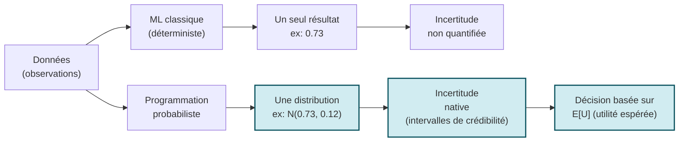
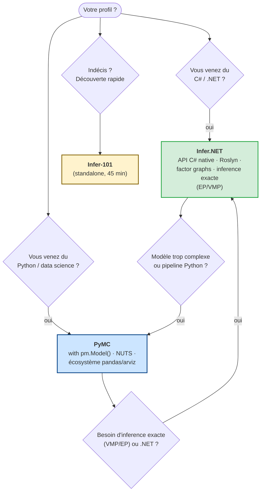
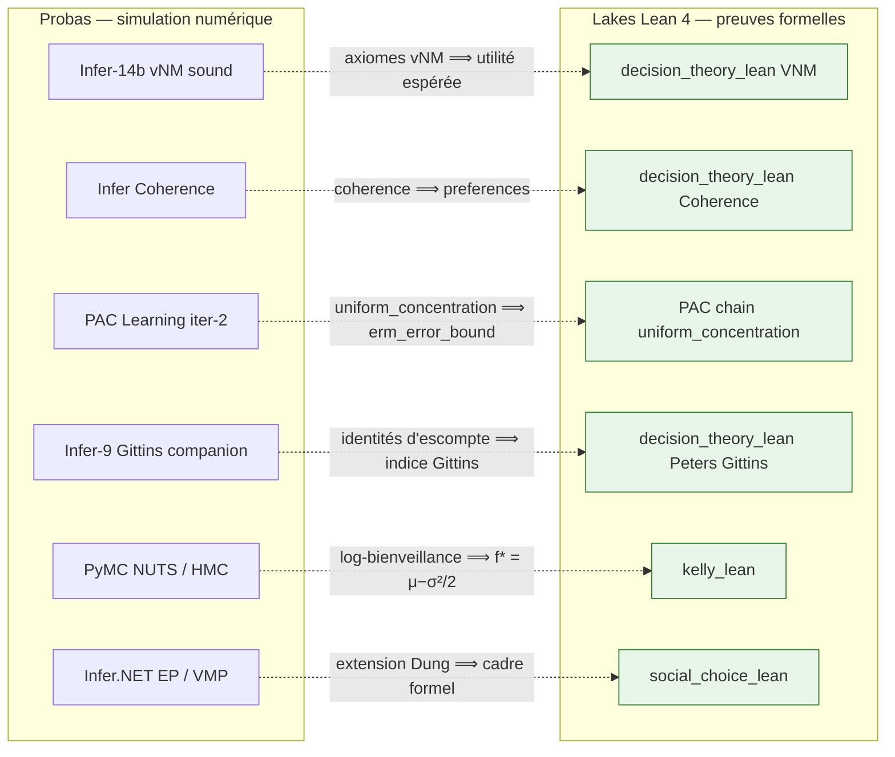

# Probas - Programmation Probabiliste

<!-- CATALOG-STATUS
series: Probas
pedagogical_count: 53
breakdown: Infer=19, DecisionTheory=18, PyMC=14, root=2
maturity: PRODUCTION=50, BETA=3
-->

[← Notebooks](../README.md) | [Série Infer (C#) →](Infer/README.md) | [Série PyMC (Python) →](PyMC/README.md) | [GameTheory →](../GameTheory/README.md)

Le monde réel est incertain. Un diagnostic médical n'est jamais sûr à 100%, un classement sportif dépend de performances intrinsèquement variables, et les données que nous collectons sont toujours bruitées ou incomplètes. La programmation probabiliste offre un cadre rigoureux pour modéliser cette incertitude : plutôt que de calculer une seule réponse, on obtient une **distribution de probabilités** qui quantifie notre confiance dans chaque résultat possible.

Cette série couvre trois stacks complémentaires : **Infer.NET** (Microsoft, C#/.NET Interactive) pour l'inférence exacte par message passing, **PyMC** (Python) pour l'échantillonnage MCMC moderne, et des **applications standalone** (RSA). Les 29 notebooks Infer.NET se scindent en deux arcs : **19 notebooks bayésiens** ([`Infer/`](Infer/README.md)) couvrant les fondements (distributions, graphs de facteurs), les modèles classiques (réseaux bayésiens, TrueSkill, LDA, HMM) et les frontières (causalité, processus gaussiens, modèles hiérarchiques, filtre de Kalman, détection de rupture, analyse de survie) ; puis un **arc autonome de 10 notebooks de théorie de la décision** ([`DecisionTheory/DecInfer/`](DecisionTheory/DecInfer/README.md)) — utilité espérée, EVPI, MDPs, bandits — jusqu'à un compagnon **Lean 4** (Infer-9, adossé au lake [`decision_theory_lean`](decision_theory_lean/)) qui démontre formellement les identités d'escompte de l'indice de Gittins. Les 21 notebooks PyMC portent les modèles Infer.NET en Python avec l'échantillonnage NUTS, offrant un pont naturel vers l'écosystème data science : 14 notebooks bayésiens ([`PyMC/`](PyMC/README.md), fondations et modèles classiques 1-14) et le cœur de l'arc décision extrait dans [`DecisionTheory/PyMC/`](DecisionTheory/PyMC/README.md) (7 notebooks renumérotés 1-7). Enfin, un **notebook-pont** ([`DecisionTheory/Causal-Bridges/`](DecisionTheory/Causal-Bridges/Do-Calculus-Bridge.ipynb)) fédère les quatre traitements de la causalité disséminés dans le dépôt — Tweety (logique), Infer.NET, PyMC et l'émergence causale (PyPhi) — autour de l'échelle de Pearl et du do-calculus, exécutés sur l'outil de référence [`dowhy`](https://www.pywhy.org/dowhy/).

## Pourquoi cette série

La programmation probabiliste occupe une place singulière dans le paysage de l'IA. Alors que le machine learning classique fournit des prédictions ponctuelles (un score, une classe), il ne dit pas à quel point il a confiance en cette prédiction. La programmation probabiliste, elle, quantifie cette incertitude de façon native.

Cette série repose sur une **double approche d'inférence**, délibérément juxtaposée :

- **Inférence exacte par message passing** (Infer.NET) : pour les modèles où les distributions postérieures peuvent être calculées exactement (ou approchées par EP/VMP). C'est la méthode des graphes de facteurs, où les probabilités se propagent le long des arêtes comme des messages. Avantage : résultats déterministes, rapide, visualisation du graphe de facteurs. Limite : ne s'applique qu'à une famille restreinte de modèles.
- **Inférence approchée par échantillonnage MCMC** (PyMC) : pour les modèles plus génériques où l'inférence exacte est intractable. NUTS (No-U-Turn Sampler) explore l'espace posterior en simulant une dynamique hamiltonienne. Avantage : s'applique à presque tout modèle. Limite : résultats stochastiques, temps de convergence variable, diagnostic nécessaire.

Avoir les deux approches sur les mêmes modèles permet de comprendre leur **champ d'application** et leurs **compromis**, une connaissance cruciale pour tout praticien.

Au-delà de la méthodologie, cette série couvre des **applications réelles** qui utilisent la programmation probabiliste en production : TrueSkill (Xbox Live, 100M+ joueurs), Item Response Theory (GMAT/GRE, millions de candidats), LDA (Google News, classement de documents), et les réseaux bayésiens pour le diagnostic médical. Chaque modèle est une brique construite sur les précédentes, formant un édifice cohérent.

## Qu'est-ce que la programmation probabiliste ?

| Aspect | ML classique (déterministe) | Programmation probabiliste |
|--------|---------------------------|--------------------------|
| **Sortie** | Un seul résultat (ex: 0.73) | Une distribution complète (ex: N(0.73, 0.12)) |
| **Incertitude** | Non quantifiée | Intégrée nativement (intervalles de crédibilité) |
| **Données manquantes** | Problématique | Naturelles (variables latentes) |
| **Combinaison de sources** | Requiert ingénierie manuelle | Probabilités conditionnelles structurées |
| **Décisions** | Basées sur un point | Basées sur E[U] (utilité espérée) |



La différence fondatrice : le ML classique produit un **point**, la programmation probabiliste produit une **distribution** (en bleu). Cette incertitude native se propage jusqu'à la décision — on maximise l'utilité espérée `E[U]`, pas un seul score.

## Objectifs d'apprentissage

À l'issue de cette série, vous serez capable de :

1. **Construire** un modèle probabiliste en Infer.NET ou PyMC (définition, inférence, validation)
2. **Interpréter** les distributions postérieures (moyenne, variance, intervalles de crédibilité)
3. **Comparer** message passing vs MCMC sur le même modèle
4. **Décaler** d'un problème réel vers sa formulation probabiliste (variables, facteurs, observations)
5. **Intégrer** inférence probabiliste et théorie de la décision (maximisation d'utilité espérée)

## Parcours d'apprentissage

### Phase 1 : Fondations (Notebooks 1-3, ~2h)

Le parcours commence par le notebook 1 (Setup) qui installe Infer.NET et construit le premier modèle bayésien — le classique "Two Coins" — en quelques lignes de C#. Le notebook 2 (Gaussian Mixtures) plonge dans les distributions continues avec les mélanges gaussiens, outil fondamental du clustering. Le notebook 3 (Factor Graphs) introduit la représentation graphique qui unifie tous les modèles : les graphs de facteurs, illustres par le problème de Monty Hall. À l'issue de cette phase, vous comprenez comment exprimer un problème incertain en termes de variables, de facteurs et de messages.

### Phase 2 : Modèles classiques (Notebooks 4-13, ~8h)

Les notebooks 4 à 13 construisent des modèles de complexité croissante, chacun illustré par une application concrète : réseaux bayésiens (diagnostic médical), Item Response Theory (évaluation de compétences), TrueSkill (classement Xbox Live), classification bayésienne, sélection de modèles (Bayes Factors), LDA (topic modeling), crowdsourcing (agrégation de labels), HMM (séquences temporelles), systèmes de recommandation, et debugging. Chaque notebook est autonome mais présuppose la maîtrise des concepts des notebooks 1-3. Le notebook 13 (Debugging) est une référence pratique à consulter tout au long du parcours.

### Phase 3 : Décision bayésienne (arc autonome, ~7h)

La seconde moitié passe de l'inférence à la décision : comment choisir une action quand on ne connaît que des probabilités ? Chez **Infer.NET**, cet arc a été extrait dans [`DecisionTheory/DecInfer/`](DecisionTheory/DecInfer/README.md) (10 notebooks, renumérotés 1-10) : les notebooks 1-4 posent les fondations (axiomes de l'utilité, fonctions mono- et multi-attributs), les notebooks 5-8 appliquent aux réseaux de décision, valeur de l'information, systèmes experts robustes et processus décisionnels de Markov (MDPs) — qui relient cette série à [RL](../RL/). Le compagnon Infer-9 (kernel Lean 4 via WSL) clôt en formalisant les identités d'escompte géométrique de l'indice de Gittins dans le lake [`decision_theory_lean`](decision_theory_lean/) — place à la **racine de la série** pour être visible des deux pistes (Infer.NET / PyMC) ; le théorème d'optimalité y est énoncé, sa preuve complète exigeant une formalisation des MDP qui manque encore à Mathlib. Côté PyMC, le cœur de cet arc est reproduit dans [`DecisionTheory/PyMC/`](DecisionTheory/PyMC/) (7 notebooks renumérotés 1-7).

### Parcours alternatifs

#### Parcours inférence comparée (Infer.NET vs PyMC, ~15h)

Suivez le même modèle dans les deux stacks pour comparer les approches :

| Concept | Infer.NET | PyMC | Différence principale |
|---------|-----------|------|----------------------|
| Fondations | Infer-1 → 2 → 3 | PyMC-1 → 2 → 3 | EP/VMP (exact) vs NUTS (MCMC) |
| Réseaux bayésiens | Infer-4 | PyMC-4 | Compilation statique vs échantillonnage dynamique |
| IRT (compétences) | Infer-5 | PyMC-5 | Variable.If vs pm.Bernoulli |
| TrueSkill | Infer-6 | PyMC-6 | Message passing exact vs MCMC approximatif |
| Classification | Infer-7 | PyMC-7 | Bayes Point Machine vs régression logistique |
| Model sélection | Infer-8 | PyMC-8 | Bayes Factors vs LOO/Pareto-SMI |
| Topic modeling | Infer-9 | PyMC-9 | VMP vs NUTS sur variables latentes |
| Debugging | Infer-13 | PyMC-13 | ShowFactorGraph vs trace plot diagnostics |

#### Parcours applications (modèles concrets, ~6h)

Si vous préférez commencer par les cas d'usage, suivez cet ordre :

1. **TrueSkill** (Infer-6 / PyMC-6) : classement bayésien, application Xbox Live
2. **IRT** (Infer-5 / PyMC-5) : évaluation de compétences, application GMAT
3. **Crowdsourcing** (Infer-10 / PyMC-10) : agrégation de labels, application Mechanical Turk
4. **Recommenders** (Infer-12 / PyMC-12) : factorisation matricielle bayésienne
5. **LDA** (Infer-9 / PyMC-9) : découverte de thèmes dans des corpus textuels
6. **HMM** (Infer-11 / PyMC-11) : régimes cachés en finance et traitement du signal

#### Parcours décision (théorie de la décision, ~7h)

Pour les étudiants en recherche opérationnelle ou finance :

1. **Foundations** (14) : axiomes VNM, loteries, théorème de représentation
2. **Money & risk** (15) : CARA, CRRA, paradoxe Saint-Petersbourg
3. **Multi-attribute** (16) : MAUT, SMART, décidons avec plusieurs critères
4. **Networks** (17) : diagrammes d'influence, politiques optimales
5. **Value of information** (18) : EVPI, EVSI — quand un test est-il rentable ?
6. **Expert systems** (19) : Minimax, Minimax Regret, robustesse
7. **Sequential** (20) : MDPs, bandits, POMDPs — passerelle vers le RL
8. **Gittins en Lean** (20b) : identités d'escompte démontrées, théorème d'optimalité énoncé — pont vers [SymbolicAI/Lean](../SymbolicAI/Lean/README.md)

#### Parcours rapide Python (standalone, ~2h)

Si vous préférez Python au C#, commencez par Infer-101.ipynb (introduction standalone avec modèles Two Coins et Cyclist) puis Pyro_RSA_Hyperbole.ipynb (application à la linguistique pragmatique avec le framework RSA).

#### Parcours PyMC complet (21 notebooks, ~14h)

Les notebooks PyMC portent les modèles Infer.NET en Python avec PyMC et l'échantillonnage NUTS : le corpus bayésien dans `PyMC/` (fondations 1-3, modèles classiques 4-13, inférence causale 14) et le cœur de l'arc décision dans `DecisionTheory/PyMC/` (7 notebooks renumérotés 1-7). Ils constituent un excellent complément pour comparer les approches d'inférence (message passing vs MCMC) et rejoindre l'écosystème Python data science. La progression suit la même structure pédagogique en 3 phases que la série Infer.NET.

## Quel stack choisir ?



Deux stacks, un même parcours de 20 modèles : **Infer.NET** (C#, message passing, déterministe) et **PyMC** (Python, MCMC, flexible). L'arbre ci-dessus donne le point d'entrée selon votre profil — et le pont de bascule vers l'autre stack quand le modèle ou l'environnement l'exige. Le détail comparatif notebook-par-notebook figure dans le [Parcours inférence comparée](#parcours-inference-comparee-infernet-vs-pymc-15h) ci-dessous.

### Si vous venez du C# / .NET

**Commencez par Infer.NET.** L'API est native C# (`Variable.GaussianFromMeanAndVariance`), le compilateur Roslyn intègre au .NET Interactive gère la compilation dynamique, et la visualisation des graphes de facteurs via FactorGraphHelper offre une compréhension intuitive de la structure du modèle. C'est le choix idéal pour comprendre l'inférence exacte et le message passing.

**Passez à PyMC quand :** vous avez un modèle trop complexe pour Infer.NET (variables latentes discrètes à grande taille), ou vous voulez intégrer le modèle dans un pipeline Python (pandas, scikit-learn, visualisation).

### Si vous venez du Python / data science

**Commencez par PyMC.** La syntaxe `with pm.Model(): ...` est plus familière aux data scientists, l'échantillonnage NUTS gère automatiquement les géométries complexes du posterior, et l'écosystème (arviz, pandas, matplotlib) est naturel.

**Passez à Infer.NET quand :** vous voulez comprendre l'inférence exacte (VMP/EP) qui donne des résultats déterministes et rapides, ou vous êtes dans un environnement .NET. La visualisation du factor graph (FactorGraphHelper) est aussi un outil pédagogique unique pour comprendre les dépendances du modèle.

### Si vous ne savez pas quoi choisir

| Critère | Recommandation |
|---------|---------------|
| Juste découvrir la programmation probabiliste | **Infer-101.ipynb** (standalone, 45 min) |
| Comprendre les graphes de facteurs | **Infer-3** (Monty Hall, Murder Mystery) |
| Un premier modèle qui marche | **Infer-101** ou **PyMC-1-Setup** |
| Application concrète rapide | **Infer-6 TrueSkill** ou **Infer-9 LDA** |
| Comparer les deux approches | Suivre la table "inférence comparée" ci-dessus |
| Production data science | **PyMC** (écosystème Python, NUTS, arviz) |
| Apprentissage embarqué / temps réel | **Infer.NET** (compilation statique = inférence rapide) |

## Structure

```
Probas/
├── Infer-101.ipynb              # Introduction Python/C# (standalone)
├── Pyro_RSA_Hyperbole.ipynb     # Pragmatique linguistique (Python)
├── PyMC/                # Port PyMC : bayésien (1-13) + inférence causale (14)
│   ├── PyMC-1-Setup.ipynb ... PyMC-13-Debugging.ipynb, PyMC-14-Causal-Inference.ipynb
│   └── (port en cours d'enrichissement)
├── decision_theory_lean/        # Projet Lake (racine série) : escompte géométrique + théorème de Gittins ; accueillera VNM (#4049) + Dutch Book (#4050)
├── Infer/                       # Corpus bayésien Infer.NET (19 notebooks)
│   ├── Infer-1-Setup.ipynb ... Infer-19-Survival-Analysis.ipynb
│   ├── README.md                # Documentation détaillée de la série bayésienne
│   └── scripts/
└── DecisionTheory/              # Arc théorie de la décision (#4725) : Infer.NET + PyMC (miroirs) + pont causal
    ├── Infer/                   # Infer-1-Utility ... Infer-10-Thompson (+ companions Lean 2/9)
    ├── PyMC/                    # PyMC-1-Decision ... PyMC-7-Sequential
    └── Causal-Bridges/          # Do-Calculus-Bridge : pont unifié des 4 séries causales (Pearl, dowhy)
```

## Ce que chaque notebook apporte

Chaque notebook introduit un concept ou modèle spécifique. Le tableau ci-dessous résume en une ligne l'apport pédagogique de chacun — au-delà du titre, c'est le **concept clé** qu'il enseigne.

### Série Infer.NET

| # | Notebook | Apport pédagogique |
|---|----------|-------------------|
| 1 | Setup | Boucle fondamentale : définition du modèle → création du moteur → inférence |
| 2 | Gaussian Mixtures | Distributions continues, mélanges gaussiens, estimation de params |
| 3 | Factor Graphs | Monty Hall + Murder Mystery : inférence discrète, Variable.If/Case |
| 4 | Bayesian Networks | Wet Grass, CPT, D-separation, explaining away, inférence causale |
| 5 | Skills (IRT) | Modélisation de compétences (DINA), évaluation adaptative |
| 6 | TrueSkill | Ranking bayésien, online learning, rating conservatif (mu - 3*sigma) |
| 7 | Classification | Bayes Point Machine, classification probit, tests A/B bayésiens |
| 8 | Model Sélection | Bayes Factors, evidence marginale, ARD (Automatic Relevance Détermination) |
| 9 | Topic Models | LDA, Dirichlet, prior asymétrique pour briser la symétrie VMP |
| 10 | Crowdsourcing | Worker models, communautés d'annotateurs, aggregation de labels |
| 11 | Séquences | HMM, detection de régimes, forward-backward, motifs temporels |
| 12 | Recommenders | Factorisation matricielle bayésienne, Click Model |
| 13 | Debugging | EP vs VMP, diagnostic de divergence, ShowFactorGraph, ShowSchedule |
| 14 | Décision Foundations | Axiomes VNM, loteries, théorème de représentation, calibration U |
| 15 | Décision Utility-Money | CARA, CRRA, aversion au risque, paradoxe Saint-Petersbourg |
| 16 | Décision Multi-Attribute | MAUT, SMART, swing weights, décisions multi-critères |
| 17 | Décision Networks | Diagrammes d'influence, politique optimale, inférence + décision |
| 18 | Décision Value-Info | EVPI, EVSI, valeur de l'information, when-to-test |
| 19 | Décision Expert-Systems | Minimax, Minimax Regret, robustesse face à l'incertitude |
| 20 | Décision Sequential | MDPs, itération valeur/politique, bandits, POMDPs |
| 20b | Lean Gittins | Formalisation Lean 4 : identités d'escompte prouvées, optimalité de Gittins énoncée |

### Série PyMC

| # | Notebook | Apport pédagogique |
|---|----------|-------------------|
| 1 | Setup | Boucle PyMC : pm.Model() → pm.sample(NUTS) → arviz |
| 2 | Gaussian Mixtures | Mélanges gaussiens MCMC, trace plots, convergence diagnostics |
| 3 | Factor Graphs | Inférence discrète avec PyMC, comparaison Infer.NET vs PyMC |
| 4 | Bayesian Networks | Réseaux bayésiens MCMC, CPT, explaining away |
| 5 | Skills (IRT) | IRT en Python, estimation de compétences par MCMC |
| 6 | TrueSkill | TrueSkill avec NUTS, online learning bayésien |
| 7 | Classification | Classification bayésienne, régression logistique |
| 8 | Model Sélection | Model comparison MCMC, LOO, WAIC, Bayes Factors empiriques |
| 9 | Topic Models | LDA avec NUTS, gestion variables latentes, inférence approximation |
| 10 | Crowdsourcing | Agrégation de labels crowdsourcing, worker communities |
| 11 | Séquences | HMM MCMC, forward-backward avec échantillonnage |
| 12 | Recommenders | Factorisation matricielle bayésienne MCMC |
| 13 | Debugging | Trace plots, R-hat, effective sample size, bonnes pratiques MCMC |
| 14 | Décision Foundations | Axiomes VNM en PyMC, loteries, décision bayésienne |
| 15 | Décision Utility-Money | CARA/CRRA en PyMC, calibration utilité, aversion au risque |
| 16 | Décision Multi-Attribute | MAUT avec PyMC, multi-criteria décision making |
| 17 | Décision Networks | Réseaux de décision MCMC, politiques optimales |
| 18 | Décision Value-Info | EVPI/EVSI en PyMC, valeur informationnelle |
| 19 | Décision Expert-Systems | Minimax/Minimax Regret robuste avec PyMC |
| 20 | Décision Sequential | MDPs MCMC, bandits, POMDPs |

## Notebooks racine (Python)

| Notebook | Kernel | Contenu | Durée |
|----------|--------|---------|-------|
| [Infer-101](Infer-101.ipynb) | Python + C# | Introduction Infer.NET, Two Coins, Cyclist | 45 min |
| [Pyro_RSA_Hyperbole](Pyro_RSA_Hyperbole.ipynb) | Python | Rational Speech Acts, hyperboles | 60 min |

### Infer-101.ipynb

Point d'entrée accessible pour la programmation probabiliste :
- Concepts de base (variables aléatoires, modèles probabilistes)
- Premier modèle Infer.NET (Two Coins)
- Exemple du cycliste (priors Gaussiens)
- Apprentissage en ligne et comparaison de modèles

### Pyro_RSA_Hyperbole.ipynb

Application avancée à la linguistique pragmatique :
- Framework RSA (Rational Speech Acts)
- Implicatures scalaires (none/some/all)
- Modélisation des hyperboles (prix, excitation)
- Question Under Discussion (QUD)

## Série Infer.NET (29 notebooks)

La série se scinde en deux arcs : le **corpus bayésien** (19 notebooks, [`Infer/`](Infer/README.md)) et l'**arc théorie de la décision** (10 notebooks, [`DecisionTheory/DecInfer/`](DecisionTheory/DecInfer/README.md)). La documentation détaillée de chaque notebook, les patterns Infer.NET avancés et les exercices corrigés vivent dans ces deux README.

### Progression

| Partie | Notebooks | Focus | Durée |
|--------|-----------|-------|-------|
| **Fondations** | 1-3 | Setup, distributions, factor graphs | 2h |
| **Modèles classiques** | 4-13 | Bayesian networks, IRT, TrueSkill, LDA, HMM | 8h |
| **Frontières bayésiennes** | 14-19 | Causalité, GP sparse, hiérarchique, filtre de Kalman, change-point, survie | 4,5h |
| **Décision (arc autonome)** | [DecisionTheory/DecInfer/ 1-10](DecisionTheory/DecInfer/README.md) | Théorie de la décision bayésienne + preuve Lean de Gittins | 7h |

Les 29 notebooks Infer.NET sont détaillés individuellement dans [*Ce que chaque notebook apporte*](#ce-que-chaque-notebook-apporte) ci-dessous (apport pédagogique par notebook) ; le contenu exhaustif — patterns avancés, exercices corrigés — vit dans [Infer/README.md](Infer/README.md) et [DecisionTheory/DecInfer/README.md](DecisionTheory/DecInfer/README.md).

## Série PyMC (21 notebooks, Python)

Port Python des modèles Infer.NET, utilisant l'échantillonnage MCMC (NUTS) au lieu du message passing. Permet de comparer les deux approches d'inférence sur des modèles identiques. La progression suit les mêmes phases que la série Infer.NET : le corpus bayésien dans `PyMC/` (fondations 1-3, modèles classiques 4-13, inférence causale 14) et le cœur de l'arc décision dans `DecisionTheory/PyMC/` (7 notebooks renumérotés 1-7).

### Phase 1 — Fondations (notebooks 1-3, ~2h)

| # | Notebook | Sujet |
|---|----------|-------|
| 1 | [PyMC-1-Setup](PyMC/PyMC-1-Setup.ipynb) | Configuration PyMC, modèle Beta-Bernoulli |
| 2 | [PyMC-2-Gaussian-Mixtures](PyMC/PyMC-2-Gaussian-Mixtures.ipynb) | Distributions continues, mélanges gaussiens |
| 3 | [PyMC-3-Factor-Graphs](PyMC/PyMC-3-Factor-Graphs.ipynb) | Graphes de facteurs, inférence discrète |

### Phase 2 — Modèles classiques (notebooks 4-13, ~9h)

| # | Notebook | Sujet |
|---|----------|-------|
| 4 | [PyMC-4-Bayesian-Networks](PyMC/PyMC-4-Bayesian-Networks.ipynb) | Réseaux bayésiens, CPTs |
| 5 | [PyMC-5-Skills-IRT](PyMC/PyMC-5-Skills-IRT.ipynb) | Item Response Theory, modèles de compétences |
| 6 | [PyMC-6-TrueSkill](PyMC/PyMC-6-TrueSkill.ipynb) | Classement, TrueSkill |
| 7 | [PyMC-7-Classification](PyMC/PyMC-7-Classification.ipynb) | Classification bayésienne |
| 8 | [PyMC-8-Model-Sélection](PyMC/PyMC-8-Model-Selection.ipynb) | Sélection de modèles, Bayes Factors |
| 9 | [PyMC-9-Topic-Models](PyMC/PyMC-9-Topic-Models.ipynb) | LDA, Dirichlet priors |
| 10 | [PyMC-10-Crowdsourcing](PyMC/PyMC-10-Crowdsourcing.ipynb) | Agrégation de labels, workers, communautés |
| 11 | [PyMC-11-Séquences](PyMC/PyMC-11-Sequences.ipynb) | HMM, chaînes de Markov cachées, séquences temporelles |
| 12 | [PyMC-12-Recommenders](PyMC/PyMC-12-Recommenders.ipynb) | Systèmes de recommandation bayésiens, factorisation |
| 13 | [PyMC-13-Debugging](PyMC/PyMC-13-Debugging.ipynb) | Troubleshooting MCMC, diagnostics NUTS, bonnes pratiques |

### Phase 3 — Théorie de la décision (sous-série DecisionTheory/PyMC/, ~6h)

> Les notebooks décisionnels ont été extraits vers une sous-série autonome : [DecisionTheory/PyMC/](DecisionTheory/PyMC/README.md) (notebooks 1 à 7), miroir Python de [DecisionTheory/DecInfer/](DecisionTheory/DecInfer/README.md).

| # | Notebook | Sujet |
|---|----------|-------|
| 1 | [PyMC-1-Utility-Foundations](DecisionTheory/PyMC/DecPyMC-1-Utility-Foundations.ipynb) | Loteries, axiomes Von Neumann-Morgenstern, utilité espérée |
| 2 | [PyMC-2-Utility-Money](DecisionTheory/PyMC/DecPyMC-2-Utility-Money.ipynb) | Aversion au risque, CARA, CRRA, paradoxe Saint-Petersbourg |
| 3 | [PyMC-3-Multi-Attribute](DecisionTheory/PyMC/DecPyMC-3-Multi-Attribute.ipynb) | MAUT, SMART, swing weights, décisions multi-critères |
| 4 | [PyMC-4-Decision-Networks](DecisionTheory/PyMC/DecPyMC-4-Decision-Networks.ipynb) | Réseaux de décision, diagrammes d'influence, politique optimale |
| 5 | [PyMC-5-Value-Information](DecisionTheory/PyMC/DecPyMC-5-Value-Information.ipynb) | EVPI, EVSI, valeur de l'information parfaite et d'échantillon |
| 6 | [PyMC-6-Expert-Systems](DecisionTheory/PyMC/DecPyMC-6-Expert-Systems.ipynb) | Systèmes experts, Minimax, Minimax Regret, décisions robustes |
| 7 | [PyMC-7-Sequential](DecisionTheory/PyMC/DecPyMC-7-Sequential.ipynb) | MDPs, itération de valeur/politique, bandits, POMDPs |

### Phase 4 — Inférence causale (notebook 14, ~1h)

| # | Notebook | Sujet |
|---|----------|-------|
| 14 | [PyMC-14-Causal-Inference](PyMC/PyMC-14-Causal-Inference.ipynb) | do-calculus de Pearl, `pm.do`, backdoor/front-door, paradoxe de Simpson, contrefactuel |

## Pont causal — les quatre séries causales réunies

La causalité est traitée à **quatre endroits** du dépôt, chacun avec son moteur et son angle propre. Le notebook-pont [`Do-Calculus-Bridge`](DecisionTheory/Causal-Bridges/Do-Calculus-Bridge.ipynb) fournit l'**armature formelle commune** — l'échelle de Pearl (observation / intervention / contrefactuel) et les trois règles du do-calculus — puis l'exécute sur l'outil de référence [`dowhy`](https://www.pywhy.org/dowhy/) (installé et lancé réellement, pas de réimplémentation jouet) avant de renvoyer à chaque série pour l'instanciation par son moteur.

| Série | Moteur | Angle causal |
|-------|--------|--------------|
| [Tweety-11-Causal](../SymbolicAI/Tweety/Tweety-11-Causal.ipynb) | Tweety (.NET, logique) | modèle causal structurel, opérateur `do`, contrefactuels |
| [Infer-14-Causal-Inference](Infer/Infer-14-Causal-Inference.ipynb) | Infer.NET (message passing) | backdoor, front-door, paradoxe de Simpson, médiation |
| [PyMC-14-Causal-Inference](PyMC/PyMC-14-Causal-Inference.ipynb) | PyMC (MCMC) | backdoor, front-door, contrefactuel bayésien |
| [ICT-5](../IIT/ICT-Series/ICT-5-CausalEmergence.ipynb) · [ICT-6](../IIT/ICT-Series/ICT-6-SortingToTPM-CausalEmergence.ipynb) | PyPhi (CE 2.0) | émergence causale, information effective de Hoel |

Ce que le pont ajoute par rapport aux quatre notebooks pris isolément : la théorie du do-calculus posée une bonne fois, vérifiée sur `dowhy` à effet connu, et la distinction explicite entre **causalité interventionniste** (Pearl) et **émergence causale** (Hoel).

## Applications standalone (2 notebooks)

| Notebook | Kernel | Contenu | Durée |
| -------- | ------- | ------- | ----- |
| [Infer-101](Infer-101.ipynb) | .NET (C#) + Python | Introduction Infer.NET, Two Coins, Cyclist | 1h |
| [Pyro_RSA_Hyperbole](Pyro_RSA_Hyperbole.ipynb) | Python 3 | Rational Speech Acts, hyperboles | 30 min |

## Prerequisites

### Niveau mathématique attendu

Cette série suppose une **maîtrise de base en probabilités et statistiques** :

| Concept | Utilité dans la série | Notes de révision |
|---------|---------------------|------------------|
| Variables aléatoires (discrètes/continues) | Partout, notebook 1+ | Loi de proba, espérance, variance |
| Distributions usuelles (Bernoulli, Gaussian, Beta, Gamma) | Notebook 1 (Beta-Bernoulli), 2 (Gaussian) | Paramètres, formes, conjugaison |
| Probabilités conditionnelles | Notebook 3+ (Variable.If, CPT) | P(A|B), théorème de Bayes |
| Indépendance conditionnelle | Notebook 3 (Monty Hall), 4 (D-separation) | Collider, explaining away |
| Espérance mathématique | Partout (calcul de EU) | E[X] = sum x*P(x) ou intégrale |
| Distributions conjuguées | Notebook 1 (Beta-Bernoulli), 9 (Dirichlet-Discrète) | Prior + likelihood = posterior (famille même) |
| Intégrales (niveau 1) | Notebook 2, 15 (CARA/CRRA) | Calcul d'espérance avec fonctions non-linéaires |

**Inutile de maîtriser** : dérivation multivariée, algèbre linéaire avancée (sauf pour les modèles hiérarchiques en notebook 4). Les concepts sont introduits progressivement et réexpliqués dans le contexte.

### Prerequisites techniques

#### Pour Infer.NET (C#)

```bash
# .NET SDK 9.0+
dotnet --version

# VS Code + extension Polyglot Notebooks
# Packages (auto-references dans notebooks):
# - Microsoft.ML.Probabilistic
# - CompilerChoice = Roslyn
```

#### Pour Python

```bash
# Environnement Python 3.8+
pip install pyro-ppl torch matplotlib numpy
```

## Concepts clés

| Concept | Description |
|---------|-------------|
| **Inférence bayésienne** | Mise à jour de croyances avec des observations |
| **Prior / Posterior** | Distribution avant/après observations |
| **Factor Graph** | Représentation graphique de distributions jointes |
| **Message Passing** | Algorithmes EP (Expectation Propagation), VMP |
| **MCMC / NUTS** | Échantillonnage pour modèles complexes (PyMC) |
| **D-separation** | Critère graphique d'indépendance conditionnelle |
| **Explaining Away** | Causes alternatives deviennent moins probables |
| **Decision Theory** | Maximisation d'utilité espérée |
| **Valeur de l'information** | EVPI, EVSI — coût d'un test complémentaire |

## Domaines d'application

| Domaine | Notebooks |
|---------|-----------|
| Jeux vidéo | 6 (TrueSkill) |
| Éducation | 5 (IRT), 14 |
| NLP | 9 (LDA) |
| Médecine | 4, 7, 17-19 |
| Finance | 11, 15, 20 |
| E-commerce | 12 |

### Exemples concrets

Derrière chaque modèle de la série se cache un système réel déjà en production :

- **TrueSkill** (notebook 6) est l'algorithme que Microsoft utilise pour apparier des millions de joueurs sur Xbox Live : il maintient pour chaque joueur une compétence *gaussienne* (moyenne + incertitude) mise à jour après chaque partie, généralisant l'Elo des échecs aux jeux en équipe.
- **Item Response Theory** (notebook 5) est le moteur des tests adaptatifs comme le GMAT ou le GRE : la difficulté de chaque question est calibrée probabilistiquement, et le test s'ajuste en temps réel au niveau estimé du candidat.
- **Les réseaux bayésiens** (notebooks 4, 7) fondent les systèmes d'aide au diagnostic médical (de QMR-DT aux outils modernes) et le filtrage anti-spam : ils propagent l'incertitude entre symptômes, causes et observations.
- **LDA / topic models** (notebook 9) structurent automatiquement de grands corpus — découverte de thématiques dans des archives de presse, cartographie de la littérature scientifique, analyse de tickets support.
- **Les HMM** (notebook 11) détectent les régimes cachés : phases de marche en finance, reconnaissance de la parole, segmentation de séquences biologiques.
- **Les systèmes de recommandation bayésiens** (notebook 12) sont la version « avec barre d'incertitude » du collaborative filtering de Netflix ou Amazon — utile pour décider quand explorer un nouvel item plutôt que d'exploiter une préférence connue.
- **Le crowdsourcing** (notebook 10) modélise la fiabilité de chaque annotateur (Mechanical Turk, labellisation de datasets) pour reconstruire la vérité terrain malgré des votes bruités.
- **La théorie de la décision et les MDPs** (arc [`DecisionTheory/`](DecisionTheory/)) relient la série au contrôle séquentiel : gestion de stocks, maintenance prédictive, et passerelle directe vers le [reinforcement learning](../RL/).

## Installation

### Notebooks PyMC (Python)

```bash
pip install pymc numpy scipy matplotlib arviz
```

### Notebooks Infer.NET (C# .NET Interactive)

```bash
# 1. Installer .NET SDK 9.0+ depuis https://dotnet.microsoft.com/download
# 2. Installer le kernel dotnet-interactive
dotnet tool install -g Microsoft.dotnet-interactive
dotnet interactive jupyter install

# 3. Ou utiliser le script PowerShell (installe tout automatiquement) :
cd MyIA.AI.Notebooks/Probas/Infer/scripts
.\setup_environment.ps1
```

### Notebooks Python (Infer-101, Pyro_RSA)

```bash
pip install pyro-ppl torch matplotlib numpy
```

### Vérification

```bash
jupyter kernelspec list  # doit afficher .net-csharp et python3
```

### Tester tous les notebooks

```bash
python MyIA.AI.Notebooks/Probas/Infer/scripts/test_notebooks.py --validate-only
```

## FAQ / Troubleshooting

### Le kernel .NET Interactive n'apparait pas dans Jupyter

- Vérifiez que `dotnet interactive jupyter install` a réussi (sortie : `Kernel installed`).
- Redémarrez Jupyter. Si le kernel persiste à ne pas apparaître, vérifiez que .NET SDK 9.0+ est installé : `dotnet --version`.
- Sur Windows, les notebooks Infer.NET doivent être ouverts avec l'extension **Polyglot Notebooks** dans VS Code ou jupyterlab.

### `CompilerChoice.Roslyn` obligatoire

Tous les notebooks Infer.NET utilisent `moteur.Compiler.CompilerChoice = CompilerChoice.Roslyn`. C'est **obligatoire** dans .NET Interactive car Infer.NET compile dynamiquement le modèle en code C#. Sans Roslyn, la compilation échoue. Ce pattern est présenté dans **chaque** notebook de la série (section 1 "Configuration").

### PyMC ne s'installe pas sur Windows (compilateur C manque)

PyMC nécessite un compilateur C pour certaines dépendances. Sur Windows :
- Installez **Microsoft Visual C++ Build Tools** (la version "Build Tools" suffit, pas besoin de Visual Studio complet).
- Ou utilisez un **environnement conda** : `conda install -c conda-forge pymc`.
- Ou utilisez un **conteneur Docker** avec une image préconfigurée.

### Erreur Graphviz / FactorGraphHelper

La visualisation des factor graphs nécessite **Graphviz installé**. Si `dot` n'est pas trouvé :
- Les fichiers `.gv` sont sauvegardés dans le répertoire courant.
- Vous pouvez les visualiser sur [viz-js.com](https://viz-js.com/) ou [edotor.net](https://edotor.net/).
- Installation Graphviz Windows : télécharger depuis https://graphviz.org/download/, puis ajouter `C:\Program Files\Graphviz\bin` au PATH.

### Switcher entre kernels C# et Python dans un même notebook

Le notebook `Infer-101.ipynb` est le seul à mélanger les deux kernels. Il utilise le mode **polyglot** de .NET Interactive, où chaque cellule spécifie son kernel via le tag `#kernel name`. Pour la série standard, chaque sous-série (Infer/ ou PyMC/) utilise un seul kernel.

### PyMC : échantillonnage très lent ou divergence NUTS

- Augmentez `target_energy` et `adapt_delta` (défaut 0.8 → essai 0.95).
- Vérifiez le `R-hat` (devrait être < 1.01 pour toutes les variables).
- Consultez [PyMC-13-Debugging](PyMC/PyMC-13-Debugging.ipynb) pour des diagnostics détaillés (trace plots, effective sample size, tree depth).

## Ressources

### Infer.NET

- [Infer.NET Documentation](https://dotnet.github.io/infer/)
- [MBML Book (Model-Based Machine Learning)](https://mbmlbook.com/)
- [Infer.NET GitHub](https://github.com/dotnet/infer)

### PyMC

- [PyMC Documentation](https://www.pymc.io/)
- [PyMC Examples](https://www.pymc.io/projects/examples/en/latest/)
- [arviz — Visualization et diagnostics MCMC](https://python.arviz.org/)

### Théorie

- Bishop, C. (2006) - *Pattern Recognition and Machine Learning*
- Koller & Friedman (2009) - *Probabilistic Graphical Models*
- Von Neumann & Morgenstern (1944) - *Theory of Games and Economic Behavior*
- Russell & Norvig - *Artificial Intelligence*, Chapter 16 (Decision Theory)

### Pont vers les Preuves Formelles (Lean 4) — différenciant CoursIA

Cette série ancre mathématiquement ses résultats phares dans un assistant de preuve, en partenariat avec les autres familles du dépôt. La programmation probabiliste ne se contente pas de **calculer** des densités, des utilités espérées et des bornes de généralisation — elle les **prouve**. Le tableau ci-dessous croise les notebooks Probas avec les **lakes Lean 4** qui certifient leurs théorèmes, et signale les passerelles vers les autres hubs (`QC` ↔ `kelly_lean`, `GameTheory` ↔ `social_choice_lean` Arrow, `Search` ↔ `astar_lean`, `SymbolicAI` ↔ `argumentation_lean`).

| Famille                  | Lake phare                       | Théorème                                                                          | Branchement notebook                                                |
| ---                      | ---                              | ---                                                                               | ---                                                                  |
| Probas (DecisionTheory)  | `decision_theory_lean`           | Axiomes de Von Neumann-Morgenstern ⇒ existence d'une utilité espérée (`0 sorry`)  | [`DecisionTheory/DecInfer/`](DecisionTheory/DecInfer/README.md) Infer-14b  |
| Probas (DecisionTheory)  | `decision_theory_lean`           | Coherence utility ⟹ preferences (loterie de référence) `#4150 MERGED`             | [`DecisionTheory/DecInfer/`](DecisionTheory/DecInfer/README.md) Coherence   |
| Probas (PAC Learning)    | chaîne PAC iter-2 complète       | `pac_finite_class_bound` + `pac_agnostic_generalization` (`0 sorry bout-en-bout`)  | notebook PAC Learning compagnon Lean                                 |
| Probas (DecisionTheory)  | `decision_theory_lean` Peters    | Indice de Gittins, identités d'escompte (`0 sorry`, ref `v4.27.0-rc1`)            | Infer-9 (companion Lean)                                             |
| QC ↔ Probas              | `kelly_lean` `#4052`             | Fraction risquée `f* = μ−σ²/2` sous log-bienveillance (`0 sorry`, `#4164 SHIPPED`) | notebook `kelly-criterion`                                           |
| GameTheory ↔ Probas      | `social_choice_lean`             | Impossibilité d'Arrow (5 axiomes ⇒ dictature)                                     | hub GameTheory notebook 16a                                          |
| Search ↔ Probas          | `astar_lean` `#4048`             | Consistance heuristique `h ≤ h*` ⇒ optimalité `A*`                                 | hub Search notebook `A*` phases 1-3 (`#4090 SHIPPED`)                |
| SymbolicAI ↔ Probas      | `argumentation_lean`             | Extension Dung (`grounded`/`preferred`/`stable`) par cadre formel                 | hub SymbolicAI/Tweety notebook AF-Dung                               |



La double culture Probas tient en deux gestes complémentaires. D'un côté, **simuler** : PyMC fait tourner NUTS/HMC sur des modèles hiérarchiques, Infer.NET propage des messages EP/VMP sur des graphes factoriels, et les notebooks PAC entraînent des hypothèses parERM. De l'autre, **prouver** : `decision_theory_lean` (VNM résolu 0 sorry #4049, Coherence #4150 MERGED, mono-livret #4193 OPEN) certifie que les axiomes de rationalité impliquent l'existence d'une utilité espérée, et la chaîne PAC iter-2 démontre `pac_agnostic_generalization` de bout en bout sans `sorry`. Les deux faces du même raisonnement bayésien et décisionnel — l'une touche l'intuition numérique, l'autre ancre la garantie formelle.

EPIC [#4038](https://github.com/jsboige/CoursIA/issues/4038) (Roadmap Lean) · cross-ref hubs [`QC` ↔ `kelly_lean`](../QuantConnect/README.md) (PR #5047), [central P0](../README.md) (PR #5049), [`GameTheory` ↔ `social_choice_lean`](../GameTheory/README.md) (PR #5050), [`SymbolicAI/Lean`](../SymbolicAI/Lean/README.md) (PR #5043 MERGED).

## Conclusion / Prochaines étapes

### Ce que vous avez appris

Cette série vous a fait changer de regard sur l'incertitude : plutôt que de la fuir ou de l'ignorer, vous avez appris à la **modéliser, la quantifier et la traduire en décisions**. L'arc pédagogique se déploie en trois temps, porté par trois stacks complémentaires :

- **Le geste fondateur** — remplacer une prédiction ponctuelle par une **distribution**. Un modèle probabiliste ne dit pas « la probabilité est 0.73 » mais « voici la distribution complète N(0.73, 0.12) », et cette densité porte l'information que la moyenne dissimule : la confiance, les queues, les modes multiples. C'est ce déplacement qui ouvre tout le reste.
- **La double inférence** — Infer.NET (message passing, EP/VMP) et PyMC (NUTS, MCMC) résolvent les mêmes modèles par des voies opposées. Le traverser sur des modèles jumeaux (notebook à notebook, Infer-N ↔ PyMC-N) ancre une intuition qu'aucun cours théorique ne donne : **quand l'inférence exacte est tractable, elle est déterministe et rapide ; quand elle ne l'est plus, l'échantillonnage prend le relais mais exige des diagnostics** (R-hat, effective sample size, trace plots).
- **La décision** — la seconde moitié franchit le pas : des croyances (distributions) aux **actions**. Utilité espérée E[U], valeur de l'information (EVPI/EVSI), réseaux de décision, et enfin les MDP qui relient cette série à l'apprentissage par renforcement. Chez Infer.NET cet arc forme un **track autonome** ([`DecisionTheory/DecInfer/`](DecisionTheory/DecInfer/README.md)) ; son compagnon Lean 4 (Infer-9) pousse l'exigence jusqu'à **formaliser** les identités d'escompte de l'indice de Gittins — l'assurance que les identités numériques ne sont pas des approximations accidentelles mais des théorèmes.

La thèse pratique est honnête : un modèle probabiliste est plus lourd à bâtir qu'un classifieur, mais il est le seul à pouvoir dire « je ne sais pas » — et dans le diagnostic médical, le classement sportif ou l'évaluation de compétences, cette honnêteté est précisément ce qu'on cherche.

### Prochaines étapes

- **Passer à la décision séquentielle** : les MDP de l'arc décision ([`DecisionTheory/DecInfer/`](DecisionTheory/DecInfer/README.md) ou [`DecisionTheory/PyMC/`](DecisionTheory/PyMC/README.md)) préparent directement [RL](../RL/README.md), où l'agent **apprend** la politique optimale par interaction plutôt que de la calculer hors ligne — la frontière naturelle entre inférence probabiliste et apprentissage par renforcement.
- **Croiser la théorie des jeux** : [GameTheory](../GameTheory/README.md) partage la notion de **décision sous incertitude**, mais l'incertitude y vient d'un adversaire rationnel plutôt que d'un processus stochastique. Les fonctions d'utilité multi-attributs trouvent leur miroir dans le choix social et l'utilité collective.
- **Revenir au ML appliqué** : le [TP prévision de ventes](../ML/ML.Net/TP-prevision-ventes.ipynb) de la série ML est une porte d'entrée — il traite la régression bayésienne comme cas d'application ; cette série en donne le langage complet (distributions, facteurs, inférence).
- Pour la pratique : reprenez un même modèle (par exemple TrueSkill, Infer-6 / PyMC-6) dans les deux stacks, comparez les intervalles de crédibilité, et observez comment EP (déterministe) et NUTS (stochastique) convergent vers des conclusions cohérentes — c'est l'exercice le plus formateur pour saisir le champ d'application de chaque approche.

### Le fil rouge

La programmation probabiliste propose un changement de posture : ne plus demander « quelle est la bonne réponse ? » mais **« à quel point suis-je sûr de cette réponse, et que dois-je faire compte tenu de cette incertitude ? »**. Cette série vous a donné les trois couches — modéliser (facteurs, distributions), inférer (message passing ou échantillonnage), décider (utilité espérée, valeur de l'information) — pour transformer une question qualitative en un calcul, en gardant à l'esprit qu'une distribution honnête vaut mieux qu'une certitude illusoire.

## Licence

Voir la licence du repository principal.

---

*Version 1.1.0 — Juin 2026*
