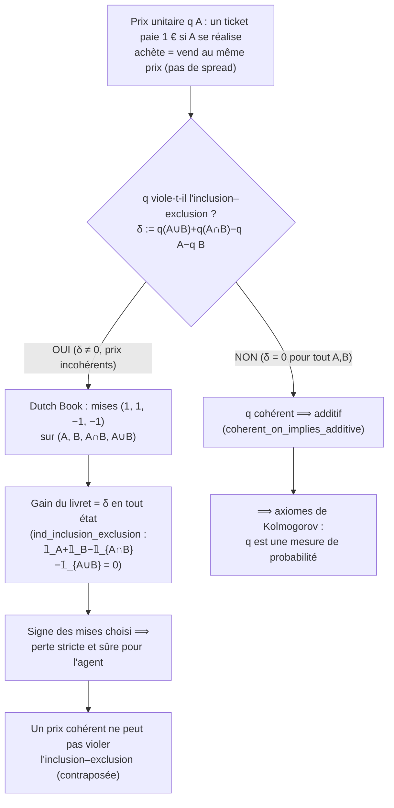

# decision_theory_lean — Théorie de la décision (Lean 4)

Lake **à la racine de la série `Probas`**, formalisant des résultats canoniques de
théorie de la décision — visible des deux pistes de la série (Infer.NET / PyMC).

Trois modules livrés :

- **Gittins** : le problème du **bandit manchot multi-bras** (multi-armed bandit) et
  l'**indice de Gittins** (Gittins 1979, Weber 1992) — la politique optimale pour le
  bandit actualisé à horizon infini. Les **briques de l'actualisation géométrique
  sont entièrement prouvées** (PR #2911) ; le **théorème phare d'optimalité est
  énoncé mais intraitable** dans le Mathlib actuel (pas de formalisation
  MDP/Bellman), maintenu en `sorry`.
- **Utility** : la **représentation d'utilité espérée** de **von Neumann–Morgenstern**
  (`See #4049`). Le module formalise les **quatre axiomes vNM** (complétude,
  transitivité, indépendance, continuité/Archimède) sur les loteries, prouve **sans
  aucun `sorry`** la **direction saine** du théorème (existence d'une représentation
  ⟹ rationalité, i.e. les quatre axiomes) et la **stabilité affine** (cardinalité :
  l'utilité n'est déterminée qu'à transformation affine positive près). La **direction
  d'existence** (rationalité ⟹ représentation, Herstein–Milnor 1953) est documentée
  comme **jalon ouvert**.
- **Coherence** : la **cohérence de de Finetti / Dutch Book** (`See #4050`, #4193,
  #4244). Le module prouve **sans aucun `sorry`** la **direction constructive** du
  théorème de cohérence (cas fini) : des prix de pari violant l'inclusion–exclusion
  exposent l'agent à un *Dutch Book* explicite (livret de paris à perte sûre, mises
  concrètes `(1,1,−1,−1)` ou l'inverse), via l'identité d'inclusion–exclusion des
  indicatrices. Sa contraposée donne « cohérence ⟹ additivité ». **Le cas mono-ticket
  est entièrement clos** (`single_coherent_iff_prob_bounds`, #4193 : la cohérence d'un
  ticket unique équivaut aux bornes de probabilité `0 ≤ q ≤ 1`), et **des poids
  additifs normalisés on dérive une fonction de prix mono-cohérente**
  (`priceFromWeights_single_coherent`, #4244). La **réciproque complète** sur livrets de
  taille arbitraire (`coherent_iff_probability`, qui fait de `q` une mesure de
  probabilité) nécessite la séparation d'hyperplans / dualité LP en dimension finie et
  reste un **jalon ouvert** (délibérément non `sorry`-backed).

Notebook compagnon Lean :
[`Infer/Infer-9-Lean-Gittins.ipynb`](../DecisionTheory/DecInfer/DecInfer-9-Lean-Gittins.ipynb).

## Statut

- **Toolchain** : `leanprover/lean4:v4.31.0-rc1`
- **Sorry** : **2** (tous dans `gittins_optimality`, `Gittins/GittinsTheorem.lean`) —
  voir « État honnête » ci-dessous. `Gittins/Discount.lean` = **0 sorry** (entièrement
  prouvé), `Gittins/Basic.lean` = 0. `gittins_index_known_arm` et
  `gittins_index_monotone_discount` = **0 sorry** (prouvés, ce dernier via le port
  `Float→ℝ` PR #5272). Les modules **`Utility` et `Coherence` entiers = 0 sorry**
  (entièrement prouvés, jalon ouvert documenté non `sorry`-backed).
- **Build** : `lake build Gittins Utility Coherence` (dépend de Mathlib4)
- **Dépendances** : Mathlib4 (`v4.30.0-rc2`) — analyse réelle pour les lemmes
  d'actualisation, structure ordonnée et affine de `ℝ` pour vNM, théorie des `Finset`
  / inclusion–exclusion pour la cohérence de de Finetti

## Ce qui est formalisé

Un **bandit manchot multi-bras** : à chaque étape, une politique choisit l'un de
plusieurs bras (`BanditArm`) et observe une récompense ; l'objectif est de maximiser
la récompense actualisée espérée totale (actualisation `γ ∈ (0,1)`). L'**indice de
Gittins** d'un bras est le point fixe d'un problème d'arrêt optimal ; la **politique
à indice de Gittins** (jouer le bras d'indice le plus élevé) est optimale pour le
bandit actualisé.

La formalisation est scindée en une couche **prouvée** et une couche **énoncée** :

- **Prouvé** (`Discount.lean`) : les identités de série géométrique sous-tendant la
  valeur actualisée — `∑' γ^n = 1/(1-γ)`, `∑' γ^n·r = r/(1-γ)`, et
  `discount_monotone` (γ₁ ≤ γ₂ ⇒ ∑' γ₁^n ≤ ∑' γ₂^n). `discount_monotone` est prouvé
  **en forme close** via `geometric_series_converges` +
  `one_div_le_one_div_of_le`, en contournant l'absence de `tsum_le_tsum` sur le `ℝ`
  nu dans Mathlib v4.30.0-rc2.
- **Énoncé, intractable** (`GittinsTheorem.lean`) : `gittinsIndex` (arrêt optimal),
  `gittins_optimality` (le théorème central — la politique à indice maximise la
  récompense actualisée espérée). Les **2 `sorry` résiduels** sont dans l'assemblage de
  `gittins_optimality` (point fixe d'arrêt optimal + passage à la limite sur l'horizon) ;
  c'est la **barrière A** (MDP/Bellman), research-level.
- **Prouvé** (`GittinsTheorem.lean`) : `gittins_index_known_arm` (indice d'un bras connu)
  et `gittins_index_monotone_discount` (monotonie en γ de l'indice, PR #5272 via le port
  `Float→ℝ` qui a fermé la **barrière B** Float-order).

### Représentation d'utilité espérée (von Neumann–Morgenstern)

Le module **`Utility`** formalise le théorème de **représentation d'utilité
espérée** (von Neumann–Morgenstern 1944) : un agent classe des **loteries**
(distributions de probabilité à support fini sur un ensemble fini d'issues `α`) selon
une **préférence** `P p q` (« `p` faiblement préférée à `q` »). Ce théorème relie le
comportement axiomatique au **maximisation d'utilité espérée** : `P` satisfait les
quatre axiomes vNM **si et seulement si** il existe une utilité `u : α → ℝ` telle que
`P p q ↔ E_p[u] ≥ E_q[u]`, unique à transformation affine positive près.

La formalisation livre **sans aucun `sorry`** la **direction saine** et la
**stabilité affine** :

- **Prouvé** (`Representation.lean`) :
  - `expected_utility_rep_is_rational` — **direction saine** : si une utilité `u`
    représente `P` (`P p q ↔ E_p[u] ≥ E_q[u]`), alors `P` est **rationnelle**
    (satisfait les quatre axiomes). Chaque axiome se réduit à un fait élémentaire sur
    l'ordre et la structure affine de `ℝ` : la complétude vient de la totalité de `≥`
    sur `ℝ`, la transitivité de sa transitivité, l'indépendance de l'**affinité de
    l'espérance** (`E_{t·p+(1-t)·r}[u] = t·E_p[u]+(1-t)·E_r[u]`), la continuité de
    l'existence d'un **point de croisement** de l'interpolation affine.
  - `affine_rep_is_rep` — **cardinalité / stabilité affine** : si `u` représente
    `P`, toute transformée affine positive `a·u + b` (avec `a > 0`) représente aussi
    `P`. C'est la raison pour laquelle seules les **différences** d'utilité (pas les
    niveaux) sont identifiées par les données de choix.
- **Énoncé, jalon ouvert** (direction d'existence) : la réciproque — **toute
  préférence rationnelle admet une représentation d'utilité espérée** — est la moitié
  substantielle du théorème (Herstein & Milnor, 1953). Sa preuve procède en montrant
  que la préférence est représentée par un **fonctionnel linéaire** sur le simplexe
  des loteries (l'indépendance donne la linéarité le long des mélanges, la continuité
  l'étend à l'intérieur), puis que ce fonctionnel est une espérance `E_p[u]` pour un
  certain `u : α → ℝ`. Cela requiert un argument non trivial de séparation / algèbre
  linéaire et est laissé comme **jalon naturel**. Il est délibérément **non énoncé
  comme un `sorry`** : la bibliothèque actuelle est entièrement `sorry`-free.

Les primitives (`Utility/Basic.lean`) : `Lottery` (loterie à support fini sur un
`Fintype`), `expectation`, le mélange convexe `mix`, et les identités affine
d'espérance (`expectation_mix`, `expectation_affine`). Les quatre axiomes sont
définis dans `Utility/Axioms.lean`.

#### Lien avec la piste Infer.NET / PyMC

La formalisation est le **fondement théorique des décisions** prises dans les
notebooks d'inférence bayésienne de la série `Probas` :

- **Infer-14** (Infer.NET) : les utilités à *moyenne a posteriori* calculées là sont
  une instance de `expectation` sur une **postérieure bayésienne** ; la
  représentation vNM justifie de **classer les actions par utilité espérée**.
- **PyMC-1** (PyMC) : les estimations d'utilité espérée par **échantillonnage de la
  postérieure** approximent le même opérateur `expectation` ; l'**unicité affine**
  explique pourquoi seules les **différences** d'utilité (pas les niveaux) sont
  identifiables à partir des données de choix.

### Cohérence de de Finetti / Dutch Book

Le module **`Coherence`** formalise l'argument du **Dutch Book** de de Finetti (1937) :
la **fondation conceptuelle des probabilités**. Un agent attribue un prix unitaire
`q A` (en €) à chaque événement `A` — un ticket qui paie 1 € si `A` se réalise — et
achète ET vend au même prix (pas de spread). Le théorème dit que des prix **cohérents**
(sans pari à perte sûre) coïncident avec les **mesures de probabilité** (additives,
normalisées). La **cohérence force donc les axiomes de Kolmogorov** : pourquoi
`P(A∪B) = P(A) + P(B) − P(A∩B)` plutôt qu'une fonction de croyance arbitraire ? Parce
que sinon, un arbitragiste construit un livret de paris à **perte sûre**.

La formalisation livre **sans aucun `sorry`** la **direction constructive** et sa
contraposée :

- **Prouvé** (`DutchBook.lean`) :
  - `ind_inclusion_exclusion` — la clé de voûte : l'identité d'inclusion–exclusion des
    indicatrices `𝟙_A + 𝟙_B − 𝟙_{A∩B} − 𝟙_{A∪B} = 0` en tout état (disjonction sur
    `(ω ∈ A, ω ∈ B)`).
  - `non_additive_implies_dutch_book` — **direction constructive** : si les prix
    violent l'inclusion–exclusion (`δ := q(A∪B)+q(A∩B)−q A−q B ≠ 0`), un **Dutch Book
    existe avec mises explicites**. L'identité des indicatrices rend le gain du livret
    `(1,1,−1,−1)` exactement égal à `δ` en tout état ; on choisit le signe des mises
    pour garantir une perte stricte.
  - `coherent_on_implies_additive` — **contraposée** : si aucun Dutch Book n'existe
    sur `(A, B, A∩B, A∪B)`, alors `q` satisfait l'inclusion–exclusion.
- **Prouvé** (`Probability.lean`) — le **cas mono-ticket est entièrement clos** :
  - `single_coherent_iff_prob_bounds` (PR #4193) — **iff** entre cohérence d'un ticket
    unique et bornes de probabilité : une fonction de prix `q` évite tout Dutch Book
    mono-ticket **si et seulement si** `0 ≤ q(A) ≤ 1` pour tout `A`. La preuve procède
    par trichotomie sur le signe de la mise, construisant un **Dutch Book explicite**
    pour chaque borne violée (`q < 0`, `q > 1`, `q(∅) > 0`, `q(univ) < 1`).
  - `priceFromWeights_single_coherent` (PR #4244) — **des poids à la cohérence** : à
    partir de poids `p : Ω → ℝ` additifs et normalisés, la fonction de prix dérivée
    `q A = ∑_{ω∈A} p ω` est mono-cohérente. C'est le pont « poids de probabilité ⟹
    prix cohérent » (la moitié additive du `coherent_iff_probability` complet).
- **Énoncé, jalon ouvert** (réciproque complète) : la direction « additivité + normalisation
  ⟹ cohérence » (le `coherent_iff_probability` complet, qui fait de `q` une mesure de
  probabilité) nécessite la **séparation d'hyperplans / dualité LP** en dimension
  finie. Elle est laissée comme **jalon naturel** et **délibérément non `sorry`-backed**
  — la bibliothèque reste entièrement `sorry`-free. Cette structure (une direction
  prouvée + la réciproque ouverte documentée) est cohérente avec le module `Utility`
  du même lake (direction saine prouvée, existence Herstein–Milnor ouverte).

#### Mécanisme du Dutch Book — pourquoi la cohérence force l'additivité



Les primitives (`Basic.lean`) : `Event` (= `Finset Ω`), `Price` (= `Event Ω → ℝ`),
et l'indicatrice `ind` comme réel.

#### Pourquoi des probabilités ? — fondement épistémique

Cette formalisation répond à la question fondatrice de toute la série `Probas` :
**pourquoi des probabilités (additives, normalisées) ?** Les notebooks d'inférence
bayésienne (Infer-14, PyMC-14) manipulent des distributions postérieures comme des
probabilités au sens de Kolmogorov ; le théorème de cohérence justifie ce cadre
comme **le seul exempt d'arbitrage** — un fondement non utilitaire (contrairement à
vNM, qui porte sur les *préférences* sous risque), mais purement *épistémique*.

## Modules

| Fichier | Lignes | sorry | Contenu |
|---------|--------|-------|---------|
| `Gittins/Basic.lean` | 37 | 0 | Types fondamentaux — `BanditArm`, `BanditInstance` (bras + actualisation γ), `Policy := Nat → Nat`, `RewardHistory`, `pullCount`, `empiricalMean`. Lean 4 pur, sans Mathlib. |
| `Gittins/Discount.lean` | 107 | 0 | Actualisation géométrique **prouvée** via l'analyse réelle de Mathlib : `geometric_series_converges`, `one_minus_gamma_pos`, `present_value_constant`, `discount_monotone`. **Compagnon somme partielle finie** (PR #4252) : `geometricPartialSum γ n = ∑₀..n γ^k` avec `geometricPartialSum_zero`/`_succ` (récurrence télescopique) et `geometricPartialSum_closed` (forme close `(1−γ^n)/(1−γ)`). |
| `Gittins/GittinsTheorem.lean` | 145 | 2 | Théorème phare **partiellement prouvé** : `gittinsIndex` (def prouvée = `trueMean` dans le modèle à moyenne connue), `gittinsPolicy` (argmax), `gittins_index_known_arm` (**prouvé** `rfl`), `gittins_index_monotone_discount` (**prouvé** PR #5272 — port `Float→ℝ`, barrière B fermée), `gittins_optimality` (sorry — MDP-intrinsic). Voir « État honnête » ci-dessous. (`gittins_beats_greedy` = placeholder `: True := trivial`, pas un sorry.) |
| `Gittins.lean` | 19 | 0 | Imports parapluie |
| `Utility/Basic.lean` | 91 | 0 | Primitives vNM — `Lottery` (loterie sur `Fintype`), `expectation`, mélange convexe `mix` (preuve de validité), identités affine d'espérance (`expectation_mix`, `expectation_add`, `expectation_smul`, `expectation_const`, `expectation_affine`). |
| `Utility/Axioms.lean` | 65 | 0 | Les **quatre axiomes vNM** — `IsComplete`, `IsTransitive`, `IsIndependent`, `IsContinuous` (solvabilité des mélanges), `IsRational`, plus `StrictPref`. |
| `Utility/Representation.lean` | 236 | 0 | **Direction saine prouvée** (`rep_complete`, `rep_transitive`, `rep_independent`, `rep_continuous`, `expected_utility_rep_is_rational`) + **stabilité affine** (`affine_rep_is_rep`) + **caractérisation stricte/indifférence** (PR #4250 : `rep_strict_iff` `StrictPref ↔ E_p > E_q`, `rep_indifference_iff` `(P p q ∧ P q p) ↔ E_p = E_q`, `strict_irrefl`). Direction d'existence documentée comme jalon ouvert. |
| `Utility.lean` | ~30 | 0 | Imports parapluie + doc de statut |
| `Coherence/Basic.lean` | 52 | 0 | Primitives de Finetti — `Event` (= `Finset Ω`), `Price` (= `Event Ω → ℝ`), indicatrice `ind`, et la clé de voûte `ind_inclusion_exclusion` (inclusion–exclusion des indicatrices). |
| `Coherence/DutchBook.lean` | 101 | 0 | **Direction constructive prouvée** (`non_additive_implies_dutch_book`, mises explicites `(1,1,−1,−1)`/inverse) + contraposée `coherent_on_implies_additive`. Réciproque (dualité LP) documentée comme jalon ouvert. |
| `Coherence/Probability.lean` | 255 | 0 | **Cohérence mono-ticket** (PR #4193 : `single_coherent_iff_prob_bounds` — *iff* entre cohérence d'un ticket unique et bornes de probabilité `0 ≤ q ≤ 1`, via trichotomie du signe de la mise + Dutch Books explicites pour chaque borne violée) + **des poids à la cohérence** (PR #4244 : `priceFromWeights_single_coherent` — des poids additifs normalisés on dérive une fonction de prix mono-cohérente). Le `coherent_iff_probability` complet (livrets de taille arbitraire) reste ouvert. |
| `Coherence.lean` | 33 | 0 | Imports parapluie + doc de statut |

## État honnête du verrou Gittins (déc. 2026, #4039)

La formalization du module `Gittins` se scinde en deux couches distinctes, l'une
**prouvée** et l'autre **INTRINSIC** (deux barrières réelles, pas du placeholder).

### Couche prouvée (modèle à moyenne connue)

`BanditArm` (cf `Basic.lean`) ne porte que `trueMean : Float` — pas de
postérieure, pas d'incertitude. Dans ce modèle l'indice de Gittins **égale la
vraie moyenne** : c'est la valeur de retraite `λ` à laquelle jouer le bras
indéfiniment (`μ·Σγⁿ = μ/(1−γ)`, cf `present_value_constant`) est indifférent à
retrérer à `λ` (`λ/(1−γ)`), i.e. `λ = μ`. D'où deux sites **prouvés** :

- `gittinsIndex` (def) — calibré sur `arm.trueMean` ;
- `gittins_index_known_arm` — `sorry` → **`rfl`** (égalité définitionnelle).

### Couche INTRINSIC — 2 sites sorry restants (1 barrière MDP)

| Site | Barrière | Nature |
|------|----------|--------|
| `V` (opérateur de valeur espérée, l.99) | **MDP-intrinsic** | Formaliser `E[Σγⁿ·r]` requiert un type de processus de récompense bandit + un opérateur d'espérance sur les distributions + une somme actualisée infinie (le côté `ℝ` est couvert par le `tsum` de Mathlib, ni le côté `Float` ni l'espérance) |
| `gittins_optimality` (preuve, l.103) | **MDP-intrinsic** | Opérateur de Bellman / programmation dynamique + décomposabilité de l'indice + récurrence sur l'horizon = formalization MDP/arrêt-optimal complète |

Le théorème central (`gittins_optimality`) + son opérateur `V` sont le **vrai**
mur court-terme (MDP absent de Mathlib). Aucun des 2 n'est un placeholder :
chacun documente **précisément** ce qui manque.

> **Barrière B (Float-order) FERMÉE — PR #5272.** `gittins_index_monotone_discount`
> était bloqué sur `arm.trueMean ≤ arm.trueMean` non prouvable en `Float` (IEEE 754 :
> `NaN ≤ NaN` faux, pas d'instance `Preorder Float`). Levé par le port `Float→ℝ` de
> `trueMean`/`discount` (recipe c.209, `lean-port-float-to-real-recipe`), close par
> `le_refl` sur `ℝ`. Sorry 3→2. Ne reste que la barrière A (MDP/Bellman), research-level.

## Pourquoi le théorème d'optimalité est intractable

Une preuve complète de `gittins_optimality` requiert :

1. Une **caractérisation par arrêt optimal** de l'indice de Gittins (valeur de
   retraite / point fixe),
2. La **décomposabilité de l'indice** entre bras indépendants,
3. Une **récurrence sur l'horizon de planification**, et
4. Une **espérance formelle** sur la distribution de récompense.

Mathlib (v4.30.0-rc2) n'a **aucune formalisation de MDP, de bandit ou d'équation de
Bellman**, ni d'API d'espérance mesurée-théorique adaptée ici. Une preuve complète est
estimée à ~2000–5000 lignes de définitions support — de niveau recherche, au-delà
d'une seule PR. Le théorème est donc **énoncé** (avec l'énoncé précis préservé dans
son docstring) plutôt qu'affaibli silencieusement.

## Build

```bash
# Depuis ce répertoire (WSL requis)
lake build Gittins Utility Coherence
# Dépend de Mathlib4 — le premier build est lourd, les builds suivants utilisent le cache
```

## Notebook compagnon

[`Infer/Infer-9-Lean-Gittins.ipynb`](../DecisionTheory/DecInfer/DecInfer-9-Lean-Gittins.ipynb) — présentation
pédagogique du problème du bandit et de l'indice de Gittins, reliant le matériel de
programmation probabiliste Infer.NET à la formalisation Lean.

## Voir aussi

- **PR #2911** — `discount_monotone` prouvé en forme close (sorry 1→0)
- **`Probas/Infer/`** — série probabiliste Infer.NET (inférence bayésienne, priors conjugués) ; **Infer-14** = utilité espérée sous postérieure bayésienne
- **`Probas/PyMC/`** — série PyMC ; **PyMC-1** = utilité espérée par échantillonnage de postérieure
- **Epic #2651** — audit README/structure (série Lean)
